# 2021试卷A

<!-- slide: 1 -->

- 解：
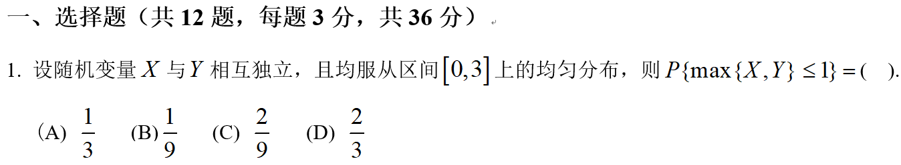

<!-- slide: 2 -->

- 解：
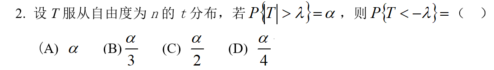

<!-- slide: 3 -->

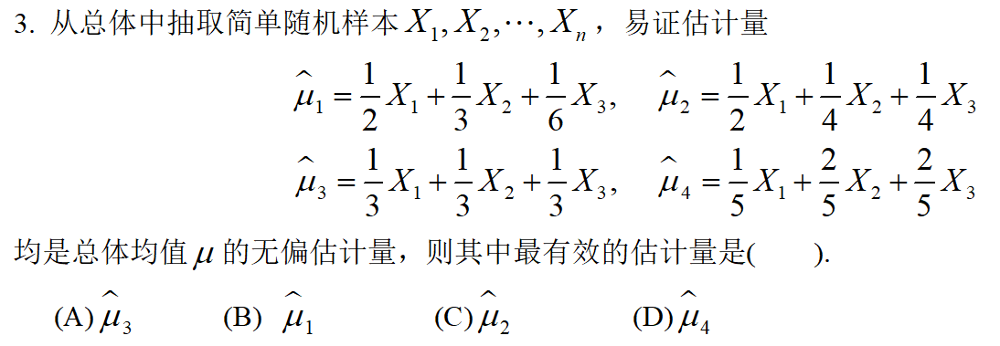
- 解：

<!-- slide: 4 -->

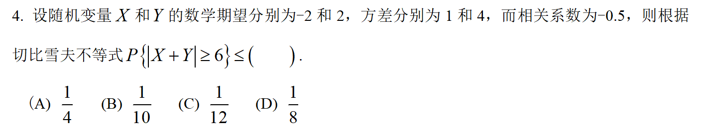
- 解：
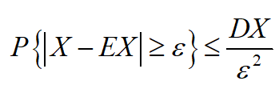

<!-- slide: 5 -->

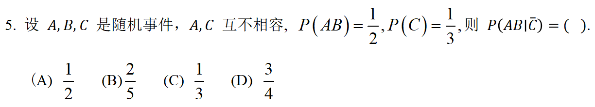
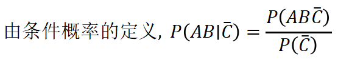
- 解：
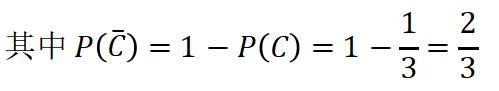
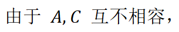
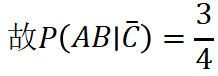

<!-- slide: 6 -->

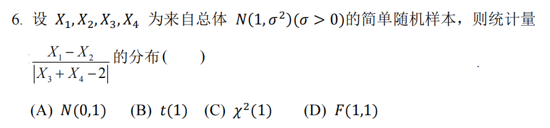
- 解：
- 且它们相互独立，
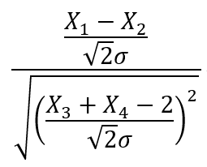
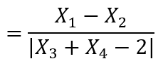
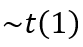

<!-- slide: 7 -->

- 解：
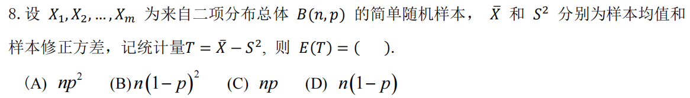
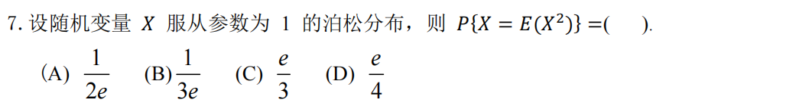
- 解：

<!-- slide: 8 -->

- 解：
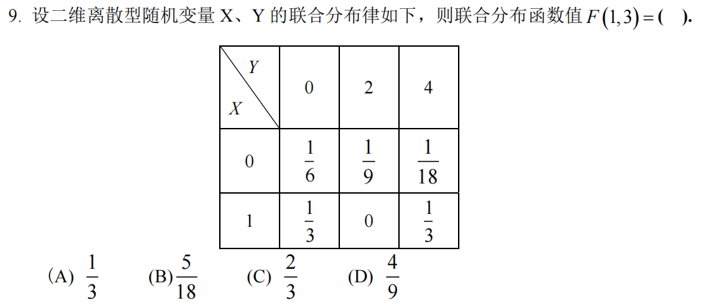
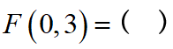

<!-- slide: 9 -->

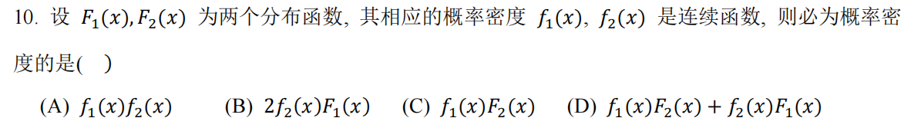
- 解：
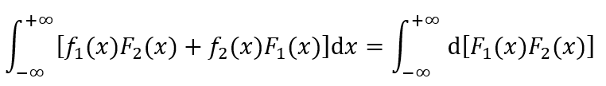
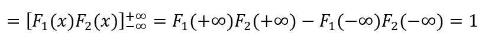
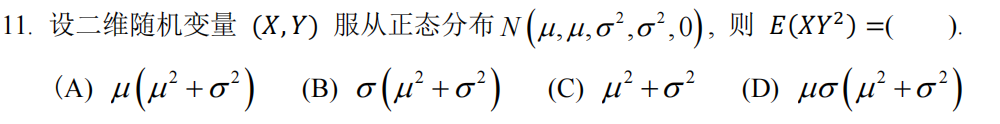
- 解：

<!-- slide: 10 -->

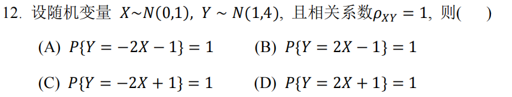
- 解：

<!-- slide: 11 -->

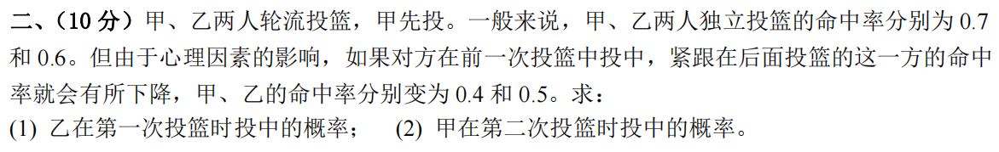
- 解：

<!-- slide: 12 -->

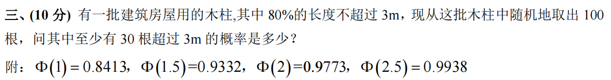
- 解：
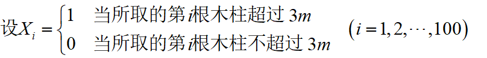
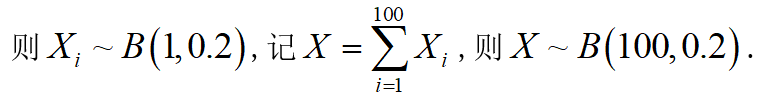

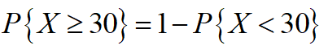
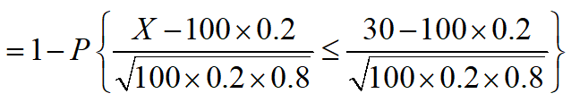
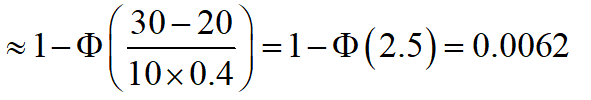

<!-- slide: 13 -->

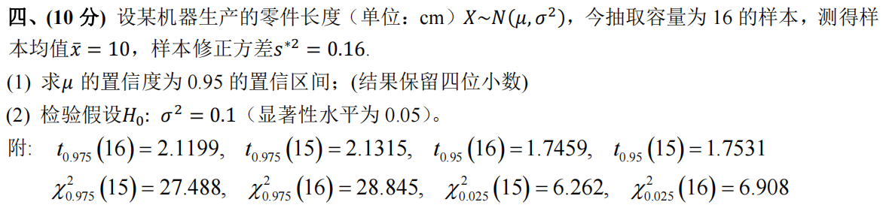
- 解：
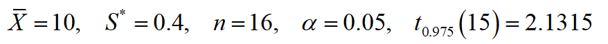
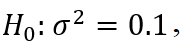
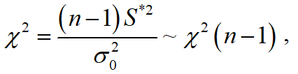
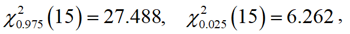
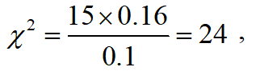

<!-- slide: 14 -->

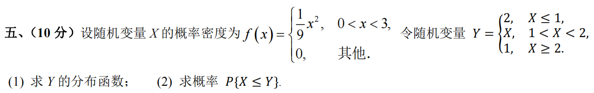
- 解：
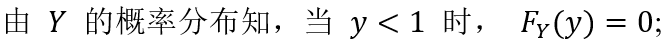
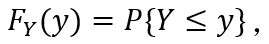
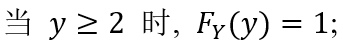
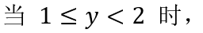
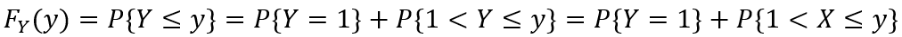
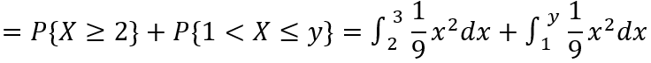
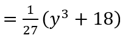
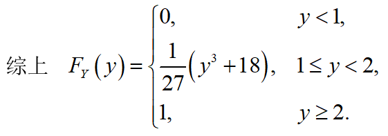

<!-- slide: 15 -->

- 解：
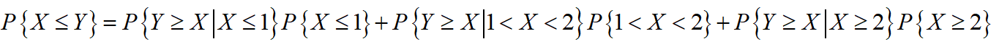
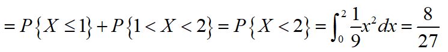

<!-- slide: 16 -->

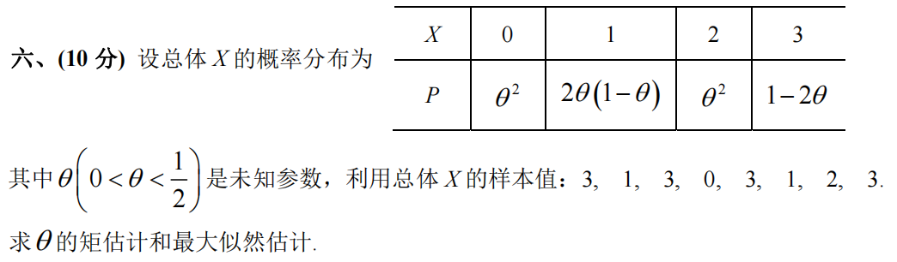
- 解：
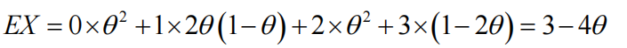
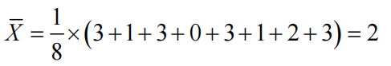

<!-- slide: 17 -->

- 解：

<!-- slide: 18 -->

- 解：

<!-- slide: 19 -->

- 解：

<!-- slide: 20 -->

- 解：

