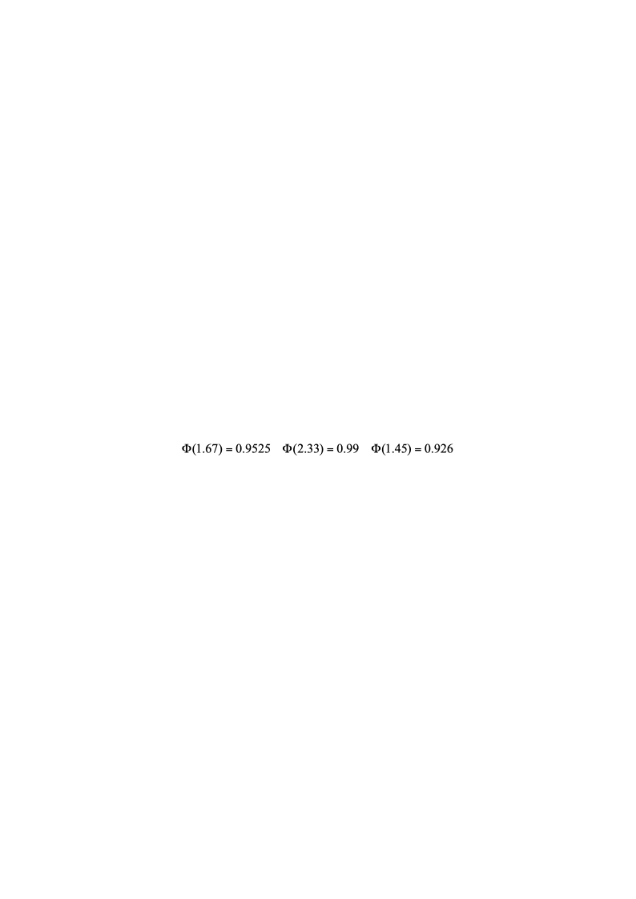
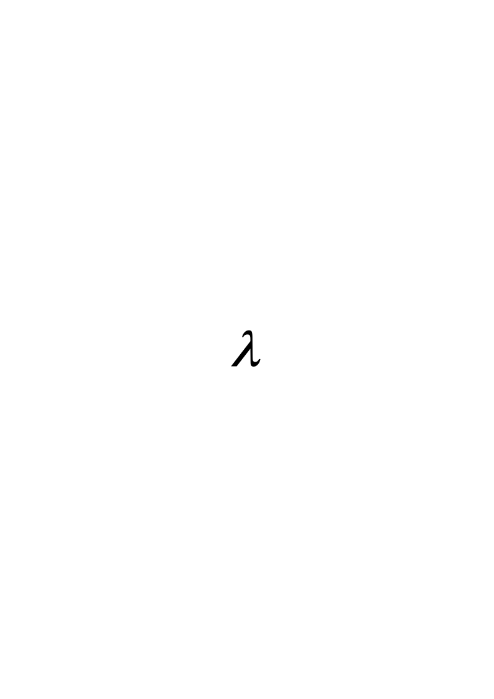
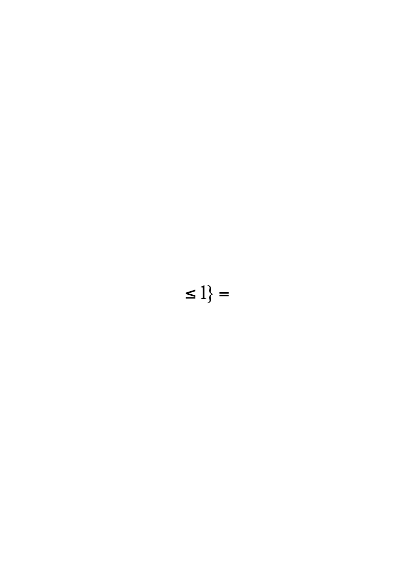
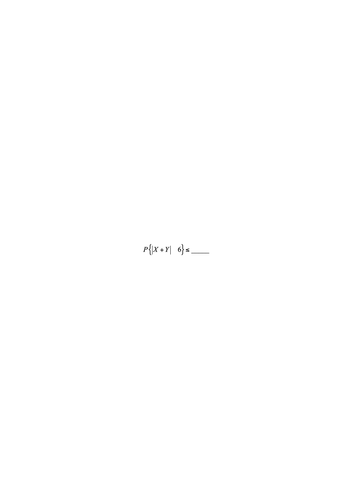
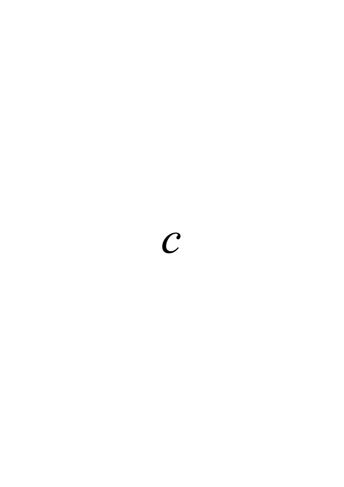
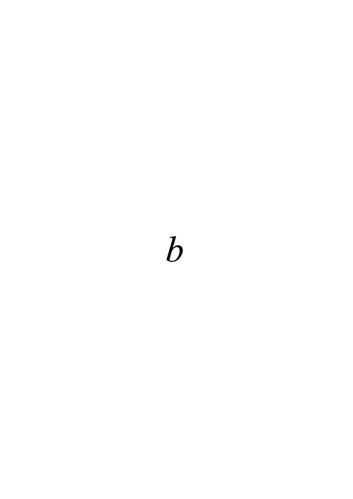

# 2013春-A无答案

**2012－2013学年第2学期《概率论与数理统计》期末试题（A卷）**

| 题号 | 一 | 二 | 三 | 四 | 五 | 六 | 七 | 八 | 总分 |
|---|---|---|---|---|---|---|---|---|---|
| 得分 |  |  |  |  |  |  |  |  |  |
| 评卷人 |  |  |  |  |  |  |  |  |  |

**注意：** ****

$$
t_{0.975}(7)=2.3646t_{0.95}(7)=1.8946t_{0.975}(8)=2.3060t_{0.95}(8)=1.8595
$$

$$
X_{0.95}^2(7)=14.067X_{0.05}^2(7)=2.167X_{0.95}^2(8)=15.507X_{0.05}^2(8)=2.733
$$

**一、填空题（每空3分，共15分）。**

1、设X服从参数为λ的泊松分布，且$E[(X-1)(X-2)]=1$，则=

2、设为来自总体$N(0,1)$的简单随机样本,$\overline{X}$为样本均值,$S^{2}$为样本方差,则$\frac{(n-1)X_1^2}{\sum_{i=2}^{n}X_i^2}$服从的分布是           .

3、设随机变量$X$与$Y$相互独立,且均服从区间$[0,3]$上的均匀分布,则      .

4、设随机变量$X$和$Y$的数学期望分别为-2和2,方差分别为1和4,而相关系数为-0.5,则根据契比雪夫不等式

5、设随机变量X1，X2，X3相互独立，其中X1在[0，6]上服从均匀分布，X2服从正态分布N（0，22），X3服从参数为=3的泊松分布，记Y=X1－2X2+3X3，则D（Y）=

**二、（10分）**从5双尺码不同的鞋子中任取4只，求下列事件的概率：

<!-- question: probability-theory-029-Q1 -->

（1）所取的4只中没有两只成对；（2）所取的4只中只有两只成对（3）所取的4只都成对

三、**(10分)**玻璃杯成箱出售，每箱20只。已知任取一箱，箱中0、1、2只残次品的概率相应为0.8、0.1和0.1，某顾客欲购买一箱玻璃杯，在购买时，售货员随意取一箱，而顾客随机地察看4只，若无残次品，则买下该箱玻璃杯，否则退回。试求：（1）顾客买下该箱的概率 ；（2）在顾客买下的该箱中，没有残次品的概率 。

**四、（15）**设二维随机变量的概率分布为

            -1           0           1

-1                          0        0.2

0        0.1                0.2

1         0     0.1        

其中、、为常数，且的数学期望,,记. 求  (1) 、、的值;   (2)的概率分布;   (3).

**五、（15）**设随机变量$X$的概率密度为

令$Y=X^{2}$,$F(x,y)$为二维随机变量$(X,Y)$的分布函数.

求(1)$Y$的密度函数$f_Y(y)$;	 (2) $cov(X,Y)$;		(3) $F\left(-\frac{1}{2},4\right)$.

**六、**（10分）设供电站供应某地区1000户居民用电，各户用电情况相互独立。已知每户每天用电量（单位：度）在[0，20]上服从均匀分布。现要以0.99的概率满足该地区居民供应电量的需求，问供电站每天至少需向该地区供应多少度电？

**七、**（10分）化肥厂用自动打包机装化肥，某日测得8包化肥的重量（斤）如下：

98.7  100.5  101.2  98.3  99.7  99.5  101.4  100.5

已知各包重量服从正态分布N（$\mu,\sigma^2$）

<!-- question: probability-theory-029-Q2 -->

（1）是否可以认为每包平均重量为100斤（取$\alpha=0.05$）？

<!-- question: probability-theory-029-Q3 -->

（2）求参数$\sigma^2$的90%置信区间。

**八、（15分）** 设总体$X$的密度函数是$f(x;\theta)=\frac{1}{2\theta}e^{-\frac{|x|}{\theta}}$，其中$\theta$>0是参数。样本$X_1,X_2,...,X_n$来自总体X。

<!-- question: probability-theory-029-Q4 -->

(1)  求$\theta$的矩估计$\hat{\theta}_M$；

<!-- question: probability-theory-029-Q5 -->

(2)  求$\theta$的最大似然估计$\hat{\theta}_L$；

(3)  证明$\hat{\theta}_L$是$\theta$的无偏估计，且$\hat{\theta}_L$是$\theta$的相合估计（一致估计）。
