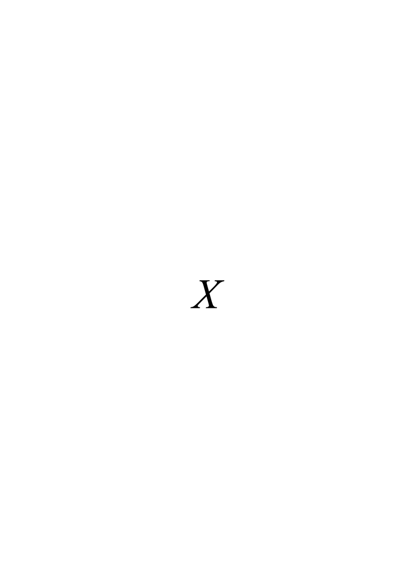
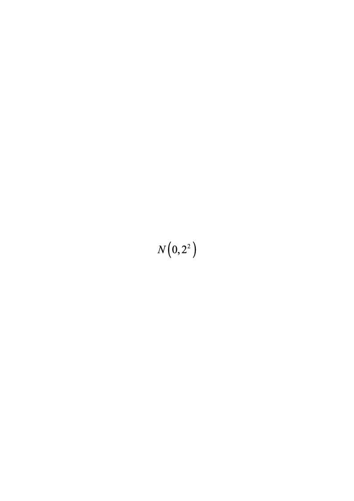
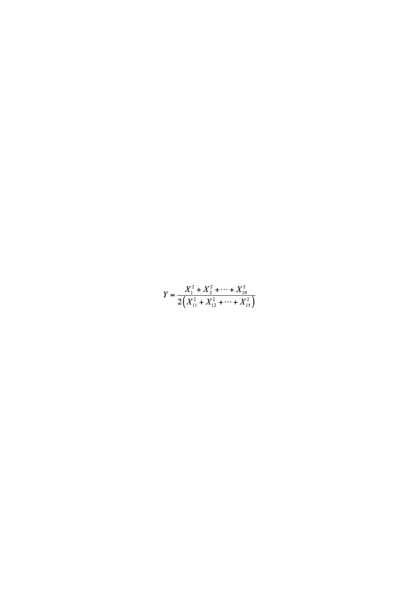
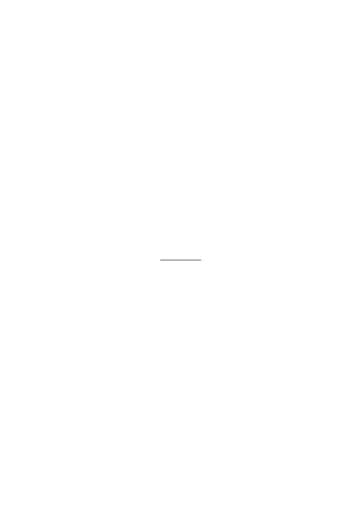
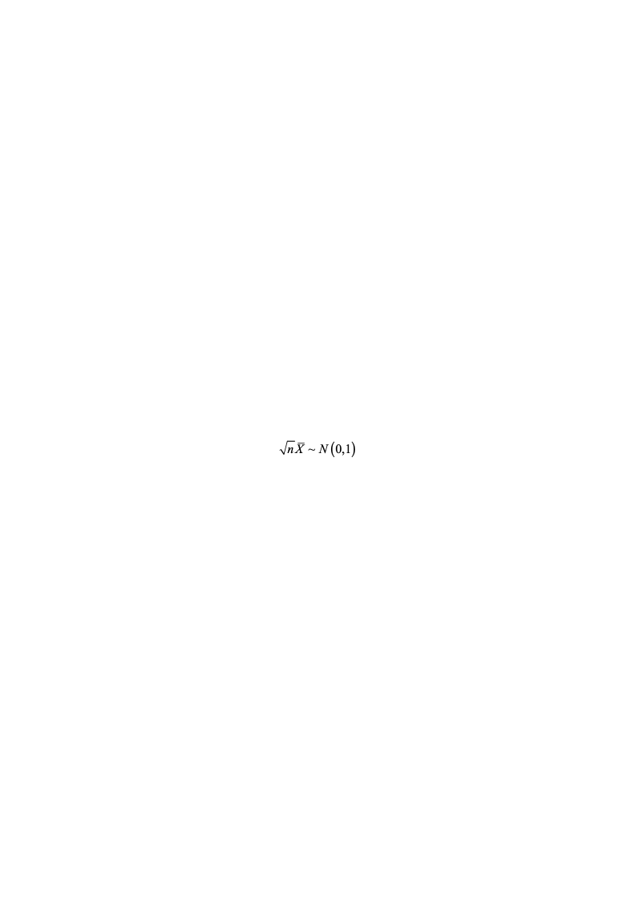
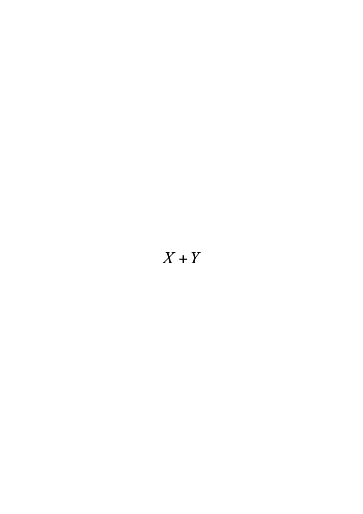
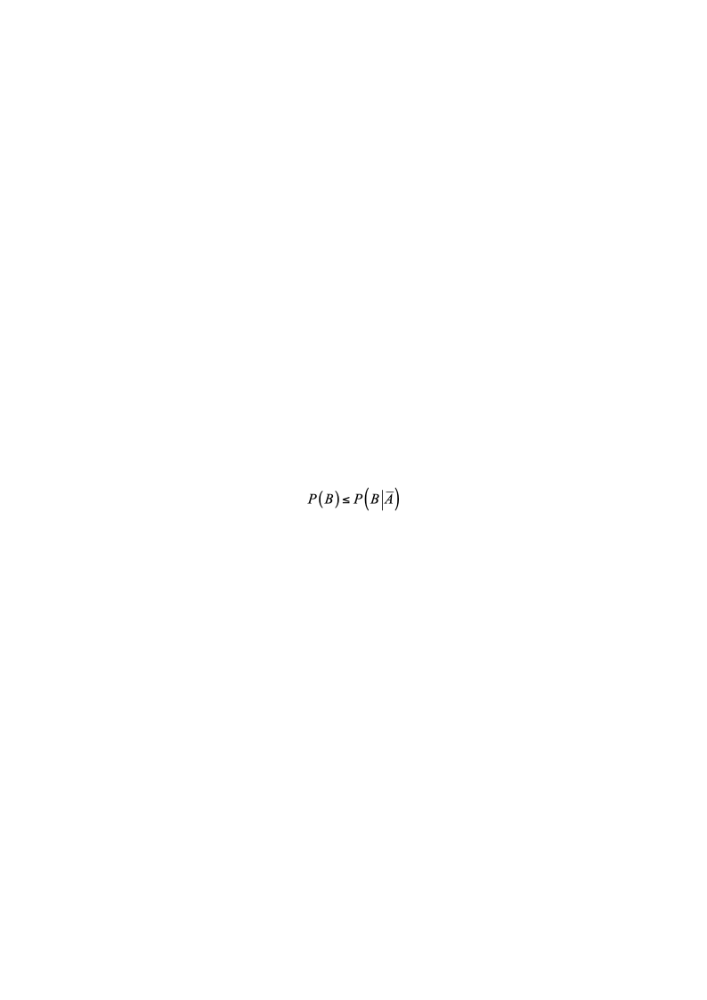
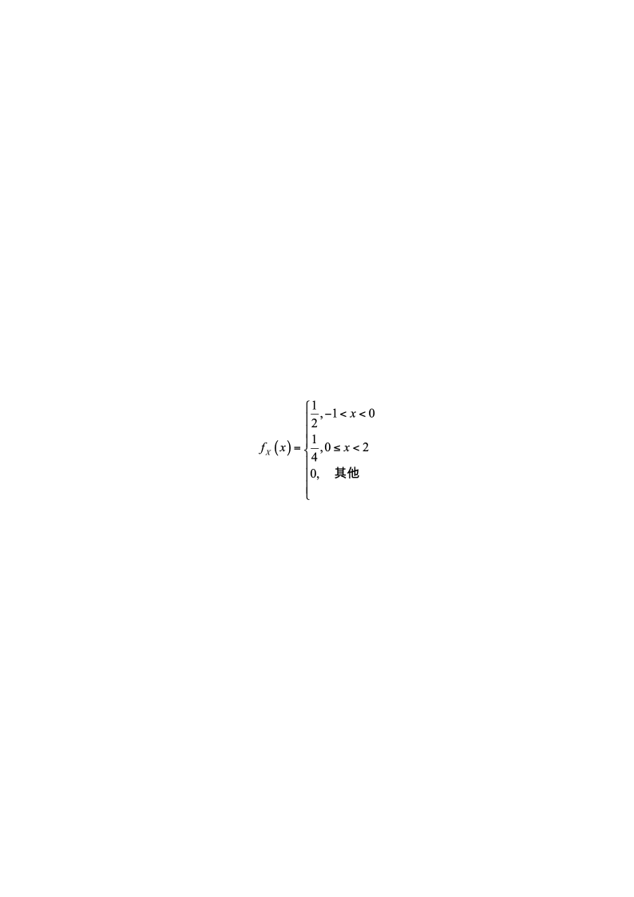

# 2016春季A卷无答案

**一、** **填空题（每小题3分，共18分）**

1．设随机变量和的数学期望分别为和2,方差分别为1和4,而相关系数为,则根据契比雪夫不等式       .

2．设总体服从正态分布,而是来自总体的简单随机样本,则随机变量

服从        分布,参数为         ..

3．设总体$X$的概率密度，其中参数$\sigma(\sigma>0)$未知，若$X_1,X_2,...,X_n$是来自总体$X$的简单随机样本，$\sigma=\frac{1}{n-1}\sum_{i=1}^{n}X_i$是$\sigma$的估计量，则$E(\sigma)=$_____________

4．设二维随即变量$(X,Y)$服从$N(\mu,\mu;\sigma^2,\sigma^2;0)$，则$E(XY^2)=$_____.

5．设随机变量$X$的分布函数，则$P\{X=1\}=$.

6．设随机变量$X$服从参数为1的泊松分布，则$P\left\{X=EX^2\right\}=$.

**二、单项选择题（每小题3分，共18分）**

1． 设$X_1,X_2,...,X_n$为总体的一个样本,  $\overline{X}$与$S^{2}$分别为样本均值和样本方差,则(    )成立.

(A)  $X_N(0,1)$                          (B)  

(C)  $\sum_{i=1}^{n}X_i^2\sim\chi^2(2n)$                       (D)  

2．设随机变量和都服从标准正态分布,则(    ).

(A)服从正态分布                        (B)服从分布

(C)和都服从分布                  (D)服从分布

3．设随机事件A，B满足且$0<P(A)<1$，则必有（  ）

（A）$P(A)P(A|A∪B)$       （B）

（C）$P(B)P(B|A)$           （D）

4. 设是总体的样本,  $S^{2}$是样本方差,则  (    ).

(A)  $\frac{1}{5}\sigma^2$           (B)                  (C)$\frac{2}{5}\sigma^2$                (D)  $\frac{5}{18}\sigma^{4}$

5. 随机变量$X~N(0,1)$，$Y~N(1,4)$且相关系数，则（   ）

 $P\{Y=-2X-1\}=1$.			$(B)$$P\{Y=2X-1\}=1$.

$(C)$$P\{Y=-2X+1\}=1$.			$(D)$$P\{Y=2X+1\}=1$.

6.  某人向同一目标独立重复射击，每次射击命中目标的概率为$p(0<p<1)$，则此人第4次射击恰好第2次命中目标的概率为

（A）$3p(1-p)^2$							（B）$6p(1-p)^2$

（C）$3p^{2}(1-p)^{2}$						（D）$6p^{2}(1-p)^{2}$

**三、(10分）**箱中装有6个球，其中红、白、黑球的个数分别是1，2，3个，现从箱中随机地取出2个球，记$X$为取出的红球个数，$Y$为取出的白球个数.

（Ⅰ）求随机变量$(X,Y)$的概率分布；（Ⅱ）求$Cov(X,Y)$.

**四、（8分）**已知男子中有5%是色盲患者，女子中有0.25%是色盲患者，若从男女人数相等的人群中随机地挑选一人，恰好是色盲患者，问此人是男性的概率是多少？

**五.（12分）** 设随机变量$X$的概率密度为，令$Y=X^{2}F(x,y)$为二维随机变量$(X,Y)$的分布函数.

(Ⅰ)求$Y$的概率密度$f_Y(y)$;(Ⅱ)$Cov(X,Y)$；(Ⅲ)　　$F\left(-\frac{1}{2},4\right)$.

**六．（8分）** 某地某种商品在一家商场中的月消费额～N(*μ*,σ2),且已知σ=100元。现商业部门要对该商品在商场中的平均月消费额*μ*进行估计，且要求估计的结果须以不小于95%的把握保证估计结果的误差不超过20元，问至少需要随机调查多少家商场？

**$\Phi(1.65)=0.95\quad\Phi(1.96)=0.975\quad\Phi(1.45)=0.926\quad\Phi(1.40)=0.92$**

**七、(16分)**、设总体$X$服从$[0,\theta]$的均匀分布, $X_1,X_2,...,X_n$是来自$X$的样本.

(1)求$\theta$的矩估计量$\hat{\theta}_1$; (2)求$\theta$的最大似然估计$\hat{\theta}_{2}$; (3)证明$\hat{\theta}_1$,$T_1=\frac{n+1}{n}\hat{\theta}_2$和$(n+1)\min_{i=1}^{n}X_i$均是$\theta$的无偏估计量。

**八．**（10分）

化肥厂用自动打包机装化肥，某日测得8包化肥的重量（斤）如下：

98.7  100.5    101.2  98.3  99.7  99.5  101.4  100.5

已知各包重量服从正态分布N（$\mu,\sigma^2$）

（1）是否可以认为每包平均重量为100斤（取$\alpha=0.05$）？

（2）求参数$\sigma^2$的90%置信区间。

可能用到的分位点：

$t_{0.99}^{\prime}(7)=2.998,t_{0.95}^{\prime}(7)=1.895,t_{0.975}^{\prime}(7)=2.3646,t_{0.95}^{\prime}(6)=1.943$       $X_{0.95}^{2}(7)=14.067X_{0.05}^{2}(7)=2.167X_{0.95}^{2}(6)=12.592X_{0.05}^{2}(6)=1.635$
