# 2020概率论与数理统计A卷 答案

**诚信应考，考试作弊将带来严重后果！**

**华南理工大学本科生期末考试**

**2019-2020-2学期《概率论与数理统计》试卷(A卷)**

**注意事项：1. 开考前请将密封线内各项信息填写清楚；**

**2. 所有答案请直接答在试卷上；**

**3．考试形式：闭卷；**

**4. 本试卷共八大题，满分100分，考试时间120分钟**。

| **题 号** | **一** | **二** | **三** | **四** | **五** | **六** | **七** | **八** | **总分** |
|---|---|---|---|---|---|---|---|---|---|
| **得 分** |  |  |  |  |  |  |  |  |  |

**一、选择题（共6题，每题3分，共18分）**

1.若*P*(*AB*)=0，则下述命题中正确的是（ B ）。

A．*A*与*B*互不相容；                B. 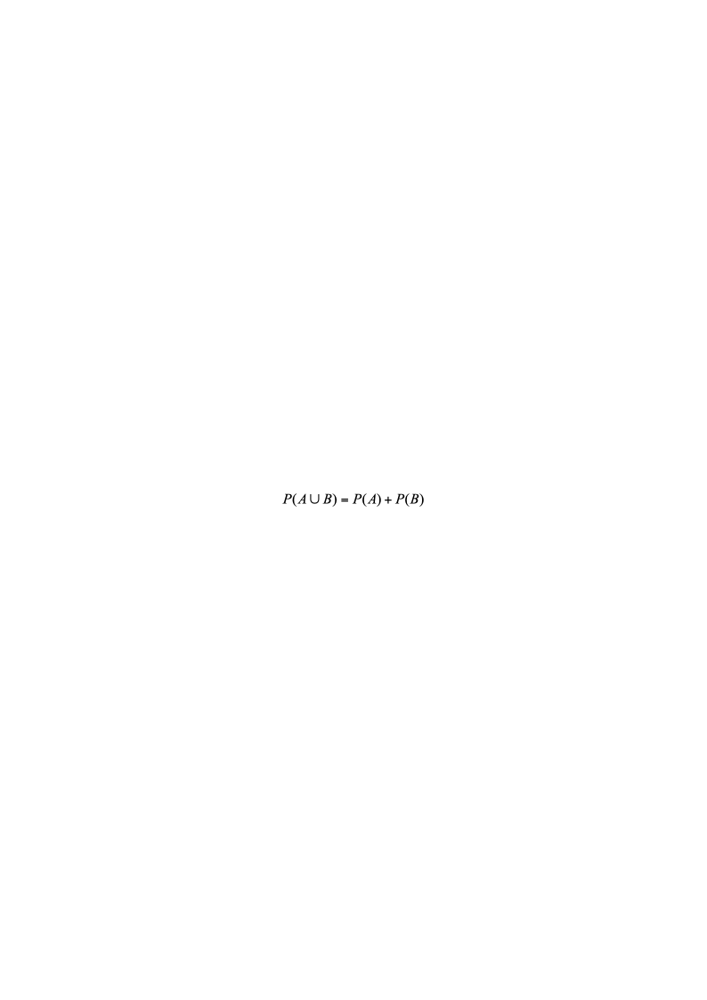 ；

C. *A*与*B*相互独立；         D. $P(A)=0$或$P(B)=0.$

2.设,且*X*与*Y*相互独立，则（  D      ）。

A.  $P(X+Y\leq0)=\frac{1}{2};$         B. $P(X-Y\leq1)=\frac{1}{2};$

C．$P(X-Y\leq0)=\frac{1}{2};$	 D．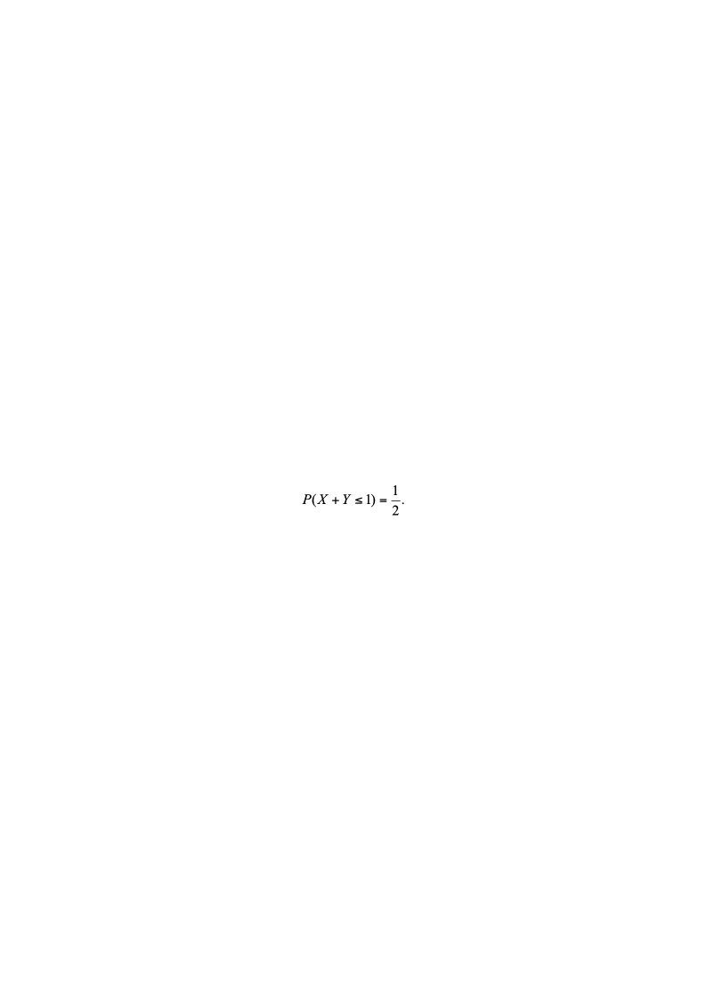

3.设总体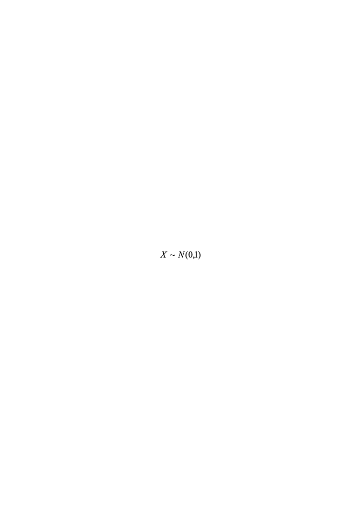，$X_{1},X_{2}$是总体*X*的一个样本，令$Y=\frac{X_1}{|X_2|}$，则*Y*服从(    C      )。

A.正态分布；      B.$χ^{2}$分布；      C.*t*分布；      D. *F*分布.

4.设$X_1,X_2,X_3$独立同分布，分布函数为*F*(*x*),令$Y=\min\{X_1,X_2,X_3\}$，则$P(Y\leq1)=$（  B  ）。

A.$1-(F(1))^3;$         B. $1-(1-F(1))^3;$       C. $(F(1))^3;$       D. $(1-F(1))^3.$

5.设随机变量$X$的密度函数为$f(x)=\frac{1}{2\sqrt{\pi}}e^{-\frac{x^{2}}{4}}$，则$Y=2X$的密度函数为（  B  ）。

A. $\frac{1}{2\sqrt{\pi}}e^{-y^{2}/16}$；       B. $\frac{1}{4\sqrt{\pi}}e^{-y^{2}/16}$；      C. $\frac{1}{2\sqrt{\pi}}e^{-y^{2}/8}$；            D. $\frac{1}{2\sqrt{2\pi}}e^{-\frac{y^{2}}{8}}$.

6. 设随机变量*X*服从*t*分布*t*(*n*)，对给定的$\alpha(0<\alpha<1)$，数$t_{\alpha}(n)$满足$P(X>t_{\alpha}(n))=\alpha$，若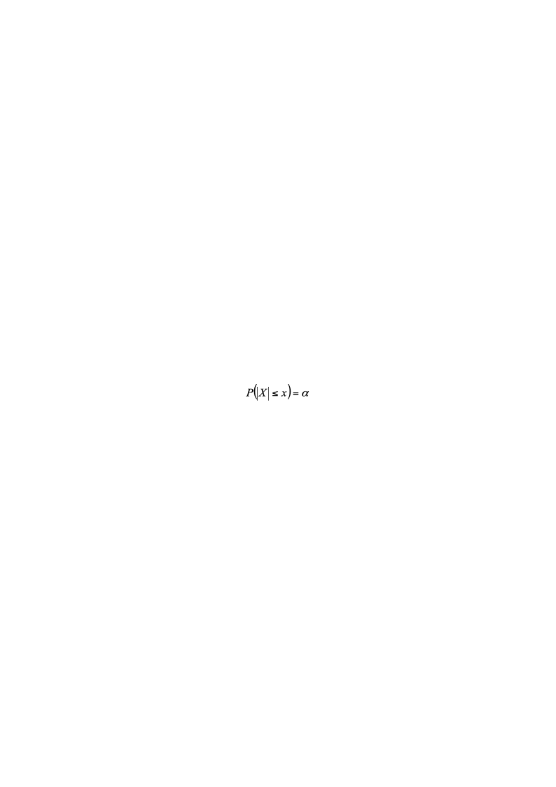，则*x*等于(  A  )。

A．$t_{\frac{1-\alpha}{2}}(n)$ ;       B. $t_{1-\frac{\alpha}{2}}(n)$ ;           C. $t_{\alpha/2}(n)$ ;            D.  $t_{1-\alpha}(n).$

**二、填空题（共6题，每题3分，共18分）。**

1. 设随机变量*X*和*Y*的期望分别为$-1$和1，方差分别为1和2，且

*X*和*Y*相互独立，用切比雪夫不等式估计$P(X+Y|3)\leq$       。$\frac{1}{3}$

2. 设随机变量*X*的分布函数为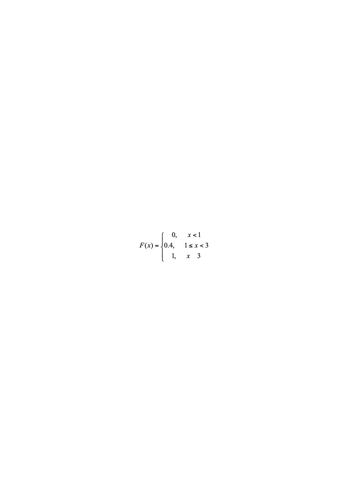，则$P(X<2|X!=1)$＝  0   。

3. 若二维随机向量(*X*,*Y*)~*N*(1,2,4,9,0)，则$Var[X-2Y+1]=$   40    。

4. 设$X_1,X_2,...,X_n$是来自总体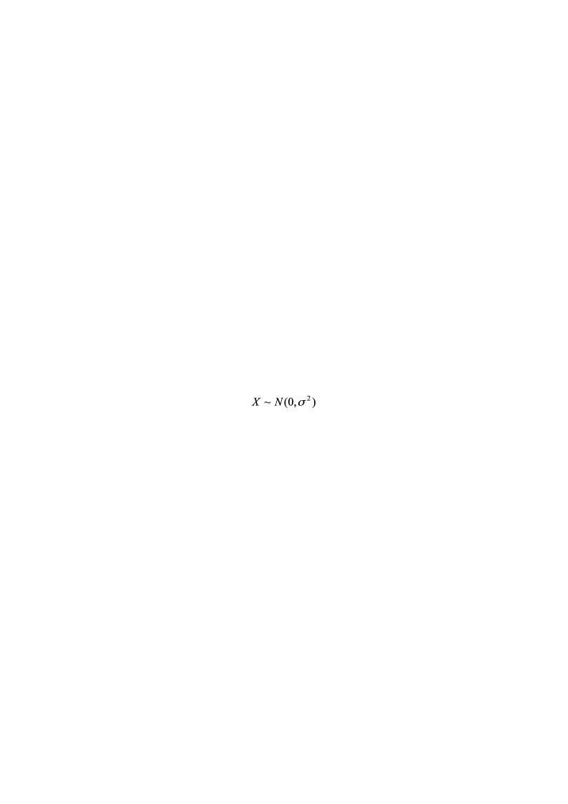的样本，若$\sigma^2=a\sum_{i=1}^{n}X_i^2$是$\sigma^2$的无偏估计，则*a*=       $\frac{1}{n}$。

5. 设$X_{1},\cdots,X_{4}$是来自总体的样本，令$Y=\frac{1}{2}(X_1-X_2)^3+\frac{1}{2}(X_3+X_4)^3$，则*E*[*Y*]＝       4    。

6.  已知*X*,*Y*满足$E[X]=1,Var[X]=9,E[Y]=0,Var[Y]=16,$相关系数$r(X,Y)=\frac{1}{2}$设随机变量$Z=\frac{X}{3}+\frac{Y}{2}$，则*X*与*Z*的协方差Cov(*X*,*Z*)=   0    。

**三、（10分）** 在房间里有10个人，分别佩戴从1号到10号的纪念章，任选3人记录其纪念章的号码。试求：(1)  最大号码为5的概率；

(2)  如果已知记录的最大号码为5，求记录的三个号码中有3的概率？

**解：(1)*****A*****={记录的最大号码为5}，**

**$P(A)=\frac{C_4^2}{C_{10}^3}=\frac{1}{20}$；**                          **（5分）**

**（2）*****B*****={记录的号码中有3}，**

**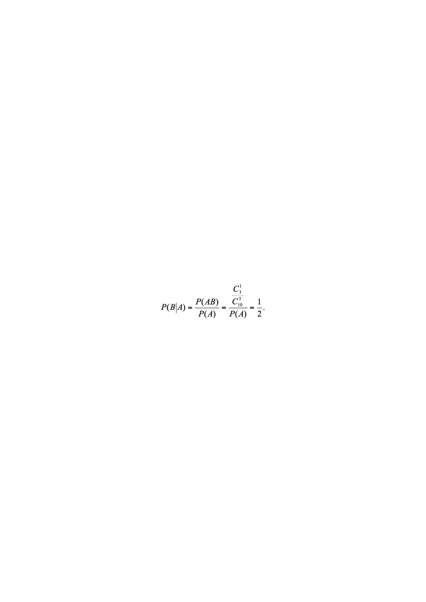**                 **（10分）**

**四、(** **10分)**

设某面粉厂采用自动流水线灌装面粉，装袋重量.从中随机地抽取36袋，经计算得平均重量为$x$24.92kg，修正标准差$s_n^*=1.974$kg.

(1)  在置信度为0.95时，求出面粉重量平均值$mu$的置信区间。

(2)  在显著性水平$alpha$=0.05下，检验是否可以认为该流水线面粉的平均重量为每袋25kg。$t_{0.975}(35)=2.0301t_{0.975}(36)=2.0281t_{0.95}(35)=1.6896t_{0.95}(36)=1.6883$

**解：（1）**$mu$的置信度为0.95的置信区间为：

$\left[\overline{X}-t_{\frac{\alpha}{2}}(n-1)\cdot\frac{s_n^*}{\sqrt{n}},\overline{X}+t_{\frac{\alpha}{2}}(n-1)\cdot\frac{s_n^*}{\sqrt{n}}\right]$                 **（2分）**

$$
I_{-\frac{\alpha}{2}}(n-1)\cdot\frac{s_n^*}{\sqrt{n}}=t_{0.975}(35)\cdot\frac{s_n^*}{\sqrt{36}}=2.0301\times\frac{1.974}{6}=0.668
$$

得置信区间为[24.252,25.588].                            **（5分）**

**(2)** 1.  提出假设  $H_{0}:\mu=\mu_{0}=25;H_{1}:\mu\neq\mu_{0}.$

2. 构造统计量 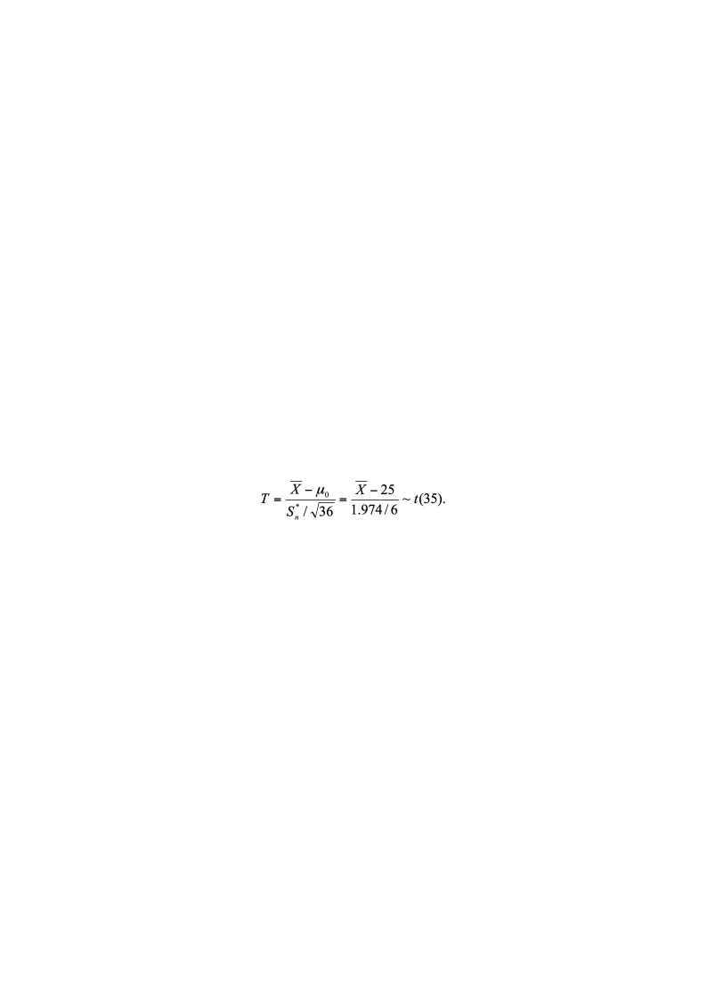

3.  求分位点  $P(T|_{0.975}(35))=0.05,t_{0.975}(35)=2.0301.$       **（8分）**

4. 求观测值  $T=\frac{24.92-25}{1.974/6}\frac{-0.08}{0.329}=-0.2432.$

5.  作判断 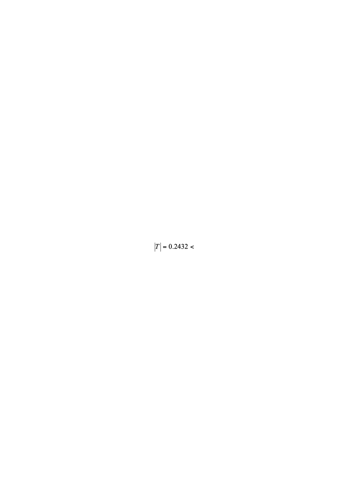$f_{0.975}(35)=2.0301$，接受$H_0$，即认为平均重量为每袋25kg。

**（10分）**

**五、（10分）**

抽样检查产品质量时，如果发现有多于10个的次品，则拒绝接受这批产品.设某批产品的次品率为10%，试用中心极限定理来判断，至少应抽取多少个产品来检查，才能保证拒绝接受该产品的概率达到0.95？

$$
\Phi(1.285)=0.9,\quad\Phi(1.645)=0.95,\quad\Phi(1.96)=0.975,\quad\Phi(2.33)=0.99
$$

**解：**设应抽*n*个产品来检查，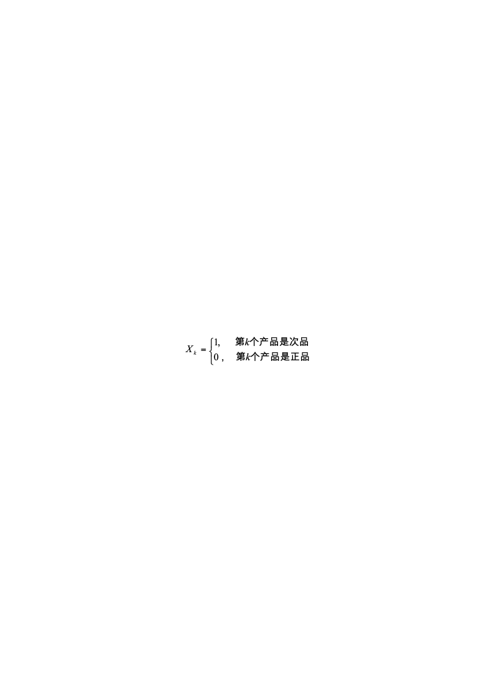.

**$P(X_k=1)=0.1,\sum_{k=1}^{n}X_k~B(n,0.1)$**，求*n*使得$P(\sum_{k=1}^{n}X_k>10)=0.95$。

由中心极限定理知：$\sum_{k=1}^{n}X_k$近似服从正态分布$N(0.1n,0.09n)$，          **（2分）**

$$
P(\sum_{i=1}^{n}X_i>10)=1-\Phi\left(\frac{10-0.1n}{\sqrt{0.09n}}\right)=0.95\Rightarrow\Phi\left(\frac{10-0.1n}{\sqrt{0.09n}}\right)=0.05\Rightarrow\Phi\left(\frac{0.1n-10}{0.3\sqrt{n}}\right)=0.95,
$$

**（7分）**

所以，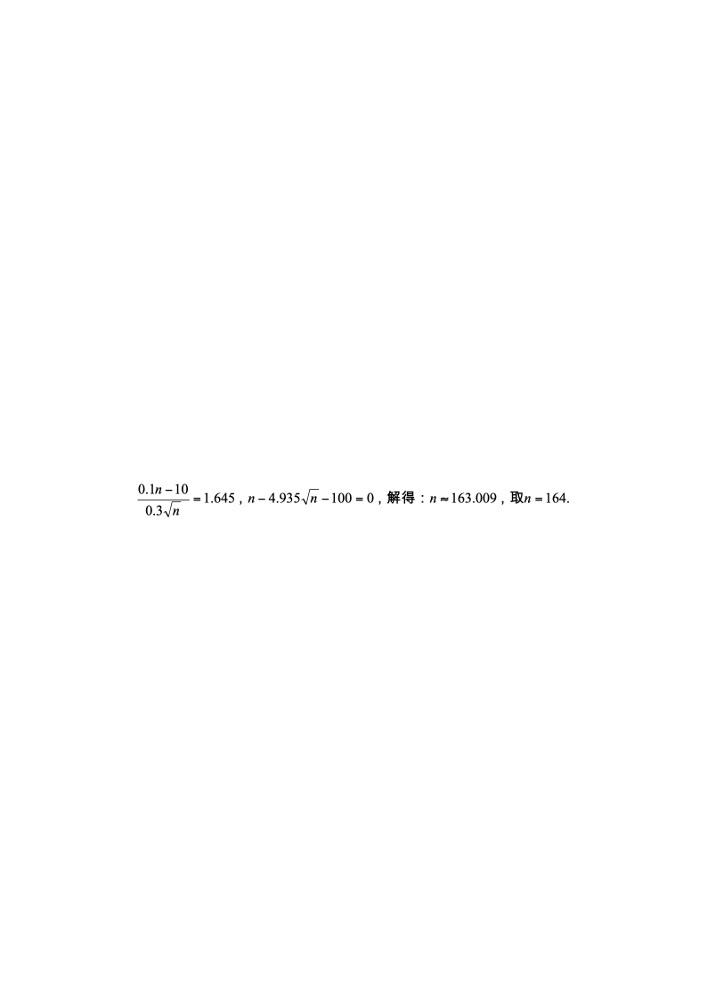

至少抽取164个产品来检查，才能保证拒绝接受该产品的概率达到0.95。

如果用$P(\sum_{k=1}^{n}X_k>11)=0.95$来算的话，得到*n*=176.

**（10分）**

**六、（10分）**

设二维随机向量（$X,Y$）服从矩形区域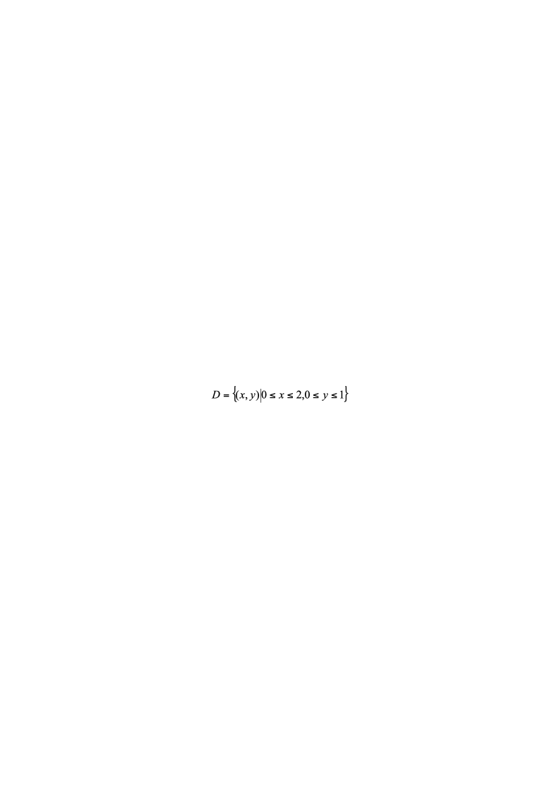上的均匀分布，且

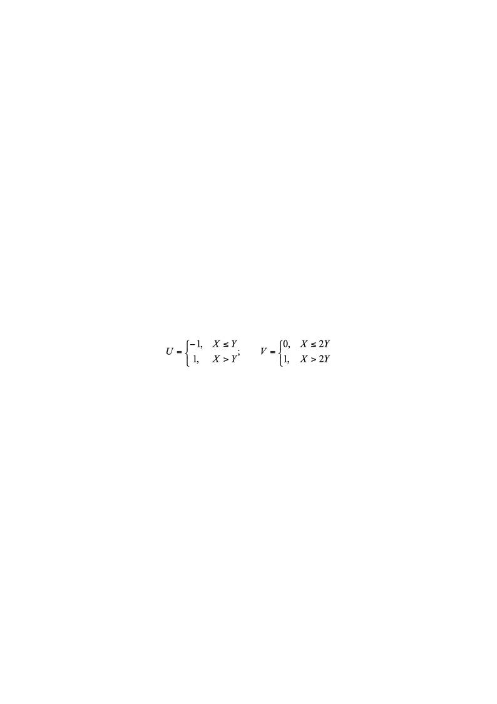.

求(1)$P(U=-1);$              (2)  *U*，*V*的联合分布;          (3)*W*=*U**V*的分布列.

**解：**（因为（$X,Y$）是均匀分布，用面积来做更好做）

**（1）$P(U=-1)=P(X<=Y)=\int_{0}^{1}\int_{2}^{1}\frac{1}{2}dydx=\frac{1}{4}.$**                         **（3分）**

**（2）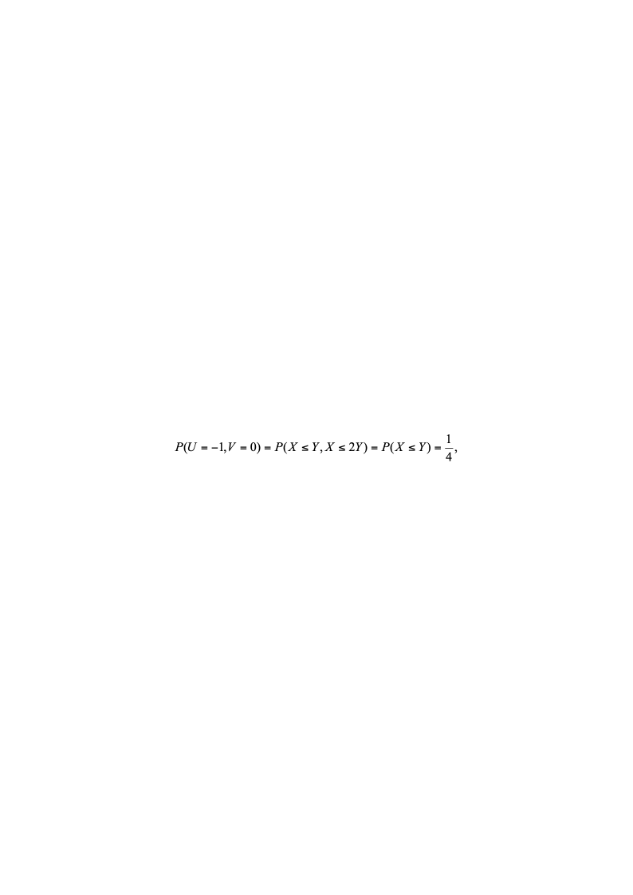**

**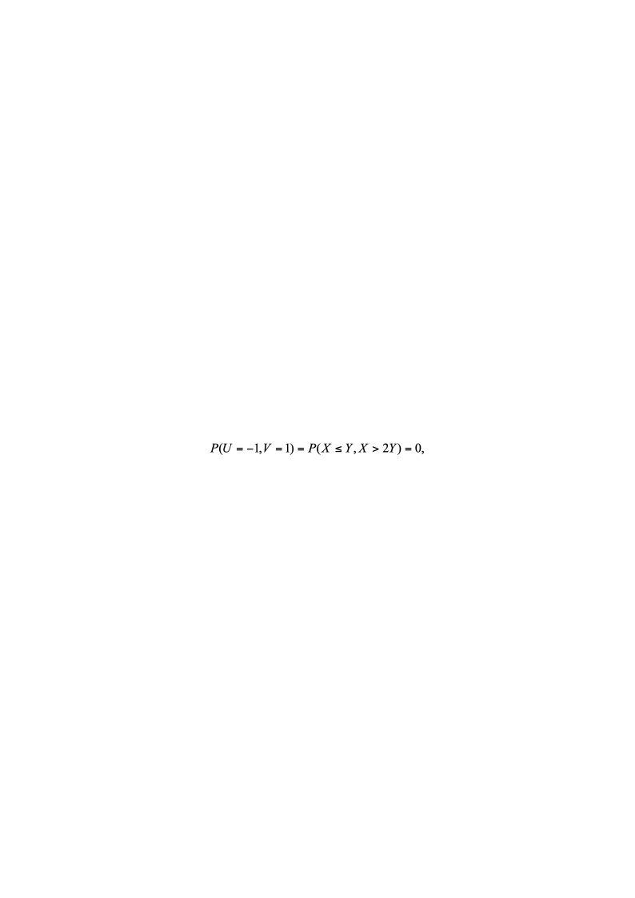**

**$P(U=1,V=0)=P(X>Y,X<=2Y)=P(Y<X<=2Y)=\frac{1}{4}$**

**$P(U=1,V=1)=P(X>Y,X>2Y)=P(X>2Y)=\frac{1}{2}.$**

| ***V*** ***U*** | 0 | 1 |
|---|---|---|
| **$-1$** | **$\frac{1}{4}$** | 0 |
| 1 | **$\frac{1}{4}$** | **$\frac{1}{2}$** |

**（8分）**

**(3)**

| *W*=*U**V* | 0 | 1 |
|---|---|---|
| *P* | **$\frac{1}{2}$** | **$\frac{1}{2}$** |

**（10分）**

**七、（12分）**

设随机变量(*X*,*Y*)的概率密度函数为

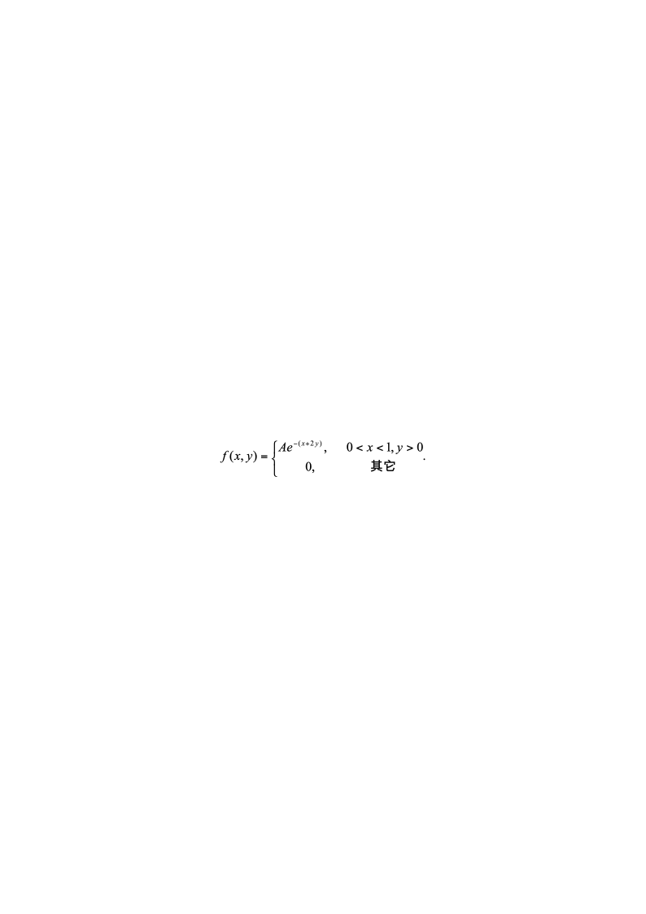

（1）求*A*的值；  （2）判断*X*，*Y*是否独立； （3）期望*E*[2*XY*].

**解：（1）$\int_{-\infty}^{\infty}\int_{-\infty}^{\infty}f(x,y)dxdy=\int_{0}^{\infty}\left(\int_{0}^{\infty}Ae^{-(x+2y)}dy\right)dx=\frac{A}{2}\int_{0}^{\infty}e^{-x}dx=\frac{A}{2}(1-e^{-1})=1,$**

所以，**$A=\frac{2}{1-e^{-1}}.$**                                           **（3分）**

**（2）***X*的边缘密度**$f_X(x)=\int_{0}^{x}f(x,y)dy=\int_{0}^{x}\frac{2}{1-e^{-1}}e^{-(x+2)y}dy=\frac{1}{1-e^{-1}}e^{-x},(0<x<1)$**，

**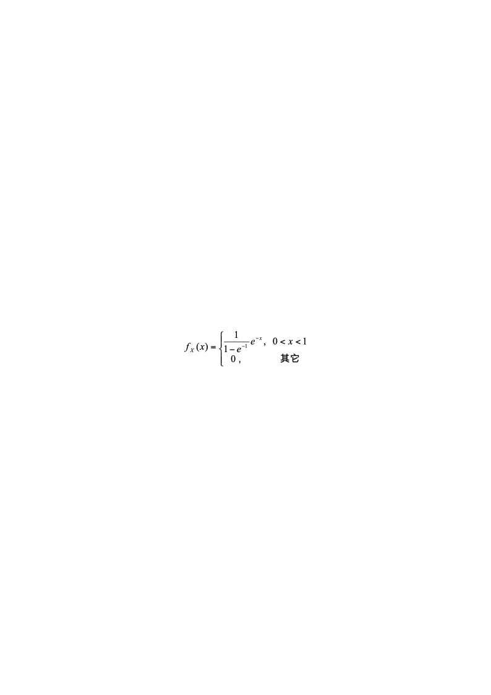.**

*Y*的边缘密度**$f_{Y}(y)=\int_{-\infty}^{+\infty}f(x,y)dx=\int_0^12\frac{1}{1-e^{-1}}e^{-(x+2)^2}dx=2e^{-2^2},(y>0)$**，

**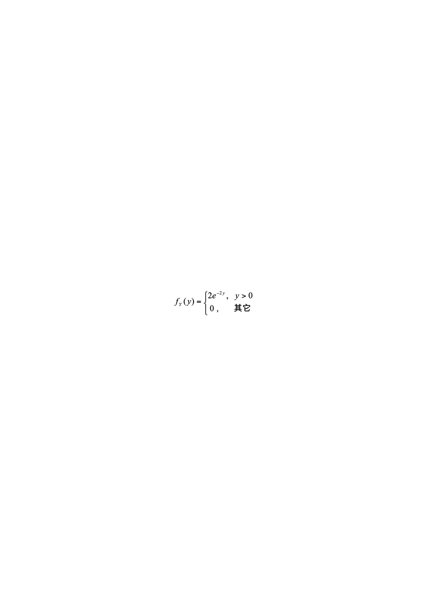.**

由于**$f(x,y)=f_x(x)f_y(y),$**所以*X*,*Y*独立。                          **（8分）**

**（3）**$E[2XY]=2E[XY]=2E[X]E[Y]$  （由(2)知*X*，*Y*相互独立）

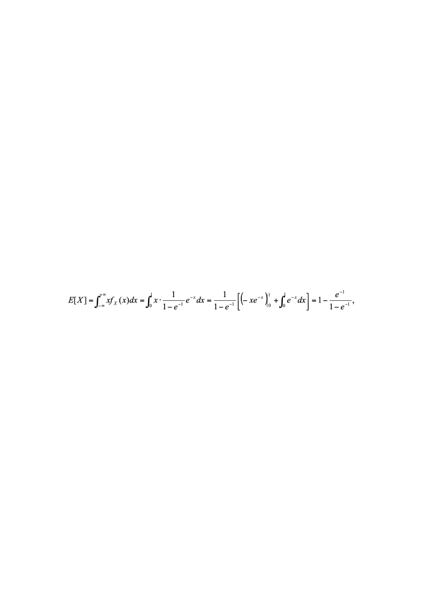

注意*Y*服从参数为2的分布，所以$E[Y]=\frac{1}{2}$

由上计算知：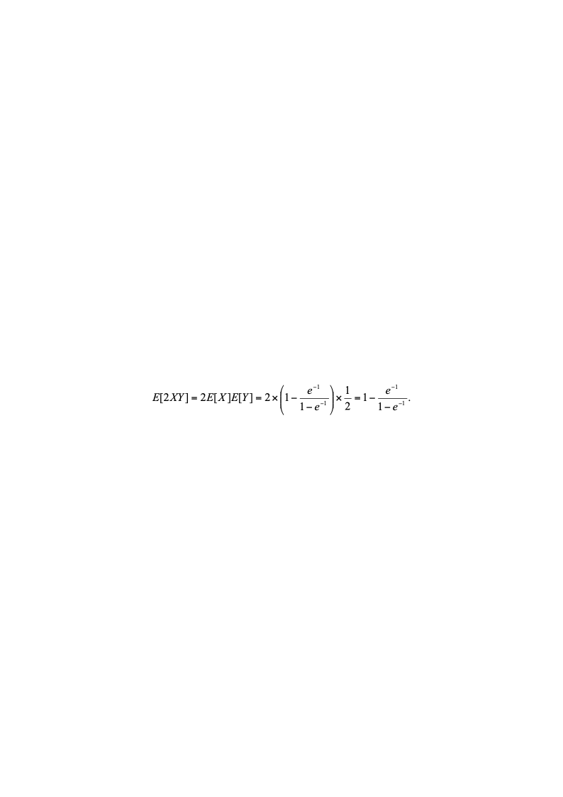

（若没有注意到*X*,*Y*的独立性，也可以直接计算）

**（12分）**

**八、(12分)**

设总体$X$具有分布律

| *X* | 1 | 2 | 3 |
|---|---|---|---|
| *P* | $\theta^2$ | $2\theta(1-\theta)$ | $(1-\theta)^{2}$ |

其中$\theta(0<\theta<1)$为未知参数.
1. 求$\theta$的矩估计量$\hat{\theta}_M$,并讨论$\hat{\theta}_M$的无偏性；
1. 当样本观察值为$x_1=1,x_2=2,x_3=1,x_4=1,x_5=3$时，求$\theta$的极大似然估计值.

**解：（1）**$E[X]=1\times\theta^{2}+2\times2(1-\theta)+3\times(1-\theta)^{2}=3-2\theta;$

$$
=>3-2\theta-\overline{X}=\hat{h}_{M}=\frac{1}{2}(3-\overline{X}).
$$

**$E[\hat{\theta}_u]=E\left[\frac{1}{2}(3-X)\right]=\frac{3}{2}-\frac{1}{2}E[X]=\frac{3}{2}-\frac{1}{2}(3-2\theta)=\theta,$**

所以，$\hat{\theta}_M$是$\theta$的无偏估计.                                **（6分）**

**(2)** 似然函数：$L(\theta)=P(X_1=x_1,X_2=x_2,\cdots,X_5=x_5)$

$$
P(X_1=1)P(X_2=2)P(X_3=1)P(X_4=1)P(X_5=3)
$$

$$
=\theta^{2}\cdot2\theta(1-\theta)\cdot\theta^{2}\cdot\theta^{2}\cdot(1-\theta)^{2}=2\theta^{7}(1-\theta)^{3}.
$$

取对数：$\ln(L(\theta))=\ln(2\theta^7(1-\theta)^3)=\ln2+7\ln\theta+3\ln(1-\theta).$

求导数：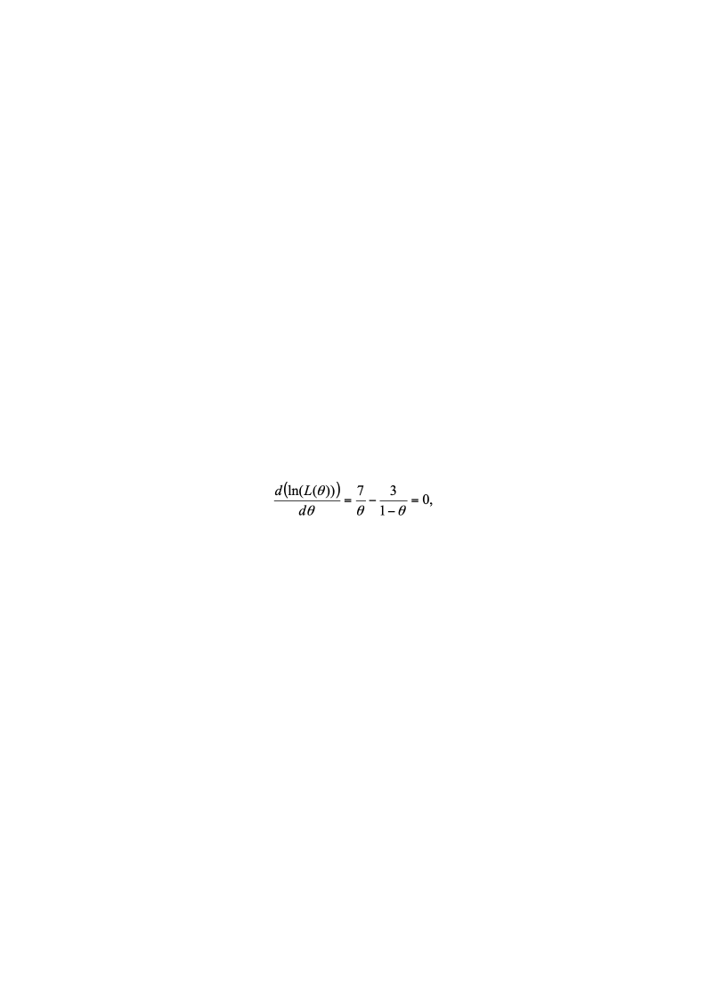

$$
7-7\theta=3\theta\Rightarrow\theta=\frac{7}{10}
$$

所以，$\theta$的极大似然估计值为$\theta=\frac{7}{10}$                        **（12分）**
