# 信号处理与通信基础-实验手册-v2-2025

信号处理与通信基础实验手册

（v2版本）

目录

实验一 用MATLAB演示采样频率对波形混叠的影响	1

实验二  PCM编码与解码仿真	6

实验三 用MATLAB验证单位脉冲序列的时移特性	12

实验四 线性分组码的差错控制系统仿真	21

附录1 SIMULINK操作示例	29

实验一 用MATLAB演示采样频率对波形混叠的影响

**一、实验目的**

直观理解奈奎斯特采样定理：采样频率≥2×信号频率。

观察欠采样导致的频率混叠（alias）现象。

学会用MATLAB改变采样频率并快速绘图。

**二、实验要求**

1.独立完成实验内容；

2.实验报告要求：

(1) 记录实验步骤和过程，回答实验内容和步骤中的所有问题；

(2) 总结本次实验遇到了哪些问题，你是怎么解决的？

(3) 产生一个80 Hz的连续正弦波,分别在200 Hz（满足奈奎斯特）和120 Hz（不满足）两种采样频率下采样。画出两种采样结果，比较波形差异，并说明哪一组出现了混叠。

**三、实验原理**

根据奈奎斯特定理，若采样频率Fs < 2f，高频信号会被“折叠”成低频，即 f_alias = |Fs – f| 或|2Fs – f| …

80 Hz信号在Fs = 120 Hz时，f_alias = |120 – 80| = 40 Hz，因此本应80 Hz 的波形会表现为40 Hz。

**四、实验内容与步骤**

启动MATLAB，新建脚本。

逐段运行以下代码（或一次性运行）：

f = 80;                     % 信号频率

T = 0.05;                   % 取 50 ms 片段便于观察

t = 0:1e-4:T;               % 高分辨率“连续”时间轴

x_cont = sin(2*pi*f*t);     % 连续信号

figure;

% 情况A：Fs = 200 Hz（>2f，无混叠）

Fs1 = 200;

n1 = 0:1/Fs1:T;

x1 = sin(2*pi*f*n1);

subplot(2,1,1);

plot(t, x_cont, 'k'); hold on;

stem(n1, x1, 'r', 'filled');

title('Fs = 200 Hz，无混叠');

xlabel('时间 (s)'); ylabel('幅度');

% 情况B：Fs = 120 Hz（<2f，出现混叠）

Fs2 = 120;

n2 = 0:1/Fs2:T;

x2 = sin(2*pi*f*n2);

subplot(2,1,2);

plot(t, x_cont, 'k'); hold on;

stem(n2, x2, 'b', 'filled');

title('Fs = 120 Hz，出现混叠');

xlabel('时间 (s)'); ylabel('幅度');

观察：

• 上图红点正好落在80 Hz波形上，波形形状保持。

• 下图蓝点形成的包络频率明显低于80 Hz，约为40 Hz，这就是混叠。

思考：如果Fs取160Hz，会发生什么？

实验二 PCM编码与解码仿真
- **实验目的**

通过MATLAB simulink仿真实验，加深对PCM编码原理的理解。
- **实验要求**
1. 独立完成实验内容；
1. 实验报告要求：

(1) 记录实验步骤和过程，回答实验内容和步骤中的所有问题；

(2) 总结本次实验遇到了哪些问题，你是怎么解决的？

(3) 在数字通信中，为什么要进行抽样和量化？什么是抽样量化和编码？

(4) 请尝试用MATLAB语言来设计A律PCM编码和解码仿真的程序，并把仿真结果保存下来（选做题）。
- **实验原理**

1、PCM编码和解码原理详细见教材介绍
- **实验内容和步骤**

仿真框图：

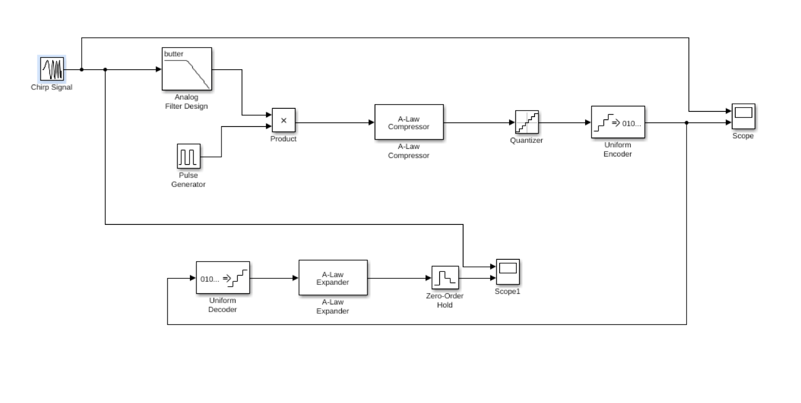

图1 PCM编码解码仿真框图
1. **仿真框图中各部分的简介**
  1. 信源

在通信系统中假定我们仅用来传送语音信号，因为语音信号的平带范围为300Hz~3400Hz,为了更好的体现人的语音的频率变化以及观察所采用的系统对语音频带范围内的信号恢复程度，我们采用了chirp函数。它是频率时间线性增长的函数，在雷达系统中这样的信号称为线性调频信号，并用专用词Chrip表示
  1. 模拟低筒滤波器

按照采样定理的要求选择采样频率，即$\mathrm {\Omega s\ge 2\Omega c}$，但考虑到信号的频谱不是锐止的，最高截止频率以上还有较小的高频分量，为此可选$\mathrm {\Omega s=(324)\Omega c}$。另外可以在采样之前加一保护性的低通滤波器，滤去高于$\mathrm {\Omega s/2}$的一些无用的高频分量，以及其他的一些杂散信号，因此在采样前加入一低通滤波器。
  1. 矩形脉冲序列

由于产生和传输单位冲激函数难以实现，因此实际中通常采用矩阵脉冲抽样，根据CCITT（国际电报电话咨询委员会）标准，留一定的预防带则采样率$\mathrm {fs=8000Hz, T=1/8000=125}\mathrm {\mu }\mathrm {s}$用占空比为50%的矩形脉冲序列。
  1. 相乘器

通过相乘器使语音信号与矩形脉冲想乘从而获得时域离散信号，此即信号的抽样过程。
  1. A律压缩

由于实现困难，因此工程上通常用十三折曲线来金丝地表示A律曲线。
  1. 均匀量化和编码

根据语音信号的统计结果：在信号动态方位$\mathrm {\ge 40dB}$的情况下信噪比不硬低于26dB。因此用8位量化器，量化间隔为$\mathrm {125}\mathrm {\mu }\mathrm {s}$。
  1. 编码器

编码器是将量化后信号变成适合信道传输的信号。
  1. 解码器

将从信道接手到的信息进行解码

A律解压：

对解码后的信号量化值进行扩展，得到重建信号

零阶保持器（Zero-Order Hold）：

零阶保持完成将重建信号转换为连续信号。

示波器（代替浮点示波器）：

将产生的信号波形显示出来。本实验中将原信号波形和回复后的波形同时显示在同一滤波器中，这样可以直观的比较信号的恢复程度。
1. **主要参数设置**

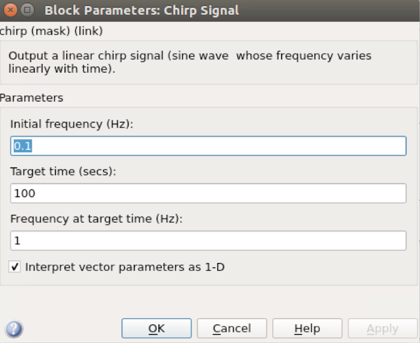

图2 Chrip信号模块参数

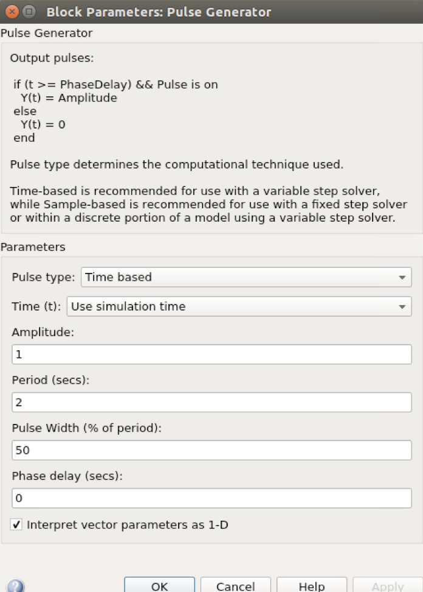

图3 矩形脉冲序列模块参数

**3.用示波器观察输入的Chrip信号和编码器输出的信号**

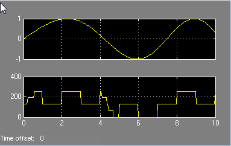

图4 PCM编码示波器输出信号

问题3.1 观察输入的Chrip信号和编码器输出的信号波形，可以发现什么特点？哪副图是模拟信号？哪副图是数字信号？

**4.用示波器观察输入的Chrip信号和解码器输出的信号**

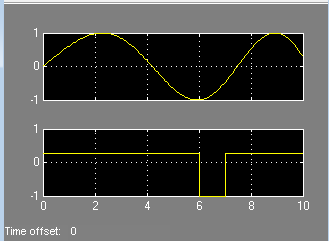

图5 PCM解码示波器输出信号

问题3.2 观察输入的Chrip信号和解码器输出的信号波形，可以发生什么特点？那幅图是模拟信号？那幅图是数字信号？

问题3.3 什么是PCM？它有什么作用？

问题3.4 模拟信号转换为数字信号一般要经过几个步骤？

**5.请分析误差产生的原因 （问题3.5）**

实验三  用MATLAB验证单位脉冲序列的时移特性

一、实验目的

深入理解离散时间单位脉冲δ[n]的定义。

验证并可视化“时移k” 对单位脉冲序列的影响：δ[n-k] 图形整体右移k个采样点。

熟悉MATLAB中离散序列的生成、索引、绘图与标注方法。
- 实验要求
1. 独立完成实验内容；
1. 实验报告要求：

(1) 记录实验步骤和过程，回答实验内容和步骤中的所有问题；

(2) 总结本次实验遇到了哪些问题，你是怎么解决的？

在0≤n≤20的时间范围内分别生成：

• δ[n]  (k=0)

• δ[n-3] (k=3)

• δ[n-8] (k=8)

• δ[n-15] (k=15)

用 stem 图显示四条序列，要求：

• 纵轴范围统一为[-0.1, 1.1]，便于比较。

• 用不同颜色区分，并在图中标注“脉冲位置 n=k”。

记录观察结果，回答：

• 脉冲出现的位置与k值的关系；

• 如果将δ[n-8]改为δ[n+2]（k=-2），图形将如何变化？

三、实验原理

离散时间单位脉冲定义为

δ[n] = 1, n = 0

δ[n] = 0, n ≠ 0

时移k个采样点后：

δ[n-k] = 1, n = k

δ[n-k] = 0, n ≠ k

因此，序列形状不变，仅在时间轴上整体平移k位。k>0右移，k<0左移。

四、实验内容与详细步骤

步骤1：启动MATLAB，新建脚本文件shift_delta.m

步骤2：在脚本中完整复制以下代码并运行（已含详细中文注释）：

%% 参数设置

N = 20;                 %序列长度0~20，共21点

k_vec = [0 3 8 15];     %需要验证的时移量

colors = {'r-o','g-s','b-^','m-*'};  % 颜色与标记

%%时间轴

n = 0:N;

%%创建图形窗口

figure('Name','单位脉冲序列的时移特性','NumberTitle','off');

hold on; grid on;

%% 循环生成并绘图

for idx = 1:length(k_vec)

k = k_vec(idx);

delta_k = double(n == k);           % 生成 δ[n-k]

stem(n, delta_k, colors{idx}, 'LineWidth', 1.5, 'MarkerSize', 8);

text(k+0.5, 1.05, sprintf('k=%d',k), ...

'FontSize', 9, 'Color', colors{idx}(1));

end

%%图形美化

xlim([-0.5 N+1]);

ylim([-0.1 1.1]);

xlabel('离散时间 n');

ylabel('幅度');

title('单位脉冲序列 δ[n-k] 的时移特性');

legend('\delta[n]', '\delta[n-3]', '\delta[n-8]', '\delta[n-15]', ...      'Location','northeast');

set(gca,'FontSize',10);

步骤 3：观察并记录

• 四条竖线依次出现在n=0,3,8,15，且幅度均为 1。

• 图例、文本标注与颜色均与k值一一对应。

步骤4：进一步验证

在命令窗口键入：

k = -2;                 % 负时移

delta_neg = double(n == k);

stem(n, delta_neg, 'k-d', 'LineWidth', 1.5); xlim([-3 N]);

title('\delta[n+2] 的波形（k=-2，左移）');

即可看到脉冲出现在 n=-2，序列整体左移 2 位。

实验四 线性分组码的差错控制系统仿真
- **实验目的**

理解差错控制系统的基本原理，通过MATLAB Simulink仿真实验，加深对线性分组码的编码解码原理和方法的理解。
- **实验要求**

1.独立完成实验内容；

2.实验报告要求：

(1) 记录实验步骤和过程，回答实验内容和步骤中的所有问题；

(2) 总结本次实验遇到了哪些问题，你是怎么解决的？

(3) 在数字通信系统中，差错控制有什么作用？有哪些常用方法？
- **实验原理**
1. 线性分组码的编码和解码原理详见教材。
- **实验内容和步骤**
1. **线性分组码的差错控制系统仿真模型**

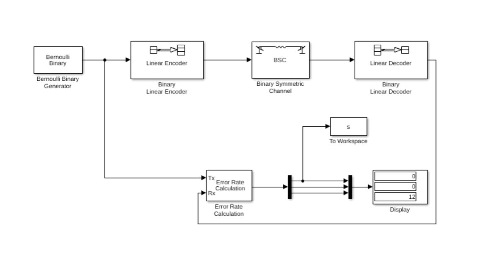

图1. (7,4)线性分组码进行差错控制仿真系统

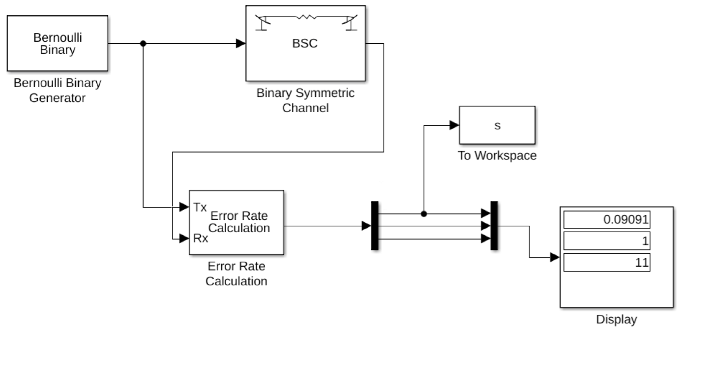

图2. 无线性分组码的差错控制仿真系统

图1所示是线性分组码的差错控制仿真系统。信号源是Bernoulli Binary Generator(伯努利二进制信号产生器)产生采样时间为0.01的二进制信号经过Binary Linear Encoder(二进制线性编码器)进行线性分组码编码；编码后的序列经过Binary Symmetric Channel（二元对称信道）传输，该信道具有误码概率；在接收端进行译码，译码后的序列和新原序列输入Error Rate Calculation(误码率统计)模块，统计接收端误码率。为了对比(7,4)线性分组码差错控制的效率，同时设计了没有经过线性分组码校验的系统仿真框图，如图2所示。
1. **主要功能模块及参数**

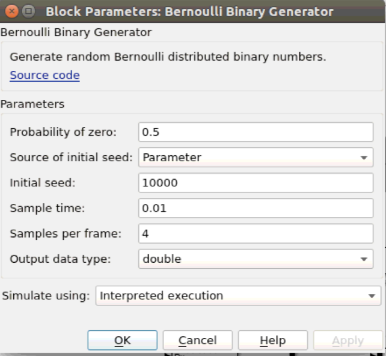

图3 伯努利信号产生器参数

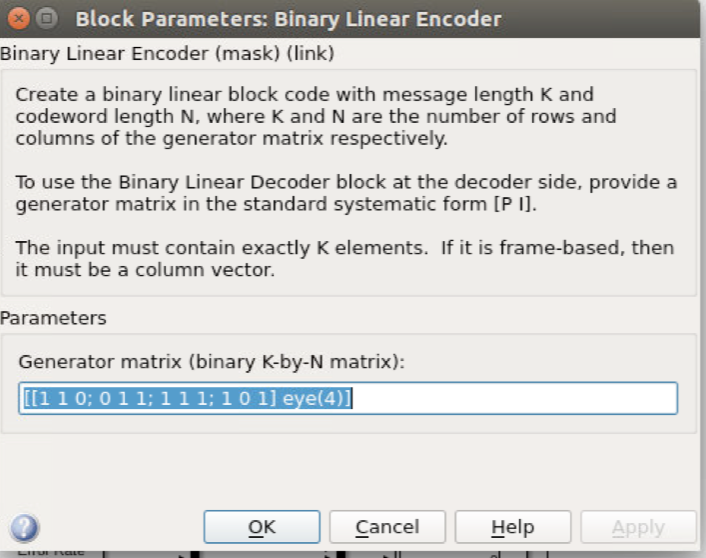

图4 二进制线性编码器参数

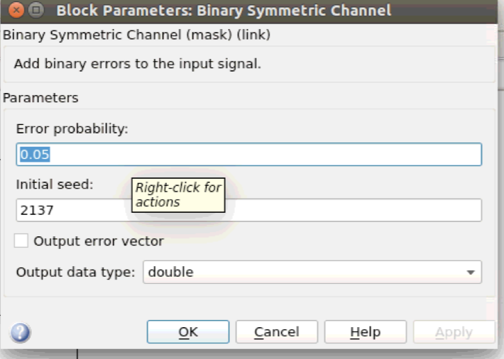

图5 二元对称信道参数

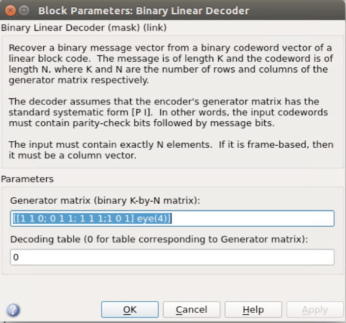

图6 二进制线性解码器参数

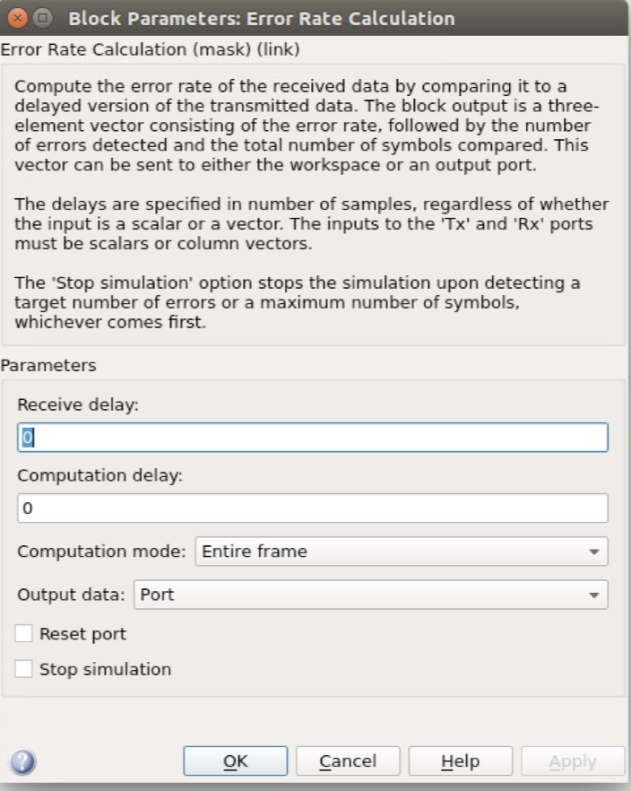

图7 误差率计算模块参数

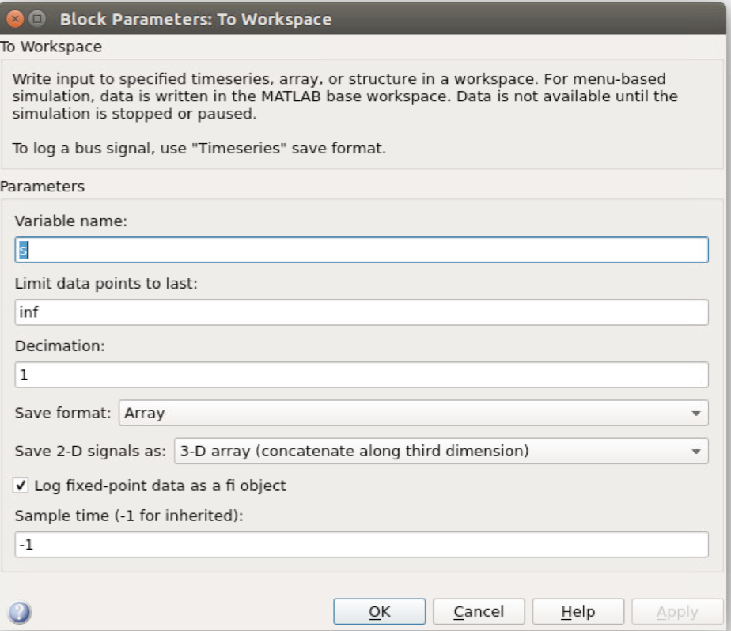

图8 Simulink输出模块参数
1. **线性分组码的误码率和差错率的关系**

设置仿真参数之后就可以启动仿真运行。在仿真运行完毕之后为了得到直观的误码率曲线图，在接下来同样需要编写一个M文件对上面的循环码仿真模型进行命令执行，同时将二进制均衡信道的差错率参数由0.05改成变量errB。

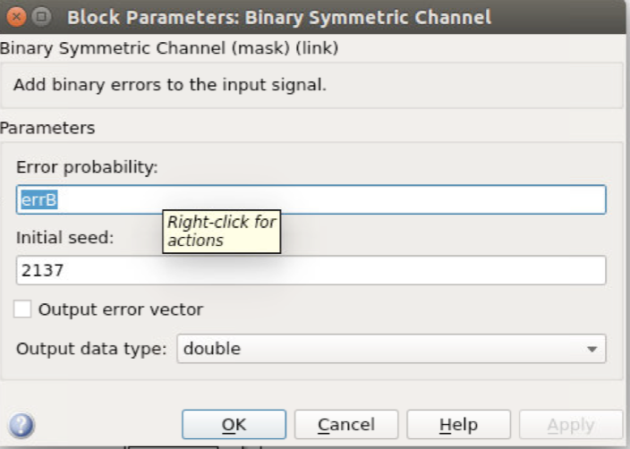

图9 二元对称信道参数

为了得到循环码仿真系统信号误码率与信道差错概率之间的曲线图，可以编写如下M文件，对图1的仿真模型进行仿真，此时二进制均衡信道的差错概率设置为errB, M源文件的曲线图如下：

程序1：

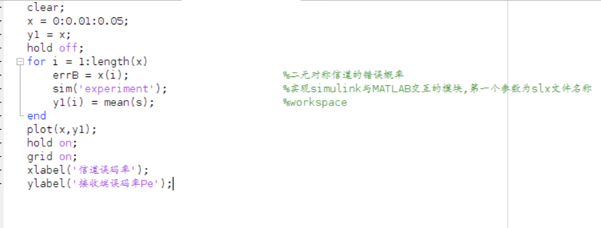

图10 线性差错控制M文件代码

性能曲线如图：

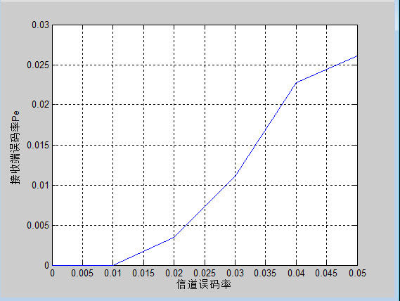

图11 线性差错控制误码率曲线

同时编写M文件对

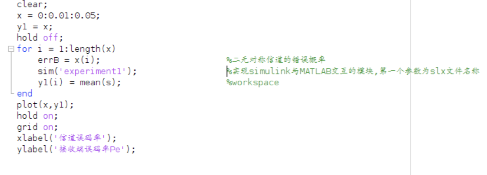

图12 无差错控制M文件代码

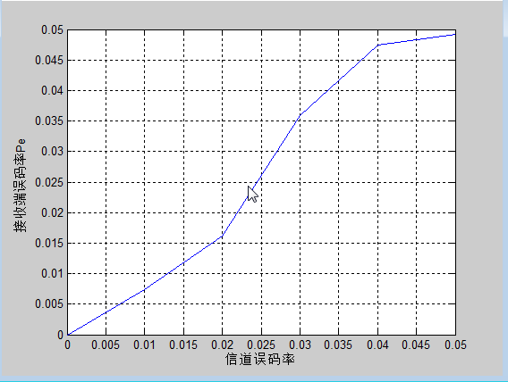

图13 无差错控制误码率曲线

问题3.1 通过两幅误码率曲线图比较，请问线性分组码信道编码有什么作用？简单比较信道编码与信源编码的目的？

问题3.2 尝试自己编写程序，把上面两幅误码率曲线图合并在一个图中表示，并画出图。

附录1 SIMULINK操作示例

Simulink使用请参考相关操作指南或使用说明，本示例给出一个例子。

打开MATLAB， 选择simulink模块

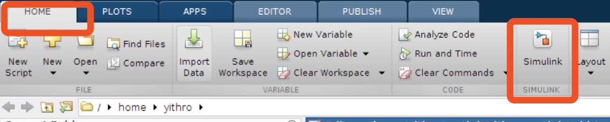

创建simulink模型，从如下图红框所示选择组件

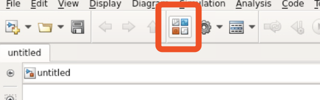

如下图所示，通过搜索框可以快速地找到所需要的组件，右键点击将组建添加到模型当中。

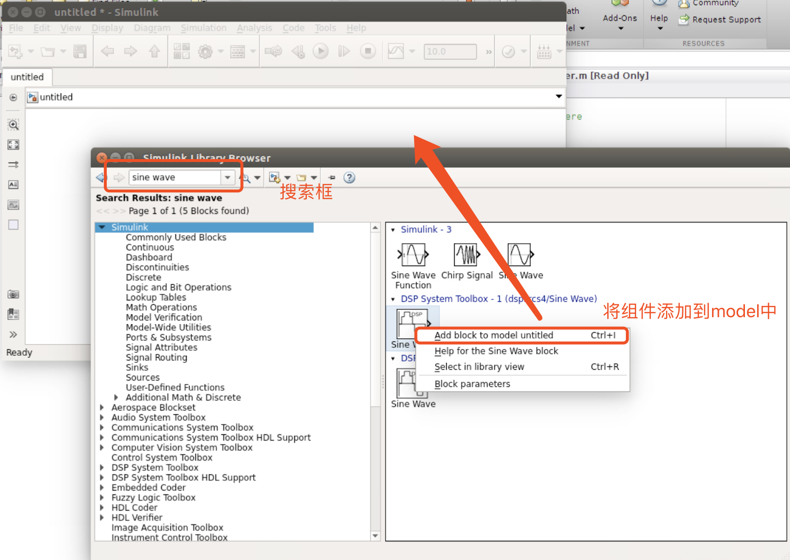

通过双击模型当中的组件来设置组件的参数，如下图所示。

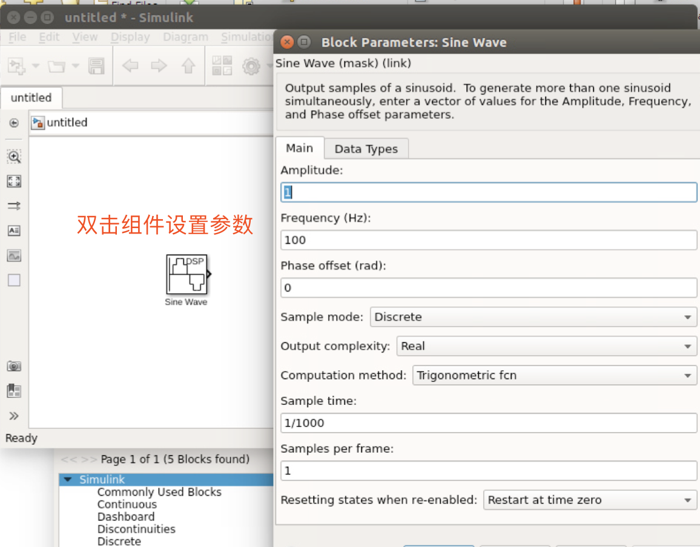

模型构建完成后，保存模型为.slx文件如下图所示。若为需要编写代码的实验（实验四），则需要创建一个.m文件，该文件名不能与.slx文件重名。在当前文件夹下的空白地方右键，创建新的文件。

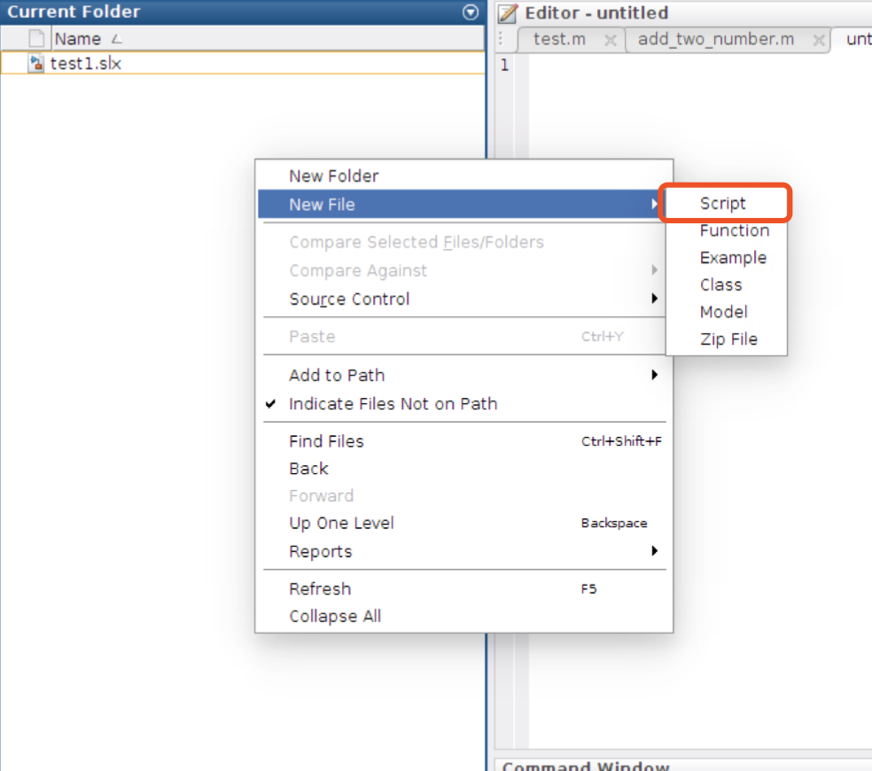
