# 通信基础-差错控制编码-2025F

<!-- page: 1 -->

通信基础：差错控制编码

<!-- page: 2 -->

      目录

Ø 差错控制编码的基本概念；

Ø 简单的差错控制方法；

Ø 线性分组码的代数基础*；

Ø 线性分组码的基本性质；

Ø 循环码；

Ø 卷积码

2

<!-- page: 3 -->

第7章 传输信道

n 回顾：信道的分类

  狭义的信道根据不同信道介质，可进一步划分为：

Ø 有线信道：电缆、光缆等

Ø 无线信道：

ü 微波信道：微波中继、卫星等

ü 短波信道：主要指电离层反射信道；

ü 散射信道：对流层散射、流星余迹散射信道等；

ü 移动通信信道：无线接入网与用户间的地面传输信道。

3

<!-- page: 4 -->

第7章 传输信道

n 信道的分类

Ø 恒参信道：信道特性恒定不变的信道。

     典型的恒参信道：有线电缆、光纤、无线视距中继等。

     恒参信道的传递函数可表示为





j
H
H
e






      传递函数的幅频和相频特性与时间无关。

Ø 随参信道：信道特性随时间随机变换的信道。

     典型的随参信道：短波电离层反射信道、对流层散射信道、流星余迹散射
信道、移动通信信道等。

     随参信道的传递函数可以表示为








,
,
,

j
t
H
t
H
t e






  传递函数的幅频和相频特性通常是频率与时间的随机函数。

4

<!-- page: 5 -->

第7章 传输信道

n 电磁波信号频率划分及应用

5

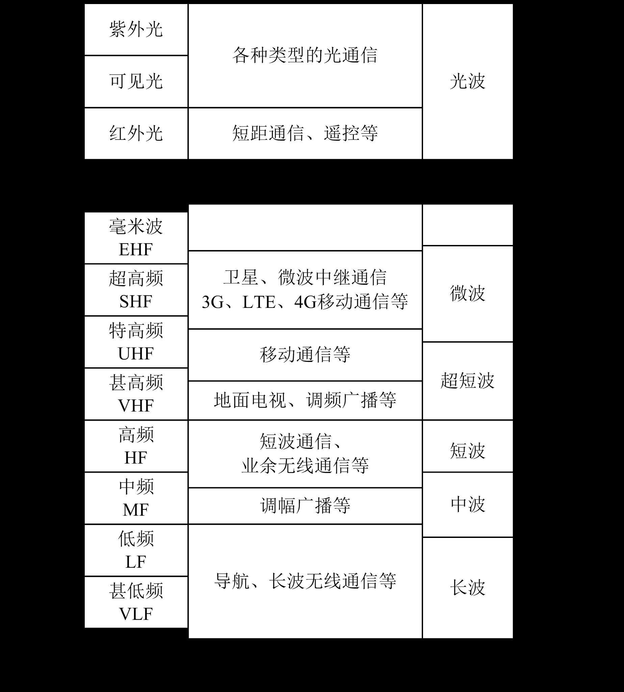

<!-- page: 6 -->

回顾:

n 信源编码：为了提高数字信号的有效性而采取的编码，

又称有效性编码；

n 信道编码：为了提高数字通信的可靠性而采取的编码，

又称可靠性编码、抗干扰编码、纠错编码或差错控制
编码。

6

<!-- page: 7 -->

信道编码器在通信系统中的位置

信源
译码
信道
译码
信道
编码

信源
编码

信道

信
宿

信
源

干扰

• 作用    提高信息传输时的抗干扰能力
• 目的    增加信息传输的可靠性
• 手段    增加信息冗余度
• 名称    信道码、数据传输码、差错控制码

7

<!-- page: 8 -->

差错控制系统模型及分类

1
前向纠错方式

纠错编码
信道
纠错译码
消息m
m
消息
码字c
接收向量r

  FEC方式差错控制系统模型

  前向纠错：采用具有检错和纠错的编码算法，接收端不仅能够检测出错误，而且
定位出码字中错误的位置并加以纠正。

ü 前向纠错的方法适用于包括单工通信系统的应用场合。

ü 在一些对实时性要求较高的通信场合，必须采用前向纠错的方法。

ü 前向纠错需要定位错误的位置和出现何种错误(对二进制以外的纠错编码)，

通常编译码的方法比较复杂，效率较低、

8

<!-- page: 9 -->

差错控制系统模型及分类

2
反馈重传方式

纠错编码
信道
纠错译码
m
c m

c
r

  ARQ方式差错控制系统

  检错重发：通过差错控制编码，使得接收端具有检错能力，接收端如果发现传输
出错，通过反向信道请求重发。

ü 检错重发方式，要求系统具有反向传输通道；

ü 检错重发方式通常具有较高的编码效率。

9

<!-- page: 10 -->

3
混合纠错方式

纠错编码
信道
纠错译码
m
c m

c
r

是

可纠错？

否

  HEC方式差错控制系统

  混合差错控制：结合检错重发和前向纠错方式优点的差错控制方法；

ü 对于出现较少错误时，由前向纠错方式加以纠正；当经纠错后仍有错

误时，则启动检错重发机制。

ü 混合差错是一种兼顾效率和复杂性的方法。

10

<!-- page: 11 -->

第8章 差错控制编码

引言

u 数据在物理信道中传输时通常会因为信道的非理想特性和引

入的噪声造成传输的错误。

u 差错控制编码的基本概念：通过对数据进行某种编码处理，

使得接收端可以判断接收到的数据，是否出现错误，甚至可
以纠正一定范围内错误。

n 将有误码的物理信道改造成无差错的逻辑信道的一种方法。

n 通过代数的方法，加入与待传输的数据有一定关联关系的

监督位来实现。

n 在接收端可根据特定的关联关系是否受到破环来判别是否

出现错误，并可在一定程度上根据出错的情况纠正错误。

n 监督位本身并不携带信息，也将监督位称为冗余位。

11

<!-- page: 12 -->

思考

信道编码的方法：

n 对原信息进行变换，加入附加信息(即监督码)。

信道编码的本质：

n 增加冗余度，牺牲有效性以提高可靠性。

例:  (4,1)重复码

0: 0000
1: 1111

12

<!-- page: 13 -->

第8章 差错控制编码

n 引言

k
n

  若每一组   位信息位，编码后生成   位长度的码字

  则定义编码效率

k
n
编码效率＝

         冗余度

-
n k

n

冗余度

13

<!-- page: 14 -->

示例

信息位

监督位

0

晴
00

1

云
01

1

阴
10

0

雨
11

Ø 信息位长度：k=2

  编码后的码字长度：n=3。

Ø 编码效率：k/n = 2/3

  冗余度： (n-k)/n = (3-2)/3 = 1/3

<!-- page: 15 -->

第8章 差错控制编码

n 差错控制编码的主要类型和方式

  差错控制编码的主要类型

  (1)线性码与非线性码

ü 线性码：监督码元与信息码元间的关系是一种线性关系；

ü 非线性码：监督码元与信息码元间的关系则是一种非线性的关系。

  (2)分组码与卷积码

ü 分组码：监督码元与信息码元间以码组为单位建立关系；

ü 卷积码：监督码元不仅与本组的信息码元有关，还与前面若干个码组的

信息码元有关。

15

<!-- page: 16 -->

第8章 差错控制编码

n 差错控制编码的主要类型和方式(续)

  差错控制编码的主要类型

  (3)系统码与非系统码

ü 系统码：编码后信息码元部分的排列结构保持不变；

ü 非系统码: 编码后码组中信息码元部分的排列结构发生了变化，一般

不能看出原来信息码元的图样结构。

16

<!-- page: 17 -->

      目录

Ø 差错控制编码的基本概念；

Ø 简单的差错控制方法；

Ø 线性分组码的代数基础*；

Ø 线性分组码的基本性质；

Ø 循环码；

Ø 卷积码

17

<!-- page: 18 -->

奇偶校验码

汉明重量：码字中非零码元的个数，亦称码重，记为w(c)。

1
0
0
0
1
1
1
1
奇校验

w(c)
=

1
0
0
0
1
1
1
0
偶校验

w(c)
=

    只能检验出
奇数个差错，不
能检验出偶数个
差错。

奇校验规则：

w(c)=1  （mod 2）

w(c)=0  （mod 2）

偶校验规则：

18

<!-- page: 19 -->

第8章 差错控制编码

n 简单的差错控制方法

  奇偶校验码

  奇偶校验码是一种通过增加1位监督位，从而使得码组具有检测1位误码的差
错控制方法。

  (1)偶校验

1
2
1
...a
a
a
n
n


0a

  设待发送的信息码组：           加入监督位

0
1
2
1
...
n
n
a
a
a
a





＝

  其中

  由此可得监督位与信息位的关联关系

1
2
1
0
...
0
n
n
a
a
a
a






＝

  若传输过程中出现1位的误码，上述关联关系将被破坏，因此可发现出现错误。

1
2
1
0
...
n
n
a
a
a a



  因编码后码组             中有偶数个1，故称为偶校验。

19

<!-- page: 20 -->

码长为5的偶监督码

  码       字
序
号

  码        字

序
号

信
息
码
元监
督
元
信
息
码
元监
督
元

  0
0  0  0  0
0
 8
1
0
0
0

  1
0  0  0  1
1
 9
1  0  0  1

  2
0  0  1  0
1
10
1  0  1  0

  3
0  0  1  1
0
11
1  0  1  1

  4
0  1  0  0
1
12
1  1  0  0

  5
0  1  0  1
0
13
1  1  0  1

  6
0  1  1  0
0
14
1  1  1  0

  7
0  1  1  1
1
15
1  1  1  1

20

<!-- page: 21 -->

第8章 差错控制编码

n 简单的差错控制方法(续)

 (2)奇校验

  若加入的监督位由下式确定

0
1
2
1
...
1
n
n
a
a
a
a






＝

  则由此建立的关联关系为

1
2
1
0
...
1
n
n
a
a
a
a






＝

1
2
1
0
...
n
n
a
a
a a



  编码后产生的码组            中将有奇数个1，故称奇校验。

  同样，传输过程的1位误码将破坏上述的关联关系。

  容易验证：

ü 当出现奇数位的误码时，关联关系均被破坏，因此可以发现错误。

ü 而当出现偶数位的错误时，不能发现错误。

21

<!-- page: 22 -->

第8章 差错控制编码

n 简单的差错控制方法(续)

Ø 所有可能的信息码组经过差错控制编码后，得到的输出码组(也称为码字)构


C

成了一个称为许用码字的集合：许用码字集

Ø 不在许用码字集中的码字称为禁用码字。

Ø 一般地，如果传输出错使得原来的许用码字变为禁用码字，则这种错误可被

发现；

        示例：偶校验码字中所有含偶数个“1”的码字为许用码字；

                          所有含奇数个“1”的码字为禁用码字。

             奇校验码字中所有含奇数个“1”的码字为许用码字；

                         所有含偶数个“1”的码字为禁用码字。

Ø 如果传输过出错使得原来的许用码字变为另外一个许用码字，则这种错误不能

被发现。

22

<!-- page: 23 -->

示例

用两位编码可表示4种天气：

信息位

监督位

0

晴
00

1

云
01

1

阴
10

0

雨
11

Ø 3位编码共有8个码组，上述4种为许用码组（合法码

组），其它4种为禁用码组。

23

<!-- page: 24 -->

第8章 差错控制编码

n 简单的差错控制方法(续)

  示例: 3位二进制码组的所有组合

              000，001，010，011，100，101，110，111

  (1)若所有组合均为许用码字，每个码字可携带3比特信息；

     任一许用码字出错都变为另一许用码字，无差错控制功能。

  (2) 若选择   许用码字：000，011，101，110

               禁用码字：111，001，010，100

         编码后每个3位的许用码字可携带2比特信息；

   任一许用码字的1位误码都会变为禁用码字，因此可发现任意的1位误码；
该码实际上是一种偶校验码。

   2位的误码将变为另一许用码字，错误不能被发现。

 注意：需要合理地确定许用码字方可使编码码字具有更好的检错能力。

24

<!-- page: 25 -->

第8章 差错控制编码
n 简单的差错控制方法(续)

  (2) 若选择   许用码字：000，111

               禁用码字：001，010，100，011，101，110

n 编码后每个3位的许用码字可携带1比特信息；

n 任一许用码字的2位以下的误码都会变为禁用码字，因此可发现任

意的2位误码；

n 采用择多逻辑的方法可纠正出现1位误码时的错误

n 3位的误码将使“000” “111” ，错误不能被发现。

25

<!-- page: 26 -->

第8章 差错控制编码

n 简单的差错控制方法(续)

本例的启示

Ø 差错控制能力越强，相应的冗余开销越大；

Ø 任何一种差错控制编码，其差错控制能力都有

一定限制；

Ø 需要合理地选择许用码字。

26

<!-- page: 27 -->

第8章 差错控制编码

n 简单的差错控制方法(续)

  重复码

  在上例中可见，“000”和“111”是3位码元均相同，是一种3位的重复
码，可发现任意的2位错误和纠正1位错误。

  3位的重复编码可推广到一般的情形，若 n 位的重复码用于表示1比
特信息。如

   “000…0”  0 ； “111…1”  1

1
n 
2
n

  则可发现任意的     位误码；采用择多逻辑进行判决，可纠正任意
的少于     位的误码。

  重复码编译码简单，但效率较低。

27

<!-- page: 28 -->

      目录

Ø 差错控制编码的基本概念；

Ø 简单的差错控制方法；

Ø 线性分组码的代数基础*；

Ø 线性分组码的基本性质；

Ø 循环码；

Ø 卷积码

28

<!-- page: 29 -->

   8.3 线性分组码的代数基础*；

Ø 近世代数/抽象代数

ü
抽象代数（Abstract Algebra），又称近世代数，是现代数学的重要分支，研究

代数结构及其性质。它从具体代数系统（如整数、多项式、矩阵）中抽象出共同

性质，形成通用理论。

ü
线性分组码的数学基础：抽象代数中的群、环、域和向量空间等结构。

ü
线性分组码构成一个群：所有合法的码字（许用码）在模2加法下构成一个阿贝尔

群（交换群），满足封闭性、结合律、有单位元、每个码字有逆元。

ü
有限域（伽罗瓦域）是运算基础：线性分组码的运算（加法、乘法）是在有限域

GF(2)或其扩展域 GF(2m)上进行。

ü
抽象代数为线性分组码提供了严格的数学语言，更是其构造、分析和性能优化的

核心工具。

Ø 线性代数

29

<!-- page: 30 -->

第8章 差错控制编码

n 线性分组码的代数基础

  定义8.5.1  对于某种代数运算法则“*”的非空集合G,满足
下列公理条件时称之为一个群：

  封闭性：

g g
G
g
g
G





,
*

1
2
1
2






  结合率：

g g
g
G
g
g
g
g
g
g





,
,
*
*
*
*

1
2
3
1
2
3
1
2
3

e
G
g
G
g e
e g
g






,
             *
*

  存在恒等元素：

g
G
g
G
g
g
g
g
e




1
1
1







     *
*

  存在逆元素：

  定义8.5.2  称群为交换群，若满足如下的交换率

1
2
1
2
2
1
,
*
*
g g
G
g
g
g
g




30

<!-- page: 31 -->

第8章 差错控制编码

n 线性分组码的代数基础(续)

  示例：整数集，按照加法运算规则，构成一个交换群。

    其中：

      恒等元素为“0”，

      任一元素的逆元素为即为该整数的负数。

  示例：在二元的非空集合{0,1}中，定义运算法则

0
0
0,  0
1 1,  1
0
1,  1
1
0







  该二元集合构成一个交换群，其中：

      恒等元素为“0”，

      每个元素的逆元素为其自身。

31

<!-- page: 32 -->

n 线性分组码的代数基础(续)
  定理8.5.3  群G具有以下的性质：
  (1) 群G的恒等元是唯一的，群中每个元素的逆元素也是唯一的；
  (2) 定义了运算法则“*”的群G，                     ，有

第8章 差错控制编码

1
2
,
g g
G




1
1
1
2
1
2
1
*
*



g
g
g
g

  定义8.5.4   若H是群G的一个非空子集，如果在同样的运算法则
“*”下，集合H也构成一个群，则非空子集称为群G的一个子群。



k
h
h
h
e
H
2
3
2
,...,
,
,
:


n
g
g
g
g
G
2
3
2
1
,...,
,
,
:

  定义8.5.5 设集合                                是群                                 的一
个子群，   是G中的一个满足条件                        的元素，则把

ig
H
g
G
g
i
i


;


k
h
g
h
g
h
g
e
g
i
i
i
i
2
3
2
*
,...,
*
,
*
,
*

   定义为子群H在群中的一个关于     的左陪集；把

ig



i
i
i
i
g
h
g
h
g
h
g
e
k *
,...,
*
,
*
,
*
2
3
2

   定义为子群H在群中的一个关于     的右陪集。

ig

32

<!-- page: 33 -->

n 线性分组码的代数基础(续)

第8章 差错控制编码

  对于交换群，左陪集和右陪集相等，简称为陪集。
  定理8.5.6   子群具有以下的主要性质
（1）群                                的所有元素可由子群
以及它的若干陪集构成的集合表示



n
g
g
g
g
G
2
3
2
1
,...,
,
,
:


k
h
h
h
e
H
2
3
2
,...,
,
,
:

h
h
h
H

*
...
*
*
*
*
...
*
*
*
...
e

2
3
2

k

h
g
h
g
h
g
e
g

陪集

2
1
3
1
2
1
1
1

k

h
g
h
g
h
g
e
g

陪集

2
2
3
2
2
2
2
2

k

*
...
*
*
*
...
...
...
...
...
...

h
g
h
g
h
g
e
g

陪集

m
m
m
m
2
3
2
2

k

其中                         。
（2）群G中的两个元素    和    在子群的同一陪集之中的充分必
要条件是：
（3）子群H的两个不相同的陪集一定不相交，即两个不同的陪
集一定没有公共元素。

H
g
G
g
i
i


;

1g
2
g
H
g
g



2
1
1 *

33

<!-- page: 34 -->

n 线性分组码的代数基础(续)
定义8.5.7 若在非空集合F中，规定了“＋”和“*”两种运算，
且有如下的条件
（1）非空集合构成运算法则“＋”的交换群；
（2）非空集合构成运算法则“*”的交换群；
（3）对两种运算法则“＋”和“*”，非空集合中的元素满足
分配律，即对任意的                     ，有

第8章 差错控制编码

F
f
f
f

3
2
1
,
,



3
1
2
1
3
2
1
f
f
f
f
f
f
f







   则称非空集合F构成一个域，其集合中包含的元素的个数称为
该集合的阶数。

示例：对于普通的加法和乘法运算
            全体有理数构成一个有理数域；
            全体实数构成一个实数域；
            全体复数则构成一个复数域。

34

<!-- page: 35 -->

n 线性分组码的代数基础(续)

第8章 差错控制编码

   有限域的概念

   有限域：包含有限的 q 个元素的域称之；


q
GF

                   有限域又称为伽罗华（Galois）域，记为             。



n
p
GF

    有限域中元素的个数 q，一定是某个素数p的幂，即              。

   示例：非空的二元集合{0,1}中，定义加、乘运算

               加运算

0
0
0,  0
1 1,  1
0
1,  1
1
0








0*0
0,   0*1
0,   1*0
0,   1*1 1






               乘运算


2
GF

               构成二元有限域

35

<!-- page: 36 -->

第8章 差错控制编码

n 线性分组码的代数基础(续)



2n
GF
2
p 
2n
q 

  包含素数     的 n 次幂      个元素的有限域
是线性分组码中最常用的有限域。





0
2n
a
GF



  元素a的阶

2
3
,
,......
a a
a a a a
a





  定义：





0
2n
a
GF





2n
GF

                   ，因为        中只有有限个元素，因此

   一定存在正整数k，使得     ，能使上式成立的最小的k 称
为元素  的阶。

1
ka 
a

a

    因为对于任一元素  ，求其整数次幂的运算可以不断做下

去，因为只有有限个元素，到一定次数之后必定会重复，假定

,
,
i
j
a
a
j
i
j
i
k




有

    则有

1
j i
k
a
a



36

<!-- page: 37 -->

第8章 差错控制编码

n 线性分组码的代数基础(续)

  本原元



2n
a
GF

2
1
n
k 



2n
GF

  若对于元素           ，其阶等于         ，则该元素称
为有限域       的本原元。

  任何有限域都存在本原元。

  有限域中的任一非零元素都可以用本原元的某次幂来表示。

37

<!-- page: 38 -->

第8章 差错控制编码

n 线性分组码的代数基础(续)





2
2
3
2
0, ,
,
GF
a a a

a

  示例：有限域                    ，其中  为本原元。

3
1
a 

        由本原元的定义，有     。

  对该有限域，可以定义加法和乘法分别为

2
a
a

 ＋
 *

1
0
2
a
a
1
0

2
a
1

a

0

0
0
0
0
0

0

a

a
2
a
1

2
a

1

1
0

1

0

2
a

a
2
a
1

a

a

a

0

0

1

2
a
1
a

2
a

a

2
a

2
a

1

0

0

38

<!-- page: 39 -->

第8章 差错控制编码

n 线性分组码的代数基础(续)









,
0
m X
n X
n X 

  系数定义在二元有限域上的多项式

  一般地，总有




X
p
X
n
X
Q
X
m








X
n
X
m
X
p


X
n

  其中的余式可记为                ，称     为模。


X
n

  多项式关于模     的加法和乘法运算
























u X
v X
u X
v X





      加法

n X

u X
v X
u X
v X





      乘法

n X


X
n
n

  若     为   次的多项式，则余式具有如下的一般形式





1
2
1
2
1
0
...
,
0,1
n
n
n
n
i
p X
c
X
c
X
c X
c
c











39

<!-- page: 40 -->

第8章 差错控制编码

n 线性分组码的代数基础(续)

  因为





1
2
1
2
1
0
1
2
1 0
...
...
n
n
n
n
n
n
p X
c
X
c
X
c X
c
c
c
c c















0,1
ic 


1
2
1 0
...
n
n
c
c
c c


2n

  若            则             共有   种不同的组合，



p X
2n

  相应地有   种不同的      余式。



p X

X
n
2n


p X

  若将每个余式     看作一个元素，如果     是一个不可约
多项式，则所对应的   个余式      作为元素的集合构成一个
有限域。

40

<!-- page: 41 -->

第8章 差错控制编码
n 线性分组码的代数基础(续)


1
2



X
X
X
n

  示例：多项式               是一不可约多项式，以此为模
的余式为元素的集合：            构成一有限域。



0, 1, ,
1
X X 

  元素间的加法

  与乘法运算，

  参见加法表与

  乘法表。

41

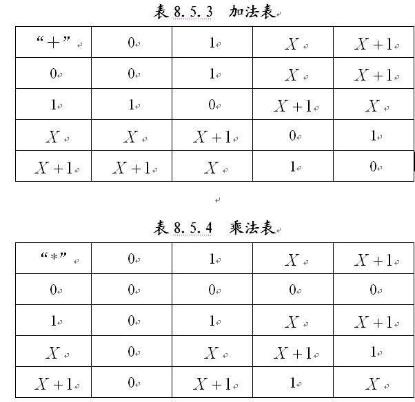

<!-- page: 42 -->

第8章 差错控制编码
n 线性分组码的代数基础(续)

  本原多项式


X
n





,
1,2,...,2
2
n
n
ip
X
i
GF



X
n

  n 次不可约多项式

    模      有限域


X
n

X
n

    若     的根是本原元，则称     是本原多项式。


1
4



x
x
x
n

  示例：多项式              是一不可约多项式。








4
4
,
1,2,...,2
2
i
n X
p
X
i
GF




        由此




4
1
0
n X
X
X




        因为对于模


1
4



x
x
x
n
x
X


        因此       是多项式              的根



4
4
1
1
0
x X
x X
n x
x
x
X
X









        即有

42

<!-- page: 43 -->

第8章 差错控制编码
n 线性分组码的代数基础(续)

  示例(续)

X

  参见右表，元素

  的阶为        ，

2
1
n
k 


X

  可见    是一本

  原元。

  多项式


1
4



x
x
x
n

  为本原多项式。

43

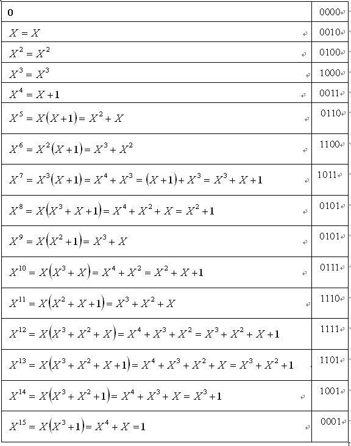

<!-- page: 44 -->

第8章 差错控制编码
n 线性分组码的代数基础(续)

  多项式的根

  这里所讨论的多项式是指系数与根均定义在有限域中的多项
式。



4
2
GF

  示例：求解定义在有限域        上的多项式


0
7
2




X
Z
X
Z
Z
f

                              的根。

Z

  注意：在上面的方程中，未知数是    。

 有限域上的方程并无一般解，因为方程的解是定义在有限域上
的，所有可能的解只有有限多个，所以可用试探法求解；

 根据上一示例的元素表，可得







0
1
1
2
3
2
3

13
12
6
7
2
6
6

X
X
X
X
X
X
X
X
f








X
X
X
X
X
X











44

<!-- page: 45 -->

第8章 差错控制编码
n 线性分组码的代数基础(续)

  同样可得





17
20
10
7
2
10
10

X
X
X
X
X
X
X
X
f








2
5
2
15
5
15

X
X
X
X
X
X
X
X










0
2
2

X
X
X
X







6
10
,
X
X

  可见       是方程的根。

  多项式的一个重要性质

  定理8.5.8  系数取值在二元域｛0,1｝上的多项式


0
1
1
1
...
a
x
a
x
a
x
a
x
f
n
n
n
n














l
l
x
f
x
f
2
2 

  对任意的整数 l ，均有

  (书中给出了用归纳法得到的证明)

45

<!-- page: 46 -->

第8章 差错控制编码
n 线性分组码的代数基础(续)

  极小多项式



x
m

2n
GF

  定义8.5.9  设  是      中的元素，    是系数为二元域上
元素、以  为根的最低次多项式，则称    是  的极小多项式。



x
m



2n
GF


  定理8.5.10       上的任何元素   必有一个极小多项式。


2n
GF

  定理8.5.11 有限域      上的极小多项式一定是不可约、且
是唯一的。



x
m

0


m

  若   的极小多项是    ，则应有       ，由定理8.5.8，有






0
2
2



k
k
m
m


,...
,...,
,
2
2
l




                    即            均为该极小多项式的根。

46

<!-- page: 47 -->

第8章 差错控制编码
n 线性分组码的代数基础(续)

n 线性分组码的代数基础(续)




x
m

4
2
GF
3
X



  示例：求有限域      上，元素       的极小多项     。


l








0
2
2



k
k
m
m



  由前面分析，对            均有：

1
2
2,...,
,

  因为








2
3

2
2
2
3
3
6
3
12
3
24
15
9
9

,
,
,
X
X
X
X
X
X
X
X
X
X












4

2
3
3
48
15
3
3

X
X
X
X
X






l




1
2
2,...,
,

  可见从          的第四项后开始重复，因此极小多项式为







3
6
9
12

m x
x
X
x
X
x
X
x
X










4
3
6
9
12
3

x
X
X
X
X
x










9
12
15
15
18
21
2

X
X
X
X
X
X
x











18
21
24
27
30

X
X
X
X
x
X







4
3
2

x
x
x
x







1

47

<!-- page: 48 -->

第8章 差错控制编码
n 线性分组码的代数基础(续)

  线性空间与其子空间
  定义8.5.12 设       是一个数域，    是某一类运算对象的非空集
合，在“＋”和“*”两种运算规则下，满足下列条件
（1）非空集合    对“＋”运算规则构成一交换群；
（2）非空集合    和数域       在运算规则“*”下满足封闭性，即
对任                          ，有

GF





GF

,
m
GF V



m V



（3）非空集合    和数域       在运算规则“*”下满足结合律，即
对任                                   ，有


GF

1
2
,
,
m m
GF V







V
m
m
V
m
m





2
1
2
1

（4）非空集合和数域在运算规则“＋”和“*”下满足分配律，
即对任                                        ，有

1
2
1
2
,
,
,
m m
GF V V




2
1
1
1
2
1
1
V
m
V
m
V
V
m







1
2
1
1
1
2
1
V
m
V
m
V
m
m







则称非空集合     为        上的线性空间。


GF

48

<!-- page: 49 -->

第8章 差错控制编码
n 线性分组码的代数基础(续)

  线性分组码与线性空间

  线性分组码的码元是定义在有限域上的线性空间中的元素。

  码字




1
2
,
,...,
,
;
1,2,...,
i
i
i
in
ik
V
v
v
v
v
GF q
k
n




,
i
j
V
V

  码字      的“+”运算定义为




l
l
l
jn
in
j
i
j
i
j
i
V
v
v
v
v
v
v
v
v
v
V
V







ln
2
1
2
2
1
1
,...,
,
,...,
,

  系数的“*”运算定义为



in
i
i
i
v
m
v
m
v
m
V
m





,...,
,
2
1





2 : 0,1 ;
2 : 0,1 ,
1,2,...,
ik
m
GF
v
GF
k
n




  在本章中，均假定

49

<!-- page: 50 -->

第8章 差错控制编码
n 线性分组码的代数基础(续)

n

S
S

  定义8.5.13 在n维的线性空间   中，若某非空子集   满足
线性空间的条件，则称   为线性空间的子空间。

  子空间的基本性质
（1）子空间  在“＋”运算规则下满足封闭性，即对任意
的         ，有

S

S
S
S
j
i

,

S
S
S
j
i



（2）子空间  在“＋”运算规则下满足交换律

i
j
j
i
S
S
S
S



S

（3）子空间  满足结合律，即对任意

S
S
S
S
S
k
j
i

,
,





S
S
S
S
S
S
S
k
j
i
k
j
i







50

<!-- page: 51 -->

第8章 差错控制编码
n 线性分组码的代数基础(续)

 子空间的基本性质
（4）恒等元           一定在子空间  中:



0
,...,
0,0

e
S
S
e

（5）若      ，则其逆元素   一定在子空间   中，即有

1

iS
S

S
Si 

S
S
e
S
S
i
i
i





1
1
,

（6）子空间  在“*”运算规则下满足封闭性，即若
                           则
（7）子空间  在“*”运算规则下满足结合律，即若
                              则


1,0
:
2
,
GF
m
S
Si


S
S
m
i 

S

S


1,0
:
2
,
,
GF
m
m
S
S
k
j
i






i
k
j
i
k
j
S
m
m
S
m
m






S

（8）子空间  在“＋”运算规则和“*”运算规则下，满足分
配律，即若                        ,则


1,0
:
2
,
,
GF
m
m
S
S
k
j
i








i
k
i
j
i
k
j
S
m
S
m
S
m
m







51

<!-- page: 52 -->

      目录

Ø 差错控制编码的基本概念；

Ø 简单的差错控制方法；

Ø 线性分组码的代数基础*；

Ø 线性分组码的基本性质；

Ø 循环码；

Ø 卷积码

52

<!-- page: 53 -->

线性分组码的基本概念

基本思路： 增加冗余位。典型做法：将码字分成两段。

二元分组码信息位(k bit)
校验位(n-k bit)

码字(n bit)

信息位：含有信源信息的比特位(红色部分)，长度用k表示。

校验位：按一定规则添加的码位。用于监督码组内部码元的关联关
系，可发现或纠正传输错误(蓝色部分)，亦称监督位。

码 字：信息位和校验位组成的相对独立码组(红色和蓝色整体)，

长度用n表示。
53

<!-- page: 54 -->

第8章 差错控制编码
n 线性分组码的基本性质

  线性分组码编码的一般表达形式

0
1
1
... k
a a
a 

      输入信息码组

0 1
1
... n
c c
c 

      输出编码码字

      其中






a
a
a
f
c



,...,
,

k

1
1
0
1
0



a
a
a
f
c



,...,
,

k

1
1
0
2
1



......



1
1
0
1

a
a
a
f
c



,...,
,

k
n
n






,n k

   线性分组码的一般记法：

   其中k表示码字中信息位的个数，n为码字的长度。

2k


,n k
54

   线性分组码      中许用码字的个数为   。

<!-- page: 55 -->

线性分组码

(n, k)
一般用        表示分组码，码字C
1
2
0
(
... )



n
n
c
c
c

线性分组码的结构

55

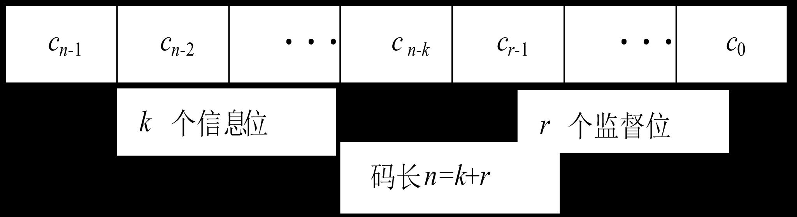

<!-- page: 56 -->

Ø 分组码：将信息序列以k为长度进行等长划分，然后按部门规则添

加一定数目冗余位的编码方法，冗余位亦称校验位。

Ø 线性分组码：信息位和校验位之间满足线性关系的分组码。

�= �

Ø 为评估编码效率，定义码率：
码        长： n

�

码  字  数：M=2�

信息位长： k

监督位长：r=n-k

(n, k)线性分组码：

最小码距：dmin

码长为n，信息位长为k的线性分组码。

56

<!-- page: 57 -->

8.5.1 码距的概念

57

<!-- page: 58 -->

第8章 差错控制编码
n 线性分组码的基本性质(续)

Ø 许用码字间的距离－－码距

1
1
2
1 0
...
n
n
w
b
b
bb



2
1
2
1 0
...
n
n
w
c
c
c c




  定义8.6.1 两个n元的码字：            与
两者间的汉明距离定义为









n

i
i
i
D w w
b
c


1

1
2
0
,

Ø 码距的性质

1
2
1 0
...
n
n
w
c
c
c c




（1）自反性：任一码字             与其自身间的码距为零。

1
1
2
1 0
...
n
n
w
b
b
bb



2
1
2
1 0
...
n
n
w
c
c
c c




（2）对称性：对任两码字             与               ，

1
w
1
w
2
w
2
w

   与   间的码距与   与   间的码距相等

1
1
2
1
0
...
n
n
w
a
a
a a




（3）三角不等式成立：对任意的三个码字              、

2
1
2
1 0
...
n
n
w
b
b
b b



3
1
2
1 0
...
n
n
w
c
c
c c




                和              ，它们间的码距关系满足







3
1
3
2
2
1
,
,
,
w
w
D
w
w
D
w
w
D



58

<!-- page: 59 -->

Ø 汉明距离：两个码字相应码元取不同数值的码元数，也称码距。

1
0
1
1
0
1
0
1

1
1
0
1
0
0
1
1

      两个等长码字c和�′之间的汉明距离可用公式表示为：

汉明距离(码距)=

n










i
i
i
i
i
d c c
c
c
c
c

1
( ,
)
,

Ø 码的最小距离：任意两码字之间的最小汉明距离，简称最小码距。

c c
d
d c c





min
min ( , )

59

<!-- page: 60 -->

举例

1
0
0
1
0
0
0
0

1
0
1
0

0
0
1
1

0
1
0
1

1
1
0
0

0
1
1
0

1
1
1
1

(4,3)偶校验码的最小码距=

60

<!-- page: 61 -->

8.5.2 码距与检错、纠错能力的关系

61

<!-- page: 62 -->

第8章 差错控制编码
n 线性分组码的基本性质(续)

码距与码的检错纠错能力之间的关系



k
j
i
j
i
j
i
w
w
D
d
2
,...
2,1
,
,
,
min
min



Ø 码字间的最小距离：最小码距定义为：



Ø 线性分组码的基本性质

e

    性质1 若要线性分组码能够检测出任一码字中的小于等于  位的误码，
则应满足：

1
min

e
d

62

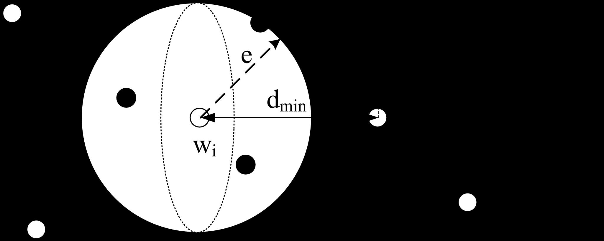

<!-- page: 63 -->

第8章 差错控制编码
n 线性分组码的基本性质(续)

t

  性质2 若要线性分组码能够检出并纠正任一码字中的小于等于  位的误码，

1
2
min

t
d

则应满足:

e
e
t


  性质3 若要线性分组码能够检出任一码字中的  位误码，同时能够纠正其
中  (     )位的误码，

t

则应满足:

min
1
d
e
t



63

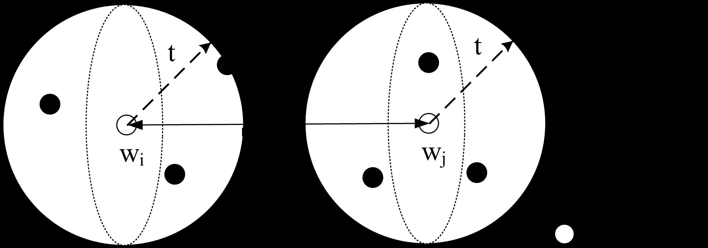

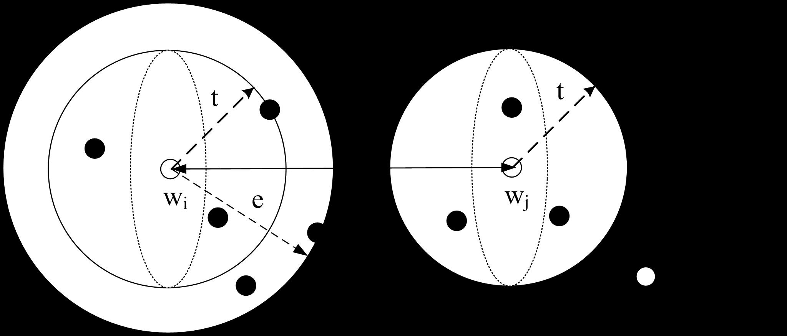

<!-- page: 64 -->

分组码的纠（检）错能力与d0的关系

最小码距d0：所有码组之间的最小码距，决定码的纠检错能力。

0
1
e
d 

（1）检测e个随机错误：

0
2
1
t
d 

（2）纠正t个随机错误：

0
1
t
e
d 


（3）纠正t个同时检测e（>t）个随机错误：

A
B
e
t
.
.
A’ B’

t
t
.
.
A’
B’

e
.
.
A’
A
B

A
B

d0

d0

d0

64

<!-- page: 65 -->

分组码的纠（检）错能力与d0的关系

以（n,1)重复码为例：

 A、B两种消息用“1”、“0”表示，编为(2,1)重复码为“11”“00”，

d0为2，可检测1位错。

例1：编为(3,1)重复码为“111”及“000”。

ü d0为3，用于检错时，可检出2位错；

ü 用于纠错时，根据最大似然准则，可纠正1位错。

例2： 编为(4,1)重复码为“1111”及“0000”。

ü d0为4，用于检错时，可检出3位错；

ü 用于纠错时，可纠正1位错的同时检出2位错。

65

<!-- page: 66 -->

8.5.3 线性分组码的生成矩阵与监
督矩阵

66

<!-- page: 67 -->

线性分组码的编码

      设m为k维信息矢量，c为n维码矢量，一般线性分组码可以 (n,k)
两个参数表示。线性分组码的编码规则很简单：

c
mG


式中G是k行n列(�≥�)的秩为k的矩阵，称为生成矩阵。

�0,0
⋯
�0,�−1
⋮
⋱
⋮
��−1,0
⋯
��−1,�−1

�=

对于二元编码， c 和m 都是二元向量，G 为有限域GF(2)上的�×n矩阵，
��,�∈{0,1}，向量与矩阵之间，矩阵与矩阵之间均为模2运算。

67

<!-- page: 68 -->

3重复码是(3,1)线性分组码，码字只有两个：

例

0
0
0
1
1
1

�0 = �
�1 = �
�2 = �

多项式描述
构造G=[1 1 1]

生成矩阵
编码
公式

c=mG = �0  �1  �2 =m[1 1 1]=[m m m]

码字

信息矢量

68

<!-- page: 69 -->

1
0
0
1
0
1
0
1
0
0
1
1

(4,3)偶校验码是一个(4,3)线性分组码，其生成矩阵=

例

当�= (�0, �1, �2) = (101)时，求其码字。

解：按照偶校验编码规则，并将m代入得

1
0
0
1
0
1
0
1
0
0
1
1
 = (1010)

�= ��= (�0�1�2�3) = (101)

69

<!-- page: 70 -->

1
 零向量�= (0,0, ⋯, 0)一定是一个码字，称为零码字；

      当G给定时，线性分组码有如下性质：

2
 任意两码字的和或差仍是一个码字；

线性性

3
 任意码字c是G的行向量g0, g1, ⋯, g�−1的线性组合；

对称性

4
线性分组码的最小距离等于最小非零码字重量，即

c
d
w c

min
min
( )



最小码距         最小码重

70

<!-- page: 71 -->

对于GF(2)上的�× �矩阵G，存在(n-k)×n矩阵

线性分组码的译码：监督矩阵

ℎ0,0
⋯
ℎ0,�−1
⋮
⋱
⋮
ℎ�−�−1,0
⋯
ℎ�−�−1,�−1

                                       �=

���= � �×(�−�)

使得:

H：一致校验矩阵（或称监督矩阵）。�T为H 的转置。由编码公式有:

k
n k
cH
mGH
m


(
)
[0] 




T
T

θ为(n-k)维零向量。

71

<!-- page: 72 -->

(
)
s
k
k
n k
G
G
I Q 







Ø 如果生成矩阵G具有形式:

      则称该码为系统码，其中��为�× �单位阵。

        相应的监督矩阵��:

系统一致校验矩阵

(
)
(
)
T
s
k
n k
n k
H
H
Q
I









Ø ��与��仍然满足:
(
)
[0]
T
s
s
k
n k
G H




系统生成矩阵

Ø G和�的角色可以互换，即H作为生成矩阵，G为校验矩阵。由H生成的码字

称为c的对偶码。

72

<!-- page: 73 -->

1
0
1
1
0
0
1
0
1
1
1
1
0
1
0
 ,   求对应的�s和��。

 一个(5,3)线性分组码的生成矩阵G=

例

解：对G进行初等变换，用��表示G的第i行

②+③①:10001; ②②:01011; ①+②+③③:00111

1
0
0
0
1
0
1
0
1
1
0
0
1
1
1

��= 0
1
1
1
0
1
1
1
0
1

系统校验矩阵

��=

系统生成矩阵

73

<!-- page: 74 -->

 (5,3)线性分组码码例

消息m
000
001
010
011
100
101
110
111

G生成

码字
00000
11010
01011
10001
10110
01100
11101
00111

��生成

码字
00000
00111
01011
01100
10001
10110
11010
11101

对偶码

码字
00000
11101
01110
10011

��生成的码字前三位即信息位。

74

<!-- page: 75 -->

例：线性分组码的编码

1
1
0
0
1
1
1
1
1
1
0
1















P



]
[
T
k P
I
G 

线性分组码的典型生成矩阵为:        ,其中
  是     的单位矩阵。所以有:

kI
k
k 





1
0
1
1
1
0
0
1
1
1
0
0
1
0
0
1
1
1
0
0
1
G


















G
M
A



由典型生成矩阵生成的码是系统码:
如        时，通过生成矩阵求得的码字为 :

]
001
[

M


1
0
1
1
1
0
0
1
0
1
1
1
0
0
1
1
1
0
0
1
0
0
1
1
1
0
0
1
]
001
[








A











75

<!-- page: 76 -->

例：线性分组码的编码

例：已知（7，3）线性分组码监督矩阵为

0
0
0
1
1
1
0















0
0
1
0
1
1
1

H



0
1
0
0
1
0
1

1
0
0
0
0
1
1





求：
（1）监督元与信息元之间的关系式；
（2）生成矩阵；
（3）此码的全部码字；
（4）此码的码距    及纠、检错能力。

0
d

76

<!-- page: 77 -->

例：线性分组码的编码

0
0
0
1
1
1
0





H
解：（1）











0
0
1
0
1
1
1

T
T
O
A
H





0
1
0
0
1
0
1

1
0
0
0
0
1
1





4个监督元和3个信息元之间的关系为：

a
a
a




4
5
3

a
a
a
a





4
5
6
2

a
a
a




4
6
1

a
a
a




5
6
0

77

<!-- page: 78 -->

例：线性分组码的编码

1
0
0
0
0
1
1
0
1
0
0
1
0
1
0
0
1
0
1
1
1
0
0
0
1
1
1
0















（2）

H


r
PI
H 







生成矩阵：

]
[
T
k P
I
G 

0
1
1
1
1
0
0
1
0
1
1
0
1
0
1
1
1
0
0
0
1
G


















78

<!-- page: 79 -->

例：线性分组码的编码

解：（3）

0
1
1
1
1
0
0
1
0
1
1
0
1
0
1
1
1
0
0
0
1
G














生成矩阵

序
号

码         字





信息元
监督元

0
0  0  0
0  0  0  0

G
M
A



1
0  0  1
1  1  1  0

2
0  1  0
1  1  0  1

1
0
0
0
1
1
1
















如：

3
0  1  1
0  0  1  1

A

[110]
0
1
0
1
1
0
1
[1101010]

4
1  0  0
0  1  1  1

0
0
1
1
1
1
0

5
1  0  1
1  0  0  1

6
1  1  0
1  0  1  0

7
1  1  1
0  1  0  0

（4）除全零码字以外的7个码字的重量最小值即为此（7，3）分组码的最
小码距。最小码距：
4
0 
d

79

<!-- page: 80 -->

例：线性分组码的编码

例：重复码是最简单的一类线性分组码。（n，1）重复码总共只有2个码字，

一个全0码字，另一个是全1码字。
   如（5，1）重复码的两个码字分别为“00000”和“11111”。试求出

（5，1）重复码的监督矩阵和生成矩阵。

]
[
0
1
2
3
4
a
a
a
a
a
A 
解：

a
a














a
a
a
a
a
a
a
a


















0
0
0
0

3
4

1
0
0
0
1
0
1
0
0
1
0
0
1
0
1
0
0
0
1
1





4
3

a
a











2
4



4

4
2

PI
H




a
a

1
4

4
1

a
a





0
4

4
0


1
1
1
1
1
]
[
]
[
1



T
T
k
P
I
P
I
G

80

<!-- page: 81 -->

线性分组码的译码

      码字通过信道传输可能出错，若信道无记忆，接收向量可表示
成码矢量和差错的线性叠加。

r
0
1
1
( , ,
,
)



n
r r
r
c
0
1
1
( , ,
,
)



n
c c
c
e
0
1
1
( , ,
,
)



n
e e
e
s
0
1
1
( , ,
,
)



n k
s s
s

接收向量：
差错图案：

码矢量：
伴随式：

r
c
e


0
0
1
1
1
1
(
,
,
,
)







n
n
c
e c
e
c
e

(5.3.9)

(5.3.10)

T
T
T
s
rH
cH
eH




s


s


      若       ，则传输中一定有错误发生；若       ，传输中无差错或
错误图案恰好为一个码字。

81

<!-- page: 82 -->

伴随式纠错译码步骤：

1
构造伴随式-差错图案表s-e；

2
对接收向量计算伴随式�= ���；

3
查(s,e)表得e；

4
纠错:            。
ˆc
r
e



5
译码:�→�。

82

<!-- page: 83 -->

1
0
0
1
1
0
0
1
0
0
1
1
0
0
1
1
0
1
接收矢量 r = (111001)，对其译码。

(6,3)线性分组码，系统生成矩阵�s=

例

1
0
1
1
0
0
1
1
0
0
1
0
0
1
1
0
0
1

1
求系统校验矩阵。

��=

2
由�= ����，构造s-e表。

差错图案e
000000
100000
010000
001000
000100
000010
000001

伴随式s
000
110
011
101
100
010
001

83

<!-- page: 84 -->

3
由式�= ����计算接收向量伴随式，得s=(001)。

4
查(s,e)表可知，对应的差错图案e=(000001)。

5
纠错计算得码字估值

ˆ
111001
000001
111000
c
r
e






6
恢复原始消息。对于系统(6,3)码，前三位即发送消息，即
m=(111)，非系统码需要查消息-码字对照表恢复原始消息。

84

<!-- page: 85 -->

如果对[例+]的 (5,3)线性分组码进行译码，购造其s-
e表：
差错图案e
00000
10000
01000
00100
00010
00001

伴随式s
00
01
11
11
10
01

同一个伴随式对应不只一个差错图案，怎么办？
标准阵列译码：
1
计算每个伴随式对应的所有2�差错图案，选择
重量最轻的作为e估值。

    即便如此，依然会
出现译码歧义，如上表。
s=01时，对应的两个差
错图案的汉明重量都是
1比特，选择哪个更好
呢？

2
构造2�−� 2�标准阵列译码表，首行��打头列
出所有码字，每列码字相同。

3
以��打头，依汉明重量由小到大顺序按行排列
所有差错图案，每行差错图案相同。每行的差
错图案与前面所有行的都不同。

4
第i行、j列元素为��+ ��。

完备码

85

<!-- page: 86 -->

例：线性分组码的译码

以前面所列举的（7，3）码为例：
1．求出错误图样E与伴随式S之间的关系。错1位的7种错误图样
所对应的伴随式，刚好对应   中的7行。

T
H

1
0
0
0
1
1
0
0
1
0
0
0
1
1
0
0
1
0
1
1
1
0
0
0
1
1
0
1















H



伴随式和错误图样的对应关系:





  编  号
 错码位置
E
S

6
b

     1
[1000000]
[1110]

1
1
1
0
0
1
1
1
1
1
0
1
1
0
0
0
0
1
0
0
0
0
1
0
0
0
0
1
























5b

     2
[0100000]
[0111]

4
b

     3
[0010000]
[1101]

3b

T
H

     4
[0001000]
[1000]

2
b

     5
[0000100]
[0100]

1b

     6
[0000010]
[0010]

0
b

     7
[0000001]
[0001]

86

<!-- page: 87 -->

例：线性分组码的译码

2．计算接收码字的伴随式，然后查上面表得错误图样。
如接收码字为B＝[1100111]，则其伴随式为：
1
1
1
0
0
1
1
1
1
1
0
1
[1100111]
[1110]
1
0
0
0
0
1
0
0
0
0
1
0
0
0
0
1





























T
S
B H

查上面表得错误图样E＝[1000000] ，可见
接收码字中b6有错误。

3．用错误图样纠正接收码字中的错误。

]
0100111
[
]
1000000
[
]
1100111
[





E
B
A

87

<!-- page: 88 -->

例：线性分组码的译码

1
0
0
0
0
1
1
0
1
0
0
1
0
1
0
0
1
0
1
1
1
0
0
0
1
1
1
0















H



例：已知（7,3）线性分组码监督矩阵为
（1）检验“1100111”是否为码字；
（2）当译码器接收到“1100111”时，求译码器的输出。





0
1
1
1
1
1
0
1
1
1
1
0
[1100111]
[1101]
[0000]
1
0
0
0
0
1
0
0
0
0
1
0
0
0
0
1

S
E




]
0111
[
]
1000000
[





























S
E




]
1101
[
]
0100000
[

S
E

]
1110
[
]
0010000
[




S

不是码字

S
E




}
1000
]
0001000
[

S
E




]
0100
[
]
0000100
[

S
E




]
0010
[
]
0000010
[

S
E




]
0001
[
]
0000001
[

[1101]
[0100000]
S
E




]
1000111
[
]
0100000
[
]
1100111
[



E
B
纠正后的码字：
译码器输出：前3位信息码元“100”。

88

<!-- page: 89 -->

第8章 差错控制编码
n 线性分组码的基本性质(续)

  示例：已知某线性分组码的生成矩阵

0
1
1
0
0
1














G

1
0
1
0
1
0

1
1
0
1
0
0





  (1)分析该码的差错控制能力。该分组码所有可能的码字


































w
G
w
G

0
0
0
0
0
0
0
0
0 ,
0
0
1
0
0
1
0
1 1






0
1

w
G
w
G






0
1
0
0
1
0
1
0
1 ,
0
1 1
0
1 1 1 1
0

2
3

w
G
w
G






1
0
0
1
0
0
1 1
0 ,
1
0
1
1
0
1 1
0
1

4
5

w
G
w
G






1 1
0
1 1
0
0
1 1 ,
1 1 1
1 1 1
0
0
0

6
7

  直接观测可得最小码重为3，由此可得最小码距为3；

  该码若用于检错，可检出2位误码；

  该码若用于纠错，可纠正1位误码。

89

<!-- page: 90 -->

第8章 差错控制编码
n 线性分组码的基本性质(续)

  (2)求监督矩阵

    由监督矩阵与生成矩阵间的关系

1
0
0
1
1
0
1
1
0

























k n k
G
P


0
1
0
1
0
1
1
0
1

,

0
0
1
0
1
1
0
1
1

  可得监督矩阵

0
0
1
0
1
1




















|
,
k
n
T

k
n
k
I
P
H

0
1
0
1
0
1

1
0
0
1
1
0





90

<!-- page: 91 -->

第8章 差错控制编码
n 线性分组码的基本性质(续)

  (3)1位误码与伴随式之间的关系，1位误码的所有图样







1
2
6
1
0
...
0 ,
0
1 ...
0 ,...,
0
0
... 1
E
E
E




  可得

1
0
1
1
0
1
0
0
1
0
0
1
0
1
0
1
0
1 ,...,
0
0
0
1
1
0
0
1
0
1
0
0




































T
T
S
HE
S
HE

1
1
6
2

  归纳可得

91

<!-- page: 92 -->

第8章 差错控制编码
n 线性分组码的基本性质(续)

 (4)纠错能力分析



0
0
1 1 1
0

 a、假定只出现1位误码，若收到码字

    计算伴随式

0
1
1
1
0
0





















1
0
0
1
1
0
0
1
0
1
0
1
0
0
1
0
1
1

1
0
1




























T
HR
S















0 1
0
0
0
0

    查表可知该伴随式对应错误图样

    纠错





0
1
1
1
1
0
0
0
0
0
1
0
0
1
1
1
0
0





0
1 1 1 1
0
92

    获得正确的码字                。

<!-- page: 93 -->

第8章 差错控制编码
n 线性分组码的基本性质(续)



0
0
0
1 1
0

  b、假定出现2位误码，例如收到码字



0
1 1 1 1
0

     该码字由许用码字                 出现2位误码得到。

0
1
1
0
0
0





    计算伴随式

















1
0
0
1
1
0
0
1
0
1
0
1
0
0
1
0
1
1

0
1
1




























T
HR
S















1
0
0
0
0
0

    查表可知该伴随式对应错误图样

    纠错操作





0
1
1
0
0
1
0
0
0
0
0
1
0
1
1
0
0
0



    并不能获得正确的码字。

93

<!-- page: 94 -->

第8章 差错控制编码
n 线性分组码的基本性质(续)

  出现2位误码时伴随式的计算结果可分解为

0
0







































































1
0
1
1
0
1
0
0
1
0
1
0
1
1
0
1
0
1
0
0
1
1
0
0
0
1
1
0
0
1
1
1
0
0
0



2
3

H E
E

0
0



1
0
0
0
0
0

   与出现错误图样                  所得的伴随式相同。



1
0
0
0
0
0

   应为该伴随式已经用于对应1位误码                  的
错误图样，因而不能纠正该2位误码。

   两位误码已经超出了该分组码的纠错能力范围。

94

<!-- page: 95 -->

8.5.4 线性分组码的最小码距与最
小码重的关系

95

<!-- page: 96 -->

8.5.4 线性分组码的最小码距与最小码重的关系

  定义8.6.2 线性分组码每个码字中“1”的码元的个数定义为该

码字的重量，简称为码重；码字集中码重最小的码字的重量定义

为最小码重。

  定理8.6.3 线性分组码的最小码距等于其非零码字的最小码重。

96

<!-- page: 97 -->

示例

码长、码重和码距

n 码长n：码组(码字)中码元的数目。

n 码重w：码组中非0码元的数目。

n 码距d：两个等长码组之间对应位不同的数目称为

这两个码组的的汉明距离，简称码距。

例如：码组C1=11010，则码长n=5，码重w=3；
    C1=11010与码组C2=10100之间的距离为d=3。

n 两个二进制码组模二相加得到的新码组的重量就

是这两个码组之间的距离。

97

<!-- page: 98 -->

第8章 差错控制编码
n 线性分组码的基本性质(续)

  示例：已知某线性分组码的生成矩阵

0
1
1
0
0
1














G

1
0
1
0
1
0

1
1
0
1
0
0





  (1)分析该码的差错控制能力。该分组码所有可能的码字


































w
G
w
G

0
0
0
0
0
0
0
0
0 ,
0
0
1
0
0
1
0
1 1






0
1

w
G
w
G






0
1
0
0
1
0
1
0
1 ,
0
1 1
0
1 1 1 1
0

2
3

w
G
w
G






1
0
0
1
0
0
1 1
0 ,
1
0
1
1
0
1 1
0
1

4
5

w
G
w
G






1 1
0
1 1
0
0
1 1 ,
1 1 1
1 1 1
0
0
0

6
7

  直接观测可得最小码重为3，由此可得最小码距为3；

  该码若用于检错，可检出2位误码；

  该码若用于纠错，可纠正1位误码。

98

<!-- page: 99 -->

第8章 差错控制编码
n 线性分组码的基本性质(续)

  (2)求监督矩阵

    由监督矩阵与生成矩阵间的关系

1
0
0
1
1
0
1
1
0

























k n k
G
P


0
1
0
1
0
1
1
0
1

,

0
0
1
0
1
1
0
1
1

  可得监督矩阵

0
0
1
0
1
1




















|
,
k
n
T

k
n
k
I
P
H

0
1
0
1
0
1

1
0
0
1
1
0





99

<!-- page: 100 -->

第8章 差错控制编码
n 线性分组码的基本性质(续)

  (3)1位误码与伴随式之间的关系，1位误码的所有图样







1
2
6
1
0
...
0 ,
0
1 ...
0 ,...,
0
0
... 1
E
E
E




  可得

1
0
1
1
0
1
0
0
1
0
0
1
0
1
0
1
0
1 ,...,
0
0
0
1
1
0
0
1
0
1
0
0




































T
T
S
HE
S
HE

1
1
6
2

  归纳可得

100

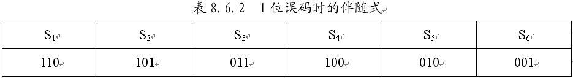

<!-- page: 101 -->

第8章 差错控制编码
n 线性分组码的基本性质(续)

 (4)纠错能力分析



0
0
1 1 1
0

 a、假定只出现1位误码，若收到码字

    计算伴随式

0
1
1
1
0
0





















1
0
0
1
1
0
0
1
0
1
0
1
0
0
1
0
1
1

1
0
1




























T
HR
S















0 1
0
0
0
0

    查表可知该伴随式对应错误图样

    纠错





0
1
1
1
1
0
0
0
0
0
1
0
0
1
1
1
0
0





0
1 1 1 1
0

    获得正确的码字                。

101

<!-- page: 102 -->

第8章 差错控制编码
n 线性分组码的基本性质(续)



0
0
0
1 1
0

  b、假定出现2位误码，例如收到码字



0
1 1 1 1
0

     该码字由许用码字                 出现2位误码得到。

0
1
1
0
0
0





    计算伴随式

















1
0
0
1
1
0
0
1
0
1
0
1
0
0
1
0
1
1

0
1
1




























T
HR
S















1
0
0
0
0
0

    查表可知该伴随式对应错误图样

    纠错操作





0
1
1
0
0
1
0
0
0
0
0
1
0
1
1
0
0
0



    并不能获得正确的码字。

102

<!-- page: 103 -->

第8章 差错控制编码
n 线性分组码的基本性质(续)

  出现2位误码时伴随式的计算结果可分解为

0
0







































































1
0
1
1
0
1
0
0
1
0
1
0
1
1
0
1
0
1
0
0
1
1
0
0
0
1
1
0
0
1
1
1
0
0
0



2
3

H E
E

0
0



1
0
0
0
0
0

   与出现错误图样                  所得的伴随式相同。



1
0
0
0
0
0

   应为该伴随式已经用于对应1位误码                  的
错误图样，因而不能纠正该2位误码。

   两位误码已经超出了该分组码的纠错能力范围。

103

<!-- page: 104 -->

8.5.6 汉明码

104

<!-- page: 105 -->

8.5.6  汉明码

编码器
k位信息元
n位码字


1
1
0
n
n k
n k
A
a
a
a
a







k位信息元
n-k=r位监督元

n 加多少位监督元可满足要求，最经济？

取“＝”号最经济：在纠1位错情况下冗余最小

2
1
r
n



n r位监督元如何加？有没有一般规则？

n 以r=3为例

105

105

<!-- page: 106 -->

第8章 差错控制编码
n  8.5.6汉明码



,n k
1
2 

r
n

  定义8.6.4 如果线性分组码     满足码字长度        ，信

息位           的参数条件，则称这种码为汉明码。

r
k
r



1
2

r
r
n
k








n
r

1
1
2
1
2





Ø 汉明码的编码效率：

Ø 当码字足够长时，汉明码是一种高效码。

106

<!-- page: 107 -->

第8章 差错控制编码
n  8.5.6汉明码

汉明码的纠错能力分析：

1
2 

r
n

    汉明码码字长度

            信息位长度

r
k
r



1
2

            监督位长度                         伴随式个数

n
k
r


2
2
n k
r


Ø 其中全零的伴随式用于对应无误码的状态，

2
1
2
1
n k
r


2
1
r 

     其余的                         个伴随式可分别对应           种错误图样。

Ø 汉明码长度为                。汉明码的非零伴随式全部用于对应1

1
2 

r
n

位误码，所以汉明码能纠正所有的1位误码。

107

<!-- page: 108 -->

8.5.6  汉明码

以r=3为例：



6
5
1
0
3
2
4
A
a a a a a a a


r=3
n=7, k=4

2
1
r
n



s2   s1   s0

4位信息元
7位发送码组

0    0   0

无错

编码器?

1    1    1

a6错

1    1   0

a5错

信道

1    0   1

a4错

a3错

0    1   1

对应标识
译码器
7位接收码组

1    0   0

a2错

0    1   0

a1错

0    0   1

a0错

108

<!-- page: 109 -->

8.5.6  汉明码



6
5
1
0
3
2
4
A
a a a a a a a


r=3
n=7, k=4

2
1
r
n



s2   s1   s0

S2=a6+a5+a4+a2

0    0   0

a6+a5+a4+a2＝0

无错

1    1    1

a6错

S1=a6+a5+a3+a1

a6+a5+a3+a1＝0

1    1   0

a5错

1    0   1

a4错

a6+a4+a3+a0＝0

S0=a6+a4+a3+a0

0    1   1

a3错

a2＝a6+a5+a4

1    0   0

a2错

a1＝a6+a5+a3

1、列出所有差错情况；
2、确定一一对应标识；
3、找出监督码元与信息码元关系；

0    1   0

a1错

0    0   1

a0错

a0＝a6+a4+a3

109

<!-- page: 110 -->

8.5.6  汉明码

3
0 
d
1
2 

r
n

汉明码：一种高效率的纠单个错误的线性分组码。其特点是最小码距　　　，码长n

与监督元个数r满足关系式　　　　。所以有（7，4）、（15，11）、（31，26）
等汉明码。

a
a
a
a
a
a
1．（7，4）汉明码的编码监督元与信息元之间的关系：





6





















5

a
a
a
a

0























1
0
0
1
1
0
1
0
1
0
1
0
1
1
0
0
1
0
1
1
1

0
0
0










6
5
4
2

4














a
a
a
a

0

6
5
3
1

3

a
a
a
a

0









6
4
3
0

2

1

1
1
1
0
1
0
0
1
1
0
1
0
1
0
1
0
1
1
0
0
1
H












a





0

从而：

110

<!-- page: 111 -->

8.5.6  汉明码－编码

由汉明码监督矩阵：


3
1
0
0
1
1
0
1
0
1
0
1
0
1
1
0
0
1
0
1
1
1
PI
H


















1
1
0
1
1
0
1
1
0
1
1
1
P














可得：





1
1
1
0
0
0
1















0
1
1
0
0
1
0




从而：

4
T
P
I
G




1
0
1
0
1
0
0

1
1
0
1
0
0
0





111

<!-- page: 112 -->

8.5.6  汉明码－译码

2．汉明码的译码：
      码长为7的码字中至少加入3位监督元才能纠单个错误，（7，4）汉明码在7

位码字中只有3位监督元，因此（7，4）汉明码是一种纠单个错误的编码效率最
高的线性分组码。

（7，4）汉明码伴随式和错误图样的对应关系：

  编  号
 错码位置
       E
     S

6
b

     1
  [1000000]
    [111]
     2
  [0100000]
    [110]
     3
  [0010000]
    [101]
     4
  [0001000]
    [011]
     5
  [0000100]
    [100]
     6
  [0000010]
    [010]
     7
  [0000001]
    [001]

5
b

4
b

3
b

2
b

1
b

0
b

112

<!-- page: 113 -->

8.5.6 汉明码－译码

1
0
1





Ø
（7,4）汉明码的7种错误图样与7个伴随式之间的关系只要一一对应
就不会影响码的纠、检错能力。所以改变上表的对应关系，即得到
不同的（7，4）汉明码的监督关系。如改变上表的对应关系为：





















0
1
1

1
1
0

T
H



1
1
1

0
0
1

0
1
0

1
0
0
1
1
0
1
0
1
0
1
1
1
0
0
0
1
1
0
1
1
H






1
0
0













从而监督矩阵为





得到另一个（7，4）汉明码的
监督关系方程组为：

a
a
a
a






0



2
3
5
6



a
a
a
a







0

1
3
4
5



a
a
a
a






0

0
3
4
6

Ø 按此方法还可构造出其它不同的（7，4）汉明码的监督关系，进而得到不同的（7，4）

汉明码。尽管码字集不同，但它们具有相同的性能，即编码效率相同，纠、检错能力相
同。

113

<!-- page: 114 -->

8.5.6  汉明码－编码

1
0
0
0
1
1
1
0
1
0
0
1
1
0
0
0
1
0
1
0
1
0
0
0
1
0
1
1














G

G
M
A



由　　　　，可得汉明码16个码字：

 序
 号

     码          字
 序
 号

     码         字

 信 息 元
 监 督 元
 信 息 元
 监 督 元

  0
0  0  0  0
  0  0  0
  8
1  0  0  0
  1  1  1

  1
0  0  0  1
  0  1  1
  9
1  0  0  1
  1  0  0

  2
0  0  1  0
  1  0  1
 10
1  0  1  0
  0  1  0

  3
0  0  1  1
  1  1  0
 11
1  0  1  1
  0  0  1

  4
0  1  0  0
  1  1  0
 12
1  1  0  0
  0  0  1

  5
0  1  0  1
  1  0  1
 13
1  1  0  1
  0  1  0

  6
0  1  1  0
  0  1  1
 14
1  1  1  0
  1  0  0

  7
0  1  1  1
  0  0  0
 15
1  1  1  1
  1  1  1

114

<!-- page: 115 -->

(2�−�-1)
       (n-k)个校验位可组成               个非零矢量，正好等于一致校验矩
阵的列数。

构造系统汉明码的简单方法：

        如上述(7,4)汉明码，共7个非零校验矢量，先写三个单比特非零矢
量在一致校验矩阵后部

1
0
0
0
1
0
0
0
1

��=

1
0
0
0
0
1
0
0
0
0
1
0
0
0
0
1

1
0
1
1
1
1
1
1
0
0
1
1

再将其余4个两比特以上非零矢量随机写在一致校验矩阵前部

1
1
1
0
0
1
1
1
1
1
0
1

1
0
0
0
1
0
0
0
1
��=

��=

11
5

<!-- page: 116 -->

第8章 差错控制编码
n 线性分组码的基本性质(续)

  线性分组码的纠错能力分析



,n k

  汉明界：汉明界确定了一个参数为      的线性分组码可能
获得的最大纠错能力。有关汉明界有如下的定理：



,n k
t

  定理8.6.5 线性分组码      能够纠正码字中任意的小于等
于  位误码的图样数小于    。

k
n
2

n

i




n
i

  若符号     表示所有的  个元素中取  个的组合数。

n
t

  长度为  的码字中任意的小于等于  位错误的图样数为

1
...
1
2
n
n
n
t
















,n k
k
n
2

  线性分组码     不同的伴随式的个数为    ，要保证每个不
同的错误图样有不同的伴随式与其对应，应有

n k
n
n
n
t
















                                  因而有上述结论。

2
1
...
1
2

116

<!-- page: 117 -->

第8章 差错控制编码
n 线性分组码的基本性质(续)
  定义8.6.6 若能够纠正  个及个以下的全部错误的线性分组
码满足条件

t

n
n
n
k
n
...
2
1
1
2
































t

则称这种线性分组码为完备码。

 汉明码是一种完备码。



,n k

 普洛特金界：普洛特金界确定了线性分组码      差错控制能
力的上限。



,n k
min
d

 定理8.6.6 线性分组码      的最小码距    小于等于由下式
确定的所谓普洛特金界

k





1

2
2
1

k
d
n

min

117

<!-- page: 118 -->

第8章 差错控制编码
n 线性分组码的基本性质(续)



7,2

  示例 (1)判断线性分组码      有无纠正2位误码的可能性；



8,2

       (2)判断线性分组码      有无纠正2位误码的可能性。

  分析



7,2

  (1)对于线性分组码      ，因为

k
n
d




1
2
1

min












5
1
2
2
3
14
1
2
2
7
1
2
2

k

2

     所以不可能构建能够纠正2位错误的分组码；



8,2

  (2)对于线性分组码      ，因为

k
n
d




1
2
1

5
1
2
2
3
16
,
3
16
1
2
2
8
1
2
2

min












k

2

    因此有可能可以构建能够纠正2位错误的分组码。

118

<!-- page: 119 -->

第8章 差错控制编码
n 线性分组码的基本性质(续)

  可纠正任意两位误码的(8,2)线性分组码示例

   该码的最小码距：dmin  = 5

119

<!-- page: 120 -->

线性分组码小结

a
a







6
6



a
a
a






a
a

4
6
3




5
5

a
a
a
a





a
a
a


a
a

4
5
6
2

4
4

a
a
a













5
6
1

4
6
3




a
a
a





a
a
a
a





4
5
0

4
5
6
2

a
a
a








5
6
1

a
a
a





4
5
0

错误图样E

伴随式S

码组B

编码信道
信息M
码组A

E

生成矩阵G
监督矩阵H

C=MG
S=BHT

B＝C＋E

C’＝B＋E

120

<!-- page: 121 -->

      目录

Ø 差错控制编码的基本概念；

Ø 简单的差错控制方法；

Ø 线性分组码的代数基础*；

Ø 线性分组码的基本性质；

Ø 循环码；

Ø 卷积码

12
1

<!-- page: 122 -->

      目录

Ø 差错控制编码的基本概念；

Ø 简单的差错控制方法；

Ø 线性分组码的代数基础*；

Ø 线性分组码的基本性质；

Ø 循环码；

Ø 卷积码

12
2

<!-- page: 123 -->

第8章 差错控制编码

n 循环码

  循环码是线性分组码的一个重要子类。

  循环码为我们根据纠错的要求进行编码参数的设计和结构的

实现提供了一种系统的方法。


C

  定义 8.7.1 记   为线性分组码的码字集，如果对任意


C
Ci 
i
C
i
C

的       ，  循环左移或循环右移任意位后得到的码字   ，


i
C
C


仍有       ，则称该线性分组码为循环码。

123

<!-- page: 124 -->

 循环码

1
0

0

0

线性分组码,任一码组循环移位
所得的序列仍在该码组集中。

1

0

0

0

1
0
1

0
0
0

码组
编号

信息位
监督位

码组
编号

信息位
监督位

a6a5a4
a3a2a1a0
a6a5a4
a3a2a1a0

1
2
3
4

5
6
7
8

000
001
010
011

0000
0111
1110
1001

100
101
110
111

1011
1100
0101
0010

(7,3)循环码举例

124

<!-- page: 125 -->

循环码

      如果一个线性分组码的任意一个码字c(n元组)都是另外一个码字
�′的循环移位，称此码为线性循环码。

1
0
0
0
1
0
1
0
1
0
0
1
1
1
0
0
1
0
1
1
0
0
0
0
1
0
1
1

��=

 将上节中的(7,4)汉明码生成矩阵做如下初等变换

1
1
3
4
2
2
4
,
R
R
R
R
R
R
R






1
0
1
1
0
0
0
0
1
0
1
1
0
0
0
0
1
0
1
1
0
0
0
0
1
0
1
1

得到一个新的生成矩阵

�′ =

矩阵的每一行都是第1行循环右移的结果。

12
5

<!-- page: 126 -->

第8章 差错控制编码

n 循环码

  码多项式

Ø  码字与多项式可建立如下的对应关系，相应的多项式称之。




1
2
0 1
1
1
2
1
0
...
...
n
n
n
n
n
C
c c
c
C X
c
X
c
X
c X
c













Ø 码多项式系数的加乘运算规则

      加运算

0
0
0  0 1
1  1
0
1  1 1
0
0 0
0    0 1
0   1 0
0   1 1
1













      乘运算

126

<!-- page: 127 -->

第8章 差错控制编码

n 循环码(续)

Ø 整数域中的同余类

  在整数除法中，取定整数除数n，将所有整数m按除以n所得的
余数进行分类，余数相同的整数归为一类，称为关于n的同余类

,
m
p
Q
p
n
n
n





n
n
p
m


  Q与p 均为整数。关于n的同余类记为:

Ø 多项式域中的同余类


X
n





X
n

  同理可定义关于     多项式的同余类

X
m



X
p
X
Q
X
n

  记为:




X
n
X
p
X
m
mod


127

<!-- page: 128 -->

第8章 差错控制编码

n 循环码(续)

  示例：多项式

3
4
3
2

X
X
X
X
X
X

2
1,







X
X




1

        是关于多项式          的同余类。

  因为

3

X
X
X
X
X
X
X
X










1
1
1
1

2
2

4
3
2
2
2
2

X
X
X
X
X
X
X
X
X
X











1
1

  即两者的余式相同。

128

<!-- page: 129 -->

第8章 差错控制编码

n 循环码(续)

  循环码的代数结构(有关循环码的主要定理)


X
C

定理 8.7.2 若     是长度为n的循环码中的一个码多项式，i为
不等于零的整数，则       按模      运算的余式必为循环码中
的另一码多项式。


X
C
X i
1

n
X













1
2
1 0
1
2
1 0
1
1
1
2
......
...
...
i

n
n
n
i
n
n
i
n
i
C X
X C X
c
c
c c
c
c
c c
c
c










  用归纳法可证明上式。



,n k
k
n 

定理 8.7.3 在循环码     中，幂次数为     ，且其常数项不等
于“0”的码字多项式:


1
,
...
0
0
1
1
1














c
c
c
X
c
X
c
X
c
X
g
k
n
k
n
k
n
k
n
k
n

有一个且只有一个。

129

<!-- page: 130 -->

第8章 差错控制编码

n 循环码(续)

  循环码的代数结构(有关循环码的主要定理)









2
1
,
,
,  ...  ,
k
g X
Xg X
X g X
X
g X


  对于多项式：

  因为多项式的幂均小于n，由上述两个定理，可知这些多项式均

为码多项式。

130

<!-- page: 131 -->

第8章 差错控制编码
n 循环码(续)

  由











































k



1

k
X
g X

2
1
...
...
1
0
...
...
...
0
0

X
g X

0
1
...
...
1
...
...
...
0
0







...
...
...
...
...
...
...
...
...
...
...

g

...
...
...
...
...
...
...
...
...
...
...






Xg X

0
0
...
...
...
1
...
...
1
0

g X

0
0
...
...
...
0
1
...
...
1

  可知矩阵g中的每一行均为一个码字。

  因为矩阵g的秩为k，可知相应的k个码字互不相关，因此可以
构成相应的码字空间的一组基。







k



1

X
g
X



















  因此可定义相应的码多项式生成矩阵

k



2

X
g
X



X
G



...

X
Xg

X
g





131

<!-- page: 132 -->

第8章 差错控制编码

n 循环码(续)

  相应地可定义码的生成多项式


1
,
...
0
0
1
1
1














c
c
c
X
c
X
c
X
c
X
g
k
n
k
n
k
n
k
n
k
n

1
1
0
,
,...,
k
k
a
a
a



  给定信息码组          ，由码多项式生成矩阵，可得相应
的码多项式为








C X
a
a
a a
G X



,
,...,

k
k




1
2
1
0





























k



1

X
g X

k



2

X
g X
a
a
a a




,
,...,
...

k
k




1
2
1
0






Xg X

g X










k
k
k
k






1
2
1
2
1
0

a
X
g X
a
X
g X
a Xg X
a g X

...





k
k
k
k






1
2
1
2
1
0

a
X
a
X
a X
a
g X







...

132

<!-- page: 133 -->

第8章 差错控制编码

n 循环码(续)


X
C


g X

  定理 8.7.4  在循环码中，所有的码多项式      都可以被
生成多项式      整除。

  因为









1
2
0
1
1
1
2
1
0
,
,...,
...
k
k
k
k
k
C X
a a
a
G X
a
X
a
X
a X
a
g X












  所以有定理的结论。

1
k 

  推论 8.7.5 次数不大于     次的任何多项式与生成多项式
的乘积都为码多项式。

  由上式很容易看出结论成立。

133

<!-- page: 134 -->

第8章 差错控制编码

n 循环码(续)


X
g
1

n
X

  定理 8.7.6 循环码的生成多项式     是多项式      的一
个因式。
因为生成多项式       的幂为n-k ，多项式        的幂一定
为 n，所以有


X
g


k
X g X




k

X
g
X

X
R
X

1
1
1




n
n

X



R X

其中余式      的幂小于n。由定理 8.7.2， 是一码字的多项
式，又由定理 8.7.4，      可以表示为



R X






R X
a X g X




a X

其中     为一幂小于 k 的多项式。综合上两式，有






X
g
X
a
X
X
R
X
X
g
X
n
n
k






1
1

移项得













1
n
k
k
X
X g X
a X g X
X
a X
g X
h X g X









1

n
X

X
g

可见生成多项式     是多项式      的一个因式

134

<!-- page: 135 -->

第8章 差错控制编码

n  循环码(续)

 由定理8.7.3，定理8.7.6，可归纳判断生成多项式的充要条件:
     （1）      是一个     次的多项式；
     （2）      的常数项不等于0；
     （3）      是       的一个因式。


X
g

n
k



X
g


X
g
1

n
X

   定义 8.7.7 定义式

n
1





X
g
X
X
h

  为循环码的一致校验多项式。



X
g
X
A
X
C










X
A
X

  因为码多项式可以表示为
  因此有

X
A
X
g
X
h
X
g
X
A
X
h
X
C
X
h




n
1



   由此，可利用一致校验多项式对接收的码字进行差错校验。

135

<!-- page: 136 -->

n   循环码(续)

第8章 差错控制编码



7,4
1
2
3

X
X

    示例：分析多项式                      能否作为循环码            的生成多
项式。

7







X


X
X
X
X
X

1
1
1
2
3
4
2
3

   因为

3
4
7



k
n


7,4

   且其幂                          及常数项不为零，所以可作为            的生成
多项式。

  所得到的循环码的生成矩阵

1
1
0
1
0
0
0
0
1
1
0
1
0
0
0
0
1
1
0
1
0
0
0
0
1
1
0
1
1







































6
5
3

X
X
X
X
X
X
G X
G
X
X
X
X
X

5
4
2




4
3

3
2

1100
0
1
2
3

a
a
a
a

   输入信息位

6 5
1 0
...
1011100
c c
c c 

   编码输出                                        ，这是一种非系统码的编码方式。

136

<!-- page: 137 -->

n   循环码(续)

第8章 差错控制编码

    系统码结构的循环码

     输入信息位与对应的多项式




1
2
1
2
1
0
1
2
1
0
...
...
k
k
k
k
k
k
a
a
a a
A X
a
X
a
X
a X
a













    由






X
g

X
A
X
k
n



X
P
X
Q
X
g






Q X

                                                               式中          的幂小于等于k-1

    可得









n k



X
A X
Q X g X
P X












    整理后可得

n k



Q X g X
X
A X
P X











    取编码输出

n k
S



C
X
X
A X
P X




    根据推论 8.7.5，且该多项式对应的码字具有系统码结构

    因此该码为系统码结构的循环码。

137

<!-- page: 138 -->

n   循环码(续)

第8章 差错控制编码




    示例：已知循环码

7,4




3
2

g X
X
X





1

                的生成多项式

a a a a



1100

                输入信息码组                                 求系统码编码输出。

3
2
1
0

    由









3
3
2
6
5
2
3
3
2
3
2
3
2

X
X
X
X
A X
X
X
X
X
g X
X
X
X
X
X
X















n k



1
1
1
1
1

   可得






3
2

Q X
X
P X
X






1,
1








   码字多项式为

n k
S



6
5
2

C
X
X
A X
P X
X
X
X

1
















   或

3
3
2

C
X
Q X g X
X
X
X

1
1







S

6
5
2

X
X
X

1






6 5 4 3 2 1 0
1100101
c c c c c c c 

   系统码编码输出

138

<!-- page: 139 -->

n   循环码(续)

第8章 差错控制编码

     系统码结构的循环码的生成矩阵和监督矩阵



k
n
k
k P
I
G


,
|

     已知系统码结构的线性分组码生成矩阵为

    系统码结构的循环码码多项式的一般形式




X
P
X
A
X
X
C
k
n
S




    根据生成矩阵每一行对应相应一个特殊码字的特点









1
2
1
2
1
0
,
,...,
,
1
k
k
k
k
A
X
X
A
X
X
A
X
X A
X









    分别取

    计算














n k



X
A X
P X
Q
X
i
k
k
g X
g X

i
i
i







1,
2,...,1,0

P X
i
k
k

,
1,
2,...,1,0





    可得

i

    由此可导出系统码结构循环码的生成矩阵。

139

<!-- page: 140 -->

n   循环码(续)

第8章 差错控制编码

    系统码结构循环码的生成矩阵



























































n k
n
k
k
k
n k
n
k
k
k












1
1
1
1
2
2
2
2

X
A
X
P
X
X
P
X

X
A
X
P
X
X
P
X
G X




......
......















n k
n k




1
1
1
1

X
A
X
P X
X
P X

n k
n k




X
A
X
P
X
X
P
X

0
0
0

p
p
p
p

1
0
...
0
0
...


















k
n k
k
n k
k
k








1,
1
1,
2
1,1
1,0

p

p
p
p

0
1
...
0
0

...

k
n k

k
n k
k
k




2,
1






2,
2
2,1
2,0

...
...
...
...
...
...
...
...
...
...

G



p
p
p
p

0
0
...
1
0
...

n k
n k

1,
1
1,
2
1,1
1,0




p
p
p
p

0
0
...
0
1
...

n k
n k

0,
1
0,
2
0,1
0,0







I
P

|



k
k n k

,





k

140

T
k n k
n

    相应地其监督矩阵为：

H
P
I

|

,



<!-- page: 141 -->

n   循环码(续)

第8章 差错控制编码






    示例：求生成多项式为

3
2
1

g X
X
X




7,4

               的系统码循环码               的生成矩阵与监督矩阵。

    分别取特定信息码组对应的多项式为

3
2
,
,
, 1
X
X
X

    因为

3
3
6
2
3
2
3
2
3
2
3
2

X X
X
X
X
X
X
X
X
X
X
X
X
X
X X
X
X
X
X





















1
1
1
        mod
1




   即有

3
3
2
3
2




  同理可得

3
2
3
2

X X
X
X
X

1            mod
1









3
2
3
2

X X
X
X
X
X

1     mod
1










3
2
3
2

X
X
X
X

1               mod
1






  由此可得相应的生成矩阵与监督矩阵

141

<!-- page: 142 -->

n   循环码(续)

第8章 差错控制编码

    生成矩阵

1
0
0
0
1
1
0
0
1
0
0
0
1
1
0
0
1
0
1
1
1
0
0
0
1
1
0
1














G

    监督矩阵

1
0
1
1
1
0
0
1
1
1
0
0
1
0
0
1
1
1
0
0
1












H

142

<!-- page: 143 -->

n   循环码(续)

第8章 差错控制编码

    循环码的编码器与译码器电路实现

    在各种专用和通用的数字信号处理器和计算机在通信设备中
获得广泛应用之前，采用带反馈的移位寄存器结构的电路是实
现循环码编译码器的主要途径。

    循环码编译码电路主要由除法器组成。

   除法电路


0
1
1
1
...
g
X
g
X
g
X
g
X
g
r
r
r
r








   已知除多项式

   相应的除法电路为

143

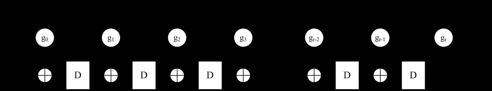

<!-- page: 144 -->

n   循环码(续)

第8章 差错控制编码



F X
1
n 
n

    一般地，若被除式             的最高次幂为            ，需要      次移
位完成除法运算；

    商在除法器运算过程中移位输出；运算结束后，余式保留在
寄存器内。

    完成一次除法运算需要n个时钟信号，此后将余式从移位寄存
器中移出另外需要r个时钟，共需要 n + r 个时钟

144

<!-- page: 145 -->

n   循环码(续)

第8章 差错控制编码

    示例：分析除法电路工作原理，已知

    除式




6
5
4
3

g X
X
X
X
X







13
11
10
7
4
3
1




F X
X
X
X
X
X
X
X

1

    被除式










    直接通过计算，可得




         商式

7
6
5
2

4
2
1
Q X
X
X
X
X
X











         余式

P X
X
X




    根据一般的除法电路构成原理，可得相应的除法电路

145

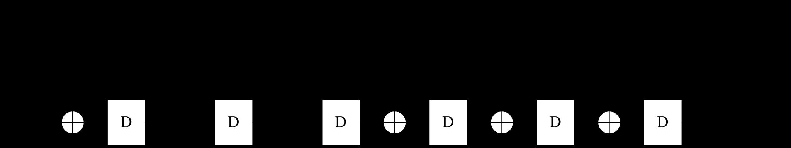

<!-- page: 146 -->

n   循环码(续)

第8章 差错控制编码

移位时钟

输入被除式序列

移位寄存器状态

输出商
反馈信号

   除法电路

序号

（高幂次位在前）

（高幂次位在右）

0

0

L 000000 H

0

000000

   状态变化

1

1

100000

0

000000

2

0

010000

0

000000

   如右表所

3

1

101000

0

000000

4

1

110100

0

000000

   示

5

0

011010

0

000000

6

0

001101

1

000000

7

1

000001

1

100111

8

0

100111

1

100111

9

0

110100

0

100111

10

1

111010

0

000000

11

1

111101

1

000000

12

0

111001

1

100111

13

1

011011

1

100111

14

1

001010

0

100111

（余式）

146

<!-- page: 147 -->

n   循环码(续)

第8章 差错控制编码

    先行进位除法电路

    一般地，最高次幂为r的除法电路共有r个寄存单元，前述的除
法电路在前面的r个时钟实际上是在做除法运算前的准备。

    普通的除法电路运算的因准备阶段的用时，时延较大。

    先行进位除法电路结构

   直接将除式送到最高位，节省准备阶段的移位时间，完成一次
除法运算并将余式移出只需n个时钟，效率较高。

147

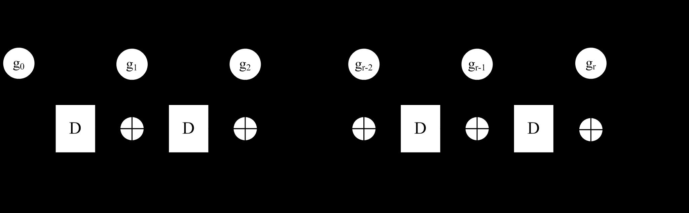

<!-- page: 148 -->

n   循环码(续)

第8章 差错控制编码

     系统码结构的循环码编码器



g X

    除式即为生成多项式               除式的最高次幂：r＝n－k

    编码过程

    前k个时钟，开关S1、S2合下



1
2
1
0
...
k
k
a
a
a a
A X




       信息位                                        输入除法器，做除法运算，同
时作为码字的高k位从编码器输出；

    后n－k个时钟，开关S1、S2合上

       停止除法运算，余式作为码字的第n－k 位从编码器输出。

148

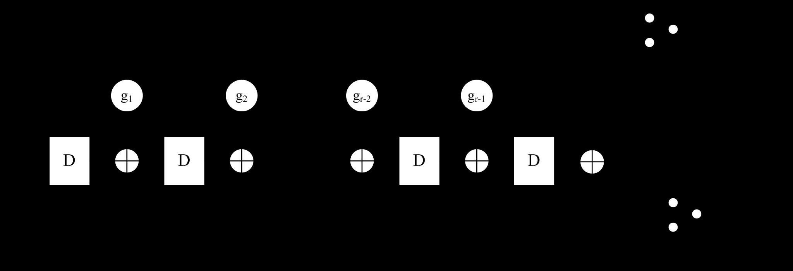

<!-- page: 149 -->

n   循环码(续)

第8章 差错控制编码

    循环码是线性分组码的一种，一般的线性分组码的译码方法
均可用于循环码的译码。

   利用循环码的特点，译码电路的实现通常可更为简单。

   循环码译码原理

   记  码字多项式














C X

         错误图样对应的多项式                ( 当没有误码时               )

E X
E X

0



R X
C X
E X




         接收多项式

     译码的基本方法

         (1) 根据接收码字计算伴随式
















S X
R X
C X
E X
g X





    mod

E X
g X

                               mod



149

<!-- page: 150 -->

n   循环码(续)

第8章 差错控制编码





S X
E X


     (2) 由伴随式确定错误图样















R X
E X
C X
E X
E X
C X






     (3) 进行纠错操作

   注意：在码的纠错纠错能力范围才能实现真正的误码纠正。

    循环码的译码特点





0   mod
C X
g X



C X

    对循环码的码字         ，一般地有

                        的伴随式与许用码字无关，即有




0
S X








   mod
S X
E X
g X


    恒等式两边乘      ，可得







   mod
i
i
X S X
X E X
g X

i
X

    若记                                即           是         循环移位后对应的误
码图样





=
i
iE
X
X E X


iE
X


E X











   mod
i
i
i
i
E
X
S
X
X E X
X S X
g X




   则有

150

<!-- page: 151 -->

n   循环码(续)

第8章 差错控制编码


X
E

X
S

    即对于循环码，若已知           的伴随式





=
i
iE
X
X E X

X
S

    则                          的伴随式可由         在除法电路中通过移位获
得，从而可简化纠错译码的电路实现。



7,3

    示例：可纠正任意的1位误码的循环码          的译码电路


1
2
3
4




X
X
X
X
g

                已知循环码的生成多项式为

     译码器电路结构

151

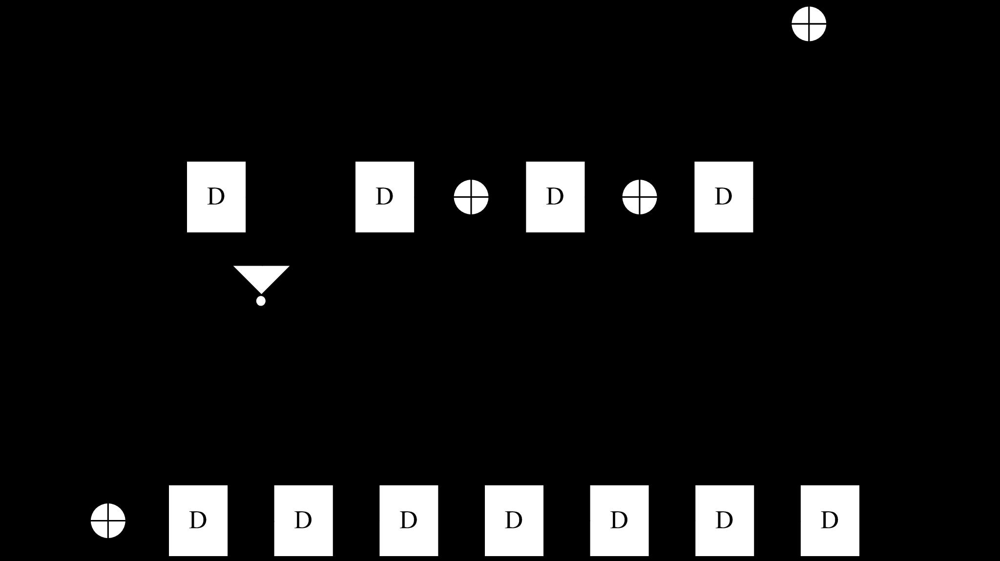

<!-- page: 152 -->

n   循环码(续)

第8章 差错控制编码

     错误图样与伴随式间的关系

     任何第 i 位的误码，其伴随式在除法电路中经相应的 i 位的移
位后，都与第1位的错误图样(1000000)的伴随式相同。

     因此译码电路的校正电路仅需对应第1位的伴随式(1110)。

152

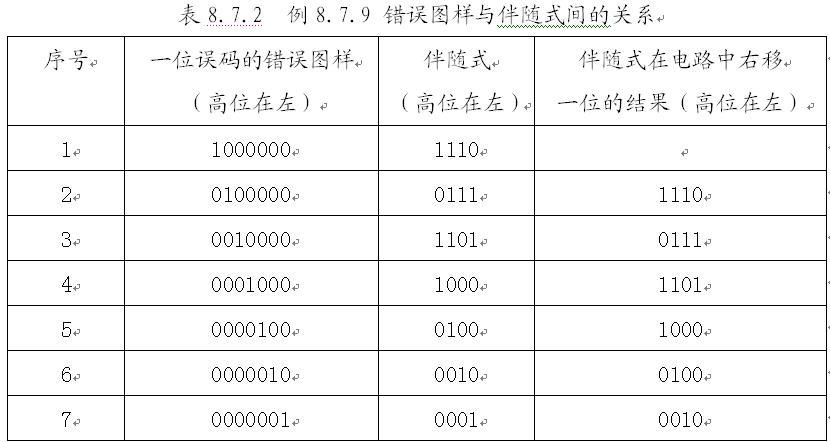

<!-- page: 153 -->

n   循环冗余校验码

第8章 差错控制编码

  循环冗余校验（Cyclic Redundancy Check，CRC）

    循环冗余校验的一般形式







CRC

r
C
X
X A X
P X





A X


P X

    式中         为信息多项式；        为校验多项式。




1
2
1
2
1
0
k
k
k
k
A X
a
X
a
X
a X
a











1
2
1
0
,
,
,
,
k
k
a
a
a a



                                       是码字中的数据位。

                     为                           的 余式。



P X




r
X A X
g X







CRC
R X
C
X
E X



    接收码字可表示为：



0
E X


           若                 ，认为传输没有错误；



0
E X


                                 ，认为传输没有错误。

153

<!-- page: 154 -->

n   循环冗余校验码（续）

第8章 差错控制编码

  常用的CRC码生成多项式

154

<!-- page: 155 -->

n   循环冗余校验码（续）

第8章 差错控制编码

  CRC码生成多项式的检错能力

    CRC码可检测如下的错误：

r

       （1）突发长度    小于的突发错误。

1
r 


1
2
r



       （2）大部分突发长度等于         的错误，其中不可检测的
这类错误只占            。

1
r 
2 r


       （3）大部分突发长度大于        的错误，其中不可检测的这
类错误只占       。

       （4）所有与许用码组码距小于等于           的错误。

min
1
d


       （5）所有的奇数个随机错误。

155

<!-- page: 156 -->

n   循环码(续)

第8章 差错控制编码

    汉明循环码

    汉明循环码是汉明码的一个子类。有关汉明循环码有如下的
定理：


X
f
k
n
m



X
f


g X
2
1,
2
1
,
3
m
m
n
k
m m






   定理8.7.8 若          是                次幂的本原多项式，则由         作
为生成多项式          构建                                                    的循环码
是汉明码。

   有关定理的证明详见教材。

   因为有限域中的本原多项式可以通过计算机遍历搜索的方法得
到，因此定理8.7.8提供了一种构造具有汉明循环码的一般方法。

156

<!-- page: 157 -->

n   循环码(续)

第8章 差错控制编码

    已知的可构造汉明循环码的参数表

157

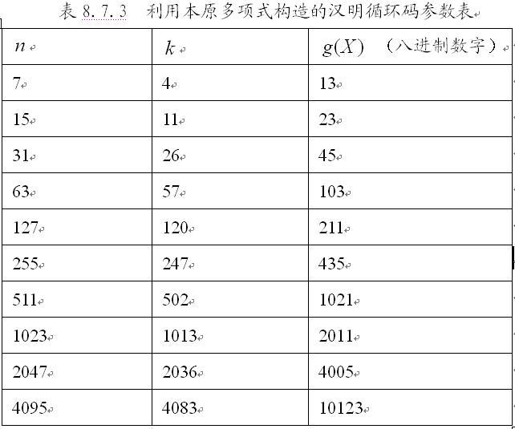

<!-- page: 158 -->

n   循环码(续)

第8章 差错控制编码

    示例：试构建一参数位（15,11）的汉明码，求其系统码结构
的生成矩阵和监督矩阵，并计算其码率。

15,
11
n
k



    由表8.7.3，由            的编码参数要求，可选择对应的
生成多项式的参数








4
23
010 011
1
g X
X
X





八进制

  得系统码结构的多项式形式的生成矩阵






























14
10
13
9
4

X
P
X
X
P
X
G X
P X
X
g X
i









i
i



,
  mod
,
10,9,...,1,0
......






5
1
4
0

X
P X
X
P
X

158

<!-- page: 159 -->

n   循环码(续)

第8章 差错控制编码

    一般形式的生成矩阵为

1
1
0
0
1
0
0
1
1
0
0
1
0
0
0
1
1
0
1
0
0
1
1
0
1
0
1
0
1
0
1
0
0
1
0
0
1
0
1
0
1
0
1
1
1
0
0
1
0
0
1
1
1
0
0
1
0
1
1
1
1
0
1
0
1
0
1
1
0
1
0
1
0
0
1
0
1







































k
n
k
k P
I
G




,





   监督矩阵

1
1
1
1
0
1
0
1
1
0
0
1
0
0
0




















0
1
1
1
1
0
1
0
1
1
0
0
1
0
0

T
k n k
n k
H
P
I



,

0
0
1
1
1
1
0
1
0
1
1
0
0
1
0

1
1
1
0
1
0
1
1
0
0
1
0
0
0
1

159

<!-- page: 160 -->

n  循环码(续)

第8章 差错控制编码

   BCH码*

    BCH码是由Bose和Chaudhuri两人合作及Hochquenghem分别独
立提出的一种可纠正任意的 t 位及 t 位以下错误的循环码。

    BCH码的编码参数：码长

m
n




2
1

r
n
k
mt





                            监督位长度

d
t




2
1

                                最小码距

min

   有关BCH码，有如下的定义和定理



,n k
min
d

   定理8.7.9 线性分组码           最小距离等于       的充要条件是，
其监督矩阵     中任意的列             线性无关。

H
min
1
d


160

<!-- page: 161 -->

n   循环码(续)

第8章 差错控制编码

  BCH码的定义


2
GF


2m
GF

2
GF

x
g

1
min 
d

  定义8.7.10 给定有限域            及其扩展域              ，对于码元取
自            的循环码，若其生成多项式         的根的集合      中含有
个              连续根：



2
1
min
0
0
0
,...,
,

d
m
m
m












m
GF 2


1
min 
d
n
0
m


m
i
m
GF 2
0





2
0
min 


d
i

x
g

其中          是域中的n阶元素，        ，   是任意的整
数，           ，            。则由     生成的码字长度
为n的循环码定义为BCH码。

161

<!-- page: 162 -->

8.8 卷积码

162

<!-- page: 163 -->

第8章 差错控制编码

n 引言

  卷积码与分组码的不同特点

  差错控制编码

a a
a
a
a
a
a
a

......;
...
;
...
;  ......

  信息序列

i
i
i k
i k
i
i
i
k
i
k

0
1
(
2)
(
1)
(
1)0
(
1)1
(
1)(
2)
(
1)(
1)












  编码输出

c c
c
c
c
c
c
c

......;
...
;
...
;  ......

i
i
i n
i n
i
i
i
n
i
n

0
1
(
2)
(
1)
(
1)0
(
1)1
(
1)(
2)
(
1)(
1)










0
1
(
2)
(
1)
0
1
(
2)
(
1)
...
...
i
i
i n
i n
i
i
i k
i k
c c
c
c
a a
a
a





    分组码                 仅与                有关。

    卷积码

a a
a
a

...






i
i
i k
i k

0
1
(
2)
(
1)




a
a
a
a
c c
c
c

...
...
...         ...

i
i
i
k
i
k








1 0
1 1
1 (
2)
1 (
1)

                     与                              有关

i
i
i n
i n

0
1
(
2)
(
1)




a
a
a
a

...










i
L
i
L
i
L
k
i
L
k












1 0
1 1
1 (
2)
1 (
1)

        卷积码也称为一种有记忆编码。

163

<!-- page: 164 -->

第8章 差错控制编码

n 卷积码的构造与表示方法

  卷积码编码器的结构

  每输入 k 比特信息码组，输出一个 n 比特的码字

k
n
i
i
i k
i k
i
i
i n
i n
a a
a
a
c c
c
c






0
1
(
2)
(
1)
0
1
(
2)
(
1)
...
...

  若每个输入信息码组，会影响L个编码输出的码字，则称该卷
积码的约束长度为L，相应地，该卷积码记为



, ,
n k L
k
n
164

  卷积码编码效率：

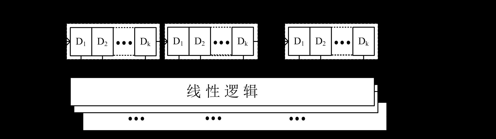

<!-- page: 165 -->

第8章 差错控制编码
n 卷积码的构造与表示方法(续)



3,1,3

  卷积码



3,1,3
3,
1,
3
n
k
L





1
k 
3
n 

   每输入一个         的信息码组，产生一个          的输出码字/码组

  编码器结构

   编码器输入与输出间的关系

a
c



i
i

0.

a
a
c




i
i
i

1
1.





a
a
c

i
i
i

2
2.



   卷积码寄存器中保存的输入码组，称为编码器当前的状态。



3,1,3
1 3
k n 
165

   卷积码           编码效率：

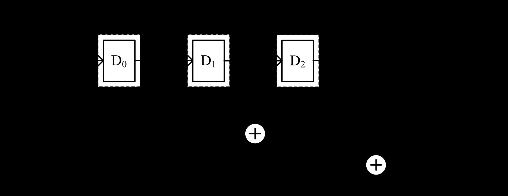

<!-- page: 166 -->

第8章 差错控制编码
n 卷积码的构造与表示方法(续)



3,1,3

  卷积码            编码过程的示例

   输入

a a a a

......
1011.......



0
1
2
3

c c c
c c c
c c c
c c c

;
;
;
......
111;010;110;101;.......



   输出

0,0
0,1 0,2
1,0 1,1 1,2
2,0
2,1 2,2
3,0 3,1 3,2

166

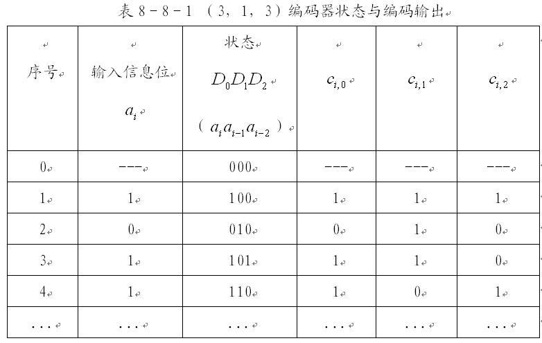

<!-- page: 167 -->

      总结

Ø 差错控制编码的基本概念；

Ø 简单的差错控制方法；

Ø 线性分组码的基本性质；

Ø 循环码；

Ø 卷积码。

16
7

<!-- page: 168 -->

结束

168
