# 第2章 Z变换与序列傅里叶变换

<!-- slide: 1 -->

- 第2章 Z变换与序列傅里叶变换
- 数字信号处理

<!-- slide: 2 -->

- 2.1 序列的Z变换
- 2.2序列傅里叶变换（DTFT）
- 2.3拉普拉斯变换、Z变换、傅里叶变换的关系
- 2.4离散时间系统的频域分析
- 2.5 MATLAB应用实例
- 第2章 Z变换与序列傅里叶变换

<!-- slide: 3 -->

- 2.0 回顾
- 傅里叶变换
- 一个周期信号的重复周期为无穷大时，它就演变为一个非周期信号。 从傅里叶级数就可得到傅里叶变换：

<!-- slide: 4 -->

- 常把
- 和
- 的对应关系简记为
- 是一复函数，可写为
- 为了便于研究，把
- 也称为信号
- 的频谱，把
- 和
- 曲线分别称为非周期信号的振幅频谱和相位频谱。
- 与
- 在概念上就统一了。
- 这样，
- 2.0 回顾
- 傅里叶变换

<!-- slide: 5 -->

- 2.0 回顾
- 傅里叶变换的物理意义
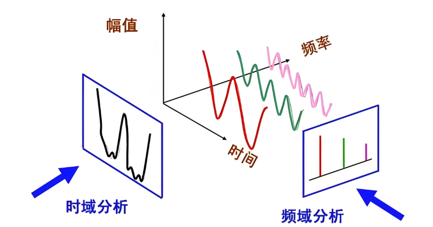

<!-- slide: 6 -->

- 2.0 回顾
- 拉普拉斯变换
- 拉氏变换可以从傅氏变换中引出，其思路是：对于不满足绝对可积条件的信号     ， 通过给其乘上一个衰减因子， 可以使得
- 与衰减因子之积满足绝对可积。
- 具体地讲，给
- 乘以一个衰减因子    ，就可能找到合适的
- 取值，使
- 绝对可积，从而得到
- 的傅里叶变换。
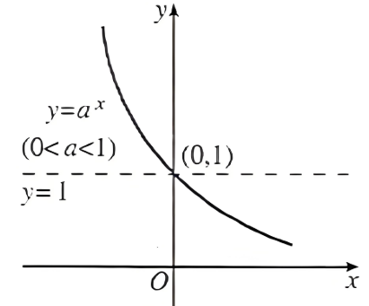

<!-- slide: 7 -->

- 设
- ，即
- 相应的傅里叶反变换
- 2.0 回顾
- 拉普拉斯变换

<!-- slide: 8 -->

- 令
- ，
- ，可得拉普拉斯变换：
- 拉普拉斯反变换为：
- 在形式上等于将
- 用变量
- 取代后的
- 。
- 2.0 回顾
- 拉普拉斯变换

<!-- slide: 9 -->

- 傅氏变换建立了信号在时域和频域间的关系。
- 拉氏变换则建立了在时域和复频域间的关系。
- 在拉氏变换中，当变量S
- 中的实部
- 傅氏变换。也就是说，傅氏变换是拉氏变换的一个特例。
- 拉氏变换则把信号表示为复指数信号
- 与傅氏变换相比，虽然拉氏变换没有明确的物理意义，它只是人们在理论上构造出的一种数学工具，但却有着傅氏变换达不到的运算能力，能够完成傅氏变换完不成的任务。
- 时，拉氏变换就变成了
- 傅氏变换把一个信号分解为虚指数信号
- 的连续和。
- 的连续和。
- 2.0 回顾
- 拉普拉斯变换VS傅里叶变换

<!-- slide: 10 -->

- 2.0 回顾
- 拉普拉斯变换VS傅里叶变换
- 傅氏变换：二维。
- 拉氏变换：三维。
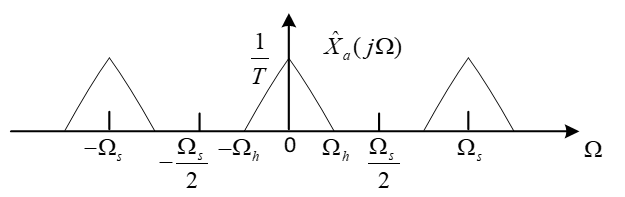
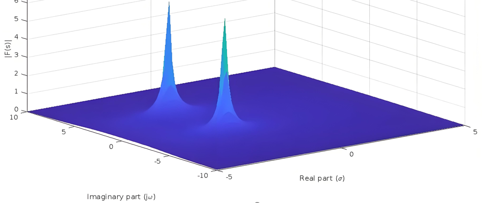

<!-- slide: 11 -->

- 2.0 回顾
- 拉普拉斯变换的复频域
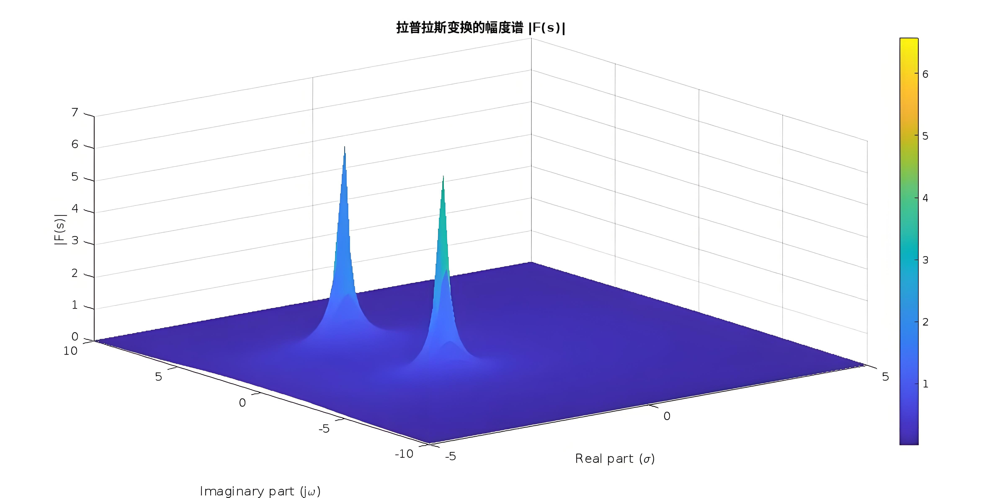
- 实部 σ ：衰减速率
- 虚部 ω ：振荡频率

<!-- slide: 12 -->

- 2.1 序列的Z变换
- 在连续系统中，为了避开解微分方程的困难，可以通过拉氏变换把微分方程转换为代数方程。出于同样的动机，也可以通过一种称为z变换的数学工具，把差分方程转换为代数方程。Z变换是分析离散时间信号与系统的一种有用工具，它在离散时间信号与系统中的作用就如同拉普拉斯变换在连续时间信号与系统中的作用。Z变换可用于求解常系数差分方程以及设计滤波器等。

<!-- slide: 13 -->

- 2.1 序列的Z变换
- 1.Z变换的定义
- 由取样信号的双边拉氏变换引出Z变换定义
- (2-1)
- 对上式进行拉普拉斯变换
- (2-2)
- 引入一个新的复变量：         ，这样，离散序列        的Z变换定义为
- (2-3)

<!-- slide: 14 -->

- 2.1 序列的Z变换
- 这种变换也称为双边Z变换，与此相应的单边Z变换的定义如下：
- (2-4)
- 这种单边Z变换的求和限是从零到无穷，因此对于因果序列，用两种Z变换定义计算出的结果是一样的。
- 2. Z变换的收敛域
- 对于任意给定的序列        ，能使Z变换收敛的所有Z值的集合称为     的收敛域。收敛域也可以用符号ROC (Region of Convergence)来表示。不同序列         的Z变换，可能对应于相同的Z变换表达式，但是各自的收敛域不同，所以在确定Z变换时，必须指明收敛域。

<!-- slide: 15 -->

- 2.1 序列的Z变换
- 级数收敛的充分必要条件是满足绝对可和条件，即要求
- 因此，Z变换是否收敛只取决于模值     。也就是说ROC一定由Z平面内以原点为中心的圆环所组成，
- 一般ROC用环状域表示，即

<!-- slide: 16 -->

- 2.1 序列的Z变换
- 常用的Z变换是一个有理函数，用两个多项式之比表示：
- (2-7)
- 当         时的z值使          ，称为       的零点；                                                   当                的 z 值使         无穷大，称为的极点。注意：根据ROC的定义，收敛域内不能包括极点，并且总是以极点限定其边界。

<!-- slide: 17 -->

- 2.1 序列的Z变换
- 3. 几种典型序列Z变换的收敛域
- Z平面上收敛域的位置，或者说     和      的大小和序列有着密切的关系，下面详细讨论4种典型序列的Z变换。
- (1)有限长序列：
- (2-8)
- 由于      和      是有限整数，       是有限项级数之和，除0与      两点是否收敛与      和      的取值情况有关外，整个Z平面均收敛。

<!-- slide: 18 -->

- 【例题2-1】                  ，求此序列的Z变换及收敛域。
- 【解】这是                     时有限长序列特例，由于
- 所以，收敛域应是整个Z平面(                       )，如图2-2所示。
- 2.1 序列的Z变换

<!-- slide: 19 -->

- 【例题2-2】求矩形序列                        的Z变换及其收敛域。
- 【解】
- 这是一个有限项几何级数之和。因此
- 2.1 序列的Z变换

<!-- slide: 20 -->

- 2.1 序列的Z变换
- (2)右边序列：
- (2-9)
- 第一项为有限长序列的Z变换，收敛域为有限Z平面(                   )；第二项是Z的负幂级数，按照级数收敛的阿贝尔(N. Abel)定理可推知，存在一个收敛半径    ，级数在以原点为中心，以     为半径的圆外任何点都绝对收敛。因此，综合这两项，只有两项都收敛时级数才收敛。所以右边序列Z变换的收敛域为

<!-- slide: 21 -->

- 2.1 序列的Z变换
- 【例题2-3】已知序列                      ，求其Z变换及其收敛域。
- 【解】
- 若该序列收敛，则要求               ，即收敛域为              。
- (3)左边序列：
- (2-11)
- 上式的左项要求              |，右项要求 |z|>0, 故该序列Z变换
- 的收敛域为
- 如果             ，则式(2-11)右端不存在第二项，故收敛域应包括              ，即               。
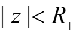

<!-- slide: 22 -->

- 2.1 序列的Z变换
- 【例题2-4】  已知序列                                       ，求其Z变换及其收敛域。
- 【解】
- (4)双边序列：
- (2-12)
- 收敛域是左边序列与右边序列收敛域的重叠部分。

<!-- slide: 23 -->

- 2.1 序列的Z变换
- 【例题2-5】已知序列                ，   为实数，求其Z变换及收敛域。
- 【解】   这是一个双边序列，其Z变换为
- 设
- 若            ，则存在公共区域，若           ，则不存在公共区域，序列发散，不存在Z变换。

<!-- slide: 24 -->

- 2.1 序列的Z变换
- 其序列及收敛域如图2-5、图2-6所示。
- 图2-5 双边序列
- 图2-6双边序列收敛域

<!-- slide: 25 -->

- 2.1 序列的Z变换

| 序列 | Z变换 | 收敛域 | 序列 | Z变换 | 收敛域 |
|---|---|---|---|---|---|
|  |  |  |  |  |  |
|  |  |  |  |  |  |
|  |  |  |  |  |  |
|  |  |  |  |  |  |
|  |  |  |  |  |  |
|  |  |  |  |  |  |
|  |  |  |  |  |  |
|  |  |  |  |  |  |

- 表2-1常见序列Z变换及其收敛域

<!-- slide: 26 -->

- 2.1 序列的Z变换
- 4. Z反变换
- 已知函数          及其收敛域，反过来求序列的变换称为Z反变换，表示为
- 若
- 则
- (2-13)
- (2-14)
- 积分路径    是在        的环状解析域(即收敛域）内环绕原点的一条逆时针方向的闭合单围线，如图2-7所示。

<!-- slide: 27 -->

- 若函数在                            围线   以内有     个极点      ，而在    以外有     个极点        (     和     为有限值)，则有
- 2.1 序列的Z变换
- 图2-7 围线积分路径
- 一般求Z反变换的常用方法有三种：围线积分法（留数法）、部分分式展开法和幂级数展开法。
- (1)围线积分法（留数法）
- 或
- (2-15)
- (2-16)

<!-- slide: 28 -->

- 2.1 序列的Z变换
- (2)部分分式展开法
- 在实际应用中可将                    展开成部分分式的形式，然后利用基本Z变换公式求各简单分式Z反变换，再将各个反变换相加，就得到了所求的        。
- (2-20)
- 如果M<N，且所有极点都是一阶的，则X(z)可展开成
- (2-21)
- Ak可利用留数定理求得
- (2-22)
- (2-23)

<!-- slide: 29 -->

- 2.1 序列的Z变换
- (3)幂级数展开法（长除法）
- 的Z变换         可以表示成    的幂级数，即
- 级数的系数就是        。
- 如果收敛域是            ，则        必然是因果序列，此时按   的降幂次序进行排列。
- 如果收敛域是              ，则      必然是            的左边序列，此时按    的升幂次序进行排列。

<!-- slide: 30 -->

- 2.1 序列的Z变换
- 5. Z变换的性质
- (1)线性
- Z变换是一种线性变换，满足叠加原理，
- (2-24)
- 式中，    和    为任意常数。
- 一般情况下，两序列和的Z变换的收敛域取两个相加序列的收敛域的公共区域，即                                               。

<!-- slide: 31 -->

- 2.1 序列的Z变换
- (2)时移性
- 若序列        的Z变换为
- ，
- 其右移序列的Z变换为
- (2-25)
- 【例题2-12】 求                            序列的Z变换。
- 【解】 已知序列                        的Z变换为
- 根据序列Z变换的位移性

<!-- slide: 32 -->

- 2.1 序列的Z变换
- (3)乘以指数序列（Z域尺度变换）
- 若                      ，
- 则
- ，
- 为非零常数。
- (2-27)
- (4)线性加权（Z域微分性质）
- 若                         ，
- 则
- (2-28)

<!-- slide: 33 -->

- 2.1 序列的Z变换
- (6)翻褶序列
- 若                           ，
- 则
- ，
- (2-30)
- 证明：
- 而收敛域为
- 故可写成

<!-- slide: 34 -->

- 2.1 序列的Z变换
- (7)初值定理
- 对于因果序列                ，        ，
- 则
- (2-31)

<!-- slide: 35 -->

- 2.1 序列的Z变换
- (8)终值定理
- 已知因果序列       ，且                        的全部极点除有一个一阶极点可以在          处外，其余都在单位圆内，
- 则
- (2-32)
- 终值定理只有当             时        收敛才可以应用，也就是要求          的极点必须位于单位圆内（在单位圆上的只能是位于          的一阶极点）

<!-- slide: 36 -->

- 2.1 序列的Z变换
- (9)序列卷积定理
- 已知                         和
- 则
- (2-33)
- 的收敛域取两者收敛域的重叠部分，即                                                      。若有零点或极点相抵消，则收敛域可能扩大。
- 在线性移不变系统中，如果输入为        ，系统的单位脉冲响应为        ，则输出        是       与        的卷积；利用卷积定理，通过求出         和         ，然后求出乘积                  的Z反变换，从而可得         。这个定理得到广泛应用。

<!-- slide: 37 -->

- 2.1 序列的Z变换
- (11)帕塞瓦尔(Parseval)定理
- (2-35)
- 帕塞瓦尔定理的一个很重要的应用是计算序列的能量，一个序列值的平方总和                   称为“序列能量”，利用公式(2-35)，如果有                     ，则
- (2-36)
- 这表明时域中求能量与频域中求能量是一致的。

<!-- slide: 38 -->

- 2.1 序列的Z变换

| 序列 | Z变换 | 收敛域 |
|---|---|---|
|  |  |  |
|  |  |  |
|  |  |  |
|  |  |  |
|  |  |  |
|  |  |  |
|  |  | 为因果序列， |
|  |  | 为因果序列，       的极点都在单位圆内 |
|  |  |  |
|  |  |  |
|  |  |  |

- 表2-2   Z变换的主要性质

<!-- slide: 39 -->

- 2.2 序列傅里叶变换(DTFT)
- 1. 序列傅里叶变换定义
- 单位圆上的Z变换定义为序列的傅里叶变换(Discrete-Time Fourier Transformation，DTFT)，表示序列的频谱。根据Z变换的定义式(2-1)，将单位圆      代替   ，得到序列傅里叶变换的定义
- (2-37)
- 同样，通过Z反变换的公式(2-15)，并将积分围线取在单位圆上，得到序列的傅里叶反变换
- (2-38)
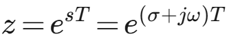

<!-- slide: 40 -->

- 2.2 序列傅里叶变换(DTFT)
- 这样序列的傅里叶变换可归结为：
- (2-39)
- 【例题2-19】已知序列                      ，求其傅里叶变换           。
- 【解】

<!-- slide: 41 -->

- 2.2 序列傅里叶变换(DTFT)
- 若取            ，则
- 时的序列与其振幅谱如图2-11所示。
- 图2-11 例2-19的序列与振幅频谱
- 由DTFT与IDTFT定义及上例可知，非周期离散序列的傅里叶变换是连续的周期函数；而对连续的周期信号利用傅里叶级数展开，其傅里叶系数是非周期离散的。因此，傅里叶变换的时频具有对称性。

<!-- slide: 42 -->

- 2.2 序列傅里叶变换(DTFT)
- 离散
- 周期
- 连续
- 非周期
- 信号的两个域的对应关系

<!-- slide: 43 -->

- 2.2 序列傅里叶变换(DTFT)
- 表2-3   几种常见序列的DTFT

| 时域序列 | DTFT变换函数 |
|---|---|
|  | 1 |
|  |  |
| 1 |  |
|  |  |
|  |  |
|  |  |
|  |  |
|  |  |

<!-- slide: 44 -->

- 2.2 序列傅里叶变换(DTFT)
- 2. 序列傅里叶变换的收敛性
- 有两类序列满足序列傅里叶变换存在的充分条件，
- 第一类是绝对可和的序列，满足
- (2-40)
- 第二类是能量有限的序列，满足平方可和，即
- (2-41)
- 绝对可和的序列一定是能量有限的序列，但是能量有限的序列未必满足绝对可和。序列                   ，不满足绝对可和的条件，但是它的能量为           ，所以其傅里叶变换存在。

<!-- slide: 45 -->

- 2.2 序列傅里叶变换(DTFT)
- 3. 序列傅里叶变换的主要性质
- 序列的傅里叶变换既然是单位圆上的Z变换，因此它的很多重要的性质可由Z变换的特性得出。
- (1)线性
- 若有
- 则
- (2-42)
- 式中，   和   为任意常数。

<!-- slide: 46 -->

- 2.2 序列傅里叶变换(DTFT)
- (2)时移和频移
- 若有
- 则
- (2-43)
- (2-44)
- (3)频域微分
- 若有
- 则
- (2-45)

<!-- slide: 47 -->

- 2.2 序列傅里叶变换(DTFT)
- (4)时域卷积定理
- 若有
- ，
- 则
- (2-46)
- 证明：

<!-- slide: 48 -->

- 2.2 序列傅里叶变换(DTFT)
- (5)频域卷积定理
- 若有
- ，
- 则
- (2-47)
- (6)帕塞瓦尔(Parseval)定理
- 若绝对可和实序列       分别有            、         ，利用复卷积定理可以证明
- (2-48)
- 式(2-48)是能量公式，其中                是数字域的能量谱密度函数。

<!-- slide: 49 -->

- 2.2 序列傅里叶变换(DTFT)
- (7)周期性
- 序列的傅里叶变换             是周期函数，因为
- (2-49)
- 说明             是频率为      的周期函数，周期为       。对于时域离散信号，          指的是信号的直流分量，由于            是以     为周期，那么           和       的整数倍处都表示信号的直流分量，也就是说信号的直流和低频分量集中在          和          整数倍附近。离          和      最远的地方应该是最高频率，因此最高频率应该是    ，也就是说信号的高频应该集中在    附近，对于此问题在1.3.3序列周期性中有详细介绍。

<!-- slide: 50 -->

- 2.2 序列傅里叶变换(DTFT)
- (8)对称性
- 序列的傅里叶变换的对称性是傅里叶变换的重要性质，利用它可以简化序列傅里叶变换的运算。下面介绍一些对称的定义和相关的性质。
- 序列         的共轭对称序列           满足：
- (2-50)
- 序列         的共轭反对称序列           满足：
- (2-51)

<!-- slide: 51 -->

- 2.2 序列傅里叶变换(DTFT)
- 表2-4   序列傅里叶变换的性质

| 序列     、 | 傅里叶变换        、 |
|---|---|
|  |  |
|  |  |
|  |  |
|  |  |
|  |  |
|  |  |
| 帕斯瓦尔定理 |  |
|  |  |
|  |  |
|  |  |
|  |  |
|  |  |
|  |  |

<!-- slide: 52 -->

- 2.3拉普拉斯变换、Z变换、傅里叶变换的关系
- 这说明，从理想采样信号的拉普拉斯变换到采样序列的Z变换，就是由复变量S平面到复变量Z平面的映射，其映射关系的标准变换式为：
- （2-61）
- 当z=esT时，采样序列的Z变换就等于其理想采样信号拉普拉斯变换:
- 其中， 是采样间隔，对应的角频率       ，采样频率      。为了更清楚地说明式(2-61)的映射关系，将        代入式(2-61)，得
- 1. 拉普拉斯变换与Z变换关系

<!-- slide: 53 -->

- 2.3拉普拉斯变换、Z变换、傅里叶变换的关系
- 其中，ω是数字域频率（圆周频率）。上式表明z的模r只与S平面的实部σ对应，而z的辐角ω与S平面的虚部Ω对应。
- 因此可得
- (2-62)
- （1）σ=0 （S平面的虚轴），r =1（Z平面单位圆上）。
- （2）σ<0 （S的左半平面），r <1（Z平面单位圆内部）。
- （3）σ>0 （S的右半平面），r >1（Z平面单位圆外部）。
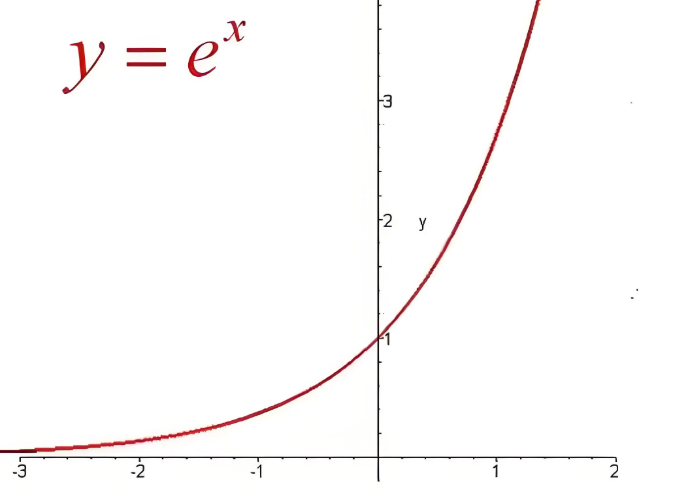

<!-- slide: 54 -->

- （1） =0（S平面的实轴），  =0（Z平面正实轴）；
- （2）  由    增至0，对应于   由   增至0；
- （3）  由0增至   ，对应于   由0增至   。
- 2.3拉普拉斯变换、Z变换、傅里叶变换的关系
- 进一步分析

<!-- slide: 55 -->

- 可得结论：即  平面宽为   的一个水平条带相当于 平面辐角转了一周，即整个  平面。因此每增加一个   ，则   相应的增加一个   ，所以从  平面到   平面的映射是多值映射，如图2-14所示。
- 2.3拉普拉斯变换、Z变换、傅里叶变换的关系

<!-- slide: 56 -->

- 说明：采样序列在单位圆上的Z变换，等于理想采样信号的傅里叶变换            （频谱）。
- 映射到Z平面上正是单位圆z=ejΩT，将这两个关系代入到
- 可得
- 2.3拉普拉斯变换、Z变换、傅里叶变换的关系
- 2. 连续信号的傅氏变换与序列的Z变换
- 傅里叶变换是拉普拉斯变换在虚轴上的特例
- ，即s=jΩ，
- (2-65)

<!-- slide: 57 -->

- ω称为数字频率，它与模拟域频率Ω关系                 ，可以看出数字频率是模拟角频率对采样频率fs的归一化值，它代表了序列值变化的速率。
- 2.3拉普拉斯变换、Z变换、傅里叶变换的关系
- 3. 序列的傅里叶变换与z变换
- (2-66)

<!-- slide: 58 -->

- 可见，单位圆上序列的Z变换为序列的傅里叶变换，也称为数字序列的频谱。由上式可知，由模拟域频率轴   乘以
- 就可以从采样信号的频谱       得到数字域频谱      。如图2-15 所示，      与      相比，仅模拟频率被归一化处理。数字域频谱的重复周期为    ，折叠角频率   与模拟域折叠角频率       对应。坐标变换关系为：
- 2.3拉普拉斯变换、Z变换、傅里叶变换的关系

<!-- slide: 59 -->

- 在时域中，一个线性时不变系统完全可以由它的单位脉冲响应       来表示。对于一个给定的输入       ，其输出
- 把         定义为线性时不变系统的系统函数，它的单位脉冲响应的Z变换，即系统函数应为差分方程的z变换
- 2.4离散时间系统的频域分析
- 1. 系统的描述
- 对等式两端取Z变换，得
- 则
- (2-67)
- 在单位圆上              的系统函数就是系统的频率响应            。
- (2-68)
- (2-69)

<!-- slide: 60 -->

- 单位脉冲响应    为因果序列的系统称为因果系统，一个线性时不变因果系统的系统函数    具有包括     的收敛性，即
- 2.4离散时间系统的频域分析
- 2. 线性时不变系统的因果、稳定条件
- 系统函数 H(z) 是冲激响应 h[n] 的Z变换：
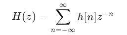
- 由于因果系统 h[n]=0 对于n<0，所以求和从 n=0 开始，即
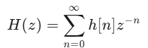
- 当 ∣z∣→∞ 时，            对于所有 n>0。
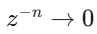
- 双边
- 单边
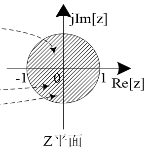

<!-- slide: 61 -->

- 系统函数    必须在单位圆收敛，即收敛域包括单位圆     。
- 一个线性时不变系统的稳定的充分必要条件为     必须满足绝对可和条件，即
- 2.4离散时间系统的频域分析
- 2. 线性时不变系统的因果、稳定条件
- (2-71)
- 系统函数 H(z) 是冲激响应 h[n] 的Z变换：
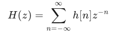
- 在单位圆上，         ，         ，此时Z变换变为：
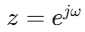
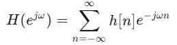
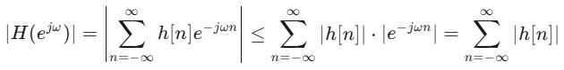
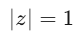

<!-- slide: 62 -->

- 2.4离散时间系统的频域分析
- 2. 线性时不变系统的因果、稳定条件
- (2-72)
- 因果稳定系统是最普遍、最重要的一种系统，它的系统函数    必须在从单位圆到   的整个z域内收敛，即
- 也就是说，系统函数的全部极点必须在单位圆内。

<!-- slide: 63 -->

- 2.4离散时间系统的频域分析
- 【例题2-22】已知某离散系统的系统函数为
- 判断该系统的稳定性。
- 【解】 根据系统稳定的条件，将系统函数写成零极点形式

<!-- slide: 64 -->

- 2.4离散时间系统的频域分析
- 其中，极点的模
- 所有极点均在单位圆内，所以是稳定系统。
- 如果系统函数分母阶数较高（如3阶以上），用手工计算，判断系统是否稳定不是一件简单的事情。用MATLAB函数判定则很简单。

<!-- slide: 65 -->

- 【例题2-26】试用MATLAB计算
- 的部分分式展开式。
- MATLAB代码如下：
- b=[1.5,0.98,-2.608,1.2,-0.144];
- a=[1,-1.4,0.6,-0.072];
- [r,p,k]=residuez(b,a);
- disp('留数');disp(r');
- disp('极点');disp(p')
- disp('常数');disp(k');
- 2.5 MATLAB应用实例

<!-- slide: 66 -->

- 运行结果为：
- 留数    0.7000    0.5000    0.3000
- 极点    0.6000    0.6000    0.2000
- 常数    0     2
- 部分分式展开的结果为
- X(z)=
- z反变换的结果为
- 2.5 MATLAB应用实例
- 其中0.6为2重极点，所以

<!-- slide: 67 -->

- 2.5 MATLAB应用实例
- 【例题2-27】 绘制信号x(n)的幅度谱和相位谱
- MATLAB代码如下：
- n=0:50;              %定义序列长度为50
- A=400; a=50*sqrt(2.0)*pi;   %设置信号参数
- T=0.001;             %采样率
- w0=50*sqrt(2.0)*pi;x=A*exp(-a*n*T).*sin(w0*n*T);
- close all;subplot(3,1,1);stem(x);
- k=-25:25;
- W=(pi/12.5)*k;
- X=x*(exp(-j*pi/12.5)).^(n'*k);
- magX=abs(X); %绘制x(n)的幅度谱
- subplot(3,1,2);stem(magX);title('理想采样信号序列的幅度谱');
- angX=angle(X); %绘制x(n)的相位谱
- subplot(3,1,3);stem(angX) ; title ('理想采样信号序列的相位谱')

<!-- slide: 68 -->

- 2.5 MATLAB应用实例
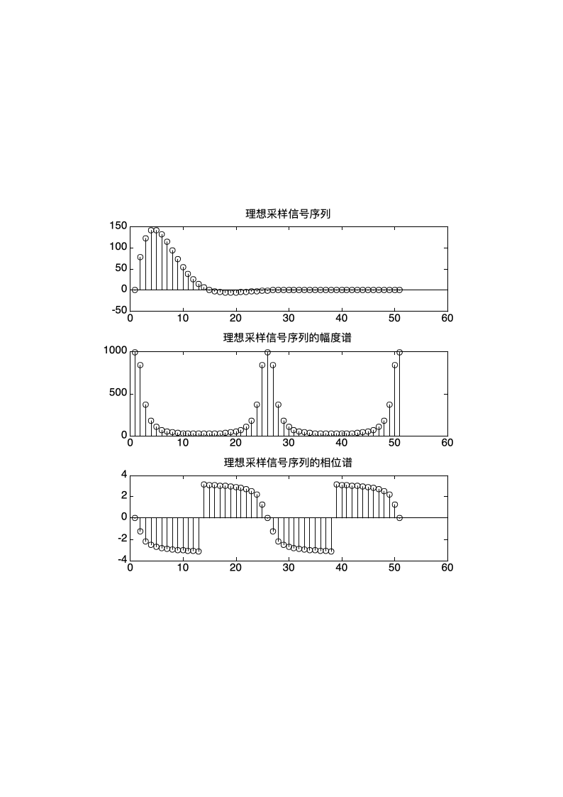

<!-- slide: 69 -->

- 【例题2-28】已知
- 试用MATLAB求出单位抽样响应         。
- MATLAB代码如下：
- L=input('输入输出向量的长度L=');      %规定输出向量的长度
- num=input('输入分子的系数num=');     	%输入分子的系数
- den=input('输入分母的系数den=');     	%输入分母的系数
- [y,t]=impz(num, den, L);          %计算单位冲激响应
- disp('Coefficients of the power series expansion'); 	%显示指令
- disp(y)                                  %显示指令
- 2.5 MATLAB应用实例

<!-- slide: 70 -->

- 2.5 MATLAB应用实例
- 输入如下：
- L=10;
- num=[1 2]
- den=[1 0.4 -0.12]
- 输出如下：
- Coefficients of the power series expansion
- Columns 1 through 5
- 1.0000  1.6000  -0.5200  0.4000  -0.2224
- Columns 6 through 10
- 0.1370  -0.0815  0.0490  -0.0294  0.0176
- 由此可以得到单位抽样序列为
- 说明：impz为MATLAB中的内部函数，[y,t]=impz(num,den,L)计算系统的冲激响应，矢量num和den分别为系统函数的分子和分母的系数矢量，L表示冲激响应输出的序列个数。输出y为响应的系数。

<!-- slide: 71 -->

- 2.5 MATLAB应用实例
- 【例题2-29】已知系统函数
- 试用MATLAB绘出8阶系统函数的零、极点图，幅频响应和相频响应曲。
- 【解】
- H(z)的极点为z=0，这是一个N阶极点，它不影响系统的幅频响应。零点有N个，由分子多项式的根决定

<!-- slide: 72 -->

- N个零点等间隔分布在单位圆上，设N=8，当ω从0变化到2π时，每遇到一个零点，幅度为零，在两个零点的中间幅度最大，形成峰值。幅度谷值点频率为：ωk=(2π/N)k, k=0, 1, 2,        , N－1。
- MATLAB代码如下：
- b=[1 0 0 0 0 0 0 0 -1];    %H(z)的分子多项式系数矢量
- a=1;                                %H(z)的分母多项式系数矢量
- subplot(1,3,1);
- zplane(b,a);                    %绘制H(z)的零极点图
- [H, w]=freqz(b, a);        %计算系统的频率响应
- subplot(1,3,2);
- 2.5 MATLAB应用实例
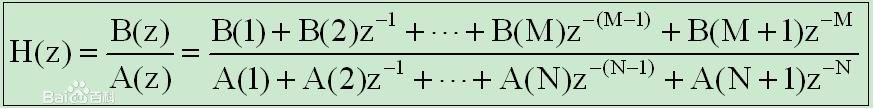
- B=[B(1)　B(2)　B(3) ... B(M+1)];
- A=[A(1)　A(2)　A(3) ... A(N+1)];

<!-- slide: 73 -->

- 2.5 MATLAB应用实例
- plot(w/pi, abs(H));         	%绘制幅频响应曲线
- axis([0,1,0,2.5]);
- xlabel(‘\omega/pi’);
- ylabel(‘|H(e^j^\omega)|’);
- subplot(1,3,3);
- plot(w/pi, angle(H));       	%绘制相频响应曲线
- xlabel(‘\omega/pi’);
- ylabel(‘\phi(\omega)’);
- 说明：程序中的freqz和zplane为MATLAB中的内部函数，[H, w]=freqz(b, a);用于计算离散时间系统的复频率响应，矢量a和b分别为系统函数的分子和分母的系数矢量，w表示输出的数字域角频率，H为相应的频率响应。Zplane(b, a)表示画出以矢量b和a描述的离散时间系统的零极点图。

<!-- slide: 74 -->

- 2.5 MATLAB应用实例
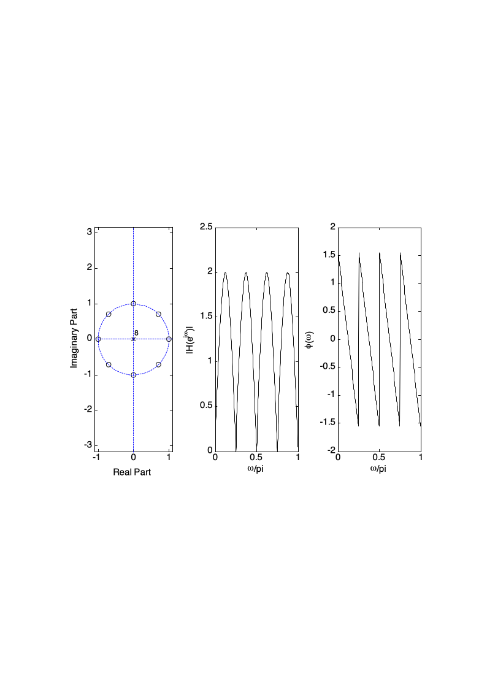
- 图2-21离散系统的零极点图、幅频响应曲线和相频响应曲线

<!-- slide: 75 -->

- 习题
- 1. 求序列x(n)=R4(n) 的z变换及其收敛性。

<!-- slide: 76 -->

- 习题
- 2. 对于序列的傅里叶变换，其信号的特点是
- 时域连续非周期，频域连续非周期
- 时域离散周期，频域连续非周期
- 时域离散非周期，频域连续非周期
- 时域离散非周期，频域连续周期

<!-- slide: 77 -->

- 习题
- 3. 如果一个线性时不变系统的收敛性为一半径小于1的圆的外部，则该系统为
- 因果、稳定系统
- 因果、非稳定系统
- 非因果、稳定系统
- 非因果、非稳定系统

<!-- slide: 78 -->

- 习题
- 4. 求序列x(n)=(-0.5)n u(n) 的z变换及其收敛性。

<!-- slide: 79 -->

- 习题
- 5. 拉普拉斯变换的s平面与z变换的z平面是什么映射关系？

<!-- slide: 80 -->

- 习题
- 6. z变换与傅里叶变换有何关系？
