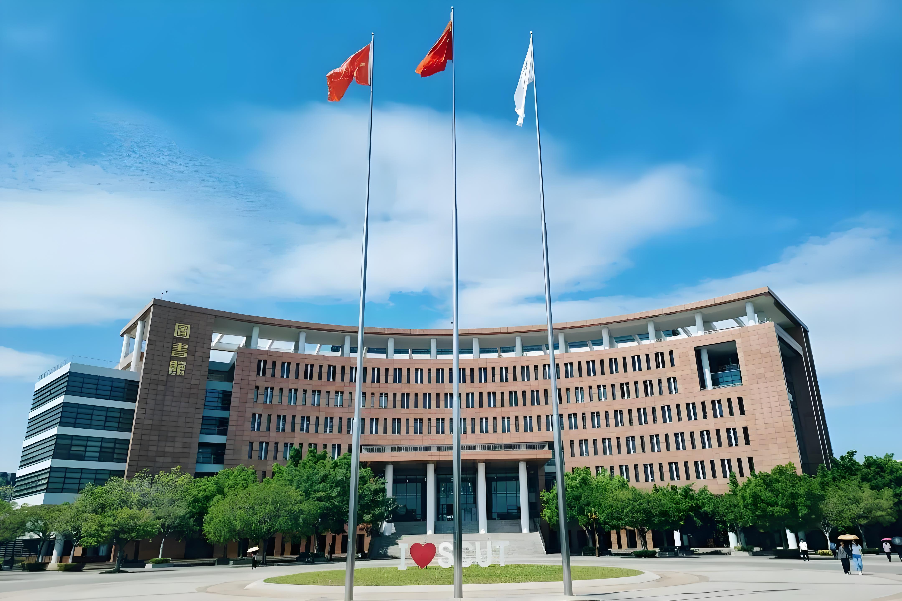
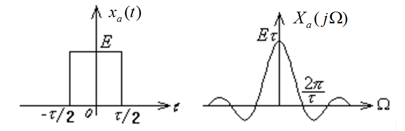
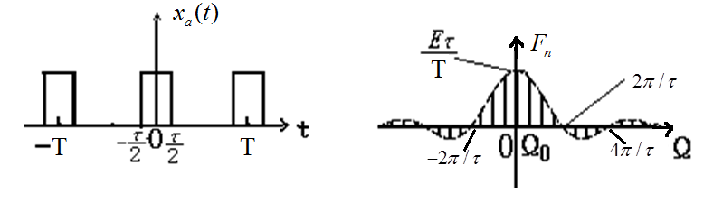
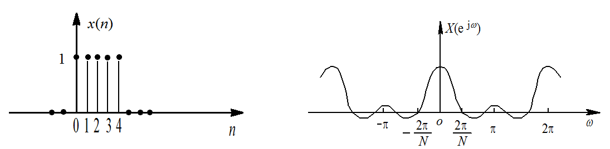
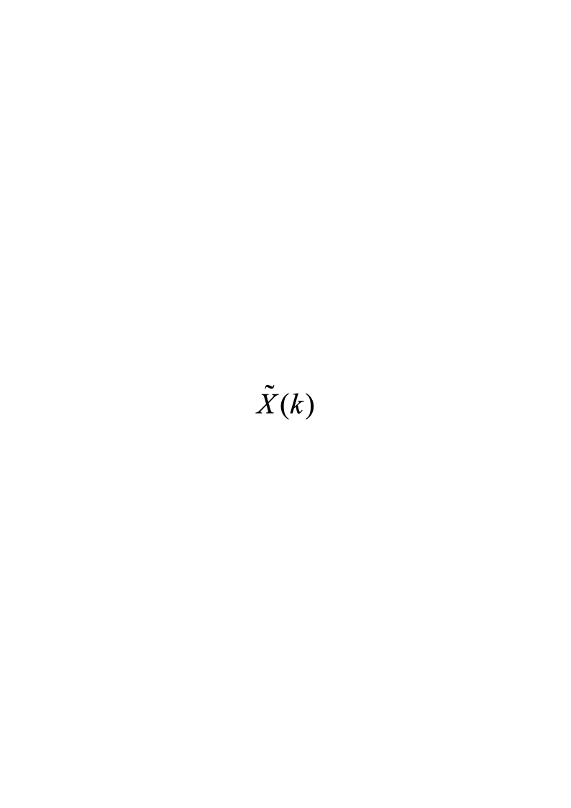
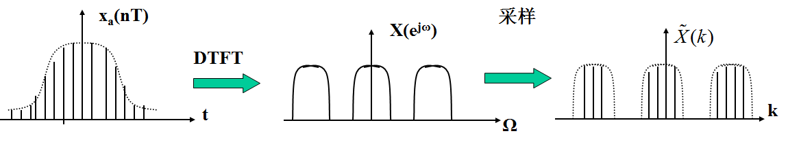
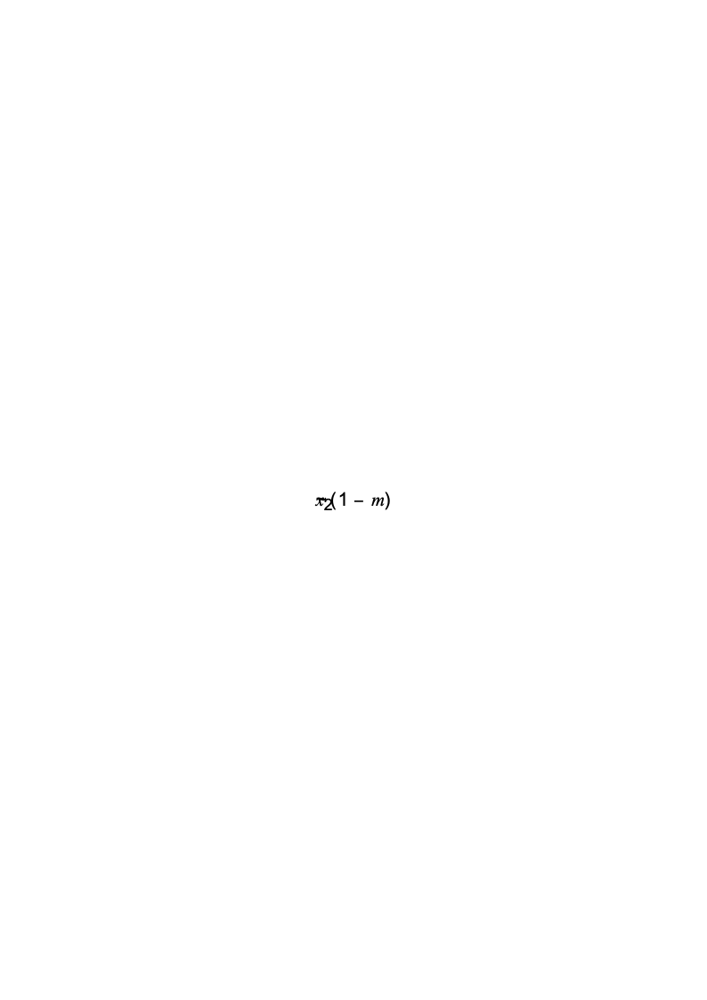
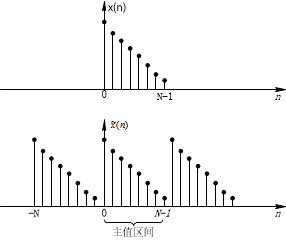
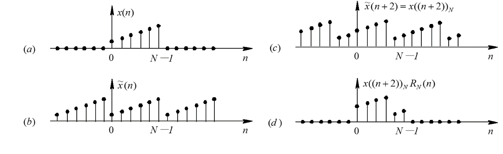
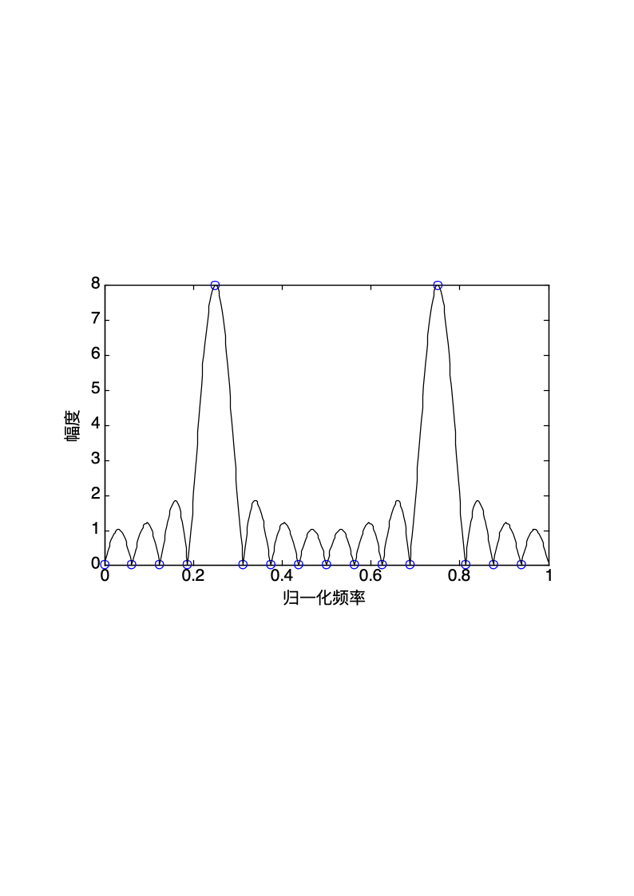

# 第3章 离散傅里叶变换

<!-- slide: 1 -->

- 第3章 离散傅里叶变换
- 数字信号处理

<!-- slide: 2 -->

- 第3章 离散傅里叶变换(DFT)
- 3.1 引言
- 3.2 周期序列的离散傅里叶级数(DFS)
- 3.3 有限长序列离散傅里叶变换(DFT)
- 3.4 离散傅里叶变换(DFT)的性质
- 3.5 频域采样理论
- 3.6 MATLAB应用实例

<!-- slide: 3 -->

## 计算机只能计算有限长离散序列，因此有限长序列在数字信号处理中就显得很重要，虽然可以用Z变换和序列的傅里叶变换来研究它，但是这两种变换无法直接利用计算机进行数值计算。针对序列“有限长”这一特点，可以导出一种更有效的变换：离散傅里叶变换(Discrete Fourier Transform，简写为DFT)。
  作为有限长序列的一种表示方法，离散傅里叶变换除了在理论上相当重要之外，由于存在有效的快速算法—快速傅里叶变换(FFT)，因而在各种数字信号处理的算法中起着核心作用。

- 3.1 引言

<!-- slide: 4 -->

## 1. 连续时间非周期信号的傅里叶变换
连续时间非周期信号通过连续傅里叶变换(FT)得到非周期连续频谱密度函数。
正变换：                                            (3-1)

逆变换：                                            (3-2)
右图为矩形脉冲及其频谱

- 3.1 引言
- 从图可以看出：
- (1)时域连续函数造成频域是非周期的谱；
- (2)时域的非周期造成频域是连续的谱。

<!-- slide: 5 -->

- 2．连续时间周期信号的傅里叶级数
- 周期为T的周期性连续时间函数        可展成傅里叶级数     ，是离散非周期性频谱
- 正变换：                                          (3-3)
- 逆变换：                                           (3-4)
- 3.1 引言
- 右图为周期矩形脉冲及其频谱
- (1)时域的连续函数造成频域是非周期的频谱函数；
- (2)频域的离散频谱与时域的周期时间函数对应(频域采样，时域周期延拓)。

<!-- slide: 6 -->

- 3.1 引言
- 3．非周期离散信号的傅里叶变换
- 非周期离散的时间信号得到周期性连续的频率函数。
- 正变换：                                         (3-5)
- 逆变换：                                         (3-6)
- 上图为非周期离散时间信号及频谱
- 由图可以看出
- (1)时域的离散造成频域的周期延拓；
- (2)时域的非周期对应于频域的连续。

<!-- slide: 7 -->

- 3.1 引言
- 4. Fourier变换的四种形式
- (1)连续时间、连续频率 — 傅里叶变换(FT)，是非周期连续信号傅里叶变换，对应图3-4(a)；
- (2)连续时间、离散频率 — 傅里叶级数(FS)；是周期连续信号傅里叶级数，对应图3-4(b)
- (3)离散时间、连续频率 — 序列的傅里叶变换(DTFT)；是序列傅里叶变换，对应图3-4(c)
- (4)离散时间、离散频率 — 离散傅里叶变换(DFT)，是离散周期序列频谱，对应图3-4(d)，是本章介绍内容。

<!-- slide: 8 -->

- 3.1 引言
- 图3-4 各种形式的傅里叶变换
- 非周期连续信号傅里叶变换
- 周期连续信号傅里叶级数
- 序列傅里叶变换
- 离散周期序列频谱

<!-- slide: 9 -->

- 3.2 周期序列的离散傅里叶级数(DFS)
- 3.2.1离散傅里叶级数(DFS)定义
- 若离散时间序列x(n)为周期序列，则一定满足：
- x(n)=x(n+rN)
- 其中，N（正整数)为信号的周期，r为任意整数。为了和非周期序列区分，周期序列记作：     。因为周期序列不是绝对可和，因此周期序列不能用傅里叶变换来表示，但是周期序列可以用傅里叶级数(DFS)来表示，离散傅里叶级数(DFS)定义为：
- 其中，       为周期序列傅里叶级数的系数，其大小为
- (3-7)
- (3-8)

- 离散,周期
- 离散,周期

<!-- slide: 10 -->

- 为了书写方便，常令符号                ，这样周期序列的傅里叶变换对可以再次写为：
- 正变换：
- 反变换：
- 3.2 周期序列的离散傅里叶级数(DFS)
- 注：变换前和变换后都是周期离散的，定义后面k,n的取值说的是有效值，即k,n可以为其他值。

<!-- slide: 11 -->

- 3.2 周期序列的离散傅里叶级数(DFS)
- 【例3-1】若        为周期脉冲串                                       ，求DFS。
- 【解】因为对于0≤n≤N-1，                          ，         的DFS系数为
- 在这种情况下，对于所有的k值          均相同。于是
- 当n为N整数倍时结果为1，这正好是周期性脉冲串。
- 说明：
- 上式一般称为复正弦序列正交特性。
- (3-9)

<!-- slide: 12 -->

- 3.2 周期序列的离散傅里叶级数(DFS)
- 【例3-2】 已知周期序列       如图3-5所示，其周期N=10，试求解它的傅里叶级数系数         。
- 图3-5 周期脉冲序列(N=10)
- 【解】
- 这一有限求和有闭合形式

<!-- slide: 13 -->

## 正变换定义公式(3-8)中的周期序列        可看成是对        的第一个周期x(n)作Z变换，然后将Z变换在Z平面单位圆上按等间隔角2π/N采样而得到，如图3-8所示。令      
                                                                                      

通常称x(n)为的主值区序列，则x(n)的Z变换为

- 3.2.1离散傅里叶级数(DFS)定义

- (3-12)
- (3-11)
- (3-10)

<!-- slide: 14 -->

- 3.2.1离散傅里叶级数(DFS)定义
- 图3-8  Z平面单位圆上等间隔采样

<!-- slide: 15 -->

## 由于单位圆上的Z变换为序列的傅里叶变换，所以周期序列              
也可以解释为      的一个周期x(n)的傅里叶变换的等间隔采样。 因为   

比较式(3-13)和式(3-8)，可以看出             
                                                                                             

这相当于以2π/N的频率间隔对傅里叶变换进行采样。也就是说，非周期离散时间信号经序列傅立叶变换(DTFT)，得周期连续谱函数，再经采样得周期离散频谱函数(DFS)，过程如图3-9所示。

- 3.2.1离散傅里叶级数(DFS)定义
- (3-13)
- (3-14)

<!-- slide: 16 -->

- 3.2.1离散傅里叶级数(DFS)定义

- 图3-9 序列傅里叶变换与离散傅里叶级数关系
- 由于频域N点取样使得频域离散从而形成时域序列的周期化。采样频点间隔：
- (3-16)
- (3-15)
- 数字频率为：

<!-- slide: 17 -->

## 【例3-3】傅里叶级数系数        和周期信号        的一个周期的傅里叶变换之间的关系 (周期N=10) 。

【解】           的一个周期
则           的一个周期的傅里叶变换是

- 3.2.1离散傅里叶级数(DFS)定义
- 根据上面分析傅里叶级数的系数为
- 连续周期
- 离散周期

<!-- slide: 18 -->

## 图3-10 周期序列

                                           
      

图3-11     一个周期的DTFT幅度谱

- 3.2.1离散傅里叶级数(DFS)定义
- 连续周期

<!-- slide: 19 -->

## 图3-12          一个周期的DTFT幅度谱和DFS

- 3.2.1离散傅里叶级数(DFS)定义
- 离散周期

<!-- slide: 20 -->

## 设    和    皆是周期为N的周期序列，它们各自的DFS分别为          ，        ：

- 3.2.2离散傅里叶级数(DFS)的性质
- 或
- (3-20)
- (3-19)
- (3-18)
- (3-17)
- 2. 序列的移位
- 1. 线性

<!-- slide: 21 -->

## 3. 周期卷积 
如果                                                                                    (3-21)
则                                                                                           
(3-22)
或                                                                                        (3-23)
两个周期都为N的周期序列          和         ，它们卷积的结果也是周期为N的周期序列，求和只在一个周期上进行，即m=0到N-1，所以称为周期卷积。 注意：n的取值不在N的范围内，得到结果后进行周期延拓。

- 3.2.2离散傅里叶级数(DFS)的性质

<!-- slide: 22 -->

## 图3-13 两个周期序列(N=6)的周期卷积过程

- 0
- 0
- 0
- 0
- 0
- 0
- 5
- 5
- 5
- 5
- 5
- 5
- m
- m
- m
- m
- m
- m
- 1
- 1
- 1
- 2
- 3
- 4

- 3.2.2离散傅里叶级数(DFS)的性质

<!-- slide: 23 -->

- 3.3.1 DFT的定义
- 设x(n)为有限长序列，长度为N，即x(n)只在n=0到N-1点上有值，其他n时，x(n)=0。把它看成周期为N的周期序列         的一个周期，而把         看成x(n)的以N为周期的周期延拓，即表示成:
- 3.3有限长序列离散傅里叶变换(DFT)
- 通常把         的第一个周期n=0 到n=N-1 定义为“主值区间”，故x(n)是	         的“主值序列”。而称          为x(n)的周期延拓。
- 同理

<!-- slide: 24 -->

## 图3-14 周期序列、主值区间、主值序列之间关系
DFS与IDFS变换前后都是周期、无限长，但每个周期信息相同，故可以得到有限长序列的离散傅里叶变换的定义:  

注意，所处理的有限长序列都是作为周期序列的一个周期来表示的。 换句话说，离散傅里叶变换隐含着周期性。

- 3.3.1离散傅里叶变换(DFT)定义
- 与DFS和IDFS的区别

<!-- slide: 25 -->

## 问题：有限长序列x(n)本身有傅里叶变换（频谱），为什么不直接进行傅里叶变换？为什么要把它看成周期为N的周期序列     的一个周期来处理？

- 3.3.1离散傅里叶变换(DFT)定义

<!-- slide: 26 -->

## 【例3-4】已知序列x(n)=δ(n)，求它的N点DFT。 
【解】 单位脉冲序列的DFT很容易由DFT的定义式(3-27)得到： 

δ(n)的X(k)如图3-15。这是一个很特殊的例子，它表明对序列δ(n)来说，不论对它进行多少点的DFT，所得结果都是一个离散矩形序列。

- 3.3.1离散傅里叶变换(DFT)定义

<!-- slide: 27 -->

## 【例3-5】已知x(n)=cos(nπ/6)是一个长度N=12的有限长序列，求它的N点DFT。         
【解】 由DFT的定义式(3-27)

- 3.3.1离散傅里叶变换(DFT)定义
- 利用复正弦序列正交特性(3-9)式，
- 再考虑到k的取值区间，可得
- 图3-16 有限长余弦序列及其DFT

<!-- slide: 28 -->

- 【例3-6】已知如下X(k)：                               ，求其10点IDFT。
- 【解】X(k)可以表示为 X(k)=1+2δ(k)   0≤k≤9
- 由于一个单位脉冲序列的DFT为常数：
- 同样，一个常数的DFT是一个单位脉冲序列：
- 由于
- 所以
- 3.3.1离散傅里叶变换(DFT)定义

<!-- slide: 29 -->

- 3.3.2  DFT与序列傅里叶变换、Z变换的关系
- 若x(n)是一个有限长序列，长度为N，Z变换
- 表明       是Z平面单位圆上幅角为               的点，即将Z平面单位圆N等分后的第k点如图3-17所示，所以X(k)是对X(z)在Z平面单位圆上N点等间隔采样值。此外，由于序列的傅里叶变换X(ejω)即是单位圆上的Z变换，根据式(3-29)，DFT与序列傅里叶变换的关系为
- (3-30)
- 其中：
- 则
- （3-29）

<!-- slide: 30 -->

- 3.3.2  DFT与序列傅里叶变换、Z变换的关系
- DFT的物理意义：说明X(k) 可看作序列x(n)的傅里叶变换X(ejω)在区间［0, 2π］上的N点等间隔采样，其采样间隔为ωN=2π/N。显而易见，DFT的变换区间长度N不同，表示对X(ejω)在区间［0, 2π］上的采样间隔和采样点数不同， 所以DFT的变换结果也不同。
- 图3-17 DFT物理意义说明图示

<!-- slide: 31 -->

- 3.3.2  DFT与序列傅里叶变换、Z变换的关系
- 【例题3-7】有限长序列x(n)为                            ，求其N=5点离散傅里叶变换X(k)。
- 【解】将有限长序列x(n)以N=5 为周期延拓成周期序列，        的DFS与x(n)的DFT相对应如图(c)和(d)所示。因为图(b)中的序列在区间0≤n≤N-1 上为常数值，所以可以得出
- 在k=0和k=N 的整数倍处才有非零的DFS系数         值。就是X(ejω)在频率ωk=2πk/N 处的样本序列。x(n)的DFT对应于取         的一个周期而得到的有限长序列X(k)。

<!-- slide: 32 -->

- 3.3.2  DFT与序列傅里叶变换、Z变换的关系
- 图3-18 例题3-7用图
- 只取主值区间
- 只取离散值
- 只取离散值

<!-- slide: 33 -->

- 3.4 离散傅里叶变换(DFT)的性质
- 本节讨论DFT的一些性质，以下讨论的序列都是N点有限长序列，用DFT［•］表示N点DFT，且设：
- 1. 线性
- 说明：(1)若         和          的长度均为N，则          的长度为N；
- (2)若         和         的长度不等，         的长度为N1，   的长度为N2，则          的长度为N=max[N1,N2]，离散傅立叶变换的长度必须按N来计算。
- DFT［x1(n)］=X1(k)       DFT［x2(n)］=X2(k)
- 2. 圆周移位
- 一个长度为N的有限长序列        的圆周移位定义为

<!-- slide: 34 -->

- 3.4 离散傅里叶变换(DFT)的性质
- 首先，将图(a)以N为周期进行周期延拓得到周期序列                  如图(b)所示；再将        加以移位                                    如图(c)所示，然后，再对移位的周期序列                取主值区间(n=0到N-1)上的序列值，即x((n+m))NRN(n)。所以，一个有限长序列        的圆周移位序列        仍然是一个长度为N的有限长序列。

- 图3-19 圆周移位过程

<!-- slide: 35 -->

- 3.4 离散傅里叶变换(DFT)的性质
- 3. 时域圆周移位定理
- 设       是长度为N的有限长序列，      为       圆周移位，即
- 则圆周移位后的DFT为
- (3-33)
- 4. 频域圆周移位定理
- 若
- 则
- 上式称为频率移位定理，也称为调制定理，此定理说明时域序列的调制等效于频域的圆周移位。
- (3-32)
- (3-34)

<!-- slide: 36 -->

- 3.4 离散傅里叶变换(DFT)的性质
- 5. 圆周卷积
- 设        和           都是点数为N的有限长序列(0≤n≤N-1)，且有：
- 则
- 卷积过程：圆周卷积过程如图3-20所示，先将x1(n)和x2(n)补零，使得长度均为N点，并将变量n变成m，x2(m)周期化x2((m))N，再反转x2((-m))N，取主值序列x2((-m))NRN(m)，对x2(m) 圆周右移n，形成x2((n-m))NRN(m)，当n=0,1,2,…,N-1时，分别将x1(m)与x2((n-m))NRN(m)相乘，并在m=0 到N-1 区间内求和，便得到圆周卷积y(n)。

<!-- slide: 37 -->

- 图3-20 圆周卷积流程
- 3.4 离散傅里叶变换(DFT)的性质

<!-- slide: 38 -->

- 图3-21 圆周卷积过程示意图
- 3.4 离散傅里叶变换(DFT)的性质

<!-- slide: 39 -->

- 特别要注意：两个长度小于等于N的序列的N点圆周卷积长度仍为N，这与一般的线性卷积不同。为了区别线性卷积，用      表示循环卷积，用       表示N点循环卷积圆周卷积。
- (3-36)
- 利用时域与频域的对称性，可以证明频域圆周卷积定理。
- 若                              ,                     皆为N点有限长序列，则
- 3.4 离散傅里叶变换(DFT)的性质
- 即时域序列相乘，乘积的DFT等于各个DFT的圆周卷积再乘以1/N。

<!-- slide: 40 -->

- 3.4 离散傅里叶变换(DFT)的性质
- 6. 线性卷积与圆周卷积关系
- 时域圆周卷积在频域上相当于两序列的DFT的乘积，而计算DFT可采用它的快速算法——快速傅里叶变换(FFT)，因此圆周卷积与线性卷积相比，计算速度可以大大加快。但是实际问题大多总是要求解线性卷积。例如，信号通过线性时不变系统，其输出就是输入信号与系统的单位脉冲响应的线性卷积，如果信号以及系统的单位脉冲响应都是有限长序列，那么是否能用圆周卷积运算来代替线性卷积运算而不失真呢？下面就来讨论这个问题。
- 设         是N1点的有限长序列(0≤n≤N1-1)，          是N2点的有限长序列(0≤n≤N2-1)。

<!-- slide: 41 -->

- (1)线性卷积
- 是N1+N2-1点有限长序列，即线性卷积的长度等于参与卷积的两序列的长度之和减1。
- (2)圆周卷积
- 先假设进行L点的圆周卷积，再讨论L取何值时，圆周卷积才能代表线性卷积。
- 3.4 离散傅里叶变换(DFT)的性质
- 设y(n)=x1(n)  x2(n)是两序列的L点圆周卷积，L≥max［N1, N2］，这就要将x1(n)与x2(n)都看成是L点的序列。在这L个序列值中，x1(n)只有前N1个是非零值，后L-N1个均为补充的零值。同样，x2(n)只有前N2个是非零值，后L-N2个均为补充的零值。则
- (3-38)

<!-- slide: 42 -->

- 3.4 离散傅里叶变换(DFT)的性质
- 可以证明
- 为x1(n)与x2(n)线性卷积的周期延拓，周期为L，定义为周期卷积。
- 前面已经分析了y1(n)具有N1+N2-1个非零值。因此可以看到，如果周期卷积的周期L<N1+N2-1，那么y1(n)的周期延拓就必然有一部分非零序列值要交叠起来，从而出现混叠现象。只有在L≥N1+N2-1时，才没有交叠现象，而圆周卷积正是周期卷积取主值序列。
- 因此
- (3-40)
- (3-41)
- (3-42)

<!-- slide: 43 -->

- 3.4 离散傅里叶变换(DFT)的性质
- 所以要使圆周卷积等于线性卷积而不产生混叠的必要条件为             。线性卷积与圆周卷积关系如表3-1所示。
- 表3-1 线性卷积与圆周卷积关系
- 下面以具体示例来说明，两个有限长矩形序列x1(n)与x2(n)，它们长度分别为N1=4、N2=5，分别计算线性卷积和圆周卷积结果如图3-22所示。其中：(c)图为线性卷积结果，(d)、(e)、(f)分别为长度为6、8、10的圆周卷积结果，根据            关系，我们确实看到了当L=8时线性卷积与圆周卷积结果相等。

<!-- slide: 44 -->

- 3.4 离散傅里叶变换(DFT)的性质
- 图3-22 线性卷积与圆周卷积示例

<!-- slide: 45 -->

- （1） 计算序列x(n)的10点离散傅里叶变换。
- （2） 若序列y(n)的DFT为
- 3.4 离散傅里叶变换(DFT)的性质
- 【例3-8】一个有限长序列为
- 式中, X(k)是序列x(n)的10点DFT，W(k)是序列w(n)的10点DFT
- 式中，X(k)是x(n)的10点离散傅里叶变换，求序列y(n)。
- （3）若10点序列y(n)的10点离散傅里叶变换是
- 求序列y(n)。

<!-- slide: 46 -->

- 解 （1） 由式（2-30）可求得x(n)的10点DFT
- 【例 3-8】 一个有限长序列为
- （2）X(k)乘以一个WNkm形式的复指数相当于是x(n)圆周移位m点。 本题中m=2, x(n)向左圆周移位了2点， 就有
- y(n)=x((n+2))10R10(n)=2δ(n-3)+δ(n-8)
- （1） 计算序列x(n)的10点离散傅里叶变换。
- （2） 若序列y(n)的DFT为
- 式中，X(k)是x(n)的10点离散傅里叶变换，求序列y(n)。
- 0
- 1
- 2
- 3
- 4
- 5

<!-- slide: 47 -->

- 0
- 1
- 2
- 3
- 4
- 5
- 0
- 1
- 2
- 3
- 4
- 5
- 6
- 采用列表法
- （3）若10点序列y(n)的10点离散傅里叶变换是
- 式中, X(k)是序列x(n)的10点DFT，W(k)是序列w(n)的10点DFT
- 0≤n≤6
- 其他
- 求序列y(n)。
- 【例 3-8】 一个有限长序列为
- 解（3）X(k)乘以W(k)相当于x(n)与w(n)的圆周卷积。为了进行圆周卷积，可以先计算线性卷积再将结果周期延拓并取主值序列。 x(n)与w(n)的线性卷积为
- z(n)=x(n)*w(n)=｛1, 1, 1, 1, 1, 3, 3, 2, 2, 2, 2, 2｝
- 圆周卷积为

<!-- slide: 48 -->

- 3.4 离散傅里叶变换(DFT)的性质
- 根据(3-42)，圆周卷积为
- 在 0≤n≤9 求和中，仅有序列z(n)和z(n+10)有非零值，用表列出z(n)和z(n+10)的值，对n=0, 1, 2, …, 9求和，得到
- 所以10点圆周卷积为：                                         ，
- 由于6+7-1=12>10所以线性卷积不等于圆周卷积。

| n | 0    1    2    3    4     5    6    7    8    9 | 10    11 |
|---|---|---|
| Z(n) | 1    1    1    1    1     3    3    2    2    2 | 2      2 |
| z(n+10) | 2    2    0    0    0     0    0    0    0    0 | 0      0 |
| y(n) | 3    3    1    1    1     3    3    2    2    2 | __    __ |

<!-- slide: 49 -->

- 3.4 离散傅里叶变换(DFT)的性质
- 7. DFT形式下的帕塞伐定理
- (3-43)
- 证明
- 如果令y(n)=x(n)
- 即
- 表明一个序列在时域计算的能量与在频域计算的能量是相等的。

<!-- slide: 50 -->

- 3.5 频域采样理论
- 考虑一个任意的绝对可和的非周期序列x(n)，它的Z变换为
- 由于绝对可和，所以其傅里叶变换存在且连续，故Z变换收敛域包括单位圆。如果我们对X(z)在单位圆上进行N点等距采样：
- 问题在于，这样采样以后是否仍能不失真地恢复出原序列x(n)。也就是说，频率采样后从X(k)的反变换中所获得的有限长序列，即              ，能不能代表原序列x(n)？为此，我们先来分析X(k)的周期延拓序列     的离散傅里叶级数的反变换，令其为      。
- (3-44)

<!-- slide: 51 -->

- 3.5 频域采样理论
- 将式(3-27)代入此式，可得
- 由于
- 所以

<!-- slide: 52 -->

- 3.5 频域采样理论
- （1） 如果x(n)是有限长序列，点数为M，则当频域采样不够密，即当N<M时，x(n)以N为周期进行延拓，就会造成混叠。这时，从             就不能不失真地恢复出原信号x(n)来。
- 这说明由         得到的周期序列         是原非周期序列x(n)的周期延拓，其时域周期为频域采样点数N。在第1章1.2节中已经知道，时域采样造成频域的周期延拓，这里又看到一个对称的特性，即频域采样同样会造成时域的周期延拓。

<!-- slide: 53 -->

- 3.5 频域采样理论
- （2） 如果x(n)不是有限长序列（即无限长序列），则时域周期延拓后，必然造成混叠现象，因而一定会产生误差;当n增加时信号衰减得越快，或频域采样越密（即采样点数N越大），则误差越小，即xN(n)越接近x(n)。
- 也就是说，点数为N（或小于N）的有限长序列，可以利用它的Z变换在单位圆上的N个等间隔点上的采样值精确地表示。
- 此时可得到
- N≥M
- 频域采样不失真的条件是频域采样点数N要大于或等于时域采样点数M（时域序列长度），即满足

<!-- slide: 54 -->

- 【例3-9】已知一个序列x(n)为5点矩形序列，其序列傅里叶变换(DTFT)如图所示，分析频域上的5点抽样。
- 图3-23 矩形序列及其DTFT
- 【解】序列x(n)时域是有限长非周期的，所以频域是连续信号。现在频域上进行抽样处理，使其频域离散化。频域抽样，按N=5点，频域抽样，时域延拓相加……，时域延拓的周期个数等于频域的抽样点数N=5，由于N=M，所以时域延拓恰好无混叠现象。
- 3.5 频域采样理论

<!-- slide: 55 -->

- 3.5 频域采样理论
- 图3-24 频域抽样时域周期延拓(N=M)
- 按N=4时进行抽样，由于N=4，而序列长度为M=5，N<M，时域延拓后产生混叠现象。
- 图3-24 频域抽样时域周期延拓(N<M)
- 无混叠
- 有混叠

<!-- slide: 56 -->

- 3.6 MATLAB应用实例
- 【例题3-11】                              ，利用MATLAB计算16点序列x[k]的512点DFT。
- MATLAB代码如下：
- N = 16;k = 0:N-1;
- L = 0:511;x = cos(2*pi*k*4./16);
- X = fft(x);plot(k/16,abs(X),'o');
- hold on;XE = fft(x,512);
- plot(L/512,abs(XE))
- xlabel('归一化频率');ylabel('幅度');

- 图3-28 x[k]的512点DFT
- X为信号，N为变换点数。Y = fft(X) 是对信号X进行快速傅里叶变换；Y = fft(X,n)就是对信号X的前n个点进行快速傅里叶变换，如果序列X的长度大于n的点数，则直接取前n个点，若小于n，则X先进行补零扩展为n点序列再求FFT。一般情况下，n要取最接近X长度的2的整数幂，这样可以实现更快的FFT,提高计算效率。

<!-- slide: 57 -->

- 3.6 MATLAB应用实例
- 【例题3-12】离散傅立叶变换                         (矩阵相乘的方法)
- MATLAB代码如下：
- function [Xk]=dft(xn,N)
- n=[0:1:N-1];
- k=[0:1:N-1];
- WN=exp(-j*2*pi/N);
- nk=n'*k;
- WNnk=WN.^(nk);
- Xk=xn*WNnk;
- 【例题3-13】逆离散傅立叶变换
- MATLAB代码如下：
- function [xn]=idft(Xk,N)
- n=[0:1:N-1];
- k=[0:1:N-1];
- WN=exp(-j*2*pi/N);
- nk=n'*k;
- WNnk=WN.^(-nk);

<!-- slide: 58 -->

- 3.6 MATLAB应用实例
- 【例题3-14】信号的Fourier分解与合成
- MATLAB代码如下：
- clear all;N = 256; dt = 0.05; % data numbers and sampling intervel,sampling frequence is 20Hz
- n=0:N-1;t=n*dt; % 序号序列和时间序列
- x1=sin(2*pi*t);x2=0.5*sin(2*pi*5*t);x=sin(2*pi*t)+0.5*sin(2*pi*5*t); %signals add
- m=floor(N/2)+1; %down for integer
- a=zeros(1,m);b=zeros(1,m);
- for k=0:m-1
- for ii=0:N-1
- a(k+1)=a(k+1)+2/N*x(ii+1)*cos(2*pi*k*ii/N);%matlab's array index must be increase from 1
- b(k+1)=b(k+1)+2/N*x(ii+1)*sin(2*pi*k*ii/N);
- end
- c(k+1)=sqrt(a(k+1).^2+b(k+1).^2);
- end
- if(mod(N,2)~=1)a(m)=a(m)/2;end
- for ii=0:N-1
- xx(ii+1)=a(1)/2;
- for k=1:m-1;
- xx(ii+1)=xx(ii+1)+a(k+1)*cos(2*pi*k*ii/N)+b(k+1)*sin(2*pi*k* ii/N);
- end
- end
- DFT
- IDFT

<!-- slide: 59 -->

- 习题
- 有限长序列的的Z变换和N点离散傅里叶变换分别是X(z)和X(k)，那么X(z)与X(k)的关系是什么？

<!-- slide: 60 -->

- 习题
- 2. 离散傅里叶级数DFS与离散傅里叶变换DFT有何关系？

<!-- slide: 61 -->

- 习题
- 3. 若序列的点数是M，要使频域抽象信号X(k)恢复原序列，而不发生时域混叠现象，则频域抽样点数N需要满足的条件是什么？

<!-- slide: 62 -->

- 习题
- 4. 有限长序列x(n)的离散傅里叶变换，为什么要把该序列看成周期序列的一个周期来处理？
