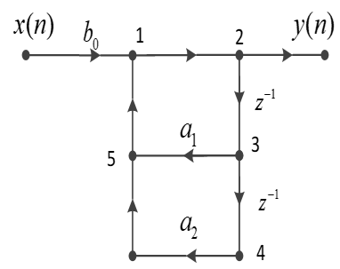
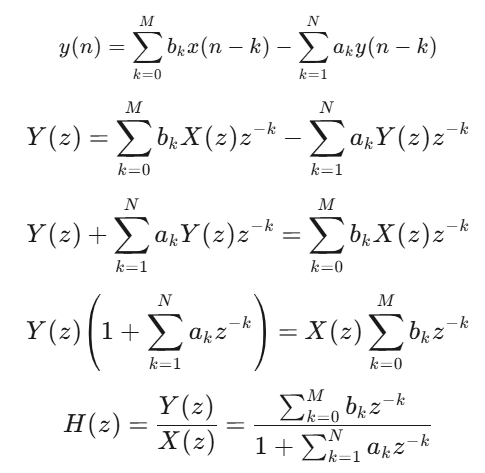
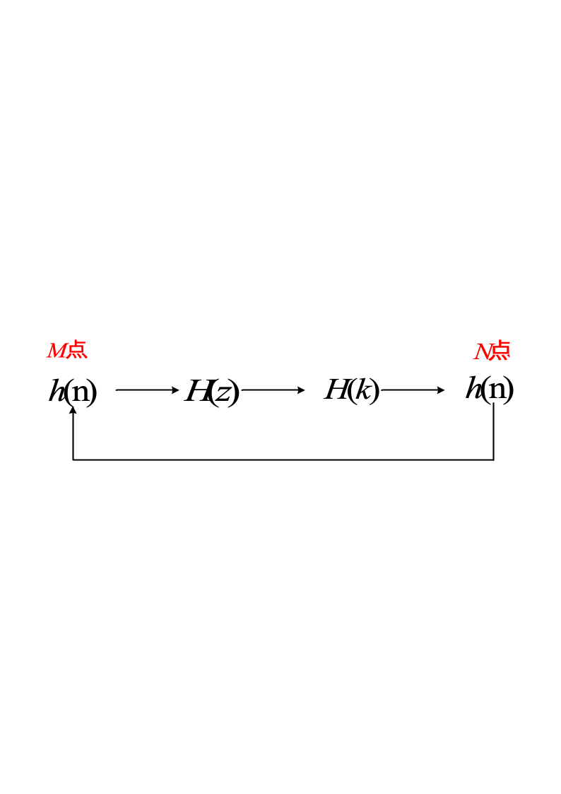
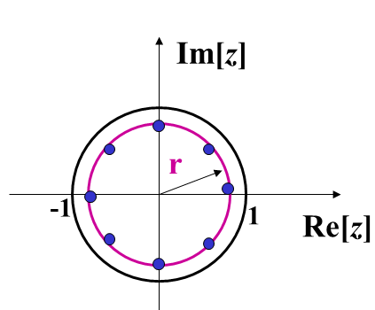
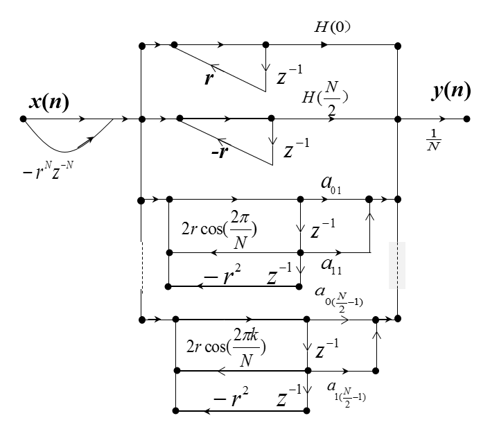
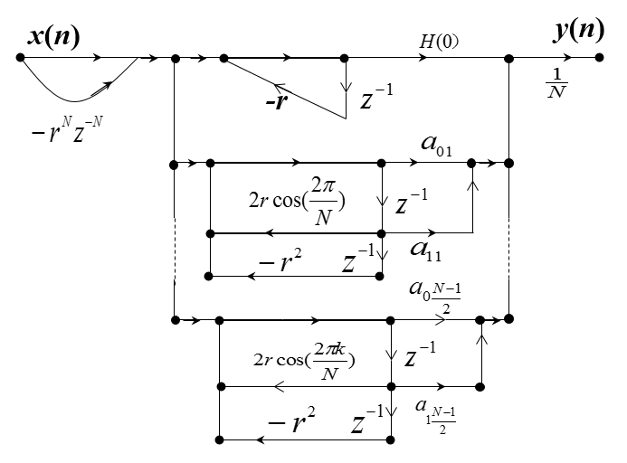
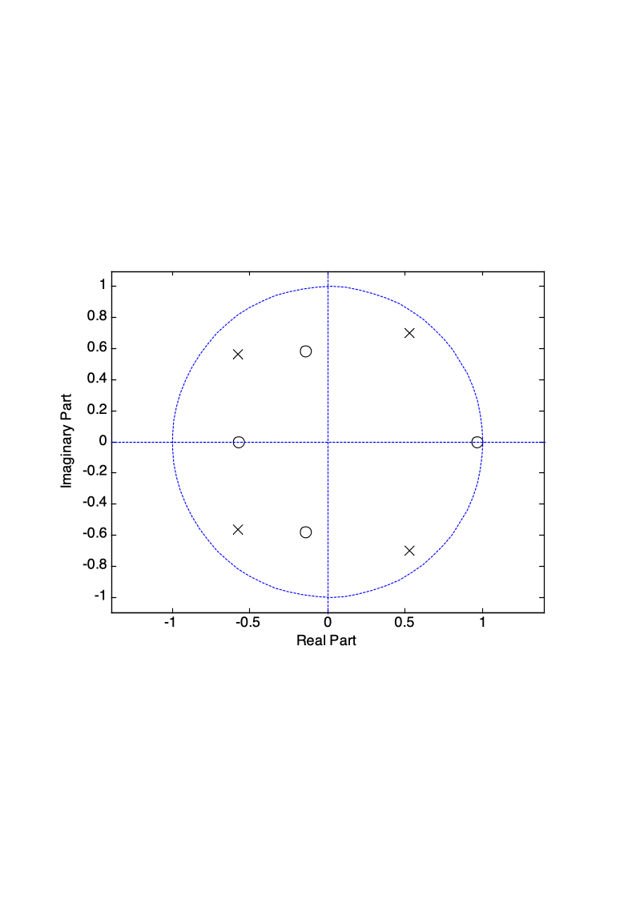
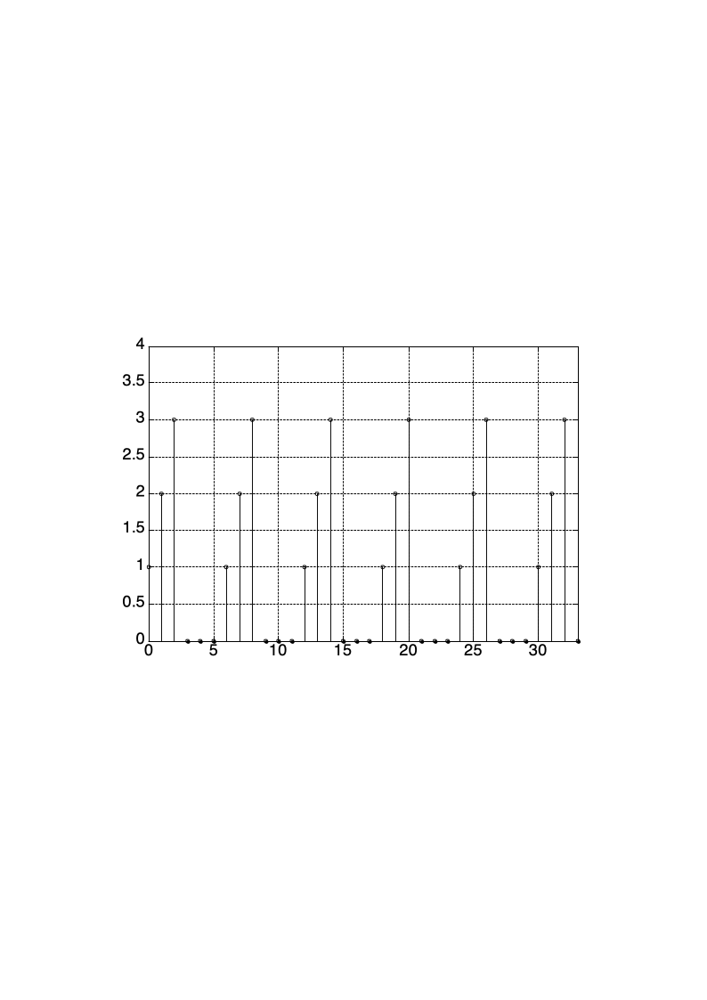

# 第5章 数字滤波器

<!-- slide: 1 -->

- 第5章 数字滤波器
- 数字信号处理

<!-- slide: 2 -->

## 第5章 数字滤波器基本结构及状态变量分析法

- 5.1引言
- 5.2用信号流图表示网络结构
- 5.3无限长单位冲激响应(IIR)滤波器的基本结构
- 5.4有限长单位冲激响应(FIR)滤波器的基本结构
- 5.5状态变量分析法
- 5.6MATLAB应用实例

<!-- slide: 3 -->

## 5.1引言

- 1．描述数字滤波器的方法
- 一般数字滤波器可以采用下面四种方法进行描述。
- ⑴系统单位脉冲响应h(n)(系统的时域特性)
- ⑵系统频率响应(变换域特性)
- (5-1)

<!-- slide: 4 -->

- (5-2)
- ⑷差分方程(输入输出序列间的关系)
- (5-3)
- ⑶系统函数H(z)(变换域特性)
- 5.1引言

<!-- slide: 5 -->

- 2. 实现方法
- 硬件实现：根据描述数字滤波器的数学模型或信号流图，用数字硬件装配成一台专门的设备，构成专用的信号处理机。
- 5.1引言
- 软件实现：直接利用通用计算机，将所需要的运算编成程序让计算机来执行。
- 为了用计算机或专用硬件完成对输入信号的处理（运算），必须把(5-2)式或者(5-3)式变换成一种算法，按照这种算法对输入信号进行运算。其实(5-3)式就是对输入信号的一种直接算法，如果已知输入信号x(n)以及ai、bi和n时刻以前的y(n-i)，则可以递推出y(n)值。

<!-- slide: 6 -->

## 不同的算法直接影响系统运算误差、运算速度以及系统的复杂程度和成本等，因此研究实现信号处理的算法是一个很重要的问题。我们用网络结构表示具体的算法，因此网络结构实际表示的是一种运算结构。这一章是第6、7章数字滤波器设计的必要基础。在介绍数字系统的基本网络结构之前，先介绍网络结构的表示方法。

- 5.1引言
- 但给定一个差分方程，不同的算法有多种，例如：
- (5-4)

<!-- slide: 7 -->

## 5.2  用信号流图表示网络结构

- 观察(5-3)式可知，数字信号处理中有三种基本算法，即乘法、加法和单位延迟。三种基本运算框图及其流图如图5.2.1所示。
- 图5-1 三种基本运算的流图表示

<!-- slide: 8 -->

- 例如：二阶数字滤波器：
- 其方框图及信号流图结构如图5-2所示：
- 图5-2 二阶网络方框图及信号流图
- 5.2  用信号流图表示网络结构

<!-- slide: 9 -->

- 不同的信号流图代表不同的运算方法，而对于同一个系统函数可以有很多种信号流图。从基本运算考虑，满足以下三个条件，称为基本信号流图(Primitive Signal Flow Graghs)。
- (1)信号流图中所有支路都是基本的，即支路增益是常数或者是z-1；
- (2)流图环路中必须存在延时支路；
- (3)节点和支路的数目是有限的。
- 5.2  用信号流图表示网络结构
- 网络结构分成两类（根据h(n)划分）：：
- a.有限长单位脉冲响应网络，FIR (Finite Impulse Response)网络。
- b.无限长单位脉冲响应网络，IIR (Infinite Impulse Response)网络。

<!-- slide: 10 -->

- (5-5)
- 其单位脉冲响应h(n)是有限长的，按照(5-5)式，h(n)表示为
- 系统函数为
- 5.2  用信号流图表示网络结构
- FIR网络中一般不存在输出对输入的反馈支路，因此差分方程用式(5-5)描述：
- 只有分子
- 没有分母

<!-- slide: 11 -->

- 另一类IIR网络结构存在输出对输入的反馈支路，也就是说，信号流图中存在反馈环路。这类网络的单位脉冲响应是无限长的。
- 系统函数为
- (5-6)
- 5.2  用信号流图表示网络结构
- 既有分子
- 又有分母

<!-- slide: 12 -->

- IIR网络结构的系统函数的分母如何出现的？
- 5.2  用信号流图表示网络结构
- 既有分子
- 又有分母

<!-- slide: 13 -->

- 其单位脉冲响应h(n)=anu(n)。
- 这两类不同的网络结构各有不同的特点，下面分类叙述其网络结构。
- 例如，一个简单的一阶IIR网络的差分方程为
- 5.2  用信号流图表示网络结构

<!-- slide: 14 -->

- 5.3 无限长单位冲激响应(IIR)滤波器的基本结构
- 无限长单位冲激响应(IIR)特点包括：
- (1)系统的单位冲激响应h(n)是无限长的；
- (2)系统函数H(z)在有限z平面上有极点存在；
- (3)结构上存在着输出到输入的反馈，即结构是递归的。
- 其基本结构有：直接I型、直接II型、级联型和并联型。

<!-- slide: 15 -->

- 5.3 FIR与IIR的识别

<!-- slide: 16 -->

- 5.3.1直接型
- 1. 直接Ι型
- 系统输入输出关系的N 阶差分方程
- 对应的系统函数为
- (5-7)
- 5.3 无限长单位冲激响应(IIR)滤波器的基本结构

<!-- slide: 17 -->

- 图5-3直接Ⅰ型IIR滤波器结构
- 5.3 无限长单位冲激响应(IIR)滤波器的基本结构

<!-- slide: 18 -->

- 构成直接Ⅰ型特点：
- (1)                       表示将输入及延时后的输入组成M 阶的延时网络，即横向延时网络，实现零点。
- (2)                          表示输出及其延时组成N阶延时网络，实现极点。
- (3)总的网络由上面两个网络级联而成。
- (4)直接Ⅰ型需要N+M 级延时单元。
- 5.3 无限长单位冲激响应(IIR)滤波器的基本结构

<!-- slide: 19 -->

- 2. 直接Ⅱ型
- 按照差分方程可以直接画出网络结构如图5-3所示。图中第一部分系统函数用H1(z)表示，第二部分用H2(z)表示，那么H(z)=H1(z)·Hz(z)，当然也可以写成H(z)=H2(z)·H1(z)，相当于将图5-3中两部分流图交换位置，如图5-4(a)所示。
- 5.3 无限长单位冲激响应(IIR)滤波器的基本结构
- 直接Ⅱ型网络结构优点：
- 结构简单、清晰，延时支路比直接Ⅰ型减少一半。
- 直接Ⅱ型网络结构缺点：
- ⑴      、   常数对滤波器的性能控制作用不明显；
- ⑵ 零、极点关系不明显，调整困难；
- ⑶ 系数量化效应敏感度高。

<!-- slide: 20 -->

- 图5-4直接Ⅰ型向直接Ⅱ型IIR滤波器结构的转变
- 5.3 无限长单位冲激响应(IIR)滤波器的基本结构

<!-- slide: 21 -->

- 【例题5-1】IIR数字滤波器的系统函数H(z)为
- 画出该滤波器的直接Ⅱ型结构。
- 5.3 无限长单位冲激响应(IIR)滤波器的基本结构

<!-- slide: 22 -->

- 【解】根据z反变换，由H(z)写出差分方程如下：
- 图5-5例题5-1直接Ⅱ型结构
- 5.3 无限长单位冲激响应(IIR)滤波器的基本结构

<!-- slide: 23 -->

- 【例题5-2】一个LTI系统单位脉冲响应为
- 求解如下问题：
- ⑴ 确定系统函数（包括收敛域）、系统频率响应；
- ⑵ 给出系统零极点并确定系统的稳定性；
- ⑶ 求解系统的差分方程；
- ⑷ 绘制出在使用最少存储单元及单位延时数情况下的系统结构图。
- 5.3 无限长单位冲激响应(IIR)滤波器的基本结构

<!-- slide: 24 -->

- 频率响应为
- 5.3 无限长单位冲激响应(IIR)滤波器的基本结构
- 【解】(1)根据                             可以直接给出系统函数
- Z变换与傅里叶变换的关系

<!-- slide: 25 -->

- 系统零点为
- 系统极点为
- 由于两个极点都在单位圆中，所以系统是稳定的。
- 5.3 无限长单位冲激响应(IIR)滤波器的基本结构
- (2)系统函数可以写成

<!-- slide: 26 -->

- 因此
- 这里            和          分别是输入输出信号的Z变换
- 因此，差分方程可表示成
- 5.3 无限长单位冲激响应(IIR)滤波器的基本结构
- (3)由于

<!-- slide: 27 -->

- (4)题目要求最少存储单元及单位延时数，系统结构应该是直接Ⅱ型结构
- 图5-6例题5-2直接ΙI型结构
- 5.3 无限长单位冲激响应(IIR)滤波器的基本结构

<!-- slide: 28 -->

- 5.3.2 级联型
- 对于系统函数
- 分子分母均为多项式，且多项式的系数一般为实数，现将分子分母多项式分别进行因式分解，得到
- (5-8)
- 5.3 无限长单位冲激响应(IIR)滤波器的基本结构

<!-- slide: 29 -->

- 式中，A是常数，  ，   分别表示系统的零点、极点，为实数或共轭成对的复数。将共轭成对的零点(极点)放在一起，形成一个二阶多项式，系数仍为实数，将分子、分母均为实数的二阶多项式放在一起，形成一个二阶网络。二阶网络系统函数为：
- (5-9)
- 式中：  、  、  、  和    均为实数。这样，H(z)就分解成一些一阶或二阶数字网络的级联形式，如下式：
- H(z)=H1(z)H2(z)…Hk(z)
- 5.3 无限长单位冲激响应(IIR)滤波器的基本结构

<!-- slide: 30 -->

- 级联型示意图为H(z)
- 图5-7级联型IIR滤波器结构示意图
- 级联型结构不是唯一的，式中        表示一个一阶或二阶的数字网络的系统函数，每个        的网络结构均采用前面介绍的直接型网络结构表示。
- 5.3 无限长单位冲激响应(IIR)滤波器的基本结构

<!-- slide: 31 -->

- 图5-9式(5-9)对应的直接Ⅱ型结构
- 5.3 无限长单位冲激响应(IIR)滤波器的基本结构

<!-- slide: 32 -->

- ⑵每个一阶网络决定一个零点、一个极点，每个二阶网络决定一对零点、一对极点。调整一阶网络和二阶网络系数可以改变零极点位置，所以零、极点调整方便，便于调整频响；
- 级联型IIR滤波器结构缺点：
- ⑴ 存在误差积累、级联结构中后面的网络输出不会传送到前面，所以运算误差的积累相对于直接型要小；
- ⑵ 零、极点配合关系着网络最优化的问题，而最佳配合关系不易确定。
- 5.3 无限长单位冲激响应(IIR)滤波器的基本结构
- 级联型IIR滤波器结构优点:
- ⑴ 所需存储器最少，系统结构组成灵活；

<!-- slide: 33 -->

- 【例题5-3】已知IIR数字滤波器的系统函数，画出该滤波器的级联型结构。
- 5.3 无限长单位冲激响应(IIR)滤波器的基本结构

<!-- slide: 34 -->

- 【解】为了减少单位延迟的数量，将一阶的分子、分母多项式组成一个一阶网络，二阶的分子、分母多项式组成一个二阶网络。将H(z)的分子、分母进行因式分解，得
- 则 H(z)的级联型结构为：
- 图5-10例题5-3级联型结构图
- 5.3 无限长单位冲激响应(IIR)滤波器的基本结构

<!-- slide: 35 -->

- 5.3.3并联型
- 将H(z)展成部分分式形式得到IIR并联型结构，即：
- 图5-11并联型结构图
- 5.3 无限长单位冲激响应(IIR)滤波器的基本结构

<!-- slide: 36 -->

- 式中，Hi(z)通常为一阶网络和二阶网络，网络系统均为实数。二阶网络的系统函数一般为：
- (5-10)
- 式(5-10)中，β0i、β1i、α1i和α2i都是实数。如果α2i=0则构成一阶网络。
- 其输出Y(z)表示为：
- Y(z)=H1(z)X(z)+H2(z)X(z)+…+Hk(z)X(z)
- 表明：将x(n)送入每个二阶(或一阶)网络后，将所有输出相加得到输出y(n)
- 5.3 无限长单位冲激响应(IIR)滤波器的基本结构

<!-- slide: 37 -->

- 并联型IIR滤波器结构优点：
- ⑴ 所需存储器最小；
- 5.3 无限长单位冲激响应(IIR)滤波器的基本结构
- ⑵无误差积累，各级误差互不影响，仅极点调整方便。所以，在要求准确传输极点的场合，宜采用这种结构；
- 并联型IIR滤波器结构缺点:
- 零点调整不方便，
- 当H(z)有多阶极点时，部分分式展开不易。

<!-- slide: 38 -->

- 【例题5-4】若系统函数
- 求H(z)的并联型结构。
- 【解】对H(z)展开成部分分式
- 5.3 无限长单位冲激响应(IIR)滤波器的基本结构

<!-- slide: 39 -->

- 将每一部分用直接型结构实现，其并联型网络结构如图所示。
- 图5-12例题5-4并联型结构图
- 5.3 无限长单位冲激响应(IIR)滤波器的基本结构

<!-- slide: 40 -->

- FIR数字滤波器结构特点为：
- (1)系统的单位冲激响应h(n)是有限长序列；
- (2)系统函数|H(z)|在|z|>0处收敛，有限z平面上只有零点，极点全部在z=0处（即FIR一定为稳定系统）；
- (3)结构上主要是非递归结构，没有输出到输入反馈。但有些结构中（例如频率抽样结构）也包含有反馈的递归部分。
- 5.4有限长单位冲激响应(FIR)滤波器的基本结构

<!-- slide: 41 -->

## 5.4.1直接型(或称卷积型、横截型、横向型)

- 设单位脉冲响应h(n)长度为N，其系统函数H(z)为
- 差分方程表示为
- (5-11)
- 式(5-11)是线性移不变系统的卷积和公式，是x(n)延时链的横向结构，称为横截型结构或卷积型结构，也可称直接型结构。直接按H(z)或者差分方程画出没有反馈支路的结构图。
- 5.4有限长单位冲激响应(FIR)滤波器的基本结构

<!-- slide: 42 -->

- 图5-13 FIR直接型网络结构
- 5.4有限长单位冲激响应(FIR)滤波器的基本结构

<!-- slide: 43 -->

- 5.4.2级联型
- 将H(z)进行因式分解，并将共轭成对的零点放在一起，形成一个系数为实数的二阶网络，形式如下：
- (5-12)
- 这样级联型网络结构就是由一阶或二阶因子构成的级联结构，其中每一个因式都用直接型实现。
- 5.4有限长单位冲激响应(FIR)滤波器的基本结构

<!-- slide: 44 -->

- 级联型FIR滤波器结构的特点：
- （1）由于这种结构所需的系数比直接型多，所需乘法运算也比直接型多，很少用；
- （2）由于这种结构的每一节控制一对零点，因而只能在需要控制传输零点时用。
- 5.4有限长单位冲激响应(FIR)滤波器的基本结构

<!-- slide: 45 -->

- 【例题5-5】设FIR网络系统函数H(z)如下式：
- H(z)=0.96+2.0z-1+2.8z-2+1.5z-3
- 画出H(z)的直接型结构和级联型结构。
- 【解】将H(z)进行因式分解，得到：
- H(z)=(0.6+0.5z-1)(1.6+2z-1+3z-2)
- 其级联型结构和直接型结构如图5.4.2所示。
- 图5-14例题5-5级联型和直接型结构
- 5.4有限长单位冲激响应(FIR)滤波器的基本结构

<!-- slide: 46 -->

- 5.4.3频率采样型
- 由频域采样定理可知，对有限长序列h(n)的Z变换H(z)在单位圆上做N点的等间隔采样，N 个频率采样值的离散傅里叶反变换所对应的时域信号hN(n)是原序列h(n)以采样点数N为周期进行周期延拓的结果，当N大于等于原序列h(n)长度M时hN(n)=h(n)，不会发生信号失真，此时H(z)可以用频域采样序列H(k)内插得到，各个过程间关系如图5-15所示，H(k)、H(z)关系用内插公式5-13表示：
- 5.4有限长单位冲激响应(FIR)滤波器的基本结构

<!-- slide: 47 -->

- 图5-15 频率采样与系统函数、离散傅里叶变换间关系
- 式中：
- 5.4有限长单位冲激响应(FIR)滤波器的基本结构
- (5-13)
- 内插公式
- 内插函数

<!-- slide: 48 -->

- 1、频率采样型滤波器结构
- 由式(5-13)得到FIR滤波器提供另一种结构：频率采样型结构，它是由两部分级联而成。H(z)也可以重写为
- 式中：
- (5-15)
- (5-16)
- 5.4有限长单位冲激响应(FIR)滤波器的基本结构
- (5-14)

<!-- slide: 49 -->

- 是一个由N阶延时单元组成的梳状滤波器，信号流图及幅频特性如图4-9所示。它在单位圆上有N个等间隔的零点
- 2. 梳状滤波器
- 将
- 带入式(5-15)中，可得到幅频特性表达式
- 5.4有限长单位冲激响应(FIR)滤波器的基本结构

<!-- slide: 50 -->

- 图5-16 梳状滤波器信号流图及幅频特性
- 5.4有限长单位冲激响应(FIR)滤波器的基本结构

<!-- slide: 51 -->

- 公式(5-16)                                  表示的网络称为谐振器，谐振
- 器的极点为
- 故等效为谐振频率为
- 3. 谐振器
- 谐振器信号流图(IIR)如图5-17所示：
- 此一阶网络在频率               处响应为无穷大，即
- 的无损耗谐振器。
- 5.4有限长单位冲激响应(FIR)滤波器的基本结构
- 极点处为峰值

<!-- slide: 52 -->

- 把这两部分级联起来就可以构成FIR滤波器的频率采样型结构，如图5-18所示。
- 它是由N个谐振器并联而成的。这个谐振矩的极点正好与梳状滤波器的一个零点(i=k)相抵消，从而使这个频率(ω=2πk/N)上的频率响应等于H(k)，避免频率响应无穷大。
- 4. 谐振矩
- 5.4有限长单位冲激响应(FIR)滤波器的基本结构
- (5-17)
- (5-18)

<!-- slide: 53 -->

- 图5-18 频率采样型FIR滤波器结构
- 5.4有限长单位冲激响应(FIR)滤波器的基本结构

<!-- slide: 54 -->

- 频率采样型FIR滤波器结构优点：
- （1）频响特性调整方便，在频率采样点ωk，H(ejωk)=H(k)，只要调整H(k)(即一阶网络Hk(z)中乘法器的系数H(k))，可有效地调整频响特性。
- （2）易于标准化、模块化：只要h(n)长度N相同，对于任何频响形状，其梳状滤波器部分和N一阶网络部分结构完全相同，只是各支路增益H(k)不同。这样，相同部分便于标准化、模块化。
- 5.4有限长单位冲激响应(FIR)滤波器的基本结构

<!-- slide: 55 -->

- （2）由于H(k)和          一般为复数，要求乘法器完成复数乘法运算，这对硬件实现是不方便的。
- 为了克服以上缺点，采取下面修正措施。
- 频率采样型FIR滤波器结构缺点：
- （1）系统稳定是靠位于单位圆上的N个零极点对消来保证的，由于寄存器的长度有限，有限字长效应可能使零极点不能完全抵消，影响系统的稳定性。
- 5.4有限长单位冲激响应(FIR)滤波器的基本结构

<!-- slide: 56 -->

- 将单位圆上的零极点向单位圆内收缩一点，收缩到半径r<1且r1，这样，以z/r代替式(5-13)H(z)表示式中z。
- (5-19)
- 图5-19 修正后的Z平面采样点图
- 5.4有限长单位冲激响应(FIR)滤波器的基本结构

<!-- slide: 57 -->

- 此时，                   ，零极点均为          ，如果由于量化原因零、极点不能相互抵消时，极点也都在单位圆内，系统仍然是稳定的。若h(n)是实序列，根据其DFT变换对称性，H(k)=H*(N-k)，旋转因子                         ,将        和             合并为一个二阶网络
- (5-20)
- 5.4有限长单位冲激响应(FIR)滤波器的基本结构

<!-- slide: 58 -->

- (5-21)
- 图5-20 FIR频率采样修正型子网络结构
- 5.4有限长单位冲激响应(FIR)滤波器的基本结构

<!-- slide: 59 -->

- 当N为偶数时，H(0)和H(N/2)为实数，H(z)可用式(5-22)表示，此时，修正的频率采样结构如图5-21所示。
- (5-22)
- 5.4有限长单位冲激响应(FIR)滤波器的基本结构

<!-- slide: 60 -->

- 图5-21频率采样修正结构(N为偶数)
- 5.4有限长单位冲激响应(FIR)滤波器的基本结构

<!-- slide: 61 -->

- 当N为奇数时，只有H(0)为实数，H(z)可用式(5-23)表示，此时，修正的频率采样结构如图5-22所示。
- (5-23)
- 5.4有限长单位冲激响应(FIR)滤波器的基本结构

<!-- slide: 62 -->

- 图5-22频率采样修正结构(N为奇数)
- 5.4有限长单位冲激响应(FIR)滤波器的基本结构

<!-- slide: 63 -->

- 可见，当采样点数N很大时，网络结构很复杂，需要的乘法器和延时单元很多，对于窄带滤波器，大部分采样值为零，使二级网络个数大大减小，所以频率采样结构适合窄带滤波器的设计。
- 5.4有限长单位冲激响应(FIR)滤波器的基本结构

<!-- slide: 64 -->

- 5.5状态变量分析法
- 本书其他章节都把离散时间系统看作一个具有输入—输出两个端口的黑盒，而不关心系统内部状态。这种两端口系统的时域特性用冲激响应或差分方程来表征，而频域特性则用频率响应或系统函数来表征。当然，这些特性存在着一定的数学关系。随着系统理论的发展，人们不再满足只对系统输出变化的了解，对系统内部某些变量的变化规律也感兴趣。此外，实际应用中还会遇到多输入多输出的情况，而且将系统看成是时不变系统也往往不符合客观实际。这样，仅仅用两端口分析法就不够了，所以要引入另一种系统分析方法，即状态变量分析法。利用矩阵线性代数等数学工具对系统进行分析研究。

<!-- slide: 65 -->

- “状态”指系统内一组变量，它包含了系统全部过去的信息，由这一组变量和现在与将来的输入，可求出系统现在和将来的全部输出；一般来说，描述一个系统有输入输出法（差分方程、系统函数、单位脉冲响应）和状态变量法。状态变量分析法具有如下优越性：
- （1）更好的了解系统的内部结构；
- （2）既能处理线性系统，又能处理非线性系统；
- （3）既能处理单输入输出变量的系统，又能处理多输入输出的系统。
- 5.5状态变量分析法

<!-- slide: 66 -->

- 5.5.1由信号流图建立状态方程
- 状态变量分析法有两个基本方程：状态方程和输出方程。状态方程把系统内部一些称为状态变量的节点变量和输入联系起来；输出方程则把输出信号和那些状态变量联系起来。
- 具体规则为：
- (1)状态变量选在基本信号流图中单位延迟时支路输出节点处;
- (2) 围绕加法器写出状态方程和输出方程。
- 图5-23是二阶网络基本信号流图，信号流图有两个延时支路，因此，建立两个状态变量     和
- 图5-23 二阶网络基本信号流图
- 5.5状态变量分析法

<!-- slide: 67 -->

- 图5-23流图中输入
- 、输出
- 与状态变量之间的关系为：
- 将以上
- 、
- 写成矩阵形式：
- 和
- 5.5状态变量分析法

<!-- slide: 68 -->

- 5.5状态变量分析法
- 再分析一个信号流图，信号流图中两个延时支路输出节点定为状态变量
- 图5-24一般二阶网络基本信号流图

<!-- slide: 69 -->

- 这个一般的二阶网络基本信号流图，按照信号流图写出以下方程：
- 将以上写成矩阵形式：
- 5.5状态变量分析法

<!-- slide: 70 -->

- (5-24)
- 用矩阵符号表示：
- 状态方程:
- 输出方程:
- 其中：
- 若系统中有N个单位延时支路，M个输入信号：
- ，L个输出信号
- ，则状态方程和输出方程分别为
- (5-25)
- 状态方程：
- 输出方程：
- 5.5状态变量分析法

<!-- slide: 71 -->

- 其中：
- (5-26)
- (5-27)
- 图5-25  状态变量分析法
- 5.5状态变量分析法

<!-- slide: 72 -->

- (3)找出输出信号和状态变量    以及输入信号关系用矩阵方程表示。
- (2)列出所有节点变量方程，找出状态变量      与    和输入    之间的关系用矩阵方程表示；
- 【解】(1)按顺序在   支路输出端建立状态变量    ,   支路
- 的输入端为
- 【例题5-6】建立图5-26的状态方程和输出方程。
- 5.5状态变量分析法
- 图5-26 例题5-6网络信号流图

<!-- slide: 73 -->

- 将上式写成矩阵方程：
- 输出信号
- 的方程推导如下：
- 5.5状态变量分析法
- 将
- 代入上式：

<!-- slide: 74 -->

- 【例题5-7】IIR直接型系统流图及其参数如图所示。给出系统函数，并写出状态方程和输出方程。
- 图5-27 例题5-7网络信号流图
- 【解】根据图5-27得系统函数为
- 5.5状态变量分析法

<!-- slide: 75 -->

- 本题与例题5-6相似，只是阶数不同，参考例题5-6可用直接写出状态方程和输出方程
- 5.5状态变量分析法

<!-- slide: 76 -->

- 5.5.2 由系统函数建立状态方程
- 由系统函数建立状态方程的步骤为：
- (1)画出系统网络结构；
- (2)根据信号流图写出其状态方程和输出方程。
- 5.5状态变量分析法

<!-- slide: 77 -->

- 【解】根据部分分式展开法，得到
- 5.5状态变量分析法
- 【例题5-8】系统函数
- 写出其状态方程和输出方程。

<!-- slide: 78 -->

- 并联型结构图为：
- 图5-28 例题5-8网络信号流图
- 5.5状态变量分析法

<!-- slide: 79 -->

- 状态方程和输出方程为：
- 写成矩阵形式为：
- 5.5状态变量分析法

<!-- slide: 80 -->

- 【例题5-9】已知FIR滤波网络系统函数H(z)为
- 写出其状态方程和输出方程。
- 【解】画出直接型结构
- 图5-29 例题5-9网络信号流图
- 5.5状态变量分析法

<!-- slide: 81 -->

- 则状态方程为
- 输出方程为
- 5.5状态变量分析法

<!-- slide: 82 -->

- 5.5.3 由状态变量分析法转换到输入输出分析法
- 设系统的状态方程和输出方程为：
- (5-28)
- (5-29)
- 将上面两式进行Z变换
- (5-30)
- (5-31)
- 式中
- 5.5状态变量分析法

<!-- slide: 83 -->

- 由式(5-30)得
- (5-32)
- 由式(5-31)、(5-32)得
- (5-33)
- 5.5状态变量分析法

<!-- slide: 84 -->

- 【例题5-10】已知二阶网络的四个参数矩阵如下：
- 求该网络的系统函数。
- 【解】
- 由式(5-33)可得
- 5.5状态变量分析法

<!-- slide: 85 -->

- 5.6 MATLAB应用实例
- 【例题5-11】求下列直接型系统函数的零、极点，并将它转换成二阶节形式
- MATLAB代码如下：
- num=[1 -0.1 -0.3 -0.3 -0.2];
- den=[1 0.1 0.2 0.2 0.5];
- [z,p,k]=tf2zp(num,den);	m=abs(p);
- disp('零点');disp(z);
- disp('极点');disp(p);
- disp('增益系数');disp(k);
- sos=zp2sos(z,p,k);

<!-- slide: 86 -->

- disp('二阶节');disp(real(sos));
- zplane(num,den)
- 输入到“num”和“den”的分别为分子和分母多项式的系数。计算求得零、极点增益系数和二阶节的系数：
- 零点：0.9615   -0.5730    -0.1443 + 0.5850i  -0.1443 -0.5850i
- 极点：0.5276 + 0.6997i  0.5276 - 0.6997i   -0.5776 + 0.5635i  -0.5776 - 0.5635i
- 增益系数：1
- 二阶节： 1.0000   -0.3885   -0.5509    1.0000    1.1552    0.6511
- 1.0000    0.2885    0.3630    1.0000   -1.0552    0.7679
- 系统函数的二阶节形式为：
- 5.6 MATLAB应用实例

<!-- slide: 87 -->

- 系统零极点如图5-30。

- 图5-30 系统函数的零极点图
- 5.6 MATLAB应用实例

<!-- slide: 88 -->

- 由图5-31知       ,       。   是系统内部的输入点，而系统外部并无信号加到这一点。状态变量        被初始化如图5-31所示。每次得到一个输出点   后，都要将延迟线按图中所示方向刷新，即先使临时变量         ，然后依次使
- ,
- 【例题5-12】周期序列发生器在用状态变量法分析数字系统时， 阶系统被视为具有  个抽头的延迟线结构。这种结构既可以用来构建梳状滤波器，也可以用作周期序列发生器。在作为周期序列发生器时，应周期地刷新延迟线各抽头状态，并且必须有反馈支路才能实现自激振荡。例如，若要产生图5-31所示的6点周期序列，则需要具备图5-31所示的延迟线。图中延迟线的6个状态变量，即    ，
- ，
- 。
- ，
- ，
- 5.6 MATLAB应用实例

<!-- slide: 89 -->

- 图5-31 6点周期序列    图5-32序列发生器输出波形
- 5.6 MATLAB应用实例
