# 2. 通信信道

<!-- slide: 1 -->

## 通信原理

- 2. 通信信道

<!-- slide: 2 -->

## 信道分类：
无线信道 － 电磁波（含光波）
有线信道 － 电线、光纤

<!-- slide: 3 -->

## 无线信道
无线信道电磁波的频率 － 受天线尺寸限制
地球大气层的结构
对流层：地面上 0 ~ 10 km
平流层：约10 ～ 60 km
电离层：约60 ～ 400 km

- 地  面
- 对流层
- 平流层
- 电离层
- 10 km
- 60 km
- 0 km

<!-- slide: 4 -->

## 电离层对于传播的影响
反射
散射
大气层对于传播的影响
散射
吸收

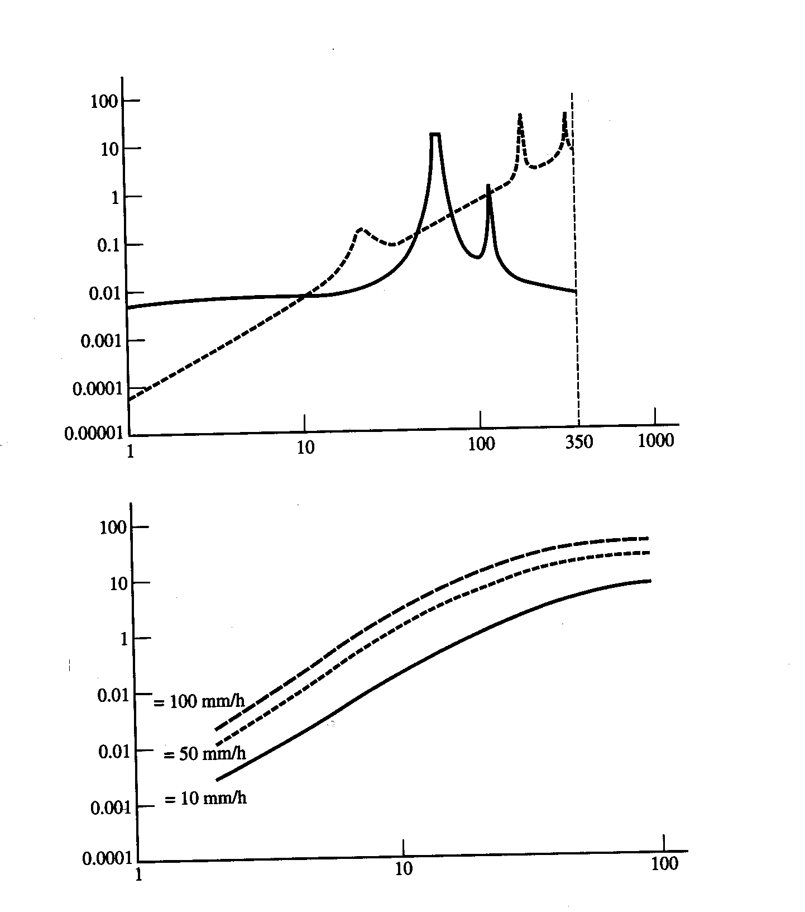
- 频率(GHz)
- (a) 氧气和水蒸气（浓度7.5 g/m3）的衰减
- 频率(GHz)
- (b) 降雨的衰减
- 衰减
- (dB/km)
- 衰减
- (dB/km)
- 水蒸气
- 氧气
- 降雨率
- 大气衰减

<!-- slide: 5 -->

## 电磁波的分类：
地波
频率 < 2 MHz
有绕射能力
距离：数百或数千千米 
天波
频率：2 ~ 30 MHz
特点：被电离层反射
一次反射距离：< 4000 km
寂静区：

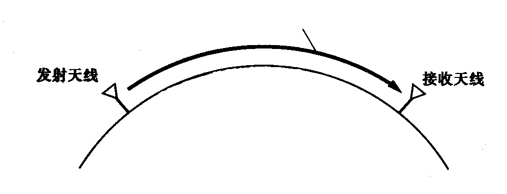
- 传播路径
- 地  面
- 地波传播
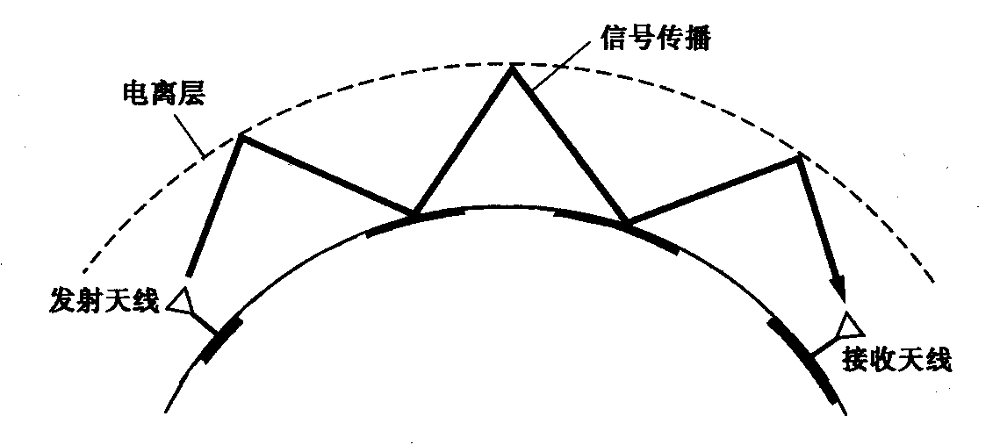
- 地 面
- 信号传播路径
- 天波传播

<!-- slide: 6 -->

## 视线传播：
频率 > 30 MHz
距离: 和天线高度有关
													
				(4.1-3)
  式中，D – 收发天线间距离(km)。
[例] 若要求D = 50 km，则由式(4.1-3)

增大视线传播距离的其他途径
中继通信：
卫星通信：静止卫星、移动卫星
平流层通信：

- d
- d
- h
- 接收天线
- 发射天线
- 传播途径
- D
- 地面
- r
- r
- 视线传播
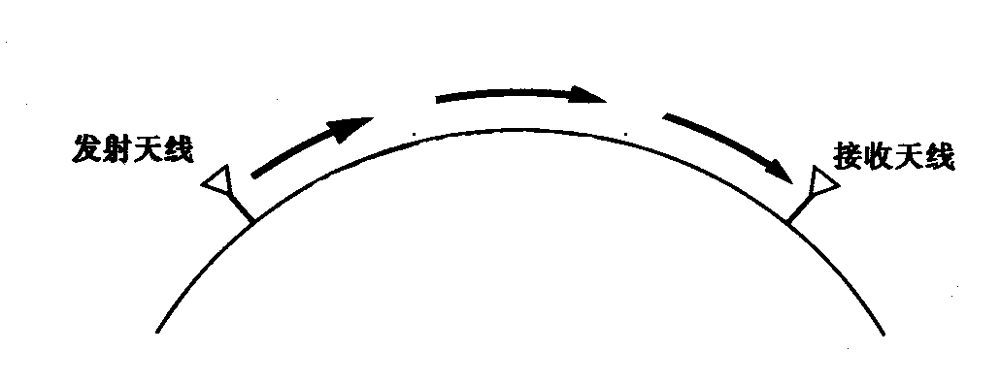
- 无线电中继
- m

<!-- slide: 7 -->

## 散射传播
电离层散射
	机理 － 由电离层不均匀性引起
	频率 － 30 ~ 60 MHz
	距离 － 1000 km以上
对流层散射
	机理 － 由对流层不均匀性（湍流）引起
	频率 － 100 ~ 4000 MHz
	最大距离 < 600 km

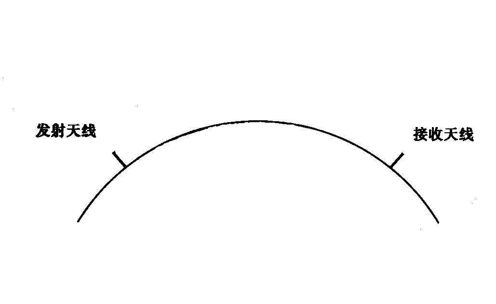
- 对流层散射通信
- 地球
- 有效散射区域

<!-- slide: 8 -->

## 流星余迹散射
	

	流星余迹特点 － 高度80 ~ 120 km，长度15 ~ 40 km
	存留时间  - 小于1秒至几分钟
	频率 － 30 ~ 100 MHz
	距离 － 1000 km以上
	特点 － 低速存储、高速突发、断续传输

- 流星余迹散射通信

- 流星余迹

<!-- slide: 9 -->

## 有线信道
明线

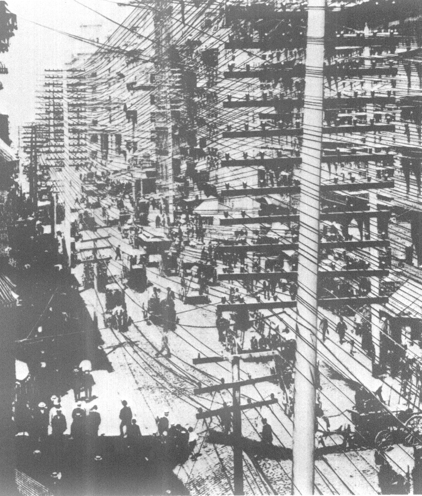

<!-- slide: 10 -->

## 对称电缆：由许多对双绞线组成

同轴电缆

- 双绞线
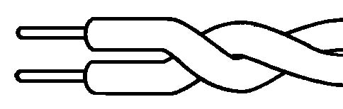
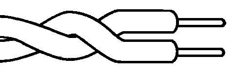

- 导体
- 绝缘层
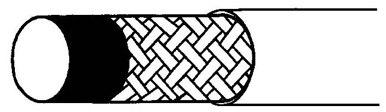
- 导体
- 金属编织网
- 保护层
- 实心介质
- 同轴线

<!-- slide: 11 -->

## 光纤
结构
纤芯
包层
按折射率分类
阶跃型
梯度型
按模式分类
多模光纤
单模光纤

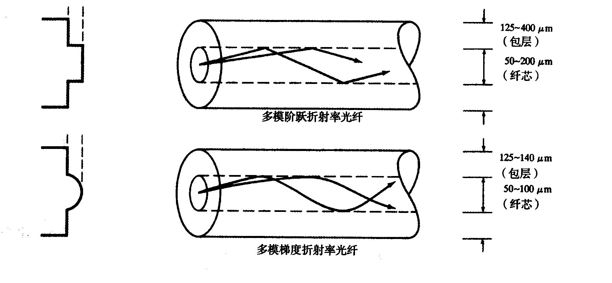
- 折射率
- n1
- n2
- 折射率
- n1
- n2
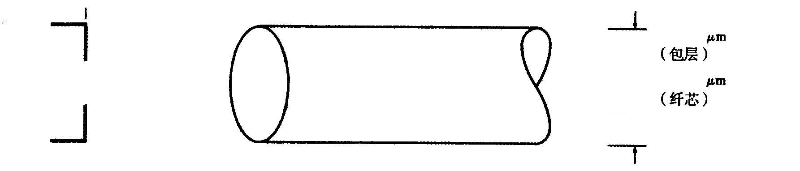
- 7～10
- 125
- 折射率
- n1
- n2
- 单模阶跃折射率光纤
- 光纤结构示意图
- (a)
- (b)
- (c)
