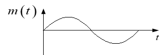
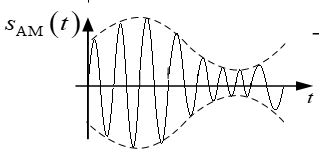
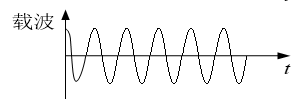
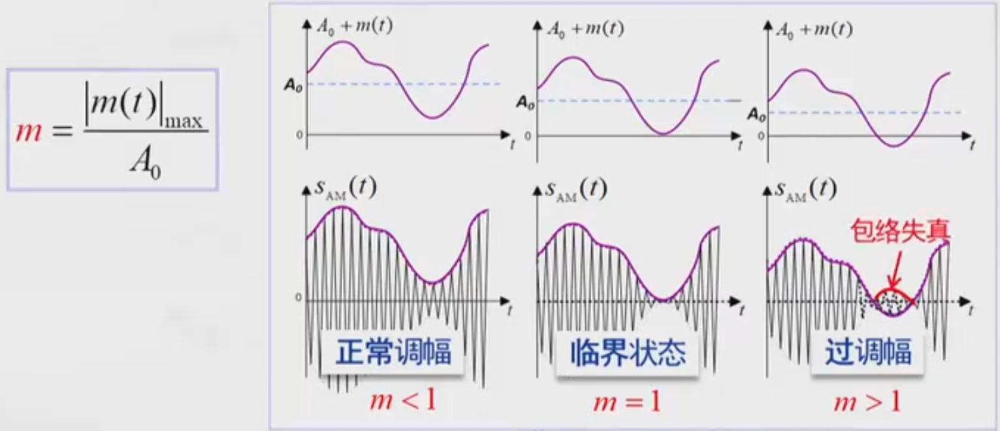

# 3. 模拟调制方法

<!-- slide: 1 -->

## 通信原理

- 3. 模拟调制系统

<!-- slide: 2 -->

## 基本概念
调制 － 把信号转换成适合在信道中传输的形式的一种过程。
广义调制 － 分为基带调制和带通调制（也称载波调制）。 
狭义调制 － 仅指带通调制。在无线通信和其他大多数场合，调制一词均指载波调制。

<!-- slide: 3 -->

## 基本概念
调制信号 － 指来自信源的基带信号 
载波调制 － 用调制信号去控制载波的参数的过程。
载波 － 未受调制的周期性振荡信号，它可以是正弦波，也可以是非正弦波。
已调信号 － 载波受调制后称为已调信号。
解调（检波） － 调制的逆过程，其作用是将已调信号中的调制信号恢复出来。

<!-- slide: 4 -->

## 调制的目的 
提高无线通信时的天线辐射效率。
把多个基带信号分别搬移到不同的载频处，以实现信道的多路复用，提高信道利用率。
扩展信号带宽，提高系统抗干扰、抗衰落能力，还可实现传输带宽与信噪比之间的互换。
调制方式 
模拟调制
数字调制 
常见的模拟调制
幅度调制：调幅、双边带、单边带和残留边带
角度调制：频率调制、相位调制

<!-- slide: 5 -->

## 幅度调制（线性调制）的原理
一般原理
设正弦型载波表示式为：

	式中，A — 载波幅度；
		   c — 载波角频率；
		   0 — 载波初始相位（以后假定0 ＝ 0）。 
则根据调制定义，幅度调制信号（已调信号）一般可表示成
	
式中， m(t)— 基带调制信号。

<!-- slide: 6 -->

## 频谱：设调制信号m(t)的频谱为M()，则已调信号的频谱为

    - 由以上表示式可见：
    - -- 在时域波形上，已调信号的幅度随基带信号的规律而正比地变化；
    - -- 在频谱结构上，频谱完全是基带信号频谱在频域内的简单搬移(精确到常数因子)。
    - 由于这种搬移是线性的，因此，幅度调制通常又称为线性调制。但应注意，这里的“线性”并不意味着已调信号与调制信号之间符合线性变换关系。事实上，任何调制过程都是一种非线性的变换过程。

<!-- slide: 7 -->

## 调幅（AM）
时域表示式

	式中	 m(t) － 调制信号，均值为0；
		 A0 － 常数，表示叠加的直流分量。
频谱：若m(t)为确知信号，则AM信号的频谱为

	若m(t)为随机信号，则已调信号的频域表示式必须用功率谱描述。
调制器模型

<!-- slide: 8 -->

## 波形图
由波形可以看出，当满足条件：
			|m(t)|  A0
     时，其包络与调制信号波形相同，
	因此用包络检波法很容易恢复出原
   始调制信号。
否则，出现“过调幅”现象。这时用
	包络检波将发生失真。但是，可以
	采用其他的解调方法，如同步检波。

<!-- slide: 9 -->

## 调幅的程度及“过调幅”：

<!-- slide: 10 -->

## 频谱图
由频谱可以看出，AM信号的频谱由三部分组成：
		- 载频分量
		- 上边带
		- 下边带
		
上边带的频谱结构与原调制
	信号的频谱结构相同，下边
	带是上边带的镜像。

- 载频分量
- 载频分量
- 上边带
- 上边带
- 下边带
- 下边带

<!-- slide: 11 -->

## AM信号的特性
带宽：它是带有载波分量的双边带信号，带宽是基带信号带宽 fH 的两倍：
功率：
		当m(t)为确知信号时，

		若
		则

		式中	Pc = A02/2 	－ 载波功率，
					－ 边带功率。

<!-- slide: 12 -->

## 调制效率
	       由上述可见，AM信号的总功率包括载波功率和边带功率两部分。只有边带功率才与调制信号有关，载波分量并不携带信息。有用功率（用于传输有用信息的边带功率）占信号总功率的比例称为调制效率：

	当m(t) = Am cos mt时，
	代入上式，得到

	当|m(t)|max = A0时（100％调制），调制效率最高，这时
			max ＝ 1/3

<!-- slide: 13 -->

## 双边带调制（DSB）
时域表示式：无直流分量A0

频谱：无载频分量 

曲线：

<!-- slide: 14 -->

## 调制效率：100％
优点：节省了载波功率
缺点：不能用包络检波，需用相干检波，较复杂。

单边带调制（SSB）
原理：
双边带信号两个边带中的任意一个都包含了调制信号频谱M()的所有频谱成分，因此仅传输其中一个边带即可。这样既节省发送功率，还可节省一半传输频带，这种方式称为单边带调制。
产生SSB信号的方法有两种：滤波法和相移法。

<!-- slide: 15 -->

## 滤波法及SSB信号的频域表示
滤波法的原理方框图 － 用边带滤波器，滤除不要的边带: 

	图中，H()为单边带滤波器的传输函数，若它具有如下理想高通特性：

	则可滤除下边带。
	若具有如下理想低通特性：
	则可滤除上边带。

<!-- slide: 16 -->

## SSB信号的频谱

上边带频谱图:

<!-- slide: 17 -->

## 滤波法的技术难点
滤波特性很难做到具有陡峭的截止特性
例如，若经过滤波后的话音信号的最低频率为300Hz，则上下边带之间的频率间隔为600Hz，即允许过渡带为600Hz。在600Hz过渡带和不太高的载频情况下，滤波器不难实现；但当载频较高时，采用一级调制直接滤波的方法已不可能实现单边带调制。 
可以采用多级（一般采用两级）DSB调制及边带滤波的方法，即先在较低的载频上进行DSB调制，目的是增大过渡带的归一化值，以利于滤波器的制作。再在要求的载频上进行第二次调制。
当调制信号中含有直流及低频分量时滤波法就不适用了。

<!-- slide: 18 -->

## 残留边带（VSB）调制
原理：残留边带调制是介于SSB与DSB之间的一种折中方式，它既克服了DSB信号占用频带宽的缺点，又解决了SSB信号实现中的困难。在这种调制方式中，不像SSB那样完全抑制DSB信号的一个边带，而是逐渐切割，使其残留—小部分，如下图所示：

<!-- slide: 19 -->

## 调制方法：用滤波法实现残留边带调制的原理框图与滤波法SBB调制器相同。

	     不过，这时图中滤波器的特性应按残留边带调制的要求来进行设计，而不再要求十分陡峭的截止特性，因而它比单边带滤波器容易制作。

<!-- slide: 20 -->

## 对残留边带滤波器特性的要求
由滤波法可知，残留边带信号的频谱为

	
		为了确定上式中残留边带滤波器传输特性H()应满足的条件，我们来分析一下接收端是如何从该信号中恢复原基带信号的。

<!-- slide: 21 -->

## 为了保证相干解调的输出无失真地恢复调制信号m(t)，上式中的传递函数必须满足： 

	式中，H － 调制信号的截止角频率。
上述条件的含义是：残留边带滤波器的特性H()在c处必须具有互补对称（奇对称）特性, 相干解调时才能无失真地从残留边带信号中恢复所需的调制信号。

<!-- slide: 22 -->

## 残留边带滤波器特性的两种形式
残留“部分上边带”的滤波器特性：下图(a)
残留“部分下边带”的滤波器特性 ：下图(b)

<!-- slide: 23 -->

## 几种调制的特点与应用
AM：优点是接收设备简单；缺点是功率利用率低，抗干扰能力差。主要用在中波和短波调幅广播。
DSB调制：优点是功率利用率高，且带宽与AM相同，但设备较复杂。应用较少，一般用于点对点专用通信。
SSB调制：优点是功率利用率和频带利用率都较高，抗干扰能力和抗选择性衰落能力均优于AM，而带宽只有AM的一半；缺点是发送和接收设备都复杂。SSB常用于频分多路复用系统中。
VSB调制：抗噪声性能和频带利用率与SSB相当。在电视广播、数传等系统中得到了广泛应用。
