# 6. 3G、4G、5G技术

<!-- slide: 1 -->

## 通信原理

- 6.  3G/4G/5G技术

<!-- slide: 2 -->

## 3G：移动互联网的开启者
核心目标： 实现移动多媒体通信，重点是“移动上网”。
核心技术：
CDMA（码分多址）技术： 这是3G的基石。与2G的TDMA不同，CDMA允许所有用户同时使用全部频段，通过独特的编码来区分信号，提高了频谱利用率和容量。
主要变体： WCDMA（欧洲/全球主流）、CDMA2000（美国主流）、TD-SCDMA（中国标准）。
更高的数据速率： 理论峰值速率可达2-14 Mbps（后期演进版如HSPA+），是2G的数十倍。
全IP网络过渡： 开始从传统的电路交换向全分组交换（IP）网络演进，为数据业务奠定了基础。

<!-- slide: 3 -->

## 3G：移动互联网的开启者
核心目标： 实现移动多媒体通信，重点是“移动上网”。
核心技术：
CDMA（码分多址）技术： 这是3G的基石。与2G的TDMA不同，CDMA允许所有用户同时使用全部频段，通过独特的编码来区分信号，提高了频谱利用率和容量。
主要变体： WCDMA（欧洲/全球主流）、CDMA2000（美国主流）、TD-SCDMA（中国标准）。
更高的数据速率： 理论峰值速率可达2-14 Mbps（后期演进版如HSPA+），是2G的数十倍。
全IP网络过渡： 开始从传统的电路交换向全分组交换（IP）网络演进，为数据业务奠定了基础。

<!-- slide: 4 -->

## CDMA（码分多址）技术：

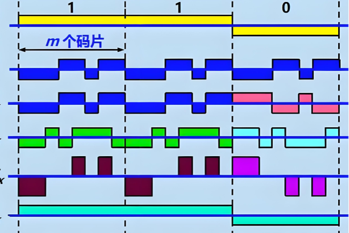

<!-- slide: 5 -->

## 3G主要应用：
移动网页浏览与社交媒体： 首次使在手机上流畅浏览网页、使用QQ、MSN等成为可能。
视频通话： 3G的标志性应用，如FaceTime的前身。
移动多媒体： 在线音乐、视频流媒体（如手机电视）。
智能手机应用生态萌芽： iPhone初代和Android的兴起。

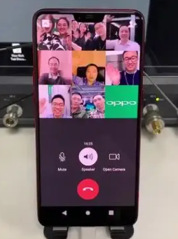

<!-- slide: 6 -->

## 4G：移动宽带时代
核心目标： 提供真正的高速、高容量、全IP的移动宽带体验。
核心技术：
     -- OFDMA（正交频分多址）与SC-FDMA： 取代了CDMA，是4G的物理层核心技术。它将信道分成大量窄带子载波，并行传输数据，极大提升了频谱效率，抗干扰能力强。
     -- 区分上行下行：下行用OFDMA，上行用SC-FDMA（后者功耗更低，利于终端省电）。
     -- MIMO（多输入多输出）技术： 大规模使用多根天线同时发送和接收多个数据流，成倍提升网络容量和速率。
     -- 扁平化的全IP网络架构（EPC）：网络结构极大简化，降低了延迟，提高了数据传输效率。
     -- 更高的频谱灵活性：支持从1.4MHz到20MHz的可变带宽。

<!-- slide: 7 -->

## OFDMA（正交频分多址）
OFDMA 是 正交频分多址，是一种 “聪明”的资源分配方式，同时为多个用户设备服务，极大提升网络效率和降低延迟。
OFDM是FDM的一种高效的、数字化的演进版本的频分复用。它们的核心区别在于“正交性”。
传统频分复用：就像一条宽阔的马路被划分成几条互不接触、中间有隔离带的车道。
正交频分复用：马路是精密设计的车道。只有目标车道上的信号被识别，相邻车道的信号互不干扰, 不需要隔离带。

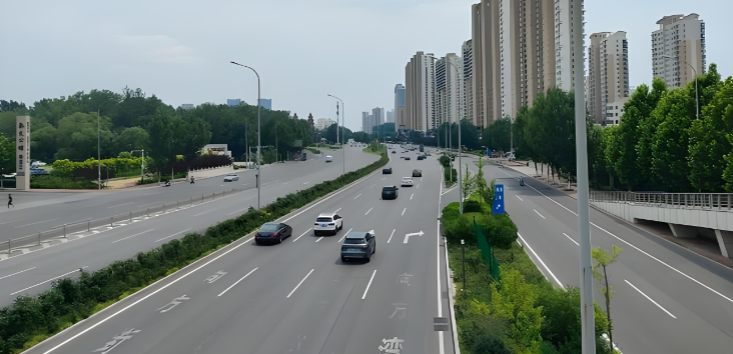
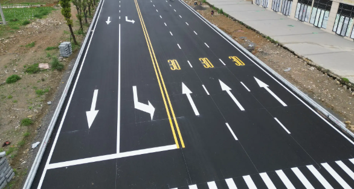

<!-- slide: 8 -->

## OFDMA（正交频分多址）
OFDM是FDM的一种高效的、数字化的演进版本的频分复用。它们的核心区别在于“正交性”。

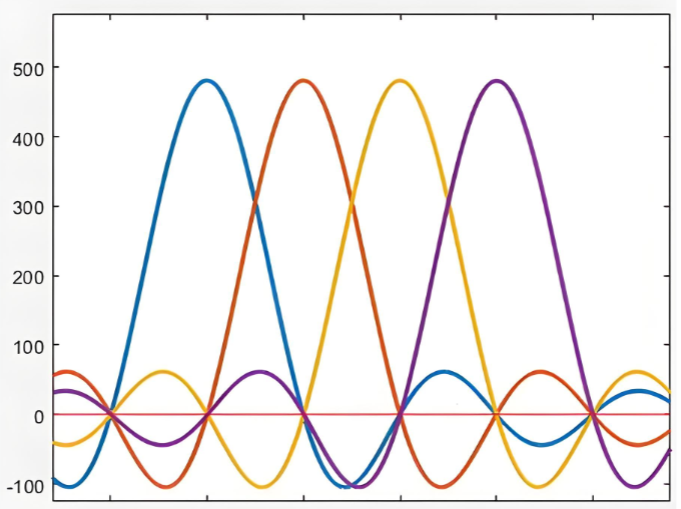
- 无码间串扰第一准则？

<!-- slide: 9 -->

## 扁平化的全IP网络架构：网络结构极大简化，降低了延迟，提高了数据传输效率。

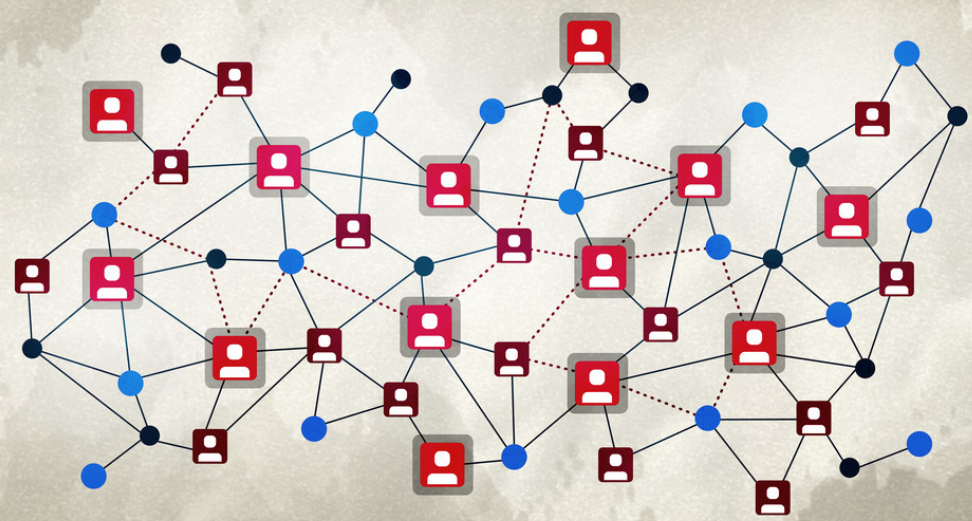
- 扁平化
- 全IP
- 全IP
- - 包容性
- - 统一性
- - 平等性
- - 抽象性
- 首  部
- 数  据  部  分

<!-- slide: 10 -->

## 4G的主要应用
高清移动视频与直播： 抖音、快手、YouTube等短视频直播。
移动支付与O2O服务： 微信支付、支付宝等依赖高速稳定的实时网络连接。
高性能移动在线游戏： 实现了多人在线手游的流畅体验。
共享经济： 网约车（滴滴/Uber）、共享单车实时定位。
云计算服务移动化： 文档、照片的实时云同步。

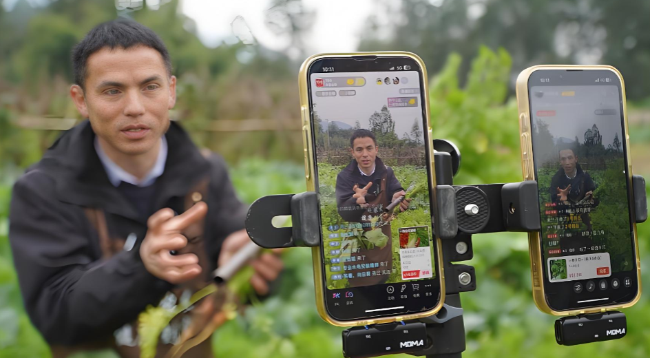

<!-- slide: 11 -->

- 5G：万物互联与数字化社会的基础设施
- 核心目标： 超越人与人通信，拓展到物与物、人与物的海量连接，支持关键任务型服务。
- 基本特征：
- a. 大连接 ：海量机器类通信
- b. 高可靠 ：超高可靠低时延通信
- c. 高带宽 ：增强移动宽带

<!-- slide: 12 -->

- 5G的核心技术
- 1. 革命性的无线空口
- -- 超大带宽与毫米波：利用此前未商用的高频段频谱（如24GHz以上毫米波），提供“高速公路”级别的带宽。
- -- 大规模MIMO：在基站部署成百上千根天线，形成精确的“能量探照灯”，极大提升使用效率。
- 2. 云化与软件化
- -- 服务化架构与云原生：传统网元分解为多个可独立开发、部署、升级的微服务软件，快速迭代和弹性伸缩。
- -- 网络切片：这是5G的“灵魂”技术。它基于上述的云化架构，建立多个功能与性能各异的专属网络。
- 3. 分布式边缘计算
- -- 边缘计算平台：将计算、存储和网络能力
- 从遥远的云下沉到网络边缘（如基站侧）。
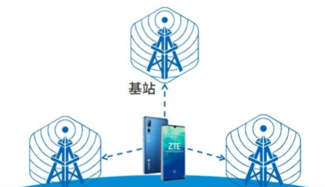
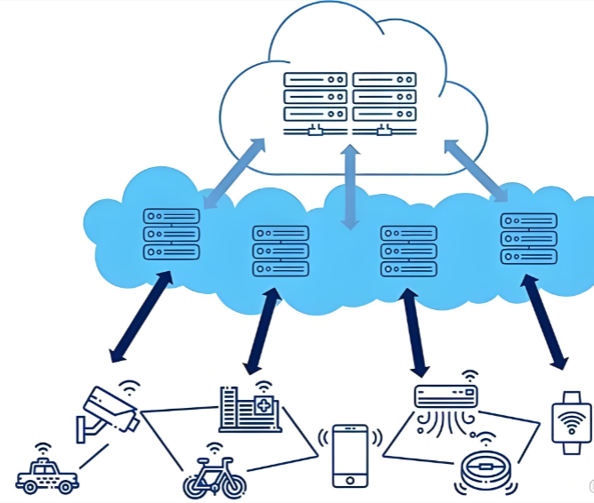

<!-- slide: 13 -->

## 1. 增强移动宽带（高速公路）
    -- 4K/8K超高清直播与视频：视频清晰到能看见演员的每一根睫毛。
    -- VR（虚拟现实）/AR（增强现实）：让你身临其境地玩游戏、看演唱会、或进行远程培训。
    -- 云游戏：游戏在远程服务器运行，你的手机或平板就像一台显示器，直接接收高清游戏画面，无需下载和高端显卡。

- 5G的主要应用

<!-- slide: 14 -->

## 2. 超高可靠低时延通信（特快专递）
    -- 自动驾驶与车联网：设备之间需要毫秒级标准。
    -- 远程手术：医生在千里之外操纵手术机器人，画面的延迟和指令的稳定性直接关乎生命。
    -- 工业自动化：工厂里的机械臂协同工作，或远程控制矿山里的挖掘机，指令必须即时且100%可靠。
    -- 智能电网：电网故障检测和隔离需要在百分之一秒内完成。

- 5G的主要应用
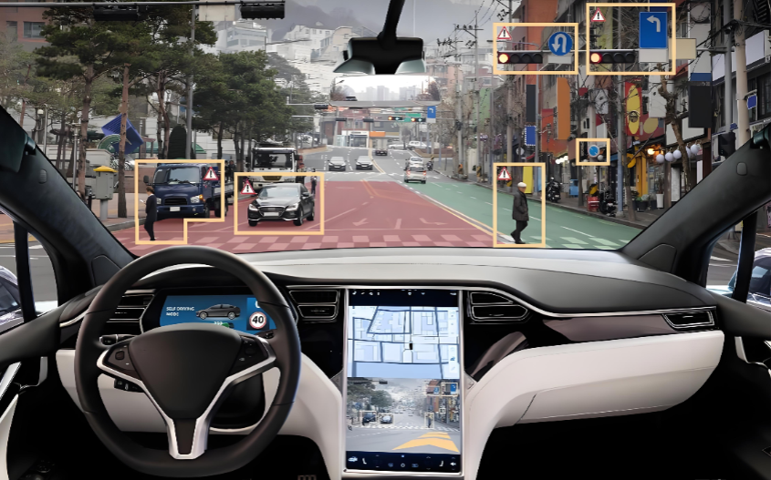

<!-- slide: 15 -->

## 3.海量设备通信（海量邮递）
    -- 智慧城市：连接数以万计的智能水表、电表、路灯、垃圾桶（监测水位、亮度、满载程度）。
    -- 环境监测：在山林、田野中部署大量传感器，监测温湿度、水质、空气质量。
    -- 资产追踪：跟踪集装箱、牛羊、共享单车的位置和状态。

- 5G的主要应用
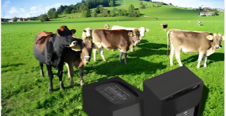
