# 软件工程-课程总结

<!-- page: 1 -->

软件工程 课程总结

• 华南理工大学  计算机科学与工程学院
• 苏锦钿 （17311126764）
• 2023年8月27日

1

<!-- page: 2 -->

1. 软件工程概述

• 1.什么是软件？是一系列按照特定顺序组织的计算机数据和指令的集

合，包括程序、数据和文档。

• 2.什么是软件危机，其内容主要是指什么？

• 3.什么是软件工程？PP.24

• 4.软件工程的目标（PP.41 ）及其组成部分。方法、工具和过程。

• 5.软件开发方法的定义。

• 6.好的软件的一些主要衡量指标。例如McCall 的质量模型。

2

<!-- page: 3 -->

2.什么是软件危机，其内容主要是指什么？

软件的发展速度远远滞后于硬件的发展速度，不能满足社会日益增长的软
件需求。软件开发周期长、成本高、质量差、维护困难。

3

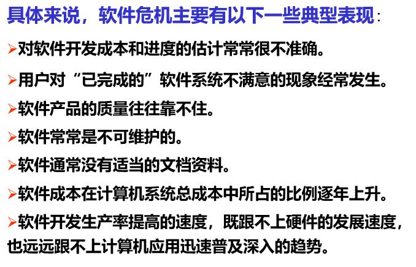

<!-- page: 4 -->

2.什么是软件危机，其内容主要是指什么？

4

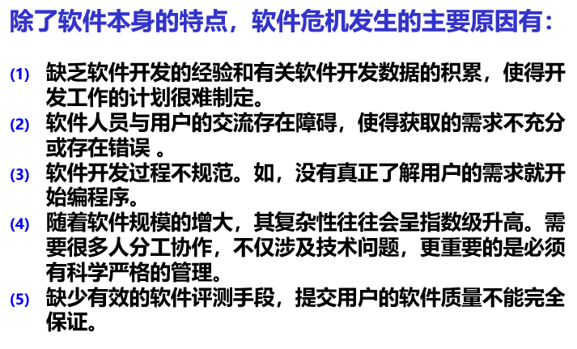

<!-- page: 5 -->

3.什么是软件工程？PP.24

5

<!-- page: 6 -->

4. 软件工程的目标

6

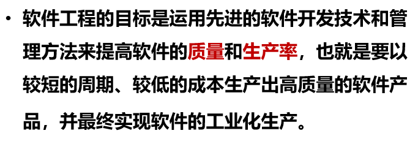

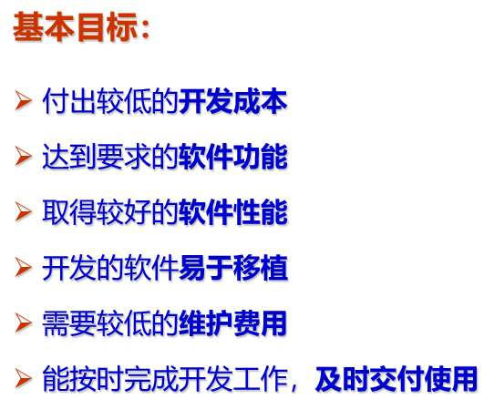

<!-- page: 7 -->

5.软件开发方法的定义。

软件开发方法是一种使用早已定义好的技术集及符号表
示习惯来组织软件生产的过程。一般有8类。
包括：结构化的方法 、 Jackson方法、 面向对象开发
方法、原型等等。

7

<!-- page: 8 -->

6.好的软件的一些主要衡量指标。例如McCall 的质量模型。

8

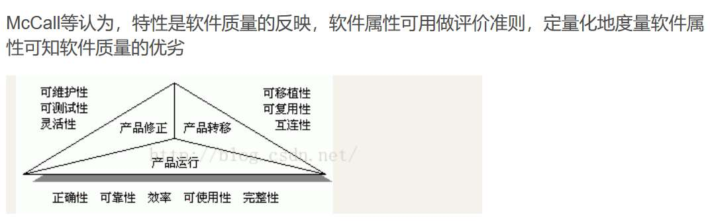

<!-- page: 9 -->

2. 过程和生命周期建模

• 1.什么是软件生命周期？主要分为哪些阶段？各个阶段的主要任务及

产生的主要制品？区分软件工程和软件过程。

• 2.可行性研究及需求分析的定义。

• 3.典型的软件开发过程模型的特点（优缺点、文档评审和里程碑等）

及要求，特别是原型法、瀑布模型、螺旋模型、增量和迭代等。

• 4. 原型法的特点以及分类：探索型原型、实验型原型和演化型。

• 5.敏捷开发方法和极限编程的特点，基本原则有哪些。

• 6. CMM/CMMI及其层次划分。

9

<!-- page: 10 -->

1.什么是软件生命周期？主要分为哪些阶段？各个阶段的主要任务及产生的主要制

品？区分软件工程和软件过程。

10

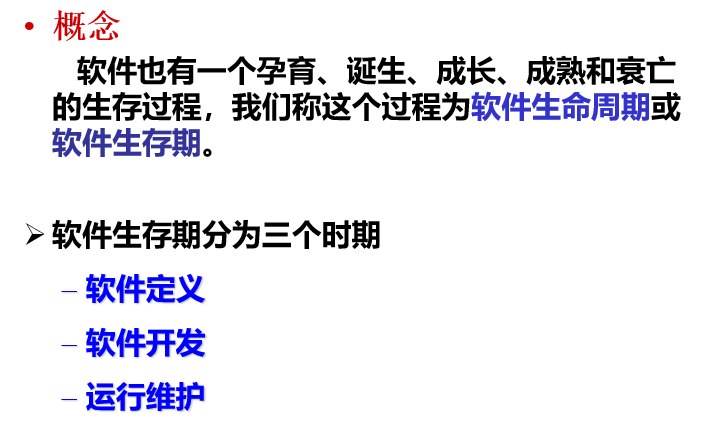

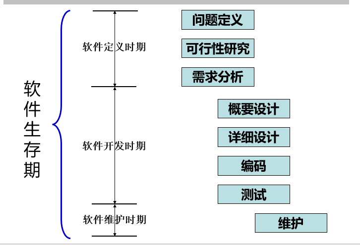

<!-- page: 11 -->

1.什么是软件生命周期？主要分为哪些阶段？各个阶段的主要任务及产生的主要制

品？区分软件工程和软件过程。

11

<!-- page: 12 -->

1.什么是软件生命周期？主要分为哪些阶段？各个阶段的主要任务及产生的主要制

品？区分软件工程和软件过程。

12

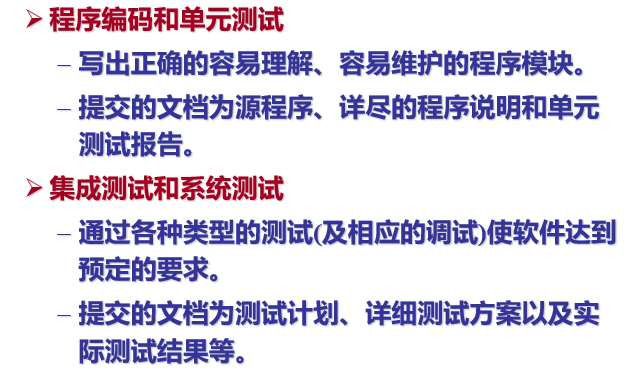

<!-- page: 13 -->

1.什么是软件生命周期？主要分为哪些阶段？各个阶段的主要任务及产生的主要制

品？区分软件工程和软件过程。

软件的诞生及其生命周期是一个过程，我们总体
上称这个过程为软件过程，是指在软件开发的整
个过程以及开发完成后的维护中的所有活动工作。

13

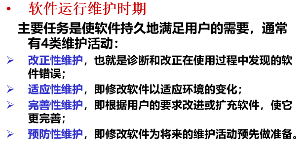

<!-- page: 14 -->

2.可行性研究及需求分析的定义。

14

<!-- page: 15 -->

3.典型的软件开发过程模型的特点（优缺点、文档评审和里程碑等）及要求，特别

是原型法、瀑布模型、螺旋模型、增量和迭代等。

瀑布模型

15

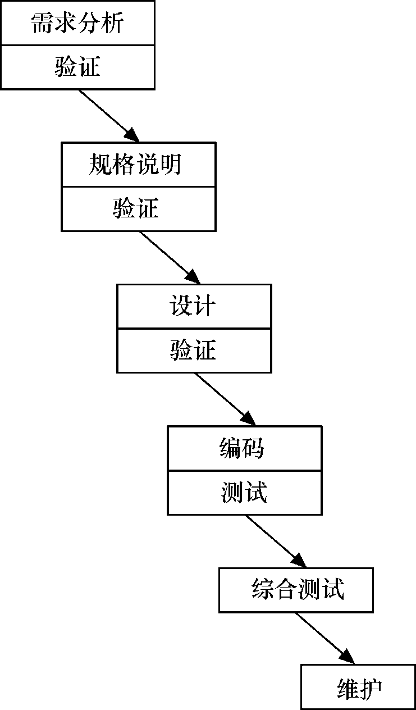

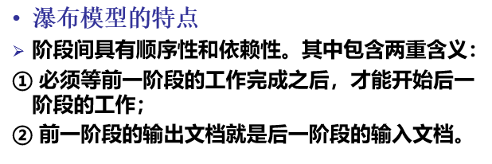

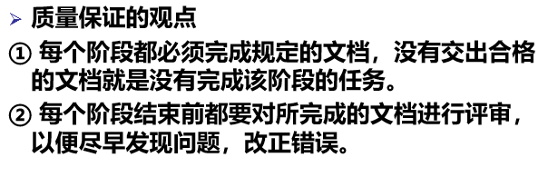

<!-- page: 16 -->

3.典型的软件开发过程模型的特点（优缺点、文档评审和里程碑等）及要求，特别

是原型法、瀑布模型、螺旋模型、增量和迭代等。

16

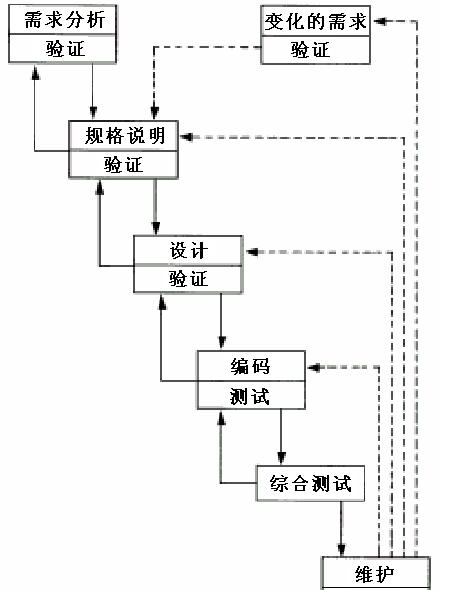

<!-- page: 17 -->

3.典型的软件开发过程模型的特点（优缺点、文档评审和里程碑等）及要求，特别

是原型法、瀑布模型、螺旋模型、增量和迭代等。

17

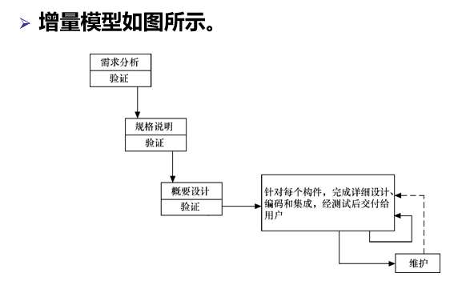

<!-- page: 18 -->

3.典型的软件开发过程模型的特点（优缺点、文档评审和里程碑等）及要求，特别

是原型法、瀑布模型、螺旋模型、增量和迭代等。

18

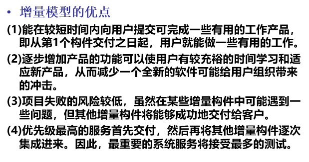

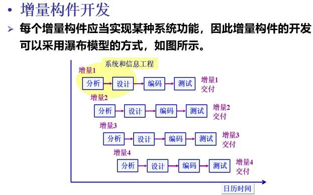

<!-- page: 19 -->

3.典型的软件开发过程模型的特点（优缺点、文档评审和里程碑等）及要求，特别

是原型法、瀑布模型、螺旋模型、增量和迭代等。

19

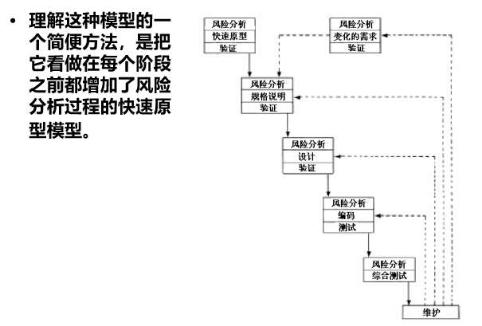

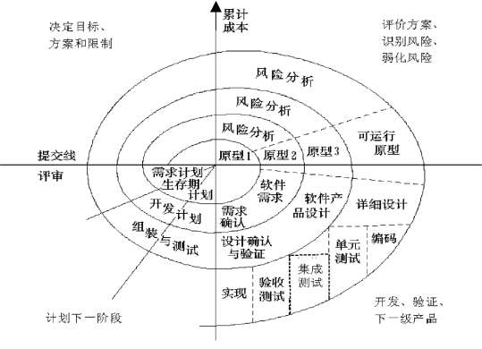

<!-- page: 20 -->

3.典型的软件开发过程模型的特点（优缺点、文档评审和里程碑等）及要求，特别

是原型法、瀑布模型、螺旋模型、增量和迭代等。

20

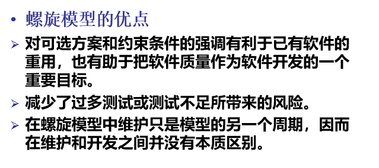

<!-- page: 21 -->

3.典型的软件开发过程模型的特点（优缺点、文档评审和里程碑等）及要求，特别

是原型法、瀑布模型、螺旋模型、增量和迭代等。

• 喷泉模型是典型的面向
对象生命周期模型。

➢“喷泉”一词体现了迭

代和无间隙特性。图中
代表不同阶段的圆圈相
互重叠，这明确表示两
个活动之间存在重叠。

21

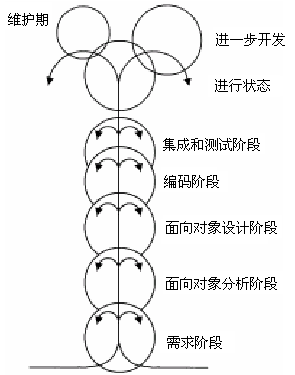

<!-- page: 22 -->

4. 原型法的特点以及分类：探索型原型、实验型原型和演化型。

根据使用原型的目的不同，原型可以分为探索型原型、
实验型原型和演化型原型3种。
探索型原型的目的是要弄清目标的要求，确定所希望
的特性，并探讨多种方案的可行性。
实验型原型的目的是验证方案或算法的合理性，是在
大规模开发和实现前，用于考查方案是否合适，规格
说明是否可靠等。
演化型原型的目的是将原型作为目标系统的一部分，
通过对原型的多次改进，逐步将原型演化成最终的目
标系统。

22

<!-- page: 23 -->

4. 原型法的特点以及分类：探索型原型、实验型原型和演化型。

➢快速原型是快速建立起来的可以在计算机
上运行的程序，它所能完成的功能往往是最
终产品能完成的功能的一个子集。

23

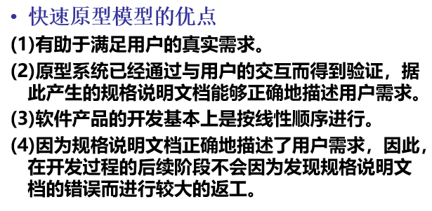

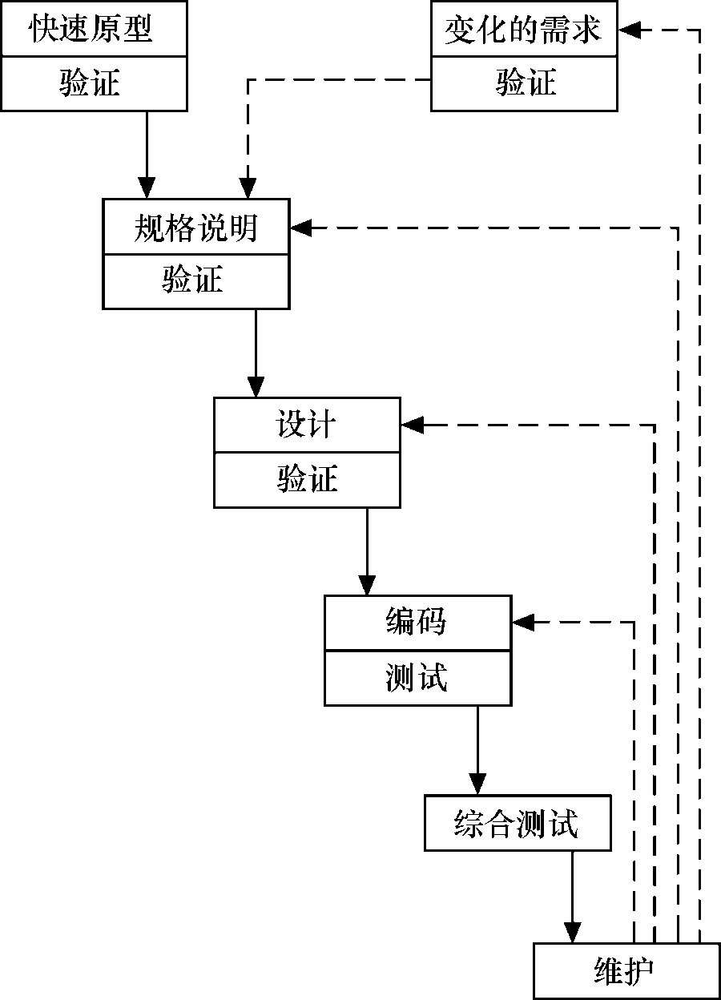

<!-- page: 24 -->

4. 原型法的特点以及分类：探索型原型、实验型原型和演化型。

24

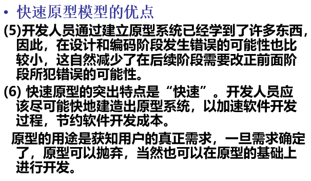

<!-- page: 25 -->

5.敏捷开发方法和极限编程的特点，基本原则有哪些。

25

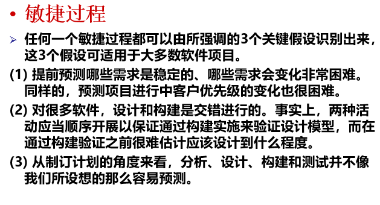

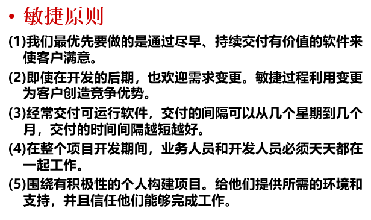

<!-- page: 26 -->

5.敏捷开发方法和极限编程的特点，基本原则有哪些。

26

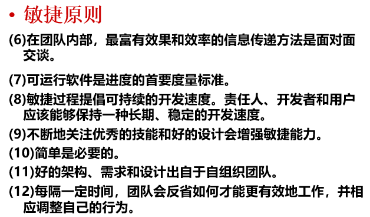

<!-- page: 27 -->

5.敏捷开发方法和极限编程的特点，基本原则有哪些。

27

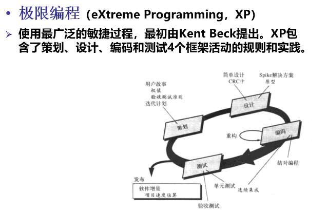

<!-- page: 28 -->

6. CMM/CMMI及其层次划分。

CMM指的是软件过程能力成熟度模型，按软
件过程的不同成熟度划分了5个等级，1级被
认为成熟度最低，5级成熟度最高

SEI在SW-CMM2.0版本形成过程中，转为了一
个新项目，CMMI，目标是集成已有的CMM
模型，实现一个组织的集成化过程和改进

28

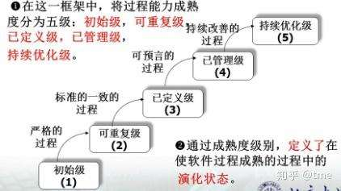

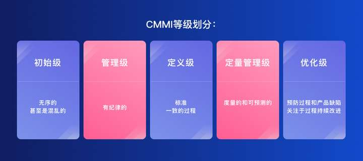

<!-- page: 29 -->

3. 需求分析

• 1.了解需求的重要性及需求分析阶段的目标及主要产物。

• 2. 需求工程包括哪些方面？

• 3.需求的类型：功能需求、非功能需求或质量需求、设计约束、过程

约束。

• 4. 两种需求文档：需求定义文档和需求规格说明书。

• 5. 需求规格说明书的主要内容。

• 6. 常用的需求建模表示方法：ER图、事件跟踪、状态机、Petri网、数

据流图、PERT图、用例图和原型法。

• 7. 程序流图的主要内容（包括环路复杂度、独立路径等）。

29

<!-- page: 30 -->

1.了解需求的重要性及需求分析阶段的目标及主要产物。

需求分析阶段：研究需求的完整性、正确性、合
理性、可行性和充分性

需求分析产物：
需求规格说明书、用例图（powerDesigner OOM）、业
务流程图（powerDesigner OOM）

30

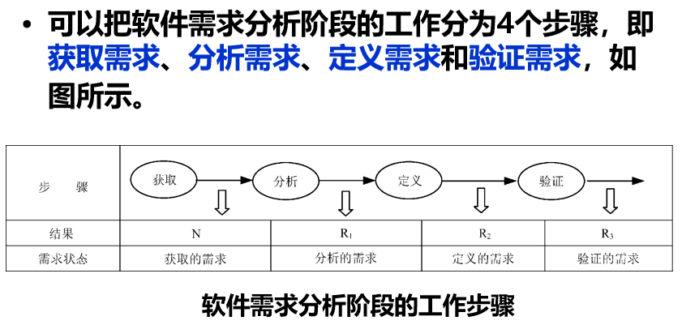

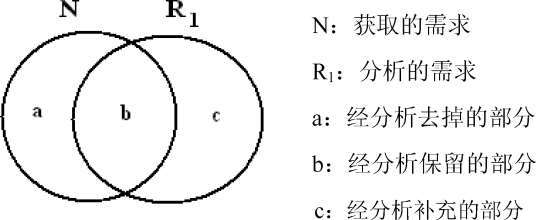

<!-- page: 31 -->

2. 需求工程包括哪些方面？

•1. 需求获取：通过与用户的交流，对现有系统的观察及对任务进行分析，从而开
发、捕获和修订用户的需求；

•2. 需求建模：为最终用户所看到的系统建立一个概念模型，作为对需求的抽象描
述，并尽可能多的捕获现实世界的语义；

•3. 形成需求规格：生成需求模型构件的精确的形式化的描述，作为用户和开发者
之间的一个协约；

•4. 需求验证：以需求规格说明为输入，通过符号执行、模拟或快速原型等途径，
分析需求规格的正确性和可行性，包含有效性检查，一致性检查，可行性检查和
确认可验证性；

31

•5. 需求管理 ：支持系统的需求演进，如需求变化和可跟踪性问题。

<!-- page: 32 -->

3.需求的类型：功能需求、非功能需求或质量需求、设计

约束、过程约束。

32

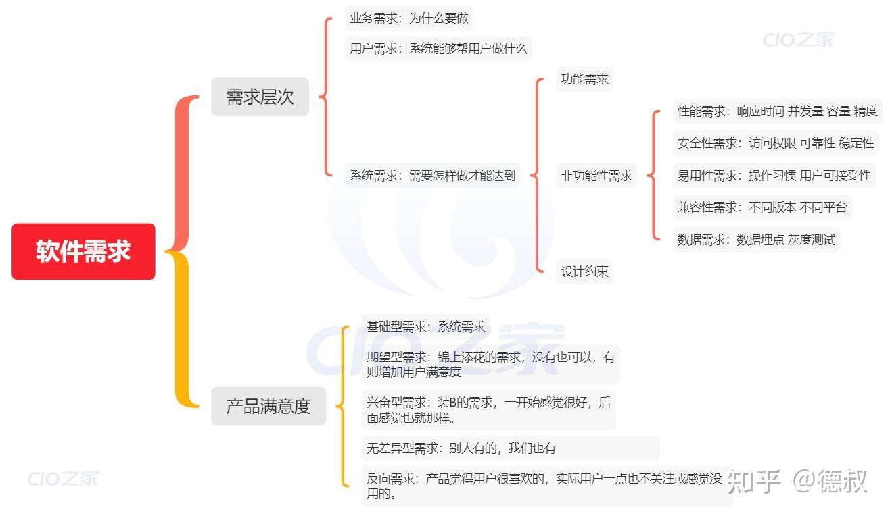

<!-- page: 33 -->

5. 需求规格说明书的主要内容。

33

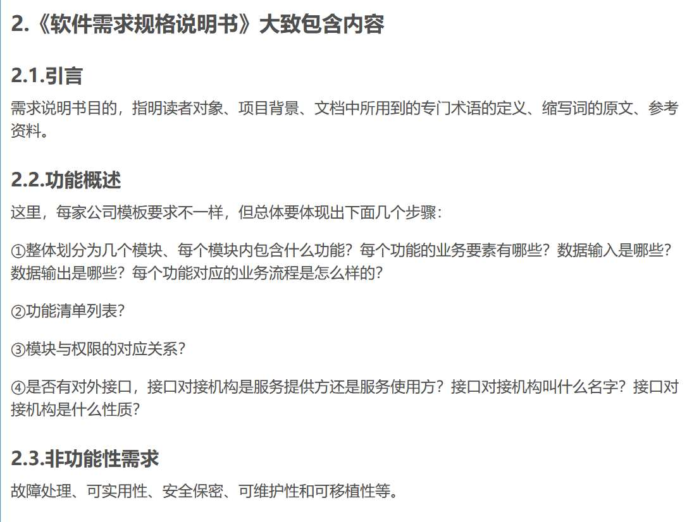

<!-- page: 34 -->

7. 程序流图的主要内容（包括环路复杂度、独立路径等） 。

34

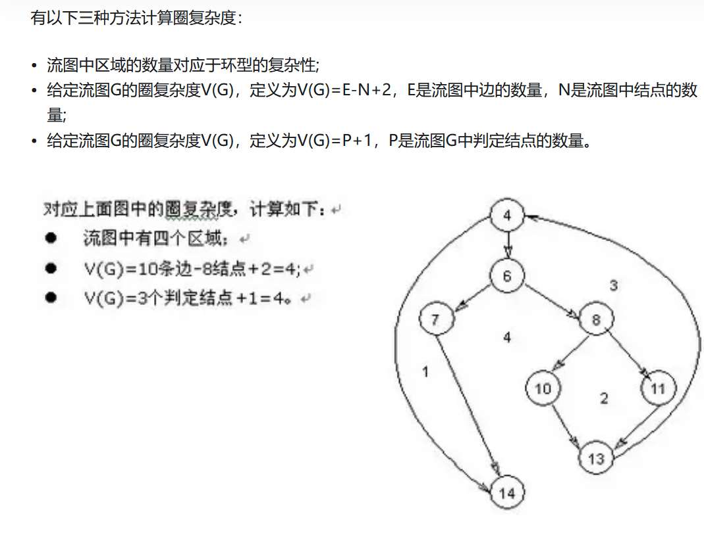

<!-- page: 35 -->

7. 程序流图的主要内容（包括环路复杂度、独立路径等） 。

独立路径：至少沿一条新的边移动的路径。对所有独立路径的遍历使得程序
中的所有语句至少被执行一次。

35

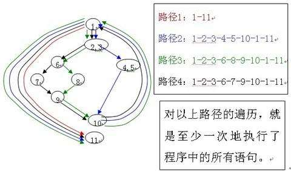

<!-- page: 36 -->

4. UML图形

• （1）UML的作用：是为软件系统的制品进行描述（specifying）、可视

化（visualizing）、构造（constructing）、文档化（documenting）的一

种语言。

• （2）UML中的4＋1视图：用例视图，设计视图，进程视图，实现视图，

分布视图。

• （3）UML中所包含的9种图形及各自的作用。

• （4）用例图的作用。

• （5）用例图的主要构成部分。

36

<!-- page: 37 -->

（3）UML中所包含的9种图形及各自的作用。

37

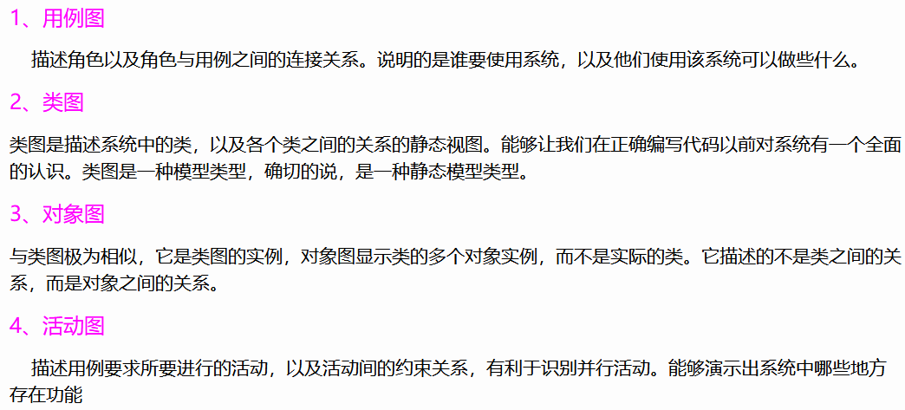

<!-- page: 38 -->

（3）UML中所包含的9种图形及各自的作用。

38

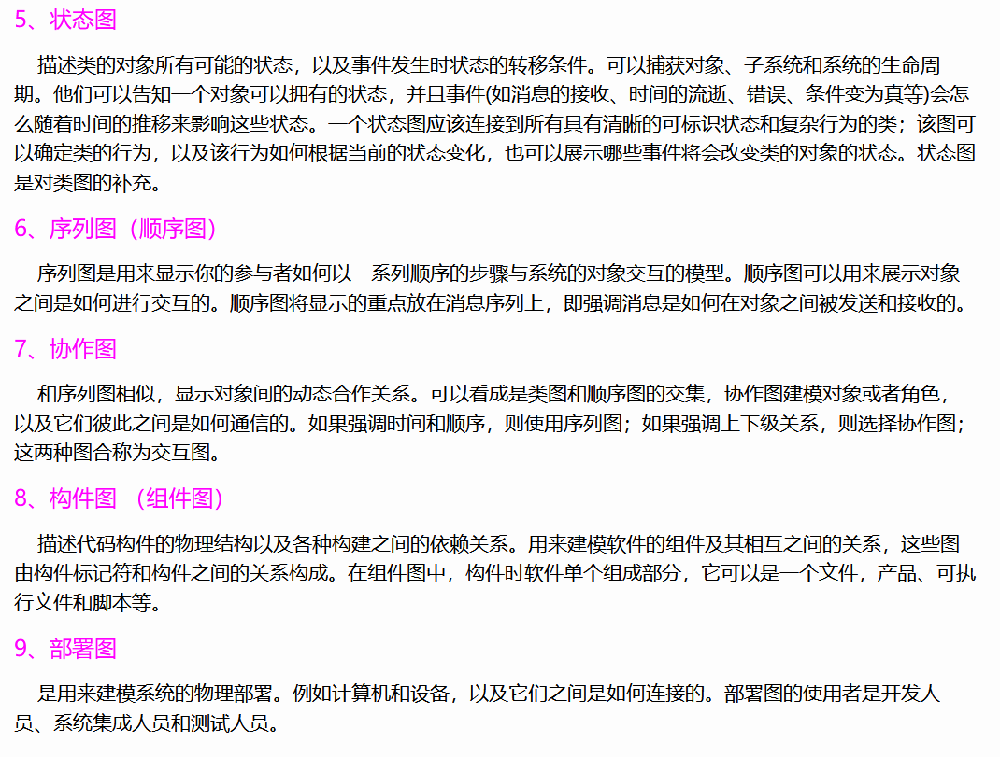

<!-- page: 39 -->

（4）用例图的作用。

39

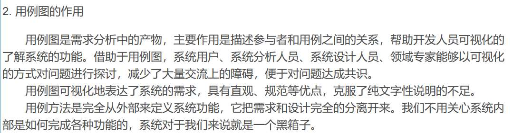

<!-- page: 40 -->

5.用例图的主要构成部分。

参与者、用例、关系

40

<!-- page: 41 -->

4. UML图形

• 1. 类图的主要作用。

• 2.了解类之间的各种关系：关联、依赖、继承或泛化、组合/聚合等。

• 3.了解类图的基本建模步骤。

• 4. 接口和抽象类的定义及各自的特点。

• 5.交互图的分类：顺序图和协作图。这两种图形各自的优缺点。注意UML 2.0

中协作图改称通信图。

• 6. 状态图和活动图各自的作用。注意活动图中泳道的作用。

• 7.组件图的作用以及组件与接口间的关系。

• 8. 部署图的作用以及节点的分类。

41

<!-- page: 42 -->

1. 类图的主要作用。

42

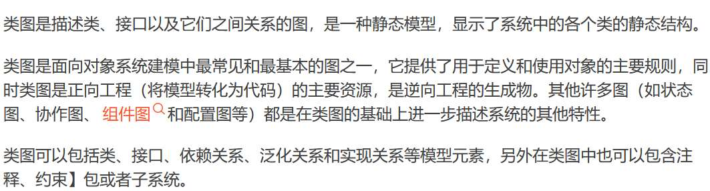

<!-- page: 43 -->

5.交互图的分类：顺序图和协作图。这两种图形各自的优缺点。注意UML

2.0中协作图改称通信图。

43

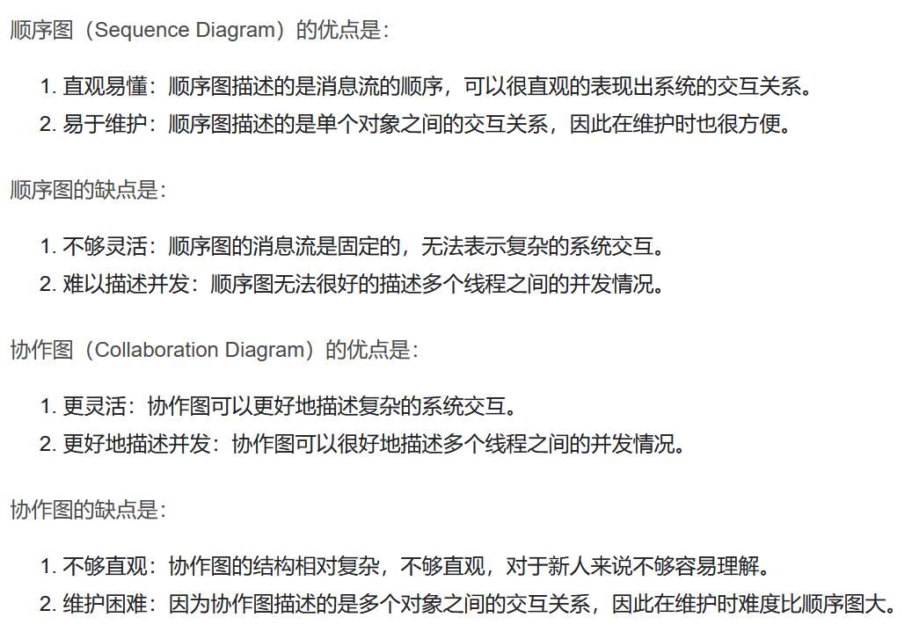

<!-- page: 44 -->

6. 状态图和活动图各自的作用。注意活动图中泳道的作用。

44

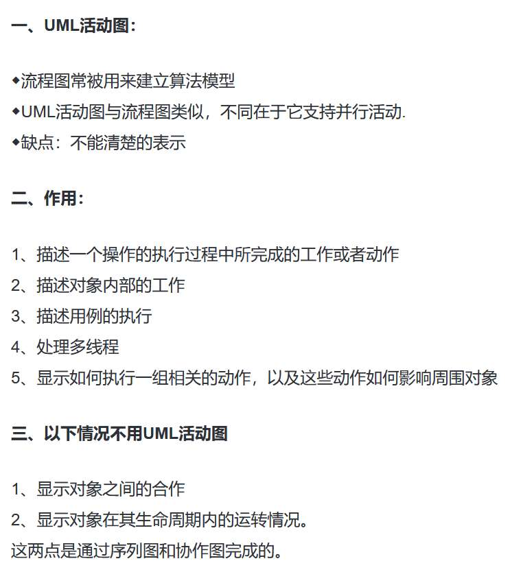

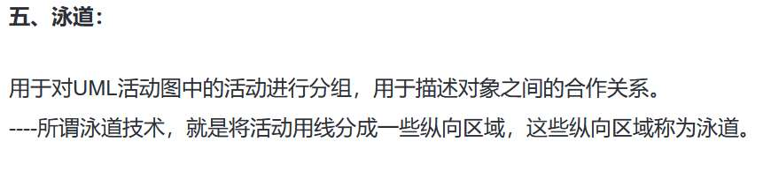

<!-- page: 45 -->

45

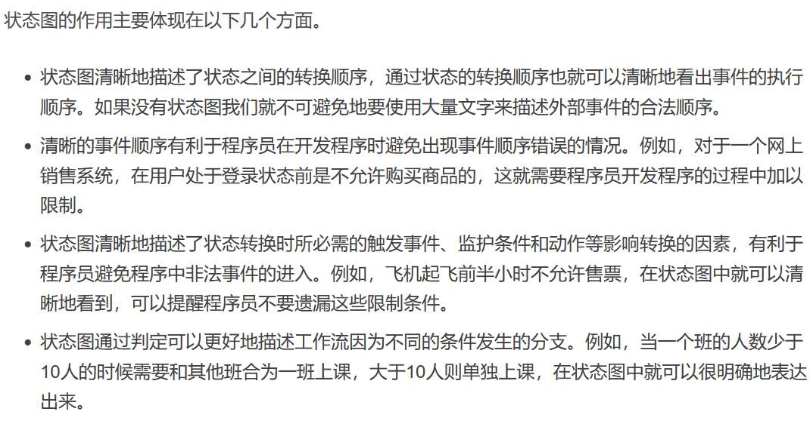

<!-- page: 46 -->

7.组件图的作用以及组件与接口间的关系。

组件图通过接口、端口的方式来表达组件间的连接，很形象的表达出组件是可被
替换的概念，一个组件可以被另一个提供了相同接口的组件替换。 因此，当我们
通过组件进行建模时，能够设计出一个扩展性良好的系统。

46

<!-- page: 47 -->

8. 部署图的作用以及节点的分类。

•处理器节点（Processor）：处理器是能够执行软件、具有计算能力的节点。
•设备节点（Device）：设备是没有计算能力的节点，通常情况下都是通过其接口为
外部提供某种服务，例如打印机、IC读写器，如果我们的系统不考虑它们内部的芯片，
就可以把它们看作设备。

部署图是用来显示系统中软件和硬件的物理架构。从部署图中，可以
了解到软件和硬件组件之间的物理关系以及处理节点的组件分布情况。
使用部署图可以显示运行时系统的结构，同时还传达构成应用程序的
硬件和软件元素的配置和部署方式。

47

<!-- page: 48 -->

5. 系统设计

• 1.系统设计的两个阶段划分。概要设计和详细设计

• 2. 概要设计的主要任务及输出物。

• 3. 详细设计的主要任务及输出物。

• 4. 好的设计的衡量：内聚和耦合。

• 5. 常用的内聚和耦合度类型。

• 6. 软件体系结构或架构设计的含义及作用。

48

<!-- page: 49 -->

2. 概要设计的主要任务及输出物。

概要设计 的 输出 是模块层次图（模
块划 分），IPO图（功能划分），数
据流程图。 详细设计 的 输出 是数据
库 设计 说明书，界面 设计 和程序伪
码。

49

<!-- page: 50 -->

3. 详细设计的主要任务及输出物。

详细设计 的 输出 是数据库 设计 说
明书，界面 设计 和程序伪码。

50

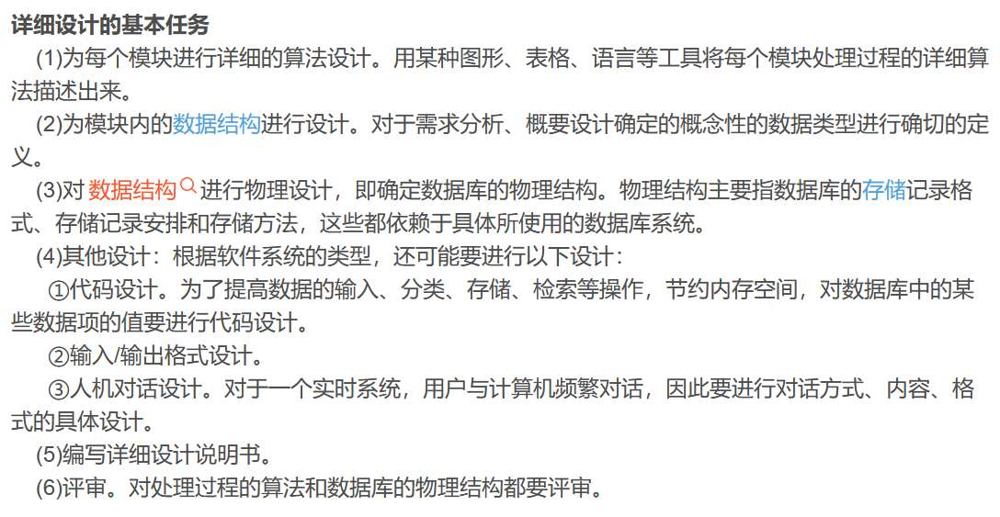

<!-- page: 51 -->

4. 好的设计的衡量：内聚和耦合。

51

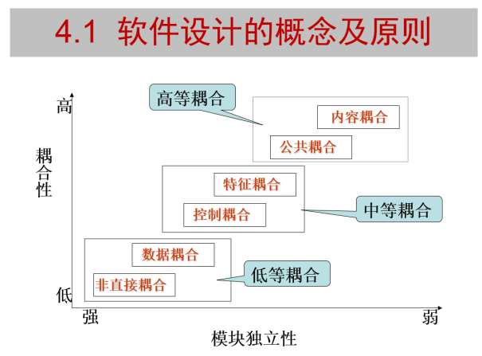

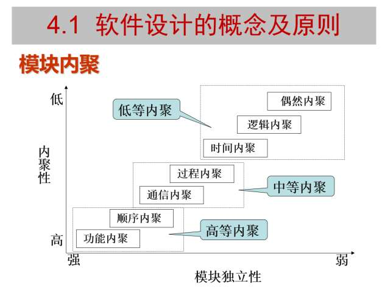

<!-- page: 52 -->

6. 软件体系结构或架构设计的含义及作用。

Bass、Clements、Kazman：“一个程序或计算机
系统的软件体系结构是指系统的一个或者多个结构。结构中
包括软件的构件、构件的外部可见属性以及它们之间的相互
关系。外部可见属性则是指软件构件提供的服务、性能、使
用特性、错误处理、共享资源使用等。”

Dewayne Perry和A1exander Wo1f曾这样定义：“软件
体系结构是具有一定形式的结构化元素，即构件的集合，包
括处理构件、数据构件和连接构件。处理构件负责对数据进
行加工，数据构件是被加工的信息，连接构件把体系结构的
不同部分组合连接起来。”

52

<!-- page: 53 -->

6. 软件体系结构或架构设计的含义及作用。

体系结构的重要作用体现在以下三个方面 ：

（1）体系结构的表示有助于风险承担者（项目干系

         人）进行交流。

（2）体系结构突出了早期设计决策。

（3）软件体系结构是可传递和可复用的模型。

53

<!-- page: 54 -->

6. 系统测试

• 1. 测试的目标和衡量标准。

• 2. 测试的分类（或组织）。各种类型的测试的主要任务及所依赖的文档。

• 3. 黑盒测试和白盒测试的思想，了解白盒测试中的基本路径测试等方法。

• 4. 单元测试的主要内容。什么是冒烟测试。如何划分等价类。

• 5. 集成测试的类型及主要的测试策略。

• 6. 确认测试的内容。

• 7. 了解测试计划的主要内容。

• 8. 测试系统中的测试过程：功能测试、性能测试、验收（或确认）测试、

安装测试，和测试，及它们的内容。

54

<!-- page: 55 -->

55

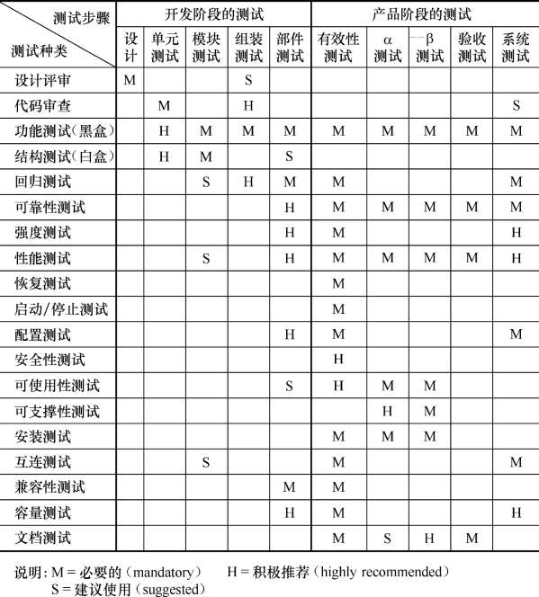

<!-- page: 56 -->

1. 测试的目标和衡量标准。

• 软件测试的目的和原则
   基于不同的立场，存在着两种完全不同的测试目

的。

➢从用户的角度出发，普遍希望通过软件测试检验

软件中隐藏的错误和缺陷，以考虑是否可以接受
该产品。

➢从软件开发者的角度出发，则希望测试成为表明

软件产品中不存在错误的过程，验证该软件已正
确地实现了用户的要求，确立人们对软件质量的
信心。

56

<!-- page: 57 -->

（5）充分注意测试中的群集现象。

1. 测试的目标和衡量标准。
根据以上测试目的，软件测试的原则

把Pareto原理应用于软件测试。

如下：
（1）应当把“尽早地和不断地进行软

  Pareto原理：测试发现的错误中

的80%很可能是由程序中20%的
模块造成的。

件测试”作
    为软件开发者的座右铭。
（2）测试用例应由测试输入数据和与

（6）严格执行测试计划，排除测

试的随意性。

之对应的预
    期输出结果这两部分组成。

（7）应当对每一个测试结果作全

（3）程序员应避免检查自己的程序。

面检查。

（8）妥善保存测试计划、测试用

（4）在设计测试用例时，应当包括合

例、出错统计和

理的输入条

    件和不合理的输入条件。

    最终分析报告，为维护提供方便。

57

<!-- page: 58 -->

1. 测试的目标和衡量标准。

58

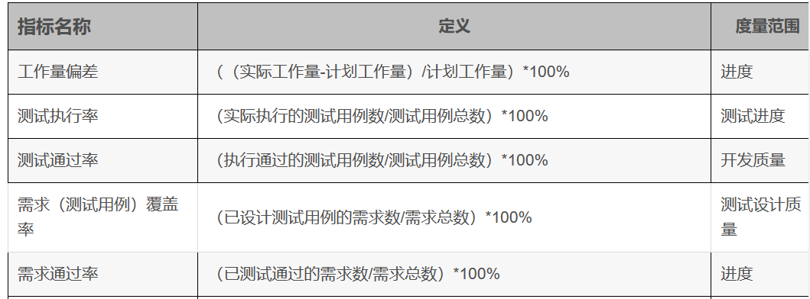

<!-- page: 59 -->

2. 测试的分类（或组织）。各种类型的测试的主要任务及

所依赖的文档。

机器测试、人工测试

59

<!-- page: 60 -->

2. 测试的分类（或组织）。各种类型的测试的主要任务及

所依赖的文档。

60

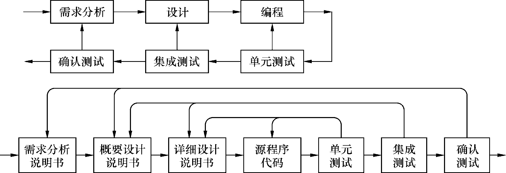

<!-- page: 61 -->

3. 黑盒测试和白盒测试的思想，了解白盒测试中的基本路

径测试等方法。
• 黑盒测试
  黑盒测试是把测试对象看做

2. 白盒测试

➢
白盒测试是对软件的过程性细节做细致
的检查。

一个黑盒子，测试人员完全
不考虑程序内部的逻辑结构
和内部特性，只依据程序的
需求规格说明书，检查程序
的功能是否符合它的功能说
明。

➢
这一方法是把测试对象看做一个打开的
盒子或透明的盒子，它允许测试人员利
用程序内部的逻辑结构及有关信息，设
计或选择测试用例，对程序所有逻辑路
径进行测试。

➢
通过在不同点检查程序的状态，确定实
际的状态是否与预期的状态一致。

➢
因此，白盒测试又称为结构测试或逻辑
驱动测试。

61

<!-- page: 62 -->

3. 黑盒测试和白盒测试的思想，了解白盒测试中的基本路

径测试等方法。

62

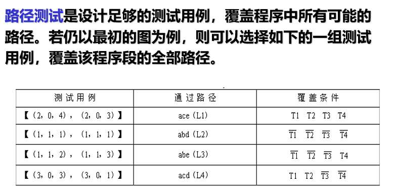


<!-- page: 63 -->

3. 黑盒测试和白盒测试的思想，了解白盒测试中的基本路

径测试等方法。
⚫基本路径测试是在程序控制流图的基础上，通过

分析控制构造的环路复杂性，导出基本可执行路

    径集合，从而设计测试用例的方法。

⚫设计出的测试用例要保证在测试中程序的每一个

可执行语句至少执行一次。

63

<!-- page: 64 -->

4. 单元测试的主要内容。什么是冒烟测试。如何划分等价类。

单元测试主要采用白盒测试，辅之以黑盒测试，总共包含5种测试：模块接口测试、
局部数据结构测试、路径测试、错误处理测试、边界测试

冒烟测试（Smoke Testing） 是软件测试中的一项基础测试，也称为构建验证测试
（Build Verification Testing），通常用于确认新版本的软件是否可以进行基本的功能
测试或者是否能够正常启动。它的主要目的是在软件发布前快速验证系统的关键功
能能否正常运作。

64

<!-- page: 65 -->

4. 单元测试的主要内容。什么是冒烟测试。如何划分等价类。

65


<!-- page: 66 -->

5. 集成测试的类型及主要的测试策略。

组装测试（integrated testing）也叫做集成测试或联合测试。通常，在单元测试的基
础上，需要将所有模块按照设计要求组装成为系统，把模块组装为系统的方式有两
种：一次性组装方式（big bang）和增值式组装方式。 下图左边是一次性组装，右边
是增值式组装的自顶向下方式，此外增值式组装还包括自底向上、混合增值式测试。

66


<!-- page: 67 -->

6. 确认测试的内容。

确认测试（validation testing）又称有效性测试。它的任
务是验证软件的有效性，即验证软件的功能和性能及其他特
性是否与用户的要求一致。在确认测试阶段需要做的工作如
下图所示。

67


<!-- page: 68 -->

7. 了解测试计划的主要内容。

测试计划（Testing plan）的定义：
描述了要进行的测试活动的范围、方法、资源和进度的文档；
是对整个信息系统应用软件组装测试和确认测试。
它确定测试项、被测特性、测试任务、谁执行任务、各种可能的风险。
测试计划可以有效预防计划的风险，保障计划的顺利实施。

主要包括以下内容：
① 项目简介；
② 参考文档；
③ 测试范围；
④ 时间进度安排；
⑤ 资源；
⑥ 风险评估；
⑦ 测试交付件。

68

<!-- page: 69 -->

8. 测试系统中的测试过程：功能测试、性能测试、验收（或确认）

测试、安装测试，α和β测试，及它们的内容。

功能测试（function testing）：功能测试是在规定的一段时间内运行软件系统的所有
功能，以验证这个软件系统有无严重错误。

性能测试（performance testing）：是要检查系统是否满足在需求说明书中规定的性
能。特别是对于实时系统或嵌入式系统，软件只满足要求的功能而达不到要求的性能
是不可接受的，所以还需要进行性能测试。

安装测试（installation testing）：安装测试的目的不是查找软件错误，而是查找安装
错误。在安装软件系统时，会有多种选择。要分配和装入文件与程序库，布置适用的
硬件配置，进行程序的连接。而安装测试是要查找出在这些安装过程中出现的错误。

69

<!-- page: 70 -->

7. 系统维护

• 1. 维护活动的类型：改正性、适应性、完善性、预防性。

• 2. 各种维护活动的主要内容和目标。

改正性：纠正错误和缺陷，包括未测试的情况；

适应性：时代发展导致软件外部环境比如OS和db发生变化，因此要维

护软件使其适应变化；

完善性：满足新的功能和性能要求，修改扩充软件功能；

预防性：用先进的SE方法重新设计编码测试软件某部分。

• 3. 软件再生：文档重构、重组、逆向工程、再工程，以及它们各自

的内容和含义。

70

<!-- page: 71 -->

8. 面向对象设计原则

• 主要的面向对象设计原则及各自的原理：

OCP, LSP, DIP, ISP, CARP, LoD.

了解典型的设计模式：工厂模式、策略模式、适配器模式、观察

者模式、黑板模式等。

71

<!-- page: 72 -->

OCP：The Open-Closed Principle 开闭原则

72


<!-- page: 73 -->

LSP：Liskov Substitution Principle 里氏替换原则

73


<!-- page: 74 -->

DIP：Dependency Inversion Principle 依赖倒置原则

A. 高层模块不应该依赖于低层模块，二者都应该依赖于抽象
B. 抽象不应该依赖于细节，细节应该依赖于抽象
C.针对接口编程，不要针对实现编程。

74


<!-- page: 75 -->

ISP：Interface Segregation Principle 接口分隔原则

75

<!-- page: 76 -->

CARP：Composite/Aggregate Reuse Principle 组合/聚
合复用原则

76


<!-- page: 77 -->

CARP：Composite/Aggregate Reuse Principle 组合/聚
合复用原则

77


<!-- page: 78 -->

LoD：Law of Demeter 迪米特原则（最少知道原则）

78


<!-- page: 79 -->

工厂模式

工厂模式（Factory Pattern）是 Java 中
最常用的设计模式之一。这种类型的
设计模式属于创建型模式，它提供了
一种创建对象的最佳方式。
工厂模式提供了一种将对象的实例化
过程封装在工厂类中的方式。通过使
用工厂模式，可以将对象的创建与使
用代码分离，提供一种统一的接口来
创建不同类型的对象。
在工厂模式中，我们在创建对象时不
会对客户端暴露创建逻辑，并且是通
过使用一个共同的接口来指向新创建
的对象。

79


<!-- page: 80 -->

策略模式

80


<!-- page: 81 -->

适配器模式

81


<!-- page: 82 -->

82


<!-- page: 83 -->

观察者模式

83


<!-- page: 84 -->

黑板模式

84


<!-- page: 85 -->

黑板模式

85


<!-- page: 86 -->

9. 其他

• 1. 白盒测试主要包括哪几种？各自的测试内容是什么？

• 2.软件项目管理中用于估计工作量的指标主要包括哪些？

• 3. 判定表、数据字典、IPO图、PDL、DFD图、甘特图等常用的图形

的主要作用是什么？哪些经常在结构化方法中使用？

• 4. 软件过程、软件生命周期、软件工程、瀑布模型、原型法、里程

碑等基本概念。

• 5. 常用的质量保障措施和方法有哪些？

86

<!-- page: 87 -->

1. 白盒测试主要包括哪几种？各自的测试内容是什么？

87


<!-- page: 88 -->

1. 白盒测试主要包括哪几种？各自的测试内容是什么？

88


<!-- page: 89 -->

1. 白盒测试主要包括哪几种？各自的测试内容是什么？

89

<!-- page: 90 -->

1. 白盒测试主要包括哪几种？各自的测试内容是什么？

90


<!-- page: 91 -->

1. 白盒测试主要包括哪几种？各自的测试内容是什么？

91


<!-- page: 92 -->

1. 白盒测试主要包括哪几种？各自的测试内容是什么？

92


<!-- page: 93 -->

2.软件项目管理中用于估计工作量的指标主要包括哪些？

93


