# 10.活动图

<!-- slide: 1 -->

## 软件需求分析与建模-活动图

- <number>

<!-- slide: 2 -->

## 本章需要掌握的知识点

- 华 南 理 工 大 学
- 软 件 需 求 分 析 与 建 模
- <number>
- （1）掌握活动图的作用，以及活动图与状态图之间的区别。
- （2）活动图的构成及其特点。掌握活动图的画法和步骤。
- （3）活动图中泳道的作用。
- （4）UML2.0中的活动及交互纵览图。

<!-- slide: 3 -->

## I  引  言

- 华 南 理 工 大 学
- 软 件 需 求 分 析 与 建 模
- <number>
- 状态机是UML为软件对象的动态行为进行建模的手段之一。
  - 它描述
    - 软件对象在处理外部发生的事件时产生的动作
    - 和由此导致的软件对象的状态的变化，
    - 并以此刻画软件对象的动态行为。
- 软件对象的动作
  - 被附加在状态机的变迁或状态上，
- 如果被建模的对象是反应型对象，那么
  - 此对象的动作的执行是由对象外部发生的事件触发的。
- 对反应型对象的这种动态行为的建模，在UML里，
  - 是用状态机图来表达的。

<!-- slide: 4 -->

- 华 南 理 工 大 学
- 软 件 需 求 分 析 与 建 模
- <number>
- 软件对象的动态行为并不都是事件驱动的。例如，
  - 在使用特定的对象来实现特定的复杂算法时，
  - 此算法的动态行为
    - 既不是由多个对象的协同配合完成的，
    - 也不是由外部事件来驱动的。
- 这类对象被称为是：非反应型对象
- 当非反应型对象的动态行为被执行时，
  - 动态行为的一系列的动作按照特定的控制逻辑（算法）顺序执行。

<!-- slide: 5 -->

## 活动图概述/1

- 华 南 理 工 大 学
- 软 件 需 求 分 析 与 建 模
- <number>
- 活动图是一种特殊形式的状态机，用于对计算流程和工作流程建模.
- 活动图中的状态表示计算过程中所处的各种状态，而不是普通对象的状态
- 通常，活动图假定在整个计算处理过程中没有外部事件引起的中断.否则，普通的状态机更适于描述这种情况

<!-- slide: 6 -->

## 活动图概述/2

- 华 南 理 工 大 学
- 软 件 需 求 分 析 与 建 模
- <number>
- 与交互图相比
  - 活动图着重表现活动的控制流，描述在对象之间传递的操作
  - 交互图着重表现的是对象到对象的控制流，描述在对象之间传递的消息

<!-- slide: 7 -->

- 华 南 理 工 大 学
- 软 件 需 求 分 析 与 建 模
- <number>
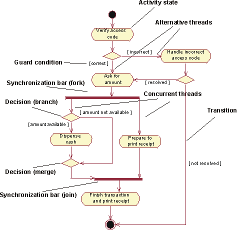

<!-- slide: 8 -->

## 活动图与程序流程图的差别

- 华 南 理 工 大 学
- 软 件 需 求 分 析 与 建 模
- <number>
- 传统的程序流程图描述的是处理的过程，主要控制结构有顺序、分支和循环，各个处理之间有严格的顺序和时间关系
- 活动图描述的是对象（或模型元素）的活动的顺序关系所遵循的规则，它着重表现的是系统的行为，而不是系统的处理过程，在活动图中也没有通常的循环控制结构。活动图能够表现并发情形。
- T
- P
- S
- F
- A
- B

<!-- slide: 9 -->

## 活动图

- 华 南 理 工 大 学
- 软 件 需 求 分 析 与 建 模
- <number>
- 在UML里, 用来为非反应型对象建模的状态机被称为活动图(activity graph)。
- 从右边可以看出，
  - 活动状态机的动作是自动执行的
  - 状态机内不存在对外部事件的描述
  - 控制在动作之间的转换不由事件触发，而是由完成变迁自动触发。

<!-- slide: 10 -->

- 华 南 理 工 大 学
- 软 件 需 求 分 析 与 建 模
- <number>
- 这也是活动图和状态机图的不同之处，
  - 状态机图强调的是在外部事件的驱动下，
    - 软件对象的控制在不同的状态之间的流动；
  - 而活动图强调的是在完成变迁引导下，
    - 对象的控制在活动之间的流动。
- 活动状态迁移不需要事件触发，活动执行完毕可以直接进入下一个活动状态；
- 活动置于责任区（泳道）中，责任区将活动按责任目标和组织归属的原则分类。

<!-- slide: 11 -->

- 华 南 理 工 大 学
- 软 件 需 求 分 析 与 建 模
- <number>
- UML中另一个表现软件系统动态行为的模型图是交互图。
- 活动图和交互图也有所不同。
  - 交互图强调的是软件对象之间外部职责的划分及合作；
  - 活动图虽然也存在着对象之间的合作，
    - 但它强调的是对象内部的控制逻辑和控制的流动。
- 由此可见，状态机可以通过两种模型图表现:
  - 第一、状态机图：
    - 它强调的是控制在状态之间的流动。
  - 第二、活动图：
    - 它强调的是控制在不同活动之间的流动。
  - 它们表现的都是软件系统的动态行为。

<!-- slide: 12 -->

- 华 南 理 工 大 学
- 软 件 需 求 分 析 与 建 模
- <number>
- 一个简单的出库单发放活动图
- 检查合同、核对付款单并发放出库单的活动图
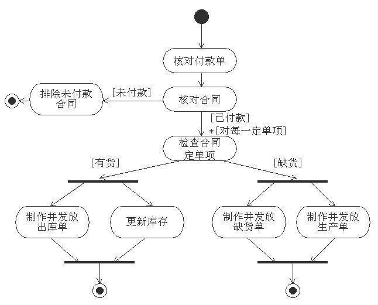

<!-- slide: 13 -->

## 3、活动图的内容

- 华 南 理 工 大 学
- 软 件 需 求 分 析 与 建 模
- <number>
- 活动图用图形化的方式展现了一个
  - 为非反应型对象的动态行为建模的活动状态机
- 活动状态机是状态机的一个特殊形式，
  - 其中的变迁是不带触发事件的无触发变迁，
  - 其中的状态只能是动作状态和活动状态。
- 活动图主要包括三个方面的内容：
  - 动作状态
  - 活动状态
  - 无触发变迁

<!-- slide: 14 -->

## （1）、动作状态

- 华 南 理 工 大 学
- 软 件 需 求 分 析 与 建 模
- <number>
- 软件对象的动态行为是由一个个的动作构成的。
  - 动作是状态机内原子的计算的执行。
    - 所谓原子，指的是
      - 构成动态行为的最小单位，
    - 动作的执行是不可打断的，
    - 动作的执行时间是可以忽略的。
- 在活动状态机中，
  - 对动态行为的建模
    - 是通过附加在状态中的动作实现的。

<!-- slide: 15 -->

- 华 南 理 工 大 学
- 软 件 需 求 分 析 与 建 模
- <number>
- UML使用专门的图形符号代表动作状态和活动状态，此图形符号
  - 是一个上下为平行直边，两侧用圆弧连接的图形框。
- 对于动作状态，
  - 其动作就写在图形框内。
- UML对动作没有规定严格的语法，因此
  - 可以用一文本串描述动作，
  - 也可以用任何一种程序设计语言的语句的语法书写动作文本串。

<!-- slide: 16 -->

## （2）、活动状态

- 华 南 理 工 大 学
- 软 件 需 求 分 析 与 建 模
- <number>
- 在UML里，
  - 活动是软件对象非原子的计算的执行。
  - 活动可以被进一步地分解为一系列的动作。
- 在活动状态机里，
  - 如果全部用动作状态来描述对象的动态行为，
    - 那么产生的活动图将由许多十分细小的动作状态组成，使得活动图过于繁杂。
- 在大多数的情况下，软件对象的动态行为
  - 可以用一系列的子过程来表达，
  - 而不需要细化至每个原子的计算。

<!-- slide: 17 -->

## （3）、无触发变迁

- 华 南 理 工 大 学
- 软 件 需 求 分 析 与 建 模
- <number>
- 无触发变迁又称为完成变迁。
  - 它在活动状态机里用于为动作的自动执行建模。
- 在UML里,完成变迁是不包含触发事件的变迁。
- 如果无触发变迁的起始状态是一个简单状态（即不包含子状态的状态）
  - 那么此变迁在起始状态的入口动作和状态活动执行完毕之后被激发；
  - 如果起始状态是一个复合状态，
    - 那么此变迁在复合状态的内嵌状态机都到达结束状态后被激发。
- 之后，
    - 源状态的出口动作被执行；
    - 状态机转入变迁的目标状态。

<!-- slide: 18 -->

## 4、分支

- 华 南 理 工 大 学
- 软 件 需 求 分 析 与 建 模
- <number>
- 条件判断是最基本的程序结构，
  - 它代表软件对象在不同的判断结果的条件下，所执行的不同动作。
- 作为为非反应型对象的动态行为进行建模的建模手段，活动图提供了描述这种程序结构的建模元素，这就是
  - 分支(branch)。
- 分支是状态机的一个建模元素，它代表由一个触发事件在不同的触发条件下激发的多个变迁。

<!-- slide: 19 -->

- 华 南 理 工 大 学
- 软 件 需 求 分 析 与 建 模
- <number>
- 分支在活动图上用一个菱形表示，它包括
  - at least 一个输入变迁
  - 和多个输出变迁，
  - 其中的输出变迁都是
    - 带触发条件的完成变迁,
    - 触发条件的书写格式可以是一个布尔表达式。

<!-- slide: 20 -->

- 华 南 理 工 大 学
- 软 件 需 求 分 析 与 建 模
- <number>
- 分支的输出变迁可以多于两个，当分支的输入变迁被激发后，
- 分支的各输出变迁的触发条件
  - 必须有一个求值为真，
  - 否则状态机的执行将被冻结。
  - 为了避免状态机被冻结的情形出现… …

<!-- slide: 21 -->

- 华 南 理 工 大 学
- 软 件 需 求 分 析 与 建 模
- <number>
- 图 2

<!-- slide: 22 -->

## 5、循环

- 华 南 理 工 大 学
- 软 件 需 求 分 析 与 建 模
- <number>
- 在活动图里引入了分支以后，可以以它为基础描述其它的程序结构。
- 例如，下面的c语言的循环语句，就可以用图3的活动图表示。
- for(i=1;i<10;i++)
- {
- Action(i);
- }
- 在图3中，循环的结束条件是用一个分支表示的。从图3可以看到，这里的分支带有两个转入变迁。

<!-- slide: 23 -->

- 华 南 理 工 大 学
- 软 件 需 求 分 析 与 建 模
- <number>
- 图 3 循环

<!-- slide: 24 -->

- 华 南 理 工 大 学
- 软 件 需 求 分 析 与 建 模
- <number>
- 在UML的活动图里，菱形符号不但可以有两个或多个转出变迁，也可以有两个或多个转入变迁。
- 带有两个或多个转入变迁的菱形符号又称为合并（merge）。

<!-- slide: 25 -->

## 6、分解和汇合

- 华 南 理 工 大 学
- 软 件 需 求 分 析 与 建 模
- <number>
- 在状态机图中，并发的控制流的建模使用：
  - 并发子状态。
- 在活动图中，使用的表示方法是：
  - 分解(fork)
  - 和汇合(join)
- 在UML里，
  - 分解表示一个控制流被分解为两个或多个并发执行的控制流。
  - 汇合代表两个或多个控制流的同步。
    - 只有当所有的控制流都到达汇合点之后，控制才继续向下流动。

<!-- slide: 26 -->

- 华 南 理 工 大 学
- 软 件 需 求 分 析 与 建 模
- <number>
- 在分解和汇合的表示使用的是:
  - 同步条（synchronization bar）。
  - 同步条是一个粗的水平线。
- 当同步条表示分解时，可以有：一个转入变迁，两个或多个转出变迁
- 当同步条用来表示汇合时， 它可以有
  - 两个或多个转入变迁，
  - 一个转出变迁。
- 其中的转入变迁代表同步之前的多个并发控制流

<!-- slide: 27 -->

- 华 南 理 工 大 学
- 软 件 需 求 分 析 与 建 模
- <number>
- 图 分解和汇合
- Prepare Speech
- Gesture
- Decompress
- Sync Mouth
- Play Sound
- 分解(Fork)
- 汇合(Join)

<!-- slide: 28 -->

## 7、泳道

- 华 南 理 工 大 学
- 软 件 需 求 分 析 与 建 模
- <number>
- 活动图可以用来表达软件对象的比较复杂的动态行为。这些动态行为
  - 可能是模拟现实世界的某个机构的各业务部门的运作情况；
  - 也可能是一个复杂的算法，
  - 这算法可能需要由软件系统中的多个协同共同实现。
- (协同指的是多个类的对象共同工作，以提供单个类的的对象单独工作不能提供的动态行为)

<!-- slide: 29 -->

## 在UML里，对在语义上互相关联的活动状态的子集的划分，
是使用泳道(swim lane)实现的。
泳道是活动图里对其中的活动按照其职责上的关联进行的划分。
泳道在活动图内是一系列的垂直的隔断，
这也是泳道这个名字的由来。
在活动图里，泳道区分了其中的活动的不同职责。
在有泳道的活动图中，每一活动都属于且只属于一个泳道。
泳道之间可以有变迁的传递。
泳道从语义上可以理解为是一个模型包。
泳道可以有名字，以区分不同状态集合的职责。

- 华 南 理 工 大 学
- 软 件 需 求 分 析 与 建 模
- <number>

<!-- slide: 30 -->

## 泳道可以用在为复杂的算法进行建模的活动图上。
这时，一个泳道对应于一个协同，
其中的活动可以由一个或多各互相连接的类的对象实现。
带有泳道的活动图也可以在软件开发的需求分析阶段用来为业务部门的业务流程（business model）的建模上，
这时，泳道可以代表业务流程中的一个业务部门。

- 华 南 理 工 大 学
- 软 件 需 求 分 析 与 建 模
- <number>

<!-- slide: 31 -->

- 华 南 理 工 大 学
- 软 件 需 求 分 析 与 建 模
- <number>
- 顾客                        销售员                  仓库
- 图5

<!-- slide: 32 -->

## 8 对象流

- 华 南 理 工 大 学
- 软 件 需 求 分 析 与 建 模
- <number>
- 活动图中可以表示对象在不同活动中的流动，活动可以输入对象，也可输出对象。
- 对象流用虚箭头表示
- 一个活动可以有多个输入，有多个输出
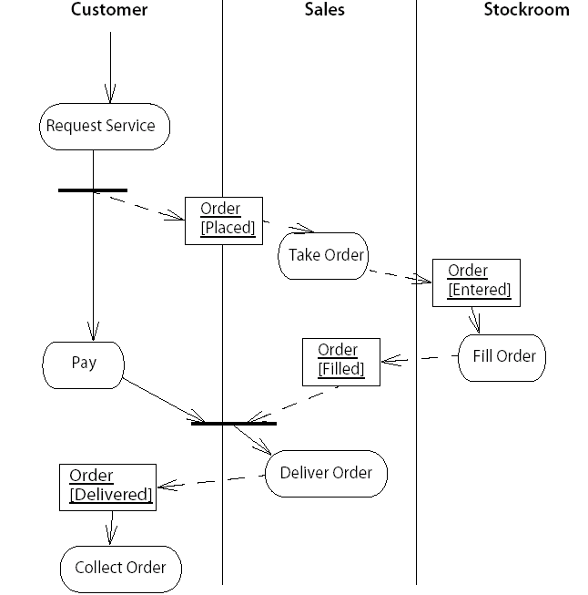

<!-- slide: 33 -->

## 9 活动分解/1

- 华 南 理 工 大 学
- 软 件 需 求 分 析 与 建 模
- <number>
- 某一活动状态可以指向另外一个活动图, 它展示了活动状态的内部结构。也就是说，我们有一个嵌套的活动图。你可以把子图放在活动图中或者让某一个活动状态指向另一张图。
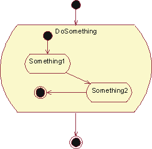

<!-- slide: 34 -->

## 9 活动分解/2

- 华 南 理 工 大 学
- 软 件 需 求 分 析 与 建 模
- <number>
- 如果想在一张图中展示所有的工作流的细节，我们可以把子图放在一个活动状态中。但是，如果在工作流中，有很多层次的子图，图读起来就比较困难
- 为了简化工作流图，你可以将子图放在单独的图上，然后将活动状态指向描述细节的子图

<!-- slide: 35 -->

- 华 南 理 工 大 学
- 软 件 需 求 分 析 与 建 模
- <number>
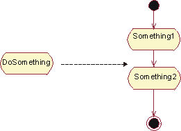
- Alternatively, put the subgraph in a separate diagram and let the activity state refer to it

<!-- slide: 36 -->

## 8、活动图的作用

- 华 南 理 工 大 学
- 软 件 需 求 分 析 与 建 模
- <number>
- 活动图作为UML为软件对象的动态行为建模的一种手段，其侧重点在于
  - 描述控制在活动之间的流动，
- 因此，它也可以看成是一种流程图。
- 作为流程图，它主要有两种用途，
  - 第一是为业务流程建模；
  - 第二是为对象的特定操作建模。

<!-- slide: 37 -->

## 当活动图用来为业务流程建模时，它所起的作用主要是：为软件系统的需求分析提供一种视化、交流和建档的手段。这时，可以
利用泳道代表不同的业务部门，
用活动代表不同的业务步骤。
在转入系统建造阶段时，
根据泳道的划分，确立相应的协同，
并可以用相应的交互和交互图来对软件的动态行为进行细化，
并为软件的逻辑设计打下基础。

- 华 南 理 工 大 学
- 软 件 需 求 分 析 与 建 模
- <number>

<!-- slide: 38 -->

## 作为流程图，活动图还可以为对象的特定操作执行流程进行建模。
这时，活动图是软件动态行为的较深层的抽象，
用于对操作的动态行为的
说明、视化、建档和建造。
可以根据活动图的定义，对对象的操作的进行程序编码。
从这个意义上说，
活动图也可以看作对交互图中描述的交互的细化。
交互图定义对象之间的配合，
活动图定义这些配合的实现。

- 华 南 理 工 大 学
- 软 件 需 求 分 析 与 建 模
- <number>

<!-- slide: 39 -->

## 1. 描述工作流

- 华 南 理 工 大 学
- 软 件 需 求 分 析 与 建 模
- <number>
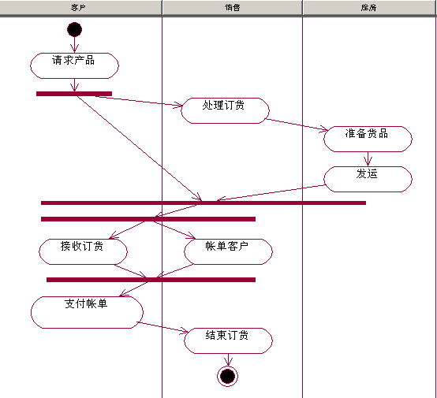

<!-- slide: 40 -->

## 2. 描述工程组织过程

- 华 南 理 工 大 学
- 软 件 需 求 分 析 与 建 模
- <number>
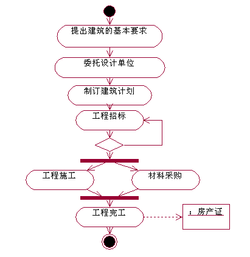

<!-- slide: 41 -->

## 3. 描述算法流程

- 华 南 理 工 大 学
- 软 件 需 求 分 析 与 建 模
- <number>
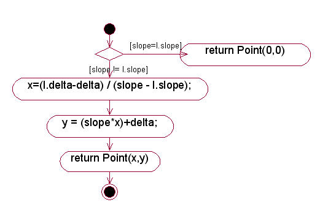

<!-- slide: 42 -->

## 实例1：找饮料的活动图

- 华 南 理 工 大 学
- 软 件 需 求 分 析 与 建 模
- <number>

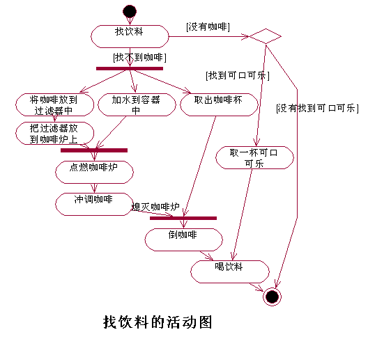

<!-- slide: 43 -->

## 实例2：销售处理过程的活动图

- 华 南 理 工 大 学
- 软 件 需 求 分 析 与 建 模
- <number>
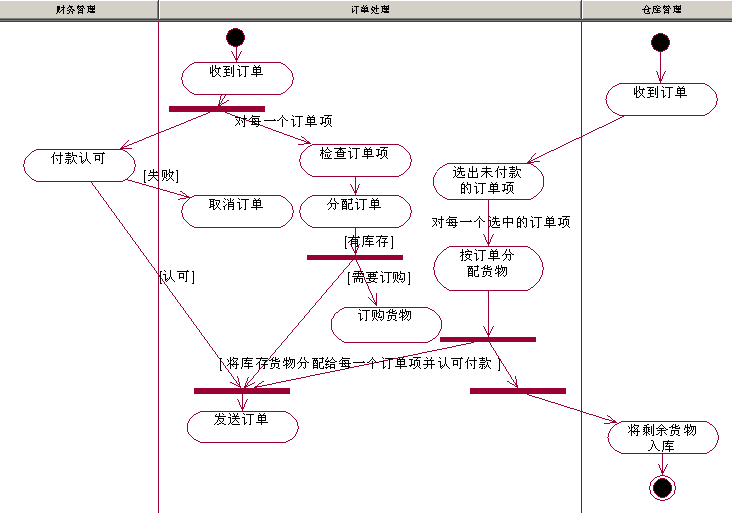

<!-- slide: 44 -->

## 活动图与状态图比较总结

- 华 南 理 工 大 学
- 软 件 需 求 分 析 与 建 模
- <number>
- １.相同点
    - 描述图符基本一样
    - 可以描述一个系统或在生存期间的状态或行为。
    - 可以描述多进程操作中的同步或异步操作的并发行为
  - ２、不同点
    - 触发迁移的机制不同
    - 描述多个对象共同完成一个操作的机制不同

<!-- slide: 45 -->

## UML 2.0中的新概念

- 华 南 理 工 大 学
- 软 件 需 求 分 析 与 建 模
- <number>
- 1.对象的节点:明确一个活动的输入和输出.
- 也称为活动参数节点：定义了了活动输入和输出的对象节点。
- 对象节点代表了一个对象值，它存在于计算过程中的某个时刻。对象可以是一个活动节点的输出，并作为其他活动节点的输入。
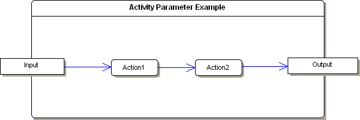

<!-- slide: 46 -->

- 华 南 理 工 大 学
- 软 件 需 求 分 析 与 建 模
- <number>
- 活动图中的一个对象节点，它从多个对象节点接收输入，或者为多个对象节点产生输出，或者两者。从中央缓冲节点触发的流不直接与动作相连。
- 中央缓冲节点对传统的缓冲建模，它可以保存多个来源的值以及向多个目的地发送值。
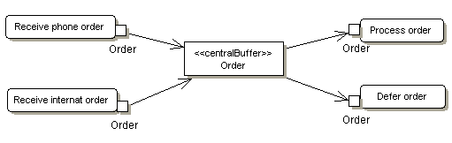

<!-- slide: 47 -->

## 交互概览图

- 华 南 理 工 大 学
- 软 件 需 求 分 析 与 建 模
- <number>
- 一个交互概览图是活动图的一种形式，它的节点代表交互图。交互图包含顺序图，通信图，交互概览图和时间图。
- 大多数交互概览图标注与活动图一样。例如：起始，结束，判断，合并，分叉和结合节点是完全相同。并且，交互概览图介绍了两种新的元素：交互发生和交互元素。

<!-- slide: 48 -->

- 华 南 理 工 大 学
- 软 件 需 求 分 析 与 建 模
- <number>
- （1）交互发生交互发生引用现有的交互图。显示为一个引用框，左上角显示 "ref" 。被引用的图名显示在框的中央
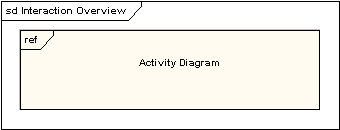

<!-- slide: 49 -->

- 华 南 理 工 大 学
- 软 件 需 求 分 析 与 建 模
- <number>
- （2）交互元素交互元素与交互发生相似之处在于都是在一个矩形框中显示一个现有的交互图。不同之处在内部显示参考图的内容不同。
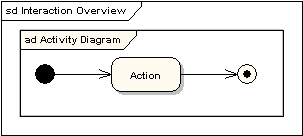

<!-- slide: 50 -->

- 华 南 理 工 大 学
- 软 件 需 求 分 析 与 建 模
- <number>
- 所有的活动图控件，都可以相同地被使用于交互概览图，如：分叉，结合，合并等等。它把控制逻辑放入较低一级的图中。下面的例子就说明了一个典型的销售过程。子过程是从交互发生抽象而来。

<!-- slide: 51 -->

- 华 南 理 工 大 学
- 软 件 需 求 分 析 与 建 模
- <number>
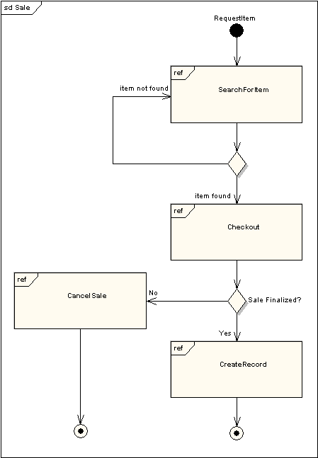

<!-- slide: 52 -->

## 重要的知识点

- 华 南 理 工 大 学
- 软 件 需 求 分 析 与 建 模
- <number>
- ● 状态图
- 1 什么是状态图
- 2 状态图的要素
- 3 状态图的作用
- ● 活动图
- 1 什么是活动图
- 2 活动图的要素
- 3 活动图的用途
- 4状态图和活动图的比较

<!-- slide: 53 -->

## 活动图建模步骤

- 华 南 理 工 大 学
- 软 件 需 求 分 析 与 建 模
- <number>
- （1）在采集的原始需求中选择重点流程；
- （2）首先要确定要设计的活动图是针对业务流程还是用例。
- （3）其次要设计活动过程的起点和终点。
- （4）确定活动图所有执行对象。
- （5）确定活动节点，并根据执行对象进行活动分组。
  - （a）如果对用例建活动图，则把角色所发出的每一个动作变为活动节点。
  - （b）如果对业务流程建活动图，则把每一个流程步骤(或片段)变为活动节点。
- （6）确定活动节点之间转移。
- （7）处理在活动节点之间的分支和合并。
- （8）处理在活动节点之间的分叉和汇合。
- （9）用UML建模工具进行活动图建模。
- （10）编写必要的补充文档。

<!-- slide: 54 -->

- 华 南 理 工 大 学
- 软 件 需 求 分 析 与 建 模
- <number>
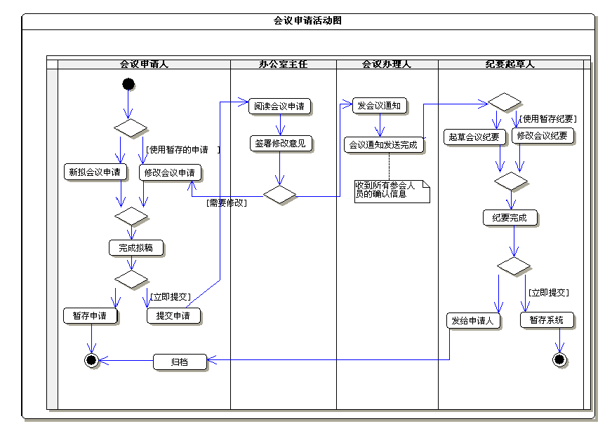

<!-- slide: 55 -->

## Click to edit company slogan .

- <number>
- www.themegallery.com

