# 4.用例图概述

<!-- slide: 1 -->

## 软件需求分析与建模- 用例图

- <number>

<!-- slide: 2 -->

## 本章需要掌握的知识点

- 华 南 理 工 大 学
- 软 件 需 求 分 析 与 建 模
- <number>
- （1）掌握如何利用用例图对软件的需求进行建模。
- （2）用例图的三个组成部分：执行者、系统边界和用例。
- （3）用例之间的各种关系，特别是包含与扩展。
- （4）执行者之间的关系。
- （5）掌握构造用例图的一般步骤。

<!-- slide: 3 -->

## 用例模型和用例图

- 华 南 理 工 大 学
- 软 件 需 求 分 析 与 建 模
- <number>
- 用例模型概述；
- 用例图；
- 建立用例模型的主要工作；
- 用例模型(用例图)的建造；
- 小  结。

<!-- slide: 4 -->

## I   用例模型概述

- 华 南 理 工 大 学
- 软 件 需 求 分 析 与 建 模
- <number>
- 什么是用例？
- 用例模型的意义；
- 用例分析的目的；
- 用例的属性；
- 对用例图关心的人员。

<!-- slide: 5 -->

## 什么是用例？

- 华 南 理 工 大 学
- 软 件 需 求 分 析 与 建 模
- <number>
- 确定需求：
  - 软件开发中的一个致命的问题
  - 为此，各有关方面需要大量的交流，以增进对需求的了解。
  - 然而，对各方所关心的事情的描述却都是粗糙的（非形式化）、口头的或是一些杂乱的草稿，没有文档
- 怎样描述用户所关心的事情？
  - 用例是对（用户）所关心的事情的描述。

<!-- slide: 6 -->

## 场景Scenario

- 华 南 理 工 大 学
- 软 件 需 求 分 析 与 建 模
- <number>
- 场景：用户与系统之间的一个交互过程，即为实现这次交互所要经历的一系列步骤
  - 例：一个基于Web的在线购物站点的购物场景：
    - 主场景：顾客浏览了货单并将感兴趣的物品添加的购物筐中。如决定购买，则说明要购买的物品，提供信用卡信息并确认购物清单。系统将检查信用卡的合法性并确认销售结果。给客户发出确认电子邮件
    - 备选场景：信用卡失效

<!-- slide: 7 -->

## 用例Use Cases

- 华 南 理 工 大 学
- 软 件 需 求 分 析 与 建 模
- <number>
- 用例：一组场景，用以共同描述用户的某个特定的目标。
- 例：购买商品用例
  - 主场景：
    - 顾客浏览货单并选择要买的商品
    - 顾客来付款
    - 顾客填写采购信息（地址、隔天或3天送货）
    - 系统显示价目信息
    - 顾客填写信用卡信息
    - 系统检查信用卡的合法性
    - 系统确认销售
    - 系统给客户发出确认电子邮件

<!-- slide: 8 -->

## 候选场景

- 华 南 理 工 大 学
- 软 件 需 求 分 析 与 建 模
- <number>
  - 候选场景：信用卡失效
    - 第6步，系统检查信用卡失败。允许客户重新执行第5步
  - 候选场景：固定客户
    - 3a. 系统显示当前购物信息、价格信息、信用卡的最后四位数字
    - 3b. 顾客接受或修改这些隐含值。转至主场景的第6步

<!-- slide: 9 -->

## 用例模型的意义

- 华 南 理 工 大 学
- 软 件 需 求 分 析 与 建 模
- <number>
- 用例模型对软件开发方法的研究具有重要意义：任何方法的首要问题是了解需求，而分析典型用例是用户和开发者一起了解需求、剖析需求和跟踪需求的有效工具。
- Jacobson首先提出用例分析方法，对用例的使用进行了扩展，将其作用提高到项目设计和项目开发基本要素的高度，是面向对象技术进入第二代的标志。

<!-- slide: 10 -->

## 用例分析的目的

- 华 南 理 工 大 学
- 软 件 需 求 分 析 与 建 模
- <number>
- 1. 描述和决定系统的功能需求，帮助客户和软件开发人员形成一致意见。
- 2. 给出系统应该做什么且与内容一致的可视化描述，使之成为在开发全过程中研讨系统需求和进行系统设计的依据。
- 3. 在软件测试阶段作为系统测试的基础。
- 建立系统实现的各个对象类和系统操作与功能需求之间的可追踪关系。

<!-- slide: 11 -->

## 用例的一些基本特点

- 华 南 理 工 大 学
- 软 件 需 求 分 析 与 建 模
- <number>
- 用例描述了用户提出的一些可见需求；
- 用例可大可小
  - 例：10人年的项目，20-100个用例
- 用例对应一个具体的用户目标
- 从本质上讲，一个用例是用户与计算机之间为达到某个目的的一次典型交互。以字处理程序为例，“将某些正文置为黑体”和“创建一个索引”便是两个典型的用例。从这两个例子中可以了解用例的一些特点：

<!-- slide: 12 -->

## 对用例模型关心的人员

- 华 南 理 工 大 学
- 软 件 需 求 分 析 与 建 模
- <number>
- 客户：他关心如何使用系统的功能；充当模型中的哪一个角色；如何调整模型可以更好地适应他们的愿望。
- 开发人员：他需要理解系统的功能，以作为今后工作的基础和依据；在系统集成测试期间，可以使用这些用例测试系统。
- 其他人员：销售人员，技术支持人员，文档编写人员等也关心用例图。

<!-- slide: 13 -->

## 用例用于描述系统的功能，这个功能是外部使用者看到的系统功能，不反映功能的实现方式

- 华 南 理 工 大 学
- 软 件 需 求 分 析 与 建 模
- <number>
- 储蓄系统
- √
- √
- √
- 开户
- 存款
- 取款
- 转帐
- 用例的特点(1)

<!-- slide: 14 -->

## 用例的特点(2)

- 华 南 理 工 大 学
- 软 件 需 求 分 析 与 建 模
- <number>
- 用例描述用户提出的一些可见需求，对应一个具体的用户目标。
- √
- ×
- 储蓄系统
- √
- √
- √
- 开户
- 存款
- 取款
- 转帐
- 数据上传

<!-- slide: 15 -->

## 用例的特点(3)

- 华 南 理 工 大 学
- 软 件 需 求 分 析 与 建 模
- <number>
- 用例反映系统与用户的一次交互过程，应该具有交互的信息的传递。
- 帐户，密码，金额数
- 确认信息，帐户余额
- 取款

<!-- slide: 16 -->

## II   用例图

- 华 南 理 工 大 学
- 软 件 需 求 分 析 与 建 模
- <number>
- 用例图举例；
- 用例图中的图符；
- 用例图中的模型元素。

<!-- slide: 17 -->

## 用例图举例（UML1.1）

- 华 南 理 工 大 学
- 软 件 需 求 分 析 与 建 模
- <number>
- 《使用》
- 贸易经理
- 设置边界
- 更新帐目
- 记帐系统
- 《扩展》
- 用例
- 执行者
- 《使用》
- 风险分析
- 交易估价
- 进行交易
- 超越边界
- -扩展点：大交易量
- 评  价
- 营销人员
- 销售人员

<!-- slide: 18 -->

## 用例图举例（UML1.3）

- 华 南 理 工 大 学
- 软 件 需 求 分 析 与 建 模
- <number>
- 《包含》
- 贸易经理
- 设置边界
- 更新帐目
- 记帐系统
- 泛化
- 用例
- 执行者
- 《包含》
- 风险分析
- 交易估价
- 进行交易
- 超越边界
- 评  价
- 营销人员
- 销售人员

<!-- slide: 19 -->

## 用例图中的图符（UML1.3）

- 华 南 理 工 大 学
- 软 件 需 求 分 析 与 建 模
- <number>
- 执行者
- 系统
- 用例
- 关联
- 《扩展》
- 注释体
- 注释连接
- 《包含》
- 泛化

<!-- slide: 20 -->

## 用例图中的模型元素：系统边界、执行者和用例

- 华 南 理 工 大 学
- 软 件 需 求 分 析 与 建 模
- <number>
- 系统边界：一个提供“用例”所需要的功能的“黑盒   子”。系统的外部特性由系统的功能来定义；整个系统的功能用一组用例来描述。
- 执行者：需要使用系统的任何外部实体(例如：人、其它系统或外部设备等)。
- 用例：用客户或用户的语言和词汇来描述的系统的一个完整功能。

<!-- slide: 21 -->

## 用例图中的模型元素(续1)：关联、使用和 扩展

- 华 南 理 工 大 学
- 软 件 需 求 分 析 与 建 模
- <number>
- 关联：连接执行者和用例，表示该执行者所代表的系统外部实体与该用例所描述的系统需求有    关。这是执行者和用例之间的唯一合法连接。
- 包含：由用例A连向用例B，表示用例A中使用了用例B中的行为或功能。
- 扩展：由用例 A连向用例 B，表示用例B描述了一项基本需求，而用例A则描述了该基本需求的特殊情况，即一种扩展。

<!-- slide: 22 -->

## 参与者

- 华 南 理 工 大 学
- 软 件 需 求 分 析 与 建 模
- <number>
- 1. 参与者的概念
- 参与者（actor）是外部需要与系统交互的事物。也被称为活动者或执行者。
- 2.参与者的三种类型
- ①. 人：客户，读者，库管员
- ②. 设备：计算机，磁盘，读卡机等
- ③. 外部系统：上层系统等

<!-- slide: 23 -->

## 参与者可以表示为下面三种形式。

- 华 南 理 工 大 学
- 软 件 需 求 分 析 与 建 模
- <number>

- 参与者的表示

<!-- slide: 24 -->

## 参与者之间可以有泛化关系。

- 华 南 理 工 大 学
- 软 件 需 求 分 析 与 建 模
- <number>

- 参与者之间的关系
- 当几种执行者所扮演的角色可以被泛化时，可以定义一个更抽象的角色。
- 执行者是一个类,代表一种角色,而不是具体某个人
- 门市客户
- 电话客户
- 客户

<!-- slide: 25 -->

## 执行者的泛化：责任重叠

- 华 南 理 工 大 学
- 软 件 需 求 分 析 与 建 模
- <number>
- 执行者可以通过泛化关系来定义，在这种泛化关系中，一个执行者的抽象描述可以被一个或多个具体的执行者所共享
  - 如系统中经理可以参加雇员的所有用例

<!-- slide: 26 -->

## 用例之间的关系(1)

- 华 南 理 工 大 学
- 软 件 需 求 分 析 与 建 模
- <number>
- 用例之间可以具有以下几种关系：
- 关联关系
- 泛化关系
- 包含关系
- 扩展关系

<!-- slide: 27 -->

## 关联关系
       参与者与用例之间是关联关系，表示参与者与用例之间具有使用，交互信息的关联。

- 华 南 理 工 大 学
- 软 件 需 求 分 析 与 建 模
- <number>

- 参与者与用例之间的关系

<!-- slide: 28 -->

## 泛化关系
    参与者与参与者之间，用例与用例之间存在一般与特殊的关系。

- 华 南 理 工 大 学
- 软 件 需 求 分 析 与 建 模
- <number>
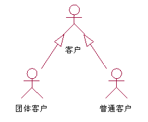
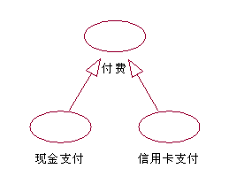
- 用例之间的关系(3)
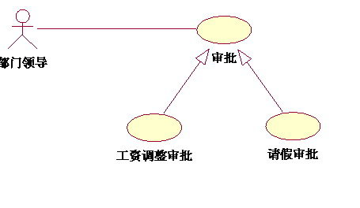

<!-- slide: 29 -->

## 用例的泛化关系

- 华 南 理 工 大 学
- 软 件 需 求 分 析 与 建 模
- <number>
- 同一业务目的不同技术实现：
  - 一个用例可以特化另一个更普通用例（更普通用例泛化特殊用例）
  - UML 1.5: 用例间的泛化关系表明子用例继承父用例中定义的所有属性、行为序列和扩展点，并且参与父用例中所有的关系

<!-- slide: 30 -->

## 包含关系的定义

- 华 南 理 工 大 学
- 软 件 需 求 分 析 与 建 模
- <number>
- 包含关系是一种(因子化)重组关系。当几个用例具有共同的行为时，这个共同行为可以抽象为一个公共用例。
- 一个特殊用例包含一个公共用例作为其一部分         时，将完全包含那个公共用例的行为，即整个公共用例被使用。
- 包含的可视化表示：由用例A连向用例B，表示用例A中包含了用例B中的行为或功能。

<!-- slide: 31 -->

## 包含关系
    两个用例之间，一个用例(基本用例)的行为包含了另外一个用例(包含用例)的行为。
    包含关系用依赖关系的<<include>>构造型来表示。

- 华 南 理 工 大 学
- 软 件 需 求 分 析 与 建 模
- <number>
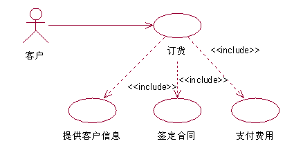
- 用例之间的关系(4)

<!-- slide: 32 -->

## 包含关系

- 华 南 理 工 大 学
- 软 件 需 求 分 析 与 建 模
- <number>
- 某些步骤在多个用例重复出现，且单独形成用例。
- 用例步骤较多时，可用Include简化（慎用）

<!-- slide: 33 -->

## 包含关系：不适合的用法

- 华 南 理 工 大 学
- 软 件 需 求 分 析 与 建 模
- <number>
- 建议使用《uses》或《使用》关系

<!-- slide: 34 -->

## 包含关系的使用

- 华 南 理 工 大 学
- 软 件 需 求 分 析 与 建 模
- <number>
- 包含关系使用不当容易诱使人们进行攻能分解，从而导致对用例的误用
  - Jacobson说，“事实上，今天一些人误用了用例，把它们用来描述功能（注：指功能分解式的分析）而不是对象，反过来又指责用例概念存在问题”

<!-- slide: 35 -->

## 扩展关系的定义

- 华 南 理 工 大 学
- 软 件 需 求 分 析 与 建 模
- <number>
- 扩展与包含相似，从几个用例中抽取公共行为并放入一个单独用例中作为基本用例，然后增加新的特殊情况作为其基本用例的扩展。
- 在扩展情况下，一个给定的执行者将执行基本用例及其所有的扩展。对于包含关系，通常执行者不会和公共用例相关联。
- 扩展的可视化表示：由用例A连向用例B, 表示用例B描述了一项基本需求，而用例A则描述了该基本需求的特殊情况，即一种扩展。

<!-- slide: 36 -->

## 扩展关系
    扩展关系表示基本用例在扩展点要增加新的行为或功能，以扩展到新用例。
    扩展关系用依赖关系的<<extend>>构造型来表示。

- 华 南 理 工 大 学
- 软 件 需 求 分 析 与 建 模
- <number>
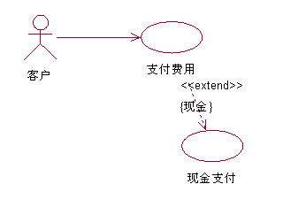
- 用例之间的关系(5)
- 第一种表示

<!-- slide: 37 -->

## 《扩展》关系

- 华 南 理 工 大 学
- 软 件 需 求 分 析 与 建 模
- <number>
- 类似于泛化关系，但添加了一些新规则
  - 扩展用例可以在基用例之上添加新的行为，但是基用例必须声明某些特定的“扩展点”，并且扩展用例只能在这些扩展点上扩展新的行为。
- 罚款
- 还书
- 扩展点：
- 书到期
- 《extend》
- 第二种表示
- 建议采用第二种表示，注意箭头指向

<!-- slide: 38 -->

- 华 南 理 工 大 学
- 软 件 需 求 分 析 与 建 模
- <number>
- 扩展关系有一系列的扩展点名称，其个数与扩展用例中的片断数相等。每个扩展点必须在基用例中定义。
- 使用扩展关系如下图：
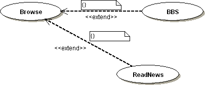

<!-- slide: 39 -->

- 华 南 理 工 大 学
- 软 件 需 求 分 析 与 建 模
- <number>
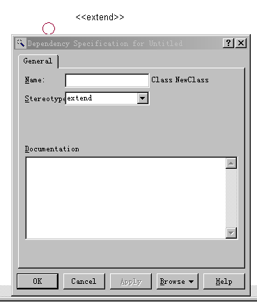

<!-- slide: 40 -->

## 扩展关系：不太恰当的用法

- 华 南 理 工 大 学
- 软 件 需 求 分 析 与 建 模
- <number>

<!-- slide: 41 -->

## 包含与扩展关系的选择

- 华 南 理 工 大 学
- 软 件 需 求 分 析 与 建 模
- <number>
- 下列规则可用来判断应采用包含关系或扩展关系
- 包含：当一个通用的用例可以成为几个特殊的用例的组成部分时用包含关系。因此，当在两个或更多的用例中出现重复描述而又想避免这种重复时，采用包含关系。
- 扩展：当一个用例是另一个一般化用例的特例时，用扩展关系。因此，当描述一般行为的变化时，采用扩展关系。
  - 要说明扩展点

<!-- slide: 42 -->

## 扩展 VS. 包含

- 华 南 理 工 大 学
- 软 件 需 求 分 析 与 建 模
- <number>
- A知道B
- B知道A
- 什么时候该我上场呢？不知道！
- 出现这种情况，就该我上场了！
- A
- B
- <<include>>
- A
- B
- <<extend>>

<!-- slide: 43 -->

## 扩展 VS. 包含-1

- 华 南 理 工 大 学
- 软 件 需 求 分 析 与 建 模
- <number>
- 包含：由用例A连向用例B，表示用例A中使用了用例B中的行为或功能
- 扩展：由用例B连向用例A，表示用例A描述了一项基本需求，而用例B则描述了该基本需求的特殊情况，即一种扩展
  - 扩展用例的目的是在不改变某个已存在（或假定存在）的用例的前提下为之增添新行为
  - 这些附加的行为可能是必需的，也可能是可选的

<!-- slide: 44 -->

## 扩展 VS. 包含-2

- 华 南 理 工 大 学
- 软 件 需 求 分 析 与 建 模
- <number>
- 扩展和包含用例本质上其实非常相似，它们的主要区别在于用例实例中断基用例、执行附加用例的方式
- 扩展和包含用例都于基用例相联。在基用例的执行过程中，可能在某种条件下基用例的执行流被中断，转而执行扩展或包含用例（在UML中统称为附加用例）的流。当附加用例流执行完毕，控制将返回到基用流原来被中断的那个位置恢复执行
- 扩展用例通过引用扩展点（extension point）建立与基用例的联系，扩展点指明了在基用例中的扩展位置

<!-- slide: 45 -->

## 扩展关系的使用

- 华 南 理 工 大 学
- 软 件 需 求 分 析 与 建 模
- <number>
- 使用扩展的一个潜在问题是创建过深的扩展依赖层次
  - Jacobson博士建议永远不要扩展一个扩展
- 对于在描述用例的时候，什么时候用扩展，什么时候用可选路径，Jacobson建议：
  - 只有当扩展用例与被扩展用例完全分离（即它本身是一个独立的具体用例或者是其他用例需要的一个小片段）时，才使用扩展关系
  - 基用例自身必须是完整的，它的正确执行不需要扩展。否则，就应该用可选路径来描述附加行为

<!-- slide: 46 -->

## <<uses>>关系

- 华 南 理 工 大 学
- 软 件 需 求 分 析 与 建 模
- <number>
- 关于<<uses>>关系
  - uml1.1中有两种用例关系
    - <<uses>>关系和<<extends>>关系
    - 它们都是泛化（generalization）关系的构造型（stereotype）
  - uml1.3之后，提供了三种用例关系
    - <<include>>关系、<<extend>>关系都是依赖（dependency）关系的构造型（stereotype）
    - 泛化关系（generalization）

<!-- slide: 47 -->

## 用例关系：扩展 VS. 泛化

- 华 南 理 工 大 学
- 软 件 需 求 分 析 与 建 模
- <number>
- 采用不同关系，文档结构不同

<!-- slide: 48 -->

## 要点：用户观点而非系统观点

- 华 南 理 工 大 学
- 软 件 需 求 分 析 与 建 模
- <number>
- 用户观点
- 系统观点

<!-- slide: 49 -->

## 用例 VS. 功能

- 华 南 理 工 大 学
- 软 件 需 求 分 析 与 建 模
- <number>

- 呼叫某人
- 接听电话
- 发送短信
- 记住电话号码
- ……
- 传输/接收
- 电源/基站
- 输入输出（显示、键盘）
- 电话簿管理
- ……
- 用户观点
- 系统观点

<!-- slide: 50 -->

## 用例的命名

- 华 南 理 工 大 学
- 软 件 需 求 分 析 与 建 模
- <number>
- 执行者视角：
  - （状语）动词+（定语+ ）宾语

<!-- slide: 51 -->

## UML1.3的修改

- 华 南 理 工 大 学
- 软 件 需 求 分 析 与 建 模
- <number>
- 用例之间的泛化关系
  - 一般泛化关系
  - 包含关系《include》：原来的《use》关系
  - 扩展关系《extend》: must declare certain “extension points”

<!-- slide: 52 -->

## III   建立用例模型的主要工作

- 华 南 理 工 大 学
- 软 件 需 求 分 析 与 建 模
- <number>
- 定义系统；
- 找出执行者；
- 找出用例；
- 描述用例；
- 用例的整理与加工；
- 验证模型。

<!-- slide: 53 -->

## 用例图的作用

- 华 南 理 工 大 学
- 软 件 需 求 分 析 与 建 模
- <number>
- 用例图用来描述软件需求模型中的系统功能，通过一组用例可以描述软件系统能够给用户提供的功能。
- 用例图可以作为整个系统开发过程中的开发依据，指导和驱动其他模型。

<!-- slide: 54 -->

## 用例图的形式

- 华 南 理 工 大 学
- 软 件 需 求 分 析 与 建 模
- <number>
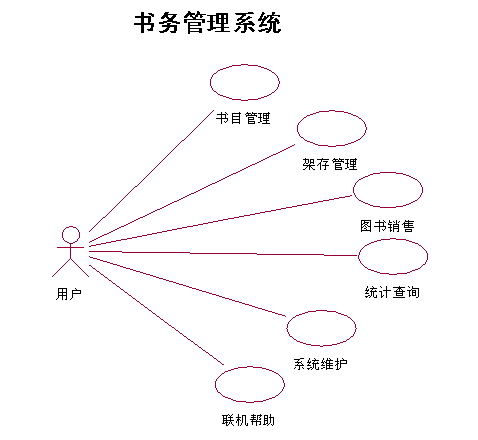
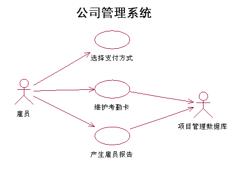
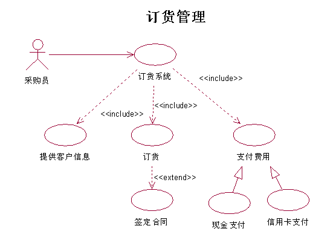

<!-- slide: 55 -->

## III.1  定义系统

- 华 南 理 工 大 学
- 软 件 需 求 分 析 与 建 模
- <number>
- 系统的属性；
- 定义系统时的注意点；
- 对与外界系统交互问题的看法。

<!-- slide: 56 -->

## 系统的属性

- 华 南 理 工 大 学
- 软 件 需 求 分 析 与 建 模
- <number>
- 系统名：软件系统、业务流程或硬件系统等都是系统，它应该有一个名字。用字符串表达系统名 。
- 系统边界：定义系统的边界，即确定系统的内容：哪些任务由系统完成，哪些由人工完成，哪些由其他系统完成；系统多大，有哪些功能，系统的复杂程度如何；等等。
- 系统定义应当：基本功能明确；系统构架优良(便于增加或修改系统的功能)。

<!-- slide: 57 -->

## 定义系统时的注意点

- 华 南 理 工 大 学
- 软 件 需 求 分 析 与 建 模
- <number>
- 定义系统是用准确的语言对问题进行描述，其要点如下：汇集最重要的概念(实体)；使用客户熟悉的术语、词汇和定义；对系统或业务模型中的词汇给出准确说明(用于描述用例)。
- 系统定义的详略程度：简单系统，半页纸左右；复杂系统，需要一系列文档。

<!-- slide: 58 -->

## 对与外界系统交互问题的看法

- 华 南 理 工 大 学
- 软 件 需 求 分 析 与 建 模
- <number>
- 与外界系统的所有交互都应在图中表达。例如，为了给一笔交易进行估价需要访问银行，则应在用例“交易估价”与“银行”之间建立连接关系。
- 只有当某个外界系统会引发信息交互时，才在系统中建立相应的外界系统。此时除非记帐系统会通过某种方式要求本系统做某件事时，才在图中显示记帐系统。

<!-- slide: 59 -->

## III.2  找出执行者

- 华 南 理 工 大 学
- 软 件 需 求 分 析 与 建 模
- <number>
- 执行者的主要属性；
- 执行者与系统和用例之间的关系；
- 执行者的获取；
- 对执行者的描述。

<!-- slide: 60 -->

## 执行者的主要属性

- 华 南 理 工 大 学
- 软 件 需 求 分 析 与 建 模
- <number>
- 执行者是与系统有交互作用的实体(人或其它系统等)，它在执行用例时与系统之间有信息的交流。
- 执行者的重要性可以分级：主要角色(执行主要功能，如负责保险注册和管理的职员)和次要角色(执行次要功能，如负责系统维护、数据库管理、复制备份和其它系统管理等工作的职员)。
- 执行者有主动和被动之分：主动执行者创建用例；被动执行者不创建用例。

<!-- slide: 61 -->

- 华 南 理 工 大 学
- 软 件 需 求 分 析 与 建 模
- <number>
- 一个执行者代表一个角色，执行一个类；因此一个执行者的名字不应使用该执行者的某个具体实例的名字。
- 一个人在系统中的角色可以被限定为一个角色；但也可以担任不同的角色，充当不同类的执行者。

<!-- slide: 62 -->

## 执行者与系统和用例之间的关系

- 华 南 理 工 大 学
- 软 件 需 求 分 析 与 建 模
- <number>
- 执行者与系统之间的交流是通过收发消息。
- 一个简单用例总是由一个执行者通过发消息的方法(刺激)创建；一个复合用例总是由一个或若干个执行者通过发消息的方法(刺激)创建。
- 当执行一个(简单的或复合的)用例时，它会发一些消息给一个或多个执行者。

<!-- slide: 63 -->

## 执行者的获取

- 华 南 理 工 大 学
- 软 件 需 求 分 析 与 建 模
- <number>
- 谁使用系统的主要功能(主要使用者)？
- 谁需要系统支持他们的日常工作？
- 谁来维护、管理系统使其能正常工作(辅助使用者)？
- 系统需要控制哪些硬件？系统需要与其他哪些系统交互？
- 对系统产生的结果感兴趣的是哪些人或哪些事物？
- 执行者主要是业务的客户，而不是操作员。通过用户回答问题可以帮助我们识别执行者。以下问题可供参考：

<!-- slide: 64 -->

## 对执行者的描述

- 华 南 理 工 大 学
- 软 件 需 求 分 析 与 建 模
- <number>
- 执行者是类，因而可用执行者的类名及其属性和行为来描述。
- 有必要时增加注解，对使用者情况和要求等加以说明。
- 执行者之间的关系与其他类之间的关系相同。在用例图中，只有泛化关系用来描述某些执行者之间的公共行为。

<!-- slide: 65 -->

## IV 用例模型(用例图)的建造

- 华 南 理 工 大 学
- 软 件 需 求 分 析 与 建 模
- <number>
- 用例间关系的示意图；
- 包含关系的定义；
- 扩展关系的定义；
- 包含与扩展关系的选择；
- 用例的获取。

<!-- slide: 66 -->

## 发现用例的一般方法：

- 华 南 理 工 大 学
- 软 件 需 求 分 析 与 建 模
- <number>
- ① 找出系统外部参与者，确定系统边界和范围。
- ② 确定各参与者所期望的系统行为。
- ③ 把这些系统行为命名为用例。
- ④ 确定各用例之间的关系(泛化，包含，扩展)。
- ⑤ 绘制用例图。
- ⑥ 编制用例说明。
- ⑦ 对异常流程确定单独用例。
- ⑧ 优化用例图，解决用例之间的冲突和重复。
- 发现用例

<!-- slide: 67 -->

## 某学校网上选课系统的用例分析(1)

- 华 南 理 工 大 学
- 软 件 需 求 分 析 与 建 模
- <number>
- 管理员通过系统管理界面进入系统，建立本学期要开设的各种课程，将课程信息保存到数据库中，并可以对课程进行改动和删除。
- 学生通过客户机浏览器进入系统，选择课程：可以查询课程，选择课程，支付课程费用。

<!-- slide: 68 -->

## 某学校网上选课系统的用例分析(2)

- 华 南 理 工 大 学
- 软 件 需 求 分 析 与 建 模
- <number>
- １.找出系统外部参与者，确定系统边界和范围。

<!-- slide: 69 -->

## 某学校网上选课系统的用例分析(3)

- 华 南 理 工 大 学
- 软 件 需 求 分 析 与 建 模
- <number>
- 确定各参与者所期望的系统行为。
- 管理员： 增加课程
- 修改课程
- 删除课程
- 学生：     查询课程
- 选择课程
- 网上付费

<!-- slide: 70 -->

## 某学校网上选课系统的用例分析(4)

- 华 南 理 工 大 学
- 软 件 需 求 分 析 与 建 模
- <number>
- ① 找出系统外部参与者，确定系统边界和范围。
- ② 确定各参与者所期望的系统行为。
- ③ 把这些系统行为命名为用例。
- ●
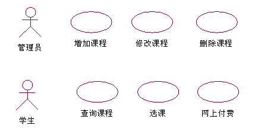

<!-- slide: 71 -->

## 某学校网上选课系统的用例分析(5)

- 华 南 理 工 大 学
- 软 件 需 求 分 析 与 建 模
- <number>
- 确定各角色和用例之间的关系(泛化，包含，扩展)。
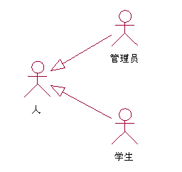

<!-- slide: 72 -->

## 某学校网上选课系统的用例分析(6)

- 华 南 理 工 大 学
- 软 件 需 求 分 析 与 建 模
- <number>
- 绘制用例图
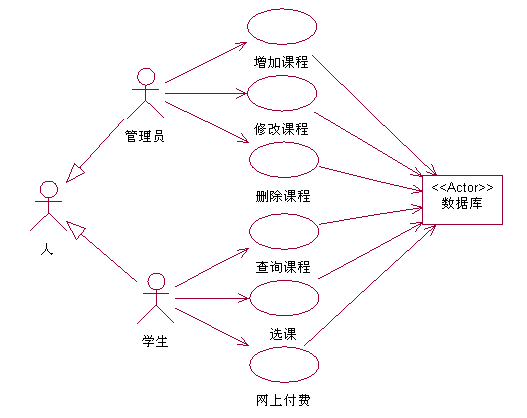

<!-- slide: 73 -->

## 某学校网上选课系统的用例分析(7)

- 华 南 理 工 大 学
- 软 件 需 求 分 析 与 建 模
- <number>
- ● 用例：增加课程    ●参与者：管理员      ●操作流：
- ① 管理员选择进入管理界面，用例开始。
- ② 系统提示输入管理员密码。
- ③ 管理员输入密码。
- ④ 系统检验密码。          A1：密码出错。
- ⑤ 进入管理界面，系统显示当前所建立的全部课程信息。
- ⑥ 管理选择增加课程，管理输入新课程信息。
- ⑦系统验证是否与已有课程冲突。　　Ａ２：有冲突。
- ⑧系统添加新课程，并提示添加成功。
- ⑨系统回到管理主界面，显示所有课程，用例结束。
- 编制用例说明

<!-- slide: 74 -->

## 旅店预订系统精化后的用例模型

- 华 南 理 工 大 学
- 软 件 需 求 分 析 与 建 模
- <number>
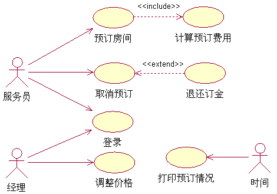

<!-- slide: 75 -->

## 包含关系的描述

- 华 南 理 工 大 学
- 软 件 需 求 分 析 与 建 模
- <number>

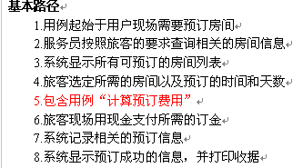
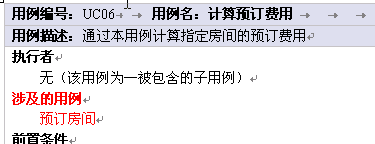

<!-- slide: 76 -->

## 扩展关系的描述

- 华 南 理 工 大 学
- 软 件 需 求 分 析 与 建 模
- <number>
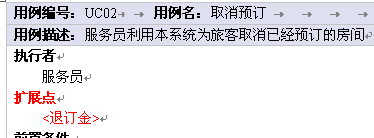
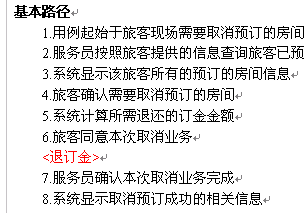

<!-- slide: 77 -->

## 用例的获取

- 华 南 理 工 大 学
- 软 件 需 求 分 析 与 建 模
- <number>
- 首先获取简单的、常规的用例作为基本用例(在上例中，基本用例是进行交易)。
- 当一个用例与另一个用例相似，但比另一个用例做的动作要多，采用扩展关系：
- 对用例中的每一步，问一下“这儿可能出现什么异常情况”以及“是否需要采取不同的解决方法”；将所有出现变动的部分列出，作为给定用例的扩展。
- 一旦获取了系统的执行者，就可对每个执行者提出一些问题，然后从执行者对这些问题的答案中获取用例。

<!-- slide: 78 -->

## 要点：用例粒度-1

- 华 南 理 工 大 学
- 软 件 需 求 分 析 与 建 模
- <number>
- 用例要有路径，路径要有步骤；而这一切都是可观测的
- 最常犯错误：粒度过细，陷入功能分解
  - 过细的粒度，一般都会导致技术语言的描述，而不再是业务语言

<!-- slide: 79 -->

## 用例粒度-2

- 华 南 理 工 大 学
- 软 件 需 求 分 析 与 建 模
- <number>
- 把步骤当用例
- 把系统活动当用例

<!-- slide: 80 -->

## 利用分包机制组织用例模型

- 华 南 理 工 大 学
- 软 件 需 求 分 析 与 建 模
- <number>
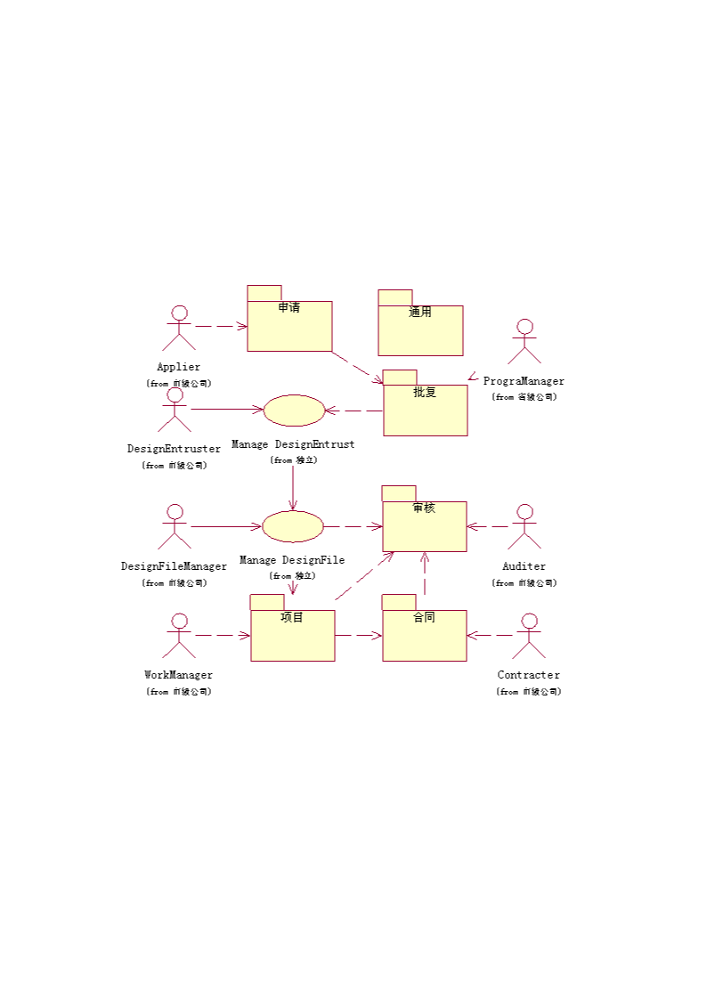

<!-- slide: 81 -->

## “申请”包的子视图

- 华 南 理 工 大 学
- 软 件 需 求 分 析 与 建 模
- <number>
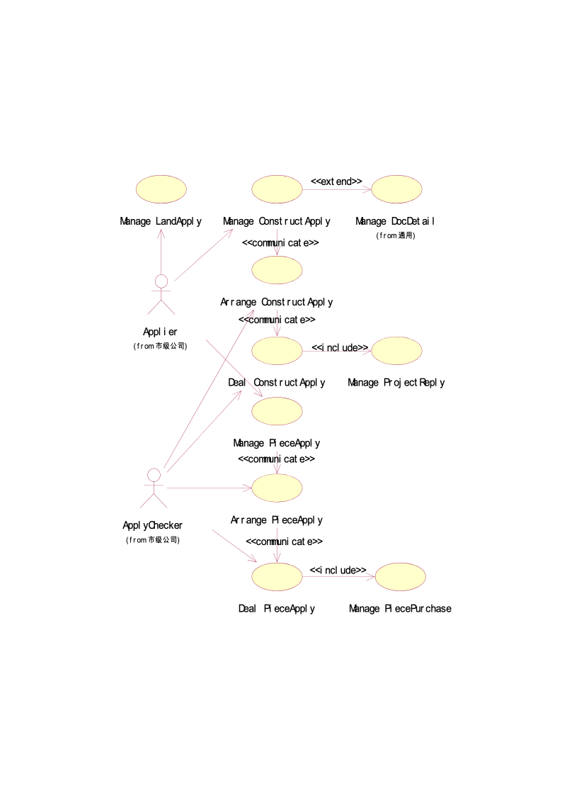

<!-- slide: 82 -->

## 用例的获取(续2)

- 华 南 理 工 大 学
- 软 件 需 求 分 析 与 建 模
- <number>
- 为了完整地描述用例，还需要知道执行者的某些典型功能能否被系统自动实现。
- 针对整个系统的问题的答案也可帮助我们获取用例。以下问题可供参考：
  - 系统需要何种输入输出？输入从何处来？输出到何处去？
  - 当前运行系统(也许是一些手工操作而不是计算机系统)的主要问题是什么？
- 在开发系统的用例图时，不同的设计者选取用例的数目也不相同。

<!-- slide: 83 -->

## V  小 结

- 华 南 理 工 大 学
- 软 件 需 求 分 析 与 建 模
- <number>
- 用例是由执行者创建、依据执行者的意图执行的。执行者直接或间接地命令该系统执行他所期望的用例。
- 一个用例必须至少与一个执行者相连。
- 一个用例必须是完整的：应有一个完整的描述；常见的错误是把用例分得太小。
- 用例要向执行者提供执行结果。如果它不能产生最终结果，这个用例就不是完整的。
- 活动图可以用来产生用例图。一个完整的活动图可以用来产生该用例图的全集。

<!-- slide: 84 -->

## 课堂练习

- 华 南 理 工 大 学
- 软 件 需 求 分 析 与 建 模
- <number>
- 现有一医院病房监护系统，病症监视器安置在每个病房，将病人的病症信号实时传送到中央监视系统进行分析处理。在中心值班室里，值班护士使用中央监视系统对病员的情况进行监控，根据医生的要求随时打印病人的病情报告，定期更新病历，当病症出现异常时，系统会立即自动报警, 并实时打印病人的病情报告，立及更新病历。
- 要求根据现场情景，对医院病房监护系统进行需求分析， 建立系统的用例模型。

<!-- slide: 85 -->

## 例： 医院病房监护系统

- 华 南 理 工 大 学
- 软 件 需 求 分 析 与 建 模
- <number>

- 产生
- 病情报告
- 监视病情
- 更新病历

- 一、情景分析
- 经过初步的需求分析，得到系统功能要求：
- 1、监视病员的病症（血压、体温、脉搏等）
- 2、定时更新病历
- 3、病员出现异常情况时报警。
- 4、随机地产生某一病员的病情报告。

<!-- slide: 86 -->

- 华 南 理 工 大 学
- 软 件 需 求 分 析 与 建 模
- <number>
- 二、简单的需求分析说明
- 系统名称：医院病房监护系统
- 根据分析系统主要实现以下功能：
- 1、病症监视器可以将采集到的病症信号（组合），格式化后实时的传送到中央监护系统。
- 2、中央监护系统将病人的病症信号开解后与标准的病症信号库里的病症信号的正常值进行比较，当病症出现异常时系统自动报警。
- 3、当病症信号异常时，系统自动更新病历并打印病情报告。

<!-- slide: 87 -->

- 华 南 理 工 大 学
- 软 件 需 求 分 析 与 建 模
- <number>
- 4、值班护士可以查看病情报告并进行打印。
- 5、医生可以查看病情报告，要求打印病情报告，也可以查看或要求打印病历。
- 6、系统定期自动更新病历。

<!-- slide: 88 -->

- 华 南 理 工 大 学
- 软 件 需 求 分 析 与 建 模
- <number>
- 三、建立系统的用例图
- 1、通过以下六个问题识别角色
- (1)谁使用系统的主要功能？
- (2)谁需要系统的支持以完成日常工作任务？
- (3)谁负责维护，管理并保持系统正常运行？
- (4)系统需要应付（或处理）哪些硬设备？
- (5)系统需要和哪些外部系统交互？
- (6)谁（或什么）对系统运行产生的结果（值）感兴趣？

<!-- slide: 89 -->

- 华 南 理 工 大 学
- 软 件 需 求 分 析 与 建 模
- <number>
- 通过回答这六个问题以后，再进一步分析可以识别出本系统的四个角色：值班护士，医生，病人，标准病症信号库。
- 角色描述模板
- 角色：病    人
- 角色职责：
- 提供病症信号
- 角色职责识别：
- 负责生成、实时提供
- 各种病症信号。
- 角色：值班护士
- 角色职责：
- 负责监视病人的病
- 情变化
- 角色职责识别：
- (1)使用系统主要功能
- (2)对系统运行结果感
- 兴趣
- 角色:标准病症信号库
- 角色职责：
- 负责向系统提供病症
- 信号的正常值
- 角色职责识别：
- (1)负责保持系统
- 正常运行
- (2)与系统交互
- 角色：医      生
- 角色职责：
- 对病人负责，负责
- 处理病情的变化
- 角色职责识别：
- (1)需要系统支持以完
- 成其日常工作
- (2)对系统运行结果感
- 兴趣
- 通过分析可以初步识别出系统的用例为：中央监护，病症监护，提供标准病症信号，病历管理，病情报告管理。顶层用例图为：

<!-- slide: 90 -->

- 华 南 理 工 大 学
- 软 件 需 求 分 析 与 建 模
- <number>
- 通过分析可以初步识别出系统的用例为：中央监护，病症监护，提供标准病症信号，病历管理，病情报告管理。顶层用例图为：
- 标准病症
- 信号库
- 提供标准
- 病症信号
- 病历管理
- 病人
- 医生
- 值班护士
- 病症监护
- 病情报
- 告管理
- 中央监护
- 《使用》
- 《使用》
- 《使用》
- 2、识别出系统的用例

<!-- slide: 91 -->

## 用例细化

- 华 南 理 工 大 学
- 软 件 需 求 分 析 与 建 模
- <number>
- 将用例细化，可以得到分解的用例：
- 1、中央监护
- 分解为： a）分解信号  将从病症监护器传送来的组合病症
- 信号分解为系统可以处理的信号。
- b）比较信号 将病人的病症信号与标准信号比较 。
- c）报警  如果病症信号发生异常（即高于峰值），
- 发出报警信号。
- d）数据格式化   将处理后的数据格式化以便写入
- 病历库 。
- 3、细化系统的用例

<!-- slide: 92 -->

- 华 南 理 工 大 学
- 软 件 需 求 分 析 与 建 模
- <number>
- 2、病症监护
- 分解为：
  - e）信号采集：采集病人的病症信号。
  - f）模数转化：将采集来的模拟信号转化为数字信号。
  - g）信号数据组合：将采集到的脉搏，血压等信号数据组合为一组信号数据。
  - h）采样频率改变：根据病人的情况改变监视器采样频率。
- 3、提供标准病症信号    i（此用例不分解）

<!-- slide: 93 -->

- 华 南 理 工 大 学
- 软 件 需 求 分 析 与 建 模
- <number>
- 4、病历管理
- 分解为：j） 生成病历
- k） 查看病历
- l） 更新病历
- m） 打印病历
- 5、病情报告
- 分解为：n）显示病情报告  在显示器上显示病情
- o）打印病情报告  在打印机打印病情报告

<!-- slide: 94 -->

- 华 南 理 工 大 学
- 软 件 需 求 分 析 与 建 模
- <number>
- 给出细化的用例图
- 病人
- 模数转化
- 数据格式化
- 值班护士
- 报警
- 信号采集
- 比较信号
- 标准病症
- 信号库
- 医生
- 信号数据组合
- 采样频率
- 改变
- 提供标准
- 病症信号
- 生成病历
- 查看病历
- 更新病历
- 打印病历
- 显示病情报告
- 打印病情报告
- 分解信号
- 《 Extend 》
- 《 Extend 》
- 《 Extend 》
- 《 uses》
- 《 uses》
- 《 uses》
- 《 uses》
- 《 uses》
- 《 uses》
- 《 uses》
- 《 uses》

<!-- slide: 95 -->

## 会议管理实例分析－需求

- 华 南 理 工 大 学
- 软 件 需 求 分 析 与 建 模
- <number>
- 会议是保证行政管理实施的手段，会议管理包括会议类别设置、会议室设置、会议申请、会议审核、会议通知、会议纪要、会议查询、会议归档。
- 会议类型设置是进行会议管理的基础，需要保存的信息包括：会议性质名称、备注，并可对会议类型设置进行修改和删除。会议室设置需要保存的信息包括：会议室名称、容纳人数、会议室资源、使用情况、说明，并可对会议室设置进行修改、删除以及查看使用情况。会议申请是由会议申请人草拟的会议安排，输入信息包括：会议性质、会议议题、预算、会议附件（有附件上传功能）、主持人、记录人员、参加人员、会议地点、会议室、会议开始时间、会议结束时间、会议内容、审批人。可以将会议申请暂存、也可发给审批人或者放弃该申请。

<!-- slide: 96 -->

- 华 南 理 工 大 学
- 软 件 需 求 分 析 与 建 模
- <number>
- 会议审核是办公室领导在阅读完申请后签署的修改意见，审核后可以发给办理人，让其发会议通知，或退回给会议申请人，由其发通知，接着由会议起草人起草会议纪要，内容包括：会议名称、纪要内容、附件（有附件上传功能）、记录员、管理员。会议纪要可以提交给会议申请人，由申请人归档或者直接保存。
- 会议查询包括：已开会仪查询、待开会议查询、会议纪要查询。待开会议查询显示信息包括：会议议题、主持人、地点、时间、与会人员，并可实现分页显示、删除、修改和结束会议。已开会议查询的显示信息和待开会议显示信息相同，可以对其进行删除。会议要的查询信息包括：会议名称、会议议题、主持人、开会时间、开会地点、与会人员，可以对会议纪要进行删除和修改和归档。

<!-- slide: 97 -->

## 步骤1－识别参与者

- 华 南 理 工 大 学
- 软 件 需 求 分 析 与 建 模
- <number>
- 1.角色识别:这是整个用例建模的第一步，那些人和事物能成为角色，首先要它是否要使用未来的系统，和系统发生交互行为，再者要看它使用未来的统是否对它来说具有经济价值，最后还要确定未来的系统是否要实现此需求特性。经过识别，确定一下系统角色：会议申请者，办公室主任，会议办理者，纪要起草人，参会者。

<!-- slide: 98 -->

## 步骤2－识别用例

- 华 南 理 工 大 学
- 软 件 需 求 分 析 与 建 模
- <number>
- 2.用例：在确定了系统角色以后，每一角色使用系统完成什么样的业务，就是用例，系统用例具有概括性和目标性，经过识别，确认一下系统用例：管理会议申请，获取会议纪要，管理会议纪要，分配会议室资源，发送会议信息，获取会议信息。

<!-- slide: 99 -->

## 步骤3－关系

- 华 南 理 工 大 学
- 软 件 需 求 分 析 与 建 模
- <number>
- 3.关系：在系统用例图中，主要识别角色和系统用例间的关系以及角色与角色之间的关系，根据用例的发起者不同，把角色和用例间的关联（通信）关系分为单向管理和双向关联，单向关联有：会议申请人和编辑会议申请，会议纪要起草人和编辑会议纪要，会议办理者和发送会议通知；双向关联有：办公室主任和分配会议室资源，参会者和获取会议信息。

<!-- slide: 100 -->

## 步骤4－总结系统需求

- 华 南 理 工 大 学
- 软 件 需 求 分 析 与 建 模
- <number>
- 4.系统：经过前面分析，未来系统将要实现的需求特征包含：编辑会议申请、编辑会议纪要、获取会议通知、分配会议室资源、发送会议通知，这些元素属于系统内，其余在系统外，属于系统环境。

<!-- slide: 101 -->

## 步骤5－顶层用例图

- 华 南 理 工 大 学
- 软 件 需 求 分 析 与 建 模
- <number>

<!-- slide: 102 -->

## 步骤6－细化

- 华 南 理 工 大 学
- 软 件 需 求 分 析 与 建 模
- <number>

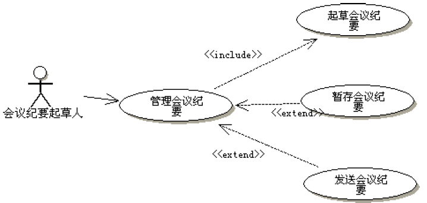

<!-- slide: 103 -->

## 步骤6－细化

- 华 南 理 工 大 学
- 软 件 需 求 分 析 与 建 模
- <number>

<!-- slide: 104 -->

## 步骤6－细化

- 华 南 理 工 大 学
- 软 件 需 求 分 析 与 建 模
- <number>

<!-- slide: 105 -->

## 步骤7－用例说明文档

- 华 南 理 工 大 学
- 软 件 需 求 分 析 与 建 模
- <number>
- 用例模型充分反映了角色和系统之间的关系，作为角色和系统之间交互的模型，显然缺乏行为细节描述，因此，需要一份书面的说明文档，象写契约一样，把双方的都要遵守的规则都写进去，用来描述用例的模板很多，没有统一规范，下面就一些常用描述元素做以概括介绍：
- （1）前置条件：用例执行前必须满足的条件，如果不满足条件，用例不被执行，一般与系统的上下文环境和参数限定有关.
- （2）后置条件：在用例结束时，系统必须所处的状态，以防止用例执行的结果不确定，影响后续用例的执行。

<!-- slide: 106 -->

- 华 南 理 工 大 学
- 软 件 需 求 分 析 与 建 模
- <number>
- （3）基本事件流：路径是从用户角度来描述系统的使用，它关注系统干什么，而不关怎样干。基本事件流是用例中最常发生的路径。
- （4）可选事件流：是系统合法的路径，但不是经常发生的路径。
- （5）异常事件流：指未来系统要捕获错误的路径。
- （6）参与者:触发用例的角色、系统、时间。
- （7）用例名称：就是用例图中用例名。

<!-- slide: 107 -->

- 华 南 理 工 大 学
- 软 件 需 求 分 析 与 建 模
- <number>
- （1）用例名称：起草会议申请
- 参与者：会议申请人。
- 前置条件：会议申请人有条件通过网络访问系统并已成功地登录系统。
- 后置条件：系统保存一份新的会议申请。
- 基本事件流：
  - 1.用户通过网络登录后成功访问系统。
  - 2.用户选择会议管理后，再选择浏览会议信息。
  - 3.浏览结束后用户选择查看暂存会议申请。
  - 4.在确认无合适的会议申请后，用户选择起草会议申请。
  - 5.用户输入会议申请的相关信息。
  - 6.会议申请经过校验后提交办公室主任。

<!-- slide: 108 -->

- 华 南 理 工 大 学
- 软 件 需 求 分 析 与 建 模
- <number>
- 可选事件流：
  - 1.用户发现有可用的暂存申请可以修改，系统进入修改会议用例界面。
  - 2.新起草的会议申请被暂存。
- 异常事件流：
  - 1.会议室已被预定，给出错误信息提示。
  - 2.会议信息校验失败，给出错误信息提示。

<!-- slide: 109 -->

## 本章需要掌握的知识点

- 华 南 理 工 大 学
- 软 件 需 求 分 析 与 建 模
- <number>
- （1）掌握如何利用用例图对软件的需求进行建模。
- （2）用例图的三个组成部分：执行者、系统边界和用例。
- （3）用例之间的各种关系，特别是包含与扩展。
- （4）执行者之间的关系。
- （5）掌握构造用例图的一般步骤。

<!-- slide: 110 -->

## Click to edit company slogan .

- <number>
- www.themegallery.com

