# 9.状态图

<!-- slide: 1 -->

## 软件需求分析与建模- 状态机和状态图

- <number>

<!-- slide: 2 -->

## 本章需要掌握的知识点

- 华 南 理 工 大 学
- 软 件 需 求 分 析 与 建 模
- <number>
- （1）掌握状态图的作用。
- （2）状态图的构成及其特点。
- （3）掌握状态图的画法和步骤。
- （4）状态图的建模步骤。

<!-- slide: 3 -->

## I  引  言

- 华 南 理 工 大 学
- 软 件 需 求 分 析 与 建 模
- <number>
- 在软件系统中有这样一类对象，
  - 它们一方面需要处理各种随机发生的事件序列，通过相应的动态行为产生对事件的响应
  - 另一方面，其特定时刻的动态行为取决于此对象在早些时刻的行为的结果。

<!-- slide: 4 -->

## I  引  言

- 华 南 理 工 大 学
- 软 件 需 求 分 析 与 建 模
- <number>
- 根据当前事件,以及对以前事件的响应的结果决定对当前事件的响应的软件对象的动态行为，称为是事件驱动的。
- 在UML里，最适合于描述这类动态行为的建模手段，就是状态机。
- 状态机
  - 用状态：记录以前的动态行为的结果，
  - 用变迁：描述软件对象对外来事件的响应以及响应的状态的变化。

<!-- slide: 5 -->

- 华 南 理 工 大 学
- 软 件 需 求 分 析 与 建 模
- <number>
- 例如：图1描述一个软件的图形用户界面的动态行为的状态机。
- 它描述的是一个位图观察器的图象浏览工具的动态行为。
- 它可以通过鼠标在窗口上拖动图象，以观察图象的不同局部。

<!-- slide: 6 -->

- 华 南 理 工 大 学
- 软 件 需 求 分 析 与 建 模
- <number>
- 图1. 状态机

<!-- slide: 7 -->

## 在UML中，除了状态机之外，还有一种为动态行为建模的手段，这就是交互图。
交互强调的是对象之间的互相协作，
通过软件对象的交互实现软件系统的设计功能。
状态机则强调的是
对象本身对对象外部发生的事件的响应及伴随的状态的变化。

- 华 南 理 工 大 学
- 软 件 需 求 分 析 与 建 模
- <number>

<!-- slide: 8 -->

- 华 南 理 工 大 学
- 软 件 需 求 分 析 与 建 模
- <number>
- 对状态机而言,它所能描述的对象是广义的。
- 状态机描述的对象
  - 可以是类的实例,
  - 可以是用例的实例，
  - 甚至可以是非软件对象。
- 对于任何一个对象，
  - 如果此对象的动态行为具有事件驱动的特性，就适合于用状态机来建模

<!-- slide: 9 -->

## 2、状态机的定义及构成

- 华 南 理 工 大 学
- 软 件 需 求 分 析 与 建 模
- <number>
- 状态机用于为具有事件驱动的特征的动态行为进行建模。
- 事件驱动的动态行为的特点：
  - 对象当前时刻的动态行为将取决于：当前的事件输入和此对象在以前时刻的动态行为产生的结果。
- 为描述这类动态行为，状态机内部设置了
  - 状态和变迁
- 在UML里，设有相应的图形符号以描述这些建模元素。

<!-- slide: 10 -->

- 华 南 理 工 大 学
- 软 件 需 求 分 析 与 建 模
- <number>
- 状态机：在类层次反映状态与状态转化的图，它是一个类的对象的所有可能的生命历程的模型。主要用来捕捉外部事件引起的变化，它将一个对象与其外部世界隔离开来独立考察其行为。不宜用来描述系统的整体运作（如有此要求，可用序图）。状态机用来描述界面和控制类业务比较合适。

<!-- slide: 11 -->

- 华 南 理 工 大 学
- 软 件 需 求 分 析 与 建 模
- <number>
- 状态是软件对象在其生存期内满足特定条件的存在，在此条件下，对象能执行特定的动作、或等待事件的发生。
- 状态被图形化表示为一个圆角矩形（图3）。
- 图 3. 状态

<!-- slide: 12 -->

- 华 南 理 工 大 学
- 软 件 需 求 分 析 与 建 模
- <number>
- 除了用圆角矩形表示的状态外, 还有两种特殊的状态，初始状态和终止状态。
- 状态机所在对象在创建后状态机产生的第一个变迁将从初始状态出发。
- 用带实心圆的圆环表示的状态称为状态机的终止状态（final state）。

<!-- slide: 13 -->

## 变迁

- 华 南 理 工 大 学
- 软 件 需 求 分 析 与 建 模
- <number>
- 变迁被定义为软件对象的两个状态之间的关系，表明在指定的事件发生后，在特定的条件下，对象执行指定的动作，并进入另一个状态。
- 变迁被图形化表示为
  - 连接两个状态的箭头，
  - 箭头起始端是变迁发生前的状态，
  - 箭头所指的状态是变迁完成后的状态。

<!-- slide: 14 -->

- 华 南 理 工 大 学
- 软 件 需 求 分 析 与 建 模
- <number>
- 如果对象的状态发生了沿变迁箭头所指的方向的变化，那么此变迁被称为被：激发（fire）。
- 变迁的激发，可以和特定的事件联系起来，这样的事件被称为触发事件(event trigger)。

<!-- slide: 15 -->

## 3、变迁的构成

- 华 南 理 工 大 学
- 软 件 需 求 分 析 与 建 模
- <number>
- 变迁用来描述：状态机所在的对象所处的状态的变换。
- 变迁由事件触发，变迁的激发还将伴随着特定的动作的执行。
- 在UML里，变迁由五个部分构成，它们是：
  - 起始状态
  - 目标状态
  - 触发事件(event trigger)
  - 触发条件(guard condition)
  - 变迁动作。

<!-- slide: 16 -->

- 华 南 理 工 大 学
- 软 件 需 求 分 析 与 建 模
- <number>
- （1）、起始状态和目标状态
- 变迁被激发之前对象所处的状态就是变迁的起始状态
- 变迁完成之后，对象的状态发生了变化，这时对象所处的状态就是变迁的，目标状态。
- 在绘制状态机时，
  - 变迁的起始状态位于表示变迁的箭头的起始位置；
  - 变迁的目标状态是表示变迁的箭头所指向的那个状态。

<!-- slide: 17 -->

- 华 南 理 工 大 学
- 软 件 需 求 分 析 与 建 模
- <number>
- 一个变迁可以有多个起始状态，
  - 这时，代表状态机所在对象中的多个控制流在变迁发生的时刻汇合为一个控制流。
- 一个变迁也可以有多个目标状态
  - 它表示状态机所在对象在变迁被激发的时刻其中的一个控制流被分解为多个控制流。

<!-- slide: 18 -->

## （2）、触发事件
变迁的触发事件描述的就是引发状态机所在对象的动作的事件。
触发事件是状态机在某变迁的起始状态状态下能接受的一个事件，此事件的发生使得变迁的激发成为可能。

（3）、触发条件
要使变迁被激发，状态机所在对象必须还满足触发条件。
触发条件是一个布尔表达。

- 华 南 理 工 大 学
- 软 件 需 求 分 析 与 建 模
- <number>

<!-- slide: 19 -->

- 华 南 理 工 大 学
- 软 件 需 求 分 析 与 建 模
- <number>
- （4）、变迁动作（action）
- 变迁动作是伴随着变迁的激发被执行的一个元计算。
- （5）、触发事件、触发条件、变迁动作的图形化表示
- 在绘制变迁时，变迁的触发事件、触发条件和变迁动作被表达成一个字符串被放置在表示变迁的箭头上。此字符串又被称为变迁的文字标记（text label）。变迁的文字标记的格式如下：
- 触发事件[触发条件]/变迁动作

<!-- slide: 20 -->

## 什么是状态图?

- 华 南 理 工 大 学
- 软 件 需 求 分 析 与 建 模
- <number>
- 状态图描述了一个对象或交互过程在它的生命周期中对一系列外界激励的所呈现出的不同状态以及它相应的响应和活动。
- 状态机用状态和瞬时过程的变化图形来表示是一个对象对外界激励下的响应。状态机一般附着在一个对象或具体的方法上。
- 状态图描述了一个状态机，在我们考虑的范围内，它们是同一件事。
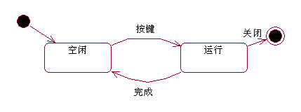

<!-- slide: 21 -->

- 华 南 理 工 大 学
- 软 件 需 求 分 析 与 建 模
- <number>
- 状态图：描述交互对对象内部的影响，交互图中的消息在这里变成外部事件对对象发出的命令，对象对这些命令的响应导致对象的状态发生变化。因此，从这个意义上说，状态图是顺序图的进一步细化，并且是对核心对象（选择核心对象的依据是看是否在多个交互图中有多个消息指向该对象）的细化。

<!-- slide: 22 -->

## 状态图的基本组成成分

- 华 南 理 工 大 学
- 软 件 需 求 分 析 与 建 模
- <number>
- 描述状态图的图符元素有:状态图符、迁移图符、起始状态、终止状态、条件判定、发出信号、接收信号和并发等。
- 一个对象的状态图就是由以上这些不同的图符元素排除组合而成。

<!-- slide: 23 -->

## 对象状态的基本描述图符

- 华 南 理 工 大 学
- 软 件 需 求 分 析 与 建 模
- <number>
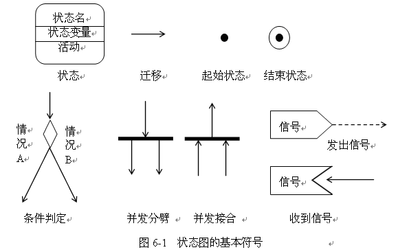

<!-- slide: 24 -->

- 华 南 理 工 大 学
- 软 件 需 求 分 析 与 建 模
- <number>
- 状态图的要素
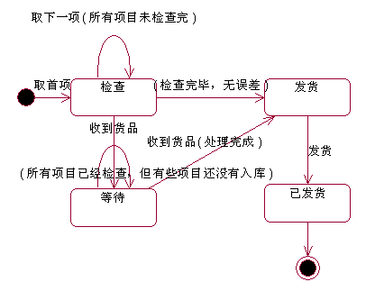
- 开始状态
- 事件
- 状态
- 结束状态
- 转移

<!-- slide: 25 -->

- 华 南 理 工 大 学
- 软 件 需 求 分 析 与 建 模
- <number>
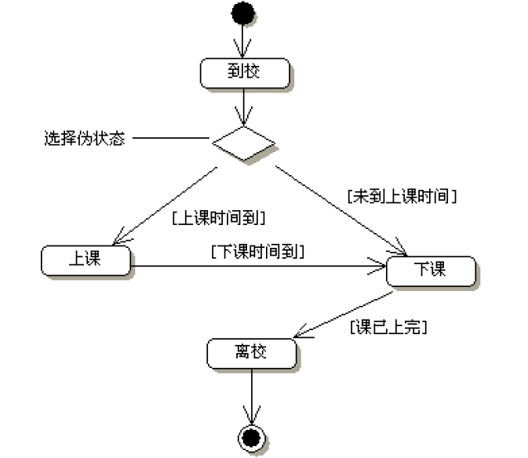

<!-- slide: 26 -->

## 打电话的状态图

- 华 南 理 工 大 学
- 软 件 需 求 分 析 与 建 模
- <number>
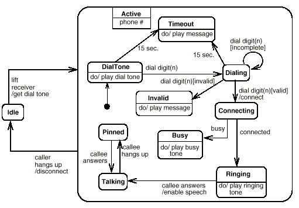

<!-- slide: 27 -->

## （1）状态的定义

- 华 南 理 工 大 学
- 软 件 需 求 分 析 与 建 模
- <number>
- 状态表示的是一个对象或交互过程中的一个特定阶段：
  - 状态对应一段有限的时间
  - 状态对应于一组对象属性的值。
- 状态的图符用一个圆角的矩形框表示。

<!-- slide: 28 -->

- 华 南 理 工 大 学
- 软 件 需 求 分 析 与 建 模
- <number>
- 一个完整的状态包括三个组成部分，它们是：
  - 状态名
  - 状态变量
  - 活动
- 状态名
- 状态变量
- 活动

<!-- slide: 29 -->

- 华 南 理 工 大 学
- 软 件 需 求 分 析 与 建 模
- <number>
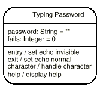
- Example of a State
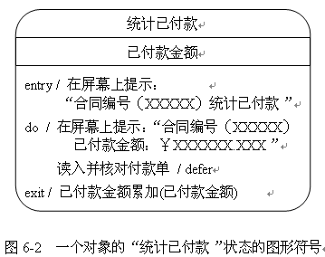

<!-- slide: 30 -->

- 华 南 理 工 大 学
- 软 件 需 求 分 析 与 建 模
- <number>
- （1）、状态名
- 由一个字符串构成，用以标识不同的状态。
- 状态名字可以省略，称为匿名状态。
- （2）、状态变量
- 状态图所描述的类的属性，也可以是临时变量。

<!-- slide: 31 -->

- 华 南 理 工 大 学
- 软 件 需 求 分 析 与 建 模
- <number>
- （3）、活动
- 列出了在该状态时要执行的事件和动作，是任选项，活动有三个标准活动：
- entry事件：指明在进入该状态时的特定动作；
- exit事件：指明退出该状态时的特定动作；
- do事件：指明在该状态中执行的动作；

<!-- slide: 32 -->

- 华 南 理 工 大 学
- 软 件 需 求 分 析 与 建 模
- <number>
- 在UML里，状态的入口/出口动作动作指的是当状态机进入或退出此状态时，分别应执行的动作。
- 在状态里书写入口/出口动作的语法和变迁的语法类似，所不同的是在事件的位置上分别用entry和exit代替。	入口动作的语法是：entry/动作出口动作的语法是：exit/动作

<!-- slide: 33 -->

## 内部变迁

- 华 南 理 工 大 学
- 软 件 需 求 分 析 与 建 模
- <number>
- 状态的内部变迁是不会引起状态变化的变迁，此变迁的触发不会导致状态的入口/出口动作的被执行。
- 图形表示
  - 由于内部变迁不引起状态的转换，
  - 因此它的文字标识（text lable）被附加在表示状态的圆角矩形内部,
  - 不使用箭头进行图形标识

<!-- slide: 34 -->

## 延迟事件

- 华 南 理 工 大 学
- 软 件 需 求 分 析 与 建 模
- <number>
- 指某些事件可能不能被马上处理，但也不能被忽略，必须在下一个状态处理。
- 在UML里，称为延迟事件。
- 当一个内部变迁的触发事件是延迟事件时，
- 在此变迁的动作的部分使用UML的保留动作defer代替。

<!-- slide: 35 -->

## 状态的分类和属性

- 华 南 理 工 大 学
- 软 件 需 求 分 析 与 建 模
- <number>
- 对象的状态属性可分为：嵌套状态(组合状态)、顺序状态、历史状态、同步状态和并发状态。
- 广义上来讲，对象属性的任何不同值的组合就是对象的一个状态，全部状态的集合描述了一个对象的状态空间。
- 注意：
- （1）对象生存期中状态的数量有限；
- （2）每个状态持续时间也有限；

<!-- slide: 36 -->

## 子状态

- 华 南 理 工 大 学
- 软 件 需 求 分 析 与 建 模
- <number>
- 在UML里，一个状态内部可以包含其它状态，它们在此状态的内部构成了另一个状态机。
- 在UML里，子状态被定义为是包含在某一状态内部的状态。
- 包含子状态的状态称为复合状态（composite state）。
- 不包含子状态的状态称为简单状态(simple state)。

<!-- slide: 37 -->

## 子状态的定义

- 华 南 理 工 大 学
- 软 件 需 求 分 析 与 建 模
- <number>
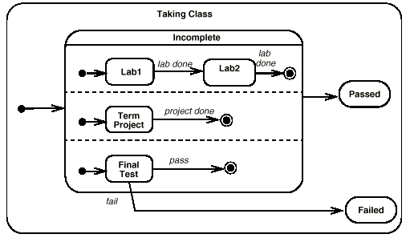

<!-- slide: 38 -->

- 华 南 理 工 大 学
- 软 件 需 求 分 析 与 建 模
- <number>
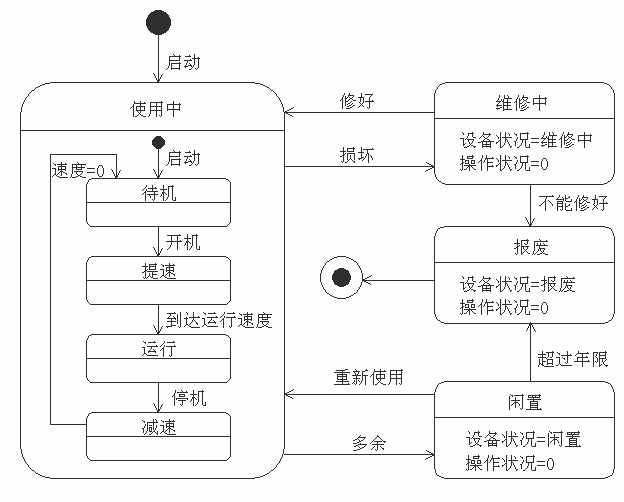

<!-- slide: 39 -->

- 华 南 理 工 大 学
- 软 件 需 求 分 析 与 建 模
- <number>
- 简单状态对应着一个动作，而组合活动中每个被嵌套的状态图对应着该组合状态内正在进行的一个活动。在UML中动作和活动的含义是不一样的。
- 动作：一组可执行的语句，具有迁移性、原子性和连续性。
- 活动：一组可执行的动作，具有有限性和非原子性。

<!-- slide: 40 -->

- 华 南 理 工 大 学
- 软 件 需 求 分 析 与 建 模
- <number>
- （1）、顺序状态
- 表示状态的顺序迁移。如果一个复合状态的子状态机所在的对象在其生存期内的任一时刻只能处于一个子状态,则这些子状态被称为串行子状态（sequential substate）。

<!-- slide: 41 -->

- 华 南 理 工 大 学
- 软 件 需 求 分 析 与 建 模
- <number>
- 图4. 串行子状态

<!-- slide: 42 -->

- 华 南 理 工 大 学
- 软 件 需 求 分 析 与 建 模
- <number>
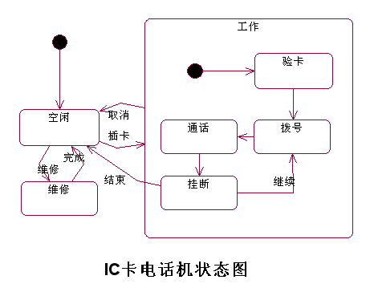
- 组合状态
- 子状态

<!-- slide: 43 -->

## 状态的并发迁移和同步

- 华 南 理 工 大 学
- 软 件 需 求 分 析 与 建 模
- <number>
- 一个状态可以有多个并发的子状态。可以复合迁移的同步并发迁移图来表示并发子状态。
- 复合迁移就是由条件判断、并发分叉和并发连接这些图符来表示。

<!-- slide: 44 -->

- 华 南 理 工 大 学
- 软 件 需 求 分 析 与 建 模
- <number>
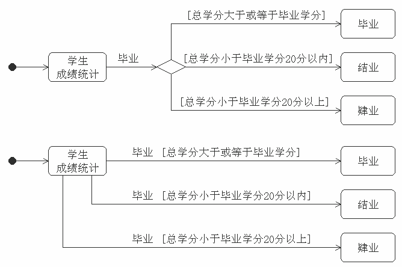

<!-- slide: 45 -->

- 华 南 理 工 大 学
- 软 件 需 求 分 析 与 建 模
- <number>
- 图. 并发状态图

<!-- slide: 46 -->

- 华 南 理 工 大 学
- 软 件 需 求 分 析 与 建 模
- <number>
- 并发状态：指一个对象在同一时刻可以处在多种状态。
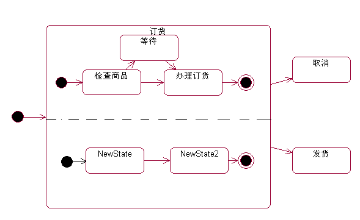
- 付款确认
- 已确认
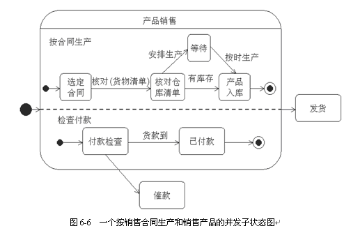

<!-- slide: 47 -->

## 并发状态之间需要通信，或具有确定的时序关系，称为并发中的同步。

- 华 南 理 工 大 学
- 软 件 需 求 分 析 与 建 模
- <number>
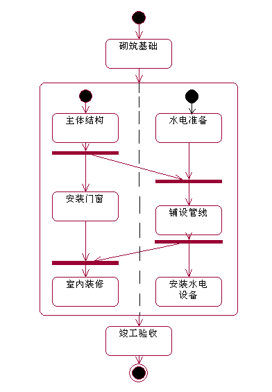

<!-- slide: 48 -->

- 华 南 理 工 大 学
- 软 件 需 求 分 析 与 建 模
- <number>
- （2）、历史状态
- 历史状态（history state）。
- 历史状态是一个特殊的子状态，它记录了复合状态被转出时的活跃子状态。
- 在绘制状态机时，其中的历史状态被表示成一个被圆环包围的字母H(图5)。

<!-- slide: 49 -->

- 华 南 理 工 大 学
- 软 件 需 求 分 析 与 建 模
- <number>
- 用这种方法绘制的历史状态又被称为
- 浅层历史状态(shallow history)。
  - 浅层历史状态只记忆被转出变迁打断时最外层的活跃状态。
- 如果需要历史状态记忆最深层的内嵌活跃子状态（即不再包含子状态的活跃子状态），则应使用
- 深层历史状态（deep history state）。
  - 深层历史状态在绘制时用一个被圆环包围的带星号的字母H表示（H*, 见图5）。
- 注意：历史状态指示器是一个伪状态，可以有几个进入它的状态迁移，但没有离开它的状态迁移。

<!-- slide: 50 -->

- 华 南 理 工 大 学
- 软 件 需 求 分 析 与 建 模
- <number>
- 图5.浅层和深层历史状态

<!-- slide: 51 -->

- 华 南 理 工 大 学
- 软 件 需 求 分 析 与 建 模
- <number>
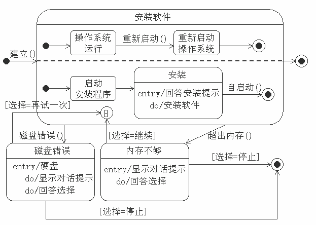

<!-- slide: 52 -->

## 状态迁移的触发和描述

- 华 南 理 工 大 学
- 软 件 需 求 分 析 与 建 模
- <number>
- 状态迁移触发表示当一个特定的事件发生或某些条件满足时，一个源状态下的对象将完成一些特定的动作，称为迁移触发。
- 描述状态迁移的形式化语法格式如下：
- 事件[条件]/动作表达式  发送子句
  - 事件：指已发生并可能引发某种活动的一件事；
  - [条件]：由方括号围起的关系或逻辑表达式；
  - 动作表达式：一个触发状态迁移时可执行的过程表达式。
  - 发送子句：动作的一个特例，说明调用的事件名（操作）是哪个对象的。

<!-- slide: 53 -->

## 转移(transition): 是一个状态向另外一个状态的转换。对象处在源状态时,发生一个事件,如果条件满足,则执行相应的动作,对象由源状态转移到目标状态。
 转移用箭头表示，如果没有标有事件，则本转移为自动转移。

- 华 南 理 工 大 学
- 软 件 需 求 分 析 与 建 模
- <number>

- 转移

<!-- slide: 54 -->

## 转移的类型

- 华 南 理 工 大 学
- 软 件 需 求 分 析 与 建 模
- <number>
- ①  自转移: 源状态和目标状态为同一状态的转移。
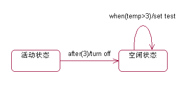
- 自转移

<!-- slide: 55 -->

## ②  自动转移: 一个 状态根据本状态的有关情况，自动触发进入目标状态，在转移上没有事件。

- 华 南 理 工 大 学
- 软 件 需 求 分 析 与 建 模
- <number>

- 自动转移
- ③  条件转移: 通过分支判断所确定的转移。
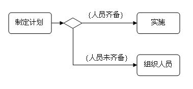
- 条件转移

<!-- slide: 56 -->

## （1）事件

- 华 南 理 工 大 学
- 软 件 需 求 分 析 与 建 模
- <number>
- 从状态图的角度看，事件起到了触发状态变换的作用。事件可能有不同的类型（这些类型不必是互斥的）：
  - 某个条件得到了满足。这种类型被记为警卫条件(guard condition)而无须事件名
  - 收到另一个对象的一个信号。这种类型事件通常有一个事件名代表这个触发事件收到了一个关于所属对象的方法调用。这种类型事件通常有一个事件名代表这个调用表示从某一个事件或状态开始的一个时间约束。通常记为一个时间约束表达式

<!-- slide: 57 -->

## 事件的表达

- 华 南 理 工 大 学
- 软 件 需 求 分 析 与 建 模
- <number>
- 一个外部对象的信号或对内部方法的调用可用下列方法来描述：
- event-name (comma-separated-parameter-list )
- 式中 parameter 的格式:
- parameter-name ‘:’ type-expression
- 参数的表示方法和类中属性的定义是一样的。

<!-- slide: 58 -->

## 事件的种类

- 华 南 理 工 大 学
- 软 件 需 求 分 析 与 建 模
- <number>
- 1、状态内部事件
  - 如：入口事件、出口事件、do事件和自定义事件等。
- 2、消息
  - 包括信号事件和调用事件
- 3、时间事件
  - 包括：after事件、defer事件、when事件。

<!-- slide: 59 -->

## 时间事件

- 华 南 理 工 大 学
- 软 件 需 求 分 析 与 建 模
- <number>
- 1）after事件
  - 以关键字after（时间表达式）说明，“/”后边跟有动作。例如after(5分钟)/停止
- 2）defer事件
  - 格式为事件名/defer。
  - 延迟事件在本状态中不进行处理，而将其推迟到下一个状态再处理。
- 3）When事件
  - 以关键字（逻辑表达式）说明，后面跟有“/”表示动作。例如：when(温度>140）/暂停

<!-- slide: 60 -->

## 状态迁移的条件

- 华 南 理 工 大 学
- 软 件 需 求 分 析 与 建 模
- <number>
- 状态迁移的条件是由一个方括号围起的关系或逻辑表达式。如果状态迁移中既有事件又有条件，则表示仅当这个事件发生并且条件为真是相应的状态迁移才被触发。

<!-- slide: 61 -->

## 动作表达式

- 华 南 理 工 大 学
- 软 件 需 求 分 析 与 建 模
- <number>
- 动作表达式是一个触发状态迁移时可执行的过程表达式，表达式中可引用该状态所表示的对象的属性、操作，或者事件中的参数。

<!-- slide: 62 -->

## 简单状态变化的表达

- 华 南 理 工 大 学
- 软 件 需 求 分 析 与 建 模
- <number>
- 简单状态变化指的是同一个对象的两个状态之间的变化。它表示一个对象从一个状态进入了另一个状态，表示当一个条件满足时要发生的一个事件。整个事件可以有参数。这些参数可能用于描述这个变化过程的活动之中，也可能用于下一个状态的初始活动。
  - 变化是用一根带有实心箭头的直线来表示的。该直线可以有一个用字符串表示的标识：
    - event-signature ‘[’guard-condition ‘]’ ‘/’action-expression ‘^’ send-clause
  - 其中的事件签名 (event-signature) 描述了一个事件以及它的参数：event-name ‘(‘ parameter ‘,’…’)’

<!-- slide: 63 -->

## 简单状态变化的表达

- 华 南 理 工 大 学
- 软 件 需 求 分 析 与 建 模
- <number>
- 发送说明 “send clause”是一类特殊的活动，它的表达格式为：
  - destination-expression ‘.’destination-message-name ‘(‘argument’,’. . . ‘)’
  - 式中的目的地表达式 “destination-expression”是一个表达式，经过计算可演绎为一个或多个具体的接受对象。接受对象的信息名“destination-message-name”说明了接受对象的信息的名称。
  - 发送子句用来说明在两个状态的迁移期间发送的消息所调用的事件是属性哪个对象的。

<!-- slide: 64 -->

## Example of a Send Clause

- 华 南 理 工 大 学
- 软 件 需 求 分 析 与 建 模
- <number>
  - Example
    - right-mouse-down (location) [location in window] / object := pick-object (location)^ object.highlight ()
    - 一个变化可能含有多个发送说明，这些活动和发送说明的顺序关系到它们执行的次序。

<!-- slide: 65 -->

- 华 南 理 工 大 学
- 软 件 需 求 分 析 与 建 模
- <number>
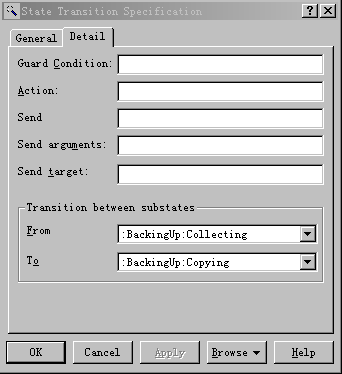
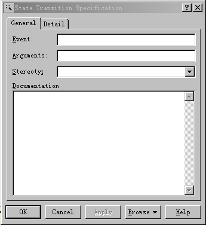

<!-- slide: 66 -->

## 信息的传送

- 华 南 理 工 大 学
- 软 件 需 求 分 析 与 建 模
- <number>
- 信息通过一个活动由一个对象发给另一个（一些）对象。因此它往往表现从一个状态图到另一个（些）状态图的信息传递。
- 信息的发送方可以是：
  - 一个状态变化；传递的信息是事件激励结果的一部分
  - 一个对象；
- 信息的接受方可以是：
  - 一个对象；
  - 一个状态变化
  - 一个类
- 对象间的信息传递用带箭头的虚线表示。

<!-- slide: 67 -->

- 华 南 理 工 大 学
- 软 件 需 求 分 析 与 建 模
- <number>
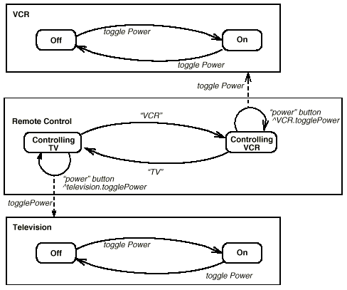
- 信息传送举例

<!-- slide: 68 -->

## 状态图的作用

- 华 南 理 工 大 学
- 软 件 需 求 分 析 与 建 模
- <number>
- 状态图: 用来描述一个对象在其生命周期中所表现出来的状态和行为。
- 当在系统建模过程中需要描述某个事物或对象的不同状态，以及状态之间转移的事件和动作时，用状态图。
- 但状态图并不是对每一个对象都需要的。

<!-- slide: 69 -->

## 实例1：图书馆中“图书”的状态图

- 华 南 理 工 大 学
- 软 件 需 求 分 析 与 建 模
- <number>

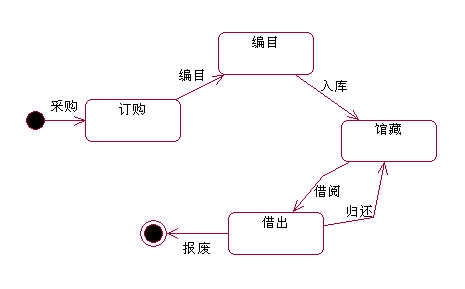

<!-- slide: 70 -->

## 实例2：OS中“进程”的状态图

- 华 南 理 工 大 学
- 软 件 需 求 分 析 与 建 模
- <number>

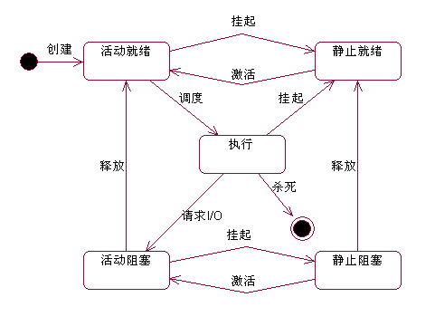

<!-- slide: 71 -->

## 实例3：电梯的状态图

- 华 南 理 工 大 学
- 软 件 需 求 分 析 与 建 模
- <number>
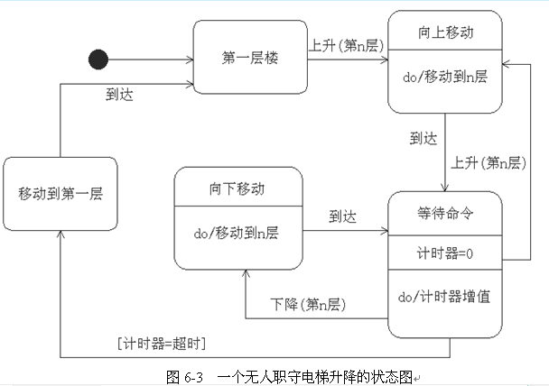

<!-- slide: 72 -->

## 状态图的建模分析步骤

- 华 南 理 工 大 学
- 软 件 需 求 分 析 与 建 模
- <number>
- （1）首先要确定进行系统控制的对象，可以从前面分析的顺序图中寻找。
- （2）确定对象的起始状态和结束状态。
- （3）在对象的整个生命周期寻找有意义的控制状态。
- （4）寻找状态之间的转换。
- （5）补充引起转换的事件。
- （6）UML建模工具画状态图。
- （7）补充必要的文档。

<!-- slide: 73 -->

- 华 南 理 工 大 学
- 软 件 需 求 分 析 与 建 模
- <number>
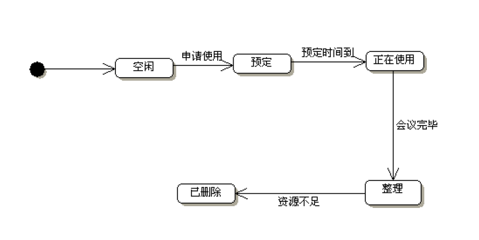
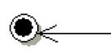

<!-- slide: 74 -->

## Click to edit company slogan .

- <number>
- www.themegallery.com

