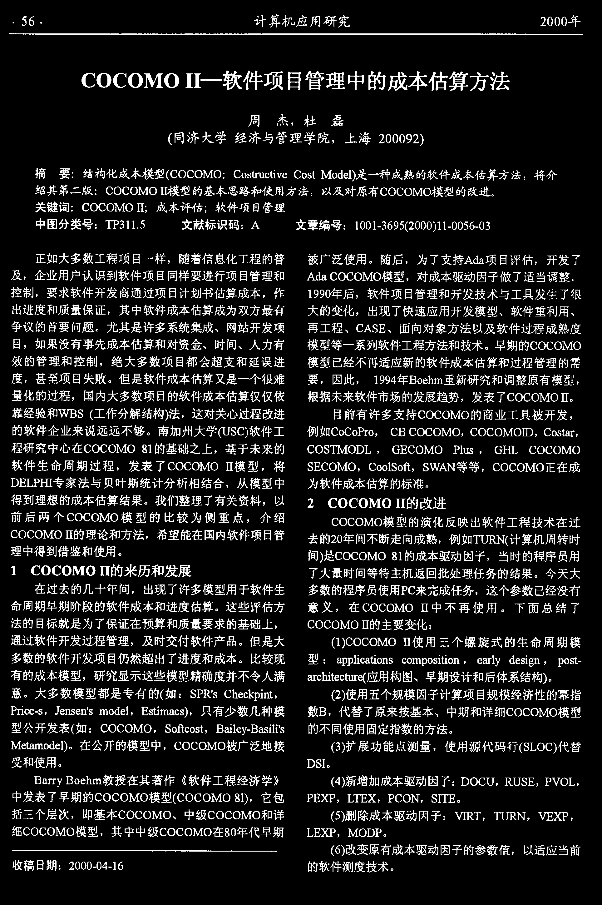
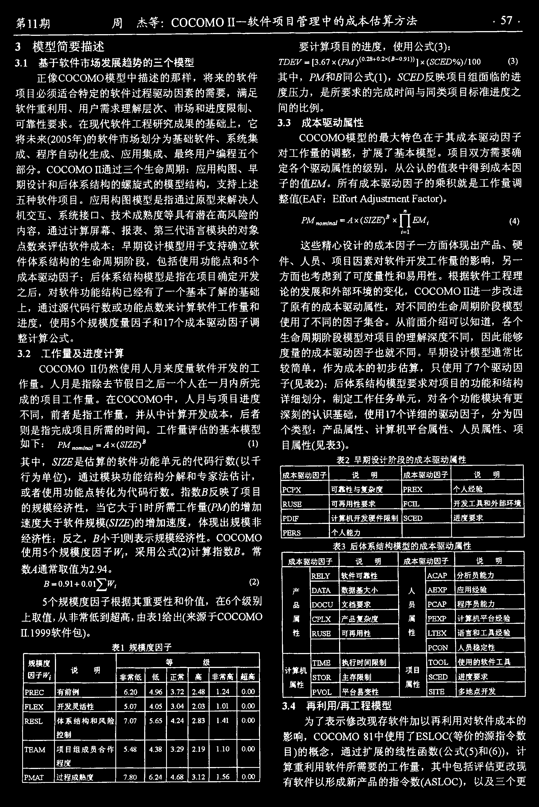
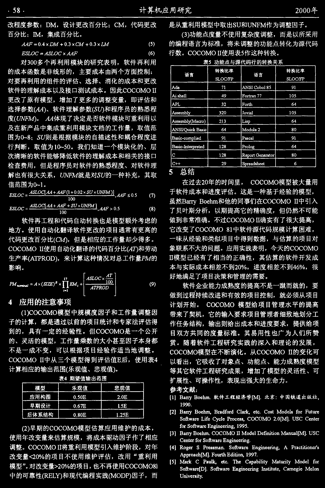

# COCOMOII_软件项目管理中的成本估算方法

<!-- page: 1 -->

 
计算机应用研究
 ! ! ! 年

∀# ∀# ∃# %%一& 软件项目管理中的成本估算方法

,
杜
磊
∋同济大学经济与管理学院

周
杰

,
上海加! ( )

∗
结构化成本模型∋+ # ∀# ∃# ∗
∀,−./0 +.1 23
+ ,−. ∃34 35 )是一种成熟的软件成本佑算方法

,
将介

摘
要

∗
∀# ∀# ∃# %%模型的基本思路和使用方法

,
以及对原有∀# ∀# ∃#模型的改进

6

绍其第二版

关键词∗
∀# ∀# ∃# 57
成本评枯7 软件项目管理

6 
文献标识码

一:  (∋ !! ! )%%

∗
;
文章编号

一! ! 

∗89 : % %

∗
%!! %

一! :

中图分类号

,
为了支持; 4 ϑ 项目评估

,
随着信息化工程的普

正如大多数工程项目一样

,
开发了

被广泛使用

。随后

, 对成本驱动因子做了适当调整

; 4 ϑ ∀# ∀# ∃# 模型

,
企业用户认识到软件项目同样要进行项目管理和

。

及

%( (! 年后

,
要求软件开发商通过项目计划书估算成本

,
作

,
软件项目管理和开发技术与工具发生了很

控制

,
其中软件成本估算成为双方最有

出进度和质量保证

、
软件重利用

,
出现了快速应用开发模型

、

大的变化

、网站开发项

。尤其是许多系统集成

争议的首要问题

、
∀; Κ Α

、面向对象方法以及软件过程成熟度
模型等一系列软件工程方法和技术

再工程

。早期的∀# ∀# ∃#

、时间

,
如果没有事先成本估算和对资金

、人力有

目

,
绝大多数项目都会超支和延误进
度

效的管理和控制

模型已经不再适应新的软件成本估算和过程管理的需

,
%((Ν 年= # 3 Φ1 Ε 重新研究和调整原有模型

,
甚至项目失败

。但是软件成本估算又是一个很难

,
因此

,

要

,
发表了∀# ∀# ∃# 5,

,
国内大多数项目的软件成本估算仅仅依

量化的过程

根据未来软件市场的发展趋势

靠经验和< = −∋工作分解结构)法

目前有许多支持∀# ∀#∃# 的商业工具被开发

,
这对关心过程改进

,

, ∀# ∀#∃#Δ≅

例如∀, ∀, 9/,
,
∀= ∀# ∀#∃#

。南加州大学∋> −∀) 软件工

,
∀, −址

的软件企业来说远远不够

,

程研究中心在∀# ∀#∃#
?% 的基础之上

,
基于未来的

,
Ο Χ 工
∀# ∀# ∃#

∀# Κ 下∃# ≅Β

,
Ο Α ∀#∃#
950−

,
∀, , 5−, Λ.

,
发表了∀# ∀# ∃#
且模型

,
∀# ∀# ∃# 正在成

,
Κ 认叭Π 等等

,
将

ΚΑ ∀#∃#

软件生命周期过程

≅ΑΒ 9ΧΔ 专家法与贝叶斯统计分析相结合

,
从模型中
得到理想的成本估算结果

。

为软件成本估算的标准

,
以

。我们整理了有关资料

∀# ∀#∃# 55的改进

前后两个∀# ∀# ∃# 模型的比较为侧重点

,
介绍

∀# ∀# ∃# 模型的演化反映出软件工程技术在过

+ # ∀# ∃# Ε 的理论和方法

,
希望能在国内软件项目管

,
例如8 > Θ Π∋计算机周转时

去的 ! 年间不断走向成熟

。

理中得到借鉴和使用

间)是+ , + ! ∃!
?% 的成本驱动因子

,
当时的程序员用

%
∀# ∀# ∃# 55的来历和发展

。今天大
多数的程序员使用9∀来完成任务

了大量时间等待主机返回批处理任务的结果

,
出现了许多模型用于软件生

在过去的几十年间

,
这个参数已经没有

,
在∀# ∀# ∃!
Ε 中不再使用

。这些评估方

命周期早期阶段的软件成本和进度估算

。
下面总结了

意义

∀# ∀# ∃# Χ 的主要变化

,

法的目标就是为了保证在预算和质量要求的基础上

∗

∋%)∀, + ! ∃,
Ε 使用三个螺旋式的生命周期模

,
及时交付软件产品

。但是大

通过软件开发过程管理

,
Ρ , −.&

∗
即Ρ 51 + ϑ.1 , Ε −
+ , / Β9 , −1.1 ,Ε

,
3ϑ/ 5Μ
4 3 溢,

多数的软件开发项目仍然超出了进度和成本

。
比较现
有的成本模型

型

肛+Φ1. 3 + .0/ 叹应用构图

,
研究显示这些模型精确度并不令人满

、早期设计和后体系结构)

。

∗
−9又
+ Φ3 +Γ9 1Ε.

。大多数模型都是专有的∋如

,

∋ )使用五个规模因子计算项目规模经济性的幂指
数=

意

,
Α −.1 Ιϑ+

−Ι, 4 3 5

、
中期和详细∀# ∀#∃# 模型

9五3 3
一−,
Η3Ε−3Ε5

−)

,
只有少数几种模

,
代替了原来按基本

,
Κ , Λ.+

6 = ϑ −151
, −

,
= ϑ1 53 Μ

∗
+ ! ∀, ∃#

, −.

型公开发表∋如

。

的不同使用固定指数的方法

∃3.ϑ Ι , 43 5)

,
+ , + ! ∃# 被广泛地接

,
使用源代码行∋Κ Β , +) 代替

。在公开的模型中

∋: )扩展功能点测量

。

受和使用

≅Κ Δ

。

=ϑ/ Μ = ,3 ΦΙ 教授在其著作《软件工程经济学》

∋Ν )新增加成本驱动因子

∗≅# ∀>

,
Θ > Κ Α

,
Ρ Σ , Β

,

中发表了早期的∀, ∀# ∃# 模型∋+ , ∀, ∃,
?%)

,
它包

9Α Τ9
,
> 尼Τ

,
9∀# Π
,
Κ Δ8 Α

。

,
即基本∀# ∀# ∃#

、中级∀# ∀# ∃# 和详

∗
Σ ΔΘ 8

括三个层次

,
8 > Θ Π
,
2 Α Τ Ρ
,

∋ )删除成本驱动因子

,
其中中级∀# ∀# ∃# 在?! 年代早期

细∀# ∀# ∃# 模型

ΒΑ Τ卫

,
∃# ≅9

。

∋ )改变原有成本驱动因子的参数值

,
以适应当前

∗
 ! !!

一!Ν

一%

收稿日期

。

的软件测度技术

<!-- page: 2 -->

∗
∀# ∀# ∃# Ε 一软件项目管理中的成本枯算方法
 Υ

第Ε 期
周
杰等

,
使用公式∋:)

:
模型简要描述

∗

要计算项目的进度

Ψ ∋召+ Α 刀![!)
 %! !
∋: )

/ # Α 犷二Ξ: 石Υ
Ψ ∋愚了)∋! ?
Ω , ς Ψ ∋刀一! ( %))Ζ

6
%
基于软件市场发展趋势的三个模型

:

, 外了和= 同公式∋%)

正像+ ! ∀# ∃# 模型中描述的那样

,
Κ ∀Α ≅反映项目组面临的进

其中

,
将来的软件

,
满足

,
是所要求的完成时间与同类项目标准进度之

项目必须适合特定的软件过程驱动因素的需要

度压力

、市场和进度限制

、

、用户需求理解层次

。

间的比例

软件重利用

:6
:
成本驱动属性

,
它

可靠性要求

。
在现代软件工程研究成果的基础上

∀# ∀# ∃# 模型的最大特色在于其成本驱动因子

将未来∋ !! 年)的软件市场划分为基础软件

、系统集

,
扩展了基本模型

。
项目双方需要确
定各个驱动属性的级别

、应用集成

对工作量的调整

、程序自动化生成

、最终用户编程五个

成

。
∀# + # ∃# Ε 通过三个生命周期

,
从公认的值表中得到成本因

、早

∗
应用构图

部分

。所有成本驱动因子的乘积就是工作量调

子的值皿了

,
支持上述

期设计和后体系结构的螺旋式的模型结构

0 沈Ι
3 Ε1 ]ϑ +. ,/)

二Α Λ, /. ; 4∴

整傲Α ;Λ

。应用构图模型是指通过原型来解决人

。

五种软件项目

刀Ψ Λ5 甜

、系统接口

、技术成熟度等具有潜在高风险的

。口, ,
‘ 一;
Ψ 邝  助

机交互

9∃

‘

,
通过计算屏幕

、报表

、第三代语言模块的对象

内容

∗
早期设计模型用于支持确立软

、硬
件

这些精心设计的成本因子一方面体现出产品

点数来评估软件成本

,
包括使用功能点和 个

、人员

、项目因素对软件开发工作量的影响

,
另一

件体系结构的生命周期阶段

。根据软件工程理

方面也考虑到了可度量性和易用性

∗
后体系结构模型是指在项目确定开发

成本驱动因子

,
∀# ∀# ∃# Ε 进一步改进

论的发展和外部环境的变化

之后

,
对软件功能结构己经有了一个基本了解的基础

,
对不同的生命周期阶段模型
使用了不同的因子集合

上

,
通过源代码行数或功能点数来计算软件工作量和

了原有的成本驱动属性

,
使用 个规模度量因子和%Υ 个成本驱动因子调

。从前面介绍可以知道

,
各个

进度

,
因此能够
度量的成本驱动因子也就不同

生命周期阶段模型对项目的理解深度不同

整计算公式

。

。早期设计模型通常比

%
工作量及进度计算

∀# + # ∃#
5 仍然使用人月来度量软件开发的工

,
只使用了Υ 个驱动因

,
作为成本的初步估算

较简单

∗
后体系结构模型要求对项目的功能和结构

子∋见表 )

。人月是指除去节假日之后一个人在一月内所完

作量

。在∀# ∀# ∃# 中

,
制定工作任务单元

,
对各个功能模块有更

,
人月与项目进度

详细划分

成的项目工作量

,
使用%Υ 个详细的驱动因子

,
并从中计算开发成本

,
后者

,
分为四

,
前者是指工作量

不同

深刻的认识基础

∗
产品属性

、计算机平台属性

、人员属性

、项

则是指完成项目所需的时间

。
工作量评估的基本模型
如下

个类型

目属性∋见表: )

∗
9∃

。, 、,
一;
、俩吃匀

,
∋%)

。

,
‘女ςΑ 是估算的软件功能单元的代码行数∋以千

表
早期设计阶段的成本驱动属性

其中

行为单位)

,
通过模块功能结构分解和专家法估计

,

成本驱动因子
说
明
成本驱动因子
说
明

9∀9Τ
可书性与复杂度
9Θ Α Τ
个人经验

。指数= 反映了项目

或者使用功能点转化为代码行数

Θ > −Α
可再用性要求
]∀ΔΒ
开发工具和外部环境

,
当它大于% 时所需工作量∋刀帅的增加
速度大于软件规模体伦万)的增加速度

的规模经济性

9≅Δ]
计算机开发硬件限制
Κ > 匕>
进度要求

,
体现出规模非

9Α Θ Κ
个人能力

。
∀# ∀# ∃#
使用个规模度因子磷

,
= 小于5则表示规模经济性

7
反之

经济性

表: 后体系结构模型的成本驱动属性

,
采用公式∋ ) 计算指数=

。常

成本驱动因子
说
明
成本驱动因子
说
明

数峨通常取值为

6
(Ν

。

产
Θ Α Β _
软件可雄性
人
; ∀产卫
分析员能力

·, , 艺叭
∋ )

=
一! 乡, Ω ,

属
≅; Δ人
数据基大小
属
八卫沉卫
应用经验

,
在 个级别

 个规模度因子根据其重要性和价值

≅# ∀>
文档要求
9∀; 卫
程序员能力

品
员

, 从非常低到超高

, 由表%给出∋来源于∀# ∀# ∃#

上取值

口吃Τ
产品复杂度
9Α Τ /
计算机平台经验

6
%( (( 软件包)

%

。

Θ > Κ Α
可再用性
曰旧Τ
语言和工具经验

性
性

表% 规模度因子

9∀# Π
人员稳定性

’ 项目
8 # # Β
使用的软件工其

计算机
8」五ΝΑ
执行时间限制

规棋度
说
明
等
级

因子哟
非常低
低
正常
高
非常高
超高

Κ8 #Θ
主存限制
Κ ∀Α ≅
进度要求

属性

一属性

9Σ # Β
平台易变性
 %% 匕
多地点开发

6
Ν ?
% Ν
。

9Θ Α ∀
有前例
 !
或⊥
: Υ

6
!

:6
Ν
再利用[再工程模型
为了表示修改现存软件加以再利用对软件成本的

6
!Ν

6
!:
% ! %
。

6
!

]ΒΑ Τ
开发灵活性


6
! Υ
牛!
:

6
!Υ


6

Ν Ν
 ? :
% Ν %
。

Θ Α Κ Β
体系结构和风险
Υ

,

,

,
+ # ∀# ∃# ?% 中使用了Α Κ Β# ∀∋等价的源指令数

控制

影响

,
通过扩展的线性函数∋公式∋ )和∋ )

8Α ; ∃
项目组成员合作


6
明
Ν

6
:?
:

6
 (
 通(
% % !
众,

目)的概念

,
计
算重利用软件所需要的工作量

程度

,
其中包括评估更改现

.

有软件以形成新产品的指令数∋; −Β! +)

一

‘

 Ν
峨?
: 注
%

9Π 沙Η
过程成熟度
Υ ? !


,

肠
。

,
以及三个更

<!-- page: 3 -->

 ?
计算机应用研究
 ! ! !年

是从重利用模型中取出Κ> 和> Π]∃作为调整因子

∗
≅∃

∗
∀∃

,
代码更改

,
设计更改百分比

。

改程度参数

∗Δ∃

∋:)功能点度量不使用复杂度调整

,
集成百分比

,
而是以所采用

百分比

。

6 : 又口了

6
Ν Ψ ≅八了Ω !

6
: Ψ ∀场了Ω !

,
将未调整的功能点转化为源代码
行数

、6了
、6尹
气
一
了
‘
、
‘
矛
6、
月月尸⎯!

的编程语言为标准

。
∀# ∀#∃!
Ε 使用表 作这种转换

。

五人乙口∀⎯; Κ 乙# ∀
Ψ 月月万

6

表 功能点与源代码行的转换关系

对:! 多个再利用模块的研究表明

,
软件再利用

,
主要成本由两个方面控制

∗

语言
转换比率
语言
转换比率

的成本函数是非线形的

ΚΒ # ∀压罗
ΚΒ # ∀下9

、
消化的成本和更改

、选择

对要再利用的组件的评估

, 5 ? 
( %

人山
Υ %
八Π ΚΔ ∀,α

。
因此∀# ∀# ∃!
5

软件的理解成本以及接口测试成本

;1 −Φ 35 5
Ν (
]# 到士田% Υ Υ
% ! 

,
增加了更多的调整变量

,
即评估和

更改了原有模型

八于Β
:
], 川

飞
 Ν

选择参数∋朋)

、软件理解参数∋Κ 仍和程序员的熟悉程

−3 5Ε α 5Μ
: !
Λ, 21 ϑ 5
% ! 

;−

; 体现了决定是否软件模块可重利用以

。

度住从肠五刃

ϑ3 / , )
 % :
Β1 印
 Ν

, 3 Ι α 】Μ∋∃

;−

,
取值范

及在新产品中集成重利用模块文档的工作量

0 13 Γ = 朋贻
 Ν
∃

, 4 』ϑ ς
? !

八Π Κ ]β

围为于? ∗
Κ > 则是根据模块的自描述性和祸合程度进

= ϑ−1+ ‘叨Ρ 5访4
( %
9留。公
(%

3印/3 .3 4
% ?
9/, 5, χ
 Ν

,
取值为%) !

、层
次清晰的软件能够降低软件的理解成本和相关的接口

。我们知道一个模块化的

行判断

= ϑ−1+

一

皿

∀
% ?
Θ 印,/.
,
3Ε 3/ϑ . ,/
? !

∀Ω Ω
 (
Κ9/ 3 ϑ4−Φ 33 .


、对软件理

,
但是程序员对软件的熟悉程度

检查费用


总结

,
之乃刀矶了就是对习> 的一种补充

,
其取
值范围为!& %

解也有很大关系

,
∀# ∀#∃# 模型被大量用

在过去 ! 年的时间里

·

Ω 月月] ∋5Ω !刀
、−>
Ψ 协Η 五了)』

,

。这是一种基于经验的模型

于软件成本和进度评估

∋Υ∋?
丑肚口∀二;ΚΒ # + 【;

注注] 性!

6


虽然= 出/Μ
= # 3 知/Ε 和他的同事们在∀# + ! ∃!
Ε 中引入

%,

] , !

脱,+

⎯些坐旦且兰丝兰竺兰三坐竺里巴6;

,
但仍然不可能
做到非常准确

,
以期提高它的精确度

了贝叶斯分析

%,
软件再工程和代码自动转换也是模型额外考虑的

。不过∀# ∀#∃# %%确实有了很大提高

,

它改变了∀# ∀# ∃!
?% 中软件源代码规模计算困难

,

。使用自动化翻译软件更改的项目通常有更高的

地方

,
与估算的项目对

一味从经验和类似项目中得到数据

代码更改百分比∋以了)

,
但是相应的工作量却少得多

。

,
今天的∀# ∀# ∃#

∀# ∀# ∃!
Ε 使用自动化翻译的代码百分比∋; 乃和劳动

。应用实践表明

象联系不大的问题

Ε 模型己经有了相当的正确性

,
其估算的软件开发成

≅)

生产率∋戌即Θ,

,
来计算这种情况对总工作量于叭了的

,
进度相差不到Ν ⊥

本与实际成本相差不到 ! ⊥

,
很

6

影响

δ ,
δ δ
; 8 Δ
Ε
, 月心乙Β,
七Τ —

。

好地满足了项目决策和管理的需要

「

5
9∃一

⎯‘ “ ‘“

εφ

ε

’ ‘

十

‘”

,

县纵

,
要

软件企业能力成熟度的提高不是一缴而就的

,
就必须从项目

做到过程持续改进和有效的项目控制

Ν
应用的注意事项

。
∀# ∀#∃# 模型给项目管理水平的提高
带来了契机

计划开始

∋%)∀, + β ∃# 模型中规模度因子和工作量调整因

,
它的输入要求项目管理者细致地划分工

,
都是通过以前的项目统计和专家法评估得

子的计算

,
提供给项

,
输出则给出成本和进度要求

作任务结构

。但∀# ∀# ∃# 是一个公开

,
具有一定的经验性

到的

。其易用性也广为人们所赞
赏

目双方共同的度量标准

、灵活的模型

,
工作量乘数的大小甚至因子本身都

的

,

。随着软件工程研究实践的深入和理论的发展

,
可以根据项目经验作适当地调整

。

不是一成不变

∀# ∀#∃# 模型在不断演化

。从∀# ∀#∃!
Ε 的变化可

∀# ∀# ∃#
Ε 中从三个模型得到评估值Α 后

,
使用表Ν

、功能点

、能力成熟度模型

,
它吸收了对象点

以看出

计算相应的输出范围∋乐观值

、悲观值),

,
增加了模型的灵活性

、可

等其它软件工程研究成果

表Ν
期望值输出范围

、可操作性

,
表现出强大的生命力

。

扩展性

模型
乐观值
悲观值

∗

参考文献

, Φ Ι

应用构图
! ! Α

,#Α

6
软件工程经济学【∃】

Ξ5%
=ϑ 叮=,

∗中国铁道出版社

6
北京

,

6 ΚΑ

%( 卯

6

6
 ΥΑ
5

早期设计
!

, 4 35。Λ, / ]0 .峨
Κ旅

6
∀, −. ∃

Ξ % = ϑ Ε 丁= , , ΦΕ 、= /ϑ 4 Λ, / 4
∀5ϑ氏3.3

6 >−∀∀3Ε .3/
Λ,/
Κ,Λ.

后体系结构
!6
: !Α
% Α

< ϑ/3
Β1 介∀Μ+ 5, 9 /, + +−−,
∀# ∀# ∃#

6
! %阅

< 二Α Ε χ 1Ε 3 3/1Ε χ,
% (( 6

∋ )早期的∀# ∀# ∃# 模型估算应用维护的成本

,

3 5≅3 Ε1 .1 , Ε ∃
ϑΕ0ϑ

Ξ: Ζ
= ϑ Ε 了= , 6 ΦΙ

6
∀# ∀# ∃# % ∃,4

6
> Κ ∀

5囚」

∀3 Ε .3 / Λ,/
−, Ε 叨二Α Ε χ 1二幼

,
将成本驱动因子作了相应

使用年改变量来估算规模

Ε χ6

, 对年

。
∀# ∀#∃!
Ε将重利用模型引入维护阶段

【
Ν % Θ# χ3/
−
9 “ −−,
Ε

,
;
9/
ϑ , .1 .1 , Ε 3犷−

6
−。且< ϑ化助χ 1Ε 3 3/1 Ε χ

调整

6 ] , 0/ .Φ
Α 41 .1, Ε
, %( ( Υ6

“ 重利用

;9 9/ , ϑ比【
∃』

改变量γ
#⊥的项目不使用维护评估

,
改用

ϑ/Γ
∀
9ϑ 0 5Γ,
3. 3

, 4 35 Λ,/
Κ峨

% % ∃

6
丁Φ ‘
∀ϑ9ϑα 151.Μ
∃自.0/ 1.Μ
∃

, 也不再使用∀# ∀#∃! ?%

η !⊥的项目

” 。对改变量

模型

3 ,
∀ϑ/Ε3 χ 13 ∃

< 价Ξ≅Ζ

6
Κ , Λ. < ϑ二ΑΕ χ1Ε3

3 / 1Ε χ ΔΕ
−.1.0.

35,Ε

中的可靠性∋Θ Α Β_)和现代编程实践伽。≅9) 因子

,
而

>恤123 /−1.Μ

