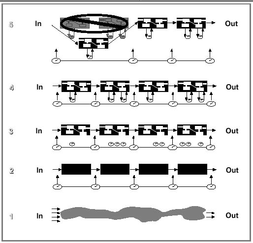

# SWCMM

<!-- slide: 1 -->

## SW-CMM讲座之二

<!-- slide: 2 -->

## 软件过程成熟度五个等 级

- 说明SW-CMM的五个等 级
- 它们的基础原 理

<!-- slide: 3 -->

## 等级1--初始级

- 软件过程是无序的，有时甚至是混乱的，对过程几乎没有定义，成功取决于个人努力。
- 等级1组织的过程能力是不可预测的。因为随着工作进展软件过程经常被改变和修定（即过程是无序的，ad hoc）。进度、预算、功能性和产品质量一般是不可预测的。绩效依赖于个人的能力，且随个人固有的技能、知识和动机的不同而变化。 等级1组织几乎没有明显的稳定的软件过程，只能通过个人的能力而不是组织的能力去预测性能。

<!-- slide: 4 -->

## 等级2--可重复级

- 建立了基本的项目管理过程来跟踪费用、进度和功能特性。制定了必要的过程纪律，能重复早先类似应用项目取得的成功。
- 等级2组织的过程能力概括为有纪律的，因为软件项目的规划和跟踪是稳定的。能重复以前的成功。由于遵循基于以前项目性能所制定的切实可行的计划，项目过程处在项目管理系统的有效控制之下。

<!-- slide: 5 -->

## 等级3--已定义级

- 已将软件管理的工程活动两方面的过程文档化、标准化，并综合成该组织的标准软件过程。所有项目均使用经批准，剪裁的标准软件过程来开发和维护软件。
- 等级3组织的过程能力是概括标准的和一致的，因为无论软件工程活动还是管理活动，过程都是稳定的和可重复的。在所建立的产品线内，成本、进度和功能均受控制、对软件资料质量也进行跟踪。这种过程能力建立在整个组织范围内对已定义过程中的活动、角色和职责的共同理解之上。

<!-- slide: 6 -->

## 等级4--已管理级

- 收集对软件过程和产品质量的详细度量，对软件过程和产品都有定量的理解与控制。
- 等级4组织的过程能力概括为可预测的，因为过程是已测量的并在可测量的范围内运行。该等级的过程能力使得组织能在定量限制的范围内预测过程和产品质量方面的趋势，当超过限制范围时，采取措施予以纠正。软件产品具有可预测的高质量。

<!-- slide: 7 -->

## 等级5--优化级

- 过程量化反馈和先进思想、新技术促使过程不断改进。
- 等级5组织的过程能力可特征化为不断改进，因为这些组织为扩大其过程能力的范围进行着不懈的努力，因而不断改善其项目的过程性能。既通过现有过程中增量式前进的方法，也通过采用新技术、新方法的革新办法，使改进不断出现。

<!-- slide: 8 -->

## 理解成熟度等级

- SW-CMM是规范的模型：处在充分高的抽象层次上，使它不会过多限制一个组织如何去实施软件过程；
- SW-CMM仅仅描述通常所期待的软件过程的本质属性。
- SW-CMM说明每个成熟度等级上组织的特性，并不规定达到成熟度等级的具体方法。
- SW-CMM改进的情景：组织的战略计划和经营目标、它的组织机构、所使用的技术、它的管理体系。

<!-- slide: 9 -->

## 理解初始级

- 对所有成熟度等级的组织来说：选择、雇用、培养、和（或）留住有能力的人都是重要议题，但是它们多半在SW-CMM考虑范围之外。

<!-- slide: 10 -->

## 理解可重复级和已定义级（1）

- 随着项目规模和复杂性的增长，注意力从技术问题转向组织体系和管理问题。
- 通过将最优秀职员所取得的经验教训纳入已文档化的过程，通过培育有效地执行那些过程所必须的技能（通常以培训的方式），以及通过以向完成任务的人们学习的方式所得到的不断改进，过程能使人们工作更有效。

<!-- slide: 11 -->

## 理解可重复级和已定义级（2）

- 在实现可重复级的过程中，通过将项目管理过程编制成文档并遵照执行，管理者建立起领导地位。
- 在实现已定义级的过程中的一个挑战是构造一些过程，允许软件人员开展工作时仍有一定的自由度。

<!-- slide: 12 -->

## 理解已管理级和优化级

- 期望：达到SW-CMM最高成熟度等级的组织，具有能在预测的成本和进度的限制下生产出高可靠的软件过程。
- 原理：SW-CMM是从制造业中所产生的过程思想推导出来的，但是软件过程不像制造过程那样以重复问题占主导地位。软件过程以设计问题占主导地位，而且是知识密集性的活动。

<!-- slide: 13 -->

## 软件过程的可视性（1）

- 等级1：软件过程是一种无组织的整体（黑盒），项目过程的可视性是有限的。由于没有很好地定义活动阶段的划分，经理们在确定项目进程活动状态上极为困难。
- 等级2：顾客需求和工作产品受到控制，已经建立起基本的项目管理实际。构造软件的过程可看为一个接一个的黑盒子，使得活动在盒子间流动，在各过渡点（项目里程碑）上具有管理可视性。当问题出现时，管理者能对它们作出反应。

<!-- slide: 14 -->

## 软件过程的可视性（2）

- 等级3：盒子的内部结构（即项目定义软件过程中的作业）是可视的。内部结构表示组织的标准软件过程用于具体项目的方式。由于已定义的过程提供对项目活动很好的可视性，项目外的个人能获得准确的、即时的状态更新信息。
- 等级4：已定义的软件过程被配备上度量，并得到定量地控制。经理们能够度量进程和问题，他们做决策时，有一个客观的定量的基础，随着过程的变异性越来越小，他们预测结果的能力稳定地变得越来越准确。

<!-- slide: 15 -->

## 软件过程的可视性（3）

- 等级5：为了提高生产率和质量，以受控的方式对构造软件的新的和已知的方法进行不断地实验。不仅对现存过程明察秋毫，而且洞查力扩展到了能了解过程潜在变化的影响，经理们能够定量地估计更改的影响和有效性，然后跟踪它们。

<!-- slide: 16 -->

## 管理者对每个成熟度等级的软件过程可视性

<!-- slide: 17 -->

## CMM的主要内容

- CMM的内部结构
- 关键过程域(KPA)给出了表达组织成熟性的一种方
- 法，这些KPA的定义基于多年来软件工程和软件管理
- 的实践以及5年以上过程评估(assessment)和软件能力
- 评价(evaluation)。
- 每一KPA对应了一组相关的活动，这些活动的实施
- 对于认定的目标是十分必要的。
- CMM并未提及软件开发和软件维护的所有过程域，
- 而只是提到“关键的”，因为这些过程对于提高机构
- 的过程能力最为有效。也可把这些KPA看作是达到某
- 个等级的要求。

<!-- slide: 18 -->

- 过程变更管理   PCM
- 技术变更管理         TCM
- 缺陷预防       	    DP
- 软件产品工程      SPE
- 集成软件管理            ISM
- 培训程序                         TP
- 组织过程定义	          OPD
- 组织过程焦点	                 OPF
- 软件配置管理  SCM
- 软件质量保证        SQA
- 软件子合同管理  	  SSM
- 软件项目追踪	        SPT
- 软件项目计划	             SPP
- 需求管理		                 RM
- 同行评审   PR
- 组间协调         IC
- 软件质量管理      SQM
- 定量过程管理	       QPM
- 5
- 级
- 级
- 4
- 级
- 3
- 级
- 2
- 已定义
- 可重复
- 规范化过程
- 标准化过程
- 可预测过程
- 持续改进过程
- 已管理
- 优化
- 关键过程域(KPA)

<!-- slide: 19 -->

## CMM的主要内容

- 需求管理
- Requirements
- Management
- 应对软件需求加以控制，以建立软件工程和管理活动的基线
- 软件计划、软件产品和活动均与需求保持一致
- 软件项目策划
- Software Project
- Planning
- 将对项目的估计写成文件，以供项目策划和跟踪使用
- 项目的活动和承诺都应制定计划并形成文件
- 项目相关的小组和人员都要对项目有关的承诺取得一致意见
- 软件项目跟踪
- 和监督
- Software Project
- Tracking and
- Oversight
- 将计划实际取得的成果和计划实施情况与计划对照跟踪
- 在计划执行中所得到的实际结果和执行情况与软件计划有较大偏离时，要采取纠正措施加以控制
- 项目相关的小组和人员对承诺的变更取得一致意见
- 关键过程域
- 目                        标
- 第2级（可重复级）的6个关键过程域

<!-- slide: 20 -->

## CMM的主要内容

- 软件子合同管理
- Software
- Subcontract
- Management
- 子合同双方对承诺取得一致意见
- 主合同方对照承诺跟踪子合同方的实际取得的成果
- 子合同双方保持通畅的通信
- 对照承诺，主合同方跟踪子合同的实际工作情况
- 软件质量保证
- Software Quality
- Assurance
- 要对软件质量保证活动制定计划
- 软件产品和活动对适用标准、规程和需求的遵循情况均应作客观的验证
- 将软件质量保证活动和结果通知相关的组和人员
- 未能在项目中解决的不符合要求的问题由高层管理人员处理
- 软件配置管理
- Software
- Configuration
- Management
- 要对软件配置管理活动制定计划
- 要对选定的软件工作产品给予标识、控制，并可利用
- 对已标识的软件工作产品的变更应加以控制
- 对相关的小组和个人通报软件基线的状态和内容
- 关键过程域
- 目                        标
- 第2级（可重复级）的6个关键过程域

<!-- slide: 21 -->

## CMM的主要内容

- 组织过程关注
- Organization
- Process Focus
- 在整个组织内软件过程开发活动和过程改进活动能够协调
- 所采用软件过程的强项和弱项已确知
- 组织级的过程开发活动和过程改进活动已制定计划
- 组织过程定义
- Organization
- Process
- Definition
- 组织的标准软件过程已开发出来并得到维护
- 与组织的标准软件过程应用有关的信息已得到收集、评审并使其可利用
- 培训大纲
- Training Pragram
- 培训活动制定了计划
- 提供了为进行软件管理和技术工作所需技能和知识的培训
- 软件工程组和相关组的人员受到了完成岗位工作所必需的培训
- 关键过程域
- 目                        标
- 第3级（已定义级）的7个关键过程域

<!-- slide: 22 -->

## CMM的主要内容

- 集成化软件管理
- Integrated Software
- Management
- 项目定义的软件过程是组织的标准软件过程的裁剪版
- 根据项目定义的软件过程项目制定了计划且得到管理
- 软件产品工程
- Software Product
- Engineering
- 软件工程任务已定义、集成并为得到软件产品而协调地实施
- 软件工作产品互相之间保持协调一致
- 关键过程域
- 目                        标
- 所有相关组都接受顾客的需求
- 所有组都接受各组之间的承诺
- 各组都可对组间问题作出标识、追踪和加以解决
- 同行评审活动制定另外计划
- 软件工作产品中的缺陷得到识别和排除
- 组间协调
- Intergroup Coodination
- 同行评审
- Peer Review
- 第3级（已定义级）的7个关键过程域

<!-- slide: 23 -->

## CMM的主要内容

- 定量过程管理
- Quantitative Process
- Management
- 定量过程管理制定了计划
- 项目定义的软件过程的实施情况得到量化控制
- 组织的标准软件过程的过程能力可定量表达
- 软件质量管理
- Software Quality
- Management
- 项目的软件质量管理活动制定了计划
- 软件产品质量的度量目标及其优先顺序已确定
- 为达到软件产品质量目标所取得的进展
- 已量化并得到控制
- 关键过程域
- 目                        标
- 第4级（已管理级）的2个关键过程域

<!-- slide: 24 -->

## CMM的主要内容

- 第5级（优化级）的3个关键过程域
- 关键过程域
- 目                        标
- 缺陷预防
- Defect Prevention
- 缺陷预防活动已制定计划
- 已找到缺陷引发的通常原因
- 引发缺陷的通常原因已按序排列并被系统地消除
- 技术变更管理
- Technology Change
- Management
- 技术变更的引入已制定计划
- 为确定新技术对产品质量和生产率的影响，应对新技术进行评估
- 将适合的新技术引入整个组织的正常活动中
- 过程变更管理
- Process Change
- Management
- 对持续的过程改进制定了计划
- 组织软件过程活动的参与者遍及整个组织
- 组织的标准软件过程和项目定义的软件过程都能持续地改进

<!-- slide: 25 -->

## CMM的内部结构

- CMM为每个KPA规定了一组目标(Goal)。目标表明
- 了满足该KPA必须达到的范围、边界和意图。可以用目
- 标来判定组织或项目是否已有效地实现了这个KPA。

<!-- slide: 26 -->

- CMM的内部结构
- 每个关键过程域最终由关键实践(Key Practices)组
- 成，通过实现这些关键实践来达到关键过程域的目标。
- 一般情况下，关键实践描述了应该“做什么”，但并没
- 有规定“如何”去达到这些目标。

<!-- slide: 27 -->

## CMM的内部结构

- 为完成关键过程域中的实践活动，CMM将其活动分
- 为以下有公共特性(Common Feature)的五个部分：
- 执行约定(commitment to perform)
- 执行能力(ability to perform)
- 实施活动(actives performed)
- 度量和分析(measurement and analysis)
- 验证实施(verifying implementation)

<!-- slide: 28 -->

## CMM的内部结构

- LEVELS
- LEVEL 2
- LEVEL 3
- LEVEL 4
- LEVEL 5
- TOTAL
- KPAS
- GOALS
- COMMIT-
- MENTS
- ABILIT-
- IES
- ACTIVIT-
- IES
- MEASURE-
- MENT
- VERIFI-
- CATION
- TOTAL
- KEY PRACTICES
- 6
- 7
- 2
- 3
- 18
- 20
- 17
- 6
- 9
- 52
- 9
- 9
- 3
- 7
- 28
- 25
- 25
- 8
- 13
- 71
- 62
- 50
- 12
- 26
- 150
- 6
- 9
- 2
- 3
- 20
- 19
- 15
- 6
- 7
- 47
- 141
- 125
- 37
- 65
- 316

<!-- slide: 29 -->

## 执行约定

- 描述一个组织在保证将过程建立起来并持续起作用方面所必须采取的行动。
- 执行约定一般包括制定组织的方针和规定高级管理者的支持。

<!-- slide: 30 -->

## 执行能力

- 描述为了能实施软件过程,项目或组织中必须存在的先决条件。
- 执行能力一般包括资源﹑组织机构和培训。

<!-- slide: 31 -->

## 执行的活动

- 描述为实现一个关键过程域所必须的角色和规程（即描述必须由谁作什么）
- 执行的活动一般包括制定计划和规程、，执行计划、跟踪执行情况、必要时采取纠正措施。

<!-- slide: 32 -->

## 测量和分析

- 描述对过程进行测量和对测量结果进行分析的需要
- 一般包括为了确定所执行活动的状态及有效性所能采用的测量和分析

<!-- slide: 33 -->

## 验证实施

- 描述保证遵照已建立的过程进行活动的措施
- 一般包括管理者和软件质量保证部门所作的评审和审计

<!-- slide: 34 -->

## 如何运用CMM

- 软件过程评估  由受过培训的软件专业人员小组对某
- 个组织中软件过程进行的鉴定，其目的在于：
  - 确定组织中当前软件过程的状态
  - 确定组织中与过程相关的最为紧迫的问题
  - 获得组织对于软件过程改进的支持
- 软件能力评价  受过培训的专业人员小组对组织的软
- 件过程能力进行的鉴定，其目的在于：
  - 识别有资格完成软件工作的承包商
  - 监控一项现有软件工作所用软件过程的状态

<!-- slide: 35 -->

## 如何运用CMM

- 软件过程评估所针对的是软件组织自身内部软件过程
- 的改进问题，目的在于发现缺陷，提出改进的方向。
- 软件能力评价是对接受评价者在一定条件下、规定时
- 间内能否完成特定项目的能力考核，即承担风险的系数
- 大小。
- 软件过程评估和软件能力评价之间的差异：
  - 出发点和目标上不同
  - 结果和结果所起的作用不同
  - 被评估和评价单位的态度对评估和评价活动的影响

<!-- slide: 36 -->

- 过程评估
- 能力评价
- 注重
- 找出组织自身软件过程需优先改进处
- 弄清在规定的进度、预算内提供高质量软件的项目、合同的风险
- 对象
- 组织自身
- 投标者
- 结论使用
- 策划改进
- 选择承包商
- 监控承包商，特别是薄弱环节

<!-- slide: 37 -->

## CMM各级之间的关系

- 软件企业现状
- CMM框架的不同级别是针对处于不同管理水平
- 的软件企业制定的。企业必须根据自己的现状有针
- 对性的找到相对应的级别，采取适当的措施，使企
- 业尽早进入CMM的进化阶段，改善软件过程管理，
- 提高软件质量，获得经济效益。
- 一般不提倡企业跨越成熟度级别进行进化，因为
- CMM中的每一级都是达到上一级的基础。

<!-- slide: 38 -->

## CMM各级之间的关系

- 从初始级(1级)向可重复级(2级)过渡
- 从可重复级(2级)向已定义级(3级)过渡
- 向已管理级(4级)和优化级(5级)过渡

<!-- slide: 39 -->

## CMM人员构成和机构划分

- 角色构成
- 经理
- 各级经理
  - 高级经理
  - 项目经理
  - 项目软件经理
  - 一线软件经理
- 工作人员
  - 软件任务领导
  - 职员、软件工程师和个人

<!-- slide: 40 -->

## 组织机构划分

- 组织
- 项目
- 组
  - 软件工程组
  - 软件相关组
  - 软件工程过程组
  - 系统工程组
  - 系统测试组
  - 软件质量保证组
  - 软件配置管理组
  - 培训组
- CMM人员构成和机构划分

<!-- slide: 41 -->

## CMM的初始级

- CMM初始级指未加定义的一种随意过程，一个
- 软件项目的执行是随意的，甚至是混乱的，没有为
- 软件开发与维护提供稳定的环境。项目的成功主要
- 靠个人的努力或即席开发，没有软件开发规范，项
- 目经常会超出预算和拖延工期，即手工作坊式的软
- 件开发。
- 随着软件项目规模越来越大，靠初始级的手工作
- 坊式开发方式已经不能满足软件的要求，企业应该
- 朝着规范化的方向发展，向第二级可重复级进化。
