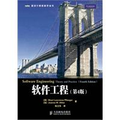
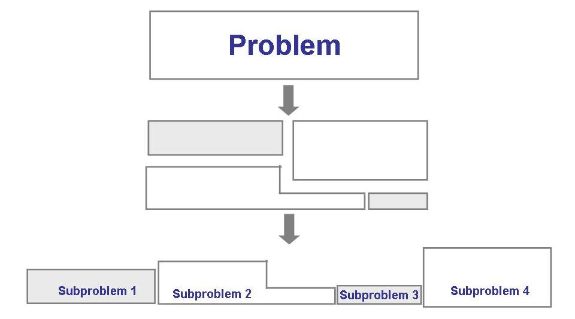
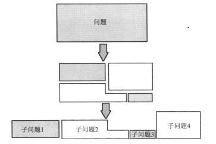
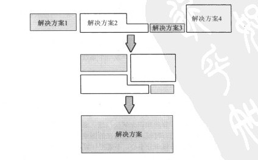
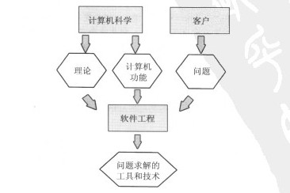
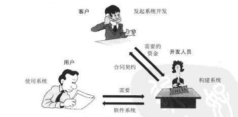
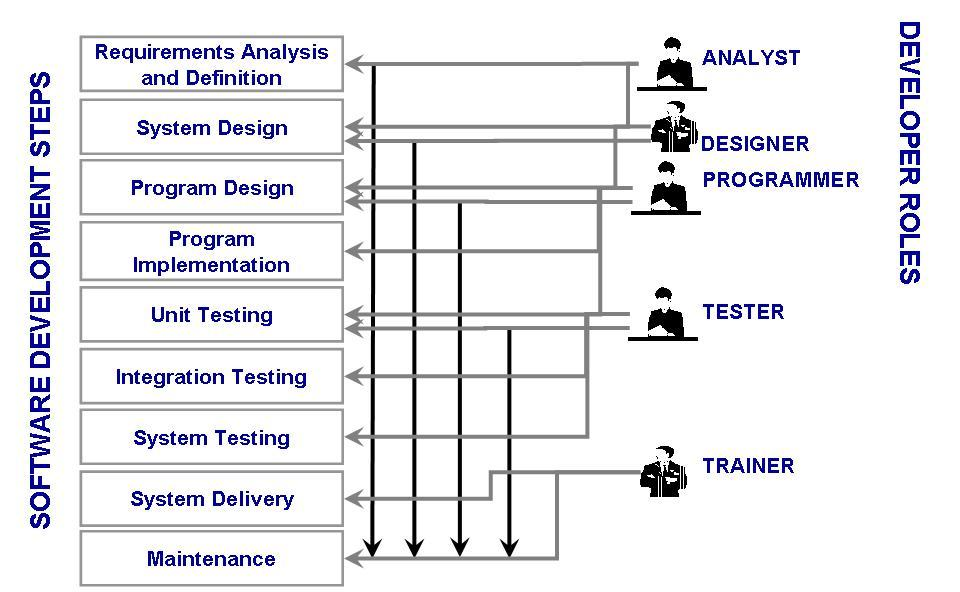

# c-slides

<!-- slide: 1 -->

## Chapter 1

- 什么是软件工程?
- (软件学：关于软件的科学)

<!-- slide: 2 -->

## Contents

- 0      什么是软件？
- 1.1   什么是软件工程?
- 1.2   软件工程取得了哪些进展?
- 1.3   什么是好的软件?
- 1.4  软件工程设计的人员?
- 1.5  系统的方法
- 1.6   工程的方法
- 1.7   开发团队的成员
- 1.8  软件工程发生了多大的变化?
- 1.9   信息系统的例子
- 1.10 实时系统的例子
- 1.11 本章对单个开发人员的意义

<!-- slide: 3 -->

## 本章概述

- 软件的含义
- 软件工程的含义
- 软件工程的发展历程
- “好的软件”的含义
- 为什么系统的方法是重要的
- 自20世纪70年代以来，软件工程是如何变革的.

<!-- slide: 4 -->

## 0 什么是软件?

- 软件并不只是包括可以在计算机上运行的计算机程序，与这些计算机程序相关的文档，一般也被认为是软件的一部分。
- 简单的说软件就是程序加文档的集合体。
- 软件=程序+(数据)+文档。
- 一般来讲软件被划分为:
  - 系统软件、数据库、中间件和应用软件。
- 软件被应用于世界的各个领域，对人们的生活和工作都产生了深远的影响。

<!-- slide: 5 -->

## 0 软件: 使用许可

- 不同的软件一般都有对应的软件授权，软件的使用者必须在同意所使用软件的许可证的情况下才能够合法的使用软件。从另一方面来讲，特定软件的许可条款也不能够与法律相抵触。
- 依据许可方式的不同，大致可将软件区分为几类：
- 专属软件：此类授权通常不允许使用者随意的复制、研究、修改或散布该软件。违反此类授权通常会有严重的法律责任。传统的商业软件公司会采用此类授权，例如微软的 Windows和办公软件。专属软件的源码通常被公司视为私有财产而予以严密的保护。
- 自由软件：此类授权正好与专属软件相反，赋予使用者复制、研究、修改和散布该软件的权利，并提供源码供使用者自由使用，仅给予些许的其它限制。以 Linux、Firefox和 OpenOffice 可做为此类软件的代表。
- 共享软件：通常可免费的取得并使用其试用版，但在功能或使用期间上受到限制。开发者会鼓励使用者付费以取得功能完整的商业版本。
- 免费软件：可免费的取得和散布，但并不提供源码，也无法修改。
- 公共软件：原作者已放弃权利，著作权过期，或作者已不可考的软件。使用上无任何限制。

<!-- slide: 6 -->

## 0 软件:著作权归属

- 根据《计算机软件保护条例》第10条的规定，计算机软件著作权归属软件开发者。因此，确定计算机著作权归属的一般原则是“谁开发谁享有著作权”。软件开发者指实际组织进行开发工作，提供工作条件完成软件开发，并对软件承担责任的法人或者非法人单位，以及依靠自己具有的条件完成软件开发，并对软件承担责任的公民。我国法律除规定了上述一般原则外，《计算机软件保护条例》自第11条至第14条还规定了软件著作权归属的几种特殊情况：
- （一）合作开发。合作开发者对软件著作权的享有和行使以事前的局面协议为根据，如无书面协议，其著作权由各合作开发者共同享有。合作开发的软件可以分割使用的，开发者对各自开发的部分可以单独享有著作权，但行使著作权时不得扩展到合作开发的软件整体的著作权。
- （二）委托开发。受他人委托开发的软件，其著作权的归属由委托者与受托者签订书面协议约定，如无书面协议或者在协议中未明确约定的，其著作权属于受委托者。
- （三）指令开发。为完成上级单位或政府部门下达的任务而开发的软件，著作权的归属由项目任务书或者合同规定；如项目任务书或者合同中未作明确规定，软件著作权属于接受任务的单位。
- （四）职务开发。公民在单位任职期间所开发的软件，如是执行本职工作的结果，即针对本职工作中明确指事实上的开发目标所开发的，或者是从事本职工作活动所预见的结果或者自然的结果则该软件的著作权属于该单位。
- （五）非职务开发。公民所开发的软件如不是执行本职工作的结果，并与开发者在单位中从事的工作内容无直接联系，且又未使用单位的物质技术条件，则该软件的著作权属于开发者自己。

<!-- slide: 7 -->

## 1.1 什么是软件工程?问题求解

- 多数问题是庞大而复杂的
- 通过分析和合成的方法求解问题
  - 分析: 将较大问题分解成可以理解并能够处理的若干小问题
    - 抽象是分析问题的关键
  - 合成: 把小的构造块组合成大的结构
    - 将每个解决方案组合在一起与寻找解决方案本身同样具有挑战性

<!-- slide: 8 -->

## 0 软件: 软件工程师

- 一般指从事软件开发职业的人。软件工程师20余年来一直占据高薪职业排行榜的前列，作为高科技行业的代表，技术含量很高，职位的争夺也异常激烈。软件开发是一个系统的过程，需要经过市场需求分析、软件代码编写、软件测试、软件维护等程序。软件开发工程师在整个过程中扮演着非常重要的角色，主要从事根据需求开发项目软件工作。

<!-- slide: 9 -->

## 1.1 什么是软件工程?问题求解 (continued)

- 分析的过程

<!-- slide: 10 -->

## 1.1 什么是软件工程?问题求解 (continued)

- 合成的过程

<!-- slide: 11 -->

## 1.1 什么是软件工程?问题求解 (continued)

- 方法: 是指产生某些结果的形式化过程
- 工具: 是用更好的方式完成某件事情的设备或自动化系统
- 过程: 生产特定产品的工具和技术的结合
- 范型: 构造软件的特定方式或哲学

<!-- slide: 12 -->

## 1.1 什么是软件工程?

- 计算机科学:  研究硬件设计或者算法的理论证明
- 软件工程:   注重与把计算机作为问题求解的工具

<!-- slide: 13 -->

## 1.1 什么是软件工程?

- 计算机科学与软件工程之间的关系

<!-- slide: 14 -->

## 1.2软件工程取得了哪些进展?

- 执行任务更快、更有效
  - 文字处理,表格处理,电子邮件
- 支撑医学、农业、交通、多媒体教学以及其他产业的进展
- 但是，软件不是完美的。

<!-- slide: 15 -->

## 1.2软件工程取得了哪些进展?补充材料 1.1 描述”bug”的术语

- 错误: 当人们在进行软件开发活动的过程中出错时。例如：设计人员错误理解用户需求。
- 故障：非正常或非期望的工作状态。
- 失效: 是指系统违背了它应有的行为。

<!-- slide: 16 -->

## 1.3什么是好的软件?

- 良好的软件工程必须始终用到开发优质软件的战略
- 三种方式考虑质量：
  - 产品的质量
  - 过程的质量
  - 商业环境背景下产品的质量

<!-- slide: 17 -->

## 1.3什么是好的软件?1.3.1产品的质量

- 用户评价外部特性 (例如：正确的功能, 故障数目, 故障类型)
- 设计和编写代码的人员评价内部特性 (例如：故障类型)
- 因此个人利益不同，评价标准不同
- 软件质量模型把用户的外部视图和软件开发人员的内部视图联系起来

<!-- slide: 18 -->

## 1.3什么是好的软件?1.3.2过程的质量

- 开发和维护过程的质量与产品的质量同等重要
- 过程需要进行建模
- 过程建模可以提出下列问题：
  - 在什么时间、什么地点，我们可以发现某种特定类型的故障？
  - 如何能够在开发过程的更早期发现故障？
  - 如何建立容错机制？
  - 是否有一些替代方法能够在确保质量的前提下是我们的过程更加高效和有效？

<!-- slide: 19 -->

## 1.3什么是好的软件?1.3.2过程的质量 (continued)

- 过程改进模型
  - 软件能力成熟度模型 (CMM ,SEI’s Capability Maturity Model )
  - ISO 9000
  - 软件过程改进及能力确定 (SPICE, Software Process Improvement and Capability dEtermination )

<!-- slide: 20 -->

## 1.4 软件工程涉及的人员

- 用户: 将实际使用系统的人
- 客户: 为将要开发的软件支付费用的公司、组织或个人
- 开发者: 为客户构建软件系统的公司、组织或个人

<!-- slide: 21 -->

## 1.4软件工程设计的人员(continued)

- 软件开发中的参与者

<!-- slide: 22 -->

## 1.5 系统的方法

- 确定活动和对象
- 定义系统边界
- 嵌套系统,系统关系

<!-- slide: 23 -->

## 1.5 系统的方法1.5.1系统的要素

- 活动和对象
  - 活动是某个触发器引发的事件
  - 对象或实体是活动中设计的要素
- 关系和系统边界
  - 关系定义了活动和对象之间的相互作用
  - 系统边界决定输入和输出的起源

<!-- slide: 24 -->

## 1.6 工程的方法构建一个系统

- 需求分析和定义
- 系统设计
- 程序设计
- 编写程序
- 单元测试
- 集成测试
- 系统测试
- 系统交付
- 维护

<!-- slide: 25 -->

## 1.7 开发团队的成员

- 需求分析员: 与客户合作，确定并文档化客户需求
- 设计人员: 生成系统描述:系统要做什么
- 程序员: 编写事先指定需求的代码
- 测试人员: 发现错误
- 培训人员: 向用户说明如何使用这个系统
- 维护小组: 修复系统验收之后出现的错误
- 资料管理员: 准备和存储软件需求文档等
- 配置管理团队: 保持各工件之间的通信

<!-- slide: 26 -->

## 1.7开发团队的成员(continued)

- 开发团队中成员的角色

<!-- slide: 27 -->

## 本学期任务分配

- 分组课程设计（班长）
  - 以兴趣和寝室为单位，5人为一个小组
  - 每个小组民主推选1名小组长（必须），1-2名副组长（可选）
  - 每个小组选择并明确一个软件项目题目（第三周做开题报告，必须包括项目名称、简单介绍和简单工作计划，要有书面材料或电子档）
