# c-slides

<!-- slide: 1 -->

## Chapter 2

- 过程和生命周期
- 的建模
- Copyright 2006 Pearson/Prentice Hall. All rights reserved.

<!-- slide: 2 -->

## 2.1 过程的定义

- 过程: 一组有序的任务，包括活动、约束和资源使用的一系列步骤，用于产生想要的输出
- 一个过程常常涉及一系列的工具和技术

<!-- slide: 3 -->

## 2.1 过程的含义过程的特性

- 规定了所有主要的活动
- 遵从一组约束（例如项目进度）使用资源
- 产生中间结果和最终产品
- 可以是用某种方式连接起来的子过程构成
- 每个过程活动具有进入和退出标准
- 活动按一定的序列组织，这样可以知道活动什么时候开始和结束
- 每个过程都有其指导原则，用于解释每个活动的目标
- 约束和控制可以应用于活动、资源或产品

<!-- slide: 4 -->

## 2.1 过程的含义过程的重要性

- 强制活动具有一致性和一定结构
- 引导我们理解、控制、测试和改进组成过程的活动
- 能够让我们获取经验并传授他人

<!-- slide: 5 -->

## 2.2 软件过程模型过程建模的原因

- 形成共同的理解
- 发现不一致、冗余和遗漏
- 根据目标评估候选活动是否合适
- 根据具体情况对每一个过程进行裁剪

<!-- slide: 6 -->

- 软件有一个孕育、诞生、成长、成熟、衰亡的生存过程。这个过程即为计算机软件的生存期。
- 当过程是在开发软件产品时，把这种软件开发过程称为软件生命周期。
- 2.2 软件过程模型软件生命周期

<!-- slide: 7 -->

- 软件生存期的阶段划分
- (1)可行性研究与计划
- (2)需求分析
- (3)总体设计          上游
- (4)详细设计
- (5)实现
- (6)集成测试
- (7)确认测试          下游
- (8)使用和维护
- （根据国标《计算机软件开发规范》）

<!-- slide: 8 -->

- 软件工作的范围
- 只考虑
- 编写程序
- 涉及整个软件生存周期
- 扩展到

<!-- slide: 9 -->

- 2.2 软件过程模型
- 软件开发模型是软件开发全部过程、活动和任务的结构框架。它能直观表达软件开发全过程，明确规定要完成的主要活动、任务和开发策略。
- 软件开发模型也常称为：
  - 软件过程模型
  - 软件生存期模型
  - 软件工程范型

<!-- slide: 10 -->

## 2.2 软件过程模型软件开发过程模型

- 瀑布模型
- V 模型
- 原型化模型
- 可操作规格说明
- 可转换模型
- 阶段化开发：增量和迭代
- 螺旋模型
- 敏捷方法

<!-- slide: 11 -->

## 2.2 软件过程模型(1) 瀑布模型

- 软件过程模型的第一个模型
- 帮助开发人员布置他们需要做的工作时非常有用
- 向客户解释软件简单容易
- 瀑布模型
  - 从一个非常高层次的角度描述了开发过程中的活动
  - 提出了要求开发人员经过的事件序列
- 每个主要阶段都有与其相关联的里程碑和可交付产品

<!-- slide: 12 -->

## 2.2 软件过程模型瀑布模型 (continued)

- 需求分析
- 系统设计
- 程序设计
- 编码
- 单元测试和集成测试
- 系统测试
- 验收测试
- 运行和维护

<!-- slide: 13 -->

- 瀑布模型开发软件的特点
- 1、阶段间具有顺序性和依赖性。
- 2、推迟实现的观点。
- 3、每个阶段必须完成规定的文档;
- 每个阶段结束前完成文档审查, 及早改正错误。

<!-- slide: 14 -->

## 2.2 软件过程模型瀑布模型 (continued)

- 瀑布模型没有循环
- 大多数软件开发应用了大量的迭代
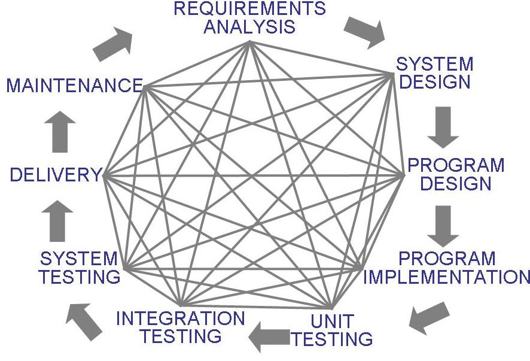

<!-- slide: 15 -->

## 2.2 软件过程模型补充资料 2.1 瀑布模型的缺点

- 对如何处理开发中产品和活动的变化没有提供相关的指导
- 将软件开发视为制造而不是创造
- 创造一个产品没有迭代的活动
- 需要等待很长时间

<!-- slide: 16 -->

## 2.2 软件过程模型原型化瀑布模型

- 原型是一个部分开发的产品
- 原型化：
  - 使开发者能够对评估可选的设计策略 (设计原型)
  - 帮助用户理解系统将会是什么样子 (用户界面原型)
- 原型化对验证Verification和确认Validation很有用

<!-- slide: 17 -->

## 2.2 软件过程模型原型化瀑布模型 (continued)

- 原型化瀑布模型
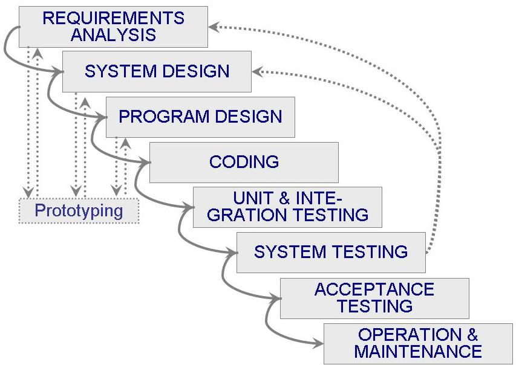

<!-- slide: 18 -->

## 2.2 软件过程模型(2) V 模型

- 是瀑布模型的一个变种
- 用单元测试验证程序设计
- 用系统测试验证系统设计
- 用验收测试验证需求
- 如果在验证和确认过程中发现了问题，那么在再次执行右边的测试步骤之前，重新执行左边的步骤以修正左边

<!-- slide: 19 -->

## 2.2 Software Process ModelsV 模型 (continued)

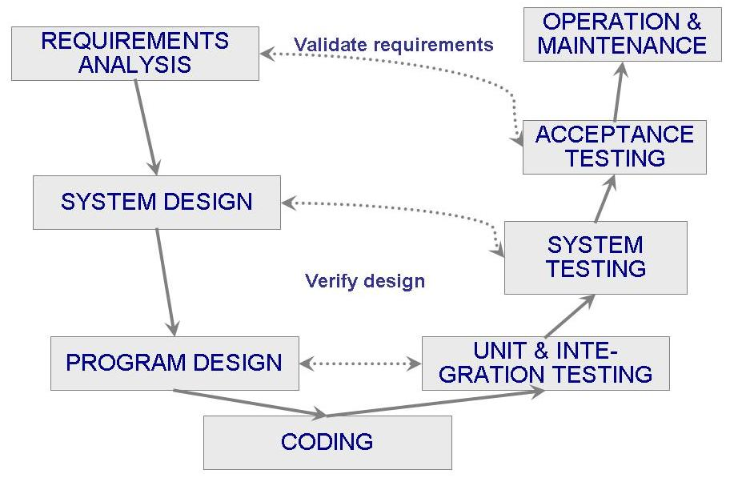

<!-- slide: 20 -->

## 2.2 软件过程模型(3) 原型化模型

- 允许需求或设计反复调查
- 减少开发中的风险和不确定性
- 建造/修改原型
- 用户测试
- 运行原型
- 听取用
- 户意见

<!-- slide: 21 -->

- 采用原型模型的软件生存周期
- 分析定义
- 系统需求
- 生成
- 原型
- 系统
- 设计
- 程序
- 设计
- 编码
- 测试
- 运 行
- 维护
- 原型化
- 含原型化的
- 软件生存期

<!-- slide: 22 -->

- 原型模型存在的问题
- 1、用户似乎看到的软件的工作版本。软件开发管理常常被放松了。
- 2、开发者常常需要实现上的折中，以使原型能尽快工作。
- 关键是如何定义一开始的游戏规则。

<!-- slide: 23 -->

## 2.2 软件过程模型(4) 可操作规格说明

- 在开发过程早期检查需求及其隐含意义
- 功能和设计可以合并
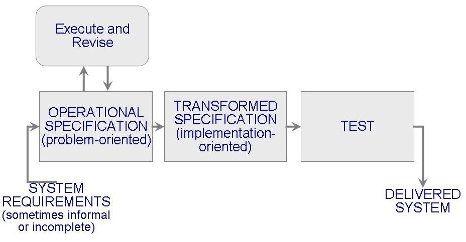

<!-- slide: 24 -->

## 2.2 软件过程模型(5) 可转换模型

- 减少主要开发步骤
- 应用一系列的转换把需求规格说明变为一个可交付使用的系统
  - 改变数据表示
  - 选择算法
  - 优化
  - 编译
- 形式化开发记录
- 形式化规格说明

<!-- slide: 25 -->

## 2.2 软件过程模型(6) 阶段化开发: 增量和迭代

- 减少循环时间
- 系统一部分一部分地交付
  - 系统其他部分在开发时，客户能获得一部分功能
- 两个系统功能可以并行
  - 产品系统 (发布n): 正在运行
  - 开发系统 (发布 n+1): 下一个版本

<!-- slide: 26 -->

## 2.2 软件过程模型阶段化开发: 增量和迭代(continued)

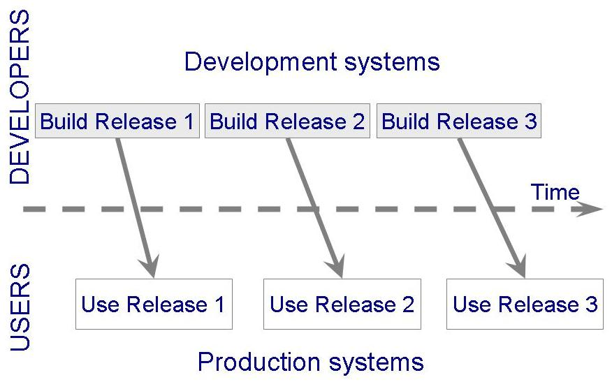

<!-- slide: 27 -->

- 增量模型
- 分析
- 设计
- 编码
- 测试
- 系统信息工程
- 增量2
- 增量3
- 增量4
- 第1个增量的发布
- 第2个增量的发布
- 第3个增量的发布
- 第4个增量
- 的发布
- calendar time
- 分析
- 设计
- 编码
- 测试
- 分析
- 设计
- 编码
- 测试
- 分析
- 设计
- 编码
- 测试

<!-- slide: 28 -->

## 2.2 软件过程模型阶段化模型: 增量和迭代(continued)

- 增量开发: 先定义一个小的功能子系统，再在每个新的发布中增加新功能
- 迭代开发: 一开始就提交完整的系统，再在每一个新的发布中改变每个子系统的功能
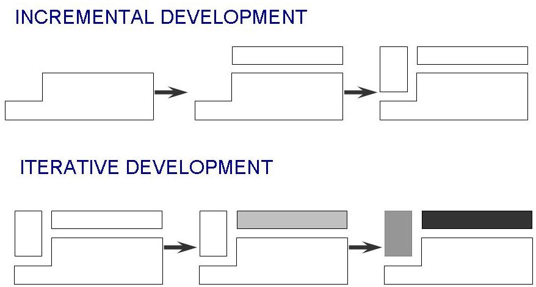

<!-- slide: 29 -->

## 2.2 软件过程模型阶段化开发: 增量和迭代(continued)

- 阶段化开发的设计基于以下原因
  - 即使缺少某些功能，也可以在早期的发布中就可以开始进行培训
  - 可以及早为那些以前从未提供的功能开拓市场
  - 经常性的发布可以使开发人员全面、快速修复这些问题
  - 开发团队将重点放在不同的专业领域技术上

<!-- slide: 30 -->

## 2.2 软件过程模型(7) 螺旋模型

- Boehm (1988)提出
- 结合开发活动和风险管理，以将风险减到最小并加以控制
- 该模型的每个迭代围绕四个主要的活动
  - 计划
  - 确定目标、可选方案、约束
  - 评估可选方案和风险
  - 开发和测试

<!-- slide: 31 -->

## 2.2 软件过程模型螺旋模型 (continued)

- 风险分析
- 工程实施
- 用户通信
- 用户评估
- 产品维护项目
- 产品增强项目
- 新产品开发项目
- 概念开发项目
- 计划
- 建造及发布

<!-- slide: 32 -->

- 螺旋模型沿着螺线旋转，在六个象限上分别表达了六个方面的任务和活动，即：
  - 用户通信──建立开发者和用户之间有效通信
  - 制定计划──确定软件目标，选定实施方案，弄清项目开发的限制条件
  - 风险分析──分析所选方案，考虑如何识别和消除风险
  - 实施工程──实施软件开发
  - 建造及发布──建造、测试、安装和提供用户支持
  - 客户评估──评价开发工作，提出修正建议

<!-- slide: 33 -->

- 喷泉模型
- 进一步开发
- 实现和集成阶段
- 运行状态
- 实现阶段
- 面向对象设计阶段
- 计划阶段
- 面向对象分析阶段
- 需求阶段
- 维护期

<!-- slide: 34 -->

- 主要用于支持面向对象开发过程体现了软件创建所固有的迭代和无间隙的特征。
- 喷泉模型特点

<!-- slide: 35 -->

- 可重用部件组装模型
- 使用重用技术的软件工程模型
- 构件(components): 可重用的软件成份
- 可复用性（Reusability）
- （可重用性）
- 集成化软件开发环境（ISEE）

<!-- slide: 36 -->

- 可重用部件组装模型
- 系统A的
- 软件构成
- 系统C的
- 软件构成
- 系统B的
- 软件构成
- 可重用
- 部  件

<!-- slide: 37 -->

- 软件生产线
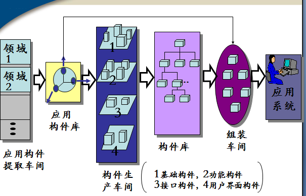

<!-- slide: 38 -->

## 2.2 软件过程模型(8) 敏捷方法

- 强调灵活性在快速、有效开发软件中的作用
- 敏捷方法
  - 相对于过程和工具，更强调个人和交互的价值
  - 更喜欢在生产运行的软件上投入时间 ，而不是在文档的编写上
  - 注重客户的合作，而不是合同谈判
  - 专注于对变化的反应，而不是创建一个计划而后遵循这个计划

<!-- slide: 39 -->

## 2.2 软件过程模型敏捷方法: 敏捷过程的例子

- 极限编程 (XP)
- 水晶法: 基于每一个工程都需要一套不同的策略、约定方法的一组一组方法
- 并列争球法: 30天一次的迭代; 多个自组织小组; 简短的日常情况会议
- 自适应软件开发 (ASD)

<!-- slide: 40 -->

## 2.2 软件过程模型敏捷方法: 极限编程

- 强调敏捷方法的四个特征
  - 交流: 保持客户和开发者的交换看法
  - 简单性: 选择简单设计和实现
  - 勇气: 尽早并经常性交付功能(敢于承诺并信守诺言)
  - 反馈:开发过程中各种活动循环

<!-- slide: 41 -->

## 2.2 软件过程模型敏捷方法: XP的12个实践操作

- 规划游戏 (客户定义价值)
- 小的发布
- 隐喻 (一致意见, 共同名字)
- 简单设计
- 首先编写测试
- 重构
- 对编程
- 集体所有权
- 持续集成 (小的增量)
- 可忍受步伐 (40 小时/周)
- 在现场的客户
- 编码标准

<!-- slide: 42 -->

## 2.2 软件过程模型补充资料 2.2 什么时候极限变成过于极端?

- 极限编程的实践是相互独立的
  - 如果一个被修改，其他会受到影响
- 需求被表示为必须被软件审查通过的测试用例
  - 系统通过了测试，但是用户不认可
- 重构问题
  - 重做一个系统而不能降低体系结构的质量是困难的

<!-- slide: 43 -->

## 2.2 软件过程模型补充资料 2.3 过程模型的集合

- 开发过程是问题求解的活动
- Curtis, Krasner, and Iscoe (1988) 对过程模型中应该获取哪些问题求解的因素进行了现场研究
- 研究结果提出了一个关于软件开发层次的行为模型，作为对传统模型的补充
- 过程模型不仅描述一系列的任务，也要描述对项目内在的不确定性和风险的详细因素

<!-- slide: 44 -->

## 工具和技术取决于我们想从模型中得到什么
两种主要类型的模型
静态模型: 描述过程
动态模型: 展现过程

- 2.3 过程建模工具和技术

<!-- slide: 45 -->

## 过程用7中类型元素描述
活动 
序列 
过程模型 
资源 
控制  
策略 
组织 
若干模板，例如制品定义模板

- 2.3 过程建模的工具和技术静态模型: Lai 表示

<!-- slide: 46 -->

- 2.3 过程建模的工具和技术静态模型: Lai 表示

<!-- slide: 47 -->

## 2.3 过程建模的工具和技术静态模型: Lai 表示 (continued)

- 汽车启动过程
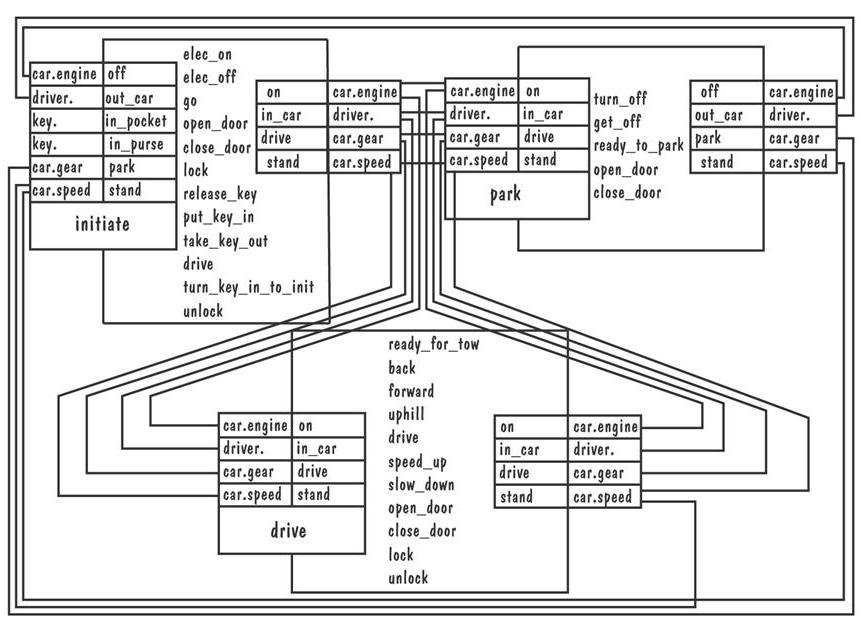

<!-- slide: 48 -->

## 2.3 过程建模的工具和技术静态建模: Lai 表示(continued)

- 汽车的转移图
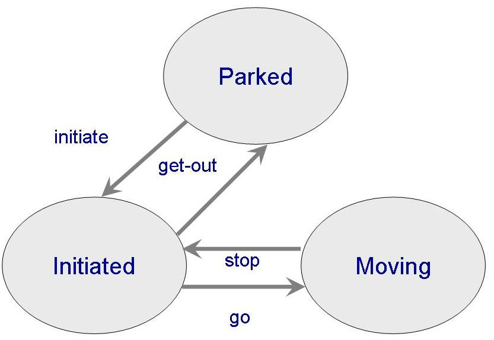

<!-- slide: 49 -->

## 随着活动的发生，我们可以观察资源和产品发生了什么情况
对选择和变化进行模拟并修改过程
例子:  系统动力学

- 2.3 过程建模的工具和技术动态建模

<!-- slide: 50 -->

## 1950年提出
Abdel-Hamid 和Madnick 把它应用到软件开发中 
一种理解系统动力学的方法是探索软件开发过程是如何影响生产率的

- 2.3 过程建模的工具和技术动态建模: 系统动力学

<!-- slide: 51 -->

## 2.3 过程建模的工具和技术动态建模: 系统动力学 (continued)

- 图形表示影响生产率的因素
- 箭头表明一个因素中的变化如何影响另一个因素中的变化
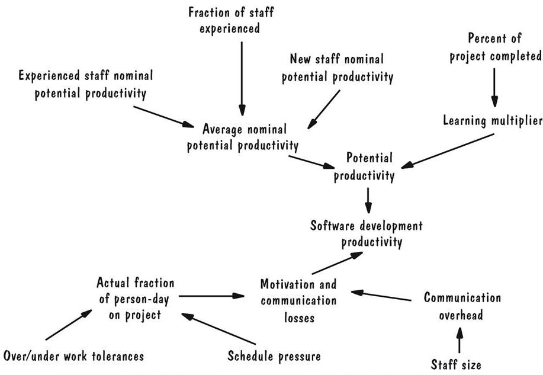

<!-- slide: 52 -->

## 2.3 过程建模的工具和技术动态建模: 系统动力学 (continued)

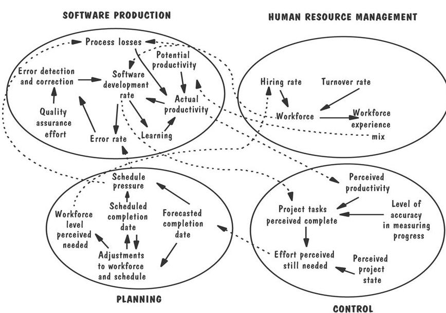
- 一个系统动力学模型包含了影响生产率的四个主要方面

<!-- slide: 53 -->

## 2.3 过程建模的工具和技术补充资料 2.4 过程程序设计

- 程序描述和演示过程
  - 去除不确定性
  - 可能成为生产软件的自动化环境的基础
- 没有抓住开发过程的内在变化
  - 实现环境，操作系统，技能，经验，客户需求的理解
- 仅仅提供了关于任务序列化的信息
- 没有就迫在眉睫的问题向管理员发出警告

<!-- slide: 54 -->

## 2.4 实际的过程建模Marvel 案例研究

- 使用Marvel过程语言 (MPL)
- 三个结构: 类，规则，工具信封
- 3部分的过程描述
  - 基于规则的过程行为规格说明
  - 模型信息过程的面向对象的定义
  - 用作执行该过程的外部软件工具和 Marvel 之间的接口的一组信封

<!-- slide: 55 -->

## 2.4 实际的过程建模Marvel 案例研究 (continued)

- 美国电话电报公司的呼叫处理网络
  - 处理电话呼叫
  - 负责为呼叫安排路由并平衡网络负载
- Marvel 用于描述信令故障解析过程

<!-- slide: 56 -->

## 2.4 实际的过程建模Marvel 案例研究 (continued)

- 信号故障解析过程
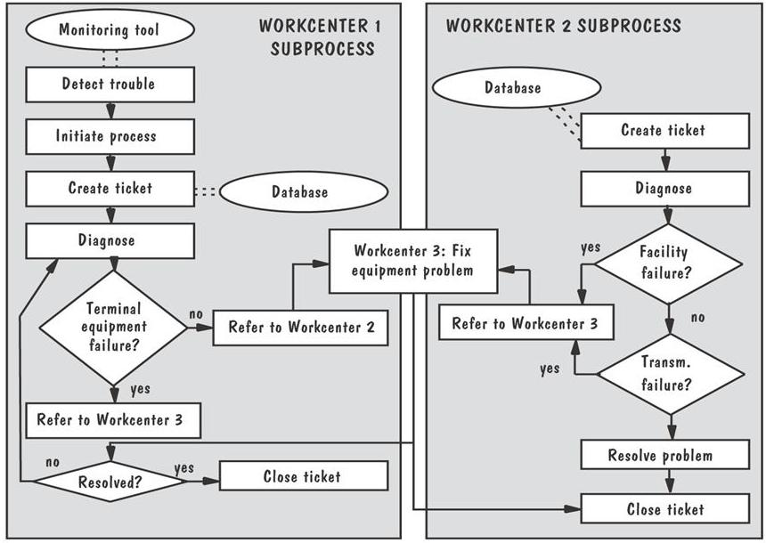

<!-- slide: 57 -->

## 2.4 实际的过程建模Marvel 命令的例子

<!-- slide: 58 -->

## 2.4 实际的过程建模过程建模工具和技术应该有的特性

- 促进人们的理解和交流
- 支持过程改进
- 支持过程管理
- 在执行过程时提供自动引导
- 支持自动过程执行

<!-- slide: 59 -->

## 2.5 信息系统的例子皮卡地里电视广告程序系统

- 需要一个易于维护并易于改变的系统
- 需求可能变化
  - 瀑布模型不适合
- 原型化方法对用户界面开发是有利的
- 广告条例和商业约束有很多不确定性因素
  - 需要管理风险
- 瀑布模型是很好的选择

<!-- slide: 60 -->

## 2.5 信息系统的例子皮卡地里系统 (continued)

- 风险可以从两个方面考虑
  - 概率: 一个特定问题可能发生的可能性
  - 严重性: 将对系统造成的影响
- 管理风险, 需要在过程模型中包含风险的特性描述
  - 风险是必须描述的制品

<!-- slide: 61 -->

## 2.5 信息系统的例子皮卡地里系统的制品表

<!-- slide: 62 -->

## 2.6 实施系统的例子阿丽亚娜-5 软件

- 包含了从 阿丽亚娜-4复用的软件
- 复用过程模型
  - 标识子过程, 描述并放入领域库
  - 分析新软件的需求 ，潜在的可复用构件形成新的需求
  - 用修订了的需求设计软件
  - 评估和认证所选的可复用构件
  - 构建或者改变软件

<!-- slide: 63 -->

## 2.6 实施系统的例子阿丽亚娜-5 软件 (continued)

- 过程复用模型
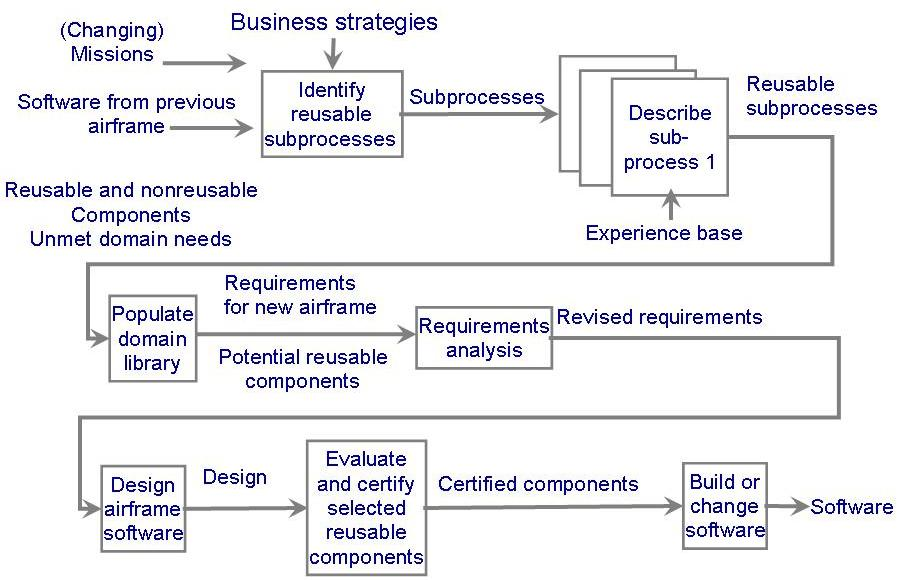

<!-- slide: 64 -->

## 2.7 本章对单个开发人员的意义

- 开发过程包括活动、资源和产品
- 过程模型包括组织的、机构的、功能的、行为的和其他的侧面
- 过程模型对引导团队行为、合作和协调很有用
