# c-slides

<!-- slide: 1 -->

## Chapter 3

- 计划和项目管理
- Copyright 2006 Pearson/Prentice Hall. All rights reserved.

<!-- slide: 2 -->

## 目录

- 3.1   跟踪项目进展
- 3.2   项目人员
- 3.3   工作量估算
- 3.4   风险管理
- 3.5   项目计划
- 3.6	过程模型和项目管理
- 3.7   信息系统的例子
- 3.8  	实施系统的例子
- 3.9   本章对单个开发人员的意义

<!-- slide: 3 -->

## 本章讨论的内容

- 跟踪项目进展
- 项目人员和组织
- 工作量和进度估计
- 风险管理
- 项目计划与过程建模

<!-- slide: 4 -->

## 3.1 跟踪项目进展

- 你理解我的问题和需要吗?
- 你能设计一个系统来解决我的问题或满足我的需求吗?
- 你开发这样一个系统需要多长时间?
- 你开发这样一个系统需要花费多少成本?

<!-- slide: 5 -->

## 3.1 跟踪项目进展项目进度

- 描述特定项目的软件开发周期
  - 列举项目各个阶段
  - 将每个阶段分解成离散的任务或活动
- 描写活动的交互，估计每个任务将花费的时间

<!-- slide: 6 -->

## 3.1 跟踪项目进展项目进展: 方法

- 列出所有的项目可交付产品
  - 文档
  - 功能的演示
  - 子系统的演示
  - 精确性的演示
  - 可靠性、安全性和功能的演示
- 确定要生产这些可交付产品必须进行的活动

<!-- slide: 7 -->

## 3.1 跟踪项目进展里程碑和活动

- 活动:  在一段时间内发生
- 里程碑:  活动的完成 –- 一个特定的时间
- 前驱:  在该活动之前必须发生的一个事件或一组事件
- 工期:  完成活动的时间长度
- 截止时间:  活动必须完成的日期

<!-- slide: 8 -->

## 3.1 跟踪项目进展WBS：工作分解结构：

- Work Breakdown Structure ：WBS对应当由项目团队执行以便实现项目目标，并创造必要的可交付成果工作，按可交付成果所做的层次分解。WBS将项目的整个范围组织 在一起并加以明确。每向下分解一个层次，就意味着项目工作的定义深入了一步。WBS最终分解为工作细目。WBS的层次结构以可交付成果为对象，包括内部和 外部可交付成果。

<!-- slide: 9 -->

## 3.1 跟踪项目进展项目进展 (continued)

- 可以把项目开发分为一连串的阶段，每一个阶段由若干步骤组成
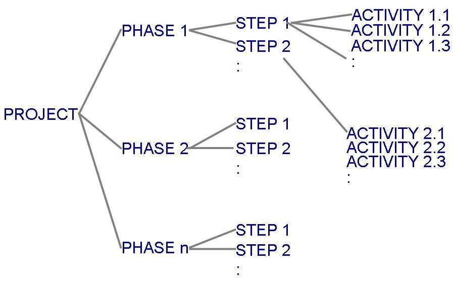

<!-- slide: 10 -->

## 3.1 跟踪项目进展项目进展 (continued)

- 表3.1 展示了建造一座房子的阶段、步骤和活动
  - 美化阶段
  - 建造房子阶段
- 表 3.2 列出了建造房子过程的里程碑

<!-- slide: 11 -->

## 3.1 跟踪项目进展建造房子的阶段、步骤、活动

<!-- slide: 12 -->

## 3.1 跟踪项目进展建造房子的里程碑

<!-- slide: 13 -->

## 3.1 跟踪项目进展工作分解和活动图

- 工作分解结构把项目描述为由若干离散部分构成的集合
- 活动图描述了活动的独立性
  - 点  (圈)   :   项目里程碑
  - 线（框）:    包含的活动

<!-- slide: 14 -->

## 3.1 跟踪项目进展工作分解结构和活动图 (continued)

- 建造房子的活动图
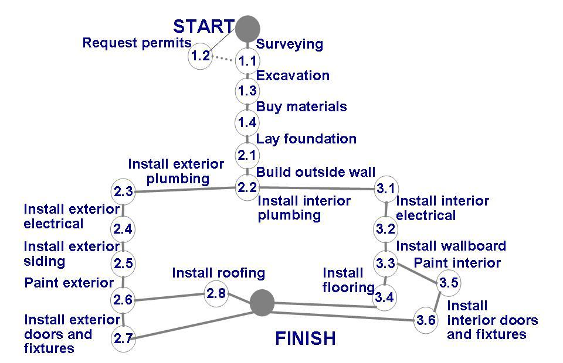

<!-- slide: 15 -->

## 3.1 跟踪项目进展评估完成时间

- 在活动图中加入完成每个活动的估算时间的信息以使活动更加有用
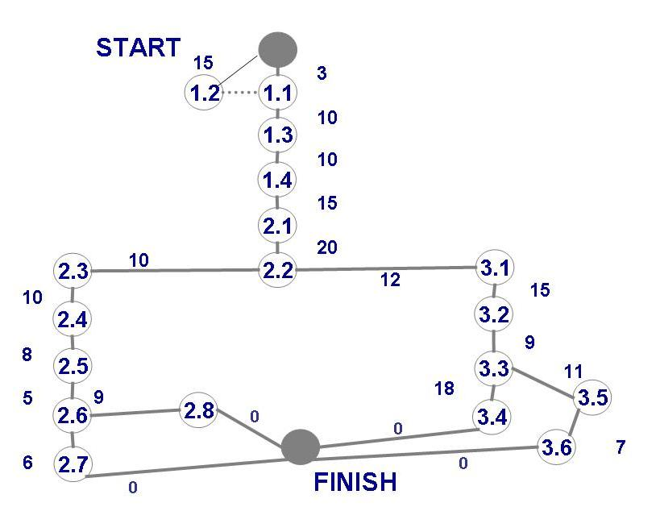

<!-- slide: 16 -->

## 3.1 跟踪项目进展建造房子的进展估计图

<!-- slide: 17 -->

## 3.1 跟踪项目进展关键路径法 (CPM)

- 将描述完成项目花费的最短时间
  - 揭示出按时完成这个项目最为关键的那些活动
- 真实时间或实际时间:估算的完成此活动的必需时间
- 可用时间: 完成活动可用的时间量
- 时差: 可用时间和实际时间的差

<!-- slide: 18 -->

## 3.1 跟踪项目进展关键路径法 (CPM) (continued)

- 关键路径: 每个节点的时差都是零
  - 可以有多条
- 时差 = 可用时间 – 实际时间
- = 最晚开始时间 – 最早开始时间

<!-- slide: 19 -->

## 建造房子的活动的时差

<!-- slide: 20 -->

## 3.1 跟踪项目进展CPM 条状图

- 包括早的开始日期和迟的开始日期的信息
- 表明关键路径
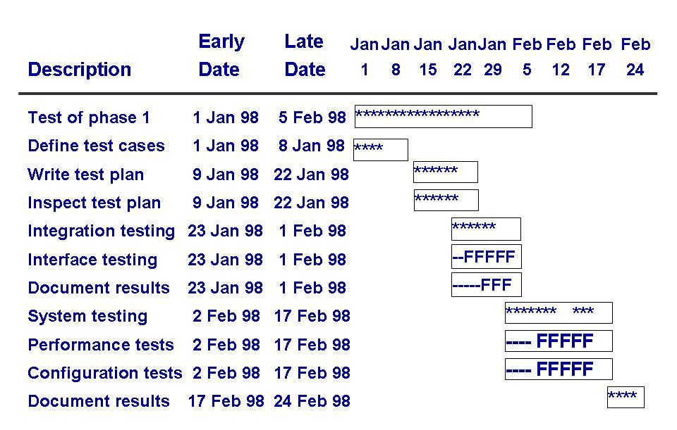

<!-- slide: 21 -->

## 3.1 跟踪项目进展跟踪进展的工具

- 例子：跟踪一个通信软件的进展
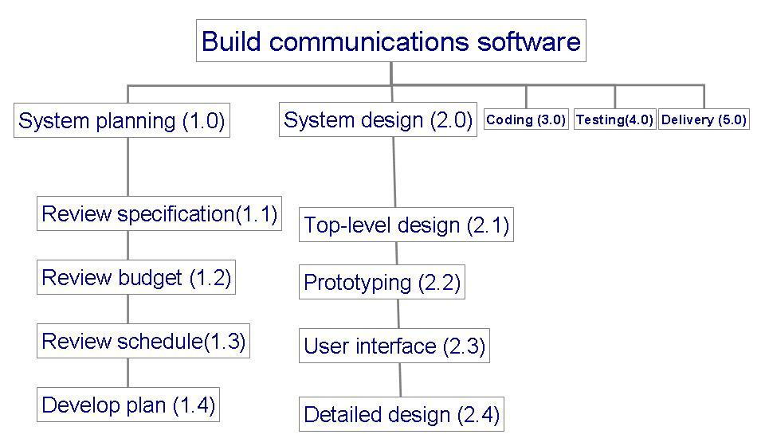

<!-- slide: 22 -->

## 3.1 跟踪项目进展跟踪进展的工具: 甘特图

- 并行活动的显示
  - 帮助理解哪些活动可以同时进行
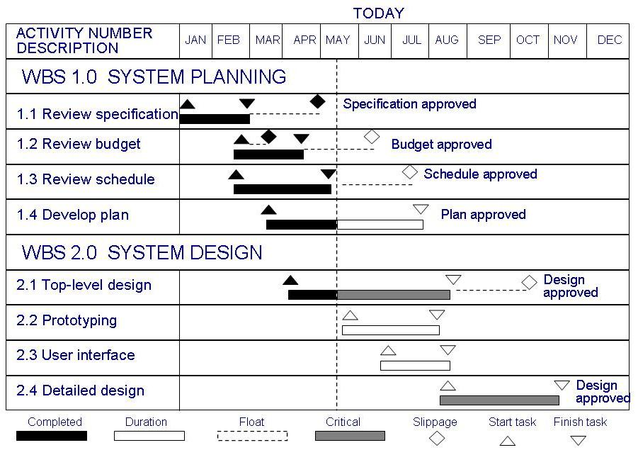

<!-- slide: 23 -->

## 3.1 跟踪项目进展跟踪进展的工具: 资源直方图

- 表示分配给项目的人员和每一个开发阶段需要的人员之间的关系
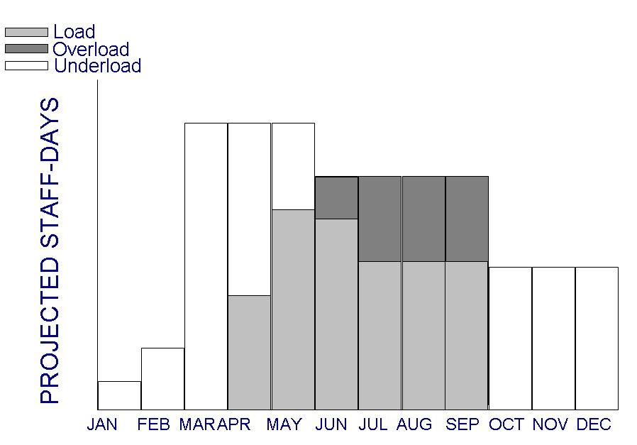

<!-- slide: 24 -->

## 3.1 跟踪项目进展跟踪项目进展的工具: 支出跟踪

- 怎样监控支出的例子
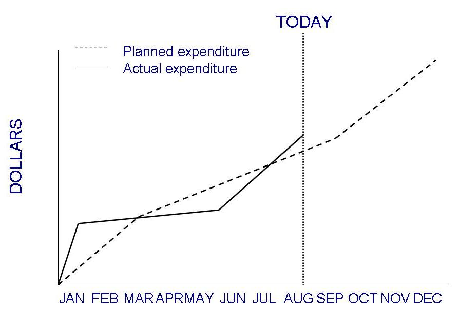

<!-- slide: 25 -->

## 3.2 项目人员

- 关键项目活动
  - 需求分析
  - 系统设计
  - 程序设计
  - 程序实现
  - 测试
  - 训练
  - 维护
  - 质量保证
- 把不同的任务分配给不同的人员有很多好处

<!-- slide: 26 -->

## 3.2 项目人员选择人员

- 完成工作的能力
- 对工作的兴趣
- 经验
  - 开发类似应用
  - 使用类似工具，语言或技术
  - 使用类似开发环境
- 培训
- 与别人交流的能力
- 与他人共同承担责任的能力
- 管理技能

<!-- slide: 27 -->

## 3.2 项目人员交流

- 一个项目进度受到下列因素影响
  - 交流程度
  - 单个开发人员交流其思想的能力
- 交流和理解中的障碍可能导致软件的失败

<!-- slide: 28 -->

## 3.2 项目人员交流 (continued)

- 交流路径可以很快增长
- 如果一个项目有n名人员，那么可能需要交流的人有n(n-1)/2 对 , 即 Cn2
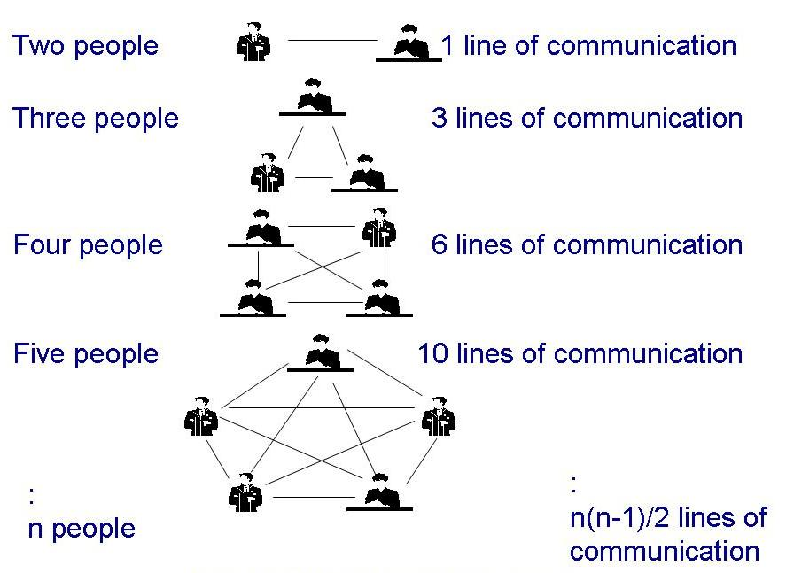

<!-- slide: 29 -->

## 3.2 项目人员补充资料 3.1 会议促进项目进展

- 会议常遭到抱怨
  - 会议的目的不清楚
  - 与会者无准备
  - 主要人员缺席或迟到
  - 谈话内容偏离主题
  - 没有讨论而是争论
  - 会议决策永远不会之行执行
- 保证一个会议有效的方法
  - 明确规定与会人员
  - 写一个会议议程
  - 有负责人确保讨论不偏离主题
  - 有人负责会议上的每项决议事后得到实施

<!-- slide: 30 -->

## 3.2 项目人员工作风格

- 外向: 告诉他人你的想法
- 内向: 征求他人的建议
- 感性: 决策建立在对问题的感觉上
- 理性: 决策基于事实和可能的情况的谨慎考虑

<!-- slide: 31 -->

## 3.2 项目人员工作风格 (continued)

- 水平轴: 交流风格
- 垂直轴: 决策风格
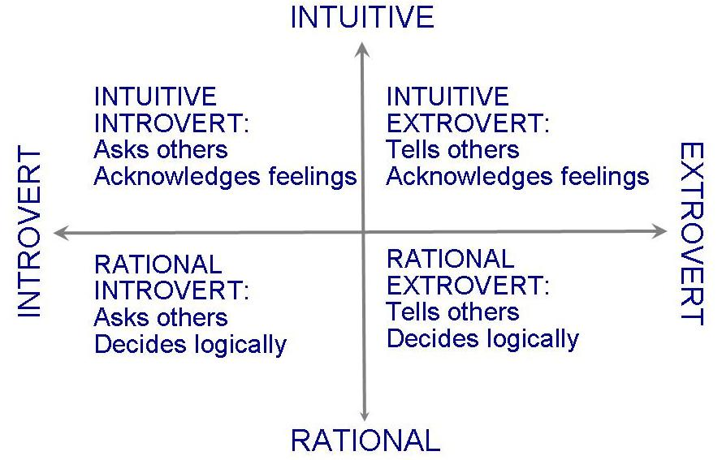

<!-- slide: 32 -->

## 3.2 项目人员工作风格 (continued)

- 工作风格决定交流方式
- 了解工作风格
  - 让你更灵活
  - 给你提供关于其他人员最先考虑的问题的相关信息
- 帮助你更灵活的与项目团队其他成员、客户和用户打交道

<!-- slide: 33 -->

## 3.2 项目人员项目组织

- 取决于
  - 团队成员的背景和工作风格
  - 团队成员的数目
  - 客户和开发人员的管理风格
- 例如:
  - 主程序员负责制度: 一个总体负责系统的设计和开发
  - 忘我精神: 每个人平等分担责任

<!-- slide: 34 -->

## 3.2 项目人员项目组织: 主程序员负责制度

- 每个小组成员必须经常与主程序员交流, 而不必与其他小组成员交流
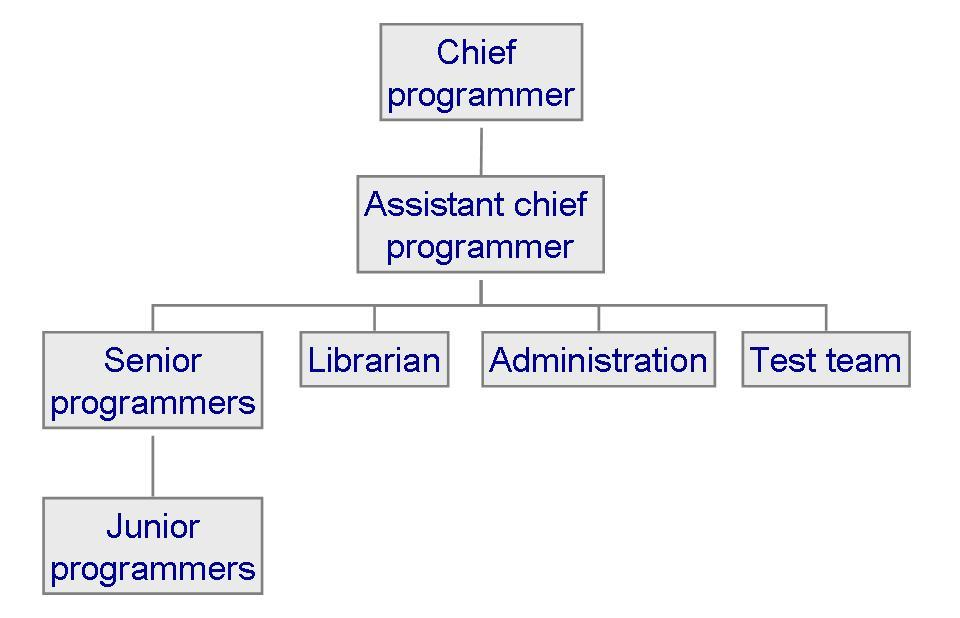

<!-- slide: 35 -->

## 3.3 工作量估计

- 项目计划和管理的一个至关重要的方面是了解项目的可能的成本
- 成本必须在项目生命周期的早期估计
- 成本类型
  - 设施: 硬件, 场地, 电话等
  - 方法和工具: 软件, 设计软件的工具 (计算机辅助软件工程工具)
  - 人员: 成本中最大的部分

<!-- slide: 36 -->

## 3.3 工作量估算成本估算应该在生命周期中反复进行

- 项目早期的不确定性影响成本和规模估算的精确性
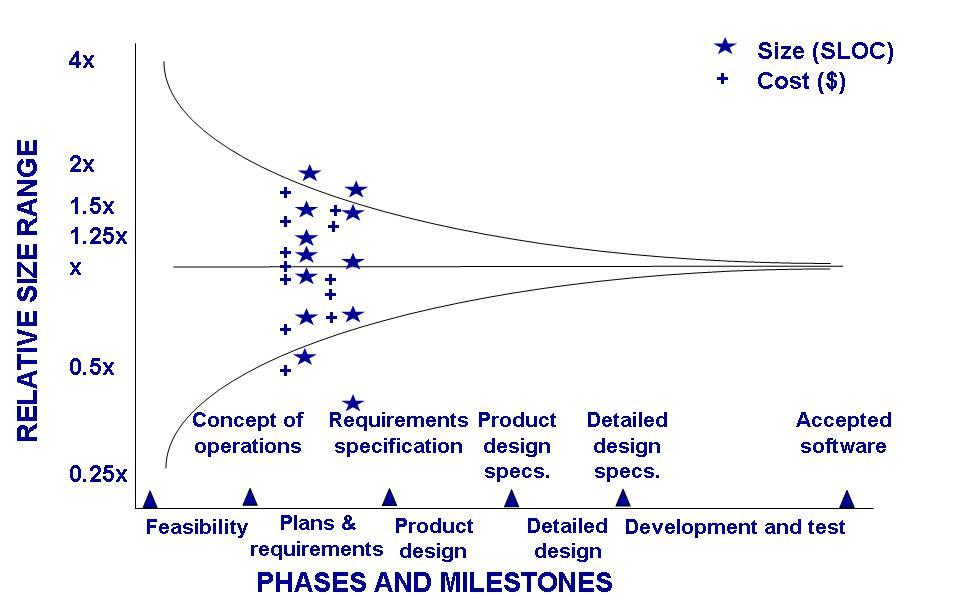

<!-- slide: 37 -->

## 3.3 工作量估计 补充资料 3.3 不精确估算的原因

- 关键原因
  - 用户经常变更要求
  - 忽略了任务
  - 用户对需求缺乏了解
  - 估算时缺乏充分的分析
  - 系统开发，技术服务，操作，数据管理与开发中的其他功能之间缺乏协调
  - 缺乏适当的估算方法和指导原则

<!-- slide: 38 -->

## 3.3 工作量估计 补充资料 3.3 不精确估算的原因 (continued)

- 重要的影响
  - 要开发的应用程序系统的复杂性
  - 不许与现有的系统集成在一起
  - 系统中程序的复杂性
  - 系统的规模
  - 项目团队成员的能力
  - 项目团队拥有的关于应用的经验
  - 项目团队拥有的编程语言的经验
  - 数据库管理系统
  - 项目团队成员的人数
  - 编程或文档标准的范围

<!-- slide: 39 -->

## 3.3 工作量估计 估计方法类型

- 专家判断
  - 自顶向下或自底向上
  - 类推过程: 悲观预测(x), 乐观预测(y), 最可能预测 (z); 计算平均值 (x + 4y + z)/6
  - Delphi 技术: 基于专家秘密地进行个人预测的平均值
  - Wolverton 模型: 首批估算模型 (1974)
- 算法方法:  E = (a + bSc) m(X)
  - Walston 和Felix 模型:  E = 5.25S 0.91
  - Bailey 和Basili 模型:  E = 5.5 + 0.73S1.16

<!-- slide: 40 -->

## 3.3 工作量估计 专家预测: Wolverton 模型

- 难度取决于两个因素
  - 是老问题(O)还是新问题(N)
  - 是容易的(N)、适中的(N)、还是困难的(N)

<!-- slide: 41 -->

## 3.3 工作量估计 算法方法: Watson 和Felix 模型

- 方程式中包含一个生产率指标
- 有29种因素影响生产率
  - 1 ：提高了生产率
  - 0 ：对生产率没影响

<!-- slide: 42 -->

## 3.3 工作量估计 Watson 和Felix 模型的生产率因素

<!-- slide: 43 -->

## 3.3 工作量估计算法方法: Bailey-Basili 技术

- 将标准误差降到最小，产生了一个非常精确的方程式：
- E = 5.5 + 0.73S1.16
- 根据误差比率调整这个估算：
  - 如果 R 是实际工作量 E和预测工作量 E’,之间的比率，那么工作量调整定义为：
  - ERadj = R – 1 if R > 1
  - = 1 – 1/R if R < 1
- 调整厨师工作量估算 Eadj
  - Eadj = (1 + ERadj)E  if R > 1
  - = E/(1 + ERadj)  if R < 1

<!-- slide: 44 -->

## 3.3 工作量估算 COCOMO 模型

- Boehm开发
- COCOMO II
  - 更新的版本
  - 包含复用的模型
- 基本模型的形式是
  - E = bScm(X)
  - 其中
    - bSc 是最初的基于规模的估算
    - m(X) 是关于成本驱动因子信息的向量

<!-- slide: 45 -->

## 3.4 风险管理什么是风险?

- 风险是有负面后果的、不想要的事件
- 鉴别风险
  - 风险影响:  与风险有关的损失
  - 风险概率:  风险发生的可能性
  - 风险控制:  降低或消除风险采取的行为
- 量化风险影响
  - 风险暴露 = (风险概率) x (风险影响)
- 风险来源: 一般风险和特定风险

<!-- slide: 46 -->

## 3.4 风险管理风险管理活动

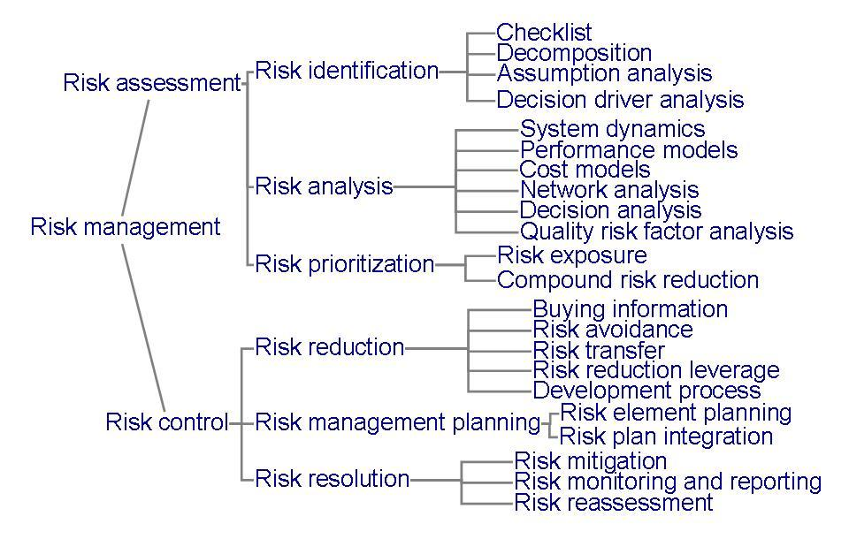

<!-- slide: 47 -->

## 3.4 风险管理风险管理活动 (continued)

- 风险暴露计算的例子
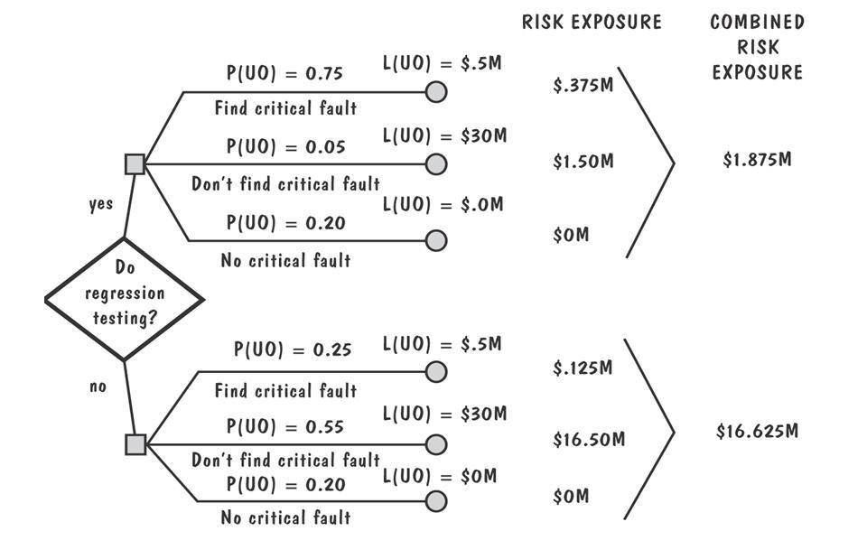

<!-- slide: 48 -->

## 3.4 风险管理风险管理活动 (continued)

- 降低风险的三种策略
  - 避免风险:  通过改变性能或功能需求
  - 转移风险:  把风险分配到其他系统中，或购买保险
  - 假设风险会发生:  接受并控制
- 减少风险的成本
  - 风险杠杆 = (降低前的风险暴露 – (降低后的风险暴露) / (降低风险的成本)

<!-- slide: 49 -->

## 3.4 风险管理补充资料3.4 Boehm 的十大风险事项

- 人员短缺
- 不现实的进度和预算
- 开发错误的软件功能
- 开发错误的用户界面
- 华丽的计划
- 需求的持续变更
- 外部执行的任务未达到要求
- 外部提供的构件达不到要求
- 实时性能达不到要求
- 计算机科学能力的限制
