# c-slides

<!-- slide: 1 -->

## Chapter 4

- 获取需求
- Copyright 2006 Pearson/Prentice Hall. All rights reserved.

<!-- slide: 2 -->

## 目录

- 4.1   	需求过程
- 4.2   	需求引发
- 4.3   	需求的类型
- 4.4   	需求的特征
- 4.5   	模型表示法
- 4.6		需求和规格说明
- 4.7		原型化需求
- 4.8		需求文档
- 4.9		确认和验证
- 4.10	测量需求
- 4.11 	选择规格说明技术
- 4.12 	 信息系统的例子
- 4.13	 实施系统的例子

<!-- slide: 3 -->

## 本章内容

- 从客户引发需求
- 建模需求
- 评审需求以保证质量
- 文档化需求，供设计和测试小组使用

<!-- slide: 4 -->

## 4.1 需求过程

- 需求是对期望的行为的表达
- 需求处理
  - 对象或实体
  - 他们可能的状态
  - 他们改变状态或对象特征的功能
- 需求集中于用户的需要，而不是解决方案和实现
  - 用户想要什么行为，而不是怎样实现这些行为

<!-- slide: 5 -->

## 4.1 需求过程补充资料 4.1 为什么需求很重要?

- 引起项目失败的首要原因
  - 不完整的需求
  - 缺少用户的参与
  - 不实际的期望
  - 缺少行政支持
  - 需求和规格说明的改变
  - 缺少计划
  - 不再需要该系统
- 几乎所有的这些因素都涉及需求过程的某些部分
- 如果开发过程的早期没有检测到并修复需求错误，那么会造成很高的代价

<!-- slide: 6 -->

## 4.1 需求过程获取需求的过程

- 需求分析员或系统分析员执行这些任务
- 最后结果是软件需求规格说明书
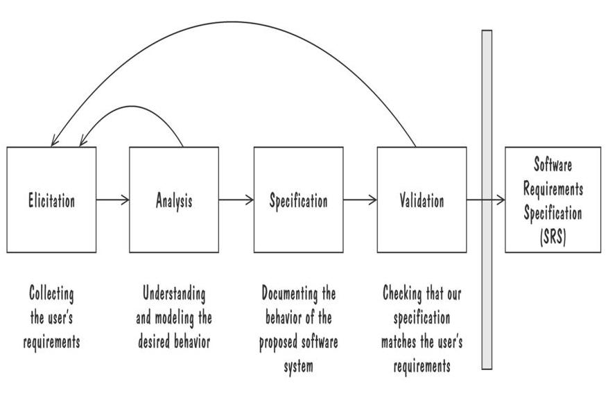

<!-- slide: 7 -->

## 4.1 需求过程补充资料 4.2 敏捷需求建模

- 如果需求交织在一起并很复杂，我们可以用强调前端的建模“重量级”过程
- 如果需求不确定，敏捷方法是一个可选的方法
- 敏捷方法递增地实现和采集需求
- 极限编程 (XP) 是一个敏捷过程
  - 当我们定义需求的时候构建系统
  - 不计划和设计将来可能的需求
  - 需求编码为最终实现必须通过的测试用例

<!-- slide: 8 -->

## 4.2 需求引发

- 客户并不总是理解他们的需要和问题
- 与参与系统的每个人讨论需求是很重要的
- 所有人都必须对需求是什么达成一致意见
  - 如果我们不能对需求达成一致，项目注定失败

<!-- slide: 9 -->

## 4.2 需求引发风险承担者（项目相关人）

- 委托人: 为要开发的软件支付费用的人
- 客户: 软件开发后购买的人
- 用户: 使用系统
- 领域专家: 对软件必须自动化的问题很熟悉的那些人
- 市场调查员: 确定将来的趋势和潜在客户
- 律师或审计人员: 对政府、安全性和法律的需求熟悉的人
- 软件工程师或其他技术专家

<!-- slide: 10 -->

## 4.2 需求引发补充资料 4.3 用“观点集”来管理不一致性

- 在需求过程的早期不需要解决不一致性 (Easterbrook and Nuseibah, 1996)
- 在软件开发过程的自始至终，将风险承担着的看法文档化并维护在单独的“观点集”
  - 需求分析员定义“观点”之间的一致性原则
  - 分析观点，看他们是否符合一致性
- 这种方法突出了不一致性，但是直到获得足够的信息的时候才解决不一致性

<!-- slide: 11 -->

## 4.2 需求引发需求引发的含义

- 与风险者进行会谈
- 评审可用文档
- 观察当前系统 (如果存在)
- 在用户执行任务的时候，做用户的学徒
- 与用户或风险者以小组的形式会谈
- 使用特定领域的策略, 例如联合应用设计 或者 PIECES
- 与当前和潜在用户一起进行集体讨论

<!-- slide: 12 -->

## 4.2 需求引发需求引发的含义 (continued)

- 可能的需求源
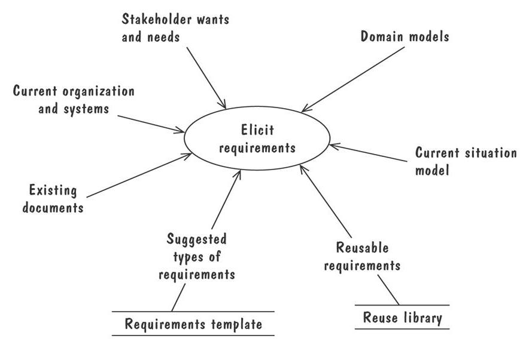

<!-- slide: 13 -->

## 4.3 需求类型

- 功能需求: 根据要求的活动描述需求行为
- 质量需求或非功能需求: 描述软件必须拥有的质量特征
- 设计约束: 已经做出的设计决策或对问题解决方案集的限制的设计决策
- 过程约束: 对用于构建系统的技术和资源的限制

<!-- slide: 14 -->

## 4.3 需求类型补充资料 4.4 使需求可测试

- 适配标准构成判断提出的解决方案是否符合需求的客观标准
  - 确定能够量化的质量需求的适配标准是相对容易的
  - 对于主观的质量需求很难
- 使需求可测试的三种方式
  - 指定每个副词或形容词的定量描述
  - 用特定实体的名称替换代名词
  - 确保在需求文档中的某个地方，正确定义每个名词

<!-- slide: 15 -->

## 4.3 需求类型解决冲突

- 不同的风险者有不同的需求集
  - 潜在的矛盾思想
- 对需求进行优先级划分是有用的
- 优先级划分方案可能将需求划分为：
  - 必须的: 绝对要满足
  - 值得的: 非常值得但并非必须
  - 可选的: 可要不可要的

<!-- slide: 16 -->

## 4.3 需求类型两种需求文档

- 需求定义: 用户想要得到的每一件事情的完整列表
  - 描述打算构建的系统将要安装的环境中的实体
- 需求规格说明: 将需求重新陈述为关于要构建的系统将如何运转的规格说明

<!-- slide: 17 -->

## 4.4 需求的特征

- 正确性
- 一致性
- 无二义性
- 完整性
- 可行性
- 相关性
- 可测试性
- 可跟踪性

<!-- slide: 18 -->

## 4.5 建模表示法

- 拥有建模、文档化和交流决策的标准表示法很重要
- 建模帮助我们透彻地理解需求
  - 模型中的漏洞揭示出未知的或含糊不清的行为
  - 同一个输入的多个、相互冲突的输出显示出需求的不一致性

<!-- slide: 19 -->

## 4.5 建模表示法实体-关系(ER)图

- 一种表示概念模型的流行图形表示法
- 三个核心结构
  - 实体: 表示为矩形，代表具有共同性质和行为的现实世界对象构成的集合
  - 关系: 表示为两个实体之间的边，边中间有一个菱形，表示关系的类型
  - 属性: 是实体的注释，描述实体相关的数据或性质

<!-- slide: 20 -->

## 4.5 建模表示法ER图 (continued)

- 十字转门问题的ER图
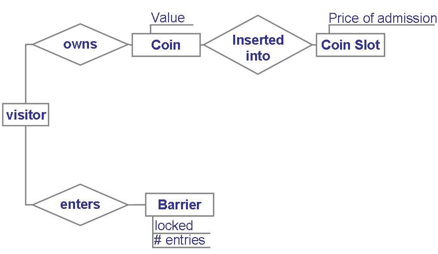

<!-- slide: 21 -->

## 4.5 建模表示法ER图  (continued)

- ER 流行的原因
  - 提供一个解决问题的总体概况
  - 当问题的需求发生变化时，该视图是相对稳定的
- ER 图可以在需求过程早期用于建模问题

<!-- slide: 22 -->

## UML是一种建模语言

- 建模方法 = 建模语言 + 建模过程。建模语言定义了用于表示设计的符号(通常是图形符号)；建模过程描述进行设计所需要遵循的步骤。
- 标准建模语言UML是一种建模语言，而不是一种方法，它统一了面向对象建模的基本概念、术语及其图形符号，为人们建立了便于交流的共同语言。
- 建模能力：建模方法 + 领域知识 + 实践

<!-- slide: 23 -->

## UML语言包含三方面内容：

- 1．UML基本图素：它是构成UML模型图的基本元素。例如类、对象、包、接口、组件等。
- 2．UML模型图：它由UML基本图素按照UML建模规则构成。例如用例图、类图、对象图、…等。
- 3．UML建模规则：UML模型图必须按特定的规则有机地组合而成,从而构成一个有机的、完整的UML模型图（well-formed UML diagram）。

<!-- slide: 24 -->

## UML支持软件体系结构建模

- 为了表达不同的软件开发相关人员在软件开发周期的不同时期看待软件产品的不同侧重面, 需要对模型进行分层。
- UML根据软件产品的体系结构（architecture）对软件进行分层

<!-- slide: 25 -->

- 软件体系结构由一系列的决定组成， 这些决定定义了如下内容：
  - 软件系统的组织；
  - 构成软件系统的结构元素的结构及它们之间的接口；
  - 结构元素的行为及元素之间的协同（collaboration）
  - 结构元素的不断组合以构成日渐完备的子系统的过程
  - 指导软件建造过程的
    - 软件构筑风格（architectural style）
    - 静态和动态元素之间的接口、协同、构成（composition）。

<!-- slide: 26 -->

- 软件体系结构不仅仅决定软件的结构和行为， 而且还决定软件的：
    - 用途
    - 功能
    - 性能
    - 应变性(resilience)
    - 可重用性
    - 经济和技术方面的限制和折衷
    - 以及美学考虑（aesthetic concern）

<!-- slide: 27 -->

## 体系结构的视图

- UML将软件的体系结构分解为五个不同的侧面，称为4＋1视图(view)。分别是：
  - 用例视图（Use case view）
  - 设计视图(design view)
  - 进程视图（process view）
  - 实现视图(implementation view)
  - 分布视图(deployment view)
  - 设计视图和进程视图又可被统一称为逻辑视图(logical view)。

<!-- slide: 28 -->

- 每个视图分别关注软件开发的某一侧面
- 视图由一种或多种模型图(diagram)构成
- 模型图描述了
  - 构成相应视图的基本模型元素（element）
  - 及它们之间的相互关系。

<!-- slide: 29 -->

## 用例视图（use case view）

- 用例视图用来支持软件系统的需求分析，它定义系统的边界，关注的是系统的外部功能的描述。
- 它从系统的使用者的角度，描述系统的外部的
  - 静态的功能
  - 动态行为
- 系统的动态功能由UML以下模型图描述：
  - 交互图(interaction diagram)，包括顺序图和协作图。
  - 状态图(state-chart diagram)
  - 活动图(activity diagram)

<!-- slide: 30 -->

## 逻辑视图（Logical View）

- 逻辑视图定义系统的实现逻辑, 描述为实现用例图描述的功能，在对软件系统进行设计时, 所产生的设计概念，设计概念又称为软件系统的设计词汇 (vocabulary)。
- 逻辑视图定义了:
  - 设计词汇的逻辑结构
  - 存在于它们之间的语义联系
  - 设计词汇包括系统的类/协同/接口及其关系

<!-- slide: 31 -->

- 对逻辑视图的描述在原则上与软件系统的实现平台无关。 它相当于电子产品生产中的电原理图。逻辑视图包含的模型图有：
  - 类图（class diagrams）
  - 对象图（object diagrams）
  - 交互图（interaction diagrams）
  - 状态图（state-chart diagrams）
  - 活动图（activity diagrams）

<!-- slide: 32 -->

## 3.5 实现视图（implementation view）

- 当系统的逻辑结构在逻辑视图里被定义之后， 需要定义逻辑结构的物理实现。这包括：
  - 设计元素对应的源代码文件
  - 各物理文件之间的关系、存放路径，等等
- 实现视图就是定义这些内容的地方，它当于电子产品的印刷电路板的布线图

<!-- slide: 33 -->

- 实现视图描述组成一个软件系统的各个物理部件，这些部件以各种方式组合起来，（如： 不同的源代码经过编译，构成一个可执行系统； 或者不同的软件组件配置成为一个可执行系统；以及不同的网页文件，以特定的目录结构，组成一个网站，等等） 构成了一个可实际运行的系统。
- 实现视图包含的模型图有:
  - 部件图（Component diagram）
  - 交互图（Interaction Diagram）
  - 状态图（state-chart diagram）
  - 活动图（activity diagram）

<!-- slide: 34 -->

## 部署视图（Deployment View）

- 软件产品将运行在计算机硬件系统上, 如果软件产品是面向网络的应用系统，则有可能同时运行在多个计算机上。
- 分布视图用来描述软件产品在计算机硬件系统和网络上的安装、分发（delivery）、分布（distribution）

<!-- slide: 35 -->

- 在分布视图中，系统的静态特性用分布图（deployment diagram）描述
- 动态特性的描述用
  - 交互图（interaction diagram）
  - 状态图（state-chart diagram）
  - 活动图（activity diagram）

<!-- slide: 36 -->

- UML基本模型元素及其关系必须通过某种载体表示，这种载体就是模型图（diagram）
- 在UML中，模型图是一组UML基本模型元素的图形表示，它通常由一组节点（UML基本模型元素）, 及节点之间的连线（关系）组成
- 软件系统体系结构的5个视图的内容, 就是用模型图来表达的
- 一般地说，一个UML基本模型元素既可以出现在所有的模型图中，又可以出现在某些模型图中，甚至可以不在任何一个模型图上出现

<!-- slide: 37 -->

- 9种UML模型图。它们是:
  - 类图
  - 对象图
  - 用例图
  - 序列图
  - 协同图
  - 状态图
  - 活动图
  - 组件图
  - 分布图

<!-- slide: 38 -->

## 4.5 建模表示法ER 图例子: UML 类图

- 统一建模语言UML (Unified Modeling Language) 是用于文档化软件规格说明和设计的一组表示法
- 用下列术语表示一个系统
  - 对象: 类似于实体，按照具有的继承层次的类进行组织
  - 方法: 在对象的变量上执行动作
- 类图是“旗舰型”的模型
  - 是与规格说明中的类相关的高级ER图

<!-- slide: 39 -->

## 4.5 建模表示法图书馆问题的UML 类图

- 
- 
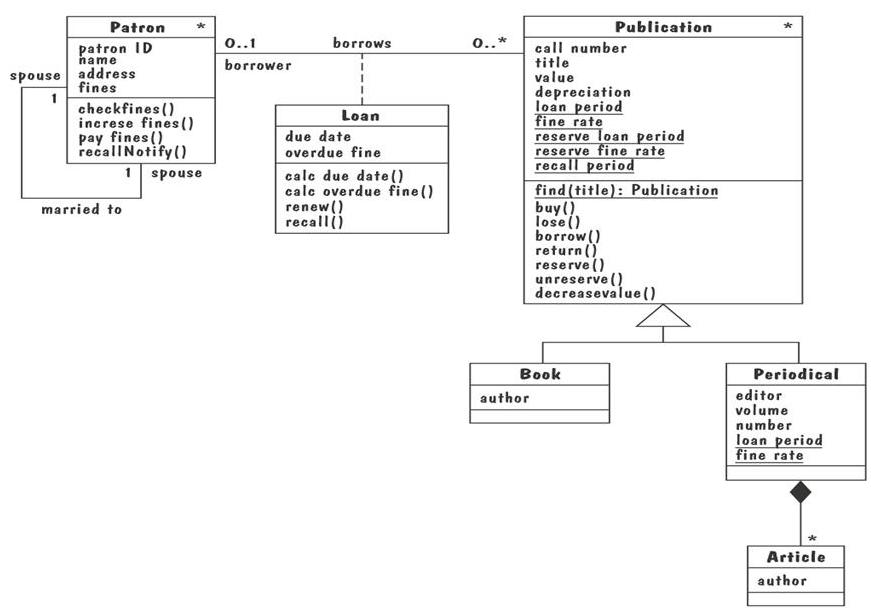

<!-- slide: 40 -->

## 4.5 建模表示法UML 类图 (continued)

- 某些属性和操作是与类相关联的，而不是与类的实例相关联的
- 类范围属性是用带下划线的属性表示，是被类的所有实例共享的数据值
- 类范围操作书写为带下划线的操作，是被抽象类执行的操作，而不是类实例执行的操作
- 关系，标记为两个实体之间的连线表示类的实体之间的关系

<!-- slide: 41 -->

## 4.5 建模表示法UML 类图 (continued)

- 聚合关联表示涉及关联的类中对象的相互作用或事件
  - “has-a” 关系
- 组装关联是一种特殊的聚合，其中，复合类的实例是物理上由成分类的实例组成的

<!-- slide: 42 -->

## 4.5 建模表示法事件跟踪

- 关于现实世界实体之间交换的时间序列的图形描述
  - 垂直线: 不同实体的时间线，其名字出现在线的顶部
  - 水平线: 两个实体之间的一个事件或交互
  - 时间按从顶到下跟踪进展
- 每一个图描述一个跟踪，表示只是若干个可能行为中的一个
- 事件跟踪语义相对简单，易于理解

<!-- slide: 43 -->

## 4.5 建模表示法事件跟踪 (continued)

- 图形表示十字转门问题中的事件跟踪
  - 左边的跟踪表示典型行为
  - 右边的跟踪表示异常行为
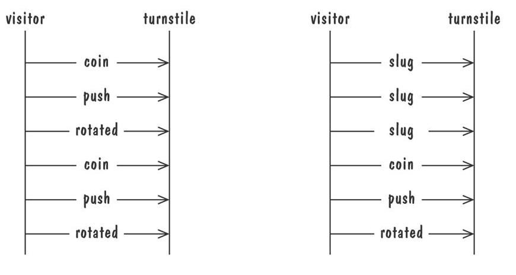

<!-- slide: 44 -->

## 4.5 建模过程事件跟踪例子: 消息时序图（MSC: Message Sequence Chart）

- 扩充的事件跟踪表示法，具有创建和撤销实体、指定动作和计时器、以及组合事件踪迹的能力
  - 竖线表示参与的实体
  - 一个消息描述为从发送实体到接收实体的箭头
  - 动作表示为位于实体执行线上的带标记的矩形
  - 条件是一个实体演化的重要状态，用有标记的六边形表示

<!-- slide: 45 -->

## 4.5 建模表示法消息时序图 (continued)

- 图书借出事务的消息时序图
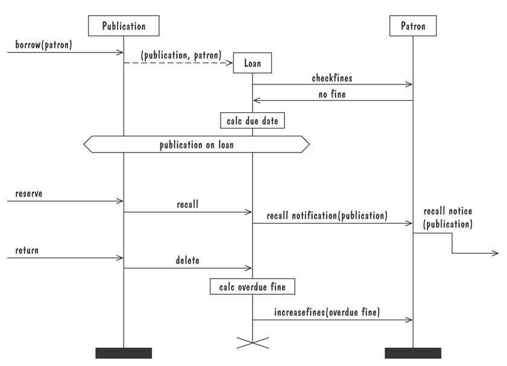

<!-- slide: 46 -->

## 4.5 建模表示法状态机

- 是一种图形描述，描述了系统与其环境之间的所有对话
  - 点(状态) 表示存在于事件发生之间的一个稳定的条件集合
  - 边(转移) 表示由于一个事件的发生而产生的行为或条件的变化
- 在表示动态行为方面，以及在描述在响应已经发生的历史事件时行为将如何变化方面很有用

<!-- slide: 47 -->

## 4.5 建模表示法状态机 (continued)

- 十字转门的有限状态机模型
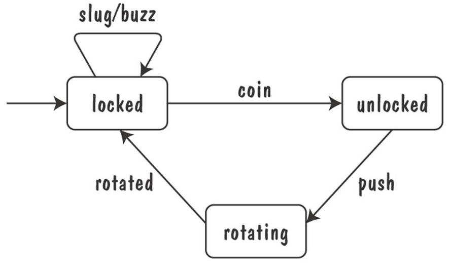

<!-- slide: 48 -->

## 4.5 建模表示法状态机 (continued)

- 路径: 起始于状态机的初始状态，沿着从状态到状态的转移 , 表示了环境中的一条可观察事件的跟踪
- 确定的状态机: 对每一个状态和事件都有一个唯一的响应

<!-- slide: 49 -->

## 4.5 建模表示法状态机例子: UML 状态图

- UML状态图描述一个UML类中对象的动态行为
  - UML 类图没有说明实体是如何运转的，行为是如何变化的
- UML 模型是一组并发执行的状态图
- UML 状态图含有丰富的语法，包括状态层次、并发性、状态机间通信

<!-- slide: 50 -->

## 4.5 建模表示法UML 状态图 (continued)

- 状态层次，通过将那些具有公共转移的状态合并进超状态，用来使状态图更加整洁
- 一个超状态可能实际上包含多个并发的子状态机，这些子状态及由虚线分开
  - 子状态机被认为是并发执行的

<!-- slide: 51 -->

## 4.5 建模表示法UML 状态图 (continued)

- Publication 类的UML 状态图
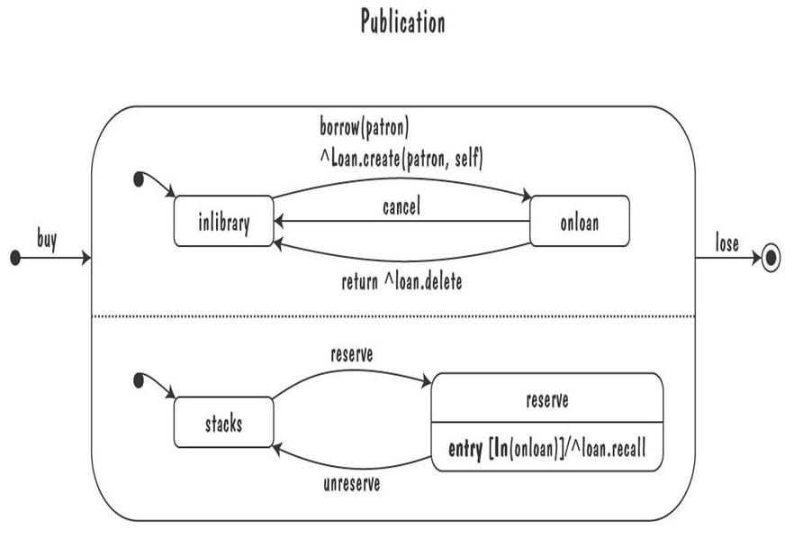

<!-- slide: 52 -->

## 4.5 建模表示法UML 状态图 (continued)

- Publication 类的杂乱的UML状态图
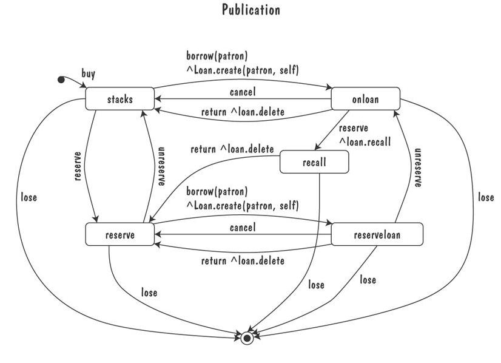

<!-- slide: 53 -->

## 4.5 建模表示法UML 状态图 (continued)

- Loan关联类的 UML状态图，说明如何用局部变量、动作和活动来注释状态
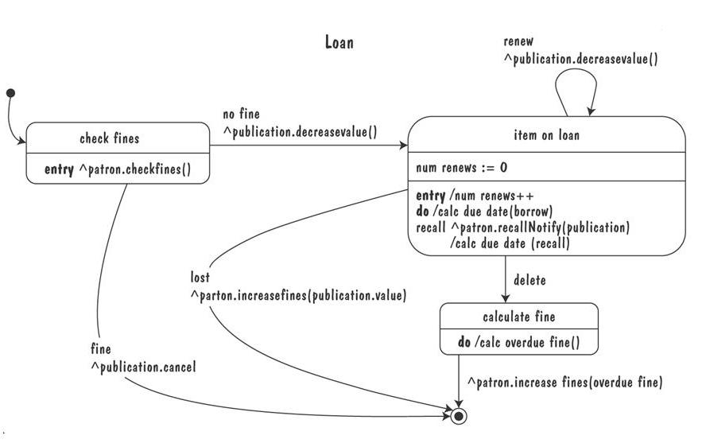

<!-- slide: 54 -->

## 4.5 建模表示法Petri网

- Petri 网是状态-转移表示法的一种形式，用于建模并发活动以及他们之间的交互。
- 圆圈：位置
- 条：变迁
- 弧：箭头
- 点：令牌

<!-- slide: 55 -->

## 4.5 建模表示法数据流图

- ER 图，事件跟踪和状态机描述的仅仅是转移为一组更低层的行为
- 数据流图 (DFD) 建模功能以及从一个功能到另一个功能数据流
  - 一个泡泡表示： 一个 加工
  - 箭头表示： 数据流
  - 平行线：数据存储: 正式的库或信息库
  - 矩形：表示参与者: 提供输入数据或接受输出的实体

<!-- slide: 56 -->

## 4.5 建模表示法数据流图 (continued)

- 图书馆问题的高层数据流图
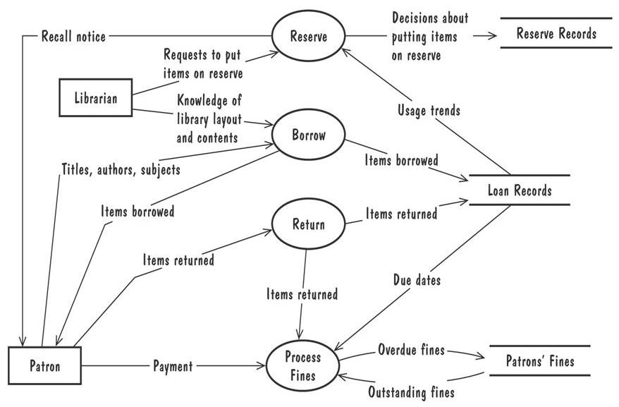

<!-- slide: 57 -->

## 4.5 建模表示法数据流图 (continued)

- 优点:
  - 提供关于被提议系统的高层功能的，以及各种加工之间的数据依赖关系的一个直观模型
- 缺点:
  - 对不太熟悉正在建模的问题的软件开发人员来说，数据流图是含糊不清的

<!-- slide: 58 -->

## 4.5 建模表示法数据流图的例子: 用例

- 构成
  - 大的方框: 系统边界
  - 方框外的小人: 参与者，人或者系统
  - 方框内的椭圆: 用例，表示必须的主要功能及其变种
  - 参与者和用例之间的线: 参与者参与了该用例
- 用例不一定建模系统应该提供的所有任务，而是用于说明用户对重要系统行为的观察

<!-- slide: 59 -->

## 4.5 建模表示法用例 (continued)

- 图书馆用例，包括借书、还书、支付罚金
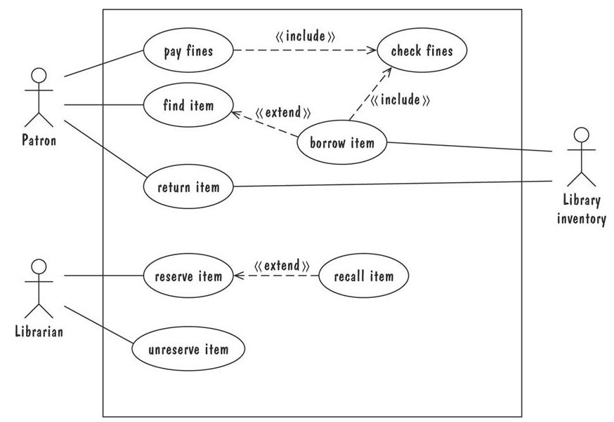

<!-- slide: 60 -->

## 4.6 需求规格说明语言统一建模语言 (UML)

- UML表示法包括
  - 用例图 (一种高层的 DFD)
  - 类图 (一种ER 图)
  - 时序图 (一种事件跟踪)
  - 协作图 (一种事件跟踪)
  - 状态图 (一种状态机模型)

<!-- slide: 61 -->

## 4.7 原型化需求建立一个原型

- 能够引发细节的一种方式
- 请求潜在用户反馈信息
  - 他们希望看到哪个方面被改进
  - 哪些特征不那么有用
  - 遗漏了那些功能
- 确定客户问题是否有一个可行的解决方案
- 帮助发现优化质量需求的可选方案

<!-- slide: 62 -->

## 4.7 原型化需求原型化例子

- 原型化方法构建一个工具用于跟踪一个用户每天的锻炼情况
- 第一个原型, 在里面用户必须输入年月日
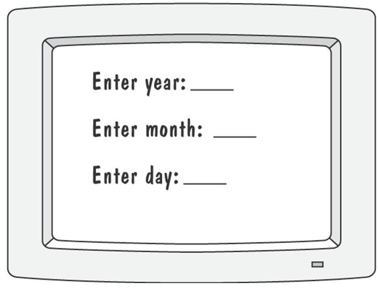

<!-- slide: 63 -->

## 4.7 原型化需求原型化例子 (continued)

- 第二个原型，一个更有趣和复杂的界面是使用日历
  - 用户使用日历选择年月
  - 系统显示了月的图表，用户在图表中选择合适的日期
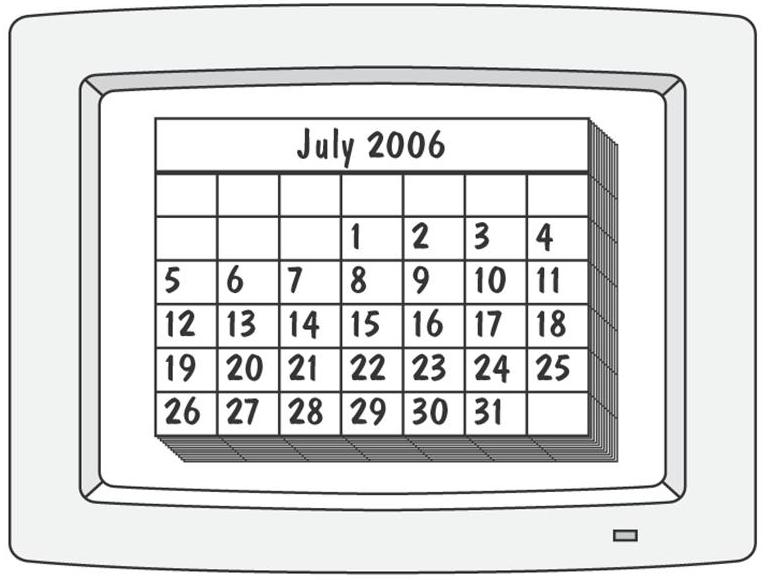

<!-- slide: 64 -->

## 4.7 原型化需求原型化例子 (continued)

- 第三个原型，系统没有日历，而是给出了三个滑动条
  - 用户用鼠标左右拖动每个滑动条
  - 盒子底部屏幕的变化显示了选择的年月日
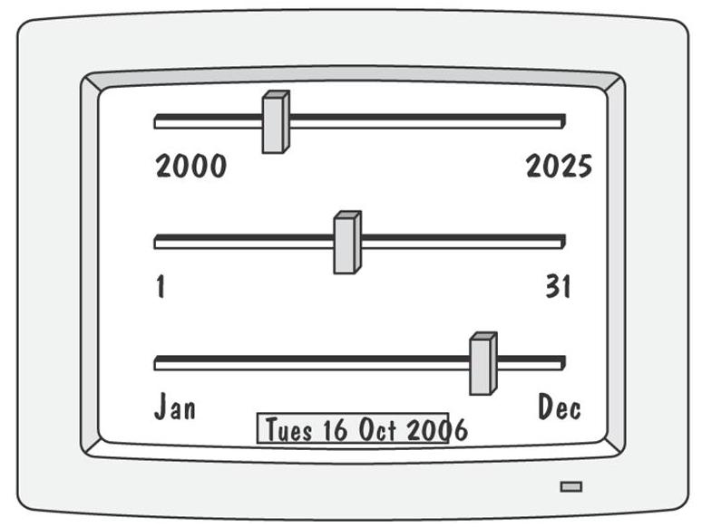

<!-- slide: 65 -->

## 4.7 原型化需求原型化方法

- 抛弃型原型
  - 为了对问题或提议的解决方案有更好的了解而开发的软件
  - 允许我们编写“快速而不考虑质量”的软件
- 演化型原型
  - 不仅帮我们回答问题，而且还要演变为最终产品
  - 原型必须展现最终产品的质量需求，并且这些质量的要求不能改进
- 两种方法都有时被称作快速原型化

<!-- slide: 66 -->

## 4.7 原型化需求原型化 vs. 建模

- 原型化
  - 容易回答用户界面的问题
- 建模
  - 快速回答事件将要发生的顺序这样的约束问题，或者关于活动的同步问题

<!-- slide: 67 -->

## 4.8 需求文档需求定义: 文档化过程定义

- 概述系统的总体目的和范围，包括相关的益处、目的和目标
- 描述系统开发的背景和理由
- 描述一个可接受的解决方案的基本特征
- 描述系统运行的环境
- 如果客户对解决问题有提议，概略描述该提议
- 列出我们对环境作出的任何假设

<!-- slide: 68 -->

## 4.8 需求文档需求规格说明: 文档化过程步骤

- 详细描述输入和输出 ，包括
  - 输入的源
  - 输出的目的地,
  - 有效范围
  - 输入输出的数据格式
  - 数据协议
  - 窗口格式和组织
  - 计时约束
- 根据接口的输入输出重新陈述要求的功能
- 对用户的质量需求，设计适配标准

<!-- slide: 69 -->

## 4.8 需求文档 按对象组织的软件需求规格说明书的IEEE 标准

- Introduction to the Document
  - 1.1  Purpose of the Product
  - 1.2  Scope of the Product
  - 1.3  Acronyms, Abbreviations, Definitions
  - 1.4  References
  - 1.5  Outline of the rest of the SRS
- General Description of Product
  - 2.1  Context of Product
  - 2.2  Product Functions
  - 2.3  User Characteristics
  - 2.4  Constraints
  - 2.5  Assumptions and Dependencies
- Specific Requirements
  - 3.1  External Interface Requirements
    - 3.1.1  User Interfaces
    - 3.1.2  Hardware Interfaces
    - 3.1.3  Software Interfaces
    - 3.1.4  Communications Interfaces
  - 3.2  Functional Requirements
    - 3.2.1  Class 1
    - 3.2.2  Class 2
    - …
  - 3.3  Performance Requirements
  - 3.4  Design Constraints
  - 3.5  Quality Requirements
  - 3.6  Other Requirements
- Appendices

<!-- slide: 70 -->

## 4.8 需求文档过程管理和需求的可跟踪性

- 过程管理是一套步骤，跟踪：
  - 定义需求：系统应该做什么
  - 需求生成的设计模块
  - 事先设计的程序代码
  - 验证系统功能的测试
  - 描述系统的文档
- 提供将系统部件联系起来的线索

<!-- slide: 71 -->

## 4.8 需求文档开发活动

- 软件-开发实体间的链接
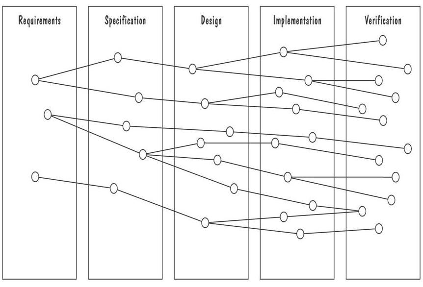
