# c-slides05(110325-110401)

<!-- slide: 1 -->

## Chapter 5

- 设计系统
- Copyright 2006 Pearson/Prentice Hall. All rights reserved.

<!-- slide: 2 -->

## 目录

- 5.1   	什么是设计?
- 5.2   	分解和模块化
- 5.3   	体系结构的风格和策略
- 5.4   	创建设计中的问题
- 5.5   	好的设计的特性
- 5.6	改进设计的技术
- 5.7	涉及的评估和确认
- 5.8	设计文档化
- 5.9	信息系统的例子
- 5.10	实施系统的例子
- 5.11	本章对单个开发人员的意义

<!-- slide: 3 -->

## 本章主要内容

- 概念设计和技术设计
- 设计风格，技术和工具
- 好的设计的特性
- 确认设计
- 文档化设计

<!-- slide: 4 -->

## 5.1 设计是什么?

- 设计是将问题转化为解决方案的创造性工作
- 一个解决方案的描述也称为设计
  - 需求规格说明定义问题
  - 设计文档说明了问题的一个特定解决方案

<!-- slide: 5 -->

## 5.1 什么是设计?

- 设计是一个两个部分的迭代过程
  - 概念设计 (系统设计)
  - 技术设计
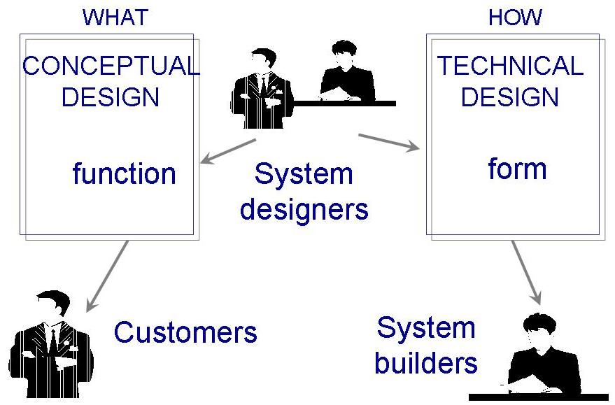

<!-- slide: 6 -->

## 5.1 设计是什么?概念设计

- 告诉客户系统将做什么
  - 数据来自哪里?
  - 系统中数据会发生什么情况?
  - 对用户来说，系统将会是什么?
  - 向用户提供的选择是什么?
  - 事件的计时是什么?
  - 报表和屏幕是什么样的?

<!-- slide: 7 -->

## 5.1 设计是什么?概念设计 (continued)

- 优秀的概念设计的特性
  - 客户语言
  - 不包含技术行话
  - 描述系统功能
  - 与实现无关
  - 与需求文档链接起来

<!-- slide: 8 -->

## 5.1 设计是什么?概念设计 (continued)

- 两种设计文档的区别
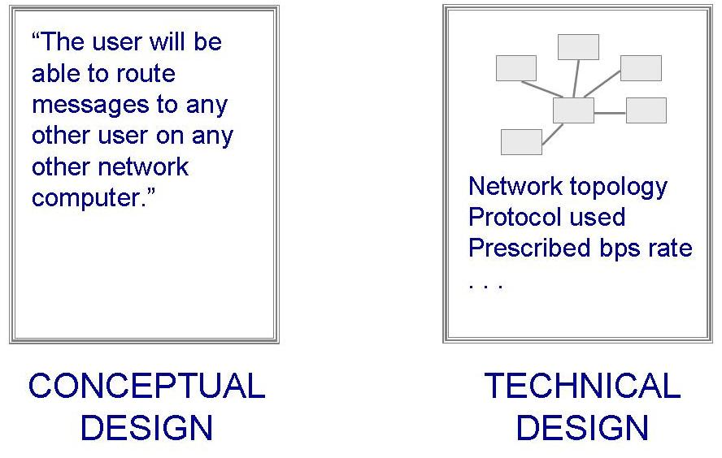

<!-- slide: 9 -->

## 5.1 设计是什么?技术设计

- 告诉变成这系统将做什么
  - 对主要硬件部分及其功能的描述
  - 软件构件的层次和功能
  - 数据结构
  - 数据流

<!-- slide: 10 -->

## 5.2 分解和模块化创建设计的5种方式

- 模块化分解
- 面向数据的分解
- 面向事件的分解
- 由外到内的设计
- 面向对象的设计

<!-- slide: 11 -->

## 5.2 分解和模块化模块化

- 模块或构件: 涉及的组成部分
- 系统是模块化的：
  - 当系统的每个活动都刚好由一个构件构成
  - 当每个构件的输入和输出都是明确定义的
    - 它所有的输入对它的功能是重要的
    - 所有的输出都是由它的一个动作产生的

<!-- slide: 12 -->

## 5.3 体系结构风格和策略三个设计层次

- 体系结构:  关联系统构件
- 代码设计:  每个构件的算法和数据结构
- 可执行设计:  设计的最底层，包括内存分配、数据格式和位模式

<!-- slide: 13 -->

## 5.3 体系结构风格和策略设计风格

- 管道和过滤器
- 面向对象的设计
- 隐含调用
- 分层
- 信息库
- 客户-服务器

<!-- slide: 14 -->

## 5.3体系结构风格和策略管道和过滤器

- 系统有
  - 数据流（管道）作为输入和输出
  - 数据从输入到输出的转换 (过滤器)
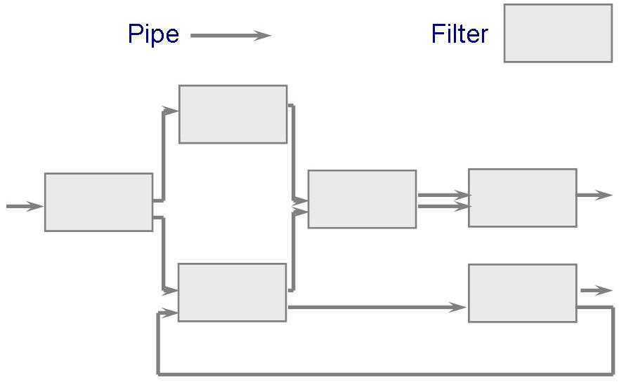

<!-- slide: 15 -->

## 5.3体系结构风格和策略管道和过滤器 (continued)

- 一些重要的特性
  - 设计人员能理解整个系统对输入和输出的影响
  - 因为可以将任何两个过滤器连接在一起
  - 系统的演化很简单
  - 允许过滤器并发执行
- 缺点
  - 鼓励使用批处理
  - 不善于处理交互式应用
  - 重复其他过滤器执行的准备功能

<!-- slide: 16 -->

## 5.3体系结构风格和策略面向对象的设计

- 必须有两个特性
  - 对象必须保持数据的完整性
  - 数据表示必须对其他对象是隐藏的
    - 易于改变是实现部分，而不影响系统的其他部分
- 一个对象要与其他对象交互，必须知道其他对象的标识

<!-- slide: 17 -->

## 5.3体系结构风格和策略隐含调用

- 设计模型是事件驱动，基于广播的概念
- 数据交换必须通过信息库中共享的数据完成
- 应用
  - 用于分组交换网
  - 用于数据库中一确保一致性
  - 用于用户界面中
- 从其他系统中复用设计构件时，这种设计风格格外有用
- 缺陷: 不能保证某个构件一定会响应一个事件

<!-- slide: 18 -->

## 5.3体系结构风格和策略分层

- 各层是按层次化组织的
  - 每一层为它的外层提供服务，同时又作为内层的客户
- 设计包含的协议
  - 解释两层之间将如何交互的协议
- 优势
  - 高度利用了抽象的概念
  - 增加或修改一个层次相对比较容易
- 缺点
  - 按照层次来组织系统并非总是这么容易的
  - 系统性能也会受到层次之间的额外协调的影响

<!-- slide: 19 -->

## 5.3体系结构风格和策略分层系统的例子

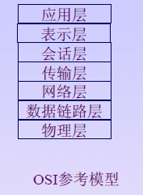

<!-- slide: 20 -->

## 5.3体系结构风格和策略信息库

- 两种构件
  - 中心数据存储
  - 在中心数据存储上进行存储、检索和更新信息的构件集
- 设计信息库的挑战：决定构件如何进行交互
  - 传统数据库: 事务以输入流的形式触发进程执行
  - 黑板: 中心数据存储控制进程的触发

<!-- slide: 21 -->

## 5.3体系结构风格和策略信息库 (continued)

- 主要优点: 开放性
  - 数据表示对不同的厂商都是可用的，这样厂商可以构建工具来访问信息库
  - 缺点: 数据必须是所有知识源可接受的形式
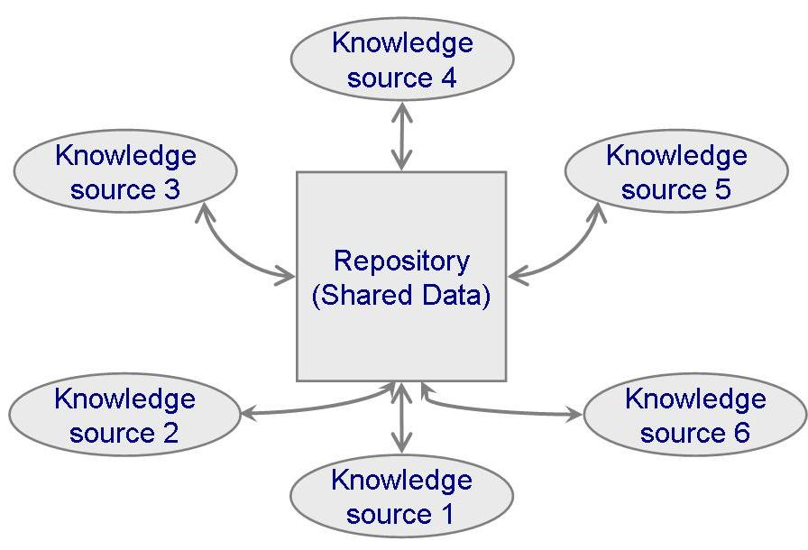

<!-- slide: 22 -->

## 5.3体系结构风格和策略其他风格

- 分布式系统体系结构: 客户-服务器
  - 优点
    - 用户可以只在需要时获得信息
  - 缺点
    - 需要更复杂的安全措施、系统管理和应用开发
- 特定领域体系结构
  - 利用特定领域所具有的共性
- 异构的体系结构

<!-- slide: 23 -->

## 5.3体系结构风格和策略客户-服务器

- 分布式系统通常用拓扑结构对它们进行描述
- 可以将其组织为如图所示的环形结构或星形结构
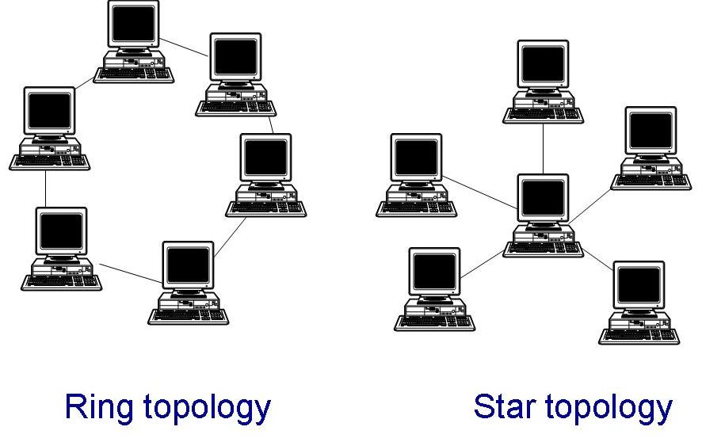

<!-- slide: 24 -->

## 5.4 创建设计中的问题

- 模块化和抽象层次
- 协作的设计
- 设计用户界面
- 并发性
- 设计模式和复用

<!-- slide: 25 -->

## 5.4创建设计中的问题 模块化和抽象层次

- 抽象层次: 某一层次构件都细化了其上层的构件，当转移到更低层时，就会发现每个构件的更多细节
- 信息隐藏: 构件对其他部分隐藏了内部细节和处理
- 模块化提供了更多的灵活性
  - 理解系统
  - 跟踪数据流和功能
  - 制定复杂性目标

<!-- slide: 26 -->

## 5.4创建设计中的问题 补充资料5.2 使用抽象

- DO WHILE I is between 1 and (length of L)-1:
- Set LOW to index of smallest value in L(I), ..., L(length of L)
- Interchange L(I) and L(LOW)
- END DO
- 用非递减顺序重新排列L

<!-- slide: 27 -->

## 5.4创建设计中的问题 协作的设计

- 大多数项目是协作产生的
- 设计团队要处理的问题
  - 谁是设计系统的某个部分最合适的人
  - 怎样文档化设计
  - 怎样协调设计构件
- 协作设计中要解决的问题
  - 个人的经验、理解和偏爱不同
  - 人们有时候在小组中的行为方式和单独时的行为方式有所不同

<!-- slide: 28 -->

## 5.4创建设计中的问题 协作的设计: 分布式开发

- 四个阶段
  - 项目是在单个地点和国外的现场开发人员一起进行的
  - 现场的分析员确定系统的需求。然后向不在场的设计和编码人员小组提供需求
  - 不在现场的开发人员构造可用于全球范围的通用产品和构件
  - 不在现场的开发人员利用他们各自领域的知识，构造出产品
- 问题
  - 语言
  - 交流途径

<!-- slide: 29 -->

## 5.4创建设计中的问题 设计用户界面

- 需要处理的关键要素
  - 隐喻
  - 头脑中的模型
  - 模型中的导航规则
  - 外观: 系统向用户传输信息的外观特性
  - 感觉: 向用户提供有吸引力的体验和交互技术
- 必须考虑的两个关键问题
  - 文化问题
  - 用户偏爱

<!-- slide: 30 -->

## 5.4创建设计中的问题 确定用户界面特性的指导原则

- 根据设计空间考虑设计原则
- 每个权衡至少反映两个纬度的选择
- 典型的设计空间：
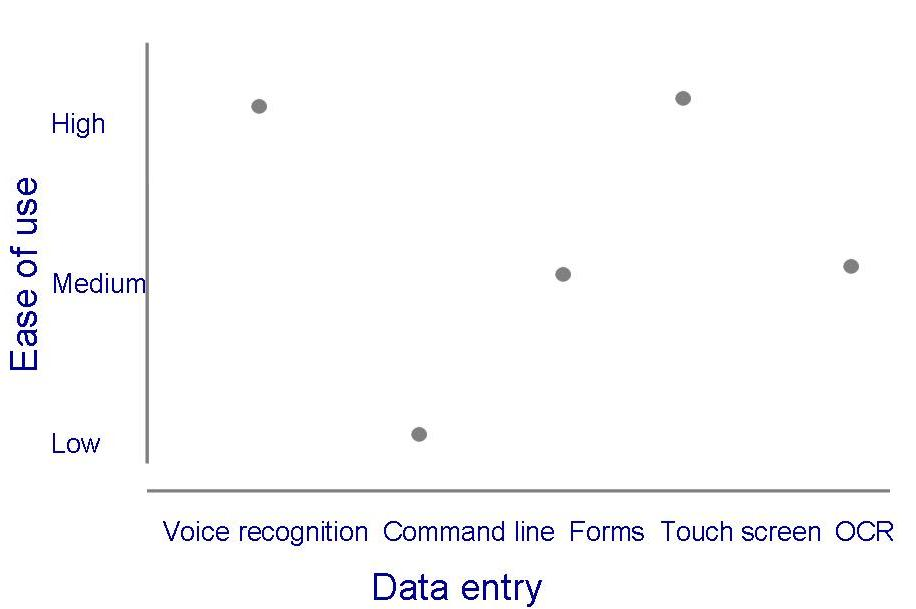

<!-- slide: 31 -->

## 5.4创建设计中的问题 并发性

- 问题
  - 并发性是构件之间共享的数据同时执行
  - 确保一个动作的执行不会影响另一个动作
- 解决
  - 同步: 允许两个活动互不干扰地并发发生的方法
  - 互斥: 某进程访问数据元素时，其他进程都不会改变该元素
  - 监控器: 控制特定进程互斥的抽象对象或构件

<!-- slide: 32 -->

## 5.4创建设计中的问题 设计模式和复用

- 设计模式命名、抽象并标识公共设计结构的主要方面，使其可用于创建可复用的设计
- 标识
  - 参与的类和实例
  - 角色和协作
  - 责任的分配

<!-- slide: 33 -->

## 5.5 好设计的特性

- 构件独立性
  - 耦合度
  - 内聚度
- 异常标识和处理
- 防错和容错技术
  - 主动故障检测
  - 故障改正

<!-- slide: 34 -->

## 5.5好设计的特性耦合度

- 高度耦合：当两个构件之间有大量依赖关系的时候
- 松散耦合：当两个构件具有某种程度的依赖，但他们之间的相互连接比较弱
- 非耦合：构件之间不存在相互连接
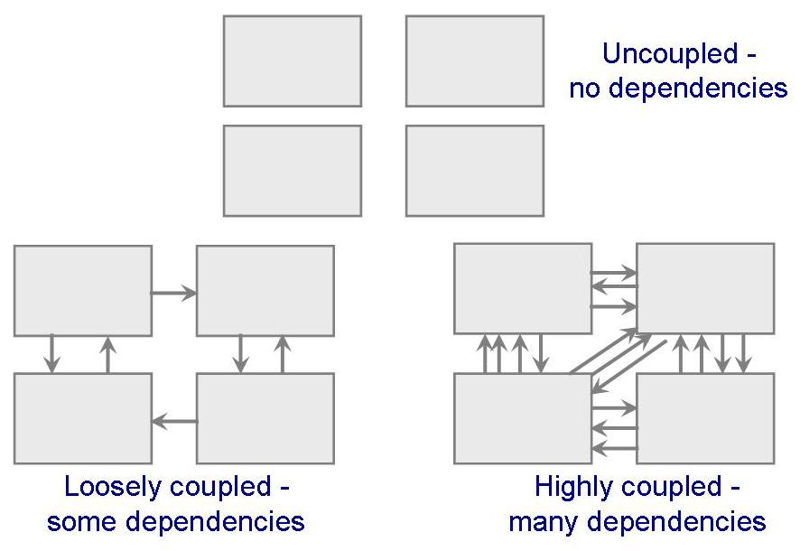

<!-- slide: 35 -->

## 5.5好设计的特性耦合度 (continued)

- 构件间的耦合度取决于：
  - 构件的引用
  - 构件间传递的数据量
  - 构件控制其他构件的数量
  - 构件之间接口的复杂程度
- 耦合度测量的范围：
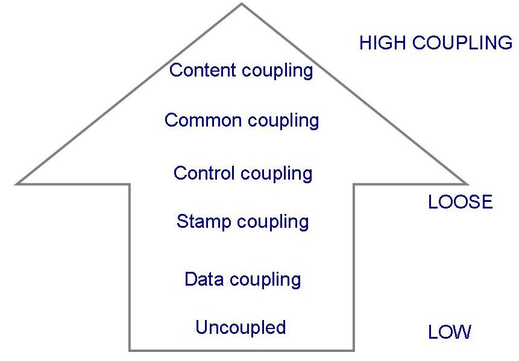

<!-- slide: 36 -->

## 5.5好设计的特性耦合度: 耦合度的类型

- 内容耦合
- 公共耦合
- 控制耦合
- 标记耦合
- 数据耦合

<!-- slide: 37 -->

## 5.5好设计的特性内容耦合

- 当一个构件修改了另一个构件的内部数据项时，或一个构件内的分支转移到另外一个构件中的时候，可能出现内容耦合
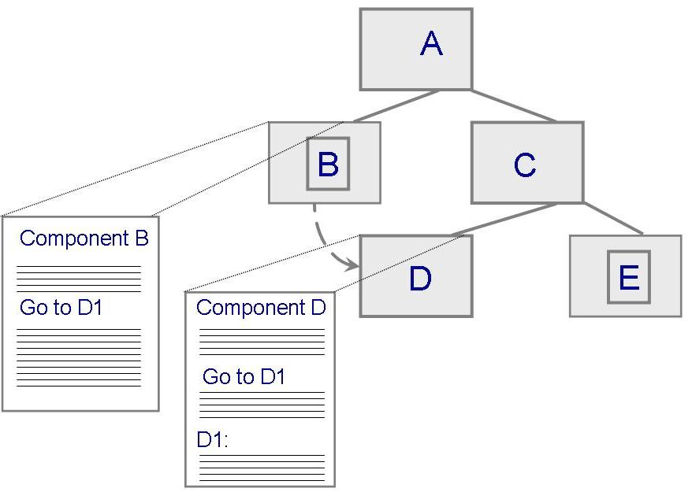

<!-- slide: 38 -->

## 5.5好设计的特性公共耦合

- 对公共数据的改变意味着需要通过反向跟踪所有访问过该数据的构件来评估该改变的影响
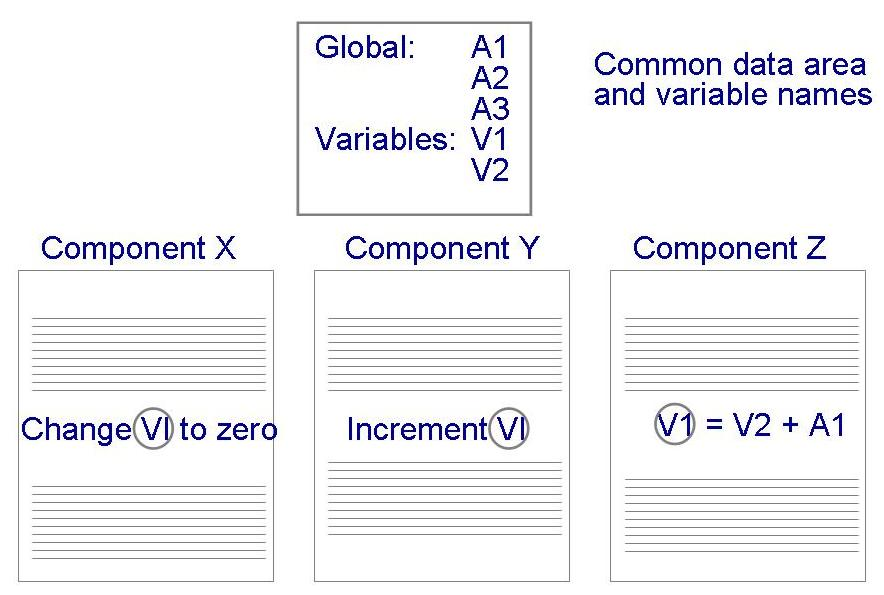

<!-- slide: 39 -->

## 5.5好设计的特性内聚度

- 如果构件的所有元素都是直接面向执行同一个任务的并且必须的，那么该构件是内聚的
- 内建的类型
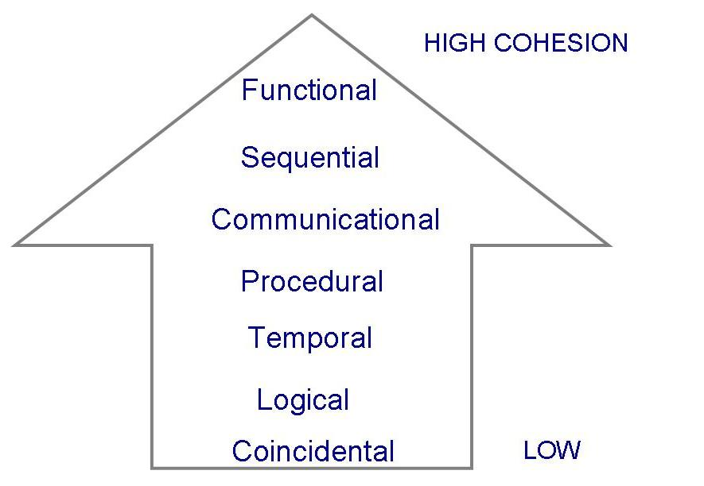

<!-- slide: 40 -->

## 5.5好设计的特性内聚的例子

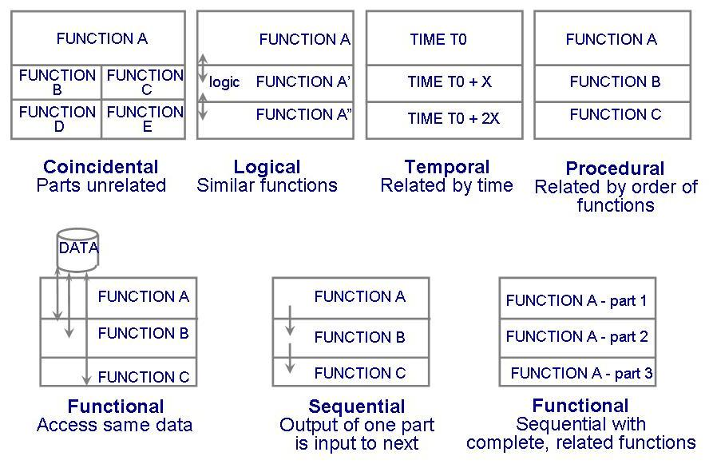

<!-- slide: 41 -->

## 5.5好设计的特性异常标识和处理

- 异常: 与期望系统做的事情相反的已知情况
  - 提供服务失败
  - 提高了错误的服务或数据
  - 破坏了数据
- 异常可以用下列三种方式之一处理
  - 重试
  - 改正
  - 报告

<!-- slide: 42 -->

## 5.5好设计的特性补充资料 5.4 控制问题

- 系统1和系统2 是同一个系统的两种可能的设计
  - 扇入 是控制一个特定构建的那些构件的个数
  - 扇出 是受该构件控制的那些构件的个数
- 拥有低扇出的系统设计好
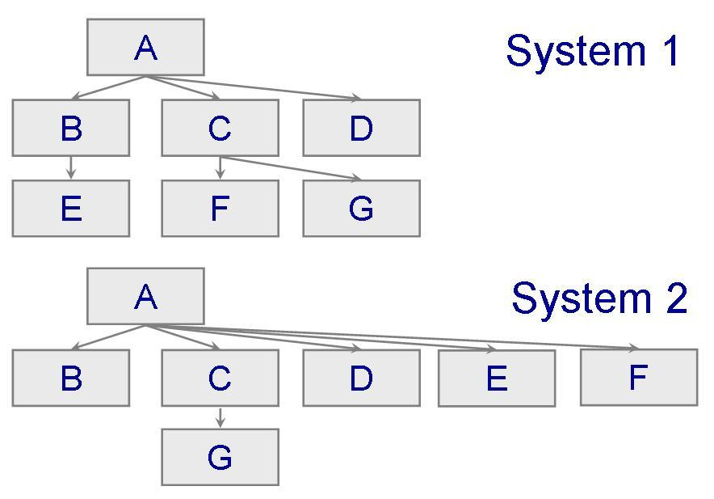

<!-- slide: 43 -->

## 5.5好设计的特性防错和容错技术

- 主动错误检测:  定期检查故障的征兆，或设法预见故障的发生
  - 互相怀疑
  - n- 版本编程
  - 诊断事务
- 被动错误检测: 执行过程中一直等到一个错误发生
- 故障改正: 故障发生时系统的补偿
- 容错: 对故障造成的损失进行隔离

<!-- slide: 44 -->

## 5.6 改进设计的技术

- 降低复杂性
- 按合同设计
- 原型化设计
- 故障树分析

<!-- slide: 45 -->

## 5.6改进设计的技术原型化设计

- 如同在需求分析阶段一样，原型化在设计阶段也具有很多优点
- 一个可行性原型可以让我们在设计阶段审视提出的解决方案是否真正解决了问题
- 当决定原型化是否适合你的项目时，需要进行若干权衡

<!-- slide: 46 -->

## 5.6改进设计的技术故障树分析: 阶段

- 标识可能的失效
- 构造图
  - 节点表示失效，可以使单个构件的、系统功能的或者是整个系统的失效
  - 边表明节点间的关系

<!-- slide: 47 -->

## 5.6改进设计的技术故障数分析: 一个例子

- 发电厂控制系统的部分
- 从这个故障树我们可以构造另一棵树
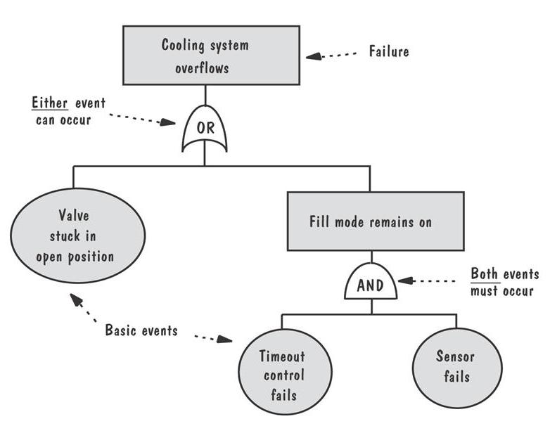

<!-- slide: 48 -->

## 5.7涉及的评估和确认数学的确认

- 将系统分解成一组过程
  - 一组输入
  - 一组预期的输出
  - 一组关于过程的断言
- 对每一个过程，要证明：
  - 如果输入是正确表示的，则能够将其适当的转换为预期输出的集合
  - 过程结束（没有失效）
- 这个过程证明了“设计”是正确的

<!-- slide: 49 -->

## 5.7涉及的评估和确认设计评审

- 初步设计评审
  - 和客户以及用户一起检查概念设计
- 关键设计评审
  - 将技术设计介绍给其他开发人员
- 程序设计评审
  - 编程人员可以在实现前得到关于设计的反馈

<!-- slide: 50 -->

## 5.11 本章对单个开发人员的意义

- 讨论了设计一个系统意味着什么
- 设计从高层开始，作出关于系统体系结构的重要决策
  - 系统需求
  - 适当的属性
  - 长期的意图
- 进行设计时，应该记住几个特性：
  - 模块化和抽象的层次
  - 耦合度和内聚度
  - 容错性、愿望和用户界面设计
