# c-slides

<!-- slide: 1 -->

## Chapter 6

- 细述对象
- Copyright 2006 Pearson/Prentice Hall. All rights reserved.

<!-- slide: 2 -->

## Contents

- 6.1   什么是 OO?
- 6.2   OO 开发过程
- 6.3   用例
- 6.4   OO的表示: 一个使用UML的例子
- 6.5   OO 系统设计
- 6.6	OO 程序设计
- 6.7	OO 测度
- 6.8   信息系统的例子
- 6.9  	实施系统的例子
- 6.10 本章对单个开发人员的意义

<!-- slide: 3 -->

## 本章内容

- 面向对象开发的特殊性质
- 用例
- 使用UML
- 面向对象的系统设计
- 面向对象的程序设计
- 面向对象的测度

<!-- slide: 4 -->

## 6.1 什么是 OO?

- OO是一种软件开发方法，它将问题的解决方案组织为离散对象的集合
  - 数据结构
  - 行为操作

<!-- slide: 5 -->

## 6.1 什么是 OO?补充资料 6.1 皇家汽车服务站系统的需求

- 皇家汽车服务站提供三种服务
- 系统必须按月跟踪账单，按日跟踪加油站提供的产品和服务
- 加油站经理可以利用系统控制库存
- 系统会记录信用卡的历史记录
- 系统只适用于定期的老客户
- 系统必须处理和其他系统交互的数据需求
- 系统必须记录税款及其相关信息
- 加油站必须能在需要时检查税收记录
- 系统会给客户发送定期消息
- 客户可以按日租用加油站停车场的停车位
- 系统维护一个账户信息库
- 加油站经理必须在需要的时候能够查看账户信息
- 系统能够给出对价格和折扣的分析报告
- 系统不可用的时间不能超过24小时
- 系统应该保护客户的信息，以防止未授权访问
- 系统能够自动通知账户的所有者

<!-- slide: 6 -->

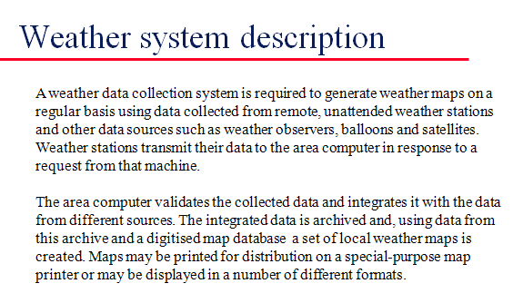

<!-- slide: 7 -->

## 6.1 什么是 OO?面向对象的特性

- 标识
- 抽象
- 分类
- 封装
- 继承
- 多态
- 持久性

<!-- slide: 8 -->

## 6.1 什么是 OO?对象和类

- 引用或句柄: 对象的名称
- 对象具有
  - 属性 (例如颜色，大小，位置)
  - 行为或操作 (例如起飞，降落，维修)
- 每个对象都是某个类的实例
- 类: 用来描述一组具有相同属性和行为的对象
- 方法: 某个类的操作的特定实现

<!-- slide: 9 -->

## 6.1 什么是 OO?对象和类 (continued)

- 对象分组为类的例子
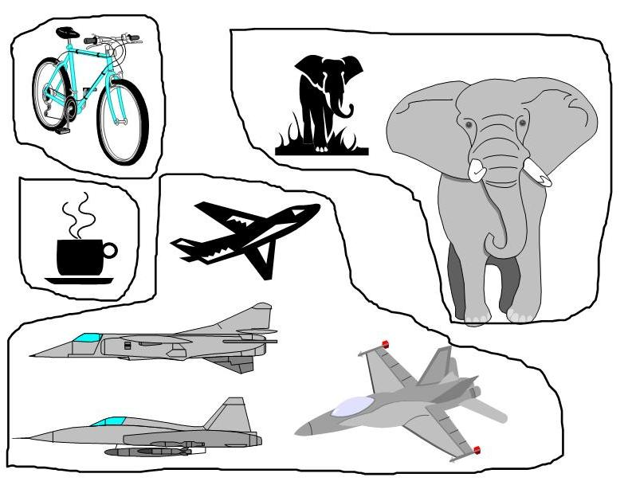

<!-- slide: 10 -->

## 6.1 什么是 OO?对象和类 (continued)

- 用方框表示类
- 方框表示了
  - 对象名
  - 属性
  - 行为
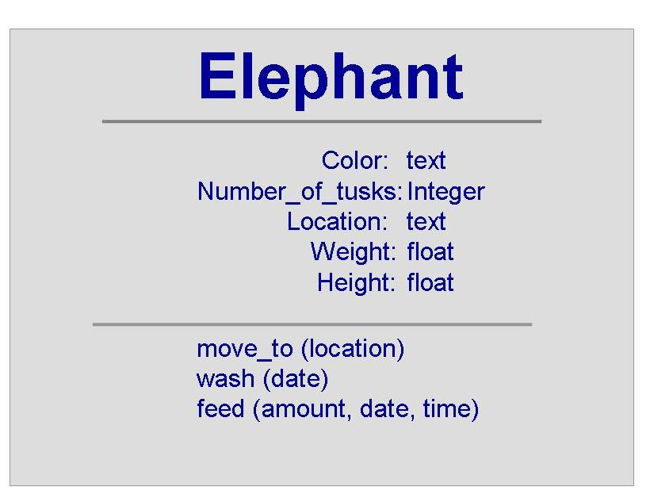

<!-- slide: 11 -->

## 6.1 什么是 OO?类的层次结构

- 类的层次是根据类间的相同性或差异性组织的
  - 层次呈现出 OO 类的继承结构
- 一个类定义成子类
- 子类可以继承父类的结构、行为以及属性
- 抽象类用于简化层次
  - 抽象类不能定义对象，除非作为一个子类的实例

<!-- slide: 12 -->

## 6.1 什么是 OO?类层次 (continued)

- 类层次形成的例子
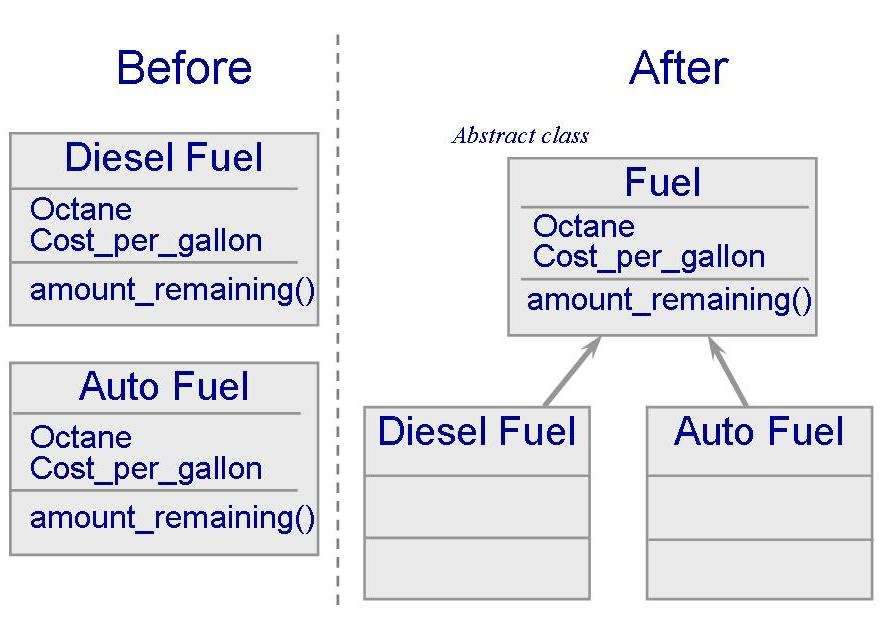

<!-- slide: 13 -->

## 6.2 OO 开发过程

- OO 开发过程的优点之一是语言的一致性
- 用OO表示法需要从三个视角表示类
  - 静态视图: 描述对象，属性，行为和关系
  - 动态视图: 描述通信，控制/计时，状态以及状态改变
  - 限制: 描述关于结构和动态行为的约束

<!-- slide: 14 -->

## 6.2 OO 开发过程OO 需求

- 通常使用用户的语言来完成，而且要讨论可能存在于应用领域内的概念和场景
- 概念包括信息、服务和责任
- 领域知识使开发人员能够：
  - 理解系统将要使用的背景
  - 以用户可理解的方式描述需求

<!-- slide: 15 -->

## 6.2 OO 开发过程OO 设计

- 通常使用 OO 方法表示规格说明
- 系统设计识别并表示对象和类 ，而且要知道每个对象的属性和行为的细节
- 系统设计也要识别对象和类的交互和关系
- 程序设计在模型中插入计算特征
- 程序设计插入一些类库的细节
- 程序设计考虑非功能需求

<!-- slide: 16 -->

## 6.2 OO 开发过程OO 编码和测试

- 编码就是将模型转换为 OO程序设计语言
- 随着需求的进展和成熟，实现人员必须细化层次结构并作出相应的调整
- 测试一个OO系统包含一些测试其他任何类型系统所执行的相同活动

<!-- slide: 17 -->

## 6.2 OO 开发过程OO 编码和测试 (continued)

- 不同类型的测试与OO结构的关系
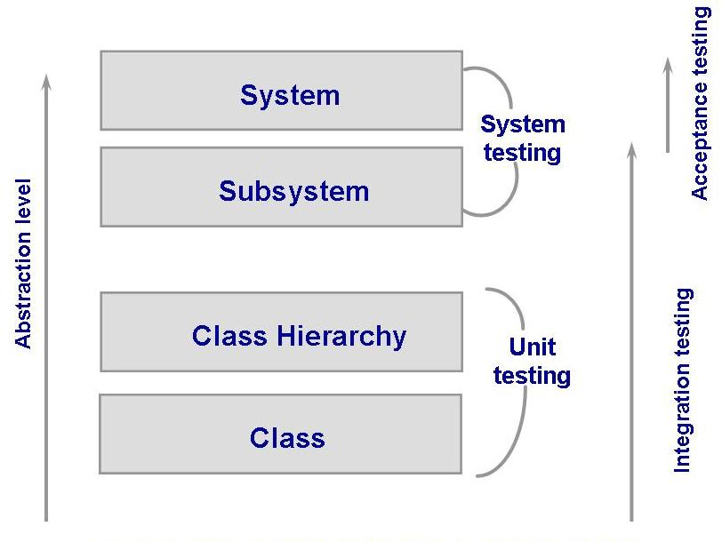

<!-- slide: 18 -->

## 6.3 用例

- 通过建模用户、外部系统或其他外部实体与要开发的系统之间的对话，用例描述系统应该具有或展现的特定功能
- 用例图的4个要素
  - 参与者
  - 用例
  - 扩充
  - 使用

<!-- slide: 19 -->

## 6.3用例用例的例子

- 皇家汽车服务站需求概述
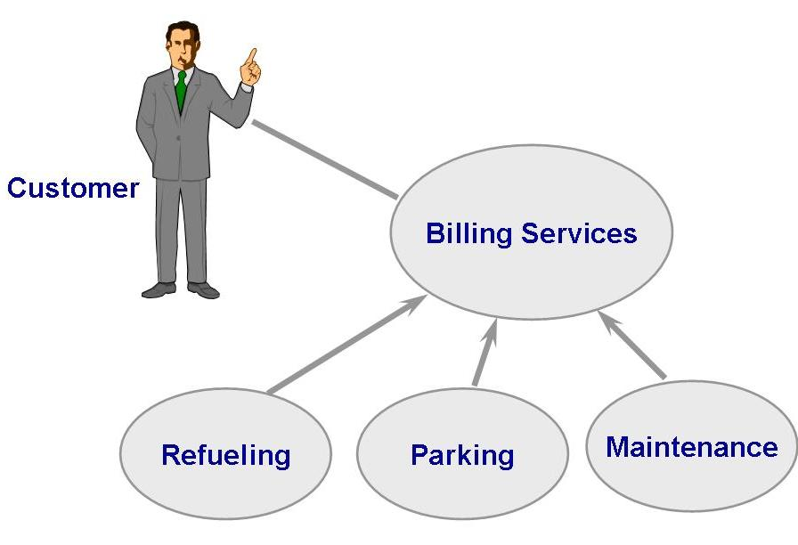

<!-- slide: 20 -->

## 6.3用例用例的例子 (continued)

- 皇家汽车服务站图的第一次扩充，使其包括预防性维护
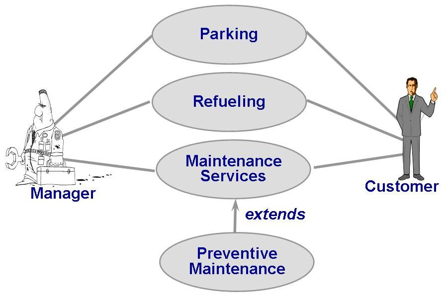

<!-- slide: 21 -->

## 6.3用例用例的例子 (continued)

- 对皇家汽车服务站的第二次扩充，使其包括信用卡系统
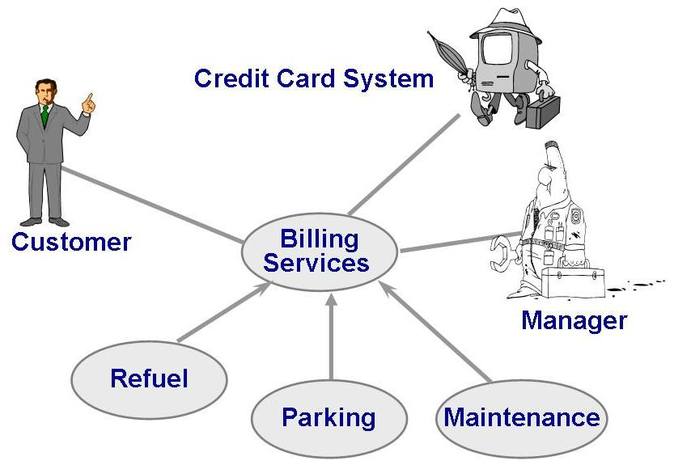

<!-- slide: 22 -->

## 6.3用例用例的例子 (continued)

- 对皇家汽车服务站的第三次扩展，使其包括库存和会计
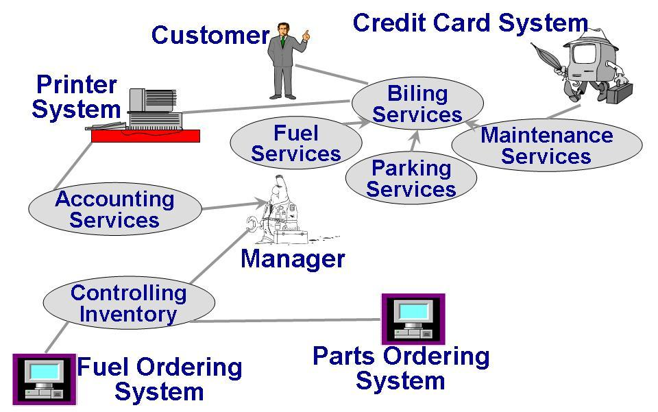

<!-- slide: 23 -->

## 6.3用例识别参与者

- 哪些用户或小组使用系统执行某项任务?
- 应该需要哪些用户或小组才能使系统完成它的功能?
- 哪些外部系统使用系统执行某项任务？
- 哪些外部系统、用户或小组给系统发送信息？
- 哪些外部系统、用户或小组接收来自系统的信息?

<!-- slide: 24 -->

## 6.4 OO的表示：一个使用UML的例子

- 工作流图
- 对象模型
- 时序图
- 协作图
- 包图
- 构件图
- 部署图

<!-- slide: 25 -->

## 6.4 OO的表示：一个使用UML的例子（2）

- 如何将UML用于需求规格说明、设计和编码中。
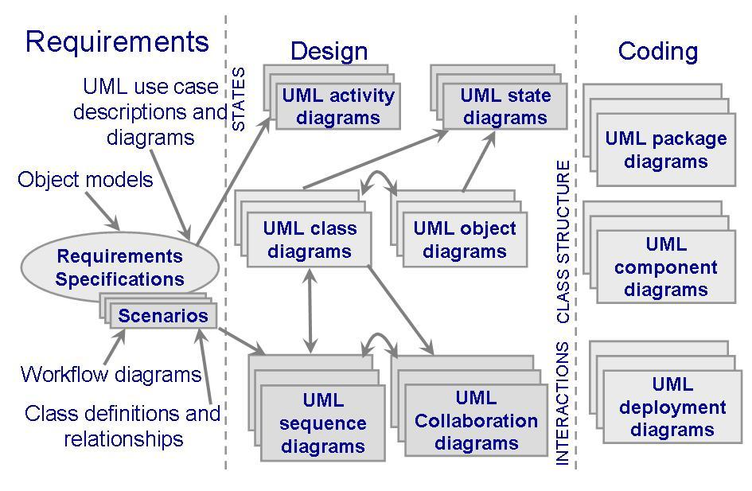

<!-- slide: 26 -->

## 6.5 OO 系统设计需求陈述。提取名词

- 结构
- 外部系统
- 设备
- 角色
- 操作过程
- 地点
- 组织机构
- 将要构造的系统所操纵的事情

<!-- slide: 27 -->

## 6.5 OO 系统设计建类向导

- 用某些方式需要“处理”什么？
- 哪些项具有多个属性？
- 什么时候一个类有多个对象？
- 什么是基于需求本身的， 而不是从对需求的理解中导出的？
- 什么属性和操作总是适用于一个类或对象？

<!-- slide: 28 -->

## 6.5 OO 系统设计将候选类和对象分组：第一步

| 属性 | 类 |
|---|---|
| 个人支票 | 客户 |
| 税 | 维护 |
| 价格 | 服务 |
| 现金 | 停车 |
| 信用卡 | 加油 |
| 折扣 | 帐单 购买 加油站经理 |

<!-- slide: 29 -->

## 6.5 OO系统设计首先将候选类和对象分组：第二步

| 属性 | 类 |
|---|---|
| 个人支票 税 价格 现金 信用卡 折扣 生日 姓名 地址 | 顾客 维护 服务 停车 账单 购买 定期信息 加油站经理 |

<!-- slide: 30 -->

## 6.5 OO系统设计首先将候选类和对象分组：第三步

| 属性 | Classes |
|---|---|
| 个人支票 税 价格 现金 信用卡 折扣 生日 姓名 地址 | 顾客 维护 服务 停车 账单 购买 定期信息 加油站经理 警告信 零配件 账户 库存 信用卡系统 零配订购件系统 燃料订购系统 |

<!-- slide: 31 -->

## 6.5 OO系统设计识别行为原则

- 祈使动词
- 被动词
- 动作
- 事情或想起的事件
- 角色
- 操作过程
- 某个组织机构提供的服务

<!-- slide: 32 -->

## 6.5 OO 系统设计UML 方框

- UML方框是为了表示类之间的关系
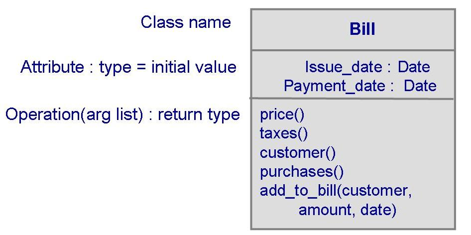

<!-- slide: 33 -->

## 6.5 OO 系统设计UML 方框描述类关系

- 继承关系 (is-a relationship): 允许下面的方框继承上面方框的属性和行为
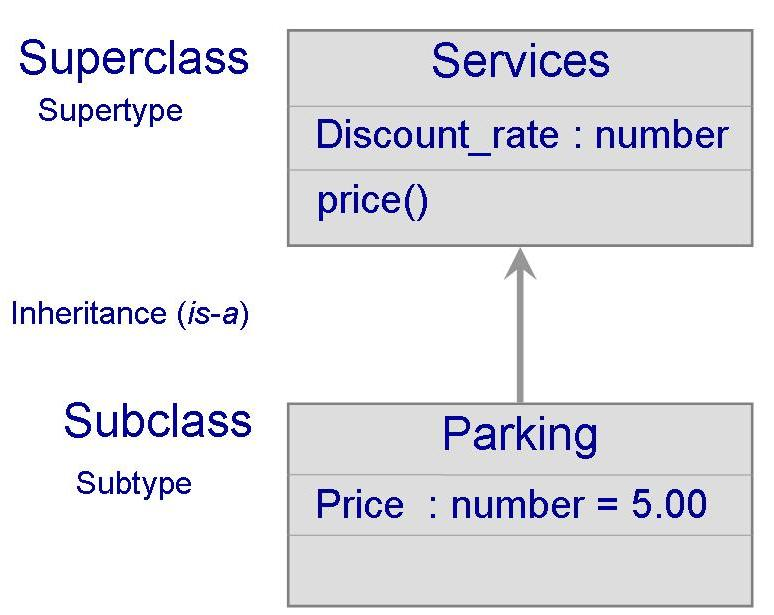

<!-- slide: 34 -->

## 6.5 OO 系统设计 UML 方框描述类关系（2）

- 每个订单都和一个销售员相关联 (相关联的)
- 订单项是订单的一部分 (组合)
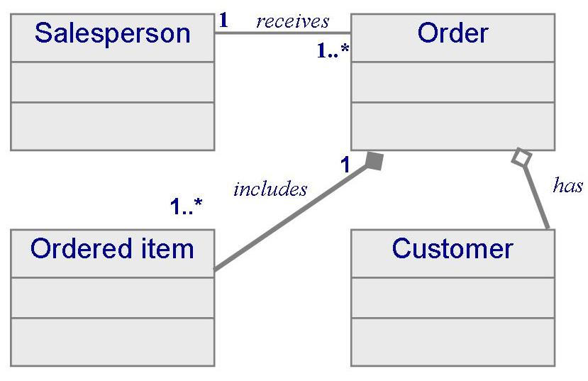

<!-- slide: 35 -->

## 其他几种表示类之间关系的方法

- 6.5 OO 系统设计 UML 方框描述类关系（3） (详细解说UML类图关系)
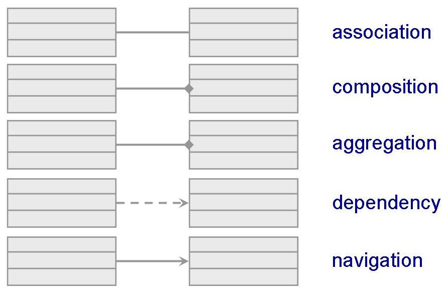

<!-- slide: 36 -->

## 6.5 OO 系统设计 用注释和限定词描述UML

- 如何用注释和限定词来进一步描述类的关联
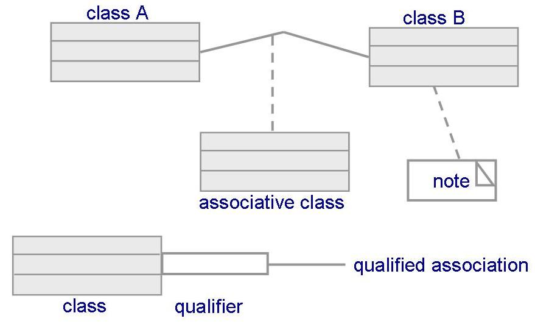

<!-- slide: 37 -->

## 6.5 OO 系统设计皇家汽车服务站第一次设计

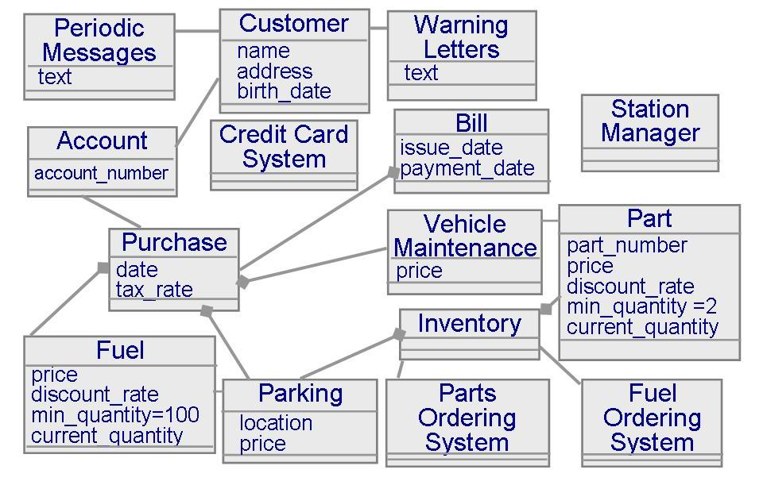

<!-- slide: 38 -->

## 6.5 OO 系统设计皇家汽车服务站第二次设计

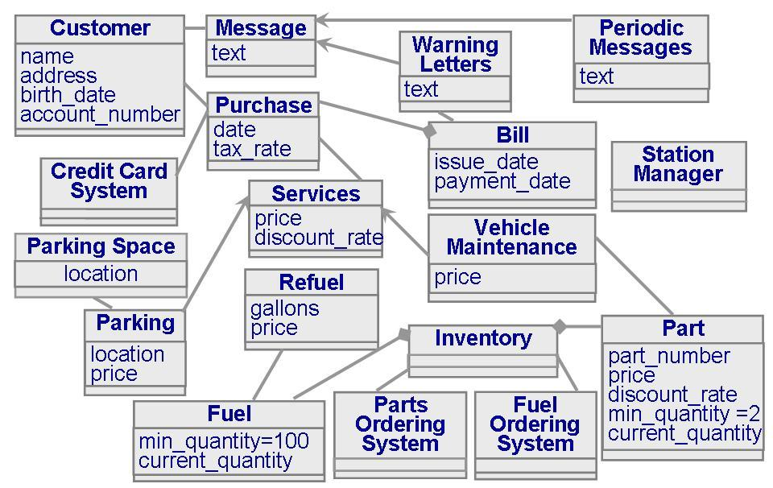

<!-- slide: 39 -->

## 6.5 OO 系统设计皇家汽车服务站第三次设计

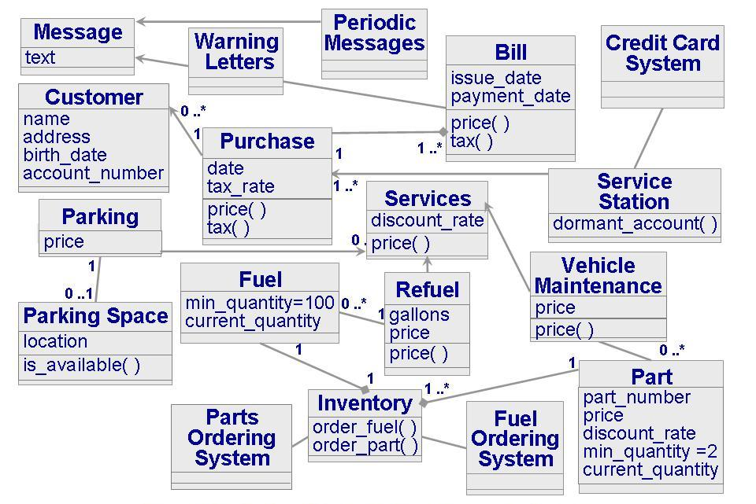

<!-- slide: 40 -->

## 6.5 OO 系统设计类描述模板

- 进行更详细的描述
- 告诉我们
  - 类在整个层次结构中的位置
  - 输出控制
  - 基数
  - 与其他类的关联
- 详细说明类的操作，以及访问类的公共接口

<!-- slide: 41 -->

## 6.5 OO 系统设计类描述模板的例子

- 类名:  refuel
- 类别:  service
- 外部文档:
- 输出控制:  Public
- 层数:  n
- 层次:
- 超类:  services
- 关联:
- fuel in association <name>
- 操作名:  price
- 公有成员:  refuel
- 文档:
- // Calculates fuel final price
- 前置条件:
- gallons > 0
- Object diagram:  (unspecified)
- 语义:
- final_price = gallons * price
- Object diagram:  (unspecified)
- 并发性:  sequential
- 公共接口:
- 操作:
- price
- 私有接口:
- 属性:
- gallons
- price
- 实现:
- 属性:
- gallons
- price
- 状态机:  no
- 并发性:  sequential
- 持久性:  transient

<!-- slide: 42 -->

## 6.5 OO 系统设计包图

- 将系统看作是一小组包，并随后可以扩充成更大一组的类
- 当各个类属于不同的包时，包图说明了类之间的依赖关系
- 两个项是依赖的，是指如果一个项的定义发生改变，则会引起另外一个项的改变变化

<!-- slide: 43 -->

## 6.5 OO 系统设计皇家汽车服务站的包图

- 这里有四个主要包
- 服务包由五个关键类组成
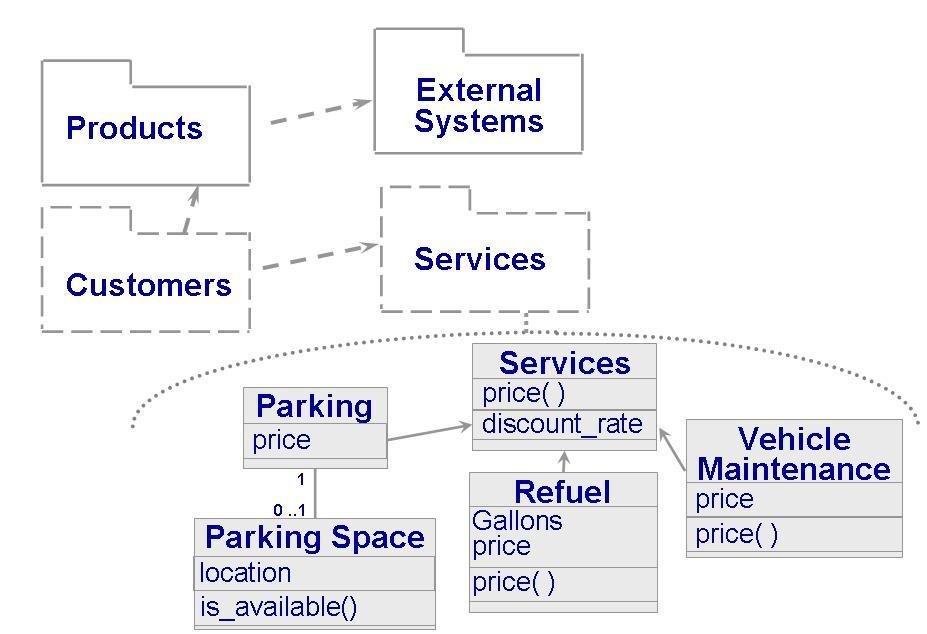

<!-- slide: 44 -->

## 6.5 OO 系统设计交互图

- 用来描述设计中的对象如何处理操作和行为
- 两种交互图
  - 时序图: 说明活动或行为发生的时序
  - 协作图: 说明对象之间是如何静态链接的

<!-- slide: 45 -->

## 6.5 OO 系统设计皇家汽车服务站的时序图

- 显示的是 refuel 类的用例
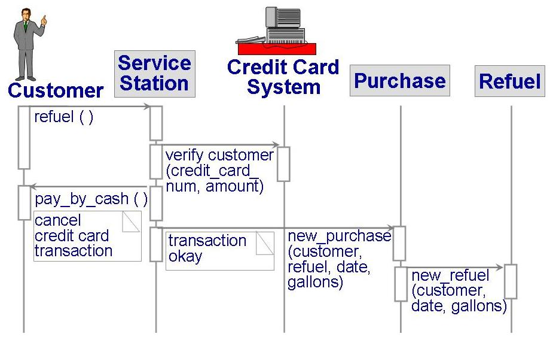

<!-- slide: 46 -->

## 6.5 OO 系统设计皇家汽车服务站的协作图

- 显示停车用例
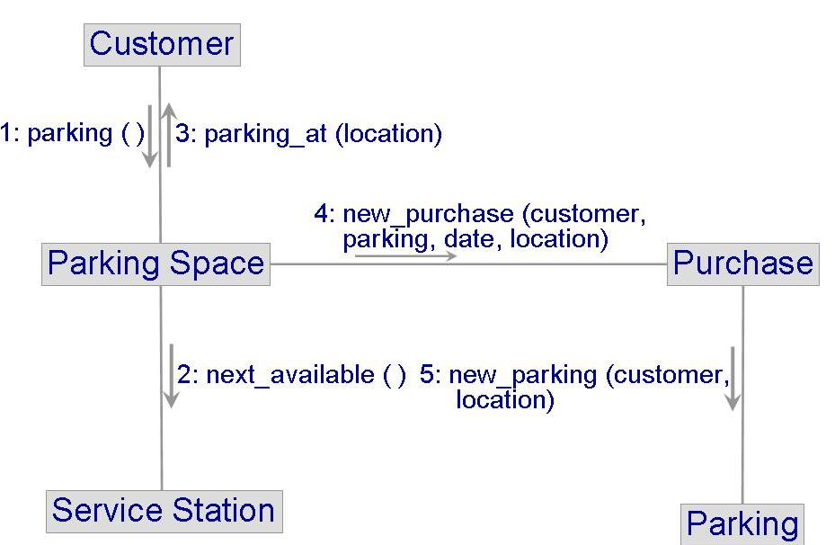

<!-- slide: 47 -->

## 6.5 OO 系统设计状态图

- 文档化系统的动态模型
- 说明
  - 一个对象可能经历的状态
  - 触发对象从一个状态转移到另一个状态的事件
  - 每一个状态变化所导致的动作
- 一个对象状态是与一组属性值相关的，并且当发送或接收消息时就会发生事件

<!-- slide: 48 -->

## 6.5 OO 系统设计状态图的例子

- 黑点: 起始节点
- 白点中放一个小黑点: 结束节点
- 矩形: 状态
- 箭头: 状态转移
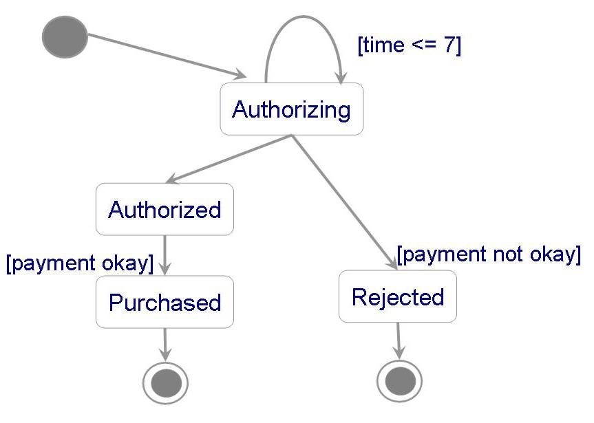

<!-- slide: 49 -->

## 6.5 OO 系统设计皇家汽车服务站的状态图

- fuel 和 parts 类的状态图
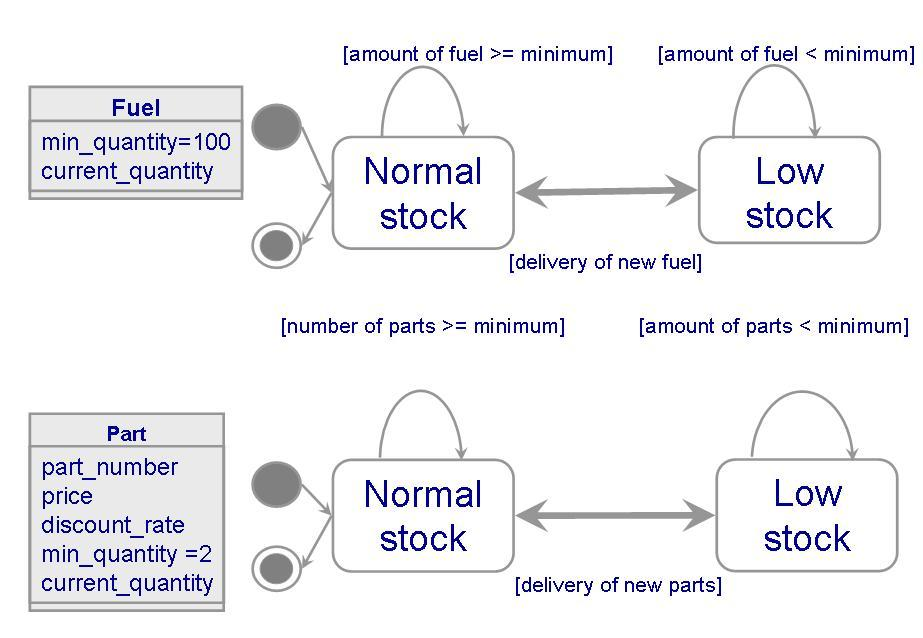

<!-- slide: 50 -->

## 6.5 OO 系统设计皇家汽车服务站的状态图

- inventory 类的状态图, 订购零配件或燃料: 不同的条件会触发每一个状态
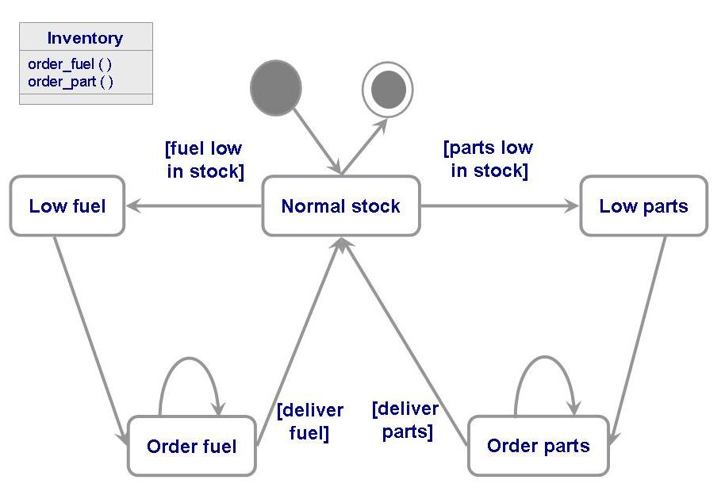

<!-- slide: 51 -->

## 6.5 OO 系统设计活动图

- 用来建模类中的过程或活动流
- 当用条件判断调用哪个活动时，活动图就用判定节点来表示选择
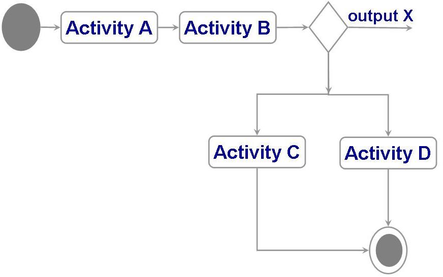

<!-- slide: 52 -->

## 6.5 OO 系统设计皇家汽车服务站的活动图

- inventory 类的活动图
- 可能有两个判定
  - 一个用于验证是否有足够的燃料
  - 另一个用于验证零配件是否在库存中
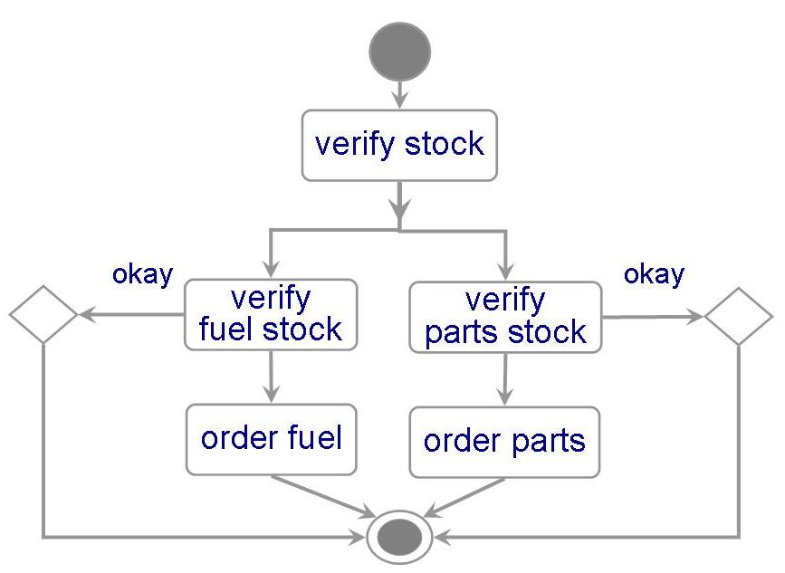

<!-- slide: 53 -->

## 6.6 OO 程序设计

- 从系统设计的对象和类开始
- 程序设计中
  - 必须对数据作出更为详细的判断
  - 必须详细说明每个对象接口的特征
  - 必须知道每个操作的操作签名
    - 每个操作的名称
    - 用作操作参数的对象
    - 操作返回值命名
- 对象接口: 对象所有操作签名的集合

<!-- slide: 54 -->

## 6.6 OO 程序设计程序设计考虑：

- 非功能需求
- 可复用构件
- 复用可复用构件
- 用户界面需求
- 数据结构和管理细节

<!-- slide: 55 -->

## 6.6 OO 程序设计构造范式

- 白盒复用: 某个类继承另一个类的性质
  - 给我们一个编译时系统的静态视图
  - 修改更容易并且更直接
  - 不能在运行时轻易修改继承关系
- 黑盒复用: 通过组装进行构造
  - 强制在系统设计中使用封装
  - 使得很容易用某个构造块替换另外一个构造快
  - 那些对象引用另外一些对象并不是总是很清晰的

<!-- slide: 56 -->

## 6.6 OO 程序设计设计助手

- 工具包: 一组相关的、具有明确定义功能的类的集合
- 模式: 抽象体系结构元素的模板
  - 背景: 解释模式使用的情形
  - 约束: 背景中的要素
- 框架: 对特定领域的一部分进行的复用

<!-- slide: 57 -->

## 6.6 OO 程序设计用户界面设计

- 定义将与系统进行交互的人
- 开发系统可能执行任务的每种方式的场景
- 设计用户命令的层次
- 细化用户与系统交互的时序
- 涉及层次中相关的类，以实现用户界面设计决策
- 把用户界面类集成到整个系统的类层次中

<!-- slide: 58 -->

## 6.6 OO 程序设计用户界面设计 (continued)

- 用户界面设计的第一步是以书面的形式布置交互
- 左边的图给出了纸质账单，右边的部分实现开账单过程自动化
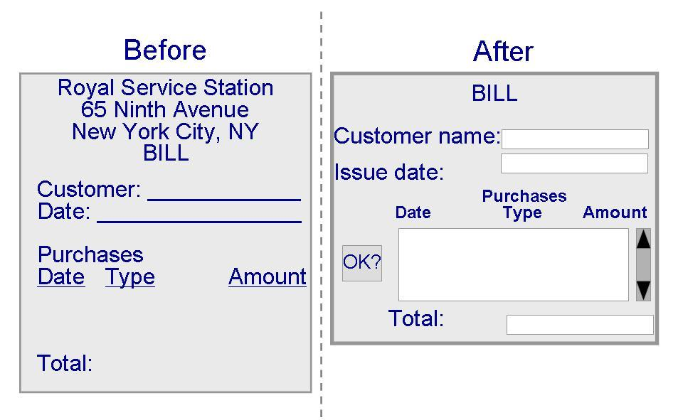

<!-- slide: 59 -->

## 6.6 OO 程序设计用户界面设计的例子

- 新的付账屏幕的可能涉及
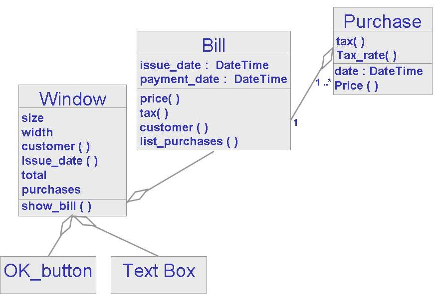

<!-- slide: 60 -->

## 6.6 OO 程序设计数据管理设计

- 四个步骤
  - 识别数据、数据结构以及它们之间的关系
  - 设计服务以管理数据结构和关系
  - 找出工具，诸如数据管理系统，来实现某些数据管理任务
  - 设计类和类层次以检查数据管理功能
- OO 解决方案可以使用传统的文件或关系数据库, 但是与OO数据库最容易交互

<!-- slide: 61 -->

## 6.6 OO 程序设计数据管理设计: 应用关系数据库

- 数据库跟踪车辆维护和零配件
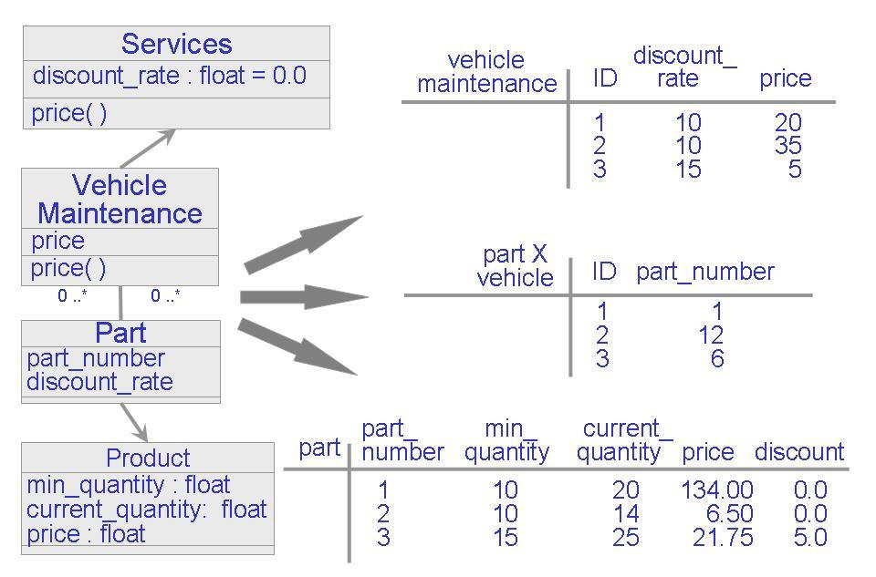

<!-- slide: 62 -->

## 6.6 OO 程序设计任务管理设计

- 任务: 系统的处理
  - 事件驱动的任务: 当一个特定的事件发生时启动
  - 时间驱动任务: 在特定时间调用
- 四个步骤
  - 识别要执行的任务
  - 确定任务的优先级
  - 创建一个任务来协调所有其他任务
  - 为每个任务设计对象，并定义它们之间的关系

<!-- slide: 63 -->

## 6.6 OO 程序设计任务管理设计: 任务定义的例子

- 任务名: 订购零配件
- 描述: 目的是当库存已经没有足够的零配件时，自动订购新的零配件
- 优先级: 高，当库存警告报告库存中没有足够的零配件时就会激活它
- 包括的服务: 检验库存
- 由谁管理/管理: 服务站系统
- 通信手段: 与订购零配件连接的调制解调器

<!-- slide: 64 -->

## 6.6 OO 程序设计任务管理设计: 观察者模式

- 当抽象至少具有两个方面，并且其中一些依赖于另外一些时，观者者模式很有用
  - 一对多的依赖关系
- 包括四个主要概念
  - 主题
  - 观察者
  - 具体主题
  - 具体观察者

<!-- slide: 65 -->

## 6.6 OO 程序设计观察者模式 (continued)

- 下图表示了观察者模式概念之间的关系
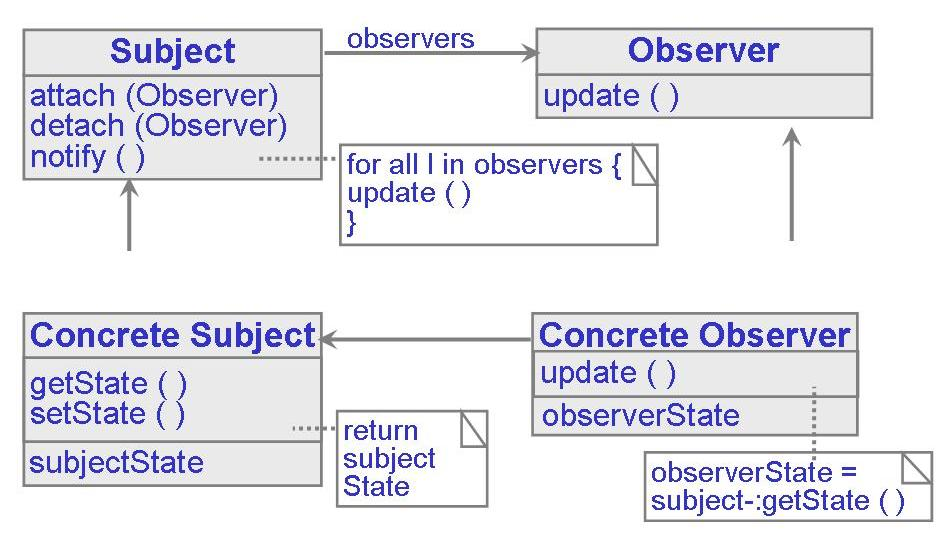

<!-- slide: 66 -->

## 6.6 OO 程序设计观察者模式 (continued)

- 观察者模式的时序图，说明4个概念是如何交互的
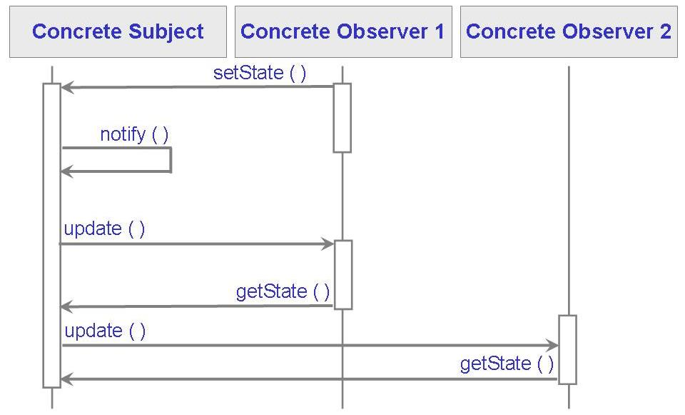

<!-- slide: 67 -->

## 6.7 OO测度OO 规模测度

- Pfleeger (1991): 适用对象和方法作为基本的规模测度
- Lorenz 和 Kidd 定义了规模的9个方面
  - 场景脚本的数目 (NSS)
  - 关键类的数目
  - 支持类的数目
  - 每个关键类的平均支持类数目
  - 子系统的数目
  - 类规模
  - 子类重载的操作的数目 (NOO)
  - 子类增加的操作的数目
  - 特化索引
    - SI = (NOO X 层次) / (总的类方法)

<!-- slide: 68 -->

## 6.7 OO 测度 开发的不同阶段中，Lorenz 和Kidd 的度量集合

| 度量 | 需求描述 | 系统设计 | 程序设计 | 编码 | 测试 |
|---|---|---|---|---|---|
| 场景脚本的数目 | X |  |  |  |  |
| 关键类的数目 | X | X |  |  |  |
| 支持类的数目 |  |  | X |  |  |
| 平均支持类的数目 |  |  | X |  |  |
| 子系统的数目 |  |  | X | X |  |
| 类规模 |  | X | X | X |  |
| 子类重载的操作的数目 |  | X | X | X | X |
| 子类增加的操作的数目 |  | X | X | X |  |
| 特化索引 |  | X | X | X | X |

<!-- slide: 69 -->

## 6.7 OO 测度皇家汽车服务站的OO视图

- 用Lorenz 和Kidd 的度量，场景脚本的数目等于6
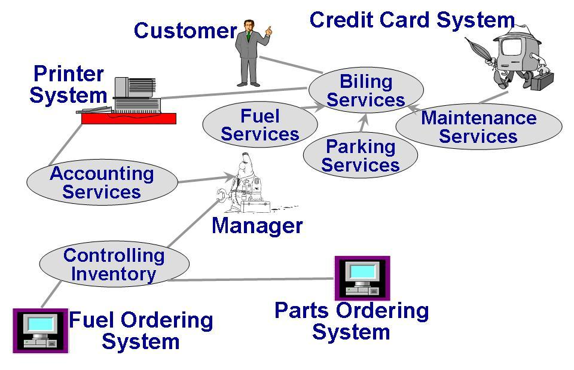

<!-- slide: 70 -->

## 6.7 OO 测度皇家汽车服务站的类层次，以及 Lorenz和 Kidd 测度

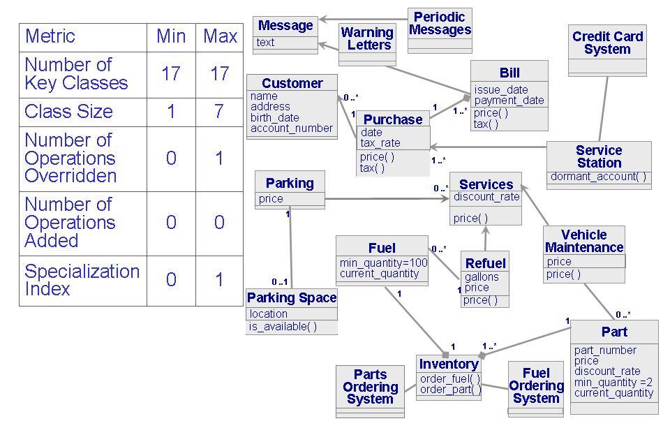

<!-- slide: 71 -->

## 6.7 OO 测度OO 设计的测度

- Chidamber和 Kemerer 设计了一套OO开发的度量
  - 每个类的加权方法 = nci
    - i=1
  - 继承深度
  - 孩子数目
  - 对象间的耦合度
  - 类的响应度
  - 方法缺少的内聚度

<!-- slide: 72 -->

## 6.7 OO 测度 开发不同阶段中Chidamber 和 Kemerer 度量集

| 度量 | 系统设计 | 程序设计 | 编码 | 测试 |
|---|---|---|---|---|
| 每个类的加权方法 | X | X |  | X |
| 继承深度 | X | X |  | X |
| 孩子的数目 | X | X |  | X |
| 对象间的耦合度 |  | X |  | X |
| 类的响应度 |  | X | X |  |
| 方法缺少内聚度 |  | X | X | X |

<!-- slide: 73 -->

## 6.7 OO 测度Chidamber-Kemerer 度量应用于皇家汽车服务站系统设计

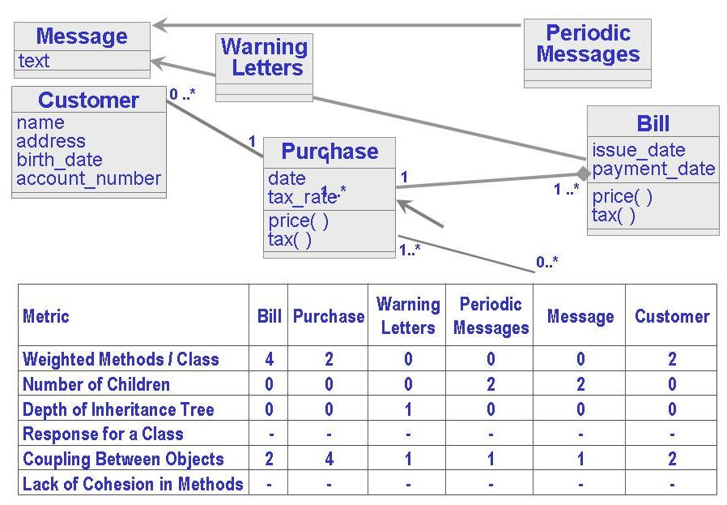

<!-- slide: 74 -->

## 6.7 OO 测度计算方法中内聚度的缺少

- 给定类 C，它有n 个方法, M1 到 Mn
- 假定 {Ijj} 是方法 M  使用的实例变量
- 我们可以定义 P 为对 (Ir , Is) 的集合，其中 Ir 和 Is, 没有共享的公共成员
  - P = {(Ir , Is) | Ir ∩ Is = Ø}
- Q 是 (Ir , Is) 对的集合，其中 Ir 和 Is  至少共享一个公共成员
  - Q = {(Ir , Is) | Ir ∩ Is ≠ Ø}
- 于是可以将 C  中方法缺少内聚度定义为
  - |P|-|Q| ，如果 |P| > |Q|
  - 0 ，其他情况

<!-- slide: 75 -->

## 6.7 OO 测度Chidamber-Kemerer 度量应用于皇家汽车服务站的程序设计

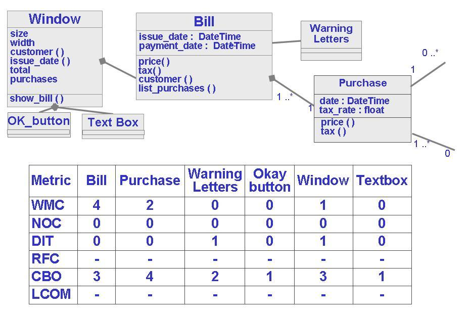

<!-- slide: 76 -->

## 6.7 OO 测度其他度量

- Li 和 Henry (1993): 用这些度量来预测维护期间类的变化规模
  - 消息传递耦合
  - 数据抽象耦合
- Travassos (1999)
  - 平均操作规模
  - 每个操作的平均参数数目

<!-- slide: 77 -->

## 6.7 OO 测度Travassos 度量应用于皇家汽车服务站的时序图

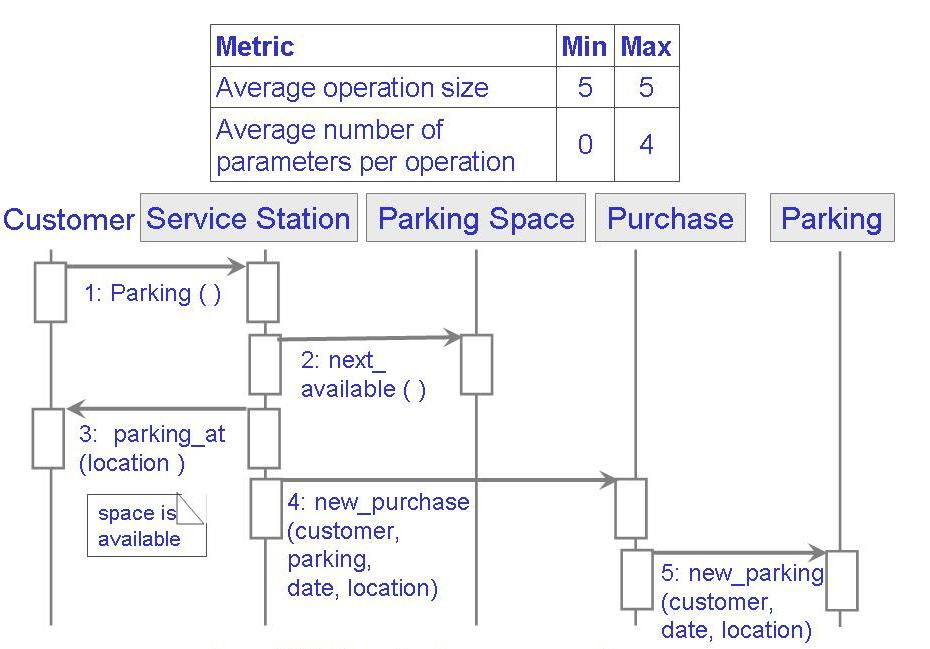

<!-- slide: 78 -->

## 6.7 OO 测度在何处进行 OO 测度

| 度量 | 用例 | 类图 | 交互图 | 类描述 | 状态图 | 包图 |
|---|---|---|---|---|---|---|
| 场景脚本的数目 | X |  |  |  |  |  |
| 关键类数目 |  | X |  |  |  |  |
| 支持类数目 |  | X |  |  |  |  |
| 每个关键类的平均支持类数目 |  | X |  |  |  |  |
| 子系统数目 |  |  |  |  |  | X |
| 类规模 |  | X |  | X |  |  |
| 子系统重载的操作个数 |  | X |  |  |  |  |
| 自系统增加的操作个数 |  | X |  |  |  |  |
| 特化索引 |  | X |  |  |  |  |
| 类的加权方法 |  | X |  |  |  |  |
| 继承的深度 |  | X |  |  |  |  |
| 孩子的数目 |  | X |  |  |  |  |
| 对象间的耦合度 |  | X |  |  |  |  |
| 类的响应度 |  |  |  | X |  |  |
| 方法中缺少内聚 |  |  |  | X |  |  |
| 平均操作数目 |  |  | X |  |  |  |
| 每个操作的平均参数数目 |  |  | X |  |  |  |
| 操作复杂度 |  |  |  | X |  |  |
| 公有和保护性的百分比 |  |  |  | X |  |  |
| 数据成员的共有访问 |  |  |  | X |  |  |
| 根类的数目 |  | X |  |  |  |  |
| 扇入/扇出 |  | X |  |  |  |  |

<!-- slide: 79 -->

## 6.8 信息系统的例子皮卡地里系统用例的数据流图

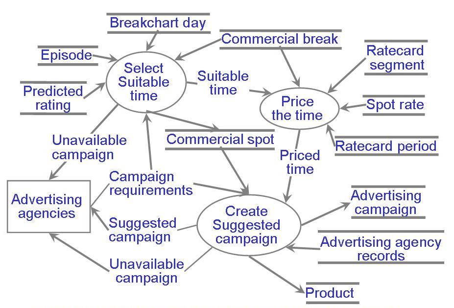

<!-- slide: 80 -->

## 6.8 信息系统的例子广告活动的类图

- 第一次设计的处理收视率预测的两个类
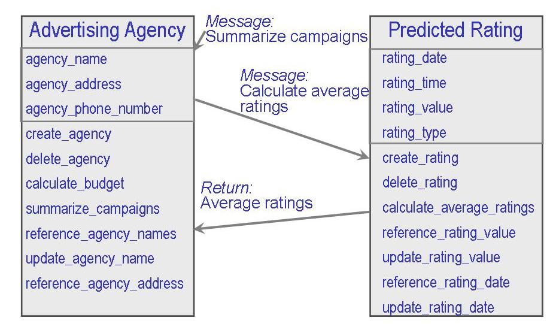

<!-- slide: 81 -->

## 6.9 实时系统的例子

- 阿丽亚娜 -5 用面向对象的方法实现的， 那么复用的方式要么是组装要么是继承
- 组装的方法:  将 SRI 看作是黑盒，由主系统调用
- 继承的方法:   SRI 结构和行为都是公开可见的，尽可能多地从弗雷那里继承结构和行为

<!-- slide: 82 -->

## 6.10 本章对单个开发人员的意义

- 对用例进行细化，以便生成系统设计，并对系统如何解决手头的问题给出高层描述
- 程序设计实现非功能性需求
- UML 已经成为描述OO系统方法的事实标准
- 几种常用于测量OO工件的规模和特性的量度
