# c-slides08(110422-110429)

<!-- slide: 1 -->

## Chapter 8

- 测试程序
- Copyright 2006 Pearson/Prentice Hall. All rights reserved.

<!-- slide: 2 -->

## 目录

- 8.1	软件故障和失效
- 8.2	测试的相关问题
- 8.3	单元测试
- 8.4	集成测试
- 8.5	面向对象的系统测试
- 8.6	测试计划
- 8.7	自动测试工具
- 8.8	什么时候停止测试
- 8.9  	信息系统的例子
- 8.10	实施系统的例子
- 8.11	本章对单个开发人员的意义

<!-- slide: 3 -->

## 本章内容

- 故障的类型以及如何对其进行分类
- 测试的目的
- 单元测试
- 集成测试策略
- 测试计划
- 什么时候停止测试

<!-- slide: 4 -->

## 8.1软件故障和失效软件为什么会失效?

- 错误的需求:  不是客户想要的
- 遗漏了需求
- 需求不可能实现
- 错误的系统设计
- 编码故障
- 程序代码是错误的

<!-- slide: 5 -->

## 8.1软件故障和失效测试目标

- 测试目标: 发现错误
- 只有当发现了错误时，测试才被认为是成功的
  - 故障识别是确定由哪一个故障或哪些故障引起失效的过程
  - 故障改正是修改系统使得故障得以去除过程

<!-- slide: 6 -->

## 8.1软件故障和失效故障类型

- 算法故障
- 计算故障和精度故障
  - 一个公式的实现是错误的
- 文档故障
  - 文档与程序实际做的不一致
- 能力或边界错误
  - 系统活动达到极限时，系统性能会变得不可接受
- 计时故障或协调故障
- 性能故障
  - 系统不能以需求规格的速度执行
- 标准和过程故障

<!-- slide: 7 -->

## 8.1软件故障和失效典型的算法故障

- 由于处理步骤的中的某些错误，使得对于给定的输入，构件的算法或逻辑没有产生适当的输出
  - 分支太早
  - 分支太晚
  - 对错误的条件进行了测试
  - 忘记了初始化的变量或设置循环不变量
  - 忘记针对特定的条件进行测试
  - 对不合适的数据类型变量进行比较
- 语法错误

<!-- slide: 8 -->

## 8.1软件故障和失效正交缺陷分类

| 错误类型 | 含义 |
|---|---|
| 功能 | 对能力、终端用户接口、产品接口、与硬件体系结构的接口、或全局数据结构的造成影响故障 |
| 接口 | 通过使用调用、宏、控制块或参数列表与其他构件或驱动程序交互时出现的故障 |
| 检查 | 程序逻辑中的故障，不能在数据和值使用之前对它们进行确认 |
| 赋值 | 数据结构或代码块初始化中出现的故障 |
| 计时/串行化 | 计时共享或实时资源所涉及的故障 |
| 构建/包/合并 | 故障的出现是因为信息库、管理变化或版本控制的问题 |
| 文档 | 影响发布或维护记录的故障 |
| 算法 | 涉及算法或数据结构的效率的故障，不涉及设计 |

<!-- slide: 9 -->

## 8.2 测试的相关问题测试的组织

- 模块测试、构件测试、单元测试
- 集成测试
- 功能测试
- 性能测试
- 验收测试
- 安装测试
- Alpha测试
- Beta测试

<!-- slide: 10 -->

## 8.2 测试的相关问题测试的步骤

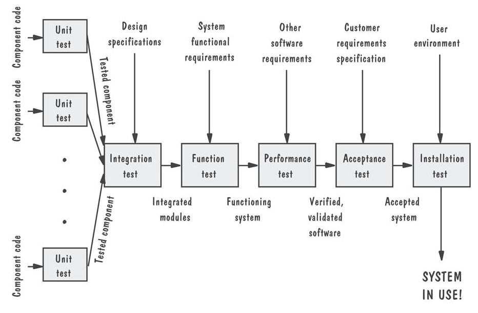

<!-- slide: 11 -->

## 8.2 测试的相关问题对测试的态度

- 忘我测试: 把程序看作是一个更大系统的构件，而不是那些编写他们的人的财产。

<!-- slide: 12 -->

## 8.2 测试的相关问题谁执行测试?

- 独立的测试小组
  - 避免冲突
  - 保持客观性
  - 测试和编码并行进行

<!-- slide: 13 -->

## 8.2 测试的相关问题测试对象的视图

- 闭盒或黑盒: 测试对象的功能
- 开盒或白盒: 测试对象的结构

<!-- slide: 14 -->

## 8.2 测试的相关问题黑盒

- 优点
  - 免于受强加给测试对象内部结构和逻辑的约束
- 缺点
  - 不可能总是进行完备的测试

<!-- slide: 15 -->

## 8.2 测试的相关问题开盒

- 逻辑结构的例子
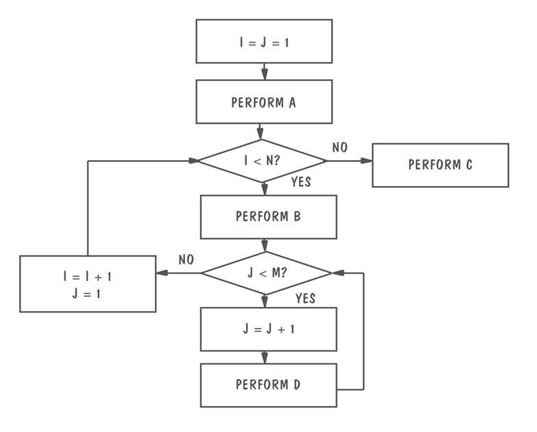

<!-- slide: 16 -->

## 8.2 测试的相关问题影响测试方法选择的因素

- 可能的逻辑路径数目
- 输入数据的性质
- 涉及的计算量
- 算法的复杂性

<!-- slide: 17 -->

## 8.3 单元测试检查代码

- 代码走查
- 代码审查

<!-- slide: 18 -->

## 8.3 单元测试典型的审查准备时间和会议时间

| 开发制品 | 准备时间 | 会议时间 |
|---|---|---|
| 需求文档 | 每小时25页 | 每小时12 页 |
| 功能的规格说明 | 每小时45页 | 每小时15 页 |
| 逻辑规格说明 | 每小时50页 | 每小时20 页 |
| 源代码 | 每小时150页 | 每小时75 页 |
| 用户文档 | 每小时35页 | 每小时20 页 |

<!-- slide: 19 -->

## 8.3 单元测试错误发现率

| 发现活动 | 每千行代码发现的故障 |
|---|---|
| 需求评审 | 2.5 |
| 设计评审 | 5.0 |
| 代码审查 | 10.0 |
| 集成测试 | 3.0 |
| 验收测试 | 2.0 |

<!-- slide: 20 -->

## 8.3 单元测试证明代码的正确性

- 形式化证明技术
- 符号执行
- 自动定理证明

<!-- slide: 21 -->

## 8.3 单元测试证明代码的正确性: 流程图

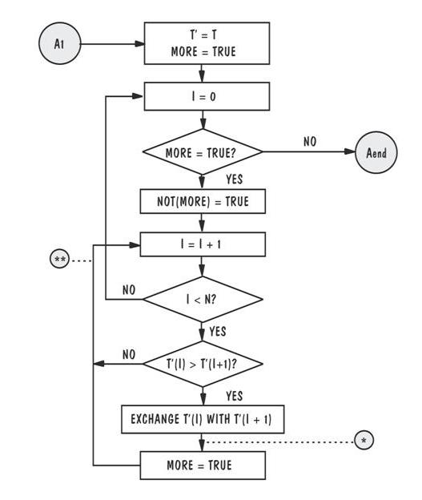

<!-- slide: 22 -->

## 8.3 单元测试测试与证明

- 证明: 在假设环境下
- 测试: 实际操作环境下运转的相关信息

<!-- slide: 23 -->

## 8.3 单元测试选择测试用例的步骤

- 确定测试目标
- 选择测试用例
- 定义测试

<!-- slide: 24 -->

## 8.3 单元测试测试的完全性

- 语句测试
- 分支测试
- 路径测试
- 定义使用的路径测试
- 所有使用的测试
- 所有谓词使用/部分计算使用的测试
- 所有计算使用/部分谓词使用的测试

<!-- slide: 25 -->

## 8.3 单元测试补充资料 8.4   Contel IPC 的故障发现效率

- 17.3% 是在系统设计的审查的过程中发现的
- 19.1% 是在构件设计审查的过程中发现的
- 15.1% 是在代码审查的过程中发现的
- 29.4% 是在集成测试的过程中发现的
- 16.6% 是在系统测试和回归测试的过程中发现的
- 0.1% 是在系统实际运行中才揭示出来的

<!-- slide: 26 -->

## 8.4 集成测试

- 自底向上的测试
- 自顶向下测试
- 一次性测试
- 三明治测试
- 改进的自顶向下测试
- 改进的三明治测试

<!-- slide: 27 -->

## 8.4 集成测试术语

- 构件驱动程序: 是调用特定构件并向其传递测试用例的程序
- 桩: 用于模拟缺少构件时的活动

<!-- slide: 28 -->

## 8.4 集成测试构件层次的例子

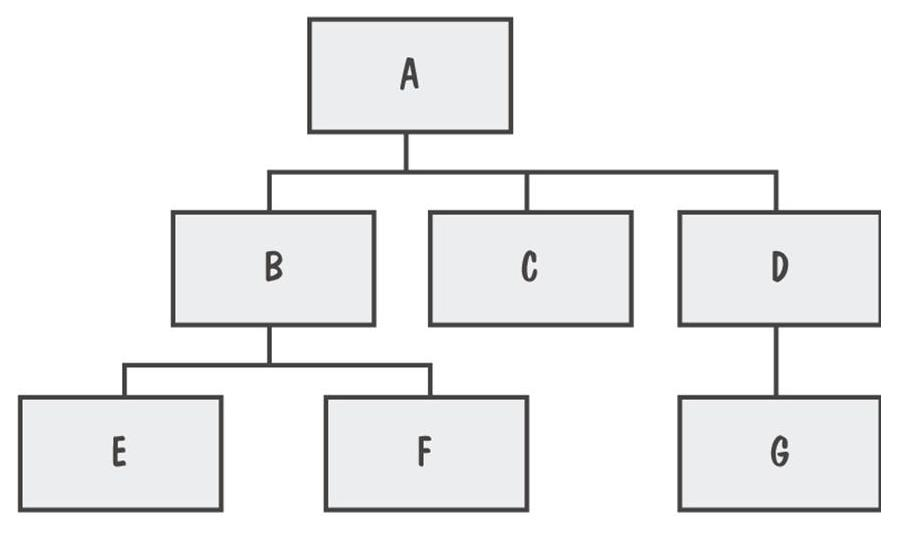

<!-- slide: 29 -->

## 8.4 集成测试自底向上的测试

- 测试序列和它们之间的关系
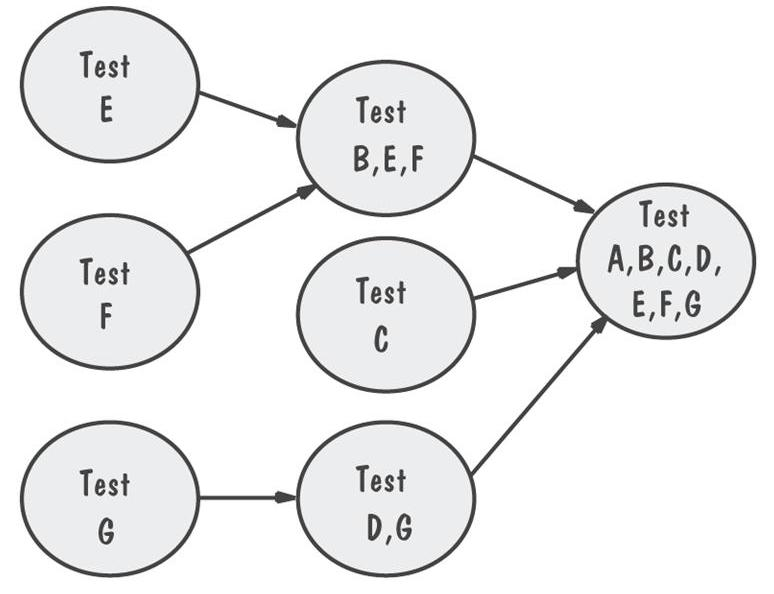

<!-- slide: 30 -->

## 8.4 集成测试自顶向下的测试

- 只有A是独立测试的
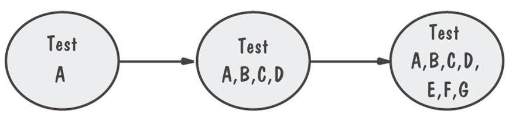

<!-- slide: 31 -->

## 8.4 集成测试 修改的自顶向下测试

- 进行合并之前每一个层的构件进行单独测试
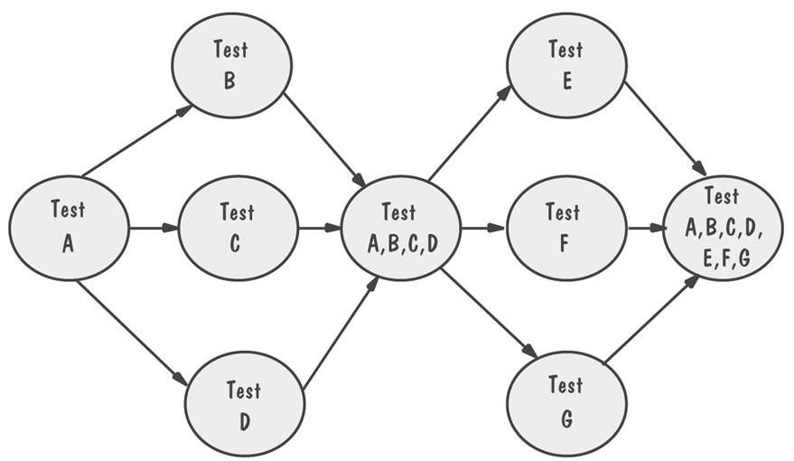

<!-- slide: 32 -->

## 8.4 集成测试 一次性测试的例子

- 同时需要桩和驱动程序来测试独立的构件
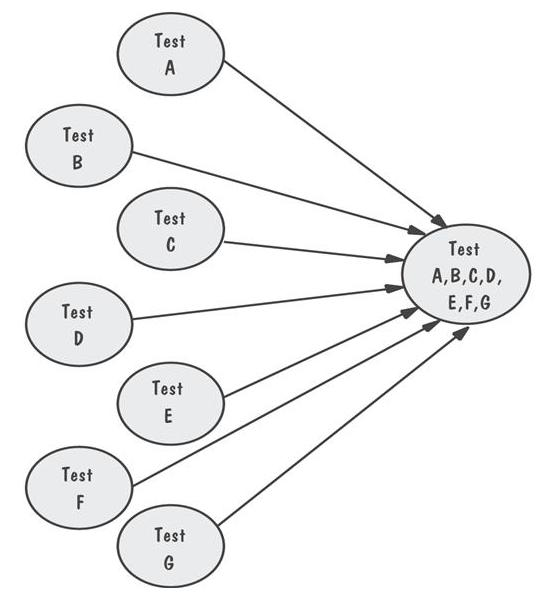

<!-- slide: 33 -->

## 8.4 集成测试 三明治集成测试

- 将系统看作三层
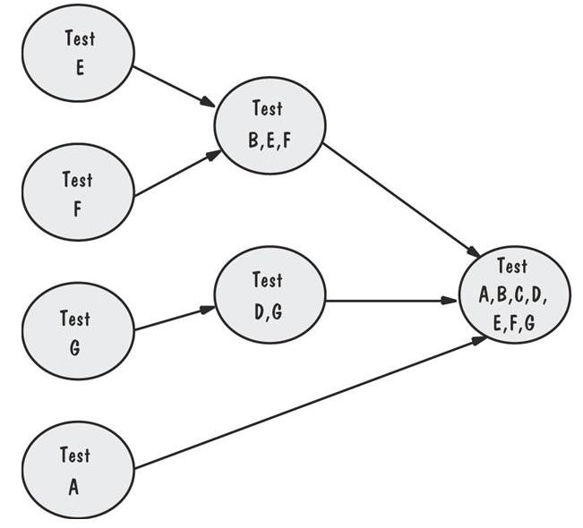

<!-- slide: 34 -->

## 8.4 集成测试 改进的三明治集成测试

- 允许在将较上层的构件和其他构件合并前，先对这些较上层的构件进行测试
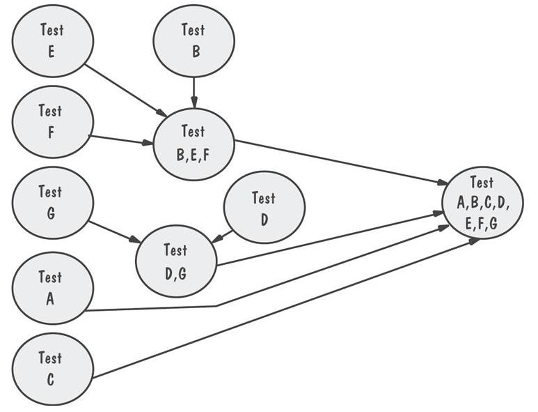

<!-- slide: 35 -->

## 8.4 集成测试集成测试的比较

|  | 自底向上 | 自顶向下 | 修改的自顶向下 | 一次性 | 三明治 | 修改的三明治 |
|---|---|---|---|---|---|---|
| 基本运行程序的继承时间 | 早 | 早 | 早 | 晚 | 早 | 早 |
|  | 晚 | 早 | 早 | 晚 | 早 | 早 |
| 需要的构建驱动程序 | 是 | 否 | 是 | 是 | 是 | 是 |
| 需要的桩 | 否 | 是 | 是 | 是 | 是 | 是 |
| 在开始的工作平行性 | 中 | 低 | 中 | 高 | 中 | 高 |
| 测试特定路线的能力 | 易 | 难 | 易 | 易 | 中 | 易 |
| 计划和控制顺序的能力 | 易 | 难 | 难 | 易 | 难 | 难 |

<!-- slide: 36 -->

## 8.5 测试OO系统  OO 系统的测试中更容易和更困难的部分

- OO 单元测试
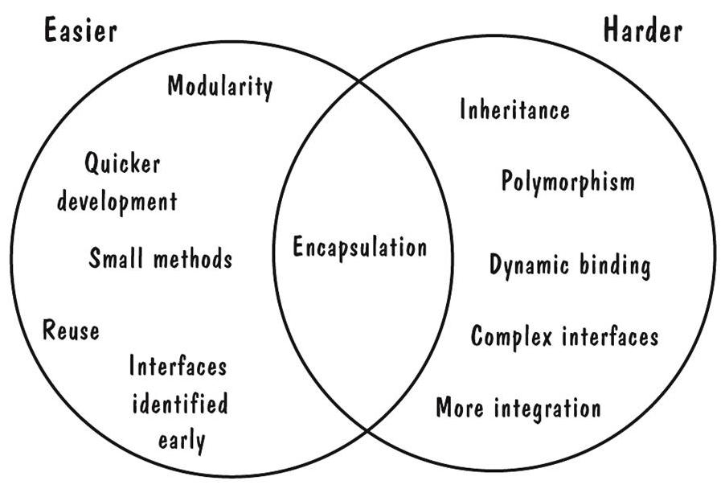

<!-- slide: 37 -->

## 8.5 测试OO系统OO测试和传统测试之间的区别

- 灰线距离图的中心越远，表明面向对象测试和传统测试之间的区别越大
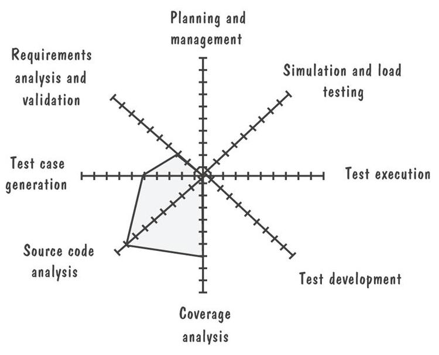

<!-- slide: 38 -->

## 8.6 测试计划

- 构建测试目标
- 设计测试用例
- 编写测试用例
- 测试测试用例
- 执行测试
- 评估测试结果

<!-- slide: 39 -->

## 8.6 测试计划计划的目的

- 测试计划解释
  - 由谁进行测试
  - 为什么进行测试
  - 怎样执行测试
  - 测试的进度安排

<!-- slide: 40 -->

## 8.6 测试计划计划的内容

- 测试的目标是什么
- 怎样进行测试
- 用什么标准确定何时测试完成

<!-- slide: 41 -->

## 8.8 什么时候停止测试更多的故障?

- 开发中发现故障的概率
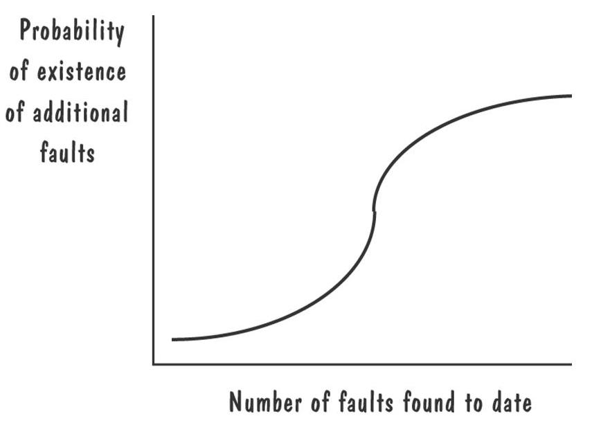

<!-- slide: 42 -->

## 8.8 什么时候停止测试停止测试的方法

- 覆盖标准
- 故障播种
    - 检测到的播种故障的数目  = 检测到的非播种故障的数目
    - 总的播种故障的数目		   总的非播种故障的数目
- 软件中的可信度 C
    - = 1, 				if n >N
    - = S/(S – N + 1)  	if n ≤ N

<!-- slide: 43 -->

## 8.8 什么时候停止测试识别易出故障的代码

- 跟踪在每个构件中发现的故障数目
- 收集关于每一个构件的测度
- 分类树: 一种统计技术，对大批测度信息进行排序，创建一颗判定树来说明哪些测度是某些特定属性的最好预测器
  - 帮助我们决定当前系统中有哪些构件可能含有大量故障

<!-- slide: 44 -->

## 8.11 本章对单个开发人员的意义

- 理解故障和失效之间的区别是很重要的
- 测试的目标是找出故障，而不是证明其正确性
