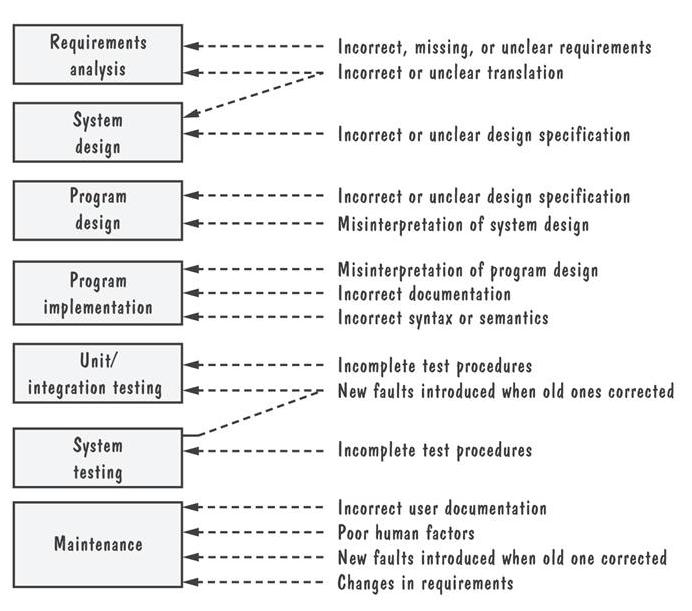
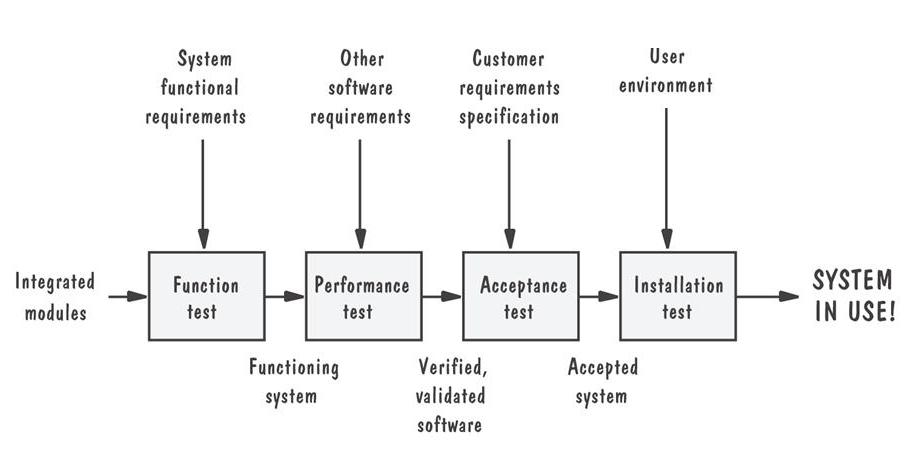
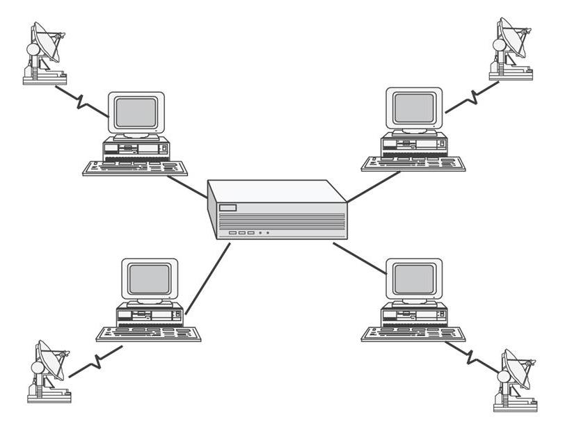
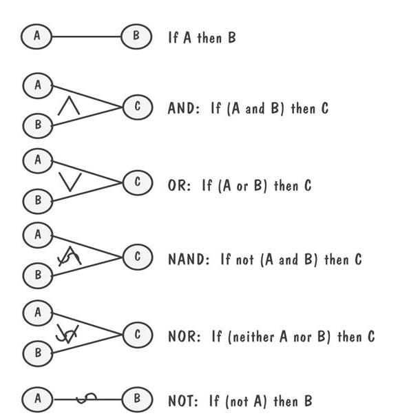
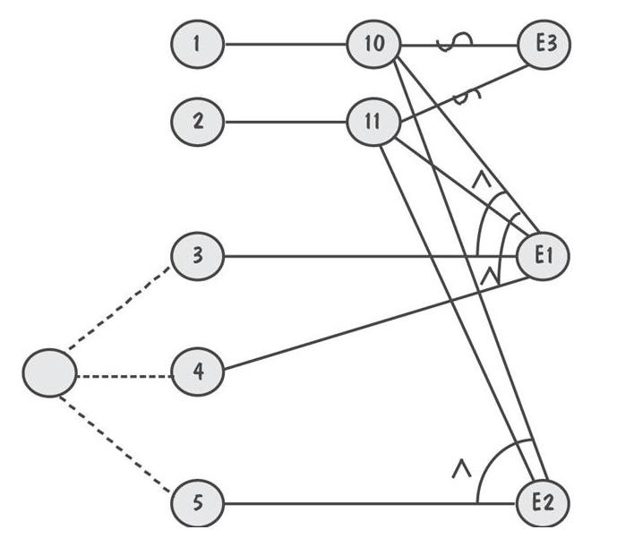
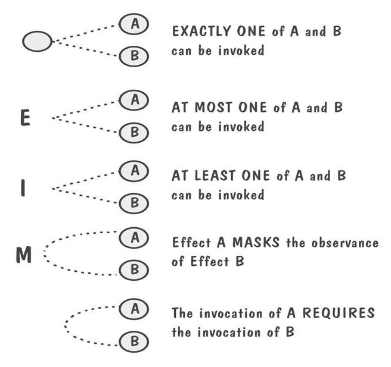
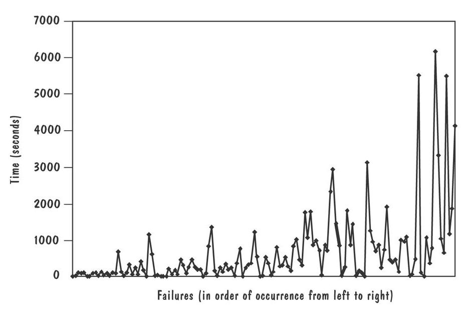
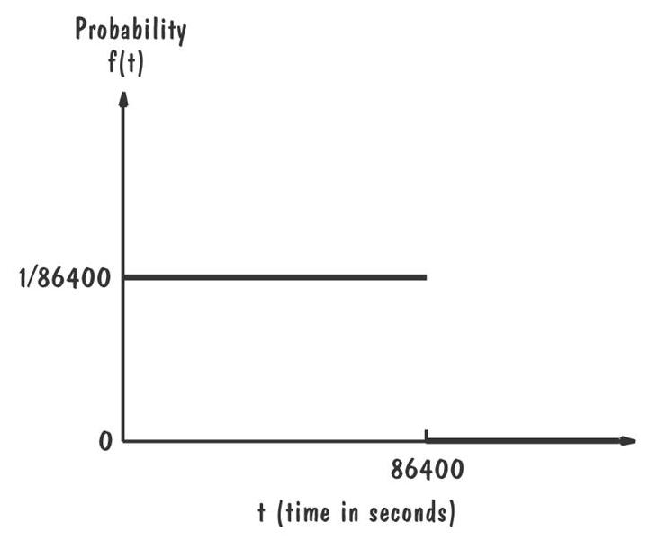

# c-slides

<!-- slide: 1 -->

## Chapter 9

- 测试系统

<!-- slide: 2 -->

## 目录

- 9.1	系统测试的原则
- 9.2	功能测试
- 9.3	性能测试
- 9.4	可靠性、可用性、可维护性
- 9.5	验收测试
- 9.6	安装测试
- 9.7	自动化系统测试
- 9.8	测试文档
- 9.9	测试安全攸关的问题
- 9.10	信息系统的例子
- 9.11	实施系统的例子
- 9.12	本章对单个开发人员的意义

<!-- slide: 3 -->

## 本章内容

- 功能测试
- 性能测试
- 验收测试
- 可靠性、可用性、可维护性
- 安装测试
- 测试文档
- 测试安全攸关的问题

<!-- slide: 4 -->

## 9.1 系统测试的原则软件故障的根源

<!-- slide: 5 -->

## 9.1 系统测试的原则 测试过程

- 功能测试:  集成系统是否按照需求规格说明执行它的功能?
- 性能测试:  是否满足非功能需求?
- 验收测试:  系统是客户期望的吗？
- 安装测试:  系统能在客户端运行吗 ?

<!-- slide: 6 -->

## 9.1 系统测试的原则 系统测试过程 (continued)

- 系统测试过程的步骤

<!-- slide: 7 -->

## 9.1 系统测试的原则系统测试技术

- 构建或集成计划
- 回归测试
- 配置管理
  - 版本和发布
  - 产品系统 vs. 开发系统
  - deltas, 单独文件, 条件编译
  - 变更控制

<!-- slide: 8 -->

## 9.1 系统测试的原则构件或集成计划

- 定义子系统进行测试
- 描述怎样、在哪里、什么时候、由谁测试

<!-- slide: 9 -->

## 9.1 系统测试的原则电信系统的构建计划

| 旋转 | 功能 | 测试开始 | 测试结束 |
|---|---|---|---|
| 0 | 局内 | 9月1日 | 9月15 日 |
| 1 | 区域号 | 9月30 日 | 10月15 日 |
| 2 | 州/省/区内 | 10月25日 | 11月5 日 |
| 3 | 国内 | 11月10日 | 11月20 日 |
| 4 | 国际 | 12月1日 | 12月15 日 |

<!-- slide: 10 -->

## 9.1 系统测试的原则星型网络的例子

- 旋转 0:测试中心计算机的一般功能
- 旋转 1:测试中心计算机的消息转换功能
- 旋转 2:测试中心计算机的消息接收功能
- 旋转 3:以独立模式测试每一台周边计算机
- 旋转 4:测试周边计算机的消息发送功能
- 旋转 5:测试周边计算机的消息接收功能

<!-- slide: 11 -->

## 9.1 系统测试的原则回归测试

- 用于识别在改正当前故障的同时可能引入的新故障
- 新的版本或发布的一种测试，以验证与旧版本或发布相比，它是否仍然以同样的方式执行相同的任务

<!-- slide: 12 -->

## 9.1 系统测试的原则回归测试的步骤

- 插入新代码
- 测试被新代码影响的功能
- 测试m的基本功能，以验证它们仍然能适当工作
- 继续 m + 1的功能测试

<!-- slide: 13 -->

## 9.1 系统测试的原则配置管理

  - 版本和发布
  - 产品系统 vs. 开发系统
  - delta, 单独文件, 条件编译
  - 变更控制

<!-- slide: 14 -->

## 9.1 系统测试的原则测试小组

- 专业测试人员:  组织和运行测试
- 分析员: 参与 定义需求和规格说明
- 系统设计人员:  理解并构造解决方案
- 配置管理代表:  帮助控制修改
- 用户:  评估出现的问题

<!-- slide: 15 -->

## 9.2 功能测试目的与职责

- 比较系统的实际功能与需求
- 根据需求文档开发测试用例

<!-- slide: 16 -->

## 9.2 功能测试因果图

- 反应了输入（原因）和输出和转换（结果）逻辑关系的布尔图

<!-- slide: 17 -->

## 9.2 功能测试因果关系图的表示法

<!-- slide: 18 -->

## 9.2 功能测试因果关系的例子

- 输入:  该功能的语法为 LEVEL(A,B)
- 其中A 是坝内水位高度（米）， B 是最近 24小时时段内降雨的厘米数
- 处理:  该功能计算水位是在安全范围内，还是过高或过低
- 输出:  屏幕显示如下消息之一
  - 1.  “LEVEL = SAFE” 此时水位是安全的或低于安全线
  - 2.  “LEVEL = HIGH” 水位是过高的
  - 3.  “INVALID SYNTAX”
- 输出取决于计算的结果

<!-- slide: 19 -->

## 9.2 功能测试因果关系图的例子 (Continued)

- 原因
  - 命令 “LEVEL”的前5个字符
  - 该命令包含两个参数，参数用一个圆括号括起来并用逗号隔开
  - 参数A和B是使得水位计算结果为LOW的实数
  - 参数A和B是使得水位计算结果为SAFE的实数
  - 参数A和B是使得水位计算结果为HIGH的实数

<!-- slide: 20 -->

## 9.2 功能测试因果关系图的例子 (Continued)

- 结果
  - 1.	屏幕上显示消息 “LEVEL = SAFE”
  - 2.	屏幕上显示消息 “LEVEL = HIGH”
  - 打印出消息“INVALID SYNTAX”
- 中间节点
  - 1.	命令语法上是正确的
  - 2.	操作数语法上是正确的

<!-- slide: 21 -->

## 9.2 功能测试因果关系图额外信息的例子

- 只能调用一组条件中的一个
- 至多只能调用一组条件中的一个
- 至少只能调用一组条件中的一个
- 是否一个结果屏蔽了另一个结果的效果
- 是否调用一个结果时必须调用另一个

<!-- slide: 22 -->

## 9.2 功能测试因果图的判定表

|  | 测试 1 | 测试 2 | 测试 3 | 测试 4 | 测试 5 |
|---|---|---|---|---|---|
| 原因 1 | I | I | I | S | I |
| 原因 2 | I | I | I | X | S |
| 原因 3 | I | S | S | X | X |
| 原因 4 | S | I | S | X | X |
| 原因 5 | S | S | I | X | X |
| 结果1 | P | P | A | A | A |
| 结果2 | A | A | P | A | A |
| 结果3 | A | A | A | P | P |

<!-- slide: 23 -->

## 9.2 功能测试额外的表示法

<!-- slide: 24 -->

## 9.3 性能测试目的和职责

- 用于检查
  - 响应速度
  - 结果的精确性
  - 数据的可访问性
- 由小组进行设计和执行

<!-- slide: 25 -->

## 9.3 性能测试性能测试类型

- 压力测试
- 容量测试
- 配置测试
- 兼容性测试
- 回归测试
- 安全测试
- 计时测试
- 环境测试
- 质量测试
- 恢复测试
- 维护测试
- 文档测试
- 人为因素测试
- 容错测试

<!-- slide: 26 -->

## 9.4 可靠性、可用性、可维护性定义

- 可靠性: 在给定时间间隔内、给定条件下无失效运作的概率
- 可用性: 在给定时间点上，一个系统能够按照规格说明正确运行的概率
- 可维护性: 给定的使用条件下，在规定的时间间隔内，使用规定的过程和资源完成维护活动的概率

<!-- slide: 27 -->

## 9.4 可靠性、可用性、可维护性失效严重性级别

- 灾难性的: 导致死亡或系统损失
- 危急的: 导致严重的伤害或主要系统的失效
- 边缘性的: 引起轻度伤害或系统损坏
- 轻微的: 不会引起伤害或系统损坏

<!-- slide: 28 -->

## 9.4可靠性、可用性、可维护性失效数据

- 失效 间隔时间

| 失效间隔时间 (从左到右逐行阅读) |  |  |  |  |  |  |  |  |  |
|---|---|---|---|---|---|---|---|---|---|
| 3 | 30 | 113 | 81 | 115 | 9 | 2 | 91 | 112 | 15 |
| 138 | 50 | 77 | 24 | 108 | 88 | 670 | 120 | 26 | 114 |
| 325 | 55 | 242 | 68 | 422 | 180 | 10 | 1146 | 600 | 15 |
| 36 | 55 | 242 | 68 | 227 | 65 | 176 | 58 | 457 | 300 |
| 97 | 263 | 452 | 255 | 197 | 193 | 6 | 79 | 816 | 1351 |
| 148 | 21 | 233 | 134 | 357 | 193 | 236 | 31 | 369 | 748 |
| 0 | 232 | 330 | 365 | 1222 | 543 | 10 | 16 | 529 | 379 |
| 44 | 129 | 810 | 290 | 300 | 529 | 281 | 160 | 828 | 1011 |
| 445 | 296 | 1755 | 1064 | 1783 | 860 | 983 | 707 | 33 | 868 |
| 724 | 2323 | 2930 | 1461 | 843 | 12 | 261 | 1800 | 865 | 1435 |
| 30 | 143 | 108 | 0 | 3110 | 1247 | 943 | 700 | 875 | 245 |
| 729 | 1897 | 447 | 386 | 446 | 122 | 990 | 948 | 1082 | 22 |
| 75 | 482 | 5509 | 100 | 10 | 1071 | 371 | 790 | 6150 | 3321 |
| 1045 | 648 | 5485 | 1160 | 1864 | 4116 |  |  |  |  |

<!-- slide: 29 -->

## 9.4可靠性、可用性、可维护性失效数据 (Continued)

- 失效数据的图形显示

<!-- slide: 30 -->

## 9.4可靠性、可用性、可维护性不确定性

- 第一类不确定性: 系统将如何使用
- 第二类不确定性: 对去除故障的效果缺乏了解

<!-- slide: 31 -->

## 9.4可靠性、可用性、可维护性测量可靠性、可用性和可维护性

- 平均无故障时间 (MTTF) Mean time to failure
- 平均修复时间 (MTTR) Mean time to repair
- 平均失效时间间隔 (MTBF) Mean time between failures
  - MTBF = MTTF + MTTR
- 可靠性Reliability
  - R = MTTF/(1+MTTF)
- 可用性Availability
  - A = MTBF /(1+MTBF)
- 可维护性Maintainability
  - M = 1/(1+MTTR)

<!-- slide: 32 -->

## 9.4可靠性、可用性、可维护性可靠性稳定性和可增长性

- 概率密度函数 f ，时间 t, f (t): 描述软件可能何时失效
- 分布函数: 失效的概率
  - F(t) = ∫ f (t) dt
- 可靠性函数: 软件到时间 t  为止正确运行的效率
  - R(t) = 1- F(t)

<!-- slide: 33 -->

## 9.4可靠性、可用性、可维护性均匀密度函数

- 在时间间隔 0到86,400 该函数在这段时间间隔内取值相同

<!-- slide: 34 -->

## 9.5 验收测试目的和职责

- 让客户和用户能够确定我们构建的系统满足了他们的期望
- 编写、执行和评估都是由客户来进行

<!-- slide: 35 -->

## 9.5 验收测试验收测试的类型

- 验证性测试:  在实验的环境中安装系统
- Alpha 测试:  内部测试
- Beta 测试:  客户的验证
- 并行测试:  新系统与先前的版本并行运转

<!-- slide: 36 -->

## 9.6 安装测试

- 测试之前
  - 配置系统
  - 将正确的数量和种类的设备连接到主处理器上
  - 与其他系统建立通信
- 测试
  - 回归测试: 验证系统被正确地安装

<!-- slide: 37 -->

## 9.8 测试文档

- 测试计划:  描述系统和测试所有的功能及特性
- 测试规格说明和评估:  描述每一个测试，以及为测试针对的每一个特征定义评估标准
- 测试描述:  为每一个单独的测试提供测试数据和过程
- 测试分析报告:  描述每一个测试的结果

<!-- slide: 38 -->

## 9.12 本章对单个开发人员的意义

- 应该从系统生命周期的一开始就预先为测试做准备
- 应该在需求过程中考虑那些体现状态信号的功能
- 在设计过程中应该应用故障树分析、失效模式和因果分析
- 在设计和代码评审过程中，应该构建一个安全性案例
- 测试过程中应该仔细考虑所有可能的测试用例
