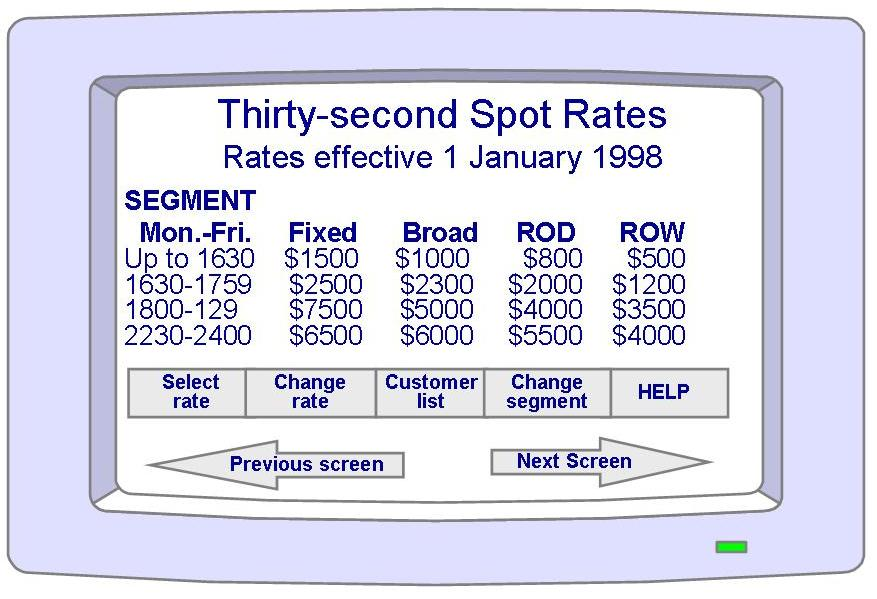

# c-slides

<!-- slide: 1 -->

## Chapter 10

- 交付系统
- Copyright 2006 Pearson/Prentice Hall. All rights reserved.

<!-- slide: 2 -->

## 目录

- 10.1 培训
- 10.2 文档
- 10.3 	信息系统的例子
- 10.4 实时系统的例子
- 10.5	本章对单个开发人员的意义

<!-- slide: 3 -->

## 本章内容

- 培训
- 文档

<!-- slide: 4 -->

## 第十章: 交付系统

- 交付系统不仅仅是把系统安置就位
- 还要帮助用户理解产品、并使其轻松使用产品
  - 培训
  - 文档

<!-- slide: 5 -->

## 10.1 培训使用系统的人的类型

- 用户: 执行系统的主要功能
- 操作员: 执行功能的目的是支持主要的工作
  - 创建重要数据文件的备份
  - 决定谁能够访问系统

<!-- slide: 6 -->

## 10.1 培训用户和操作员职能

| 用户职能 | 操作员职能 |
|---|---|
| 操纵数据文件 | 授予用户访问权限 |
| 模拟活动 | 授予文件访问权限 |
| 分析数据 | 执行备份 |
| 交流数据 | 安装新设备 |
| 绘制图形和图表 | 安装新软件 |
|  | 恢复损坏的文件 |

<!-- slide: 7 -->

## 10.1 培训培训类型

- 用户培训
- 操作员培训
- 特殊培训需求

<!-- slide: 8 -->

## 10.1 培训用户培训

- 介绍主要功能
  - 记录管理功能: 记录创建，删除，检索，修改等
  - 浏览并访问特定记录
  - 不需要了解内部操作 (例如，排序算法、数据结构)
- 将使用现有系统如何执行功能与以后用新系统将如何执行功能联系起来
  - 需要考虑这种培训的困难

<!-- slide: 9 -->

## 10.1 培训操作员培训

- 针对的是系统是如何工作的，而不是系统做些什么
- 在两种层次上培训
  - 怎样启动和运行新系统
  - 怎样支持用户

<!-- slide: 10 -->

## 10.1 培训特殊培训需求

- 不经常使用系统的用户 vs. 经常使用系统的用户
- 新用户 vs. 更新丢失的信息

<!-- slide: 11 -->

## 10.1 培训培训助手

- 文档
  - 正式的文档，手册
  - 只有一小部分用户阅读了
- 图元和联机帮助
  - 图元 (对象和功能)
  - 在线提供超链接
- 演示和上课
  - 更个性化，更灵活和生动，可以运用多媒体
- 专家用户 (训练个性化)
  - 使用一种角色模型

<!-- slide: 12 -->

## 10.1 培训培训的指导原则

- 理解个人的偏好、工作风格和组织机构的压力
- 不同类型的学生需要不同的适应性
  - 个性化系统
- 将培训课程中的材料或演示分为几个讲座单元，每个单元的内容是有限的
- 学生的地理位置可能会决定培训的种类
  - 如果系统安装在数百个地点，可能会需要一个基于Web的系统

<!-- slide: 13 -->

## 10.2 文档考虑读者

- 要知道预期的读者
  - 用户
  - 操作员
  - 客户职员
  - 开发团队的其他人员
- 对不同的人设计不同的文档
  - 包含一个简短的介绍

<!-- slide: 14 -->

## 10.2 文档文档类型

- 用户手册
- 操作员手册
- 系统概况指南
- 教学软件和自动化系统的概述
- 其他系统文档: 程序员指南

<!-- slide: 15 -->

## 10.2 文档用户手册

- 先介绍总体目标，然后进展到详细的功能描述
  - 系统的目的或目标
  - 系统的能力或功能
  - 系统的特征、特性和优点

<!-- slide: 16 -->

## 10.2 文档操作员手册

- 软件和硬件配置
- 授予用户访问权限、拒绝用户访问的方法
- 添加或删除系统外围设备的过程
- 复制或备份文件和文档的技术

<!-- slide: 17 -->

## 10.2 文档系统概况指南

- 用客户能够理解的语言描述系统
- 系统软件和硬件配置
- 系统结构的基本原理

<!-- slide: 18 -->

## 10.2 文档教学软件和自动化系统概述

- 基于多媒体, 一步一步的, 自动教学

<!-- slide: 19 -->

## 10.2 文档其他文档: 程序员指南

- 软件和硬件如何配置的概述
- 软件构建的细节和他们执行的功能
- 系统支持的功能
- 系统增强

<!-- slide: 20 -->

## 10.2 文档用户帮助和疑难解答

- 失效信息参考指南
- 参考文档
- 联机帮助

<!-- slide: 21 -->

## 10.2 文档失效信息参考指南

- 当失效发生时，正在执行的代码构件的名称
- 当失效发生时，正在执行的构件中源代码行号
- 失效的严重性和他对系统的影响
- 任何相关的系统内存或数据指针的内容，例如寄存器或栈指针
- 失效属性，或失效消息编号

<!-- slide: 22 -->

## 10.2 文档失效的例子

- 失效信息
    - FAILURE 345A1:  STACK OVERFLOW
    - OCCURRED IN:  COMPONENT DEFRECD
    - AT LINE:  12300
    - SEVERITY:  WARNING
    - REGISTER CONTENTS:  0000 0000 1100 1010 1100 1010 1111 0000
    - PRESS FUNCTION KEY 12 TO CONTINUE
- 用户在参考指南中查找
    - 失效345A1:  栈溢出.
    - 当一个纪录的字段大于系统的能力时出现该问题.定义的最后一个字段将不会包含在记录中，你可以维护菜单中的维护记录功能修改记录的大小，以防止将来发生这种失效。

<!-- slide: 23 -->

## 10.3 信息系统的例子皮卡地里系统

- 培训系统可以给用户呈现实际皮卡地里系统的屏幕
- 可以增加培训软件来使用户理解每个系统的本质和目的

<!-- slide: 24 -->

## 10.4 实时系统的例子阿丽亚娜 -5

- 对复用的阿丽亚娜 -4软件的一些假设没有在文档中描述
  - 阿丽亚娜-5 应该通过阅读得知代码中固有的所有假设

<!-- slide: 25 -->

## 10.5 本章对单个开发人员的意义

- 应该在项目的开始对培训和文档工作进行计划，并对其进行跟踪
- 培训和文档资料软件应该与正规的系统软件集成在一起
- 所有的培训和文档资料单元、文档都因该考虑不同的读者的各种需求
