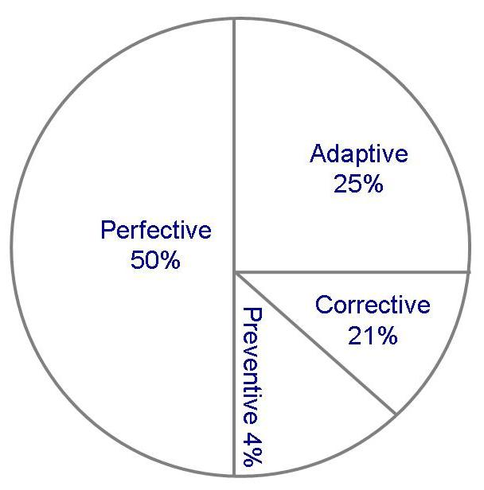
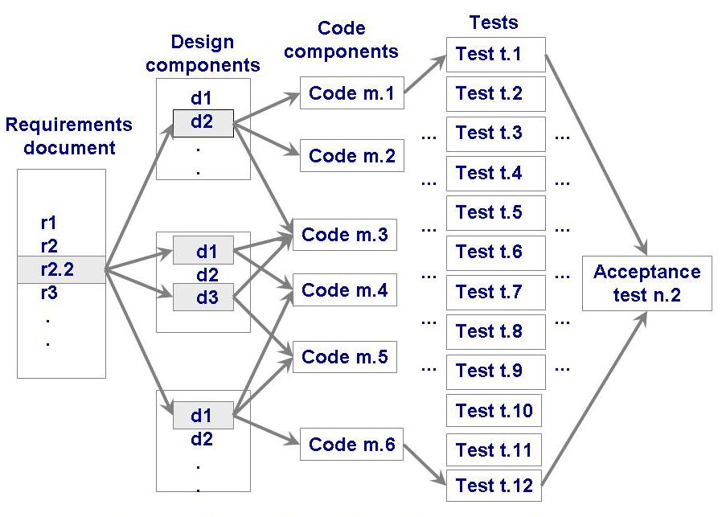
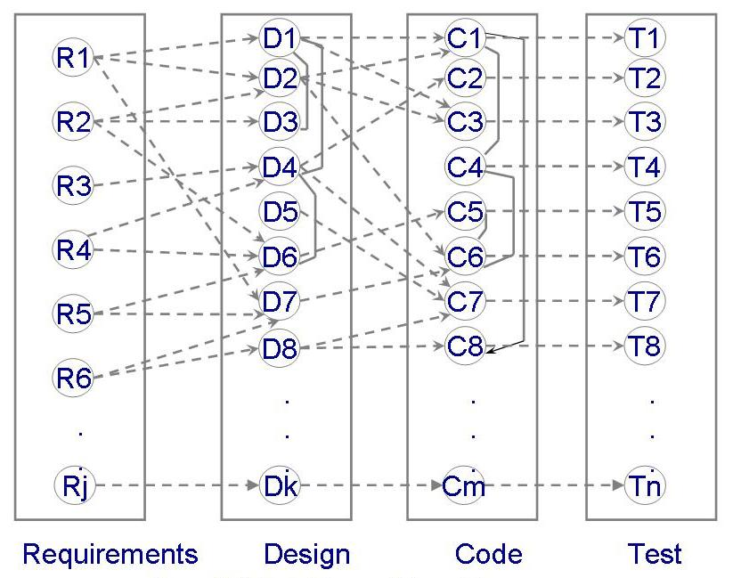
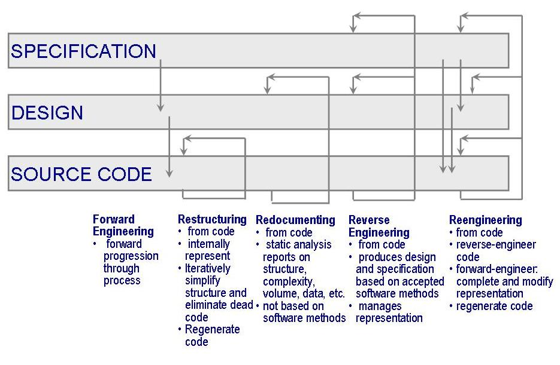
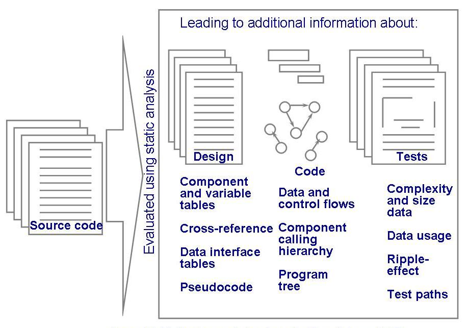
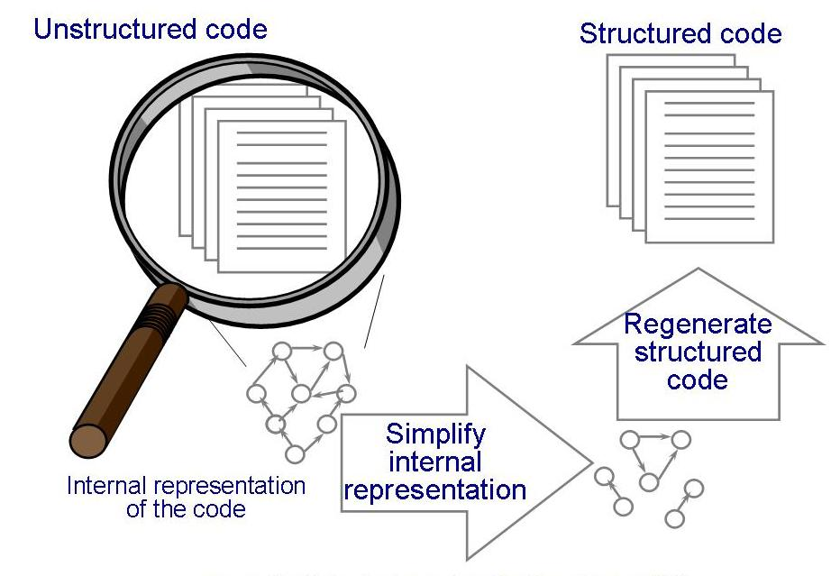
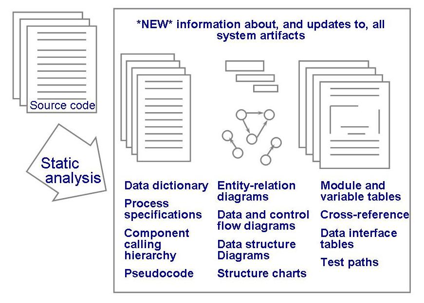
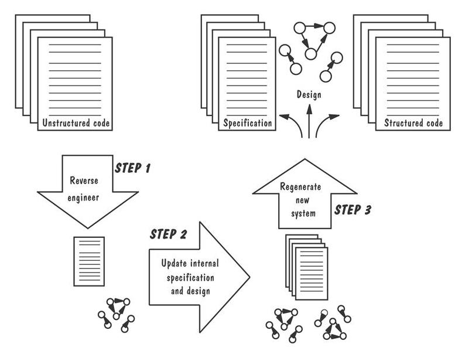

# c-slides

<!-- slide: 1 -->

## Chapter 11

- 维护系统
- Copyright 2006 Pearson/Prentice Hall. All rights reserved.

<!-- slide: 2 -->

## 目录

- 11.1 变化的系统
- 11.2 维护的本质
- 11.3 	维护问题
- 11.4	测量维护的特性
- 11.5	维护技术和工具
- 11.6	软件再生
- 11.7	信息系统的例子
- 11.8 实时系统的例子
- 11.9	本章对单个开发人员的意义

<!-- slide: 3 -->

## 本章内容

- 系统演化
- 遗留系统
- 影响分析
- 软件再生

<!-- slide: 4 -->

## 11.1 变化的系统

- 维护: 系统运行后，任何针对系统改变做出的工作
  - 软件不会降低，也不需要定期的维护
  - 然而软件需要不断提升
    - 维护过程是困难的

<!-- slide: 5 -->

## 11.1 变化的系统 软件开发过程中变化的例子

| 进行最初改变的活动 | 需求随之变化的制品 |
|---|---|
| 需求分析 | 需求规格说明 |
| 系统设计 | 体系结构设计规格说明 技术设计规格说明 |
| 程序设计 | 程序设计规格说明 |
| 程序实现 | 程序代码 程序文档 |
| 单元测试 | 测试计划 测试脚本 |
| 系统测试 | 测试计划 测试脚本 |
| 系统交付 | 用户文档 操作员文档 系统指南 程序员指南 培训课 |

<!-- slide: 6 -->

## 11.1 变化的系统系统生命周期跨度

- 我们需要维护阶段吗?
  - 开发时间 vs. 维护时间
- 我们预期会有多少变化?
  - 系统演化 vs. 系统退化
  - 软件演化法则

<!-- slide: 7 -->

## 11.1 变化的系统开发时间 Vs. 维护时间

- Parikh 和 Zvegintzov (1983)
  - 开发时间: 2 年
  - 维护时间: 5 到6 年
- Fjedstad和Hamlen (1979)
  - 39% 的工作量花在开发上
  - 61% 的工作量花在维护上
- 80-20 法则
  - 20% 的工作量用于开发
  - 80% 的工作量用于维护

<!-- slide: 8 -->

## 11.1 变化的系统系统演化 vs. 系统退化

- 是否维护的成本太高了?
- 系统的可靠性可以接受吗?
- 在合理的时间内，系统不再能够适应进一步的变化吗?
- 系统性能还超出规定的约束吗?
- 系统功能只能起到有限的作用吗?
- 其他具有相同功能的系统是否更好、更快、更便宜?
- 维护的成本很高，有足够的理由用更便宜、更新的硬件?

<!-- slide: 9 -->

## 11.2 维护的本质维护活动的类型

- 改正性:  维护对日常的系统功能的控制
- 适应性:  维护对系统修改的控制
- 完善性:  完善现有系统
- 预防性:  防止系统性能下降到不可接受的程度

<!-- slide: 10 -->

## 11.2 维护的本质谁执行维护

- 单独的维护小组
  - 更加客观
  - 更容易将一个系统应该如何运转与它实际是如何运转区别开来
- 开发人员
  - 用一种易于维护的方式来构建系统
  - 有时过于自信于他们对系统的理解，不愿意更新文档

<!-- slide: 11 -->

## 11.2 维护的本质小组责任

- 理解系统
- 在文档中找到信息
- 保持系统文档是最新的
- 扩展现有的功能，以适应新的或变化的需求
- 发现问题或系统失效的根源
- 回答关于系统运行方式的问题
- 找到并改正故障
- 重构设计和代码构件
- 重新编写设计和代码构件
- 删除不再有用的设计和代码构件
- 维护对系统作出的改变

<!-- slide: 12 -->

## 11.2 维护的本质维护时间的使用

- 维护工作量的分布图 (Lientz and Swanson)

<!-- slide: 13 -->

## 11.5 维护技术和工具

- 配置管理
  - 配置控制委员会CCB
  - 变更控制

<!-- slide: 14 -->

## 11.5 维护技术和工具配置控制过程

- 当用户、客户或开发人员发现了一个问题，他们将问题记录在一张正式的变化控制表中
- 将提出的变更报告给配置控制委员会
- CCB 开会讨论这个问题:  决定将影响到谁将为实现变化所必需的资源支付费用
- CCB 讨论可能的问题根源，改变的范围和实现它们预计的时间，分配优先级别或者严重性级别
- 分析员用一个测试副本进行工作
- 分析员与程序资料员合作，使所有的改变安装在运转的系统中
- 分析员归档变更报告

<!-- slide: 15 -->

## 11.5 维护技术和工具变更控制问题

- 同步:  变更是何时进行的?
- 标识:  由谁进行的变更?
- 命名:  系统的那个构件被改变了?
- 认证:  正确地进行了变更吗?
- 授权:  是谁授权进行的变更?
- 行程安排:  变更通知了谁?
- 取消:  谁能取消改变请求?
- 委托:  谁对变更负责?
- 估价:  改变的优先权是什么样的?

<!-- slide: 16 -->

## 11.5 维护技术和工具 影响分析

- 对与变化相关的多项风险所进行的评估，包括对资源、工作量和进度所造成的影响进行的评估
- 帮助控制维护成本

<!-- slide: 17 -->

## 11.5 维护技术和工具 测量变化的影响

- 工作产品:  是其变化有重要影响的开发制品
- 垂直可跟踪性:  表示工作产品中各部分之间的关系
- 水平可跟踪性:  表示工作产品集合的构件之间的关系

<!-- slide: 18 -->

## 11.5 维护技术和工具 水平可跟踪性

- 说明了如何确定相关工作产品之间的图形关系和可跟踪性链接

<!-- slide: 19 -->

## 11.5 维护技术和工具维护的基础图

<!-- slide: 20 -->

## 11.6 软件再生

- 文档重构:  对原代码进行静态分析，给出更多的信息
- 重组: 改变代码结构
- 逆向工程:  根据代码重新创建设计和规格说明信息
- 再工程:  对现有工程进行逆向工程，接着再改变规格说明和设计以完成逻辑模型 ；然后，根据修改的规格说明和设计生成新的系统

<!-- slide: 21 -->

## 11.6 软件再生分类

- 下图说明4种类型的软件再生之间的关系

<!-- slide: 22 -->

## 11.6 软件再生文档重构

- 第一步是将代码提交给一个分析工具
- 输出可能包括:
  - 构建调用关系
  - 类层次
  - 数据接口表
  - 数据字典信息
  - 数据流表或数据流图
  - 控制流表或控制流图
  - 伪代码
  - 测试路径
  - 构件和变量的交叉引用

<!-- slide: 23 -->

## 11.6 软件再生文档重构

- 下图说明了文档重构过程

<!-- slide: 24 -->

## 11.6 软件再生重组活动

- 解释源代码以及用内部形式表示源代码
- 利用转换规则来简化内部表示
- 重新生成结构化的代码

<!-- slide: 25 -->

## 11.6 软件再生重组活动 (continued)

- 下图解释重组中的三个主要活动

<!-- slide: 26 -->

## 11.6 软件再生逆向工程

- 尽量基于软件规格说明和设计方法恢复工程性信息
- 逆向工程被广泛使用，仍然存在一些主要的障碍
  - 实时系统的问题
  - 极端复杂系统

<!-- slide: 27 -->

## 11.6 软件再生逆向工程过程

- 下图说明了逆向工程过程

<!-- slide: 28 -->

## 11.6 软件再生再工程

- 是扩展的逆向工程
  - 在不改变整个系统功能的前提下，生产新的软件源代码
- 再工程步骤
  - 系统进行逆向工程
  - 修改并完成软件系统模型
  - 生成新系统

<!-- slide: 29 -->

## 11.6 软件再生再工程过程

- 下图说明了再工程的过程

