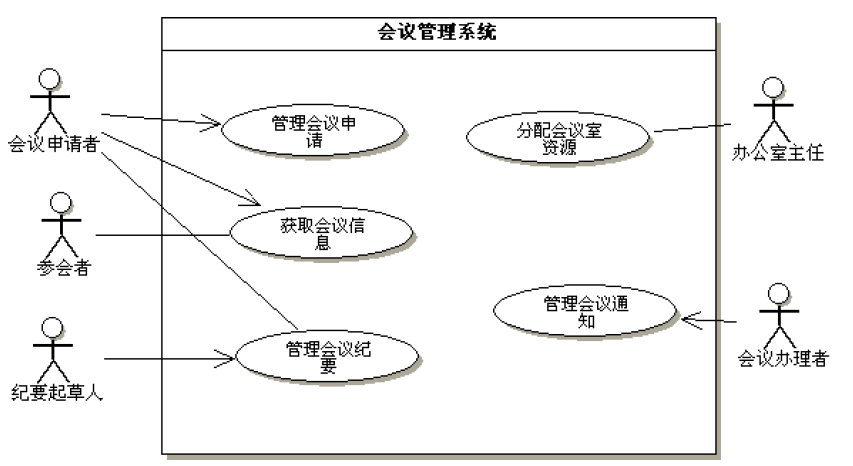
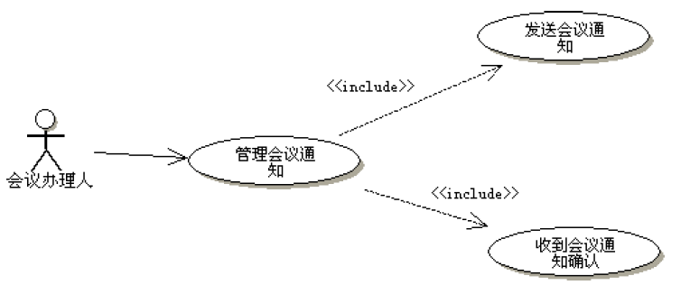
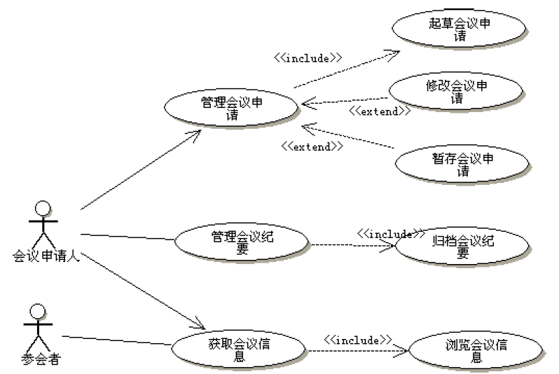
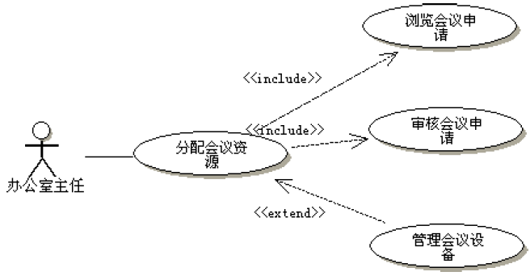
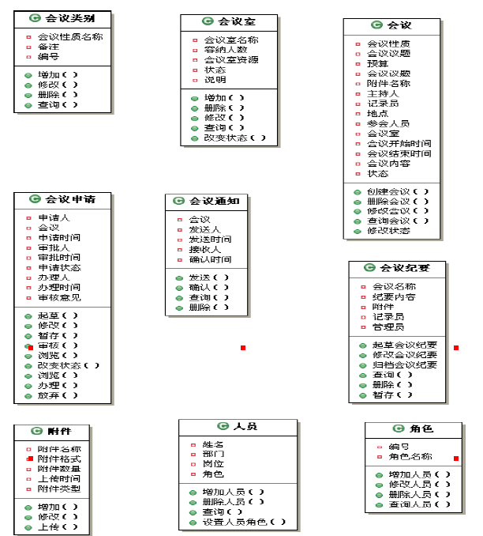
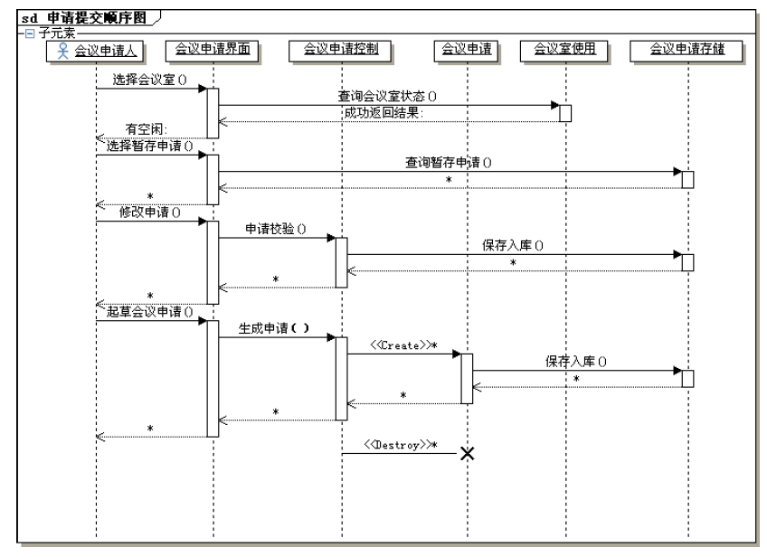
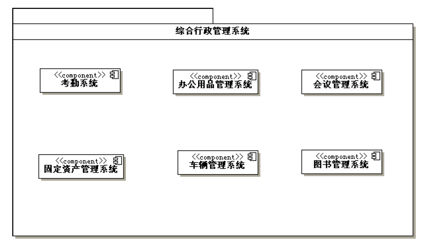
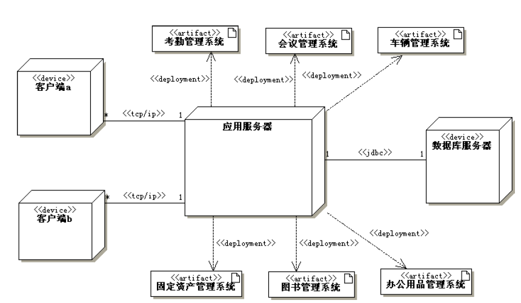

# 会议管理系统案例

<!-- slide: 1 -->

## 面向对象系统分析与设计- 会议管理系统

- <number>

<!-- slide: 2 -->

## 会议管理实例分析－需求

- 华 南 理 工 大 学
- 软 件 需 求 分 析 与 建 模
- <number>
- 会议是保证行政管理实施的手段，会议管理包括会议类别设置、会议室设置、会议申请、会议审核、会议通知、会议纪要、会议查询、会议归档。
- 会议类型设置是进行会议管理的基础，需要保存的信息包括：会议性质名称、备注，并可对会议类型设置进行修改和删除。会议室设置需要保存的信息包括：会议室名称、容纳人数、会议室资源、使用情况、说明，并可对会议室设置进行修改、删除以及查看使用情况。会议申请是由会议申请人草拟的会议安排，输入信息包括：会议性质、会议议题、预算、会议附件（有附件上传功能）、主持人、记录人员、参加人员、会议地点、会议室、会议开始时间、会议结束时间、会议内容、审批人。可以将会议申请暂存、也可发给审批人或者放弃该申请。

<!-- slide: 3 -->

- 华 南 理 工 大 学
- 软 件 需 求 分 析 与 建 模
- <number>
- 会议审核是办公室领导在阅读完申请后签署的修改意见，审核后可以发给办理人，让其发会议通知，或退回给会议申请人，由其发通知，接着由会议起草人起草会议纪要，内容包括：会议名称、纪要内容、附件（有附件上传功能）、记录员、管理员。会议纪要可以提交给会议申请人，由申请人归档或者直接保存。
- 会议查询包括：已开会仪查询、待开会议查询、会议纪要查询。待开会议查询显示信息包括：会议议题、主持人、地点、时间、与会人员，并可实现分页显示、删除、修改和结束会议。已开会议查询的显示信息和待开会议显示信息相同，可以对其进行删除。会议要的查询信息包括：会议名称、会议议题、主持人、开会时间、开会地点、与会人员，可以对会议纪要进行删除和修改和归档。

<!-- slide: 4 -->

## 步骤1－识别参与者

- 华 南 理 工 大 学
- 软 件 需 求 分 析 与 建 模
- <number>
- 1.角色识别:这是整个用例建模的第一步，那些人和事物能成为角色，首先要它是否要使用未来的系统，和系统发生交互行为，再者要看它使用未来的统是否对它来说具有经济价值，最后还要确定未来的系统是否要实现此需求特性。经过识别，确定一下系统角色：会议申请者，办公室主任，会议办理者，纪要起草人，参会者。

<!-- slide: 5 -->

## 步骤2－识别用例

- 华 南 理 工 大 学
- 软 件 需 求 分 析 与 建 模
- <number>
- 2.用例：在确定了系统角色以后，每一角色使用系统完成什么样的业务，就是用例，系统用例具有概括性和目标性，经过识别，确认一下系统用例：管理会议申请，获取会议纪要，管理会议纪要，分配会议室资源，发送会议信息，获取会议信息。

<!-- slide: 6 -->

## 步骤3－关系

- 华 南 理 工 大 学
- 软 件 需 求 分 析 与 建 模
- <number>
- 3.关系：在系统用例图中，主要识别角色和系统用例间的关系以及角色与角色之间的关系，根据用例的发起者不同，把角色和用例间的关联（通信）关系分为单向管理和双向关联，单向关联有：会议申请人和编辑会议申请，会议纪要起草人和编辑会议纪要，会议办理者和发送会议通知；双向关联有：办公室主任和分配会议室资源，参会者和获取会议信息。

<!-- slide: 7 -->

## 步骤4－总结系统需求

- 华 南 理 工 大 学
- 软 件 需 求 分 析 与 建 模
- <number>
- 4.系统：经过前面分析，未来系统将要实现的需求特征包含：编辑会议申请、编辑会议纪要、获取会议通知、分配会议室资源、发送会议通知，这些元素属于系统内，其余在系统外，属于系统环境。

<!-- slide: 8 -->

## 步骤5－顶层用例图

- 华 南 理 工 大 学
- 软 件 需 求 分 析 与 建 模
- <number>

<!-- slide: 9 -->

## 步骤6－细化

- 华 南 理 工 大 学
- 软 件 需 求 分 析 与 建 模
- <number>

<!-- slide: 10 -->

## 步骤6－细化

- 华 南 理 工 大 学
- 软 件 需 求 分 析 与 建 模
- <number>

<!-- slide: 11 -->

## 步骤6－细化

- 华 南 理 工 大 学
- 软 件 需 求 分 析 与 建 模
- <number>

<!-- slide: 12 -->

## 步骤7－用例说明文档

- 华 南 理 工 大 学
- 软 件 需 求 分 析 与 建 模
- <number>
- 用例模型充分反映了角色和系统之间的关系，作为角色和系统之间交互的模型，显然缺乏行为细节描述，因此，需要一份书面的说明文档，象写契约一样，把双方的都要遵守的规则都写进去，用来描述用例的模板很多，没有统一规范，下面就一些常用描述元素做以概括介绍：
- （1）前置条件：用例执行前必须满足的条件，如果不满足条件，用例不被执行，一般与系统的上下文环境和参数限定有关.
- （2）后置条件：在用例结束时，系统必须所处的状态，以防止用例执行的结果不确定，影响后续用例的执行。

<!-- slide: 13 -->

- 华 南 理 工 大 学
- 软 件 需 求 分 析 与 建 模
- <number>
- （3）基本事件流：路径是从用户角度来描述系统的使用，它关注系统干什么，而不关怎样干。基本事件流是用例中最常发生的路径。
- （4）可选事件流：是系统合法的路径，但不是经常发生的路径。
- （5）异常事件流：指未来系统要捕获错误的路径。
- （6）参与者:触发用例的角色、系统、时间。
- （7）用例名称：就是用例图中用例名。

<!-- slide: 14 -->

- 华 南 理 工 大 学
- 软 件 需 求 分 析 与 建 模
- <number>
- （1）用例名称：起草会议申请
- 参与者：会议申请人。
- 前置条件：会议申请人有条件通过网络访问系统并已成功地登录系统。
- 后置条件：系统保存一份新的会议申请。
- 基本事件流：
  - 1.用户通过网络登录后成功访问系统。
  - 2.用户选择会议管理后，再选择浏览会议信息。
  - 3.浏览结束后用户选择查看暂存会议申请。
  - 4.在确认无合适的会议申请后，用户选择起草会议申请。
  - 5.用户输入会议申请的相关信息。
  - 6.会议申请经过校验后提交办公室主任。

<!-- slide: 15 -->

- 华 南 理 工 大 学
- 软 件 需 求 分 析 与 建 模
- <number>
- 可选事件流：
  - 1.用户发现有可用的暂存申请可以修改，系统进入修改会议用例界面。
  - 2.新起草的会议申请被暂存。
- 异常事件流：
  - 1.会议室已被预定，给出错误信息提示。
  - 2.会议信息校验失败，给出错误信息提示。

<!-- slide: 16 -->

## 会议管理系统类图中的分析过程－（1）主要分析类

- 华 南 理 工 大 学
- 软 件 需 求 分 析 与 建 模
- <number>
- （1）主要分析类
- 每一系统都有一个或几个主要分析类，并且有一些其他类围绕在这个类的周围，辅助主要分析类完成它的生命周期。
- 例如，对于会议管理子系统来讲，显然会议是主要的分析类，主要分析类是在需求采集阶段就要确定的类，在画类图时只画主要分析类呢？
- 当然不是，一个孤零零的类什么作用都没有，只有类和类之间发生关系才能形成业务，所以第一步是要找到其他的支持类，从哪儿找呢？回答原始需求文档。

<!-- slide: 17 -->

## （2）辅助类

- 华 南 理 工 大 学
- 软 件 需 求 分 析 与 建 模
- <number>
- 首先我们从原始需求文档中找到名词和隐含的名词，在软件开发以后，这些名词可以演化为类或类的属性，对于会议管理系统来讲，前半部分文档所包含的名词有：会议、行政管理、手段、会议类别、会议室、会议申请、会议通知、会议纪要、基础、信息、会议性质名称、备注、会议室名称、容纳人数、会议室资源、说明、使用情况、会议申请人、会议安排、会议性质、会议议题、预算、会议附件、主持人、记录人员、参加人员、会议地点、会议室、会议开始时间、会议结束时间、会议内容、审批人。

<!-- slide: 18 -->

- 华 南 理 工 大 学
- 软 件 需 求 分 析 与 建 模
- <number>
- 其次要合并含义相同的名词，如把备注和说明合并为说明、把会议性质和会议性质名称合并为会议性质。还要排除范围以外的名词，行政管理、手段、基础、信息都是一些概括性的名词，只能作为抽象类或子系统、系统名称，可以暂时不考虑，最后还需要找到一些隐含的名词，由于在会议管理中，作某些事情（如提交会议申请）的人，往往不是一个特定的员工，而是有一群这样的人，而且这群人中的具体员工在随时发生变化，在这里事实上隐含了一个岗位或职责的概念，我们用角色来代替。员工这个隐含的名词也必须出现在系统，才能使整个系统具有完整性。

<!-- slide: 19 -->

## （3）确定为属性或类

- 华 南 理 工 大 学
- 软 件 需 求 分 析 与 建 模
- <number>
- 后去掉只能作为类属性的名词。一个名词是作为类还是作为类的属性，关键是看在需求中有没有动词作用在该名词上，对会议管理子系统来讲，会议性质名称、备注、会议室名称、容纳人数、会议室资源、说明、使用情况、会议申请人、会议安排、会议性质、会议议题、预算、会议附件、主持人、记录人员、参加人员、会议地点、会议室、会议开始时间、会议结束时间、会议内容、审批人，都没有动词作用于该名词只能作为属性使用，具体是那个类的属性，我们在后面分析。

<!-- slide: 20 -->

- 华 南 理 工 大 学
- 软 件 需 求 分 析 与 建 模
- <number>
- 剩下的名词有：会议、会议类别、会议室、会议申请、会议通知、会议纪要、会议附件。再加上隐含的名词：角色、员工，它们构成了类图的候选类。

<!-- slide: 21 -->

## （4）定义属性

- 华 南 理 工 大 学
- 软 件 需 求 分 析 与 建 模
- <number>
- 寻找属性时，一般要从类的实例-对象来着手，并从以下几个方面进行考虑：
- 1、按一般常识这个对象有那些属性。
- 2、在当前问题域该对象有那些属性。
- 3、根据系统责任，这个对象应该有那些属性。
- 4、为了实现某些功能，对象需要增加那些属性。
- 5、对象有那些区别的状态。
- 6、对象整体和部分属性设。

<!-- slide: 22 -->

## （5）定义操作

- 华 南 理 工 大 学
- 软 件 需 求 分 析 与 建 模
- <number>
- 找操作要从类的实例-对象来着手，并从以下几个方面进行考虑：
- 1、从需求中的功能，寻找对象的操作。
- 2、系统行为推迟到设计阶段。
- 3、暂不考虑对象中读、写属性这样的操作。
- 4、根据系统责任，这个对象应该有那些操作。
- 5、分析对象的状态转换，寻找操作。
- 6、追踪流程，寻找操作。
- 7、类本身要使用那些操作来维护信息更新以及信息的一致性和完整性。

<!-- slide: 23 -->

## （6）画出类图

- 华 南 理 工 大 学
- 软 件 需 求 分 析 与 建 模
- <number>

<!-- slide: 24 -->

## （7）画出类之间的关系

- 华 南 理 工 大 学
- 软 件 需 求 分 析 与 建 模
- <number>

<!-- slide: 25 -->

## 顺序图的建模分析步骤

- 华 南 理 工 大 学
- 软 件 需 求 分 析 与 建 模
- <number>
- (1)完成用例图的分析；
- (2)对每个用例，识别出参与基本事件流的对象(包括接口、子系统、角色等)。
- (3)识别出这些对象是主动对象还是被动对象。
- (4)识别出这些对象发出的消息是同步消息还是异步消息。
- (5)从主动对象开始向接收对象发消息。
- (6)接收对象再调用自己的服务为主动对象返回结果。
- (7)如果接收对象需要再调用其他对象的服务，需要向其他对象再发消息。
- (8)如此反复，最后返回给主动对象有意义的结果。
- (9)用UML建模工具绘出顺序图。
- (10)给顺序图补充必要的说明文档。

<!-- slide: 26 -->

## 会议管理中会议申请顺序图

- 华 南 理 工 大 学
- 软 件 需 求 分 析 与 建 模
- <number>

<!-- slide: 27 -->

## 状态图的建模分析步骤

- 华 南 理 工 大 学
- 软 件 需 求 分 析 与 建 模
- <number>
- （1）首先要确定进行系统控制的对象，可以从前面分析的顺序图中寻找。
- （2）确定对象的起始状态和结束状态。
- （3）在对象的整个生命周期寻找有意义的控制状态。
- （4）寻找状态之间的转换。
- （5）补充引起转换的事件。
- （6）UML建模工具画状态图。
- （7）补充必要的文档。

<!-- slide: 28 -->

## 会议状态图

- 华 南 理 工 大 学
- 软 件 需 求 分 析 与 建 模
- <number>

<!-- slide: 29 -->

## 活动图建模步骤

- 华 南 理 工 大 学
- 软 件 需 求 分 析 与 建 模
- <number>
- （1）在采集的原始需求中选择重点流程；
- （2）首先要确定要设计的活动图是针对业务流程还是用例。
- （3）其次要设计活动过程的起点和终点。
- （4）确定活动图所有执行对象。
- （5）确定活动节点，并根据执行对象进行活动分组。
  - （a）如果对用例建活动图，则把角色所发出的每一个动作变为活动节点。
  - （b）如果对业务流程建活动图，则把每一个流程步骤(或片段)变为活动节点。
- （6）确定活动节点之间转移。
- （7）处理在活动节点之间的分支和合并。
- （8）处理在活动节点之间的分叉和汇合。
- （9）用UML建模工具进行活动图建模。
- （10）编写必要的补充文档。

<!-- slide: 30 -->

- 华 南 理 工 大 学
- 软 件 需 求 分 析 与 建 模
- <number>

<!-- slide: 31 -->

## 组件图

- 华 南 理 工 大 学
- 软 件 需 求 分 析 与 建 模
- <number>
- 使用组件图建模的步骤可按照下列步骤进行：
  - （1）对系统中的组件建模；
  - （2）定义相关组件提供的接口；
  - （3）对它们间的关系建模；
  - （4）对建模的结果进行精化和细化。

<!-- slide: 32 -->

## 组件图

- 华 南 理 工 大 学
- 软 件 需 求 分 析 与 建 模
- <number>

<!-- slide: 33 -->

## 部署图

- 华 南 理 工 大 学
- 软 件 需 求 分 析 与 建 模
- <number>
  - 绘制系统部署图，可以参照以下步骤进行：
    - (1) 对系统中的节点建模；
    - (2) 对节点间的关系建模；
    - (3) 对节点中的组件建模，这些组件来自组件图；
    - (4) 对组件间的关系建模；
    - (5) 对建模的结果进行精化和细化。

<!-- slide: 34 -->

- 华 南 理 工 大 学
- 软 件 需 求 分 析 与 建 模
- <number>

<!-- slide: 35 -->

## Click to edit company slogan .

- <number>
- www.themegallery.com

