# 测试文档

<!-- page: 1 -->

爆破数字档案馆

爆破数字档案馆

测试用例

文件标识：
B l a s t i n g D i g i t a l A r c h i v e s _ T E
S T _ C A S E
当前版本：
1 . 0
作   者：
兰翀、甄坡
完成日期：
2 0 1 0 - 1 2 - 0 9

文
件
状
态：
[ ] 草稿
[ √
] 正
式发布
[ ] 正在
修改

第 1 页 共 29 页

<!-- page: 2 -->

爆破数字档案馆

目录

1
UI 测试............................................................................................................................................................. 3
1.1  界面布局测试 ........................................................................................................................................ 3
1.2  列表测试 ................................................................................................................................................ 3

2  注册/登录模块测试用例.................................................................................................................................. 4
2.1  注册测试 ................................................................................................................................................ 4
2.2  登录测试 ................................................................................................................................................ 6

3  搜索模块测试用例 ........................................................................................................................................... 7
3.1  精确查询 ................................................................................................................................................ 7
3.2  模糊查询 ................................................................................................................................................ 8

4  文件管理模块测试用例 ................................................................................................................................... 9
4.1  上传文件测试 ........................................................................................................................................ 9
4.2
文件浏览及下载测试 ...................................................................................................................... 10

5  文本框模块测试用例 ..................................................................................................................................... 10
6  软件管理测试用例 ......................................................................................................................................... 12
7  人员管理测试用例 ......................................................................................................................................... 12

7.1  角色权限管理测试用例 ..................................................................................................................... 12
7.2  添加人员测试 ...................................................................................................................................... 13
7.3  人员维护测试用例.............................................................................................................................. 14

7.4  修改个人资料模块测试用例 ............................................................................................................. 15
8. 性能测试 ........................................................................................................................................................... 16

第 2 页 共 29 页

<!-- page: 3 -->

爆破数字档案馆

1 UI 测试

1.1  界面布局测试

用例ID
D1001
用例名称
UI 测试

用例描述
本测试用例用来测试用户界面的色彩搭配、整体布局、行距、对齐，样式统一等等，同

时测试控件是否合理，提示信息和页面信息是否有语法错误。

测试用例ID 场景
测试步骤
预期结果

查看文字内容
① 各种介绍文字、注册的协议条款的内容一致
② 各处相同含义文字如标题栏文字、弹出窗口文字、菜

TC001

单名称、功能键文字等的内容一致

TC002
查看文字样式
各类文字字体、字号、样式、颜色、文字间距、对齐方式

等样式一致

进入数字
档案馆的
各界面

TC003
查看控件是否合理
① Button 的样式整体统一，要选取一种风格并且可用

② 单选框的默认情况要统一
③ 日期控件的控件颜色、样式统一，点击控件、文本框

均应弹出日期选择框

④ 下拉选择框的默认情况要统一

TC004
查看提示信息
① 静态文字与它的提示信息一致性，例如静态文字

为„用户名‟，出错信息显示„用户名‟
② 空值时，出错信息要统一，如“静态文字”不能为空

③ 必输项提示信息采用统一标志
④ 出现录入错误时，出错信息要统一，如“静态文字”

格式不符合要求

1.2  列表测试

用例ID
D1002
用例名称
列表测试

用例描述
本测试用例用来测试列表是否正确显示

测试用例ID
场景
测试步骤
预期结果

TC005
确认页面的默认

排序方式
按访问量降序排列

TC006
验证含link 的

列
点击“专家姓名”
显示专家的详细信息

TC007
验证第2 页/共8

页 每页10 条/共
统计数据正确

第 3 页 共 29 页

<!-- page: 4 -->

50 条中的分页数

据

验证首页、上一

点击标签
在当前上下文有意义时显示，否则隐藏

TC008

页、下一页、尾
页的link

或显示为文本标签

TC009
分页显示
正确显示

在“到第□/10 页”填中入2，
点击“确定”按钮
跳转到第2 页

TC010
输入小于等于总
页数的页码

在“到第□/10 页”填中入
11，点击“确定”按钮
提示请求页数超过范围

TC011
输入大于总页数
的页码

TC012
输入0 页码
在“到第□/10 页”填中入0，
点击“确定”按钮
提示请求页数超过范围

输入空格或其他
字符（除阿拉伯

在“到第□/10 页”填中输
入空格，点击“确定”按钮
页面提示输入正确的数字

TC013

数字以外）

TC014
统计每页显示的

项的正确性
选择每页显示20 项
统计每页显示20 项档案信息

2  注册/登录模块测试用例

2.1  注册测试

用例ID
D1003
用例名称
注册测试

用例描述
本测试用例用来测试保存用户信息的注册模块是否工作正常。

测试用例ID 场景
测试步骤
预期结果

TC005
必填项分别为
空注册

在必填项中输入空信息
提示必须输入必填项信息

TC006
用户名含有非

@%*()99

提示用户名格式不正确，用户名为6—18 位的数字、

下划线和字母组合

法字符注册

123456
123456
123@163.com

ABCDEF
1234

TC007
用户名长度为
【最小值】-1，
进行注册

Hello
123456
123456

提示用户名长度为6—18 位的数字、下划线和字母组
合

123@163.com
ABCDEF

第 4 页 共 29 页

<!-- page: 5 -->

1234

TC008
用户名长度为
【最大值】+1，

Yonghuchangduwei1920
123456

提示用户名长度为6-20 位

进行注册

123456
123@163.com
ABCDEF

1234

提示密码长度为6-20

TC009
密码长度为【最

pipi

小值】-1，进行
注册

12345
12345
123@163.com

ABCDEF
1234

TC010
用户名和密码
长度都为【最大

Yonghuchangduwei1920
Yonghuchangduwei1920

注册成功，进入系统

值】，进行注册，
且用户名和密
码一致

Yonghuchangduwei1920
123@163.com
ABCDEF

1234

TC011
用户名和密码

labula

注册成功，进入系统

长度都为【最小
值】，进行注册

123456
123456
123@163.com

ABCD
1234

TC012
两次输入密码
不一致进行注
册

labula
123456
654321

提示两次密码输入不一致

123@163.com
ABCDEF
1234

TC013
密码含有非法
字符注册

labula
1@1@1@

提示密码格式不正确

1@1@1@
123@163.com
ABCDEF

1234

TC014
邮箱格式不正

labula

提示邮箱格式不正确

确进行注册

123456
654321
123163@abc

ABCDEF
1234

TC015
验证码不正确
labula
提示验证码不正确

第 5 页 共 29 页

<!-- page: 6 -->

进行注册
123456

654321
123@163.com
ABCDEF

4321

TC016
用户名和密码

Labula1

注册成功，进入系统

长度在【最小
值，最大值】之
间，进行注册

123456
123456
123@163.com

ABCDEF
2345

TC017
用已经注册的
用户名进行注
册

labula
123456
123456

提示用户名已存在

123@163.com
ABCDEF
1234

TC018
改变已存在用

LABULA

注册成功，进入系统

户的用户名的
大小写进行注
册

123456
123456
123@163.com

ABCDEF
2345

TC019
tab 按键是否正
确响应

注册时按下Tab 键
跳到下一选项

2.2  登录测试

用例ID
D1004
用例名称
登录测试

用例描述
本测试用例用来测试用户使用该系统的入口——登录模块是否工作正常。

用例入口
在用例D1002 的基础上进行

测试用例ID 场景
测试步骤
预期结果

TC020
使用错误的用户名登录
皮皮(未注册)
123456
提示用户名不存在

yangguang
999999
登录成功，进入系统

TC021
使用合法用户名和密码
登录

TC022
使用错误的密码登录
yangguang

9999
提示密码错误

用户名为空

TC023
用户名和密码均为空登

密码为空
提示输入用户名和密码

录

第 6 页 共 29 页

<!-- page: 7 -->

TC024
用户名为空登录
用户名为空

123456
提示输入用户名

TC025
密码为空登录
yangguang

密码为空
提示输入密码

TC026
使用大写用户名登录
Yangguang

999999
登录成功，进入系统

TC027
使用大写密码登录
lenny
Lenny
提示密码错误

yangguang
999999
提示用户名不存在

TC028
在合法用户名或密码前
插入空格

yang guang
999999
提示密码不正确

TC029
在合法用户名或密码中

间插入空格

yangguang +空格
999999+空格
提示用户名密码不正确

TC030
在合法用户名或密码后

插入空格

pipi（已删除）
1234
提示输入正确的用户名或密码

TC031
使用已删除的用户名登

录

ｌｅｎｎｙ
ｌｅｎｎｙ
提示输入正确的用户名或密码

TC032
用户名中含有全角字符

登录

TC033
Tab 或Enter 键是否正确

响应
按下tab 键
鼠标光标跳转下一行

TC034
登录后正确显示网页
以“hxy”、“123”登录系统，
显示hxy 的信息
显示“企业信息修改”页面

3  搜索模块测试用例

3.1  精确查询

用例ID
D1005
用例名称
精确查询测试

用例描述
本测试用例用来测试用户使用关键词来搜索内容

用例入口
在用例D1003 的基础上进行

测试用例ID 场景
测试步骤
预期结果

TC035
验证搜索条件为空
文本框为空，所在省市也为空，
点击查询
显示档案馆内所有的专家信息

TC036
文本框为空的搜索
文本框为空，选择广东省，点击
查询

显示所有所在地为广东省的专家

信息

所在省市为空，以数
据库中不存在的专家
姓名搜索

在文本框中输入hellokitty，点击

TC037

查询
提示查询结果为空

第 7 页 共 29 页

<!-- page: 8 -->

所在省市为空，以数

在文本框中输入“史家育”，点击
查询

显示所有的姓名为“史家育”

TC038

据库中存在的专家姓
名搜索

的专家信息

栏目导航—>按地区
分类
选择“北京”
显示所有地区在“ 北京”的专

家信息

TC039

栏目导航—>按职称
分类
选择“研究员”
显示所有职称是“ 研究员”的

专家信息

TC039
验证姓名前插入空格
在文本框中输入“ 史家育”，点
击查询
提示查询结果为空

TC040
验证姓名中插入空格
在文本框中输入“史 家育”，点
击查询
提示查询结果为空

TC041
验证姓名后插入空格
在文本框中输入“ 史家育 ”，点
击查询
提示查询结果为空

在文本框中输入“ 史家育 ”，所
在省市下拉框选择湖北

TC042
匹配的组合查询条件
搜索

显示姓名为“史家育”，所在

省为湖北的专家信息

在文本框中输入“ 史家育 ”，所
在省市下拉框选择广东，点击查

TC043
不匹配的组合查询条
件搜索

提示查询结果为空

询

TC044
高级检索->验证所有

所有搜索条件为空，点击普通检

索
提示左侧选择档案类别

搜索条件为空

TC045
高级检索->选择档案
馆类别，关键词为空

选择“ 爆破工程馆”，其余搜索条
件为空

显示所有爆破工程馆里的档案信

息

3.2  模糊查询

用例ID
D1006
用例名称
模糊查询测试

用例描述
本测试用例用来测试用户使用不完备的关键词来模糊查询内容

用例入口
在用例D1003 的基础上进行

测试用例ID 场景
测试步骤
预期结果

TC046
模糊查询
在文本框中输入“史家”，点击
查询

显示所有姓名以“ 史家” 开头
的专家信息

在文本框中输入“ 王*”，点击
查询
提示查询结果为空

TC047
含特殊字符的模糊查
询

TC048
对大小写敏感的测试
输入“ Asdas”，点击查询
提示查询结果为空

TC049
对全角半角敏感的测
试

文本框中输入“ ａｓｄａｓ”，
点击查询
提示查询结果为空

“爆破工程馆”“题名”

TC050
高级检索->按题名模
糊查询

显示所有标题跟“爆破”有关的档

“模糊”
“爆破”

案

第 8 页 共 29 页

<!-- page: 9 -->

“爆破工程馆”“题名”

TC051
按题名精确查询

“精确”
“爆破”

查询结果为空

“爆破工程馆”“作者名”
“模糊”
“史”

显示爆破工程馆中作者姓“史的档

TC052
按作者名模糊查询

案列表

“爆破工程馆”“题名”
“精确”

TC053
按作者名模糊查询

查询结果为空

“史”

选择日期从“ 1959-12-31” 到
“2001-01-31”

提示日期范围为“1960-01-01”到

TC054

“2011-10-06”

TC055
选择日期从
“1960-01-01”到“2011-10-07”

提示日期范围为“1960-01-01”到

超出时间区间

“2011-10-06”

TC056
选择日期从
“1960-01-01”到“2011-10-06”
通过日期验证（不报错）

TC057
快速检索
在检索词中输入“ 005”
显示与005 有关的档案

每一次新的搜索执行，都应该去除
分页，显示第一页、并回到进入页

TC058
新的搜索

面时的默认排序方式

TC059
直接检索->一种档案
类别

选择爆破工程馆，点击直接检
索按钮
显示所有爆破工程馆里的档案

TC060
直接检索->子类别查

选择爆破工程馆，子类别选择

水下深孔，点击直接检索按钮
显示所有水下深孔的档案

询

TC061
访问量自增
浏览asdas 的专家信息
浏览次数应该增加1

4  文件管理模块测试用例

4.1  上传文件测试

用例ID
D1007
用例名称
上传文件测试

用例描述
本测试用例用来测试能否正确上传文件

用例入口
在用例D1003 的基础上进行

测试用例ID
场景
测试步骤
预期结果

上传一种jpg 或gif 的格式图片，大

TC062
上传正确类型、大

小为4.8M
上传成功

小合适的图片

上传.doc、.xls、ppt、bmp、jpeg、
psd、tiff、tga、png、swf、svg、pcx、提示“只能上传jpg 或gif 格式图片”

TC063
文件类型错误，文
件大小合适的校验

第 9 页 共 29 页

<!-- page: 10 -->

dxf、wmf、emf、lic、eps、.txt 等格

式文件，文件大小合适

上传一种jpg 或gif 的格式图片，文

TC064
上传大小为【最大值】

件大小为5M
结果为上传成功

的文件

上传一种jpg 或gif 的格式图片，文

TC065
上传大小大于【最大

件大小为5.1M
提示图片格式过大

值】的文件

提示信息：“请重新上传文件，

TC066
上传大小为0 的文件
文件类型和文件大小合法，上

传一个0kb 的图片

或者是不能上传0kb 的图片”

TC067
上传一个正在使用

中的图片
打开该图片，再上传该图片
上传成功

输入C:\a.jpg

TC068
手动输入一个存在

点击上传
上传成功

的图片地址

TC069
手动输入一个不存在

的图片地址
输入g:\a.jpg，点击上传，
提示正确选择要上传的文件

4.2 文件浏览及下载测试

用例ID
D1008
用例名称
文件浏览及下载测试

用例描述
本测试用例用来测试能否正确上传文件

用例入口
在用例D1003 的基础上进行

测试用例ID
场景
测试步骤
预期结果

TC070
文件下载
选择文件名，右键另存为
可以下载此文件

TC071
文件下载
再次下载文件
下载次数增加1

TC072
原文档下载
单击原文档下载按钮
在页面打开（还是提示下载？）

TC073
文件下载
直接打开文件
应该正确显示软件信息

TC074
文件浏览
本机没有安装pdf 工具，单击

pdf 文件
不能打开，同时给出正确的提示

TC075
文件浏览
本机安装了pdf 工具，打开文件
 文件能正确显示

TC076
文件下载
下载文件，保存在本地计算机

中
文件能正确显示

TC077
文件下载
取消下载
下载次数没有增加

5  文本框模块测试用例

用例ID
D1008
用例名称
文件浏览及下载测试

第 10 页 共 29 页

<!-- page: 11 -->

用例描述
本测试用例用来测试能否正确上传文件

用例入口
在用例D1003 的基础上进行

测试用例ID
场景
测试步骤
预期结果

TC078
允许回车换行
点击“安全馆005”在用户评论

框中输入“hello”，回车
光标跳到下一行

TC079
保存后再显示
编辑完后，点击评论，查看
保持输入时的格式

TC080
档案馆查看分享
选择2 分，编辑完后，点击发布
分享
显示分享信息

TC081
仅输入回车换行或
空格

文本框中仅输入回车换行或空
格，点击保存
系统提示输入评论内容

TC082

手动输入日期“ 2000.1.1”
提示日期格式不正确

TC083
手动输入日期“ 2000-1-1”
通过日期验证

验证日期格式

TC084
手动输入日期2000 年1 月1
日
提示日期格式不正确

TC085

输入2000-01-0
提示日期格式不正确

TC086
输入2000-01-32
提示日期格式不正确

TC087
月分别输入1,3,5,7,8,10,12、
日输入31
通过日期验证

文

TC088
月分别输入4、6、9、11，
日输入30
通过日期验证

本
框
为

TC089
月分别输入4、6、9、11，
日输入31
提示日期格式不正确

合法性检查

日
期
型

 TC090
输入1999-2-28
通过日期验证

 TC091
输入1999-2-29
提示日期格式不正确

 TC092
输入2000-2-29
通过日期验证

 TC093
输入2000-2-30
提示日期格式不正确

 TC094
输入2000-12-01
通过日期验证

 TC095
输入2000-13-01
提示日期格式不正确

选
择
发
证
日
期
为

TC096
验证日期区间

“2000-01-01”，上次年审时
间为“ 1990-01-02”

提示日期输入不正确

第 11 页 共 29 页

<!-- page: 12 -->

6  软件管理测试用例

用例ID
D1009
用例名称
软件管理测试

用例描述
本测试用例用来测试软件功能模块是否正常工作

用例入口
在用例D1003 的基础上进行

测试用例ID
场景
测试步骤
预期结果

TC097
软件信息为空
软件名称、平台要求、使用语言、应
用描述都为空，点击“提交”按钮
提示必填信息不能为空

在软件名称、平台要求、使用语言、
应用描述文本框中输入1~25 个空格，
点击“提交”按钮

TC098
软件信息中输入空格

提示输入有效的软件信息

或特殊字符

TC099
测试文本框的长度
参照文本框模块的测试用例
文本框的长度与提示的信息规格

一致

在软件名称、平台要求、使用语言中

TC100
按最大值长度输入软

输入“一二三四五六七八九十一二三
四五六七八九十一二三四五”，应用描
述中输入“25 个字”

提示添加成功，并在软件管理列

件信息

表中显示该项信息

TC101
测试“修改”按钮
点击“aa”软件后的“修改”按钮
显示“aa”软件的详细信息，并可

以修改软件信息

TC102
修改界面测试
必填项用*标识

TC103
测试“修改”->“返

修改“aa”软件后，点击“返回”按
钮
返回到“软件管理”页面

回”按钮

成功删除此软件

TC104
测试“删除”按钮
点击“aa”软件后的“删除”按钮

TC105
下载本机上存有的软

点击软件下载列表中的“ 点击下

载：converse”
下载软件

件

TC106
下载本机上不存在

点击软件下载列表中的“ 点击下
载：converse”

提示下载不成功（未找到文

软件

件）

7  人员管理测试用例

7.1  角色权限管理测试用例

用例ID
D1010
用例名称
角色权限管理测试

第 12 页 共 29 页

<!-- page: 13 -->

用例描述
本测试用例用来测试对角色的权限管理是否正常工作

用例入口
在用例D1003 的基础上进行

测试用例ID
场景
测试步骤
预期结果

TC107
新角色录入—>必填
项为空
角色名、角色字符简称都为空
提示必填信息不能为空

TC108
新角色录入—>角色
名输入空格

1234
提示角色名格式不正确

TC109
新角色录入—>角色
名输入特殊字符

@#￥!%^&
1234
提示角色名格式不正确

TC110
新角色录入—>角色
字符简称输入空格

bnm
提示角色字符简称格式不正确

TC111
新角色录入—>角色
字符简称提示信息
大于等于4 个字符

新角色录入—>角色
字符简称输入特殊字
符或全角字符

bnm

TC112

￥%„„&
提示角色字符简称格式不正确

新角色录入—>角色
字符简称长度为【最

bnm
122
提示角色字符简称格式不正确

TC113

小值】-1

新角色录入—>角色
字符简称长度为【最
小值】

bnm

TC114

1232
提示新增角色成功

1234
1234

TC115
测试“取消”按钮

所有文本框清空

abcdefg
点击“取消”按钮

TC116
角色管理列表->测试

点击角色名为“ 1234”后的“编
辑”按钮

跳转到编辑角色页面，编辑角

“编辑”按钮

色信息，点击更新

TC117
角色管理列表->测试

点击角色名为“ 1234”后的“删
除”按钮
成功删除此角色

“删除”按钮

TC118
角色管理列表->测试

点击角色名为“ bnm” 后的“ 分
配权限”，勾选“专家管理”
提示授权成功

“分配权限”按钮

TC119
角色管理列表->测试

点击角色名为“ bnm” 后的“ 分
配权限”，反选“专家管理”
提示撤权成功

“分配权限”按钮

7.2  添加人员测试

用例ID
D1011
用例名称
角色权限管理测试

用例描述
本测试用例用来测试人员是否添加成功

第 13 页 共 29 页

<!-- page: 14 -->

用例入口
在用例D1003 的基础上进行

测试用例ID
场景
测试步骤
预期结果

TC120
必填项为空
所有文本框都为空
提示必填信息不能为空

TC121
必填项输入空格
姓名、安全作业证编号、住址等等都
输入空格
提示必须输入有效的信息

TC122
下拉列表选项
爆破人员工程师专用字段
作业级别包括a、b、c，职称包括

初级、中级、高级

TC123
器材录入企业的下拉

列表
企业所在省市选择“河北”
成功添加器材

7.3  人员维护测试用例

用例ID
D1012
用例名称
人员维护测试

用例描述
本测试用例用来测试人员是否正常工作

用例入口
在用例D1003 的基础上进行

测试用例ID
场景
测试步骤
预期结果

TC124
验证搜索条件为空
姓名、安全作业证号都为空，其余默
认
提示必填信息不能为空

在姓名栏中输入“helloword”，点击搜
索
查询结果为空

TC125
以数据库中不存在的
姓名搜索

TC126
以数据库中存在的姓

名搜索
在姓名栏中输入“兰翀”，点击搜索
显示姓名含有“兰翀”的爆破

人员的列表

在安全作业证号中输入“10086”，

TC127
以数据库中不存在的

点击搜索
查询结果为空

安全作业证号搜索

TC128
以数据库中存在的安

在安全作业证号中输入“234324”，

点击搜索
显示此爆破人员的详细信息

全作业证号搜索

TC129
按性别进行搜索
选择“男”
显示男性爆破人员的信息列

表

TC130
按人员类型进行搜索
选择“工程师”
显示所有工程师的信息列表

TC131
模糊搜索
在姓名中输入“ 刘”
显示所有姓名中含有“刘”的

爆破人员

TC132
组合搜索
在安全证号中输入“1”，性别选择“男”
显示安全证号中含有1 并且为男

性的爆破人员列表

TC133
测试“禁用”按钮
点击列表中第一项中的“禁用”按钮
提示账户停用成功，页面显示状

态为“禁用”

第 14 页 共 29 页

<!-- page: 15 -->

TC134
测试“启用”按钮
点击列表中第一项中的“启用”按钮
提示账户启用成功，页面显示状

态为“启用”

TC135
测试“修改”按钮
点击列表中第一项中的“修改”按钮
可以修改该会员信息

点击“工作单位”->“重新选择”，选

TC136
测试“修改”->“修
改”按钮

提示修改资料成功，并显示修改

择“北京->中国矿业大学”，点击“提
交”

后的信息

TC137
测试“删除”按钮
点击列表中第一项中的“删除”按钮
删除该会员

TC138
测试“修改”->“返
回”按钮
修改资料后点击“返回”按钮
返回显示列表页面

测试“企业信息维护”
->“修改”->“返回”

“返回”按钮应与“修改”的文

TC139

字格式保持一致

按钮

7.4  修改个人资料模块测试用例

用例ID
D1013
用例名称
人员维护测试

用例描述
本测试用例用来测试人员是否正常工作

用例入口
在用例D1003 的基础上进行

测试用例ID
场景
测试步骤
预期结果

TC140

新密码为空进行修改
1234

提示输入新密码

TC141
不输入旧密码进行修
改

123456

提示输入旧密码

123456

TC142
新密码长度为【最小
值】进行修改

123456
1234
1234

修改成功

TC143
输入错误的旧密码进
行修改

654321
123456

提示旧密码输入错误

123456

TC144
新密码长度为【最小

1234

提示密码长度不正确

值】-1，进行修改

123
123

TC145
新密码长度为【最大
值】，进行修改

123456
Yonghuchangduw16
Yonghuchangduw16

修改成功

TC146
新密码长度为【最大
值】+1，进行修改

1234
Yonghuchangduws17

提示密码长度不正确

第 15 页 共 29 页

<!-- page: 16 -->

Yonghuchangduws17

TC147
新密码与重复新密码
不一致进行修改

123456
654321

提示两次密码输入不一致

654322

TC148
新密码中输入非法字

123456

提示密码格式不正确

符，进行修改

1@1@1@
1@1@1@

TC149
新密码长度在【最小
值，最大值】之间

123456
654321

修改成功

TC150
tab 按键是否正确响

修改时按下Tab 键
跳到下一选项

应

8. 性能测试

目前，XXX 与XXX 合力研发的数字爆破档案馆系统已成功上线，从而测振爆破的信息

管理逐步走上了数字化、集中管控的道路。后续，XXX 等其他单位也将分布进入数字档案

馆，从而势必出现新业务系统信息大量增长的态势。

随着系统日趋稳定、成熟，系统的性能问题也逐步成为了我们关注的焦点：大数据量的

“冲击”，系统能稳定在什么样的性能水平，能否经受住“考验”，这些问题需要通过一

个完整的性能测试来给出答案。

本《性能测试报告》即是基于上述考虑，参考科学的性能测试方法而撰写的，用以

指导系统的性能测试，确定系统的响应时间、吞吐量、支持的最大并发用户数等性能指

标，开发人员可以依据性能测试结果对系统进行进一步的调优。

8.1 系统性能测试概述

8.1.1  被测系统定义

数字爆破档案馆将原有的以纸张为载体的档案信息进行数字化处理后，通过多层面的

信息采集，建成行业综合信息资源库，实现海量公共信息的资源共享和私有档案的安全

保存和管理，并通过网络实现数字档案信息远程存放检索、查阅和管理等功能。

在本次测试中，在本次测试中，将针对上述的功能进行压力测试，检查并评估在模拟

环境中，系统对负载的承受能力，在不同的用户连接情况下，系统地吞吐能力和响应能

力，以及在预计的数据容量中，系统能够容忍的最大用户数。

第 16 页 共 29 页

<!-- page: 17 -->

8.1.1.1  功能简介

数字爆破档案馆主要功能如下：

 用户管理

 企业专栏

 专家专栏

 档案管理

 器材管理

 人员馆

 与外部系统接口

 软件管理

8.1.1.2  性能测试指标

本次测试是针对爆破数字档案馆的性能特征和系统的性能调优而进行的，主要需要

获得如下的测试指标。

1. 系统的响应能力：即在各种负载压力情况下，系统的响应时间，也就是从客户端

交易发起，到服务器端交易应答返回所需要的时间，包括网络传输时间和服务器

处理时间。

2. 应用系统的吞吐率：即应用系统在单位时间内完成的交易量，也就是在单位时间

内，应用系统针对不同的负载压力，所能完成的交易数量。

3. 应用系统的负载能力：即系统所能容忍的最大用户数量，也就是在正常的响应时

间中，系统能够支持的最多的客户端的数量。

8.1.2  系统结构及流程

爆破数字档案馆业务系统在实际应用中的体系结构跟本次性能测试所采用的体系结

构是一样的，流程也完全一致的。不过，由于硬件条件的限制，本次性能测试的硬件平

台跟实际应用环境略有不同。

8.1.2.1  系统总体结构

系统的功能模块图如下所示：

第 17 页 共 29 页

<!-- page: 18 -->

 爆破数字档案馆

专
家
专
栏

企
业
专
栏

器
材
管
理

档
案
管
理

用
户
管
理

软
件
管
理

人
员
馆

外部
系统
接口

查
找
标
定
历
史
及
器
材
信
息

人
员
档
案
详
细
信
息
浏
览

爆
破
从
业
人
员
信
息
维
护

会
员
信
息
及
权
限
维
护

爆
破
人
员
档
案
搜
索

专
家
详
细
信
息
浏
览

企
业
详
细
信
息
浏
览

接
收
标
定
历
史
数
据

发
送
标
定
历
史
数
据

档
案
浏
览
与
查
看

管
理
员
账
号
管
理

接
收
测
振
数
据

接
收
测
振
数
据

审
核
会
员
信
息

企
业
信
息
维
护

角
色
权
限
管
理

器
材
信
息
维
护

专
家
信
息
维
护

子
馆
类
别
维
护

企
业
搜
索

档
案
归
档

专
家
搜
索

软
件
管
理

软
件
下
载

器
材
搜
索

档
案
采
集

档
案
编
辑

用
户
注
册

档
案
检
索

图1.1

8.1.2.2  关键点描述（KP）

本次性能测试的关键点，就是查看爆破数字档案馆业务系统在并发压力下的表现，

即：支持的并发用户数目和并发用户发送频率，以及在较大压力下，系统的处理能力，

并找出各类处理过程的性能瓶颈。

8.1.3  性能测试环境

本次性能测试环境与真实运行环境基本一致，都运行在同样的硬件和网络环境中，

数据库是真实环境数据库的一个复制（或缩小），本系统采用标准的CS 结构，客户端都

是通过浏览器访问应用系统。

    其中具体的硬件和网络环境如下：

 服务器IP：  121.32.133.14

 服务器设备：

 操作系统：

 网络环境：LAN（100M）

 客户端内存：(R)2 CPU2.0GHz

 测试工具：  BadBoy + Jmeter-2.5.1

第 18 页 共 29 页

<!-- page: 19 -->

8.2  性能测试

从广泛意义上讲性能测试包括：压力测试、稳定性测试、负载能力测试和可扩展性

测试等。在不同应用系统的性能测试中，需要根据应用系统的特点和测试目的的不同来

选择具体的测试方案，本次系统的性能测试主要是采用通常的压力测试模式来执行的，

即：逐步增加压力，查看应用系统在各种压力状况下的性能表现。

8.2.1 压力测试

在性能测试中，压力测试主要是为了获取系统在较大压力状况下的性能表现而设计

并实现的，压力测试主要是获取系统的性能瓶颈和系统的最大吞吐率。

8.2.1.1  压力测试概述

本次压力测试是指针对现行的档案馆核心业务系统处理能力的测试，检验系统的吞

吐率。检查在日间访问高峰时期，并发用户数较多的时候的处理能力等等。

8.2.1.2  测试目的

压力测试的目的就是检验系统的最大吞吐量，检验现行的业务系统在各种压力下的

运行状况，检验系统的运行瓶颈，获取系统的处理能力等等。

本次针对爆破数字档案馆核心业务系统所进行的压力测试的测试目的为：

 给出系统当前的性能状况

 定位新业务系统性能瓶颈或潜在性能瓶颈

 总结一套合理的、可操作的性能测试方案，为后续的性能测试工作提供基本思路

8.2.1.3  测试方法及测试用例

使用Apache 的性能测试软件Jmeter，利用Badboy 对现行的业务系统进行脚本录制，

利用Jmeter 测试回放、逐步加压和跟踪记录，管理各平台的调用，发起各种请求，并跟

踪记录服务器端的运行情况，返回给客户端的运行结果。

针对每个模块设计的测试案例，都将采用逐步加压和瞬间加压两种客户端连接方式

进行，查看服务器端在客户端的连接数量变化过程中对应的处理能力，测试运行安排如

下：

第 19 页 共 29 页

<!-- page: 20 -->

 每隔2 秒增加1 个用户连接，最多增加到200 个用户，查看并记录运行情况

 每隔2 秒增加2 个用户连接，最多增加到200 个用户，查看并记录运行情况

 一次性连接10 个用户，查看记录运行情况

 一次性连接100、500、1000 个用户，查看记录运行情况

8.2.1.4  测试指标及期望

在本次性能测试中，各类测试指标包括测试中应该达到的某些性能指标，这些性能

指标均是来自应用系统设计开发时遵循的业务需求，当某个测试的某一类指标已经超出

了业务需求的要求范围，则测试已经达到目的，即可终止压力测试。

8.2.1.4.1  应用软件级别的测试指标：

1) 操作的执行情况

 操作的平均响应时间（期望值：<15s）

 操作的最大响应时间（期望值：<30s）

 平均每秒处理数量（分别记录单位时间内成功、失败和停止的数量）

 操作成功率（期望值：>95%）

 不同并发用户数的状况下的上述记录值

2) 测试结果分析情况

 单笔记录的处理时间（期望值：<15s）

 单位时间内的处理交易笔数（期望值：>10 个）

 某个时间段内的交易处理数量

 单笔能处理的最大数据量

 在每个交易处理中最大（最耗时）的模块

 在不同数量的测试数据基础上的上述记录值

8.2.1.4.2  网络级别的测试指标：

 吞吐量：单位时间内网络传输数据量

 冲突率：在以太网上监测到的每秒冲突数

8.2.1.4.3  操作系统级别的测试指标

 进程/线程交换率：进程和线程之间每秒交换次数

 CPU 利用率：即CPU 占用率（％）

 系统CPU 利用率：系统的CPU 占用率（％）

 用户CPU 利用率：用户模式下的CPU 占用率（％）

 磁盘交换率：磁盘交换速率

 中断速率：CPU 每秒处理的中断数

 读入内存页速率：物理内存中每秒读入内存页的数目

第 20 页 共 29 页

<!-- page: 21 -->

 写出内存页速率：每秒从物理内存中写到页文件中的内存页数目或者从物理内存

中删掉的内存页数目

 内存页交换速率：每秒写入内存页和从物理内存中读出页的个数

 进程入交换率：交换区输入的进程数目

 进程出交换率：交换区输出的进程数目

8.2.1.4.4  数据库级别的测试指标

 数据库的并发连接数：客户端的最大连接数

 数据库锁资源的使用数量

8.2.1.5  测试数据准备

8.2.1.5.1  案例数据：满负荷压力

根据测试系统的硬件条件，选择满负荷的压力，在系统的资源使用基本维持在

90%左右的状况下，测试核心业务系统的处理能力。

8.2.1.6  运行状况记录

记录可扩展性测试中的测试结果及其系统的运行状况。除了记录测试指标以外，应

该结合测试实时记录系统各个层次的资源和参数。主要包括：

 硬件环境资源

 服务器操作系统参数

 网络相关参数

 数据库相关参数：具体数据库参数有所不同，结合各个数据库独有的特点记录

8.3  测试过程

爆破数字档案馆系统的性能测试共计执行了2 次，两次执行的脚本流程作了调整。

其他的环境和数据都一样。在测试数据准备完备以后，第一次测试中，操作流程为每次

操作（查询，浏览，编辑等）都执行用户登录操作，第二次测试中，操作流程为先进行

用户登录，然后每次操作都不再执行用户登录。

第 21 页 共 29 页

<!-- page: 22 -->

8.3.1  基本术语及公式

8.3.1.1  术语及缩写

测试时间：一轮测试从开始到结束所使用的时间；

并发线程数：测试时同时访问被测系统的线程数。注意，由于测试过程中，每个线

程都是以尽可能快的速度发请求，与实际用户的使用有极大差别，所以，此数据不等同

于实际使用时的并发用户数；

每次时间间隔：测试线程发出一个请求，并得到被测系统的响应后，间隔多少时间

发出下一次请求；

平均响应时间：测试线程向被测系统发请求，所有请求的响应时间的平均值；

处理能力：在某一特定环境下，系统处理请求的速度；

    cache 影响系数：测试数据未必如实际使用时分散，cache 在测试过程中会比实际使

用时发挥更大作用，从而使测试出的最高处理能力偏高，考虑到这个因素而引入的系数；

    用户习惯操作频率：根据用户使用习惯估算出来的，单个用户在一段时间内，使用

此类功能的次数。通常以一天内某段固定的高峰使用时间来统计，如果一天内没有哪段

时间是固定的高峰使用时间，则以一天的工作时间来统计；

    预期平均响应时间：由用户提出的，希望系统在多长时间内响应。注意，这个值并

不是某一次访问的时间，而是一段时间多次访问后的平均值；

最大并发用户数：在给定的预期平均响应时间下，系统最多能支持多少个并发用户。

这个数据就是实际可以同时使用系统的用户数。

8.3.1.2  计算公式

成功率＝成功次数÷（成功次数＋失败次数）

    处理能力＝成功次数÷测试时间

最短平均响应时间＝MIN（平均响应时间）

    最高处理能力＝MAX（处理能力）×（1－cache 影响系数）

最大并发用户数＝（最高处理能力－1÷（预期平均响应时间－最短平均响应时间＋

（1÷最高处理能力）））÷用户习惯操作频率

8.3.2  测试工具简介

Jmeter 是Apache 组织的开放源代码项目，可以用于对静态的和动态的资源（文件，

第 22 页 共 29 页

<!-- page: 23 -->

Servlet，Perl 脚本，java 对象，数据库和查询，FTP 服务器等等）的性能进行测试。

它可以用于对服务器、网络或对象模拟繁重的负载来测试它们的强度或分析不同压

力类型下的整体性能。

Badboy 主要是用来录制操作记录，我们可以在Badboy 中内嵌的浏览器中，打开要

测试的网站，进行要测试的操作，然后就可以用Jmeter 直接进行测试了，而省去手动配

置脚本的麻烦。

8.3.2.1  Jmeter 名词定义（时间的单位均为ms）

   Label – 显示每个Jmeter 的element（例如HTTP Request）的Name 属性

   #Samples -- 本次场景中一共完成了多少个线程，即测试中一共发出了多少个请求，   如

果模拟10 个用户，每个用户迭代10 次，那么这里显示100

   Average -- 平均响应时间，默认情况下是单个Request 的平均响应时间，当使用了

Transaction Controller 时，也可以以Transaction 为单位显示平均响应时间

   Median -- 统计意义上面的响应时间的中值

   90%Line -- 所有线程中90%的线程的响应时间都小于此值

   Min -- 最小响应时间

   Max -- 最大响应时间

   Eerror -- 出错率，本次测试中出现错误的请求的数量/请求的总数

   Throughput -- 吞吐量，默认情况下表示每秒完成的请求数

   KB/Sec -- 每秒从服务器端接收到的数据量

8.3.2.2  测试步骤

第一步：首先打开Badboy 2.1 Beta 5 版本，在地址栏中输入要测试的网站。

第二步：输入用户名、密码，执行一次登录操作，然后停止录制（如图3.1 所示）。

在文件菜单中选择Export to Jmeter…这样就可以把刚刚执行的登录操作记录在导出的脚

本文件中，保存为login.archive.jmx；

第 23 页 共 29 页

<!-- page: 24 -->

图3.1

第三步：打开Jmeter，然后打开刚刚导出的login.jmx 文件，模拟50 个用户并发访

问，配置如图3.2：

 Number of Threads：设置发送请求的用户数目

 Ramp-up period：每个请求发生的总时间间隔，这里我们设置的是0，因为我们测试的

是并发用户访问

 Loop Count：请求发生的重复次数，如果选择后面的forever（默认），那么请求将一直

继续，如果不选择forever，而在输入框中输入数字，那么请求将重复指定的次数，如果

输入0，那么请求将执行一次。这里我们输入10

第 24 页 共 29 页

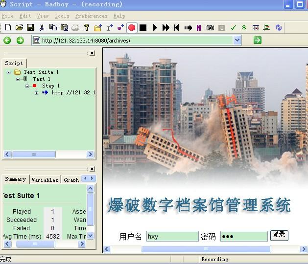

<!-- page: 25 -->

图3.2

第四步：运行Jmeter 脚本，得到生成报告。如图3.3

图3.3

作为一个纯JAVA 的GUI 应用，JMeter 对于CPU 和内存的消耗还是很惊人的，所以当需要

模拟数以千计的并发用户时，使用单台机器模拟所有的并发用户就有些力不从心，甚至还会引

起JAVA 内存溢出的错误。不过，JMeter 也可以像LoadRunner 一样通过使用多台机器运行所

谓的代理来分担负载产生器自身的压力，并借此来获取更大的并发用户数，我们只需手动配置

一下即可。

1、在所有期望运行JMeter 作为负载产生器的机器上安装JMeter，并确定其中一台

机器作为控制器，其他的机器作为代理。然后运行所有代理机器上的Jmeter –

server.bat 文件——假定我们使用两台机器172.20.80.47 和172.20.80.68 作为

代理；172.20.80.68 作为代理；

2、在Controller 机器的JMeter 安装目录下找到bin 目录，再找到

jmeter.properties 这个文件，使用记事本或者其他文字编辑工具打开它；

3、在打开的文件中查找“remote_hosts=”这个字符串，你可以找到这样一行

“remote_hosts=127.0.0.1”。其中的127.0..0.1 表示运行JMeter 代理的机器，这里

需要修改为“remote_hosts=172.20.80.47，172.20.80.68”；

4、保存文件，并重新启动控制器机器上的JMeter，并进入启动->远程启动菜单项。

就会看到我们刚才添加的两个代理的地址，选中即可运行，如果想同时启动所有代理，

选择远程全部启动即可。

要进行分布式测试代理机器上需要添加环境变量，即添加用户变量

第 25 页 共 29 页

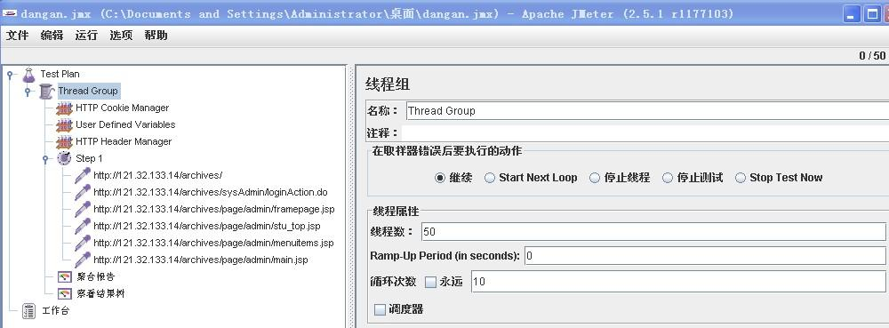

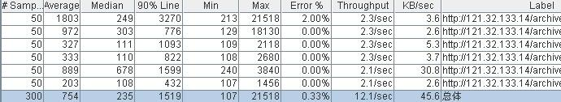

<!-- page: 26 -->

JMETER_HOME＝d:\jmeter，系统变量中的path 中添加d:\jmeter\bin（假设jmeter 放在

d 盘根目录下）。

8.4  测试结果及分析

8.4.1  首页测试结果及分析

分别测试100、500、1000 个线程，即模拟这些数目的用户并发。得到的结果如表5.1：
Label #

KB/se
c
HTTP
请求

Average Median
90%
Line

Min
Max
Error
%

Through
put

Samples

100
21774
22929
24837 13144 53887 0.00% 1.8/sec 79.2

HTTP
请求

500
47338
45359
83212 7821
12610
8
30.20
%

3.9/sec 119.6

HTTP
请求

1000
61246
46453
12777
4
20904 16280
0
39.60
%

6.1/sec 161.1

表5.1

分析：模拟500 个用户时的压力测试，tomcat 已经明显看到响应慢了，出错率大大提高，

模拟1000 个用户时的压力测试，平均响应时间为61s，90%的用户响应时间为127s，有

39.60%访问出现错误。

8.4.2  专家专栏测试结果及分析

Label #

KB/se
c
HTTP
请求

Average Median
90%
Line

Min
Max
Error
%

Through
put

Samples

500
15780
17289
21408 1531
69615 34.00
%

7.2/sec 88.6

HTTP
请求

1000
20355
21071
23629 652
20229
6
56.10
%

4.9/sec 43.2

表5.2

分析：模拟1000 个用户时，平均响应时间为20s，但是出现的无法响应的概率为56.10%。

8.4.3  档案馆测试测试结果及分析

Label #

KB/se
c
HTTP
请求

Average Median
90%
Line

Min
Max
Error
%

Through
put

Samples

100
7796
3734
20978 734
18959
1
1.00% 31.5/mi
n

8.3

第 26 页 共 29 页

<!-- page: 27 -->

HTTP
请求

499
19462
16974
31591 370
33357
5
8.62% 1．5/sec 22.2

表5.3

分析：模拟500 个用户时，平均响应时间为19s，但是出现的无法响应的概率为8.62%，

但是出现线程启动不了的情况了。

8.4.4  企业专栏测试结果及分析

当模拟50 个人同时发送请求时，得到的测试结果如图5.4 所示：

表5.4

用样条曲线可以看出服务器响应时间变化、离散程度测量值的大小，即数据的分布，如

图5.5 所示

图5.5

8.4.5  人员馆测试结果及分析

当模拟500 个人在500m 内发送10 条请求，即发送5000 条请求，得到的测试结果如

图5.6 所示：

第 27 页 共 29 页

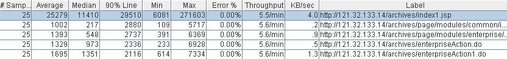

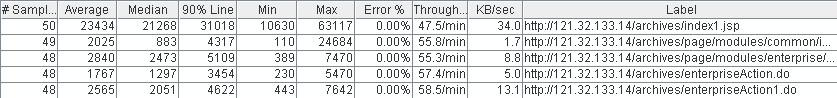

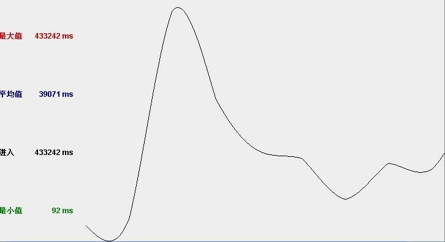

<!-- page: 28 -->

图5.6

其中绿色的线代表吞吐量，即服务器每分钟处理的请求数一直在增加。平均响应时

间是5.8s，其中的偏离表示服务器响应时间变化、离散程度测量值的大小，即数据的分

布。用样条曲线可以看出数据的分布，如图5.7 所示：

图5.7

一般情况下，进入首页比较耗时，进入各个分馆子模块进行查询、编辑等操作，会

快速得多。

第 28 页 共 29 页

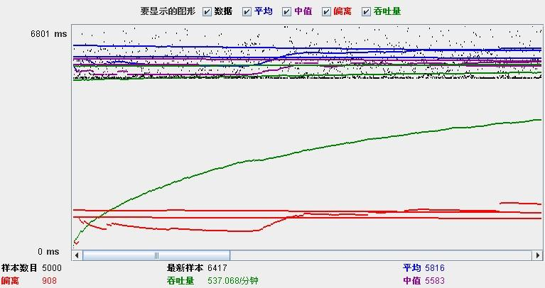

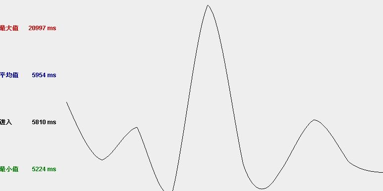

<!-- page: 29 -->

图5.8

由上表可以看出，当请求达到2534 时，会出现请求失败。

8.4.6  登录测试测试结果及分析

表5.9

一般情况下，当用户能够在2 秒以内得到响应时，会感觉系统的响应很快；当用户

在2-5 秒之间得到响应时，会感觉系统的响应速度还可以；当用户在5-10 秒以内得到响应

时，会感觉系统的响应速度很慢，但是还可以接受；而当用户在超过10 秒后仍然无法得到

响应时，会感觉系统糟透了，或者认为系统已经失去响应，而选择离开这个Web 站点，或者

发起第二次请求。

故该系统的用户登录系统时，50 人内并发访问的响应速度很快，100-500 人内并发

访问的响应速度都还可以，可当达到500 人时并发访问就很慢了。

（注：测试时一般第一次执行时的时间比较大，大多来自于jsp request,因为jsp

执行前需要被编译成.class 文件，所以第二次的结果才是正常的结果。）

第 29 页 共 29 页

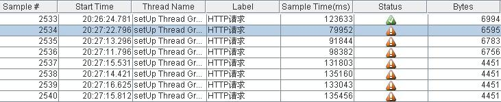

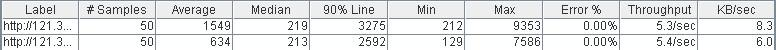

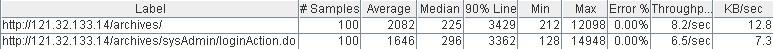

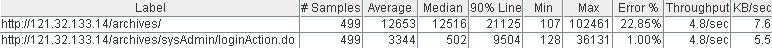
