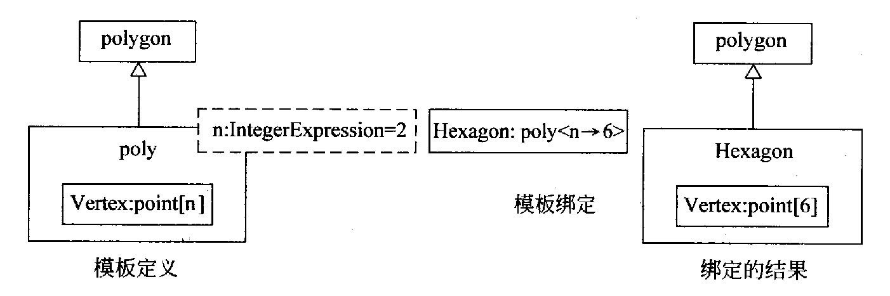
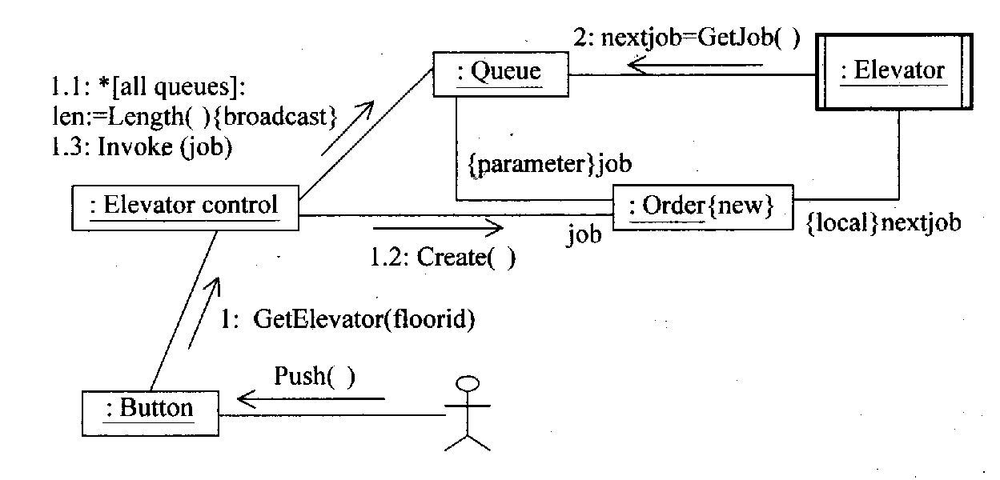

# 第07章 面向对象的分析和设计

<!-- slide: 1 -->

## 软件工程

- 第7章 面向对象的分析和设计

<!-- slide: 2 -->

## 内容摘要

- 复旦大学计算机科学与工程系     软件工程课程
- /237
- 面向对象的基本概念
- 面向对象的分析和设计过程
- UML概述
- 用况建模
- 静态建模
- 动态建模
- 物理体系结构建模

<!-- slide: 3 -->

## 内容摘要

- 复旦大学计算机科学与工程系     软件工程课程
- /237
- 面向对象的基本概念
- 面向对象的分析和设计过程
- UML概述
- 用况建模
- 静态建模
- 动态建模
- 物理体系结构建模

<!-- slide: 4 -->

## Peter Coad和Edward Yourdon提出用下列等式识认面向对象方法：
面向对象 = 对象（object）
         + 分类（classification）
         + 继承（inheritance）
         + 通过消息的通信（communication with messages）
可以说，采用这四个概念开发的软件系统是面向对象的

- 复旦大学计算机科学与工程系     软件工程课程
- /237

<!-- slide: 5 -->

## 面向对象方法的出现很快受到计算机软件界的青睐，并成为20世纪90年代的主流开发方法。我们可以从下列几个方面来分析其原因：
从认知学的角度来看，面向对象方法符合人们对客观世界的认识规律。
面向对象方法开发的软件系统易于维护，其体系结构易于理解、扩充和修改。
面向对象方法中的继承机制有力支持软件的复用。

- 复旦大学计算机科学与工程系     软件工程课程
- /237

<!-- slide: 6 -->

## 面向对象的基本概念

- 复旦大学计算机科学与工程系     软件工程课程
- /237
- 1.  对象（object）
- 对象是指一组属性以及这组属性上的专用操作的封装体。
- 属性（attribute）通常是一些数据，有时它也可以是另一个对象。每个对象都有它自己的属性值，表示该对象的状态。对象中的属性只能通过该对象所提供的操作来存取或修改。
- 操作（operation）（也称方法或服务）规定了对象的行为，表示对象所能提供的服务。

<!-- slide: 7 -->

## 封装（encapsulation）是一种信息隐蔽技术，用户只能看见对象封装界面上的信息，对象的内部实现对用户是隐蔽的。封装的目的是使对象的使用者和生产者分离，使对象的定义和实现分开。
   
一个对象通常可由对象名、属性和操作三部分组成。

- 复旦大学计算机科学与工程系     软件工程课程
- /237

<!-- slide: 8 -->

## 2. 类（class）
    类是一组具有相同属性和相同操作的对象的集合。一个类中的每个对象都是这个类的一个实例（instance）。 
    类是创建对象的模板，从同一个类实例化的每个对象都具有相同的结构和行为。

- 复旦大学计算机科学与工程系     软件工程课程
- /237

<!-- slide: 9 -->

- 复旦大学计算机科学与工程系     软件工程课程
- /237
- 轿  车
- 型号：字符串
- 颜色：字符串
- 牌照号：字符串
- ．．．．
- 张经理的轿车
- 型号=桑塔纳
- 颜色=红色
- 牌照号=沪AN2037
- ．．．．
- 类
- 实例对象

<!-- slide: 10 -->

## 3. 继承（inheritance）
    继承是类间的基本关系，它是基于层次关系的不同类共享数据和操作的一种机制。父类中定义了其所有子类的公共属性和操作，在子类中除了定义自己特有的属性和操作外，可以继承其父类（或祖先类）的属性和操作，还可以对父类（或祖先类）中的操作重新定义其实现方法。

- 复旦大学计算机科学与工程系     软件工程课程
- /237

<!-- slide: 11 -->

- 复旦大学计算机科学与工程系     软件工程课程
- /237
- 矩形
- 长
- 宽
- 对角线
- 计算面积
- 计算对角线
- 多边形
- 顶点数
- 顶点坐标
- 计算面积
- 旋转

<!-- slide: 12 -->

## 有时，我们定义一个类，它把一些类组织起来，提供一些公共的行为，但并不需要使用这个类的实例，而仅使用其子类的实例。我们把这种没有实例的类称为抽象类（abstract class）。在抽象类中可以定义抽象操作，抽象操作指：只定义这个类的操作接口，不定义它的实现，其实现部分由其子类定义。抽象操作操作名用斜体字表示，也可以在操作特征（signature）后面加上特征字符串{abstract}。

- 复旦大学计算机科学与工程系     软件工程课程
- /237

<!-- slide: 13 -->

- 复旦大学计算机科学与工程系     软件工程课程
- /237
- 交通工具
- 飞行器
- 汽 车
- 船
- 轿 车
- 货 车
- 一般-特殊关系

<!-- slide: 14 -->

## 如果一个子类只有唯一一个父类，这个继承称为单一继承。如果一个子类有一个以上的父类，这种继承称为多重继承。

- 复旦大学计算机科学与工程系     软件工程课程
- /237
- 水上交通工具
- 陆上交通工具
- 水陆两栖交通工具
- 多重继承

<!-- slide: 15 -->

## 4. 消息（message）
     消息传递是对象间通信的手段，一个对象通过向另一个对象发送消息来请求其服务。一个消息通常包括接收对象名、调用的操作名和适当的参数（如果有必要的话）。消息只告诉接收对象需要完成什么操作，但并不指示接收者怎样完成操作。消息完全由接收者解释，接收者独立决定采用什么方法完成所需的操作。

- 复旦大学计算机科学与工程系     软件工程课程
- /237

<!-- slide: 16 -->

## 5. 多态性（polymorphism）
     多态性是指同一个操作作用于不同的对象上可以有不同的解释，并产生不同的执行结果。例如“画”操作，作用在“矩形”对象上，则在屏幕上画一个矩形，作用在“圆”对象上，则在屏幕上画一个圆。也就是说，相同操作的消息发送给不同的对象时，每个对象将根据自己所属类中定义的这个操作去执行，从而产生不同的结果。

- 复旦大学计算机科学与工程系     软件工程课程
- /237

<!-- slide: 17 -->

## 6.  动态绑定（dynamic binding）
       动态绑定是指在程序运行时才将消息所请求的操作与实现该操作的方法连接起来。
        传统的程序设计语言的过程调用与目标代码的连接（即调用哪个过程）放在程序运行前（即编译时）进行（称为静态绑定），而动态绑定则是把这种连接推迟到运行时才进行。
        动态绑定是一种在运行时确定被执行代码的技术。

- 复旦大学计算机科学与工程系     软件工程课程
- /237

<!-- slide: 18 -->

## 在一般与特殊关系中，子类是父类的一个特例，所以父类对象可以出现的地方，也允许其子类对象出现。因此在运行过程中，当一个对象发送消息请求服务时，要根据接收对象的具体情况将请求的操作与实现的方法进行连接，即动态绑定。

- 复旦大学计算机科学与工程系     软件工程课程
- /237

<!-- slide: 19 -->

## if  条件  then  p := t ;
           else  p := r ;
area := p.getarea ;

- 复旦大学计算机科学与工程系     软件工程课程
- /237
- getArea {abstract}
- polygon
- area
- hexagon
- getArea
- rectangle
- getArea
- length
- width
- triangle
- getArea
- Var p : polygon ;
- Var t : triangle :=
- triangle.new ;
- Var r : rectangle :=
- rectangle.new ;

<!-- slide: 20 -->

## 内容摘要

- 复旦大学计算机科学与工程系     软件工程课程
- /237
- 面向对象的基本概念
- 面向对象的分析和设计过程
- UML概述
- 用况建模
- 静态建模
- 动态建模
- 物理体系结构建模

<!-- slide: 21 -->

## 面向对象分析Object-Oriented Analysis

- 复旦大学计算机科学与工程系     软件工程课程
- /237
- 面向对象分析的一般步骤如下：
- 获取客户对系统的需求：包括标识场景（scenario）和用况（use case，也称用例），以及建造需求模型
- 用基本的需求为指南，来选择类和对象（包括属性和操作）。
- 定义类的结构和层次。
- 建造对象—关系模型。
- 建造对象—行为模型。
- 利用用况/场景来复审分析模型。

<!-- slide: 22 -->

## 1.   获取客户对系统的需求
       需求获取必须让客户与开发者充分地交流，这里介绍一种采用用况来收集客户需求的技术。分析员首先标识使用该系统的不同的执行者（actor），这些执行者代表使用该系统的不同的角色。每个执行者可以叙述他如何使用系统，或者说他需要系统提供什么功能。执行者提出的每一个使用场景（或功能）都是系统的一个用况的实例，一个用况描述了系统的一种用法（或一个功能），所有执行者提出的所有用况构成系统的完整的需求。

- 复旦大学计算机科学与工程系     软件工程课程
- /237
- 分析过程

<!-- slide: 23 -->

## 注意，执行者与用户是不同的两个概念，一个用户可以扮演几个角色（执行者），一个执行者可以是用户，也可以是其他系统（应用程序或设备）。得到的用况必须进行复审，以使需求完整。

- 复旦大学计算机科学与工程系     软件工程课程
- /237

<!-- slide: 24 -->

## 2.   标识类和对象
    类和对象来自问题领域。
可以先标识候选类，然后进行筛选

- 复旦大学计算机科学与工程系     软件工程课程
- /237

<!-- slide: 25 -->

## 3.  定义类的结构和层次
        类的结构主要有两种：一般—特殊（generalization—specialization）结构和整体—部分（whole—part）结构。
        一般—特殊结构是一种分类结构，反映了类间的一般与特殊的关系。一般类与特殊类之间是一种“is a”的关系，如：汽车是一种交通工具。同样，特殊类还可以分为更特殊的类，这样可形成类的层次结构。
        整体—部分结构反映了类间的整体与部分关系。值得注意的是，整体—部分关系是对对象而言的，而不是对类的。整体—部分关系是一种“has a ”的关系，如“汽车”有“发动机”。同样，整体—部分结构也具有层次结构。

- 复旦大学计算机科学与工程系     软件工程课程
- /237

<!-- slide: 26 -->

## 有的面向对象方法中，把互相协作以完成一组紧密结合在一起的责任的类的集合定义为主题(subject)或子系统（subsystem）。主题和子系统都是一种抽象，从外界观察系统时，主题或子系统可看作黑盒，它有自己的一组责任和协作者，观察者不必关心其细节。观察一个主题或子系统的内部时，观察者可以把注意力集中在系统的某一个方面。因此，主题或子系统实际上是系统更高抽象层次上的一种描述。

- 复旦大学计算机科学与工程系     软件工程课程
- /237

<!-- slide: 27 -->

## 4.   建造对象——关系模型
       对象--关系模型描述了系统的静态结构，它指出了类间的关系（relationship）。
      类之间的关系有关联、依赖、泛化、实现等。

- 复旦大学计算机科学与工程系     软件工程课程
- /237

<!-- slide: 28 -->

## 5.   建立对象——行为模型
    对象--行为模型描述了系统的动态行为，它们指明系统如何响应外部的事件或激励（stimulus）。
    建模的步骤如下：
评估所有的用况，以完全理解系统中交互的序列。
标识驱动交互序列的事件，理解这些事件如何和特定的对象相关联。
为每个用况创建事件轨迹（event trace）。
为系统建造状态机图。
复审对象--行为模型，以验证准确性和一致性。

- 复旦大学计算机科学与工程系     软件工程课程
- /237

<!-- slide: 29 -->

## 面向对象设计（Object_Oriented Design）

- 复旦大学计算机科学与工程系     软件工程课程
- /237
- 面向对象设计的一般步骤如下：
- 系统设计
  - 将子系统分配到处理器
  - 选择实现数据管理、界面支持和任务管理的设计策略
  - 为系统设计合适的控制机制
  - 复审并考虑权衡（折衷）

<!-- slide: 30 -->

## 对象设计
在过程级别（procedural lavel）设计每个操作，即设计每个操作的实现细节
定义内部类
为类属性设计内部数据结构
消息设计
     使用对象间的协作和对象--关系模型，设计消息模型
复审
     复审设计模型并在需要时迭代。

- 复旦大学计算机科学与工程系     软件工程课程
- /237

<!-- slide: 31 -->

## 1.  系统设计
1)   将分析模型划分成子系统
     在OO系统设计中，我们把分析模型中紧密相关的类、关系等设计元素包装成子系统。
     通常，子系统的所有元素共享某些公共的性质，它们可能都涉及完成相同的功能；它们可能驻留在相同的产品硬件中；或者它们可能管理相同的类和资源。子系统由它们的责任所刻画，即，一个子系统可以通过它提供的服务来标识。在OOD中，这种服务是完成特定功能的一组操作。

- 复旦大学计算机科学与工程系     软件工程课程
- /237

<!-- slide: 32 -->

## 子系统的设计准则是：
(1) 子系统应具有定义良好的接口，通过接口和系统的其它部分通信；
(2) 除了少数的“通信类” 外，子系统中的类应只和该子系统中的其它类协作；
(3)  子系统的数量不宜太多；
(4) 可以在子系统内部再次划分，以降低复杂性。

- 复旦大学计算机科学与工程系     软件工程课程
- /237

<!-- slide: 33 -->

## 2) 标识问题本身的并发性，并为子系统分配处理器
      通过对对象--行为模型的分析，可发现系统的并发性。如果对象（或子系统）不是同时活动的，则它们不需并发处理，此时这些对象（或子系统）可以在同一个处理器上实现。反之，如果对象（或子系统）必须对一些事件同时异步地动作，则它们被视为并发的，此时，可以将并发的子系统分别分配到不同的处理器，或者分配在同一个处理器，而由操作系统提供并发支持。

- 复旦大学计算机科学与工程系     软件工程课程
- /237

<!-- slide: 34 -->

## 3)  任务管理设计
Coad和Yourdon提出如下管理并发任务对象的设计策略：
(1) 确定任务的类型；
(2) 必要时，定义协调者任务和关联的对象；
(3) 将协调者任务和其它任务集成。
     通常可通过了解任务是如何被启动的来确定任务的类型，如事件驱动任务，时钟驱动任务。每个任务应该定义其优先级，并识别关键任务。当有多个任务时还可以考虑增加一个协调者任务，以控制这些任务协同工作。

- 复旦大学计算机科学与工程系     软件工程课程
- /237

<!-- slide: 35 -->

## 4)  数据管理设计
     通常数据管理设计成层次模式，其目的是将数据的物理存储及操纵与系统的业务逻辑加以分离。
     数据管理的设计包括设计系统中各种数据对象的存储方式（如内部数据结构、文件、数据库），以及设计相应的服务，即为要储存的对象增加所需的属性和操作。

- 复旦大学计算机科学与工程系     软件工程课程
- /237

<!-- slide: 36 -->

## 5)  资源管理设计
    OO系统可利用一系列不同的资源（如磁盘驱动器、处理器、通信线路等外部实体或数据库、对象等抽象资源），很多情况下，子系统同时竞争这些资源，因此要设计一套控制机制和安全机制，以控制对资源的访问，避免对资源使用的冲突。
 6）人机界面设计
    对大多数应用系统而言，人机界面本身是一个非常重要的子系统。人机界面主要强调人如何命令系统，以及系统如何向人提交信息。它包括窗口、菜单、报告的设计。

- 复旦大学计算机科学与工程系     软件工程课程
- /237

<!-- slide: 37 -->

## 7)  子系统间的通信
        子系统之间可以通过建立客户/服务器连接进行通信，也可以通过端对端（peer to peer）连接进行通信。我们必须确定子系统间通信的合约（contract），合约提供了一个子系统和另一个子系统交互的方式。

- 复旦大学计算机科学与工程系     软件工程课程
- /237

<!-- slide: 38 -->

## 2.   对象设计
        对象设计是为每个类的属性和操作作出详细的设计，并设计连接类与它的协作者之间的消息规约。
1)   对象描述
        对象的设计描述可以采取以下形式之一：
（1） 协议描述：描述对象的接口，即定义对象可以接收的消息以及当对象接收到消息后完成的相关操作；
（2） 实现描述：描述传送给对象的消息所蕴含的每个操作的实现细节，实现细节包括有关对象私有部分的信息，即关于描述对象属性的数据结构的内部细节和描述操作的过程细节。
      对对象的使用者来说，只需要协议描述就够了。

- 复旦大学计算机科学与工程系     软件工程课程
- /237

<!-- slide: 39 -->

## 2）设计算法和数据结构
      为对象中的属性和操作设计数据结构和实现算法。 

3.  设计模式（design patterns）
        在许多面向对象系统中，存在一些类和通信对象的重复出现的模式。这些模式求解特定的设计问题，使面向对象设计更灵活，并最终可复用。这些模式帮助设计者复用以前成功的设计，设计者可以把这些模式应用到新的设计中。

- 复旦大学计算机科学与工程系     软件工程课程
- /237

<!-- slide: 40 -->

## 一个设计模式通常可用四个信息来描述：
1）模式名
     设计模式名应具有实际的含义，它能反映模式的适用性和意图。
2）使模式可被应用所必须存在的环境和条件。
3）设计模式的特征
      模式特征指出一些设计的属性，调整这些属性使该模式能适应各种不同的问题。这些属性表示设计的特征，这些特征能被用于检索（通过数据库）以找到合适的模式。
4）应用设计模式的结果（consequences）
      对于一个设计模式的使用结果表明设计决策的走向。

- 复旦大学计算机科学与工程系     软件工程课程
- /237

<!-- slide: 41 -->

## 典型的面向对象方法

- 复旦大学计算机科学与工程系     软件工程课程
- /237
- Coad & Yourdon 方法
- OMT方法
- Booch方法
- OOSE方法

<!-- slide: 42 -->

## 内容摘要

- 复旦大学计算机科学与工程系     软件工程课程
- /237
- 面向对象的基本概念
- 面向对象的分析和设计过程
- UML概述
- 用况建模
- 静态建模
- 动态建模
- 物理体系结构建模

<!-- slide: 43 -->

## 统一建模语言UML

- 复旦大学计算机科学与工程系     软件工程课程
- /237
- Unified Modeling Language

<!-- slide: 44 -->

## UML概述

- 复旦大学计算机科学与工程系     软件工程课程
- /237
- 为何研究UML—结束方法大战
- 发展历史
- 1994年Booch和Rumbaugh在Rational Software Corporation开始了UML的工作，其目标是创建一个“统一的方法”，
- 1995年OOSE的创始人Jacobson加盟到这项工作中，工作重点转移到创建一种统一的建模语言UML
- 1996年6月、10月、1997年1月、11月分别推出了UML0.9、 UML0.91、 UML1.0、 UML1.1

<!-- slide: 45 -->

## UML概述

- 复旦大学计算机科学与工程系     软件工程课程
- /237
- 1997年11月，OMG(Object Management Group)批准把UML1.1作为基于面向对象技术的标准建模语言
- 之后，UML进行了持续的修订和改进，先后产生了UML1.2、1.3、1.4、1.5版本
- 2004年推出了UML2.0，UML2.0对UML1.x作了重大的修改。

<!-- slide: 46 -->

## 模型元素
  模型元素指模型中的实体以及实体间相互连接的关系

- 复旦大学计算机科学与工程系     软件工程课程
- /237
- 部分模型元素
- 注解
- 类
- 属性
- 操作
- 对象：类
- 属性
- 操作
- 状态
- 用况
- 结点
- 供应接口
- 包
- 依赖
- 关联
- 泛化
- 主动类
- 属性
- 操作
- 请求接口
- 构件
- 实现

<!-- slide: 47 -->

## 视图与图

- 复旦大学计算机科学与工程系     软件工程课程
- /237

| 主题域 | 视图 （view） | 图（diagram） |
|---|---|---|
| 结构化 | 静态视图 | 类图（class） |
|  | 设计视图 | 内部结构（internal structure） |
|  |  | 协作图（collaboration） |
|  |  | 构件图（component） |
|  | 用况视图 | 用况图（use case） |
| 动态的 | 状态机视图 | 状态机图（state machine） |
|  | 活动视图 | 活动图（activity） |
|  | 交互视图 | 顺序图（sequence） |
|  |  | 通信图（communication） |
| 物理的 | 部署视图 | 部署图（deployment） |
| 模型管理 | 模型管理视图 | 包图（package） |

<!-- slide: 48 -->

## 静态视图
静态视图对应用领域中的概念以及与系统实现有关的内部概念建模，主要由类以及类之间的相互关系组成，在静态视图中不描述依赖于时间的系统行为。静态视图用类图来展示。
设计视图
设计视图对应用自身的设计结构建模，例如，将设计结构扩展成：结构化类元，为实现功能所需的协作和良定义接口的构件的组装。设计视图由内部结构图、协作图和构件图实现。

- 复旦大学计算机科学与工程系     软件工程课程
- /237

<!-- slide: 49 -->

## 用况视图
用况视图对被称为执行者的外部代理（他与特定视点的主题交互）所感受到的主题（如系统）功能建模。用况视图的意图是列出系统中的用况和执行者，并显示哪个执行者参与了哪个用况的执行。用况的行为用动态视图，特别是交互视图来表示。用况视图用用况图来展示。

- 复旦大学计算机科学与工程系     软件工程课程
- /237

<!-- slide: 50 -->

## 状态机视图
状态机视图对一个类的对象的可能生命历程建模。一个状态机包括用迁移连接的状态，每个状态对一个对象在其生命期中满足某种条件的一个时间段建模。当一个事件发生时，它会导致触发对象的一个状态向另一个新状态的迁移，附加在迁移上的动作或活动也同时被执行。状态机视图用状态机图来展示。

- 复旦大学计算机科学与工程系     软件工程课程
- /237

<!-- slide: 51 -->

## 活动视图
活动展示了包含在执行计算或工作流中的计算活动的控制流。一个动作是一个基本的计算步，一个活动结点是一组动作或子活动，一个活动可描述顺序的和并发的计算。活动视图用活动图来展示。
交互视图
交互视图描述系统各部分中消息交换的顺序。交互视图提供了系统中行为的整体视图，也就是说，它展示了多个对象间交叉的控制流。交互视图用顺序图和通信图来展示。

- 复旦大学计算机科学与工程系     软件工程课程
- /237

<!-- slide: 52 -->

## 部署视图
部署视图描述了运行时结点上制品的分布。制品是一个物理实现单元，如一个文件，它也可以表示一或多个构件的实现（一种表现形式）。结点是运行时表示计算资源的物理对象，如，计算机、设备或内存。部署视图允许对分配的结果和资源分配进行评估。部署视图用部署图来展示。

- 复旦大学计算机科学与工程系     软件工程课程
- /237

<!-- slide: 53 -->

## 模型管理视图
模型管理视图对模型自身的组织建模。一个模型由一组保存模型元素（如类、状态机、用况）的包组成。包还可以包含其它的包，因此，一个模型从一个间接包含所有模型内容的根包（root package）开始。包是操纵模型内容的单元，还是访问控制和配置控制的单元。每个模型元素可以被一个包或另一个元素拥有。模型管理信息通常展示在包图中，它是类图的变种。

- 复旦大学计算机科学与工程系     软件工程课程
- /237

<!-- slide: 54 -->

## 剖面（profile）
UML是用一个元模型（metamodel）定义的，元模型是指描述建模语言自身的模型。通常元模型的改变是复杂的，也是危险的。剖面机制允许在不修改基础元模型的前提下对UML作有限的变化。UML包含三个主要的可扩展结构：约束（constraints）、版型（stereotypes）和标签值（tagged values）。
约束是以自然语言或特定形式语言的正文表示的语义条件或限制，约束写在花括号中（｛｝），如｛value≥0｝，｛or｝。版型是在基于现有各类模型元素的外形中定义模型元素的新类型，它本质上是一种新元类（metaclass）。版型可以扩展语义，但不能扩展原元模型类的结构。用《　》标记版型，如《signal》。标签值是贴在任何模型元素上的被命名的信息片。下图给出了版型和标签值的应用实例。

- 复旦大学计算机科学与工程系     软件工程课程
- /237

<!-- slide: 55 -->

- 复旦大学计算机科学与工程系     软件工程课程
- /237
- 版型和标签值
- 《authorship》
- Scheduling
- tagged values
- 《authorship》
- author=“Frank Martin”
- due=Dec.31,2009

<!-- slide: 56 -->

## 类图
    类图展示了系统中类的静态结构，即类与类之间的相互联系。类之间有多种联系方式，如关联（相互连接）、依赖（一个类依赖或使用另一个类）、泛化（一个类是另一个类的特殊情况）等。可以把若干个相关的类包装在一起作为一个单元（包）,相当于一个子系统。一个系统可以有多张类图，一个类也可以出现在几张类图中。
  对象图
  对象图是类图的实例，它展示了系统执行在某一时间点上的一个可能的快照。对象图使用与类图相同的符号，只是在对象名下面加上下划线，同时它还显示了对象间的所有实例链接（link）关系。

- 复旦大学计算机科学与工程系     软件工程课程
- /237

<!-- slide: 57 -->

## 内部结构图
内部结构图展示了类的分解，给出了组成一个结构化类元的相互连接的部分、端口和连接器。

- 复旦大学计算机科学与工程系     软件工程课程
- /237
- 手册：演出手册
- 数据库：演出数据库
- 售票员：售票员
- 售票处
- 售票
- 内部结构图

<!-- slide: 58 -->

## 协作图
协作图展示了协作的定义，是一种合成的结构图。协作是为了完成某一目的而一起工作的一组对象间的上下文关系。

- 复旦大学计算机科学与工程系     软件工程课程
- /237
- 剧院售票
- * 　1
- 售票亭：售票亭［＊］
- ：售票处
- 1　  *
- 终端：售票终端［＊］
- 协作图

<!-- slide: 59 -->

## 构件图
构件图展示了系统中的构件（即来自应用的软件单元），构件间通过接口的连接，以及构件之间的依赖关系。构件是一种结构化类元，可以用内部结构图来定义它的内部结构。

- 复旦大学计算机科学与工程系     软件工程课程
- /237

<!-- slide: 60 -->

## 用况图
用况图展示了各类外部执行者与系统所提供的用况之间的连接。一个用况是系统所提供的一个功能（也可以说是系统提供的某一特定用法）的描述，执行者是指那些可能使用这些用况的人或外部系统，执行者与用况的连接表示该执行者使用了那个用况。用况图给出了用户所感受到的系统行为，但不描述系统如何实现该功能。用况通常用普通正文描述，也可以用活动图来描述。

- 复旦大学计算机科学与工程系     软件工程课程
- /237

<!-- slide: 61 -->

## 状态机图
状态机图通常是对类描述的补充，它说明该类的对象所有可能的状态以及哪些事件将导致状态的改变。一个事件可以是另一个对象向它发送的一条消息，或者是满足了某些条件。状态的改变称为迁移（transition）。一个状态迁移还可以有与之相关的动作，该动作指出状态迁移时应做什么。
并不是所有的类都要画状态机图，有些类有一些意义明确的状态，并且其行为受不同的状态所影响和改变，这些类才需要画状态机图。

- 复旦大学计算机科学与工程系     软件工程课程
- /237

<!-- slide: 62 -->

## 活动图
活动图展示了连续的活动流。活动图通常用来描述完成一个操作所需要的活动。当然它还能用于描述其它活动流，如描述用况。活动图由动作状态组成，它包含完成一个动作的活动的规约(即规格说明)。当一个动作完成时，将离开该动作状态。活动图中的动作部分还可包括消息发送和接收的规约。

- 复旦大学计算机科学与工程系     软件工程课程
- /237

<!-- slide: 63 -->

## 顺序图
顺序图展示了几个对象之间的动态交互关系。它主要是用来显示对象之间发送消息的顺序，它还显示了对象之间的交互，即系统执行的某一特定点所发生的事。 
通信图
通信图用几何排列来表示交互作用中的角色，它显示了有协作关系的复合结构组成部分或角色范围内的交互。它明确地显示元素之间的协作关系，而不显示作为独立维的时间，消息的顺序和并发线程必须由顺序号确定。

- 复旦大学计算机科学与工程系     软件工程课程
- /237

<!-- slide: 64 -->

## 部署图
部署图展示了运行时处理结点和在结点上生存的制品的配置。结点是运行时的计算资源，制品是物理实体，如构件、文件。
部署图中显示部署在结点上的制品和它们之间的关系，以及结点之间的连接和通信方式。

- 复旦大学计算机科学与工程系     软件工程课程
- /237

<!-- slide: 65 -->

## 包图
包图是由包和它们间的关系组成的结构图
模型是在某一视点给定的精度上对系统的完整描述，一个系统可以从不同的视点（如分析模型、设计模型）存在多个模型。一个模型可看作一个特定类型的包，通常仅显示包就足够了（不必显示包内部的细节）。
下图给出了剧院系统所细分成的包以及它们之间的依赖关系。

- 复旦大学计算机科学与工程系     软件工程课程
- /237

<!-- slide: 66 -->

- 复旦大学计算机科学与工程系     软件工程课程
- /237
- 售票处
- 计划
- 广告
- 时间表
- 客户记录
- 票记录
- 运作
- 售票
- 工资单
- 计算
- 购买
- 包图

<!-- slide: 67 -->

## 内容摘要

- 复旦大学计算机科学与工程系     软件工程课程
- /237
- 面向对象的基本概念
- 面向对象的分析和设计过程
- UML概述
- 用况建模
- 静态建模
- 动态建模
- 物理体系结构建模

<!-- slide: 68 -->

## 用况建模

- 复旦大学计算机科学与工程系     软件工程课程
- /237
- 用况建模是用于描述一个系统应该做什么的建模技术，用况建模不仅用于新系统的需求获取，还可用于已有系统的升级。用况模型用用况图来描述。
- 用况图展示了各类外部执行者与系统所提供的用况之间的连接。一个用况是系统所提供的一个功能（也可以说是系统提供的某一特定用法）的描述，执行者是指那些可能使用这些用况的人或外部系统，执行者与用况的连接表示该执行者使用了那个用况。用况图给出了用户所感受到的系统行为，但不描述系统如何实现该功能。
- 用况通常用普通正文描述，也可以用活动图来描述。

<!-- slide: 69 -->

## 任何一个涉及到系统功能活动的人都会用到用况模型。
 客户：用况模型指明了系统的功能，描述了系统能如何使用。用况建模时客户的积极参与是十分重要的。
 开发者：用况模型帮助他们理解系统要做什么，同时为以后的其它模型建模、结构设计、实现等提供依据。
 集成测试和系统测试人员：根据用况来测试系统，以验证系统是否完成了用况指定的功能。

- 复旦大学计算机科学与工程系     软件工程课程
- /237

<!-- slide: 70 -->

## 用况建模步骤

- 复旦大学计算机科学与工程系     软件工程课程
- /237
- 创建用况模型的步骤包括：
- 1．定义系统
- 2．确定执行者
- 3．确定用况
- 4．描述用况
- 5．定义用况间的关系，
- 6．确认模型

<!-- slide: 71 -->

## 用况模型由用况图组成，用况图展示了执行者、用况以及它们之间的关系。用况通常用正文形式来描述。
一个用况模型可由若干幅用况图组成。一幅用况图包含的模型元素有系统、执行者、用况，以及表示它们间的不同关系，如关联、扩展、包含、泛化等。

- 复旦大学计算机科学与工程系     软件工程课程
- /237

<!-- slide: 72 -->

## 用况图

- 复旦大学计算机科学与工程系     软件工程课程
- /237
- 电话订购系统用况图
- Telephone  Catalog
- Customer
- Salespersonn
- Shipping Clerk
- supervisor
- establish
- credit
- Fill order
- Arrange
- Payment
- Supply
- Customer
- Data
- order
- product
- Arrange
- Credit
- Pay
- cash
- place
- order
- Request
- Catalog
- 《include》
- 《include》
- 《include》
- 《extend》
- check
- status

<!-- slide: 73 -->

## 一.  确定执行者
执行者是指与系统交互的人或其它系统
执行者代表一种角色，而不是具体的某个人 
执行者可分成主执行者和副执行者：
主执行者使用系统的主要功能
    例如，保险系统中主执行者处理保险的注册和管理
 副执行者处理系统的辅助功能
    例如，管理数据库、通信、备份以及其它管理等系统维护

- 复旦大学计算机科学与工程系     软件工程课程
- /237

<!-- slide: 74 -->

## 执行者还可分为主动执行者和被动执行者：
主动执行者开始一个用况
被动执行者从不开始用况，只是参与一个或多个用况

- 复旦大学计算机科学与工程系     软件工程课程
- /237

<!-- slide: 75 -->

## 我们可以通过回答下列问题来确定执行者：
谁使用系统的主要功能（主执行者）？
谁需要从系统中得到对他们日常工作的支持？
谁需要维护、管理和维持系统的日常运行（副执行者）？
系统需要控制哪些硬件设备？
系统需要与哪些其它系统交互？
哪些人或哪些系统对系统产生的结果（值）感兴趣？

- 复旦大学计算机科学与工程系     软件工程课程
- /237

<!-- slide: 76 -->

## 确定用况
1.   用况的特征
用况总是被执行者启动的（initiated），执行者必须直接或间接地指示系统去执行用况
用况向执行者提供值，这些值必须是可识别的
用况是完整的，一个用况必须是一个完整的描述

    用况是一个类，而不是实例，用况的实例称为场景（scenario）

- 复旦大学计算机科学与工程系     软件工程课程
- /237

<!-- slide: 77 -->

## 2.  寻找用况
可以通过让每个执行者回答以下问题来寻找用况：
执行者需要系统提供哪些功能？执行者需要做什么？
执行者是否需要读、创建、删除、修改或储存系统中的某类信息？
执行者是否要被系统中的事件提醒，或者执行者是否要提醒系统中某些事情？从功能观点看，这些事件表示什么？
执行者的日常工作是否因为系统的新功能（尤其是目前尚未自动化的功能）而被简化或提高了效率？

- 复旦大学计算机科学与工程系     软件工程课程
- /237

<!-- slide: 78 -->

## 另外还有一些不是目前的执行者回答的问题：
系统需要哪些输入/输出？谁从系统获取信息？谁为系统提供信息？
与当前系统（可能是人工系统而不是自动化系统）的实现有关的主要问题是什么？ 
    对同一个项目，不同的开发者选取的用况数是不一样的。例如一个10个人年规模的项目，有人选取了20个用况，而在一个类似的项目中，有人选用了100个用况。
    似乎20个太少，而100个太多，希望在项目规模和用况数之间保持均衡。

- 复旦大学计算机科学与工程系     软件工程课程
- /237

<!-- slide: 79 -->

## 3.  用况的描述
    用况通常用正文（text）来描述,也可用活动图来描述 。
    用况的正文描述应包括以下内容：
用况的目的：用况的最终目的是什么？它试图达到什么？
用况是如何启动（initiate）的：哪个执行者在什么情况下启动用况的执行？
执行者和用况之间的消息流：用况与执行者之间交换什么消息或事件来通知对方改变或恢复信息？描述系统与执行者之间的主消息流是什么？以及系统中哪些实体被使用或修改？

- 复旦大学计算机科学与工程系     软件工程课程
- /237

<!-- slide: 80 -->

## 用况中可供选择的流：用况中的活动可根据条件或异常（exception）有选择地执行。
如何通过给执行者一个值来结束用况：描述何时可认为用况已结束.

- 复旦大学计算机科学与工程系     软件工程课程
- /237

<!-- slide: 81 -->

## 执行者的简要描述
   如客户：向公司订购商品的人
       客户代表：公司处理客户请求的雇员
       库存系统：记录公司库存的软件
用况的简要描述
  如订购货物：客户创建一个新的请求商品的订单，并为那些商品付费
       取消订单：客户取消一个已经存在的订单

- 复旦大学计算机科学与工程系     软件工程课程
- /237

<!-- slide: 82 -->

## 用况的详细描述
前置条件和后置条件
前置条件和后置条件表示用况开始和结束的条件
事件流（flow of events）
事件流是一系列陈述句，它是从执行者的角度看，列出用况的各个步骤
用况描述中可以包含条件、分支和循环。
例如：订购货物用况的描述如下

- 复旦大学计算机科学与工程系     软件工程课程
- /237

<!-- slide: 83 -->

## 用况名称：订购货物
参与的执行者：客户、客户代表
前置条件：一个合法的客户已经登录到这个系统
事件流：
当客户选择订购货物时，用况开始
客户输入他的姓名和地址
如果客户只输入邮编，系统将给出州和城市名
当客户输入产品代码
	a. 系统给出产品描述和价格
	b. 系统往客户订单中添加该物品的价格
    循环结束
5. 客户输入信用卡支付信息

- 复旦大学计算机科学与工程系     软件工程课程
- /237

<!-- slide: 84 -->

## 6. 客户选择提交
7. 系统检验输入的信息，把该订单作为未完成的交易保存，同时向记账系统转发支付信息。如果客户提交的信息不正确，系统将提示客户修改。
8. 当支付确认后，订单就被标记上已经确认，同时返回给客户一个订单ID，用况也就结束了。如果支付没有被确认，系统将提示客户改正支付信息或者取消。如果客户选择修改信息，就回到第5步；如果选择取消，用况结束。
后置条件：如果订单没有被取消，它将保存在系统中，并做上标记

- 复旦大学计算机科学与工程系     软件工程课程
- /237

<!-- slide: 85 -->

## 其他需求
在用况中还可描述一些特殊的需求，这些需求常常是非功能性需求，如可用性、安全性、可维护性、负载、性能、自动防故障、数据需求等。
如订购货物用况的其他需求：
前置条件：（略）
事件流： （略）
特殊需求：
        系统必须在一秒内响应客户的输入
后置条件： （略）

- 复旦大学计算机科学与工程系     软件工程课程
- /237

<!-- slide: 86 -->

## 事件流可分为两部分：
基本路径
    基本路径是运转正常时的路径，是一系列没有分支和选择的简单陈述句
可选路径
    可选路径是指不同于基本路径而允许不同的事件序列的路径。
    对于明显有可能随时发生的事情来说，可选路径非常有效。

- 复旦大学计算机科学与工程系     软件工程课程
- /237

<!-- slide: 87 -->

## 如订购货物用况的基本路径：
事件流：
基本路径
当客户选择订购货物时，用况开始
客户输入他的姓名和地址
当客户输入产品代码时
	a. 系统给出产品描述和价格
	b. 系统往客户订单中添加该物品的价格
    循环结束
4. 客户输入信用卡支付信息
5. 客户选择提交
6. 系统检验输入的信息，把该订单作为未完成的交易保存，同时向记账系统转发支付信息
7. 当支付确认后，订单就被标记上已经确认，同时返回给客户一个订单ID，用况结束

- 复旦大学计算机科学与工程系     软件工程课程
- /237

<!-- slide: 88 -->

## 如果在订购货物用况中，客户可以在提交订单前随时取消订单，其可选路径如下：
可选路径：
在选择提交前的任何时候，客户都可以选择cancel。这次订购没有被保存，用况结束。
在基本路径第6步，如果有任何不正确的信息，系统提示客户去修改这些信息。
在基本路径第7步，如果支付没有被确认，系统将提示客户改正支付信息或者取消。如果客户选择修改信息，就回到基本路径第4步；如果选择取消，用况结束。

- 复旦大学计算机科学与工程系     软件工程课程
- /237

<!-- slide: 89 -->

## 确定用况之间的关系

- 复旦大学计算机科学与工程系     软件工程课程
- /237

| 关系 | 说明 | 记号 |
|---|---|---|
| 关联 | 执行者与他所参与的一个用况之间的通信路径 |  |
| 扩展 | 扩展的用况到基本用况的一种关系，它指出扩展的用况所定义的行为如何插入到基本用况所定义的行为中。扩展的用况通过模块化方式增量地修改基本用况 |  |

- 《extend》

<!-- slide: 90 -->

- 复旦大学计算机科学与工程系     软件工程课程
- /237

| 关系 | 说明 | 记号 |
|---|---|---|
| 包含 | 从基本用况到另一个用况（称为包含用况，inclusion use case）的一种关系，它指出包含用况定义的行为被包含在基本用况所定义的行为中。基本用况能看到包含用况，并依赖于执行包含用况后的结果，但两者相互间不能访问其它属性 |  |
| 用况泛化 | 一个一般用况与一个更特殊的用况之间的关系，特殊用况可继承一般用况的特征 |  |

- 《include》

<!-- slide: 91 -->

## 实例

- 复旦大学计算机科学与工程系     软件工程课程
- /237
- 本实例实现一个简化了的银行储蓄账户管理系统，该系统是在银行的柜台上对客户办理活期储蓄业务。系统的需求陈述如下：
- 一个客户可以在多个银行中开设账户，一个客户也可在同一银行中开设多个不同的账户。客户可以通过银行职员进行开户、存款、取款、转账、注销账户等活动。其中转账指客户将自己的某个账户上的钱款转入同一银行的不同账户（称为银行内转账）或转入不同银行的账户（称为银行间转账）。系统管理员负责系统的账户管理及业务报表的生成。

<!-- slide: 92 -->

## 识别执行者
客户：到银行办理储蓄业务的人，负责输入密码
银行职员（客户代理）：银行工作人员，代表客户进行储蓄业务的操作
银行职员（管理人员）：银行工作人员，根据客户的储蓄业务更新账户
管理员：银行计算机的管理人员，负责账户的管理和业务报表的生成

- 复旦大学计算机科学与工程系     软件工程课程
- /237

<!-- slide: 93 -->

## 识别用况
从系统的需求陈述可知，银行职员（客户代理）需要系统提供开户、存款、取款、转账、注销账户等功能，这些功能都包含了校验密码的功能。系统管理员需要系统提供账户管理和报表生成功能。银行职员（管理人员）则参与了账户管理中的更新账户的功能。此外，转账功能可分为银行内转账和银行间转账，我们可将它们设计成三个用况，其中银行内转账用况和银行间转账用况都继承了基本转账用况。据此分析，得到该系统的用况图如下图所示。

- 复旦大学计算机科学与工程系     软件工程课程
- /237

<!-- slide: 94 -->

- 复旦大学计算机科学与工程系     软件工程课程
- /237
- 银行储蓄账户管理系统
- 《包含》
- 《包含》
- 《包含》
- 银行职员
- （用户代理）
- 账户管理
- 银行间转账
- 开户
- 取款
- 银行内转账
- 注销
- 存款
- 校验密码
- 转账
- 报表生成
- 其它银行
- 账户管理系统
- 客户
- 系统管理员
- 银行职员
- （管理人员）

<!-- slide: 95 -->

## 开户用况描述
用况名称：开户
参与的执行者：银行职员（客户代理），客户
前置条件：一个合法的银行职员（客户代理）已登录到该系统
事件流：
1.当选择开户功能时用况开始
2.输入客户信息（姓名、地址、身份证号等）
3.从账户管理系统获取新的账号
4.请客户输入密码
5.请客户再次输入密码
6.如果两次密码不一致则回到第4步，否则继续
7.在账户库中添加新账户
8.打印存折，用况结束
后置条件：在账户库中增加了一个新账户，得到一张新存折

- 复旦大学计算机科学与工程系     软件工程课程
- /237

<!-- slide: 96 -->

## 取款用况描述
用况名称：取款
参与的执行者：银行职员（客户代理）
前置条件：一个合法的银行职员（客户代理）已登录到该系统
事件流：
基本路径：
1.当选择取款功能时用况开始
2.当输入客户信息（姓名、账号等）后
  a）如果客户信息与账户不一致，显示错误信息，可以重新输入或结束用况
  b）如果该账户被冻结（如因挂失而冻结），显示冻结信息并结束用况
3.输入并校验密码

- 复旦大学计算机科学与工程系     软件工程课程
- /237

<!-- slide: 97 -->

## 4.输入取款金额，如果该账户的余款小于取款金额，显示错误信息，要求重新输入
5.打印取款单，交客户签字
6.建立取款事件记录，更新账户信息
7. 打印存折，用况结束
可选路径：
1.在第5步客户签字之前的任何时刻，客户可以取消本次取款，用况结束
2.第3步校验密码时，如发现密码不一致，则重新输入密码，或用况结束
后置条件：如果取款成功，客户账户中的余额被更新（减少），否则余额不变。

- 复旦大学计算机科学与工程系     软件工程课程
- /237

<!-- slide: 98 -->

## 描述取款用况的活动图

- 复旦大学计算机科学与工程系     软件工程课程
- /237
- ［客户不确认］
- ［客户确认］
- ［余额≥取款额］
- ［未冻结］
- ［不一致］
- ［一致］
- ［选择重新输入］
- ［选择结束］
- ［冻结］
- ［余额＜取款额］
- ●··
- ●··
- 打印取款单
- 输入客户信息
- 显示
- 错误信息
- 建立取款记录
- 更新账户信息
- 打印存折
- 显示
- 错误信息
- 输入取款金额
- 输入并校验密码
- 显示
- 冻结信息
- ●··

<!-- slide: 99 -->

## 内容摘要

- 复旦大学计算机科学与工程系     软件工程课程
- /237
- 面向对象的基本概念
- 面向对象的分析和设计过程
- UML概述
- 用况建模
- 静态建模
- 动态建模
- 物理体系结构建模

<!-- slide: 100 -->

## 静态建模（类和对象建模）

- 复旦大学计算机科学与工程系     软件工程课程
- /237
- 类和对象模型的基本模型元素有类、对象以及它们之间的关系。系统中的类和对象模型描述了系统的静态结构，在UML中用类图和对象图来表示。

<!-- slide: 101 -->

## 类图由系统中使用的类以及它们之间的关系组成。类之间的关系有关联、依赖、泛化、实现等。类图是一种静态模型，它是其它图的基础。一个系统可以有多张类图，一个类也可出现在几张类图中。

对象图是类图的一个实例，它描述某一时刻类图中类的特定实例以及这些实例之间的特定链接。对象图使用了与类图相同的符号，只是在对象名下附加下划线，对象名后可接以冒号和类名，即
     object-name:class-name

- 复旦大学计算机科学与工程系     软件工程课程
- /237

<!-- slide: 102 -->

- 复旦大学计算机科学与工程系     软件工程课程
- /237
- 对象名 ：类名
- 属性名 = 值
- 操作
- 类名
- 属性名 ：类型
- 操作
- 聚集
- 组合
- 关联
- 泛化
- 依赖
- 实现

<!-- slide: 103 -->

## 类图和对象图

- 复旦大学计算机科学与工程系     软件工程课程
- /237
- 实例
- x
- L3
- 对象图
- L4
- P2
- line
- X1:real
- Y1:real
- X2:real
- Y2:real
- point
- X: real
- Y: real
- L1: line
- X1=10
- Y1=10
- X2= -10
- Y2= -10
- L2: line
- L3: line
- X1=10
- Y1= 5
- X2= -10
- Y2= -5
- L4: line
- X1=9
- Y1=5
- X2=9
- Y2=3
- X1= -10
- Y1=10
- X2=10
- Y2= -10
- P1:point
- X = 0
- Y = 0
- P2:point
- X=9
- Y=4。5
- P1
- L1
- y
- L2
- 类图
- 相交
- 2..*
- 0..*

<!-- slide: 104 -->

## 确定类

- 复旦大学计算机科学与工程系     软件工程课程
- /237
- 1.   标识类
- 这里介绍一种类—责任—协作者（class—responsibility—collaborator，简称CRC）技术。CRC实际上是一组表示类的索引卡片，每张卡片分成三部分，它们分别描述类名、类的责任和类的协作者。
- 类名：
- 协作者：
- 责任：

<!-- slide: 105 -->

## (1)  标识潜在的对象类
     通常陈述中的名词或名词短语是可能的潜在对象，它们以不同的形式展示出来，如：
1) 外部实体（如，其它系统、设备、人员），他们生产或消费计算机系统所使用的信息；
2) 物件（如，报告、显示、信函、信号），它们是问题信息域的一部分；
3) 发生的事情或事件（如，性能改变或完成一组机器人移动动作），它们出现在系统运行的环境中；

- 复旦大学计算机科学与工程系     软件工程课程
- /237

<!-- slide: 106 -->

## 4) 角色（如：管理者、工程师、销售员），他们由与系统交互的人扮演；
5) 组织单位（如：部门、小组、小队），他们与一个应用有关；
6) 场所（如：制造场所、装载码头），它们建立问题和系统所有功能的环境；
7) 构造物（如，四轮交通工具、计算机），它们定义一类对象，或者定义对象的相关类。

- 复旦大学计算机科学与工程系     软件工程课程
- /237

<!-- slide: 107 -->

## 回答下列问题来识别潜在对象：
是否有要储存、转换、分析或处理的信息？
是否有外部系统？
是否有模式（pattern）、类库和构件等？
是否有系统必须处理的设备？
是否有组织部分（organizational parts）? 
业务中的执行者扮演什么角色？这些角色可以看作类，如客户、操作员等。

- 复旦大学计算机科学与工程系     软件工程课程
- /237

<!-- slide: 108 -->

## （2）筛选对象类，确定最终对象类
我们可以用以下选择特征来确定最终的对象：
1) 保留的信息：仅当必须记住有关潜在对象的信息，系统才能运作时，则该潜在对象在分析阶段是有用的；
2) 需要的服务：潜在对象必须拥有一组可标识的操作，它们可以按某种方式修改对象属性的值；
3) 多个属性：在分析阶段，关注点应该是“较大的”信息（仅具有单个属性的对象在设计时可能有用，但在分析阶段，最好把它表示为另一对象的属性）；

- 复旦大学计算机科学与工程系     软件工程课程
- /237

<!-- slide: 109 -->

## 4) 公共属性：可以为潜在的对象定义一组属性，这些属性适用于该类的所有实例；
5) 公共操作：可以为潜在的对象定义一组操作，这些操作适用于该类的所有实例；
6) 必要的需求：出现在问题空间中的外部实体以及对系统的任何解决方案的实施都是必要的生产或消费信息，它们几乎总是定义为需求模型中的类。

- 复旦大学计算机科学与工程系     软件工程课程
- /237

<!-- slide: 110 -->

## 对象和类还可以按以下特征进行分类：
1) 确切性（tangibility）：类表示了确切的事物（如，键盘或传感器），还是表示了抽象的信息（如，预期的输出）？
2) 包含性（inclusiveness）：类是原子的（即不包含任何其它类），还是聚合的（至少包含一个嵌套的对象）？
3) 顺序性（sequentiality）：类是并发的（即，拥有自己的控制线程），还是顺序的（被外部的资源控制）？

- 复旦大学计算机科学与工程系     软件工程课程
- /237

<!-- slide: 111 -->

## 4) 持久性（persistence）：类是短暂的（即，它在程序运行期间被创建和删除）、临时的（它在程序运行期间被创建，在程序终止时被删除）、还是永久的（它存放在数据库中）？
      永久对象（persistent object）：其生存周期可以超越程序的执行时间而长期存在的对象。
5) 完整性（integrity）：类是易被侵害的（即，它不防卫其资源受外界的影响），还是受保护的（该类强制控制对其资源的访问）。

      基于上述分类，CRC卡的内容可以扩充，以包含类的类型和特征。

- 复旦大学计算机科学与工程系     软件工程课程
- /237

<!-- slide: 112 -->

- 复旦大学计算机科学与工程系     软件工程课程
- /237
- 类的类型：（如：设备，角色，场所，……）
- 类的特征：（如：确切的，原子的，并发的，……）
- 协作者：
- 责任：
- 类名：
- CRC卡

<!-- slide: 113 -->

## 2.  标识责任
           责任是与类相关的属性和操作，简单地说，责任是类所知道的或要做的任何事情。
 （1）  标识属性
      属性表示类的稳定特征，即为了完成客户规定的目标所必须保存的类的信息，一般可以从问题陈述中提取出或通过对类的理解而辨识出属性。分析员可以再次研究问题陈述，选择那些应属于该对象的内容，同时对每个对象回答下列问题：“在当前的问题范围内，什么数据项（复合的和/或基本的）完整地定义了该对象？”

- 复旦大学计算机科学与工程系     软件工程课程
- /237

<!-- slide: 114 -->

## （2） 定义操作
        操作定义了对象的行为并以某种方式修改对象的属性值。操作可以通过对系统的过程叙述的分析提取出来，通常叙述中的动词可作为候选的操作。类所选择的每个操作展示了类的某种行为。
操作大体可分为三类：
以某种方式操纵数据的操作（如，增加、删除、重新格式化、选择）；
完成某种计算的操作；
为控制事件的发生而监控对象的操作。

- 复旦大学计算机科学与工程系     软件工程课程
- /237

<!-- slide: 115 -->

## 3.  标识协作者
        一个类可以用它自己的操作去操纵它自己的属性，从而完成某一特定的责任，一个类也可和其它类协作来完成某个责任。如果一个对象为了完成某个责任需要向其它对象发送消息，则我们说该对象和另一对象协作。协作实际上标识了类间的关系。
    为了帮助标识协作者，可以检索类间的类属关系。如果两个类具有整体与部分关系（一个对象是另一个对象的一部分），或者一个类必须从另一个类获取信息，或者一个类依赖于（depends-upon）另一个类，则它们间往往有协作关系。

- 复旦大学计算机科学与工程系     软件工程课程
- /237

<!-- slide: 116 -->

## 4. 复审CRC卡
    在填好所有CRC卡后，应对它进行复审。复审应由客户和软件分析员参加，复审方法如下：
1) 参加复审的人，每人拿CRC卡片的一个子集。注意，有协作关系的卡片要分开，即，没有一个人持有两张有协作关系的卡片。
2) 将所有用况/场景分类。
3) 复审负责人仔细阅读用况，当读到一个命名的对象时，将令牌（token）传送给持有对应类的卡片的人员。

- 复旦大学计算机科学与工程系     软件工程课程
- /237

<!-- slide: 117 -->

## 4) 收到令牌的类卡片持有者要描述卡片上记录的责任，复审小组将确定该类的一个或多个责任是否满足用况的需求。当某个责任需要协作时，将令牌传给协作者，并重复4）。
5) 如果卡片上的责任和协作不能适应用况，则需对卡片进行修改，这可能导致定义新的类，或在现有的卡片上刻画新的或修正的责任及协作者。

这种做法持续至所有的用况都完成为止。

- 复旦大学计算机科学与工程系     软件工程课程
- /237

<!-- slide: 118 -->

## UML对属性的描述
    UML中，描述一个属性的语法如下：
visibilityopt /opt attribute-name   : type opt multiplicityopt = initial-valueopt 
{property-string}opt
其中带下标opt或 opt的部分表示该部分是任选的。
visibility（可见性）：表示该属性在哪个范围内可见（即可使用），见下表。

- 复旦大学计算机科学与工程系     软件工程课程
- /237

<!-- slide: 119 -->

- 复旦大学计算机科学与工程系     软件工程课程
- /237

| 符号 | 种类 | 语义 |
|---|---|---|
| + | Public （公共的） | 任何能看到这个类的类都能看到该属性 |
| # | Protected （受保护的） | 这个类或者它的任何子孙类都能看到该属性 |
|  | Private （私有的） | 只有这个类自身能看到该属性 |
|  | Package （包的） | 在同一个包中的任何类能看到该属性 |

- 可见性

<!-- slide: 120 -->

## attribute-name：表示属性名。
type（类型）：用来指明属性名的类型。
multiplicity（重数）：用来指出该属性可能的值的个数以及它们的排列次序和唯一性。值的个数写在方括号([ ])中，其形式是：[minimum..maximum]。maximum可以是“*”，表示“无限”。当值的个数是单一值（如值的个数是3）时，可写成[3..3]或简写成[3]。典型的写法有：[0..1]，[1]（表示[1..1]），[*]（表示[0..*]），[1..*]，[1..3]。当重数缺省时，隐含表示重数为1。当一个属性有多个值时，可在值的个数后面指明值元素的排列次序和唯一性，排列次序和唯一性写在花括号({ })中，可使用的关键字如下表所示，其默认值是set，即无序且值元素唯一。

- 复旦大学计算机科学与工程系     软件工程课程
- /237

<!-- slide: 121 -->

- 复旦大学计算机科学与工程系     软件工程课程
- /237

| 关键字 | 排列次序和唯一性 |
|---|---|
| set | 无序，值元素唯一 |
| bag | 无序，值元素不唯一 |
| ordered set | 有序，值元素唯一 |
| list(or sequence) | 有序，值元素不唯一 |

<!-- slide: 122 -->

## initial-value（初值）：在创建一个类的实例对象时，应对其属性赋值，如果类中对某属性定义了初值，那么该初值可作为创建对象时该属性的默认值。
property-string（特征字符串）：用来明确地指明该属性可能的候选值，如｛红，黄，绿｝指出该属性可枚举的值只能是红、黄、绿。

- 复旦大学计算机科学与工程系     软件工程课程
- /237

<!-- slide: 123 -->

## 属性还可以定义为类属性（class attribute，C++或Java中称为静态属性—static attibute） ，表示被这个类的所有实例对象共享该属性的值。类属性是这个类的名字空间中的全局变量。类属性用下划线来指明。

- 复旦大学计算机科学与工程系     软件工程课程
- /237
- maxCount:Integer=0
- jobID:Integer
- create(){jobID=maxCount++}
- schedule()
- Job
- 类属性
- 实例属性
- 类操作
- 实例操作

<!-- slide: 124 -->

- 复旦大学计算机科学与工程系     软件工程课程
- /237
- “发票”类的属性
- Invoice
- + amount :  Real
- + date :  Date = Current date
- + customer :  String
- + line: record[1..5]{set}
- - administrator :  String=“unspecified”
- - maxCount :  Integer = 0
- - number of invoices :  Integer
- + status :  Status =  unpaid {unpaid, paid}

<!-- slide: 125 -->

## UML对操作的描述
UML中描述一个操作的语法如下：
visibilityopt operating-name（parameter-list） : return-type opt { property-string }opt 
操作可见性的含义与属性中的含义相同。参数表是用逗号分隔的形式参数序列，描述一个参数的语法如下：
directionopt  parameter-name ：type multiplicityopt = default -valueopt 
其中：direction（方向）：用来指明参数信息流的方向 。

- 复旦大学计算机科学与工程系     软件工程课程
- /237

<!-- slide: 126 -->

## 方向的取值

- 复旦大学计算机科学与工程系     软件工程课程
- /237

| 关键字 | 语义 |
|---|---|
| in | 传递值的输入参数，该参数的改变对调用者是无效的 |
| out | 输出参数，没有输入值，其最终值对调用者是有效的 |
| inout | 一个可以修改的输入参数，其最终值对调用者是有效的 |
| return | 调用的返回值，该值对调用者是有效的，语义上与out参数没有不同，但在一串表达式中使用时return是有效的 |

<!-- slide: 127 -->

## type 和multiplicity的含义与属性中的含义相同，default –value（默认值）是在操作的调用者未提供参数时，用它作为该参数的值。 
 类也可以定义类操作（class operation）。通常操作是在该类的对象实例上被调用的，而类操作可以在没有对象实例的情况下被调用，但此时只允许访问类属性。

- 复旦大学计算机科学与工程系     软件工程课程
- /237

<!-- slide: 128 -->

- 复旦大学计算机科学与工程系     软件工程课程
- /237
- Figure
- Size :  Size
- Pos :  Position
- + draw()
- + resize( percentX : Integer=25 , percentY : Integer = 25 )
- + returnPos() : Position

<!-- slide: 129 -->

## 类之间的关系

- 复旦大学计算机科学与工程系     软件工程课程
- /237

| 关 系 | 功能 | 符号 |
|---|---|---|
| 关联 | 类实例间连接的描述 |  |
| 依赖 | 二个模型元素之间的一种关系 |  |
| 泛化 | 更特殊描述与更一般描述之间的一种关系，用于继承和多态性类型声明 |  |
| 实现 | 规约（specification）与它的实现之间的关系 |  |

<!-- slide: 130 -->

## 1.   关联
关联描述了系统中对象之间或其它实例之间的连接。关联的种类主要有二元关联，多元关联，受限关联，聚集（aggregation）和组合（composition）。

- 复旦大学计算机科学与工程系     软件工程课程
- /237

<!-- slide: 131 -->

## (1)二元关联
   二元关联表示为在两个类之间用一条直线连接，直线上可写上关联名。

- 复旦大学计算机科学与工程系     软件工程课程
- /237
- 有首都
- 国家
- 城市
- 工作于
- 公 司
- 员 工
- 雇佣
- 关联通常是双向的

<!-- slide: 132 -->

## 关联的两端可加上重数（multiplicity） ，表示该类有多少个对象可与对方的一个对象关联

- 复旦大学计算机科学与工程系     软件工程课程
- /237
- 驾驶
- 人
- 轿车
- 驾驶员
- 公车
- 工作于
- 公 司
- 员 工
- 雇佣
- *
- 1
- 工作于
- 公 司
- 员 工
- 雇佣
- *
- *
- 关联的两端还可加上角色名（role）

<!-- slide: 133 -->

- 复旦大学计算机科学与工程系     软件工程课程
- /237
- 允许一个类与自身关联
- *           雇佣               *
- 工作于
- 工人
- 1..*
- 老板
- 0..1
- 管理
- 公 司
- 员 工
- 雇佣关联的链
- 公司A      张三
- 公司B      李四
- 公司A      王五
- 公司C      张三
- 链是关联的实例

<!-- slide: 134 -->

- 复旦大学计算机科学与工程系     软件工程课程
- /237
- 一个类的对象在不同的关联中扮演不同的角色
- 保险公司
- 人
- 保险合同
- 保险单
- 0..1
- 1
- 表示为
- 表达
- 0..*
- 1
- 有
- 涉及
- 婚姻
- 丈夫
- 妻子
- 0..*
- 1..*
- 涉及
- 有
- 保险客户

<!-- slide: 135 -->

## (2)多元关联
     三个或三个以上的类之间可以互相关联

- 复旦大学计算机科学与工程系     软件工程课程
- /237
- 项目
- 程序语言
- 程序员

<!-- slide: 136 -->

- 复旦大学计算机科学与工程系     软件工程课程
- /237
- CAD程序 : 项目
- C : 语言
- 记账系统 : 项目
- COBOL : 语言
- 张三 :
- 开发人员
- 三重关联对象图

<!-- slide: 137 -->

## （3）受限关联（qualified association）：受限关联用于一对多或多对多的关联。限定符（qualifier）用来区分关联“多”端的对象集合，它指明了在关联“多”端的某个特殊对象

- 复旦大学计算机科学与工程系     软件工程课程
- /237
- 目录
- 文件
- 0..*
- {ordered}
- 有序关联
- 目录
- 文件
- 文件名
- 受限关联

<!-- slide: 138 -->

## （4） 聚集和组合 
   	聚集（aggregation）是表示整体一部分关系的一种关联，它的“部分”对象可以是任意“整体”对象的一部分。

- 复旦大学计算机科学与工程系     软件工程课程
- /237
- 聚集
- 成员
- *                          *
- 组
- 个人

<!-- slide: 139 -->

## 组合（composition）：组合是一种更强形式的关联，代表整体的组合对象有管理它的部分对象的特有责任，如部分对象的分配和解除分配。组合关联具有强的物主身份，即“整体”对象拥有“部分”对象，“部分”对象生存在“整体”对象中。

- 复旦大学计算机科学与工程系     软件工程课程
- /237
- *
- 窗口
- 正文
- 对话框
- 按钮
- 菜单
- *
- *
- *

<!-- slide: 140 -->

## （5）关联类 ：UML中可以把关联定义成类，该关联的每个链都是这个类的实例

- 复旦大学计算机科学与工程系     软件工程课程
- /237
- 关联类
- 用户
- 工作站
- 授权
- 优先级
- 特权
- 开始一个时间片
- *                授权               *

<!-- slide: 141 -->

## （6）导航性（navigability）

- 复旦大学计算机科学与工程系     软件工程课程
- /237
- 导航
- ＊　　     选课     ＊
- 学生
- 课程
- （a）
- ＊　　　   选课     ＊
- 学生
- 课程
- （c）
- ＊　　　　 选课     ＊
- 学生
- 课程
- （b）

<!-- slide: 142 -->

## 导航性

- 复旦大学计算机科学与工程系     软件工程课程
- /237

| 符号 | 明确的含义 | 隐含的含义 |
|---|---|---|
|  | 未指明 | 双向可导航 |
|  | 右边可导航 左边未指明 | 只有右边可导航 |
|  | 只有右边可导航 | 只有右边可导航 |
|  | 右边未指明 左边不可导航 | 只有右边可导航 |
|  | 双向可导航 | 双向可导航 |
|  | 双向不可导航 | 双向不可导航 |

- 
- 
- 
- 

<!-- slide: 143 -->

## 泛化 
泛化指出类间的“一般—特殊关系” （is-a）
一般类定义了它的特殊类的公共属性和操作
对一般类扩展一些属性和/或操作后，可以特化（specialize）成特殊类
一般类是特殊类的父类，特殊类是一般类的子类
特殊类可以继承一般类的属性和操作
子类可以定义自己的属性和操作，也可重新定义父类中的操作，但重新定义的操作必须与父类具有相同的操作特征（signature）

- 复旦大学计算机科学与工程系     软件工程课程
- /237

<!-- slide: 144 -->

- 复旦大学计算机科学与工程系     软件工程课程
- /237
- 显示
- 计算面积
- 四边形
- 泛化和继承
- 显示
- 六边形
- 显示
- 三角形
- 多边形
- 显示
- 边数
- 顶角座标
- 长
- 宽
- 矩形
- 计算面积

<!-- slide: 145 -->

## 泛化是一种分类学关系，一个一般类可以从不同的维或方面将其特化（specialization）成不同的特殊类集合，用一个类元（用作分类符）来表示一个维或方面，由一个类元特化而成的特殊类组成一个泛化集（generalization set）。在泛化集中可对其元素应用约束，在UML中提供以下约束，见下表。

- 复旦大学计算机科学与工程系     软件工程课程
- /237

<!-- slide: 146 -->

## 泛化集的约束

- 复旦大学计算机科学与工程系     软件工程课程
- /237

| 符号 | 含义 |
|---|---|
| disjoint（不相交） | 该类元在泛化集中是互斥的 |
| overlapping（交迭） | 该类元在泛化集中不是互斥的 |
| complete（完全的） | 该类元在泛化集中完全覆盖特化的维 |
| incomplete （不完全的） | 该类元在泛化集中不完全覆盖特化的维 |

<!-- slide: 147 -->

- 复旦大学计算机科学与工程系     软件工程课程
- /237
- 泛化集的约束
- 医生
- 人
- 男人
- 工人
- 女人
- 教师
- {overlapping,
- incomplete}
- ｛disjoint,
- complete｝
- ：职业
- ：职业
- ：职业
- ：性别
- ：性别

<!-- slide: 148 -->

## 3. 实现：实现关系将一个模型元素（如类）连接到另一个模型元素（如接口），后者（如接口）是行为的规约（specification），而不是结构，前者（如类）必须至少支持（通过继承或直接声明）后者的所有操作。可以认为前者是后者的实现。
泛化和实现都可以将一般描述与具体描述联系起来。其区别是，泛化是同一语义层上的元素之间的连接，通常在同一模型内；而实现是不同语义层中的元素之间的连接，它通常建立在不同的模型内，如设计类到分析类是一种实现关系。

- 复旦大学计算机科学与工程系     软件工程课程
- /237

<!-- slide: 149 -->

- 复旦大学计算机科学与工程系     软件工程课程
- /237
- 实现关系
- 《interface》
- choiceBlock
- setDefault（choice:Choice）
- getChoice（）:Choice
- RadioButtonArray
- setDefault（choice:Button）
- getChoice（）:Button
- PopUpMenu
- setDefault（choice:String ）
- getChoice（）: String
- Button
- Choice
- String
- 1..*
- 1..*
- 1..*
- choice
- choice
- choice

<!-- slide: 150 -->

## 4. 依赖：依赖指出两个或多个模型元素之间语义上的关系。它表示被依赖元素的变化会要求或指示依赖元素的改变。
    依赖关系用一个虚线箭头表示，箭头上可附加含关键字的版型，关键字用来指明依赖的种类。在UML2．0中的依赖种类如下：
Access（访问）， bind（绑定）， call（调用）， create（创建）， derive（派生）， instantiate（实例化）， permit（允许）， realize（实现）， refine（精化）， send（发送）， substitute（替换）， trace（追踪依赖）， use（使用）

- 复旦大学计算机科学与工程系     软件工程课程
- /237

<!-- slide: 151 -->

- 复旦大学计算机科学与工程系     软件工程课程
- /237
- Scheduling Engine
- 依赖关系
- Box Office
- 《use》

<!-- slide: 152 -->

## 5.  约束和派生（constraint & derivation）
约束是用自然语言或特定的形式语言正文表示的语义条件或限制，它用“｛正文字符串｝”形式表示。约束可以附加到任何模型元素上，如前面有关泛化的约束有：不相交、交迭、完全的、不完全的。

- 复旦大学计算机科学与工程系     软件工程课程
- /237

<!-- slide: 153 -->

- 复旦大学计算机科学与工程系     软件工程课程
- /237
- *
- *
- *
- 保险
- 公司
- 人
- 公司
- 保险
- 合同
- {xor}
- *
- *
- *
- 保险
- 公司
- 人
- 公司
- 保险
- 合同
- 目录
- 文件
- 0..*
- ｛ordered｝

<!-- slide: 154 -->

- 复旦大学计算机科学与工程系     软件工程课程
- /237
- 1..*                 成员                     1
- 1                  党派领袖                  1
- {subset}
- 政治家
- 党派
- 关联的约束关系

<!-- slide: 155 -->

- 复旦大学计算机科学与工程系     软件工程课程
- /237
- ｛self.employer=
- self.boss.employer｝
- 0..1
- 工人
- *
- 老板
- 0..1
- 公 司
- 员 工
- *
- 雇员
- 雇主

<!-- slide: 156 -->

- 复旦大学计算机科学与工程系     软件工程课程
- /237
- Cost-price
- Sales-price
- /profit
- Article
- {profit = Sales-price - Cost-price }
- Invoice
- + amount :  Real
- + date :  Date = Current date
- + customer :  String
- + specification :  String
- - administrator :  String=“unspecified”
- - number of invoices :  Integer
- + status :  Status =  unpaid {unpaid, paid}

<!-- slide: 157 -->

## 关联也可以被派生或约束

- 复旦大学计算机科学与工程系     软件工程课程
- /237
- 1                  *
- { person.employer=person.department.employer }
- *
- 1
- employer
- employer
- department
- worksForDepartment
- /worksForCompany
- 1
- *
- 公司
- 部门
- 人

<!-- slide: 158 -->

## 模板（Templates）

- 复旦大学计算机科学与工程系     软件工程课程
- /237
- 模板是一个参数化的模型元素，使用它时参数必须在建模时绑定到实际值。模板的同义词是参数化元素。模板类不是一个直接可用的类，因为它有未绑定的参数，必须将它的参数绑定到实际值，以生成实际的类。

<!-- slide: 159 -->

- 复旦大学计算机科学与工程系     软件工程课程
- /237
- 《bind》<T→color,n→50>
- Array
- element:T[n]
- T,n:integerExpression=2
- Array
- element:T[n]
- T,n:integerExpression=2
- Array<T→Car,n→100>
- colorArray
- 模板
- （a）
- （c）
- （b）

<!-- slide: 160 -->

## 一个模板类可以是一个一般类的子类，这意味着由绑定该模板而形成的所有类都是给定类（一般类）的子类。

- 复旦大学计算机科学与工程系     软件工程课程
- /237

- 作为子类的模板

<!-- slide: 161 -->

## 在使用模板生成实际类时，还可在绑定的类中附加特征（feature）。

- 复旦大学计算机科学与工程系     软件工程课程
- /237
- TopTenList
- Array
- element:T[n]
- T,n:integerExpression=2
- show:Date
- host:person
- 对绑定的类添加属性
- 《bind》<T→Joke,n→10>

<!-- slide: 162 -->

## 内容摘要

- 复旦大学计算机科学与工程系     软件工程课程
- /237
- 面向对象的基本概念
- 面向对象的分析和设计过程
- UML概述
- 用况建模
- 静态建模
- 动态建模
- 物理体系结构建模

<!-- slide: 163 -->

## 动态建模

- 复旦大学计算机科学与工程系     软件工程课程
- /237
- 动态建模用来描述系统的动态行为，显示对象在系统运行期间不同时刻的动态交互。UML中用状态机图、活动图、顺序图、通信图和协作图来建立动态模型。

<!-- slide: 164 -->

## 状态机图

- 复旦大学计算机科学与工程系     软件工程课程
- /237
- 状态机图通常是对类描述的补充，它说明该类的对象所有可能的状态，以及哪些事件将导致状态的改变。状态机图描述了对象的动态行为，是一种对象生存周期的模型。

<!-- slide: 165 -->

## 画状态机图的步骤

- 复旦大学计算机科学与工程系     软件工程课程
- /237
- 1）列出对象具有的所有状态
- 状态分为起始状态、结束状态和中间状态。一张状态机图可以有一个起始状态和若干个（可以为0）结束状态。
- 2）标识导致状态转换的事件
- 当一个对象接收到某个事件时，会导致从一个状态转换到另一个状态，称为状态迁移（transition）。
- 3）为状态和迁移定义状态变量和动作
- 在状态迁移和/或处于某个状态中时都可能需要执行一些相应的动作，综合这些动作，使得对象完成相应的功能。

<!-- slide: 166 -->

- 复旦大学计算机科学与工程系     软件工程课程
- /237
- 状态名
- 状态变量
- 活动
- 状态
- 迁移
- 起始状态
- 结束状态
- 状态机图的基本符号

<!-- slide: 167 -->

- 复旦大学计算机科学与工程系     软件工程课程
- /237
- 电梯升降的状态机图
- Moving up
- do/moving to floor
- Moving down
- do/moving to floor
- Idle
- timer=0
- do/increase timer
- arrived
- arrived
- go down (floor)
- Moving to
- First   floor
- go up(floor)
- [timer=time-out]
- arrived
- go up(floor)
- On
- first   floor

<!-- slide: 168 -->

## 状态

- 复旦大学计算机科学与工程系     软件工程课程
- /237
- 一个状态由状态名、状态变量和活动三部分组成。
- 状态变量是状态机图所显示的类的属性，也可以是临时变量。
- 活动部分列出了处于该状态时要执行的事件和动作。

<!-- slide: 169 -->

## 有三个标准事件：entry，exit和do。
Entry和exit事件用于指明进入和退出该状态时的特定动作。
do事件用于指明在该状态中时执行的动作。
活动区中事件的语法如下：
     event-nameopt   (argument list ) opt
     [guard-condition] opt /activity-expressionopt
    其中，事件名可以是包括三个标准事件（entry,exit,do）在内的任何事件，参数表表示该事件所需的参数，警戒条件是一布尔表达式，动作表达式是该事件将被执行的动作。

- 复旦大学计算机科学与工程系     软件工程课程
- /237

<!-- slide: 170 -->

- 复旦大学计算机科学与工程系     软件工程课程
- /237
- login
- login time=current time
- entry/type “login”
- do/get use_name
- do/get password
- help/display help
- exit/login(use_name,password)
- login状态

<!-- slide: 171 -->

- 复旦大学计算机科学与工程系     软件工程课程
- /237
- 自动售货机状态机图
- idle
- Collecting money
- Coins in(amount)/
- add to balance
- test and compute
- Do:test item and compute change
- Do:dispense item
- Do:make change
- Select(item)
- [change < 0]
- [item empty]
- Coins in(amount)/
- Set  balance
- Cancel/
- refund Coins
- [change > 0]
- [change = 0]

<!-- slide: 172 -->

## 状态迁移

- 复旦大学计算机科学与工程系     软件工程课程
- /237
- 1.   状态迁移
- 引起状态迁移的原因通常有两种：
- 当标在迁移箭头上的事件出现时会引起状态的迁移。此时，首先执行引起迁移的事件中的动作，然后迁移到新的状态，执行新状态中的内部动作（包括entry、exit、do以及用户定义的动作）。在执行do或用户定义的动作时，可以被外部的事件（将导致该状态的迁移）中断，但entry动作和exit动作是不能被中断的，并且它们总是要执行完的。

<!-- slide: 173 -->

## 当状态机图中相应的迁移上未指明事件时，表示当位于迁移箭头源头的状态中的内部动作（包括entry、exit、do以及用户定义的动作）全部执行完后，该状态迁移被自动触发。

- 复旦大学计算机科学与工程系     软件工程课程
- /237

<!-- slide: 174 -->

- 复旦大学计算机科学与工程系     软件工程课程
- /237
- 自动售货机状态机图
- idle
- Collecting money
- Coins in(amount)/
- add to balance
- test and compute
- Do:test item and compute change
- Do:dispense item
- Do:make change
- Select(item)
- [change < 0]
- [item empty]
- Coins in(amount)/
- Set  balance
- Cancel/
- refund Coins
- [change > 0]
- [change = 0]

<!-- slide: 175 -->

## 状态迁移的语法如下：
    event-name opt  ( parameter-list ) opt 
      [guard-condition] opt  /effect-listopt
其中：
事件名及其参数表指出触发迁移的事件，参数表的语法与“操作”中定义语法相同。
警戒条件是一个布尔表达式。如果状态迁移中既有事件特征又有警戒条件，则表示仅当这个事件发生并且警戒条件为真时才触发相应的状态迁移；如果状态迁移上只有警戒条件，则表示当该条件变为真时，触发状态迁移。

- 复旦大学计算机科学与工程系     软件工程课程
- /237

<!-- slide: 176 -->

## effect-list是当该迁移触发时执行的过程表达式，即动作表达式。表达式中可引用相应对象中的属性、操作，或者事件特征中的参数。动作可以包括调用、发送和其它种类的动作。一个状态迁移上可以有多个用′/′符号分隔动作表达式，它们按从左到右的次序依次执行。不允许有嵌套的或递归的动作表达式。

- 复旦大学计算机科学与工程系     软件工程课程
- /237

<!-- slide: 177 -->

- 复旦大学计算机科学与工程系     软件工程课程
- /237
- [timer=time-out]/go down (first floor)
- 电梯升降的状态机图
- Moving up
- do/moving to floor
- Moving down
- do/moving to floor
- Idle
- timer=0
- do/increase timer
- arrived
- arrived
- go down (floor)
- go up(floor)
- go up(floor)
- On
- first floor

<!-- slide: 178 -->

- 复旦大学计算机科学与工程系     软件工程课程
- /237
- [timer=time-out] ^self.go down(first floor)
- 电梯升降的状态机图
- Moving up
- do/moving to floor
- Moving down
- do/moving to floor
- Idle
- timer=0
- do/increase timer
- arrived
- arrived
- go down (floor)
- go up(floor)
- go up(floor)
- On
- first floor

<!-- slide: 179 -->

## 事件

- 复旦大学计算机科学与工程系     软件工程课程
- /237
- 事件是指已发生并可能引发某种活动的一件事
- 类
- 数字手表类及其状态机图
- inc/hours := hours + 1
- Digital_Watch
- mode_button()
- inc()
- do/display
- minutes
- Set minutes
- do/display hours
- Set hours
- do/display
- current time
- Display
- mode_button
- mode_button
- inc/minutes := minutes + 1
- mode_button
- 状态机图

<!-- slide: 180 -->

## 事件的种类

- 复旦大学计算机科学与工程系     软件工程课程
- /237

| 事件类型 | 描述 |
|---|---|
| 调用事件 call event | 收到一条被一个对象外部同步调用的请求 |
| 改变事件 change event | 布尔表达式值的改变 |
| 信号事件 signal event | 收到供对象间异步通信用的一个外部的、被命名的信号（实体） |
| 时间事件 time event | 到达一个绝对时间或经过一段相对的时间量 |

<!-- slide: 181 -->

- 复旦大学计算机科学与工程系     软件工程课程
- /237
- Idle
- input
- Send
- do/send (input)
- to corresponding
- class
- The signal could be an object of the following classes:Keyboard,Left Mouse Button,Right Mouse Button,Voice Recognition
- 《signal》
- input
- {abstract}
- device:Device
- time:Time
- 《signal》
- Keyboard
- character:Char
- up:Boolean
- down:Boolean
- 《signal》
- Voice Recognition
- commando: string
- 《signal》
- Mouse
- {abstract}
- up:Boolean
- down:Boolean
- xPos: int
- yPos: int
- 《signal》
- Right Mouse
- Button
- 《signal》
- Left Mouse
- Button
- 信号类层次

<!-- slide: 182 -->

## 状态机图之间发送的消息

- 复旦大学计算机科学与工程系     软件工程课程
- /237
- 状态机图之间可通过动作（如在发送子句中指明接收者）或图间的虚线箭头向其他状态机图发送消息。
- 当采用虚线箭头时，状态机图必须画在矩形框中。
- 在图间的消息箭头有两种画法：
  - 从表示源对象的状态机图中的状态迁移上画虚线箭头到表示目标对象的状态机图的边框上；
  - 在两个状态机图的边框间画虚线箭头，表示源对象在其执行期间的某时刻发送该消息。
- 在状态机图之间发送消息时，在目标对象的状态机图中应画有一个捕获这个消息的相应的迁移。

<!-- slide: 183 -->

- 复旦大学计算机科学与工程系     软件工程课程
- /237
- On()
- Off()
- Remote Control
- Play()
- Stop()
- Off
- On
- On()
- Off()
- Play()
- Stop()
- Off
- On/Stop
- On/Play
- Off()/Stop()
- CD Player
- On()
- Off ()
- Stop()
- Play()
- 状态机图之间的消息发送

<!-- slide: 184 -->

## 组合状态

- 复旦大学计算机科学与工程系     软件工程课程
- /237
- 一个简单状态没有子结构，一个组合状态被分解成区域，每个区域中包含一或多个直接子状态。下面给出了UML中的主要状态种类
- 简单状态：一个设有子结构的状态
- 正交状态（并发）：一个被分成多个区域的状态，当该状态活跃时，每个区域中的一个直接子状态并发地活跃
- S
- S

<!-- slide: 185 -->

## 非正交状态（非并发）：一个包含一或多个直接子状态的组合状态，当该组合状态活跃时，在同一时刻组合状态中只有一个子状态是活跃的

初始状态：当嵌套状态被调用时，表示开始状态的伪状态

终结状态：一个特定的状态，它的激活表示嵌套状态已完成了活动。

- 复旦大学计算机科学与工程系     软件工程课程
- /237
- S
- ●
- ●

<!-- slide: 186 -->

## 终止：一个特定的状态，它的激活将终止拥有该状态机的对象的执行
                          

选择：一个伪状态，它实现单个运行到完成(run-to-completion)迁移中的动态分枝

- 复旦大学计算机科学与工程系     软件工程课程
- /237

<!-- slide: 187 -->

## 历史状态：一个伪状态，它的激活将还原到组合状态中先前活跃的状态

入口点：一个状态机中外部可见的伪状态，它标识作为目标的内部状态

出口点：一个状态机中外部可见的伪状态，它标识作为源的内部状态

- 复旦大学计算机科学与工程系     软件工程课程
- /237
- H
- a
- T
- b
- U

<!-- slide: 188 -->

## 非正交状态

- 复旦大学计算机科学与工程系     软件工程课程
- /237
- 非正交状态（非并发）：一个包含一或多个直接子状态的组合状态，当该组合状态活跃时，在同一时刻组合状态中只有一个子状态是活跃的。
- 一个状态可以有嵌套的子状态，一个非正交的组合状态可以拥有一或多个直接子状态，当该组合状态活跃时，该组合状态在同一时刻中只有一个子状态是活跃的。例如，汽车中的变速器有中间状态、前进状态和倒退状态，前进状态又有三个排挡子状态：第一、第二、第三，在任一时刻，这三个子状态同时只有一个是活动的，所以前进状态是“非正交”组合状态。

<!-- slide: 189 -->

- 复旦大学计算机科学与工程系     软件工程课程
- /237
- 非正交（嵌套）状态
- Forward
- Stop
- down shift
- up shift
- down shift
- up shift
- First
- Second
- Third
- push N
- push R
- push N
- push F
- Neutral
- Reverse
- Transmission

<!-- slide: 190 -->

## 正交状态

- 复旦大学计算机科学与工程系     软件工程课程
- /237
- 三局二胜比赛的正交状态
- Playing rubber
- A Vulnerability
- A  win
- A  win
- A wins rubber
- Not
- vulnerable
- vulnerable
- B Vulnerability
- B  win
- B  win
- B wins rubber
- Not
- vulnerable
- vulnerable

<!-- slide: 191 -->

- 复旦大学计算机科学与工程系     软件工程课程
- /237
- 如果某些对象是另一些对象的聚集对象，则这些代表“部分”对象的状态图通常是并发的，它们都是聚集对象的并发子状态。
- 例如“汽车”对象是“点火”、“变速器”、“刹车”、“油门”等对象的聚集对象。
- transmission
- ignition
- accelerator
- car
- brake

<!-- slide: 192 -->

- 复旦大学计算机科学与工程系     软件工程课程
- /237
- Car
- turn key to start [Transmission in Neutral]
- release key
- turn key off
- Off
- Starting
- On
- Ignition
- Accelerator
- depress accelerator
- Release
- accelerator
- on
- off
- Brake
- depress brake
- release brake
- on
- off
- Transmission
- Forward
- Stop
- down shift
- up shift
- down shift
- up shift
- First
- Second
- Third
- push N
- push R
- push N
- push F
- Neutral
- Reverse
- [汽车]---正交状态

<!-- slide: 193 -->

## 可以用复杂迁移表示并发的状态迁移。
一个复杂迁移可以有多个源状态或目标状态，它们可以把控制分解为并行运行的并发线程，或将多个并发线程合并成单个线程。
一个复杂迁移用一个短而粗的垂直条（bar）表示，可以从一个或多个状态（称为源状态）用实线箭头指向bar ， bar还可以用一个或多个实线箭头指向其它状态（称为目标状态）。
迁移的警戒条件可写在bar的旁边。只有当对象处于所有的源状态中，并且迁移的警戒条件为真时，迁移才被触发，意味着并发执行的开始或结束。因此，bar实际上在并发活动中起同步的作用。

- 复旦大学计算机科学与工程系     软件工程课程
- /237

<!-- slide: 194 -->

- 复旦大学计算机科学与工程系     软件工程课程
- /237
- cash taken and
- card taken
- ready
- Setting up
- Ready to reset
- Emitting
- do:dispense cash
- do:eject card
- 复杂迁移

<!-- slide: 195 -->

## 历史指示器

- 复旦大学计算机科学与工程系     软件工程课程
- /237
- 历史指示器用来记忆内部的状态，用里面标有H字母的圆圈表示。历史指示器作用于标有它的状态区域，如果指向历史指示器的迁移被触发，对象就会恢复到该状态区域先前活跃的状态。它使得对象能在活动被中断或需要逆行时回到先前活跃的那个状态。历史指示器可以有几个进入它的状态迁移，但没有离开它的状态迁移。

<!-- slide: 196 -->

- 复旦大学计算机科学与工程系     软件工程课程
- /237
- Restart()
- ^Self.Restart()
- 历史
- 指示器
- Create()
- [alternative=stop]
- [alternative=stop]
- [alternative =
- try again]
- Out of memory ( )
- [alternative=continue]
- Disk Error ( )
- H
- Disk error
- entry / fix disk
- do / show question dialog
- do/Ask alternative
- Memory low
- entry / show question dialog
- do / ask alternative
- OS running
- Restart OS
- start install shield
- Install
- entry/ask installing
- questions
- do/install software
- Install software

<!-- slide: 197 -->

## 活动图

- 复旦大学计算机科学与工程系     软件工程课程
- /237
- 活动图可看作一种特殊形式的状态机，用于对计算流程和工作流建模。活动图的状态表示计算过程中所处的各种状态。
- 活动图用来描述完成一个操作所需要的活动，或者是一个用况实例（场景）的活动。
- 活动图使用状态机图的符号表示，活动图中的状态称为动作状态，用圆角矩形表示，动作状态之间的迁移用箭头表示，迁移上可以附加警戒条件、发送子句和动作表达式。
- 与状态机图不同的是，活动图中动作状态之间的迁移不是靠事件触发的，当动作状态中的活动完成时迁移就被触发。

<!-- slide: 198 -->

- 复旦大学计算机科学与工程系     软件工程课程
- /237
- ^Printer.Print( file )
- [free disk space]
- [disk full]
- CustomerWindow.printAllCustomers( )
- Show
- MessageBox
- “Disk full” on
- screen
- Show
- MessageBox
- “Printing” on
- screen
- Create postscript
- file
- Remove
- MessageBox
- 活动图实例

<!-- slide: 199 -->

## 一张活动图可划分成若干个矩形区，每个矩形区为一个泳道，泳道名放在矩形区的顶端。通常根据责任把活动组织到不同的泳道中，它能清楚地表明动作在哪里执行（在哪个对象中），或者表明一个组织的哪部分工作（一个动作）被执行。
一个动作迁移可以分解成二个或多个导致并行动作的迁移，若干个来自并行活动的迁移也可以合并成一个迁移。值得注意的是，在合并之前并行迁移上的活动必须全部完成。在活动图中用黑体线来表示迁移的分解和合并。
活动图中可以表示对象，对象用对象符号（矩形）表示，它可作为活动的输入或输出（用虚线箭头连接），也可展示一个对象受一特定动作的影响（用动作和对象之间的虚线表示）。

- 复旦大学计算机科学与工程系     软件工程课程
- /237

<!-- slide: 200 -->

- 复旦大学计算机科学与工程系     软件工程课程
- /237
- 泳道
- Displayer
- Sampler
- Updating
- displayer
- Initiate
- Sampler.Run(channel,frequency)
- Measuring
- Measured
- value

<!-- slide: 201 -->

## 活动图中可以描述信号的发送和接收

- 复旦大学计算机科学与工程系     软件工程课程
- /237
- CustomerWindow.PrintAllCustomers( )
- Show
- MessageBox
- “Printing” on
- screen
- Create postscript
- file
- Print( file )
- Remove
- MessageBox
- aPrinter:Printer
- Print
- Print( file )
- 活动图中的信号发送和接收

<!-- slide: 202 -->

## 活动图还可以用来描述用况

- 复旦大学计算机科学与工程系     软件工程课程
- /237
- 描述用况的活动图
- [未付款]
- [已付款]
- *[对每一订单项]
- [有货]
- [缺货]
- 取消并
- 退回订单
- 收到订单
- 付款认可
- 检查
- 订单项
- 制作并发放
- 提货单
- 更新库存
- 制作并发放
- 缺货单
- 制作并发放
- 采购单

<!-- slide: 203 -->

## 顺序图

- 复旦大学计算机科学与工程系     软件工程课程
- /237
- 顺序图用来描述对象间的交互行为，它关注于消息的顺序，即对象间消息的发送和接收的顺序。顺序图还揭示了一个特定场景的交互，即系统执行期间发生在某时间点的对象之间的特定交互。它适合于描述实时系统中的时间特性和时间约束。
- 顺序图有两个坐标，垂直坐标表示时间（从上到下），水平坐标表示一组对象（用对象框表示）。

<!-- slide: 204 -->

## 顺序图中对象框下可画一垂直的虚线，称为该对象的生存线（lifeline），用来指出该对象执行期间的时序。
对象之间的消息发送用生存线之间的消息箭头表示。当一个对象接收到一个消息时，该对象开始活动，称为激活。激活画成对象生存线上的一个长方形框，表示该对象可能在执行自己的代码，可能在等待另一对象的返回。
按垂直坐标从上到下的次序读顺序图，可以观察到随时间的前进消息通信的顺序。

- 复旦大学计算机科学与工程系     软件工程课程
- /237

<!-- slide: 205 -->

## 呼叫方拿起受话器
        拨号音开始
        拨数字（2）
        拨号音结束
        拨数字（2）
        拨数字（8）
        拨数字（2）
        拨数字（1）
            铃声                                      电话振铃
                                                         应叫方摘机
          铃声消失                                  停止振铃
          电话接通                                  电话接通
        呼叫方挂机 
        电话被切断                                 电话被切断
                                                         应叫方挂机

- 复旦大学计算机科学与工程系     软件工程课程
- /237
- 呼叫方
- 电话线
- 应叫方

<!-- slide: 206 -->

## 顺序图中描述消息的语法如下：
  attribute =  opt name  (argument-list) opt  :return-valueopt
其中：attribute是生命线的属性（对象名），用以存储返回值。name是消息名（信号或操作名）。argument-list是一个参数值的表，每个参数值可有下列形式之一：
argument-value
parameter-name=argument-value
–
当参数值是“–”时，表示任何参数值都是与模型一致的。
name  (argument-list) opt可以用“*”替代，此时，它表示任何消息都是与模型一致的。

- 复旦大学计算机科学与工程系     软件工程课程
- /237

<!-- slide: 207 -->

## 在顺序图中，不同的消息表示对象间不同类型的通信。
简单消息表示消息类型未知或与消息类型无关，或是一个同步消息的返回。
同步消息表示发送对象必须等接收对象完成消息的处理后才能继续执行。
异步消息表示发送对象在消息发送后立即继续执行，而不必等待接收对象的返回。
传送延迟可用倾斜的箭头表示，意思是消息发送后需经历一段延迟时间才被接收（可以注明最大延迟时间）。

- 复旦大学计算机科学与工程系     软件工程课程
- /237

<!-- slide: 208 -->

## 带条件和分支的顺序图

- 复旦大学计算机科学与工程系     软件工程课程
- /237
- 消息上可附加条件，当条件为真时消息才被发送或接收。条件可用于描述分支，当几个消息箭头上的条件互斥时，表示某一时刻只有一个消息被发送。如果条件不是互斥的，则消息会并行地发出。
- 带分支的顺序图
- print (file)
- [ printer free]
- print(file)
- [printer busy]
- Store ( file )
- Print (file)
- :Computer
- :Printer Server
- :Printer
- :Queue

<!-- slide: 209 -->

## 顺序图中可以用标记来定义循环和约束。

- 复旦大学计算机科学与工程系     软件工程课程
- /237
- 顺序图中的标记
- Print (ps-file)
- :Computer
- :Printer Server
- :Printer
- a
- {b-a<5 sec}
- b
- {b'-b<1 sec}
- b'
- Print(ps-file)
- Print (ps-file)

<!-- slide: 210 -->

## 顺序图中还可出现递归，即一个对象发消息给自身，这种消息通常是同步的。

- 复旦大学计算机科学与工程系     软件工程课程
- /237
- 顺序图中的循环标记
- op3 ( )
- op2 ( )
- send message op2 until…
- C1 : C
- D1 : D
- D2 : D
- op1 ( )
- op4 ( )

<!-- slide: 211 -->

## 创建对象和对象的消亡

- 复旦大学计算机科学与工程系     软件工程课程
- /237
- 一个对象可以通过一条消息创建另一个对象，被创建的对象可在创建它的地方（垂直时间轴上）画一个对象符号。当对象消亡时，在图中用一个×符号表示。此时对象的生命线仅画到消亡的点上。创建或消亡一个对象的消息通常是同步消息。

<!-- slide: 212 -->

- 复旦大学计算机科学与工程系     软件工程课程
- /237
- DeleteCustomer()
- NewCustomer(Data)
- Customer(Data)
- ：CustomerWindow
- ：Customer
- 创建对象和删除对象

<!-- slide: 213 -->

## 结构化控制结构

- 复旦大学计算机科学与工程系     软件工程课程
- /237
- 前面的顺序图中描述的都是顺序的控制流，对于复杂的控制流可以用组合片段（combined fragment）来表示。一个组合片段有一个关键字和一或多个子片段（subfragment），关键字指明操作符，子片段指出操作对象。下表给出了部分关键字及其含义。

<!-- slide: 214 -->

## 片段中的关键字及其含义

- 复旦大学计算机科学与工程系     软件工程课程
- /237

| 关键字 | 含义 |
|---|---|
| ref（引用） | 对另一交互的引用 |
| loop（循环） | 它有一个子片段，当循环的警戒条件为真时执行子片段 |
| alt（选择） | 它有二个或多个子片段，每个子片段有一个初始的警戒条件，当某子片段的警戒条件为真时，执行该子片段。如果有多个子片段的警戒条件为真，则无确定性地选择它们中的一个执行。如果没有一个子片段的警戒条件为真，则不执行 |

<!-- slide: 215 -->

- 复旦大学计算机科学与工程系     软件工程课程
- /237

| 关键字 | 含义 |
|---|---|
| opt（任迭） | 它是带单个子片段的特殊情况，即警戒条件为假时省略该子片段 |
| par（并发） | 它有二个或多个子片段，处于此片段时，所有子片段都并发地执行，在不同片段中消息的相关顺序是不确定的，当所有子片段完整地并发执行后，控制流又连接到一起成为单一的流 |

<!-- slide: 216 -->

- 复旦大学计算机科学与工程系     软件工程课程
- /237
- ref
- debit(cost)
- reserve (date,count)
- reject              [unavailable]
- loop
- get existing customer status
- [get nex item]
- alt
- creata()
- :order
- :Account
- Sd process Order
- :Ticket DB
- 结构化控制结构
- add(seats)           [available]
- ╳

<!-- slide: 217 -->

## 通信图

- 复旦大学计算机科学与工程系     软件工程课程
- /237
- 通信图展示了围绕着组合结构的各部分或协作的各角色而组织的一种交互。通信图与顺序图都展示了交互，但它们强调不同的方面。顺序图清晰地展示了时间顺序，但不明确显示对象之间的关系；通信图清晰地展示了对象间的关系，但消息顺序和并发线程必须通过顺序号来指明。

<!-- slide: 218 -->

## 通信图对包含在交互中的角色和链（link）建模，角色与对象绑定，链与对象间的关联绑定，用附加到关联上的箭头表示角色之间的消息通信。同一进程中的所有消息是顺序排列的，不同进程中的消息可以是并发的，也可以是顺序的。

- 复旦大学计算机科学与工程系     软件工程课程
- /237

<!-- slide: 219 -->

## 消息流

- 复旦大学计算机科学与工程系     软件工程课程
- /237
- 通信图中描述消息的语法如下：
- seguence-expressionopt message
- 其中：message与顺序图中消息的语法相同，Sequence-expression的语法如下：
- integer iteration-expressionopt
- 或	name iteration-expressionopt
- 其中integer是指定消息顺序的顺序号，如：1、1.1、1.2、2、2.1等。这种顺序号描绘了消息的顺序和嵌套关系。如果是同步消息，则嵌套地调用操作并返回。
- name表示并行的控制线程，如1.2a和1.2b是并行发送的并发消息。

<!-- slide: 220 -->

## iteration-expression表示有条件地或重复地执行，它有如下两种形式：
    *[iteration-clause]  （表示重复）
    [condrtion-clause]　（表示分支）
这里iteration-clause是重复条件(循环执行的条件)，即循环执行，如1.1*[x=1..10]:dosomething( )。
第二种形式中的condition-clause用于指定分支，如[x < 0]，[x >= 0]，表示仅执行条件为真的分支（发送的消息连接到那个分支）。

- 复旦大学计算机科学与工程系     软件工程课程
- /237

<!-- slide: 221 -->

- 复旦大学计算机科学与工程系     软件工程课程
- /237
- 控制电梯运行的通信图

<!-- slide: 222 -->

- 复旦大学计算机科学与工程系     软件工程课程
- /237
- 带警戒条件的通信图
- : printerserver
- : computer
- : printer
- [printer free]
- 1.1: print(ps-file)
- print(ps-file)
- 1:print(ps-file)

<!-- slide: 223 -->

## 链

- 复旦大学计算机科学与工程系     软件工程课程
- /237
- 链是两个对象之间关联的实例，在关联的末端可以标上角色名和约束，约束和角色均应在包含该对象的类图中指明。在链角色上附加的约束可以是：
  - global 、local 、parameter 、self （它们都是应用于链角色的约束）：
    - global （全局）表示该角色是全局的；
    - local （局部）表示该角色是一个操作中的局部变量；
    - parameter （参数）表示该角色是一个操作中的参数；
    - self （自身）指出对象可以向自身发送消息。

<!-- slide: 224 -->

## vote （表决）是应用于消息的一种约束（约束一个回送消息集合），它指出回送值是通过对集合中所有回送值的表决（多数）来选择的。
broadcast （广播）是应用于一组消息的约束，它指出这组消息不按一定的次序产生。

- 复旦大学计算机科学与工程系     软件工程课程
- /237

<!-- slide: 225 -->

## 通信图中对象的生存期

- 复旦大学计算机科学与工程系     软件工程课程
- /237
- 在通信图的对象框中，可用{new}或{destroyed}表示该对象在协作期间被创建或消亡。{transient}则表示对象在同一个协作期间被创建并消亡。
- 协作期间对象的创建或消亡
- 3: Show(Customer)
- NewCustomer()
- [free memory]1:Create()
- {parameter}
- :MainWindow
- :Customer{new}
- 2:Create()
- 3.1:Update(data)
- :CustomerWindow
- {transient}

<!-- slide: 226 -->

## 内容摘要

- 复旦大学计算机科学与工程系     软件工程课程
- /237
- 面向对象的基本概念
- 面向对象的分析和设计过程
- UML概述
- 用况建模
- 静态建模
- 动态建模
- 物理体系结构建模

<!-- slide: 227 -->

## 物理体系结构建模

- 复旦大学计算机科学与工程系     软件工程课程
- /237
- 系统的体系结构用来描述系统各部分的结构、接口以及它们用于通信的机制。
- 物理体系结构涉及系统的详细描述，它显示了硬件的结构，包括不同的结点和这些结点之间如何连接，它还图示了代码模块的物理结构和依赖关系，并展示了对进程、程序、构件等软件在运行时的物理分配。

<!-- slide: 228 -->

## 物理体系结构应回答以下问题：
（1）类和对象物理上位于哪个程序或进程？
（2）程序和进程在哪台计算机上执行？
（3）系统中有哪些计算机和其它硬件设备？它们如何相互连接？
（4）不同的代码文件之间有什么依赖关系？如果一个指定的文件被改变，那么哪些其它文件要重新编译？
       
UML中物理体系结构用构件图、内部结构图和部署图来描述。

- 复旦大学计算机科学与工程系     软件工程课程
- /237

<!-- slide: 229 -->

## 构件图

- 复旦大学计算机科学与工程系     软件工程课程
- /237
- 构件图显示构件类型的定义、内部结构和依赖。构件是系统设计的模块化部分，它给出一组外部的接口，而隐藏了它的实现。在系统中满足相同接口的构件可以自由地替换。
- 构件的接口有二种：
- 供应接口（provided interface）:供应接口声明该构件为其它请求者提供某种服务
- 请求接口（required interface）:请求接口声明该构件请求其它供应者为其提供某种服务，以完成其功能需求。

<!-- slide: 230 -->

- 复旦大学计算机科学与工程系     软件工程课程
- /237
- 构件及其接口
- 信用卡代理
- 应用收费
- 管理
- 营业员访问
- 顾客访问
- 请求接口
- 供应接口

<!-- slide: 231 -->

## 构件的内部结构用内部结构图定义

- 复旦大学计算机科学与工程系     软件工程课程
- /237
- 应用收费
- 管理
- 信用卡代理构件的内部结构图
- 信用卡代理
- 状况
- 购买
- 预购销售
- 团体销售
- ：售票员
- ：营业员界面
- ：销售亭界面
- ：管理员界面
- ：票
- ：信用卡收费
- 个体销售
- 收费
- 顾客访问
- 营业员访问

<!-- slide: 232 -->

## 构件图显示了系统中的构件（来自应用的软件单元）及其依赖关系

- 复旦大学计算机科学与工程系     软件工程课程
- /237
- 信用卡代理
- 顾客访问
- 营业员访问
- 管理
- 应用收费
- ：信用卡收费
- 收费
- 应用收费
- ：营业员界面
- 团体销售
- 个体
- 预订销售
- 营业员访问
- 销售
- 构件图
- ：票
- ：管理员界面
- 购买
- 状况
- 状况
- 管理
- ：售票员
- ：销售亭界面
- 团体销售
- 个体销售
- 预订销售
- 顾客访问
- 预订销售
- 收费
- 购买
- 个体销售

<!-- slide: 233 -->

## 部署图

- 复旦大学计算机科学与工程系     软件工程课程
- /237
- 部署图展示了运行时处理结点和在结点上生存的制品的配置。
- 部署图描述了处理器、设备和软件构件运行时的体系结构。在这个体系结构上可以看到某个结点上在执行哪个构件，在构件中实现了哪些逻辑元素（类、对象、协作等），最终可以从这些元素追踪到系统的需求分析（用况图）。部署图的基本元素有结点、连接、构件、对象、依赖等。

<!-- slide: 234 -->

## 结点是运行时的计算资源，通常计算资源至少有一个存储器和良好的处理能力，如计算机、设备（如打印机，读卡机，通信设备）等。结点既可看作类型，也可看作实例。结点用三维立方体表示，中间写上结点名，当结点表示实例时，名字应加下划线。结点通过版型来区分不同种类的资源，如《computer》。
结点之间的关联表示通信路径，可用版型来区分不同种类的通信路径，如《TCP/IP》。

- 复旦大学计算机科学与工程系     软件工程课程
- /237

<!-- slide: 235 -->

- 复旦大学计算机科学与工程系     软件工程课程
- /237
- 《DecNet》
- 《TCP/IP》
- 《TCP/IP》
- ClientA:
- Compaq Pro PC
- Application
- Server;
- Silicon Graphics
- O2
- Database
- Server:
- VAX
- ClientB:
- Compaq Pro PC
- 结点之间的通信连接

<!-- slide: 236 -->

## 在结点中可以包含制品（artifact），制品是一个物理实现单元，如文件。可以用版型来区分不同种类的制品。如果一个制品实现了一个构件或其它类，可以从制品到实现它的构件之间画一个虚线箭头，并在箭头上附加关键词《manifest》，这种关系称为“体现”（manifestation）。

- 复旦大学计算机科学与工程系     软件工程课程
- /237

<!-- slide: 237 -->

- 复旦大学计算机科学与工程系     软件工程课程
- /237
- 《artifact》
- Transaction.jar
- 《database》
- account DB
- Server:Bank server
- Client:ATM Kiosk
- 《artifact》
- ATM-GUI.jar
- Transaction
- 《manifest》
- update
- 部署图
