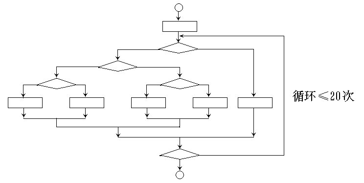
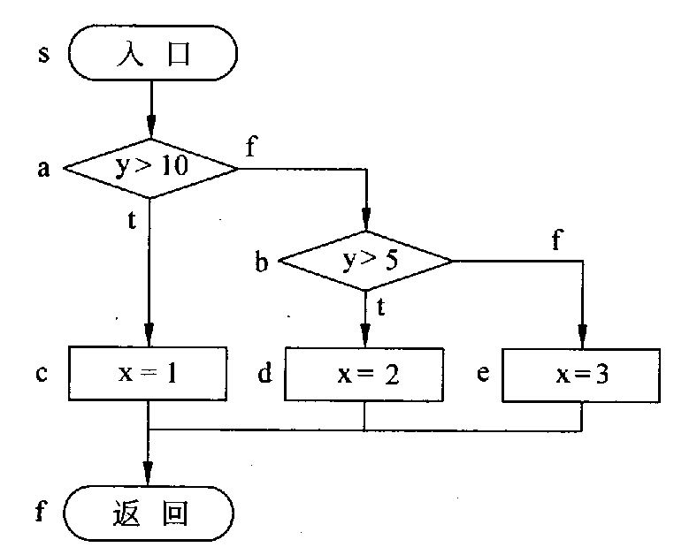
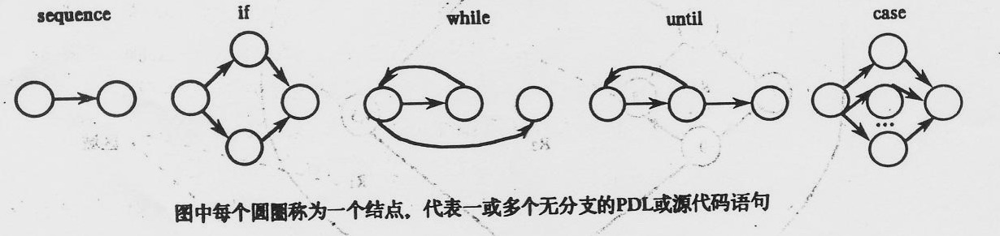
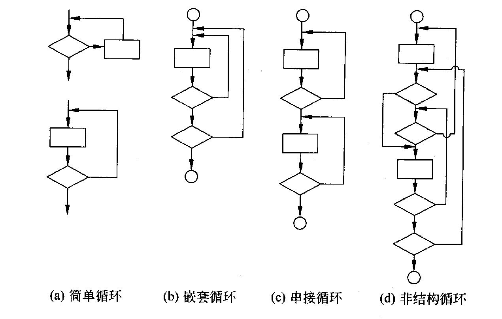
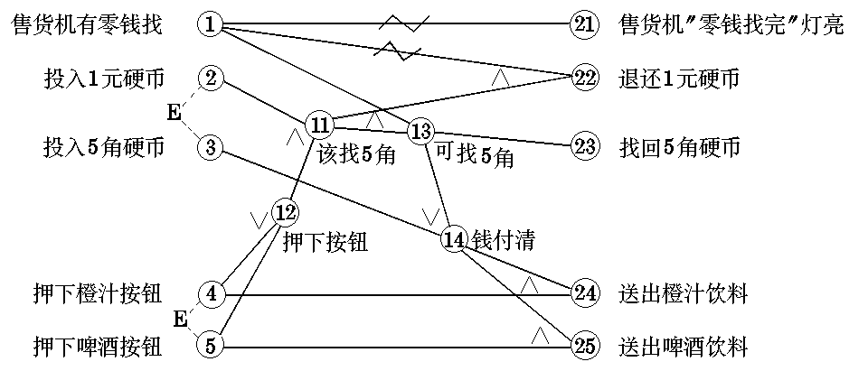
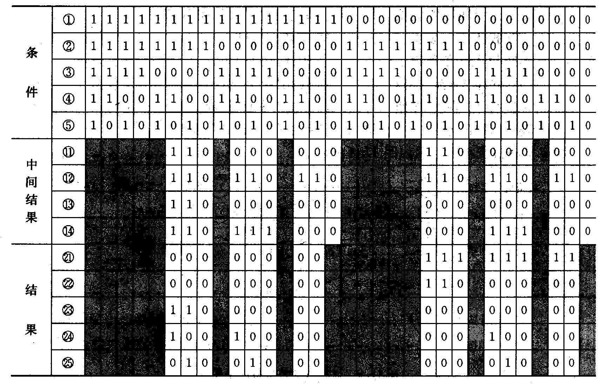
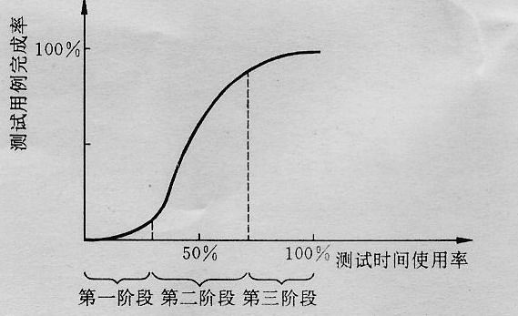

# 第11章 软件测试

<!-- slide: 1 -->

## 软件工程

- 第11章 软件测试

<!-- slide: 2 -->

## 内容摘要

- 软件测试基础
- 白盒测试
- 黑盒测试
- 测试策略
- 面向对象测试
- 测试完成标准
- 调试
- 复旦大学计算机科学与工程系  软件工程课程
- 2

<!-- slide: 3 -->

## 内容摘要

- 软件测试基础
- 白盒测试
- 黑盒测试
- 测试策略
- 面向对象测试
- 测试完成标准
- 调试
- 复旦大学计算机科学与工程系  软件工程课程
- 3

<!-- slide: 4 -->

## 软件测试基础

- 软件测试的目的
- 软件测试的基本原则
- 白盒测试和黑盒测试
- 复旦大学计算机科学与工程系  软件工程课程
- 4

<!-- slide: 5 -->

## 有关软件测试的错误观点

- “软件测试是为了证明程序是正确的，即测试能发现程序中所有的错误”。事实上这是不可能的。要通过测试发现程序中的所有错误，就要穷举所有可能的输入数据。
- 对于一个输入三个16位字长的整型数据的程序，输入数据的所有组合情况有248  3*1014，如果测试一个数据需1ms，则即使一年365天一天24小时不停地测试，也需要约1万年。
- 复旦大学计算机科学与工程系  软件工程课程
- 5

<!-- slide: 6 -->

## 对一个具有多重选择和循环嵌套的程序，不同的路径数目可能是天文数字。例如一个小程序的流程图，它包括了一个执行20次的循环，其循环体有五个分支。这个循环的不同执行路径数达520条，如果对每一条路径进行测试需要1毫秒，那么即使一年工作365 × 24小时，要想把所有路径测试完，大约需3170年。

- 复旦大学计算机科学与工程系  软件工程课程
- 6

<!-- slide: 7 -->

- 复旦大学计算机科学与工程系  软件工程课程
- 7

<!-- slide: 8 -->

## “程序测试是证明程序正确地执行了预期的功能”。实际上，一个程序不仅要完成它所需完成的功能，而且不应完成它不该做的事。如不能把边长为0、0、0的三条边判断为等边三角形。

- 复旦大学计算机科学与工程系  软件工程课程
- 8

<!-- slide: 9 -->

## 软件测试的目的

- Glen Myers给出的软件测试目的：
  - 测试是一个为了发现错误而执行程序的过程
  - 一个好的测试用例是指很可能找到迄今为至尚未发现的错误的测试用例
  - 一个成功的测试是指揭示了迄今为至尚未发现的错误的测试
- 根据这个测试目的，我们应该排除对测试的错误观点，设计合适的测试用例，用尽可能少的测试用例，来发现尽可能多的软件错误。
- 复旦大学计算机科学与工程系  软件工程课程
- 9

<!-- slide: 10 -->

## 软件测试的原则

- Davis提出了一组指导软件测试的基本原则：
- 1.所有的测试都应可追溯到客户需求
- 2.应该在测试工作真正开始前的较长时间就进行测试计划
- 3. Pareto原则：测试中发现的80%的错误可能来自于20%的程序代码
- 4.测试应从“小规模”开始，逐步转向“大规模”
- 5.穷举测试是不可能的
- 6.为了达到最有效的测试，应由独立的第三方来承担测试
- 复旦大学计算机科学与工程系  软件工程课程
- 10

<!-- slide: 11 -->

## 其他的测试原则：
1.在设计测试用例时，应包括合理的输入条件和不合理的输入条件
2.严格执行测试计划，排除测试的随意性
3.应当对每一个测试结果做全面检查
4.妥善保存测试计划、测试用例、出错统计和最终分析报告，为维护提供方便
5.检查程序是否做了应做的事仅是成功的一半，另一半是检查程序是否做了不该做的事
6.在规划测试时不要设想程序中不会查出错误

- 复旦大学计算机科学与工程系  软件工程课程
- 11

<!-- slide: 12 -->

## 白盒测试与黑盒测试

- 测试用例的设计是软件测试的关键所在
- 设计尽可能少的测试用例来发现尽可能多的错误
- 设计最有可能发现软件错误的测试用例，同时避免使用发现错误效果相同的测试用例
- 测试用例的设计方法大体可分为两类：白盒测试和黑盒测试，也称白箱测试和黑箱测试
- 复旦大学计算机科学与工程系  软件工程课程
- 12

<!-- slide: 13 -->

## 白盒测试（又称为结构测试）把测试对象看作一个透明的盒子，测试人员根据程序内部的逻辑结构及有关信息设计测试用例，检查程序中所有逻辑路径是否都按预定的要求正确地工作。
白盒测试主要用于对模块的测试，包括：
程序模块中的所有独立路径至少执行一次
对所有逻辑判定的取值（“真”与“假”）都至少测试一次
在上下边界及可操作范围内运行所有循环
测试内部数据结构的有效性等

- 复旦大学计算机科学与工程系  软件工程课程
- 13

<!-- slide: 14 -->

## 黑盒测试（又称行为测试）把测试对象看做一个黑盒子，测试人员完全不考虑程序内部的逻辑结构和内部特性，只依据程序的需求规格说明书，检查程序的功能是否符合它的功能需求。
黑盒测试可用于各种测试，它试图发现以下类型的错误：
不正确或遗漏的功能
接口错误，如输入/输出参数的个数、类型等
数据结构错误或外部信息(如外部数据库)访问错误
性能错误
初始化和终止错误

- 复旦大学计算机科学与工程系  软件工程课程
- 14

<!-- slide: 15 -->

## 内容摘要

- 软件测试基础
- 白盒测试
- 黑盒测试
- 测试策略
- 面向对象测试
- 测试完成标准
- 调试
- 复旦大学计算机科学与工程系  软件工程课程
- 15

<!-- slide: 16 -->

## 白盒测试

- 常用的白盒测试方法有：
- 逻辑覆盖测试
- 基本路径覆盖测试
- 数据流测试
- 循环测试
- 复旦大学计算机科学与工程系  软件工程课程
- 16

<!-- slide: 17 -->

## 逻辑覆盖测试

  - 语句覆盖
  - 判定覆盖
  - 条件覆盖
  - 判定－条件覆盖
  - 条件组合覆盖
  - 路径覆盖
- 逻辑覆盖主要考察使用测试数据运行被测程序时对程序逻辑的覆盖程度。通常希望选择最少的测试用例来满足所需的覆盖标准。主要的覆盖标准有：
- 复旦大学计算机科学与工程系  软件工程课程
- 17

<!-- slide: 18 -->

## 例：对下列子程序进行测试

procedure example(y,z:real;var x:real);
begin
    if (y>1) and (z=0) then x:=x/y;
    if (y=2) or (x>1) then x:=x+1;
end;
   该子程序接受x、y、z的值，并将计算结果x的值返回给调用程序。
与该子程序对应的流程图如下：

- 复旦大学计算机科学与工程系  软件工程课程
- 18

<!-- slide: 19 -->

- 入口
- s
- (y>1) and (z=0)
- a
- (y=2) or (x >1)
- c
- 返回
- e
- b
- x = x / y
- f
- t
- d
- x = x + 1
- f
- t
- 复旦大学计算机科学与工程系  软件工程课程
- 19

<!-- slide: 20 -->

## 该子程序有两个判定：
a: (y>1) and (z=0) 
c: (y=2) or (x>1) 
判定a中有两个判定条件： y>1、 z=0
判定c中有两个判定条件： y=2 、“x>1”
    根据程序的执行流程不同，判定c中的“x>1”的含义也不同。
当判定a为“真”时， “x>1”实际是“x/y>1”，即“x>y”；
当判定a为“假”时， “x>1”仍是“x>1”。

- 复旦大学计算机科学与工程系  软件工程课程
- 20

<!-- slide: 21 -->

## 该子程序有四条可执行路径：
路径1 sabcde ， 其执行条件（L1）是a为“t”且c为“t”
L1= {(y>1) and (z=0)} and 
          {(y=2) or (x/y>1)}
= (y>1) and (z=0) and (y=2) or
          (y>1) and (z=0) and (x> y )
= (y=2) and (z=0) or
          (y>1) and (z=0) and (x> y )

- s
- e
- a
- c
- b
- d
- t
- f
- f
- t
- a: (y>1)
- and
- (z=0)
- c: (y=2)
- or
- (x>1)
- 复旦大学计算机科学与工程系  软件工程课程
- 21

<!-- slide: 22 -->

## 路径2 sace ，其执行条件（L2）是a为“f”且c为“f”)
L2 = not{(y>1) and (z=0)} and 
          not{(y=2) or (x>1)}
= { not (y>1) or not (z=0) } and
         { not (y=2) and not (x>1) }
= not (y>1) and not (y=2) and not (x>1)
                              or 
   not (z=0) and not (y=2) and not (x>1)
=(y≤1) and (y≠2) and (x ≤ 1)
                              or 
   (z ≠ 0) and (y ≠ 2) and (x ≤ 1)

- s
- e
- a
- c
- b
- d
- t
- f
- f
- t
- a: (y>1)
- and
- (z=0)
- c: (y=2)
- or
- (x>1)
- 复旦大学计算机科学与工程系  软件工程课程
- 22

<!-- slide: 23 -->

## 路径3 sacde ，其执行条件（L3）是a为“f”且c为“t”)
L3 = not {(y>1) and (z=0)} and
        {(y=2) or (x>1)}
= { not (y>1) or not (z=0)} and 
        {(y=2) or (x>1)}
= not (y>1) and (y=2) or 
        not (y>1) and (x>1) or
        not (z=0) and (y=2) or
        not (z=0) and (x>1)
= (y ≤ 1) and (y=2) or (y ≤ 1) and (x>1) or
   (z ≠ 0) and (y=2) or (z ≠ 0) and (x>1)

- s
- e
- a
- c
- b
- d
- t
- f
- f
- t
- a: (y>1)
- and
- (z=0)
- c: (y=2)
- or
- (x>1)
- 复旦大学计算机科学与工程系  软件工程课程
- 23

<!-- slide: 24 -->

## 路径4 sabce ，其执行条件（L4）是a为“t”且c为“f”)
L4 = {(y>1) and (z=0)} and
         not {(y=2) or (x/y>1)}
= (y>1) and (z=0) and not (y=2) and not (x> y)
=(y>1) and (z=0) and (y ≠ 2) and (x ≤ y)

- s
- e
- a
- c
- b
- d
- t
- f
- f
- t
- a: (y>1)
- and
- (z=0)
- c: (y=2)
- or
- (x>1)
- 复旦大学计算机科学与工程系  软件工程课程
- 24

<!-- slide: 25 -->

## 语句覆盖

- 语句覆盖是指选择足够的测试用例，使得运行这些测试用例时，被测程序的每个可执行语句都至少执行一次
- 欲使每个语句都执行一次，只需执行路径L1（sabcde）即可。
- L1= (y=2) and (z=0) or
- (y>1) and (z=0) and (x> y )
- 测试用例如下：

| 测试数据 | 预期结果 |
|---|---|
| x=4,y=2,z=0 | x=3 |

- s
- e
- a
- c
- b
- d
- t
- f
- f
- t
- a: (y>1)
- and
- (z=0)
- c: (y=2)
- or
- (x>1)
- 复旦大学计算机科学与工程系  软件工程课程
- 25

<!-- slide: 26 -->

## 判定覆盖

- 判定覆盖（也称分支覆盖）是指选择足够的测试用例，使得运行这些测试用例时，被测程序的每个判定的所有可能结果都至少执行一次（即判定的每个分支至少经过一次）
- 复旦大学计算机科学与工程系  软件工程课程
- 26

<!-- slide: 27 -->

## 欲使每个分支都执行一次，只需执行路径L3（sacde ，a为“f”且c为“t”）和L4（sabce ，a为“t”且c为“f”） 即可。 或者，执行路径L1（sabcde，a为“t”且c为“t”）和L2（sace ，a为“f”且c为“f”）.

- s
- e
- a
- c
- b
- d
- t
- f
- f
- t
- a: (y>1)
- and
- (z=0)
- c: (y=2)
- or
- (x>1)
- 复旦大学计算机科学与工程系  软件工程课程
- 27

<!-- slide: 28 -->

## L3（sacde ，a为“f”且c为“t”）：
(y ≤ 1) and (y=2) or (y ≤ 1) and (x>1) or
   (z ≠ 0) and (y=2) or (z ≠ 0) and (x>1)
L4（sabce ，a为“t”且c为“f”）：
(y>1) and (z=0) and (y ≠ 2) and (x ≤ y)

- s
- e
- a
- c
- b
- d
- t
- f
- f
- t
- a: (y>1)
- and
- (z=0)
- c: (y=2)
- or
- (x>1)

| 测试数据 | 预期结果 | 路径 | a | c |
|---|---|---|---|---|
| x=1,y=2,z=1 | x=2 | sacde | f | t |
| x=3,y=3,z=0 | x=1 | sabce | t | f |

- 复旦大学计算机科学与工程系  软件工程课程
- 28

<!-- slide: 29 -->

## 判定覆盖将每个判定的所有可能结果都至少执行一次，所以，程序中的所有语句也必定都至少执行一次。因此，满足判定覆盖标准的测试用例也一定满足语句覆盖标准。

- 复旦大学计算机科学与工程系  软件工程课程
- 29

<!-- slide: 30 -->

## 条件覆盖

- 条件覆盖是指选择足够的测试用例，使得运行这些测试用例时，被测程序的每个判定中的每个条件的所有可能结果都至少出现一次
- 复旦大学计算机科学与工程系  软件工程课程
- 30

<!-- slide: 31 -->

## 判定a中各种条件的所有可能结果：y>1， y ≤ 1 ，z=0， z ≠ 0。
判定c中各种条件的所有可能结果：y=2， y ≠ 2 ，x>1（或x>y）， x ≤ 1 （或x ≤ y） 。

- s
- e
- a
- c
- b
- d
- t
- f
- f
- t
- a: (y>1)
- and
- (z=0)
- c: (y=2)
- or
- (x>1)

| 测试数据 | 预期结果 | 路径 | 覆盖的条件 |
|---|---|---|---|
| x=1,y=2,z=0 | x=1.5 | sabcde | y>1， z=0， y=2，x ≤ y |
| x=2,y=1,z=1 | x=3 | sacde | y ≤ 1，z ≠ 0， y ≠ 2 ，x>1 |

- 复旦大学计算机科学与工程系  软件工程课程
- 31

<!-- slide: 32 -->

## 条件覆盖通常比判定覆盖强，但有时虽然每个条件的所有可能结果都出现过，但判定表达式的某些可能结果并未出现。上面的二个测试用例满足了条件覆盖标准，但判定c为“假”的结果并未出现。

- 复旦大学计算机科学与工程系  软件工程课程
- 32

<!-- slide: 33 -->

## 判定/条件覆盖

- 判定/条件覆盖是指选择足够的测试用例，使得运行这些测试用例时，被测程序的每个判定的所有可能结果都至少执行一次，并且，每个判定中的每个条件的所有可能结果都至少出现一次
- 显然，满足判定/条件覆盖标准的测试用例一定也满足判定覆盖、条件覆盖、语句覆盖标准。
- 复旦大学计算机科学与工程系  软件工程课程
- 33

<!-- slide: 34 -->

- s
- e
- a
- c
- b
- d
- t
- f
- f
- t
- a: (y>1)
- and
- (z=0)
- c: (y=2)
- or
- (x>1)

| 测试数据 | 预期结果 | 路径 | a | c | 覆盖的条件 |
|---|---|---|---|---|---|
| x=4,y=2,z=0 | x=3 | sabcde | t | t | y>1， z=0， y=2，x > y |
| x=1,y=1,z=1 | x=1 | sace | f | f | y ≤ 1，z ≠ 0， y ≠ 2 ，x ≤1 |

- 复旦大学计算机科学与工程系  软件工程课程
- 34

<!-- slide: 35 -->

## 条件组合覆盖

- 条件组合覆盖是指选择足够的测试用例，使得运行这些测试用例时，被测程序的每个判定中条件结果的所有可能组合都至少出现一次
- 显然，满足条件组合覆盖标准的测试用例一定也满足判定覆盖、条件覆盖、判定/条件覆盖、语句覆盖标准。
- 复旦大学计算机科学与工程系  软件工程课程
- 35

<!-- slide: 36 -->

## 判定a中条件结果的所有可能组合：①y>1， z=0 ;     ② y>1， z ≠ 0;
③y ≤ 1 ， z=0 ;  ④ y ≤ 1 ， z ≠ 0 
判定c中条件结果的所有可能组合： ⑤ y=2， x>1;     ⑥ y=2， x ≤ 1 ;
⑦ y ≠ 2 ， x>1;  ⑧ y ≠ 2 ， x ≤ 1

- s
- e
- a
- c
- b
- d
- t
- f
- f
- t
- a: (y>1)
- and
- (z=0)
- c: (y=2)
- or
- (x>1)
- 复旦大学计算机科学与工程系  软件工程课程
- 36

<!-- slide: 37 -->

| 测试数据 | 预期结果 | 路径 | a | c | 覆盖的条件 |
|---|---|---|---|---|---|
| x=4,y=2,z=0 | x=3 | sabcde | t | t | ①y>1，z=0 ⑤y=2，x>y |
| x=1,y=2,z=1 | x=2 | sacde | f | t | ②y>1，z ≠ 0 ⑥y=2，x ≤ 1 |
| x=2,y=1,z=0 | x=3 | sacde | f | t | ③y ≤ 1，z=0 ⑦y ≠ 2，x>1 |
| x=1,y=1,z=1 | x=1 | sace | f | f | ④y ≤ 1，z ≠ 0  ⑧y ≠ 2，x≤1 |

- s
- e
- a
- c
- b
- d
- t
- f
- f
- t
- a: (y>1) and (z=0)
- c: (y=2) or (x>1)
- 复旦大学计算机科学与工程系  软件工程课程
- 37

<!-- slide: 38 -->

## 条件组合覆盖是上述五种覆盖标准中最强的一种，然而，条件组合覆盖仍不能保证程序中所有可能的路径都被覆盖。本例中，满足条件组合覆盖标准的测试用例就没有经过sabce路径。

- 复旦大学计算机科学与工程系  软件工程课程
- 38

<!-- slide: 39 -->

## 路径覆盖

- 路径覆盖是指选择足够的测试用例，使得运行这些测试用例时，被测程序的每条可能执行到的路径都至少经过一次（如果程序中包含环路，则要求每条环路至少经过一次）
- 复旦大学计算机科学与工程系  软件工程课程
- 39

<!-- slide: 40 -->

## 本例中所有可能执行的路径有：
L1 ( sabcde ， a为“t”且c为“t”)
= (y=2) and (z=0) or 
   (y>1) and (z=0) and (x> y )
L2 ( sace ， a为“f”且c为“f”)
=(y≤1) and (y≠2) and (x ≤ 1) or 
   (z ≠ 0) and (y ≠ 2) and (x ≤ 1)
L3 ( sacde ， a为“f”且c为“t”)
= (y ≤ 1) and (y=2) or (y ≤ 1) and (x>1) or
   (z ≠ 0) and (y=2) or (z ≠ 0) and (x>1)
L4 ( sabce ， a为“t”且c为“f”)
=(y>1) and (z=0) and (y ≠ 2) and (x ≤ y)

- s
- e
- a
- c
- b
- d
- t
- f
- f
- t
- a: (y>1)
- and
- (z=0)
- c: (y=2)
- or
- (x>1)
- 复旦大学计算机科学与工程系  软件工程课程
- 40

<!-- slide: 41 -->

- s
- e
- a
- c
- b
- d
- t
- f
- f
- t
- a: (y>1)
- and
- (z=0)
- c: (y=2)
- or
- (x>1)

| 测试数据 | 预期结果 | 路径 | a | c |
|---|---|---|---|---|
| x=4,y=2,z=0 | x=3 | sabcde | t | t |
| x=3,y=3,z=0 | x=1 | sabce | t | f |
| x=2,y=1,z=0 | x=3 | sacde | f | t |
| x=1,y=1,z=1 | x=1 | sace | f | f |

- 复旦大学计算机科学与工程系  软件工程课程
- 41

<!-- slide: 42 -->

## 路径覆盖实际上考虑了程序中各种判定结果的所有可能组合，但它未必能覆盖判定中条件结果的各种可能情况。因此，它是一种比较强的覆盖标准，但不能替代条件覆盖和条件组合覆盖标准。

- 复旦大学计算机科学与工程系  软件工程课程
- 42

<!-- slide: 43 -->

- 复旦大学计算机科学与工程系  软件工程课程
- 43

<!-- slide: 44 -->

## 逻辑表达式错误敏感的测试

- 逻辑覆盖测试依赖于程序中的逻辑条件，这些逻辑条件由逻辑表达式组成。对于一个含有n个逻辑变量，或n个关系表达式的逻辑表达式，通常需要2n个测试用例来覆盖其所有可能的条件组合。
- 当n较大时，我们可以选择对发现逻辑表达式错误比较敏感的组合条件进行测试，以较少的测试用例来发现逻辑表达式中的绝大多数错误。
- 复旦大学计算机科学与工程系  软件工程课程
- 44

<!-- slide: 45 -->

## Tai提出的分支与关系运算符（branch and relational operator，BRO）测试技术能用较少的测试用例发现条件中分支与关系运算符的大多数错误。
采用BRO方法的前提条件：条件中的每个布尔变量和关系运算符至多出现一次，并且无公共变量。
BRO方法引入条件约束的概念，含有n个简单条件Ci的复合条件C的约束D表示为（D1，D2，…Dn）， Di （0<in）表示在Ci的输出（outcome）上的约束，它一般是某种符号。

- 复旦大学计算机科学与工程系  软件工程课程
- 45

<!-- slide: 46 -->

## 对布尔表达式，约束为t或f （真、假）；对关系表达式，约束为、、=。
符合条件C的一次执行覆盖条件约束D是指，C中出现的每个简单条件Ci在这次执行中都满足D中对应的约束Di。
下面分三种情况讨论：
若条件为C1：B1&B2
    其中B1、B2为布尔变量，C1的约束具有形式（D1，D2）， D1和D2为t或f。
则C1可能的三种约束为{（t，t）,（f，t），（t，f）}。对其中的每一组设计一组测试用例。而（f，f）对条件C1是不敏感的。

- 复旦大学计算机科学与工程系  软件工程课程
- 46

<!-- slide: 47 -->

## 若条件为C2：B1&（E3=E4）
    其中B1为布尔表达式， E3和E4为算术表达式。C2的约束形式为（D1，D2）， D1为t或f；当E3=E4时D2为=；当E3E4时D2为 或  。
则C2可能的约束集合为{（t，=）,（f，=），（t，  ）， （t，  ）}。

- 复旦大学计算机科学与工程系  软件工程课程
- 47

<!-- slide: 48 -->

## 若条件为C3： （E1  E2） &（E3=E4）
    其中E1、E2、E3、E4均为算术表达式。
则C2可能的约束集合为{（  ，=）,
（=，=）， （  ，=） ，（  ，  ）， （  ，  ）}。

- 复旦大学计算机科学与工程系  软件工程课程
- 48

<!-- slide: 49 -->

## 基本路径测试

- 在实际问题中，一个不太复杂的程序，特别是包含循环的程序，其路径数可能非常大。因此测试常常难以做到覆盖程序中的所有路径，为此，我们希望把测试的程序路径数压缩到一定的范围内。
- 基本路径测试是Tom McCabe提出的一种白盒测试技术，这种方法首先根据程序或设计图画出控制流图，并计算其区域数，然后确定一组独立的程序执行路径（称为基本路径），最后为每一条基本路径设计一个测试用例。
- 复旦大学计算机科学与工程系  软件工程课程
- 49

<!-- slide: 50 -->

## 程序的控制流图（也称程序图）

- 流图由结点和边组成，分别用圆和箭头表示。设计图中一个连续的处理框（对应于程序中的顺序语句）序列和一个判定框（对应于程序中的条件控制语句）映射成流图中的一个结点，设计图中的箭头（对应于程序中的控制转向）映射成流图中的一条边。对于设计图中多个箭头的交汇点可以映射成流图中的一个结点（空结点）。

- 复旦大学计算机科学与工程系  软件工程课程
- 50

<!-- slide: 51 -->

## 上述映射的前提是设计图的判定中不包含复合条件。如果设计图的判定中包含了复合条件，那么必须先将其转换成等价的简单条件设计图。

- 1
- 2
- 3
- 4
- 5
- 6
- c）对应的流图
- a）含复合条件的设计图
- a  b or c  d
- x = 1
- x = 2
- t
- f
- y = 0
- b）只含简单条件的设计图
- t
- t
- f
- f
- x = 1
- x = 1
- a  b
- c  d
- x = 2
- 
- 1
- 2
- 3
- 4
- 5
- 6
- y = 0
- 复旦大学计算机科学与工程系  软件工程课程
- 51

<!-- slide: 52 -->

## 我们把流图中由结点和边组成的闭合部分称为一个区域（region），在计算区域数时，图的外部部分也作为一个区域。例如，右图所示的流图的区域数为3。
独立路径是指程序中至少引进一个新的处理语句序列或一个新条件的任一路径，在流图中，独立路径至少包含一条在定义该路径之前未曾用到过的边。在基本路径测试时，独立路径的数目就是流图的区域数。

- 1
- 2
- 3
- 4
- 5
- 6
- 复旦大学计算机科学与工程系  软件工程课程
- 52

<!-- slide: 53 -->

## 例如，对一个PDL程序进行基本路径测试，该程序的功能是：最多输入N个值（以-999为输入结束标志），计算位于给定范围内的那些值（称为有效输入值）的平均值，以及输入值的个数和有效值的个数。

- 复旦大学计算机科学与工程系  软件工程课程
- 53

<!-- slide: 54 -->

- value[ i ]  minimum
- value[ i ] = maximum
- total.valid加1
- sum = sum + value[ i ]
- value[ i ]  -999
- total.input  n
- total.valid  0
- average = -999
- i加1
- total.valid加1
- 赋初值
- average =
- sum / total.valid
- 10
- 11
- 12
- 13
- 9
- 8
- 7
- 1
- 2
- 3
- 4
- 5
- 6
- t
- f
- f
- t
- t
- t
- t
- f
- f
- f
- 复旦大学计算机科学与工程系  软件工程课程
- 54

<!-- slide: 55 -->

## 其区域数为6，我们选取独立路径如下：
路径1：1-2-10-11-13
路径2：1-2-10-12-13
路径3：1-2-3-10-11-13
路径4：1-2-3-4-5-8-9-2-10-12-13
路径5：1-2-3-4-5-6-8-9-2-10-12-13
路径6：1-2-3-4-5-6-7-8-9-2-10-11-13
为每一条独立路径设计测试用例。
假设：n = 5；minimum = 0；maximum = 100。

- 复旦大学计算机科学与工程系  软件工程课程
- 55

<!-- slide: 56 -->

## 路径1： 1-2-10-11-13
测试数据：value = [ 90，-999，0，0，0]
预期结果：Average = 90，total.input = 1，total.valid = 1
路径2： 1-2-10-12-13
测试数据：value = [ -999 ，0，0，0，0]
预期结果：Average = -999，total.input = 0，total.valid = 0
路径3： 1-2-3-10-11-13
测试数据：value = [ -1，90，70，-1，80]
预期结果：Average = 80，total.input = 5，total.valid = 3

- 复旦大学计算机科学与工程系  软件工程课程
- 56

<!-- slide: 57 -->

## 路径4： 1-2-3-4-5-8-9-2-10-12-13
测试数据：value = [-1，-2，-3，-4，-999]
预期结果：Average = -999，total.input = 4，total.valid = 0
路径5： 1-2-3-4-5-6-8-9-2-10-12-13
测试数据：value = [ 120，110，101，-999，0]
预期结果：Average = -999，total.input = 3，total.valid = 0
路径6： 1-2-3-4-5-6-7-8-9-2-10-11-13
测试数据：value = [ 95，90，70，65，-999]
预期结果：Average = 80，total.input = 4，total.valid = 4

- 复旦大学计算机科学与工程系  软件工程课程
- 57

<!-- slide: 58 -->

## 值得注意的是，某些独立路径（如例中的路径1和路径3）不能以独立的方式进行测试，此时，这些路径必须在其他的独立路径测试中被覆盖。

- 复旦大学计算机科学与工程系  软件工程课程
- 58

<!-- slide: 59 -->

## 数据流测试

- 数据流测试是根据程序中变量的定义（赋值）和引用位置来选择测试用例
- 假定s为语句的标号（每个语句有唯一的标号），x为变量名。定义：
- DEF（s）= { x | 语句s中含有对x的定义}
- USE（s）= { x | 语句s中含有对x的引用}
- 当s为分支或循环语句时， DEF（s）= 
- 设变量x在语句s中被定义，如果存在一条从语句s到语句s’ 的路径，并且在这条路径上不存在对x的其它定义，则称变量x在s处定义在s’处仍有效。
- 复旦大学计算机科学与工程系  软件工程课程
- 59

<!-- slide: 60 -->

## 定义：定义-引用链DU
    变量x的定义-引用链为[x，s，s’]
    其中s, s’为语句标号，
            x ∈ DEF（s）∩ USE（s’）
            且s处定义的x 在s’处仍有效
数据流测试就是设计测试用例使得每个DU链至少被覆盖一次
数据流测试适用于嵌套IF和多重循环程序的测试

- 复旦大学计算机科学与工程系  软件工程课程
- 60

<!-- slide: 61 -->

## 循环测试

- 循环分为4种不同类型：简单循环、嵌套循环、串接循环和非结构循环。
- (1) 简单循环
- 按照下列规则设计测试用例：
- ① 零次循环：从循环入口到出口   ② 一次循环：检查循环初始值   ③ 二次循环：检查多次循环   ④ m次循环： 检查多次循环   ⑤ 最大次数循环
- ⑥比最大次数多一次的循环
- ⑦比最大次数少一次的循环
- 复旦大学计算机科学与工程系  软件工程课程
- 61

<!-- slide: 62 -->

- 复旦大学计算机科学与工程系  软件工程课程
- 62

<!-- slide: 63 -->

- 按照下列规则设计测试用例：
- ① 先测试最内层循环：所有外层的循环变量置为最小值，最内层按简单循环测试；
- ② 由里向外，测试上一层循环：测试时此层以外的所有外层循环的循环变量取最小值，此层以内的所有嵌套内层循环的循环变量取“典型”值，该层按简单循环测试；
- ③ 重复上一条规则，直到所有各层循环测试完毕；
- ④对全部各层循环同时取最小循环次数，或者同时取最大循环次数
- (2) 嵌套循环
- 复旦大学计算机科学与工程系  软件工程课程
- 63

<!-- slide: 64 -->

## (3) 串接循环如果串接的各个循环互相独立，则可以分别用简单循环的方法进行测试；但如果第一个循环的循环变量与第二个循环控制相关，则两个循环不独立，此时，把第一个循环看作外循环，第二个循环看作内循环，然后用测试嵌套循环的办法来处理。
(4) 非结构循环这一类循环应该先将其结构化，然后再测试。

- 复旦大学计算机科学与工程系  软件工程课程
- 64

<!-- slide: 65 -->

## 内容摘要

- 软件测试基础
- 白盒测试
- 黑盒测试
- 测试策略
- 面向对象测试
- 测试完成标准
- 调试
- 复旦大学计算机科学与工程系  软件工程课程
- 65

<!-- slide: 66 -->

## 黑盒测试

- 黑盒测试是依据软件的需求规约，检查程序的功能是否符合需求规约的要求。
- 主要的黑盒测试方法有：
  - 等价类划分
  - 边界值分析
  - 比较测试
  - 错误猜测
  - 因果图
- 复旦大学计算机科学与工程系  软件工程课程
- 66

<!-- slide: 67 -->

## 等价类划分

- 由于不能穷举所有可能的输入数据来进行测试，所以只能选择少量有代表性的输入数据，来揭露尽可能多的程序错误
- 等价类划分方法将所有可能的输入数据划分成若干个等价类，然后在每个等价类中选取一个代表性的数据作为测试用例
  - 等价类是指输入域的某个子集，该子集中的每个输入数据对揭露软件中的错误都是等效的，测试等价类的某个代表值就等价于对这一类其他值的测试。也就是说，如果该子集中的某个输入数据能检测出某个错误，那么该子集中的其他输入数据也能检测出同样的错误；反之，如果该子集中的某个输入数据不能检测出错误，那么该子集中的其他输入数据也不能检测出错误。
- 复旦大学计算机科学与工程系  软件工程课程
- 67

<!-- slide: 68 -->

## 等价类划分方法把输入数据分为有效输入数据和无效输入数据
有效输入数据指符合规格说明要求的合理的输入数据，主要用来检验程序是否实现了规格说明中的功能
无效输入数据指不符合规格说明要求的不合理或非法的输入数据，主要用来检验程序是否做了规格说明以外的事
在确定输入数据等价类时，常常还要分析输出数据的等价类，以便根据输出数据等价类导出输入数据等价类。

- 复旦大学计算机科学与工程系  软件工程课程
- 68

<!-- slide: 69 -->

## 等价类划分设计测试用例的步骤

- 确定等价类根据软件的规格说明，对每一个输入条件（通常是规格说明中的一句话或一个短语）确定若干个有效等价类和若干个无效等价类。
- 可使用如下表格

| 输入条件 | 有效等价类 | 无效等价类 |
|---|---|---|
|  |  |  |

- 复旦大学计算机科学与工程系  软件工程课程
- 69

<!-- slide: 70 -->

## 确定等价类的规则：    (1) 如果输入条件规定了取值范围，则可以确定一个有效等价类（输入值在此范围内）和两个无效等价类（输入值小于最小值及大于最大值）
例如，规定输入的考试成绩在0..100之间，则有效等价类是“0  成绩  100”，无效等价类是“成绩  0”和“成绩  100”。

- 复旦大学计算机科学与工程系  软件工程课程
- 70

<!-- slide: 71 -->

## (2) 如果输入条件规定了值的个数，则可以确定一个有效等价类（输入值的个数等于规定的个数）和两个无效等价类（输入值的个数小于规定的个数和大于规定的个数）
例如，规定输入构成三角形的3条边，则有效等价类是“输入边数 = 3”，无效等价类是“输入边数  3”和“输入边数  3”。

- 复旦大学计算机科学与工程系  软件工程课程
- 71

<!-- slide: 72 -->

## (3) 如果输入条件规定了输入值的集合（即离散值），而且程序对不同的输入值做不同的处理，那么每个允许的值都确定为一个有效等价类，另外还有一个无效等价类（任意一个不允许的值）。
例如，规定输入的考试成绩为优、良、中、及格、不及格，则可确定5个有效等价类和一个无效等价类。

- 复旦大学计算机科学与工程系  软件工程课程
- 72

<!-- slide: 73 -->

## (4) 如果输入条件规定了输入值必须遵循的规则，那么可确定一个有效等价类（符合此规则）和若干个无效等价类（从各个不同的角度违反此规则）。
例如，在Pascal语言中对变量标识符规定为“以字母开头的……串”。那么有效等价类是“以字母开头的串”，而无效等价类有“以数字开头的串”、“以标点符号开头的串”…等。

- 复旦大学计算机科学与工程系  软件工程课程
- 73

<!-- slide: 74 -->

## (5) 如果输入条件规定输入数据是整型，那么可以确定三个有效等价类（正整数、零、负整数）和一个无效等价类（非整数）。
(6) 如果输入条件规定处理的对象是表格，那么可以确定一个有效等价类（表有一项或多项）和一个无效等价类（空表）。
以上只是列举了一些规则，实际情况往往是千变万化的，在遇到具体问题时，可参照上述规则的思想来划分等价类。

- 复旦大学计算机科学与工程系  软件工程课程
- 74

<!-- slide: 75 -->

## 设计测试用例在确定了等价类之后，建立等价类表，列出所有划分出的等价类。并为每个有效等价类和无效等价类编号。

| 输入条件 | 有效等价类 | 无效等价类 |
|---|---|---|
|  |  |  |

- 复旦大学计算机科学与工程系  软件工程课程
- 75

<!-- slide: 76 -->

## 利用等价类设计测试用例的步骤： (1) 设计一个新的测试用例，使其尽可能多地覆盖尚未被覆盖的有效等价类，重复这一步，直到所有的有效等价类都被覆盖为止；(2) 为每个无效等价类设计一个新的测试用例。

- 复旦大学计算机科学与工程系  软件工程课程
- 76

<!-- slide: 77 -->

- 用等价类划分法设计测试用例的实例：某编译程序的规格说明中关于标识符的规定如下：
- 标识符是由字母开头，后跟字母或数字的任意组合构成；标识符的字符数为1∽8个；标识符必须先说明后使用；一个说明语句中至少有一个标识符；保留字不能用作变量标识符。
- 复旦大学计算机科学与工程系  软件工程课程
- 77

<!-- slide: 78 -->

## 用等价类划分方法，建立输入等价类表:

- 输入条件
- 有效等价类
- 无效等价类
- 第一个字符
- 字母⑴
- 数字⑵
- 非字母数字字符⑶
- 后跟的字符
- 字母⑷
- 数字⑸
- 非字母数字字符⑹
- 保留字⑺
- 字符数
- 1~8个⑻
- 0个⑼
-  8个⑽
- 标识符的使用
- 先说明后使用⑾
- 未说明已使用⑿
- 标识符个数
-  1个⒀
- 0个⒁
- 复旦大学计算机科学与工程系  软件工程课程
- 78

<!-- slide: 79 -->

## 下面选取9个测试用例，它们覆盖了所有的等价类。

| 输入数据 | 预期结果 | 覆盖的等价类 |
|---|---|---|
| VAR P3t2：REAL； BEGIN   P3t2：=3．1； …… END； | 正确标识符 | ⑴，⑷，⑸，⑻，⑾，⒀ |
| VAR  3P：REAL； | 报错：不正确标识符 | ⑵ |
| VAR  ！X：REAL； | 报错：不正确标识符 | ⑶ |
| VAR  T#：CHAR； | 报错：不正确标识符 | ⑹ |

- 复旦大学计算机科学与工程系  软件工程课程
- 79

<!-- slide: 80 -->

| 输入数据 | 预期结果 | 覆盖的等价类 |
|---|---|---|
| VAR GOTO：INTEGER； | 报错：保留字作标识符 | ⑺ |
| VAR  X，：REAL； | 报错：标识符长度为0 | ⑼ |
| VAR  T12345678：REAL； | 报错：标识符字符超长 | ⑽ |
| VAR  PAR：REAL； BEGIN  ……      PAP：=3．14      …… END； | 报错：未说明已使用 | ⑿ |
| VAR  ：REAL； | 报错：标识符个数为0  | ⒁ |

- 复旦大学计算机科学与工程系  软件工程课程
- 80

<!-- slide: 81 -->

## 边界值分析

- 边界值分析也是一种黑盒测试方法，是对等价类划分方法的补充。
- 人们从长期的测试工作经验得知，大量的错误是发生在输入或输出范围的边界上，而不是在输入范围的内部。因此针对各种边界情况设计测试用例，其揭露程序中错误的可能性就更大。
- 复旦大学计算机科学与工程系  软件工程课程
- 81

<!-- slide: 82 -->

## 这里所说的边界是指，相对于输入等价类和输出等价类而言，直接在其边界上、或稍高于其边界值、或稍低于其边界值的一些特定情况。
使用等价类分析方法设计测试用例时，原则上，等价类中的任一输入数据都可作为该等价类的代表用作测试用例。而边值分析则是专门挑选那些位于边界附近的值（即正好等于、或刚刚大于、或刚刚小于边界的值）作为测试用例。

- 复旦大学计算机科学与工程系  软件工程课程
- 82

<!-- slide: 83 -->

## 边界值分析方法选择测试用例的规则如下：
1．如果输入条件规定了值的范围，则选择刚刚达到这个范围的边界的值以及刚刚超出这个范围的边界的值作为测试输入数据。
    例如，规定输入的考试成绩在0～100之间，则取0，100，－1，101作为测试输入数据。
2．如果输入条件规定了值的个数，则分别选择最大个数、最小个数、比最大个数多1、比最小个数少1的数据作为测试输入数据。
    例如，规定一个运动员的参赛项目至少1项，最多3项，那么，可选择参赛项目分别是1项、3项、0项、4项的测试输入数据。

- 复旦大学计算机科学与工程系  软件工程课程
- 83

<!-- slide: 84 -->

## 3．对每个输出条件使用第1条。
     例如，输出的金额值大于等于0且小于104 ，则选择使得输出金额分别为0、9999、－1、10000的输入数据作为测试数据。
4．对每个输出条件使用第2条。
     例如，规定输出的一张发票上，至少有1行内容，至多有5行内容，则选择使得输出发票分别有1行、5行、0行、6行内容的输入数据作为测试数据。
5．如果程序的输入或输出是个有序集合，例如，顺序文件、表格，则应把注意力集中在有序集的第1个元素和最后一个元素上。

- 复旦大学计算机科学与工程系  软件工程课程
- 84

<!-- slide: 85 -->

## 6．如果程序中定义的内部数据结构有预定义的边界，例如，数组的上界和下界、栈的大小，则应选择使得正好达到该数据结构边界以及刚好超出该数据结构边界的输入数据作为测试数据。
    例如，程序中数组A的下界是10，上界是20，则可选择使得A的下标为10、20、9、21的输入数据作为测试数据。
7．发挥你的智慧，找出其他可能的边界条件。

- 复旦大学计算机科学与工程系  软件工程课程
- 85

<!-- slide: 86 -->

## 由于边值分析方法所设计的测试用例更有可能发现程序中的错误，因此经常把边值分析方法与其它设计测试用例方法结合起来使用。

- 复旦大学计算机科学与工程系  软件工程课程
- 86

<!-- slide: 87 -->

## 比较测试（back to back）

- 在现实中，有些软件有很高的可靠性要求，特别是那些可能危及人的生命安全的软件系统，如航空航天控制软件、核电厂控制软件等，其软件可靠性绝对重要。此时，需要冗余的硬件和软件来减少错误发生的可能性。
- 通常，可由二支软件开发队伍，根据相同的需求规格说明分别开发二个软件版本，然后，用相同的测试用例对二个版本的软件分别进行测试，比较二个版本软件的测试结果，如果测试结果相同，则可认为二个版本的软件都是正确的，如果测试结果不同，则要分析各个版本，以发现错误的所在。这种测试称为比较测试或称为背靠背测试（back―to―back testing）。大多数情况下，可用自动化工具来进行比较测试。
- 复旦大学计算机科学与工程系  软件工程课程
- 87

<!-- slide: 88 -->

## 值得注意的是，比较测试并不能保证软件没有错误，如果规格说明本身有错，那么所有的版本都可能反映这种错误。
另外，如果各个版本产生相同的但都不正确的结果，那么比较测试也无法发现这种错误。

- 复旦大学计算机科学与工程系  软件工程课程
- 88

<!-- slide: 89 -->

## 错误推测法

- 错误猜测是一种凭直觉和经验推测某些可能存在的错误，从而针对这些可能存在的错误设计测试用例的方法。
- 这种方法没有机械的执行步骤，主要依靠直觉和经验。
- 错误猜测法的基本思想是：列举出程序中所有可能的错误和容易发生错误的特殊情况，然后根据这些猜测设计测试用例。
- 复旦大学计算机科学与工程系  软件工程课程
- 89

<!-- slide: 90 -->

## 例如，测试一个排序子程序，可考虑如下情况：
输入表为空；
输入表只有一个元素；
输入表的所有元素都相同；
输入表已排序。
又如，测试二分法检索子程序，可考虑如下情况：
表中只有一个元素；
表长为2n；
表长为2n-1；
表长为2n+1

- 复旦大学计算机科学与工程系  软件工程课程
- 90

<!-- slide: 91 -->

## 因果图

- 在等价类划分方法和边界值方法中未考虑输入条件的各种组合，当输入条件比较多时，输入条件组合的数目会相当大
- 因果图方法是一种帮助人们系统地选择一组高效测试用例的方法，它既考虑了输入条件的组合关系，又考虑了输出条件对输入条件的依赖关系，即因果关系，其测试用例发现错误的效率比较高。
- 复旦大学计算机科学与工程系  软件工程课程
- 91

<!-- slide: 92 -->

## 因果图方法的特点是：
考虑输入条件的组合关系；
考虑输出条件对输入条件的依赖关系，即因果关系；
测试用例发现错误的效率高；
能检查出功能说明中的某些不一致或遗漏。

- 复旦大学计算机科学与工程系  软件工程课程
- 92

<!-- slide: 93 -->

## 用因果图设计测试用例的步骤：(1) 分割功能说明书
   将输入条件分成若干组，然后分别对每个组使用因果图，这样可减少输入条件组合的数目。如测试编译程序时，可以将每个语句作为一组。

- 复旦大学计算机科学与工程系  软件工程课程
- 93

<!-- slide: 94 -->

## (2) 识别“原因”和“结果”，并加以编号
   “原因”是指输入条件或输入条件的等价类；“结果”是指输出条件或系统变换。如，更新主文件就是一种系统变换。
   每个原因和结果都对应于因果图中的一个结点，当原因或结果成立（或出现）时，相应的结点的值为1，否则为0。

- 复旦大学计算机科学与工程系  软件工程课程
- 94

<!-- slide: 95 -->

## (3) 根据功能说明中规定的原因与结果之间的关系画出因果图
   因果图的基本符号如下：

- b
- a
- 恒等
- b
- a
- ∼
- 非
- 
- a
- b
- c
- d
- 或
- a
- b
- c
- d
- 
- 与
- 复旦大学计算机科学与工程系  软件工程课程
- 95

<!-- slide: 96 -->

## 图中左边的结点表示原因，右边的结点表示结果
原因和结果之间的关系有：
恒等：若a=1，则b=1；若a=0，则b=0
非：若a=1，则b=0；若a=0，则b=1
或：若a=1或b=1 或c=1 ，则d=1；否则d=0
与：若a=b=c=1 ，则d=1；否则d=0
画因果图时原因在左，结果在右，由上向下排列，并根据功能说明中规定的原因和结果之间的关系，用上述符号连接起来。必要时还可以引入一些中间结点。

- 复旦大学计算机科学与工程系  软件工程课程
- 96

<!-- slide: 97 -->

## (4) 根据功能说明在因果图中加上约束条件
   因果图的约束条件如下图所示：

- 要求
- R
- b
- a
- b
- a
- M
- 屏蔽
- 互斥
- a
- b
- c
- E
- 包含
- a
- b
- c
- I
- 唯一
- a
- b
- c
- O
- 复旦大学计算机科学与工程系  软件工程课程
- 97

<!-- slide: 98 -->

## 图中互斥、包含、唯一、要求是对原因的约束，屏蔽是对结果的约束
互斥：表示a、b、c中至多只有一个为1，即不同时为1
包含：表示a、b、c中至少有一个为1，即不同时为0
唯一：表示a、b、c中有且仅有一个1
要求：表示若a=1 ，则要求b必须为1，即不可出现a=1 且b=0
屏蔽：表示若a=1 ，则b必须为0，即不可出现a=1 且b=1

- 复旦大学计算机科学与工程系  软件工程课程
- 98

<!-- slide: 99 -->

## (5) 根据因果图画出判定表
 列出满足约束条件的所有原因组合，写出每种原因组合下的结果（如有的话）

- 原
- 因
- 允许的原因组合
- 中间
- 结点
- 各种原因组合下中间结点的值
- 结
- 果
- 各种原因组合下的结果值
- (6)为判定表的每一列设计一个测试用例
- 复旦大学计算机科学与工程系  软件工程课程
- 99

<!-- slide: 100 -->

- 例如，有一个处理单价为5角钱的饮料自动售货机软件，其规格说明如下：
- 饮料自动售货机允许投入5角或1元的硬币，用户可通过“橙汁”和“啤酒”按钮选择饮料，售货机还装有一个表示“零钱找完”的指示灯，当售货机中有零钱找时指示灯暗，当售货机中无零钱找时指示灯亮。当用户投入5角硬币并押下“橙汁”或“啤酒”按钮后，售货机送出“橙汁”或“啤酒” 。当用户投入1元硬币并押下“橙汁”或“啤酒”按钮后，如果售货机有零钱找，则送出相应的饮料，并退还5角硬币；如果售货机没有零钱找，则饮料不送出，并且退还1元硬币。
- 复旦大学计算机科学与工程系  软件工程课程
- 100

<!-- slide: 101 -->

## 分析规格说明，列出原因和结果规格说明中的红色部分是输入条件（原因），蓝色部分是输出条件（结果）。
      由于“售货机有零钱找”是在投入1元硬币时判断是否能找零钱的依据，所以也可把它看作是一个输入条件，即原因。与之对应的结果是售货机指示灯亮（或暗）。
              原因                                      结果
（1）售货机有零钱找	（21）售货机“零钱找完”灯亮
（2）投入1元硬币		（22）退还1元硬币
（3）投入5角硬币		（23）退还5角硬币
（4）押下“橙汁”按钮	（24）送出“橙汁”饮料
（5）押下“啤酒”按钮	（25）送出“啤酒”饮料

- 复旦大学计算机科学与工程系  软件工程课程
- 101

<!-- slide: 102 -->

## (2) 画出因果图。所有原因结点列在左边，所有结果结点列在右边。

              其中中间结点的含义如下：
             （11）投入1元硬币且押下饮料按钮
             （12）押下“橙汁”或“啤酒”按钮
             （13）应找5角硬币且售货机有零钱找
             （14）钱已付清

- 复旦大学计算机科学与工程系  软件工程课程
- 102

<!-- slide: 103 -->

## (3) 由于原因 2 与 3 ，4 与 5 不能同时发生，分别加上约束条件E。

(4) 根据因果图画出判定表
(5) 根据判定表设计测试用例

- 复旦大学计算机科学与工程系  软件工程课程
- 103

<!-- slide: 104 -->

- 复旦大学计算机科学与工程系  软件工程课程
- 104

<!-- slide: 105 -->

## 内容摘要

- 软件测试基础
- 白盒测试
- 黑盒测试
- 测试策略
- 面向对象测试
- 测试完成标准
- 调试
- 复旦大学计算机科学与工程系  软件工程课程
- 105

<!-- slide: 106 -->

## 测试策略

- 一种测试策略就是将测试分为单元测试、集成测试、确认测试和系统测试。
- 单元测试是针对程序中的模块或构件，主要揭露编码阶段产生的错误。
- 集成测试针对集成的软件系统，主要揭露设计阶段产生的错误。
- 确认测试是根据软件需求规约对集成的软件进行确认，主要揭露不符合需求规约的错误。
- 对于基于计算机系统中的软件，还需将它集成到基于计算机系统中，并进行系统测试，以揭露不符合系统工程中对软件要求的错误。
- 复旦大学计算机科学与工程系  软件工程课程
- 106

<!-- slide: 107 -->

## V模型：描述软件开发各阶段与测试策略之间的对应关系。

- 系统工程
- 需求分析
- 设计
- 编码
- 系统测试
- 确认测试
- 集成测试
- 单元测试
- 复旦大学计算机科学与工程系  软件工程课程
- 107

<!-- slide: 108 -->

## Tom Gilb指出实现一个成功的软件测试策略必须涉及如下问题：
在着手开始测试之前的较长时间，就要以量化的形式确定产品的需求。
显式地陈述测试目标。
了解软件的用户并为每一类用户建立剖面（profile）图
建立一个强调“快速循环（rapid cycle）测试”的测试计划。
构造“健壮”的软件，它被设计成可测试自身。
使用有效的正式技术评审作为测试之前的过滤器。
使用正式技术评审来评估测试策略和测试用例本身。
为测试过程建立一种持续改进的方法。

- 复旦大学计算机科学与工程系  软件工程课程
- 108

<!-- slide: 109 -->

## 单元测试 (Unit Testing)

- 单元测试又称模块测试，它着重对软件设计的最小单元（软件构件或模块）进行验证
- 单元测试根据设计描述，对重要的控制路径进行测试，以发现构件或模块内部的错误
- 单元测试通常采用白盒测试，并且多个构件或模块可以并行进行测试
- 这里将构件或模块统一称为模块
- 复旦大学计算机科学与工程系  软件工程课程
- 109

<!-- slide: 110 -->

## 1. 单元测试的内容

- 模块接口：确保模块的输入/输出参数信息是正确的。这些信息包括参数的个数、次序、类型等。
- 局部数据结构：确保临时存储的数据在算法执行的整个过程中都能维持其完整性。如不合适的类型说明、不同数据类型的比较或赋值、文件打开和关闭的遗漏、超越数据结构的边界等。
- 边界条件：确保程序单元在极限或严格的情况下仍能正确地执行。
- 复旦大学计算机科学与工程系  软件工程课程
- 110

<!-- slide: 111 -->

## 所有独立路径：确保模块中的所有语句都至少执行一次。程序执行的路径实际上体现了计算的过程，计算中常见的错误有：不正确的操作优先级、不同类型数据间的操作、不正确的初始化、不精确的精度、不正确的循环中止、不适当地修改循环变量、发散的迭代等。
所有错误处理路径：单元测试应该对所有的错误处理路径进行测试。错误处理部分潜在的错误有：报错信息没有提供足够的信息来帮助确定错误的性质及其发生的位置、报错信息与真正的错误不一致、错误条件在错误处理之前就已引起系统异常、异常条件处理不正确等。

- 复旦大学计算机科学与工程系  软件工程课程
- 111

<!-- slide: 112 -->

## 2. 单元测试过程

- 单元测试通常与编码工作结合起来进行。
- 模块本身不是一个独立的程序，在测试模块时，必须为每个被测模块开发一个驱动(driver)程序和若干个桩(stub)模块。
- 驱动程序
- 被测模块
- 桩模块
- 桩模块
- 复旦大学计算机科学与工程系  软件工程课程
- 112

<!-- slide: 113 -->

## 驱动模块接收测试数据，调用被测模块，把测试数据传送给被测模块，被测模块执行后，驱动模块接收被测模块的返回数据，并打印相关结果。
驱动程序的程序结构如下：
	数据说明；
	初始化；
	输入测试数据；
	调用被测模块；
	输出测试结果；
  停止

- 复旦大学计算机科学与工程系  软件工程课程
- 113

<!-- slide: 114 -->

## 桩模块的功能是替代被被测模块调用的模块，它接受被测模块的调用，验证入口信息，把控制连同模拟结果返回给被测模块。
桩模块的程序结构如下：
	数据说明；
	初始化；
	输出提示信息（表示进入了哪个桩模块）；
	验证调用参数；
	打印验证结果；
	将模拟结果送回被测程序；
  返回

- 复旦大学计算机科学与工程系  软件工程课程
- 114

<!-- slide: 115 -->

## 集成测试（Integrated Testing）

- 集成测试 也称组装测试、联合测试
- 经单元测试后，每个模块都能独立工作，但把它们放在一起往往不能正常工作。
- 复旦大学计算机科学与工程系  软件工程课程
- 115

<!-- slide: 116 -->

- 主要问题在于：
  - 数据可能在通过接口时丢失；
  - 一个模块可能对另一个模块产生产生非故意的、有害的影响（即副作用）；
  - 当子功能被组合起来时，可能不能达到期望的主功能；
  - 单个模块可以接受的不精确性（如误差），连接起来后可能会扩大到无法接受的程度；
  - 全局数据结构可能会存在问题。
- 复旦大学计算机科学与工程系  软件工程课程
- 116

<!-- slide: 117 -->

- 集成的方式有两种：
  - 非增量式集成：使用“一步到位”的方法来构造程序。先将所有经过单元测试的模块组合在一起，然后对整个程序（作为一个整体）进行测试。这种测试在发现错误时，很难为错误定位。改正错误时容易引入新的错误，新旧错误混在一起，更难定位。
  - 增量式集成：根据程序结构图，按某种次序挑选一个（或一组）尚未测试过的模块，把它集成到已测试好的模块中一起进行测试，每次增加一个（或一组）模块，直至所有模块全部集成到程序中。在增量集成测试过程中发现的错误，往往与新加入的模块有关。
- 复旦大学计算机科学与工程系  软件工程课程
- 117

<!-- slide: 118 -->

- 增量式集成又可分为自顶向下集成和自底向上集成。
  - 自顶向下集成：从主控模块（主程序）开始，然后按照程序结构图的控制层次，将直接或间接从属于主控模块的模块按深度优先或广度优先的方式逐个集成到整个结构中，并对其进行测试。
  - 自顶向下集成在测试一个模块时，它的上层模块（已测试过）可用作它的驱动模块。
- 复旦大学计算机科学与工程系  软件工程课程
- 118

<!-- slide: 119 -->

## 深度优先测试次序：
   M1、M2、M5、M8、M6、M3、M7、M4
广度优先测试次序：
   M1、M2、M3、M4、M5、M6、M7、M8

- M2
- M3
- M4
- M7
- M1
- M6
- M5
- M8
- 复旦大学计算机科学与工程系  软件工程课程
- 119

<!-- slide: 120 -->

- 自顶向下集成的步骤：
- （1）主控模块（主程序）被直接用作驱动程序，所有直接从属于主控模块的模块用桩模块替换，然后对主控模块进行测试；
- （2）根据集成的实现方式（深度优先或广度优先），下层的桩模块一次一个地替换成真正的模块，从属于该模块的模块用桩模块替换，然后对其进行测试；
- （3）用回归测试来保证没有引入新的错误；
- （4）重复第（2）和第（3）步，直至所有模块都被集成。
- 复旦大学计算机科学与工程系  软件工程课程
- 120

<!-- slide: 121 -->

- 自顶向下集成的优点：
- 不需要驱动模块；能尽早对程序的主要控制和决策机制进行检验，能较早发现整体性的错误；深度优先的自顶向下集成能较早对某些完整的程序功能进行验证。
- 自顶向下集成的缺点：
- 测试时低层模块用桩模块替代，不能反映真实情况；重要数据不能及时回送到上层模块。
- 复旦大学计算机科学与工程系  软件工程课程
- 121

<!-- slide: 122 -->

  - 自底向上集成：从程序结构的最底层模块（即原子模块）开始，然后按照程序结构图的控制层次将上层模块集成到整个结构中，并对其进行测试。
  - 自底向上集成在测试一个模块时，它的下层模块（已测试过）可用作它的桩模块。
- 复旦大学计算机科学与工程系  软件工程课程
- 122

<!-- slide: 123 -->

- 自底向上集成的步骤：
- （1）将低层模块组合成能实现软件特定功能的簇；
- （2）为每个簇编写驱动程序，并对簇进行测试；
- （3）移走驱动程序，用簇的直接上层模块替换驱动程序，然后沿着程序结构的层次向上组合新的簇；
- （4）凡对新的簇测试后，都要进行回归测试，以保证没有引入新的错误；
- （5）重复第（2）步至第（4）步，直至所有的模块都被集成。
- 复旦大学计算机科学与工程系  软件工程课程
- 123

<!-- slide: 124 -->

- Mc
- Ma
- Mb
- 簇1
- 簇2
- 簇3
- D1
- D3
- D2
- 驱动模块
- 簇4
- 簇5
- 复旦大学计算机科学与工程系  软件工程课程
- 124

<!-- slide: 125 -->

- 自底向上集成的优点：
- 不需要桩模块，所以容易组织测试；将整个程序结构分解成若干个簇，对同一层次的簇可并行进行测试，可提高效率。
- 自底向上集成的缺点：
- 整体性的错误发现得较晚。
- 复旦大学计算机科学与工程系  软件工程课程
- 125

<!-- slide: 126 -->

- 策略的选择
  - 自顶向下集成测试与自底向上集成测试各有优缺点，其中一种策略的优点差不多就是另一种策略的缺点。将这两种策略组合起来可能是一种最好的折衷，这种折衷的策略是：在程序结构的高层使用自顶下向策略，而在低层则使用自底向上策略，这种测试策略也称为三明治测试（sandwich testing）。
  - 集成测试时应特别关注关键模块（critical module）的测试。关键模块是指具有下列一个或多个特征的模块：1）与多个软件需求有关；2）含有高层控制（位于程序结构的高层）；3）本身是复杂的或是容易出错的；4）含有确定的性能需求。关键模块应尽早测试，回归测试时也应集中在关键模块的功能上。
- 复旦大学计算机科学与工程系  软件工程课程
- 126

<!-- slide: 127 -->

## 回归测试（Regression Testing）

- 在集成测试过程中，每当增加一个（或一组）新模块时，原先已集成的软件就发生了改变。新的数据流路径被建立，新的I/O操作可能出现，还可能激活新的控制逻辑，这些改变可能使原本正常的功能产生错误。
- 当测试时发现错误后，需修改程序；或者在软件维护时也需修改程序。这些对程序的修改也可能使原本正常的功能产生错误。
- 回归测试就是对已经进行过的测试的子集的重新执行，以确保对程序的改变和修改，没有传播非故意的副作用。
- 复旦大学计算机科学与工程系  软件工程课程
- 127

<!-- slide: 128 -->

## 回归测试集（已经过测试的子集）包括三种不同类型的测试用例：
能测试软件所有功能的代表性测试用例
专门针对可能会被修改影响的软件功能的附加测试
注重于修改过的软件模块的测试

- 复旦大学计算机科学与工程系  软件工程课程
- 128

<!-- slide: 129 -->

## 确认测试（Validation Testing）

- 确认测试标准
- 确认测试以软件需求规约为依据，以发现软件与需求不一致的错误。主要检查软件是否实现了规约规定的全部功能要求，文档资料是否完整、正确、合理，其他的需求，如可移植性、可维护性、兼容性、错误恢复能力等是否满足。
- 复旦大学计算机科学与工程系  软件工程课程
- 129

<!-- slide: 130 -->

## 确认测试的结果可分为两类：
满足需求规约要求的功能或性能特性，用户可以接受。
 发现与需求规约有偏差，此时需列出问题清单。

- 复旦大学计算机科学与工程系  软件工程课程
- 130

<!-- slide: 131 -->

## 软件配置评审
软件配置评审也称软件审计（audit），其目的是保证软件配置的所有成分都齐全，各方面的质量都符合要求，具有维护阶段必需的细节，而且已经编排好分类目录。
软件配置主要包括计算机程序（源代码和可执行程序），针对开发者和用户的各类文档，包含在程序内部或程序外部的数据。

- 复旦大学计算机科学与工程系  软件工程课程
- 131

<!-- slide: 132 -->

## α测试和β测试
如果软件是为一个客户开发的，那么，最后由客户进行验收测试（acceptance test），以使客户确认该软件是他所需要的。
如果软件是给许多客户使用的（如市场上销售的各种软件），那么让每个客户做验收测试是不现实的。大多数软件厂商都使用一种称为α测试和β测试的过程，来发现那些似乎只有最终用户才能发现的错误。

- 复旦大学计算机科学与工程系  软件工程课程
- 132

<!-- slide: 133 -->

## α测试是由一个用户在开发者的场所进行的，软件在开发者对用户的“指导下”进行测试。经α测试后的软件称为β版软件。
β测试是由软件的最终用户在一个或多个用户场所进行的，与α测试不同，开发者通常不在测试现场，因此，β测试是软件在一个开发者不能控制的环境中的“活的”应用，用户记录所有在β测试中遇到的（真正的或想象的）问题，并定期把这些问题报告给开发者，在接到β测试的问题报告后，开发者对软件进行最后的修改，然后着手准备向所有的用户发布最终的软件产品。

- 复旦大学计算机科学与工程系  软件工程课程
- 133

<!-- slide: 134 -->

## 系统测试（System Testing）

- 系统测试是对整个基于计算机的系统进行的一系列测试。
- 系统测试的种类很多，每种测试都有不同的目的，它们从不同的角度测试计算机系统是否被正常地集成，并完成相应的功能。
- 常用的系统测试包括：
  - 恢复测试（recovery testing）
  - 安全测试（security testing）
  - 压力测试（stress testing）
  - 性能测试（performance testing）
- 复旦大学计算机科学与工程系  软件工程课程
- 134

<!-- slide: 135 -->

## 恢复测试（recovery testing）

- 恢复测试是通过各种手段，强制软件发生故障，然后来验证系统能否在指定的时间间隔内恢复正常，包括修正错误并重新启动系统。
- 如果恢复是由系统自身来完成的，那么，需验证重新初始化、检查点机制、数据恢复和重启动等的正确性。
- 如果恢复需要人工干预，那么要估算平均修复时间MTTR（mean time to repair）是否在用户可以接受的范围内。
- 复旦大学计算机科学与工程系  软件工程课程
- 135

<!-- slide: 136 -->

## 安全测试（security testing）

- 安全测试用来验证集成在系统中的保护机制能否实际保护系统不受非法侵入。
- 在安全测试过程中，测试者扮演一个试图攻击系统的角色，采用各种方式攻击系统。例如，截取或码译密码；借助特殊软件攻击系统；“制服”系统，使他人无法访问；故意导致系统失效，企图在系统恢复之机侵入系统；通过浏览非保密数据，从中找出进入系统的钥匙等等。
- 一般来说，只要有足够的时间和资源，好的完全测试一定能最终侵入系统。系统设计者的任务是把系统设计成：攻破系统所付出的代价大于攻破系统后得到信息的价值。
- 复旦大学计算机科学与工程系  软件工程课程
- 136

<!-- slide: 137 -->

## 压力测试（stress testing）

- 压力测试也称强度测试，它是在一种需要非正常数量、频率或容量的方式下执行系统，其目的是检查系统对非正常情况的承受程度。例如：
  - 当系统的中断频率是每秒1或2个时，执行每秒10个中断的测试用例
  - 将输入数据的数量提高一个数量级来测试输入功能如何响应
  - 执行需要最大内存或其它资源的测试用例
  - 执行可能导致大量磁盘驻留数据的测试用例
- 复旦大学计算机科学与工程系  软件工程课程
- 137

<!-- slide: 138 -->

## 性能测试（performance testing）

- 性能测试用来测试软件在集成的系统中的运行性能。它对实时系统和嵌入式系统尤为重要。
- 性能测试可以发生在测试过程的所有步骤中
  - 单元测试时，主要测试一个独立模块的性能，如算法的执行速度。
  - 软件集成后，进行软件整体的性能测试。
  - 计算机系统集成后，进行整个计算机系统的性能测试。
- 性能测试常常需要与压力测试结合起来进行，而且常常需要一些硬件和软件测试设备，以监测系统的运行情况。
- 复旦大学计算机科学与工程系  软件工程课程
- 138

<!-- slide: 139 -->

## 内容摘要

- 软件测试基础
- 白盒测试
- 黑盒测试
- 测试策略
- 面向对象测试
- 测试完成标准
- 调试
- 复旦大学计算机科学与工程系  软件工程课程
- 139

<!-- slide: 140 -->

## 面向对象测试

- 面向对象软件的测试目标仍然是用最少时间和工作量来发现尽可能多的错误
- 但面向对象软件的性质改变了测试的策略和测试战术。面向对象软件的测试也给软件工程师带来新的挑战。
- 复旦大学计算机科学与工程系  软件工程课程
- 140

<!-- slide: 141 -->

## 面向对象语境对测试的影响

- 继承、封装、多态性、基于消息的通信等概念都是面向对象软件的重要特征，它们对面向对象测试有很大的影响。
- 单元
- 适用于面向对象测试的两种单元定义
  - 单元是可以编译和执行的最小软件部件
  - 单元是决不会指派给多个设计人员开发的软件部件
  - 类是面向对象软件中的单元
- 复旦大学计算机科学与工程系  软件工程课程
- 141

<!-- slide: 142 -->

## 封装
  由于属性和操作被封装在类中，因此测试时很难获得对象的某些具体信息（除非提供内置操作来报告这些信息），从而给测试带来困难。
继承
  测试了父类的操作后，并不表示其子类就不必对继承的操作进行测试。
多态性
  在测试时，应覆盖反映多态的所有实现方法。
基于消息的通信
  面向对象软件是通过消息通信来实现类之间的协作，它们没有明显的层次控制结构，因此，传统的自顶向下和自底向上集成策略不适用于面向对象软件测试。

- 复旦大学计算机科学与工程系  软件工程课程
- 142

<!-- slide: 143 -->

## 面向对象的测试策略

- 把类作为面向对象软件的单元，传统的单元测试等价于面向对象中的类测试，也称类内测试。它包括类内的方法测试和类的行为测试。
- 面向对象中的类间测试（interclass testing）相当于面向对象的集成测试。它有两种集成策略：
  - 基于线程的测试（thread－based testing）：集成一组互相协作的类来响应系统的一个输入或事件，每个线程逐一被集成和测试，并通过回归测试保证其没有产生副作用。
  - 基于使用的测试（use－based testing）：按使用层次来集成系统。把那些几乎不使用其他类提供的服务的类称为独立类，把使用类的类称为依赖类。集成从测试独立类开始，然后集成直接依赖于独立类的那些类，并对其测试。按照依赖的层次关系，逐层集成并测试，直至所有的类被集成。
- 复旦大学计算机科学与工程系  软件工程课程
- 143

<!-- slide: 144 -->

## 面向对象的确认测试和系统测试策略与传统的确认测试和系统测试策略相同，在面向对象确认测试时，应该利用用况模型，通过用况提供的场景来发现与用户需求不一致的错误。

- 复旦大学计算机科学与工程系  软件工程课程
- 144

<!-- slide: 145 -->

## 面向对象测试用例设计

- 传统的测试用例设计方法及其思想在面向对象测试中仍是可用的。
- 类内测试
  - 测试类中的每个操作（相当于传统软件中的函数或子程序），通常采用白盒测试方法，如逻辑覆盖、基本路径覆盖、数据流测试、循环测试等
  - 测试类的行为（通常用状态机图来描述），利用状态机图进行类测试时，可考虑覆盖所有状态、所有状态迁移等覆盖标准，也可考虑从初始状态到终止状态的所有迁移路径的覆盖
- 复旦大学计算机科学与工程系  软件工程课程
- 145

<!-- slide: 146 -->

## 划分测试（partition testing），这种方法与等价类划分方法相似，它将输入和输出分类，并设计测试用例来处理每个类别。划分的方式有多种：
基于状态的划分是根据操作改变类状态的能力对操作分类。
基于属性的划分是根据使用的属性对操作分类，如使用属性a的操作、修改属性a的操作、既不使用又不修改属性a的操作。
基于类别的划分是根据操作的种类对类操作分类，如初始化操作、计算操作、查询操作、终止操作。

- 复旦大学计算机科学与工程系  软件工程课程
- 146

<!-- slide: 147 -->

## 类间测试
   类间测试主要测试类之间的交互和协作。在UML中通常用顺序图和通信图来描述对象之间的交互和协作。可以根据顺序图或通信图，设计作为测试用例的消息序列，来检查对象之间的协作是否正常。
基于场景的测试
   场景是用况的实例，它反映了用户对系统功能的一种使用过程，基于场景的测试主要用于确认测试，在类间测试时也可根据描述对象间的交互场景来设计测试用例。

- 复旦大学计算机科学与工程系  软件工程课程
- 147

<!-- slide: 148 -->

## 内容摘要

- 软件测试基础
- 白盒测试
- 黑盒测试
- 测试策略
- 面向对象测试
- 测试完成标准
- 调试
- 复旦大学计算机科学与工程系  软件工程课程
- 148

<!-- slide: 149 -->

## 测试完成的标准

- 因为无法判定当前查出的错误是否是最后一个错误，所以决定什么时候停止程序测试就成了最困难的问题，但是测试最后一定要停止的。
- 几种实用的测试完成标准：
  - Musa和Ackerman提出了一个基于统计标准的答复：“不，我们不能绝对地认定软件永远也不会再出错，但是相对于一个理论上合理的和在试验中有效的统计模型来说，如果一个在按照概率的方法定义的环境中，1000个CPU小时内不出错运行的概率大于0．995的话，那么我们就有95%的信心说，我们已经进行了足够的测试”。
- 复旦大学计算机科学与工程系  软件工程课程
- 149

<!-- slide: 150 -->

## 使用指定的测试用例设计方法产生测试用例，运行这些测试用例均未发现错误（包括发现错误后已被纠正的情况），则测试可终止。
观察测试阶段中单位时间内发现错误数目的曲线：

|  |  |  |  |  |  |  |  |  |  |
|---|---|---|---|---|---|---|---|---|---|
|  |  |  |  |  |  |  |  |  |  |
|  |  |  |  |  |  |  |  |  |  |
|  |  |  |  |  |  |  |  |  |  |
|  |  |  |  |  |  |  |  |  |  |
|  |  |  |  |  |  |  |  |  |  |
|  |  |  |  |  |  |  |  |  |  |
|  |  |  |  |  |  |  |  |  |  |
|  |  |  |  |  |  |  |  |  |  |
|  |  |  |  |  |  |  |  |  |  |
|  |  |  |  |  |  |  |  |  |  |
|  |  |  |  |  |  |  |  |  |  |

|  |  |  |  |  |  |  |  |  |  |
|---|---|---|---|---|---|---|---|---|---|
|  |  |  |  |  |  |  |  |  |  |
|  |  |  |  |  |  |  |  |  |  |
|  |  |  |  |  |  |  |  |  |  |
|  |  |  |  |  |  |  |  |  |  |
|  |  |  |  |  |  |  |  |  |  |
|  |  |  |  |  |  |  |  |  |  |
|  |  |  |  |  |  |  |  |  |  |
|  |  |  |  |  |  |  |  |  |  |
|  |  |  |  |  |  |  |  |  |  |
|  |  |  |  |  |  |  |  |  |  |
|  |  |  |  |  |  |  |  |  |  |

- 单发
- 位现
- 时的
- 间错
- 内误
- 数
- 周（或天）
- 可
- 以
- 停
- 止
- 单发
- 位现
- 时的
- 间错
- 内误
- 数
- 周（或天）
- 不
- 应
- 停
- 止
- 复旦大学计算机科学与工程系  软件工程课程
- 150

<!-- slide: 151 -->

## 日立预测法
    日立公司分析了23个工程项目的测试情况，这些项目包括操作系统、语言处理程序、大规模联机系统等，总共约100万行代码。分析表明，这些项目在完成测试用例速率方面有明显的相似之处，如图所示：

- 复旦大学计算机科学与工程系  软件工程课程
- 151

<!-- slide: 152 -->

## 经验表明，完成软件测试通常要经历三个阶段：
   第一阶段：由于目标系统的大部分模块还不能正常运行，系统中存在的错误较多，因此测试用例完成得慢；
   第二阶段：完成测试用例的效率很高；
   第三阶段：发现的错误往往是较难改正的，因此测试用例完成率明显降低。
   总结经验后得到如下规律：

- 复旦大学计算机科学与工程系  软件工程课程
- 152

<!-- slide: 153 -->

## 1.上述23个项目第一阶段平均占允许使用的总时间的22%；
2.如果第一阶段占用的时间超过允许使用的总时间的55%以上，该项目的破产是不可避免的；
3.成功的项目第一阶段占用的时间平均是允许使用的总时间的15%；
4.成功的项目第二阶段占总时间的57%，破产的项目第二阶段只占总时间的29%。
    总之，第一阶段占用时间的长短决定项目的成功与失败。

- 复旦大学计算机科学与工程系  软件工程课程
- 153

<!-- slide: 154 -->

## 内容摘要

- 软件测试基础
- 白盒测试
- 黑盒测试
- 测试策略
- 面向对象测试
- 测试完成标准
- 调试
- 复旦大学计算机科学与工程系  软件工程课程
- 154

<!-- slide: 155 -->

## 调试（Debugging）

- 测试的目的是发现错误，调试（也称排错）的目的是确定错误的原因和准确位置，并加以纠正
- 调试过程
- 复旦大学计算机科学与工程系  软件工程课程
- 155

<!-- slide: 156 -->

- 测试用例
- 执行
- 测试用例
- 追加测试
- 被怀疑的原因
- 已识别的原因
- 回归测试
- 修正程序
- 调试
- 结果
- 复旦大学计算机科学与工程系  软件工程课程
- 156

<!-- slide: 157 -->

## 调试方法

- 蛮力法
- 蛮力法是一种最省脑筋但又最低效的方法。它通过在程序中设置断点，输出寄存器、存储器的内容，打印有关变量的值等手段，获取大量现场信息，从中找出错误的原因。
- 这种方法效率低，输出的信息大多是无用的，通常在其他调试方法未能找到错误原因时，才使用这种方法。
- 可以采用二分法来逐步缩小出错的范围。
- 复旦大学计算机科学与工程系  软件工程课程
- 157

<!-- slide: 158 -->

## 回溯法回溯法是从错误的征兆出发，人工沿着控制流程往回跟踪，直至发现错误的根源。这种方法适用于小型程序，对大型程序，由于回溯的路径太多，难以彻底回溯。

- 复旦大学计算机科学与工程系  软件工程课程
- 158

<!-- slide: 159 -->

## 原因排除法
原因排除法又可分为归纳法和演绎法。
归纳法是一种从特殊推断一般的系统化思考方法。其基本思想是：从一些线索（错误征兆）着手，通过分析它们之间的关系来找出错误的原因。

- 组织数据
- 收集
- 有关数据
- 研究数据
- 之间的关系
- 导出假设
- 证明假设
- 纠正错误
- 能
- 不能
- 能
- 不能
- 复旦大学计算机科学与工程系  软件工程课程
- 159

<!-- slide: 160 -->

## 演绎法
  演绎法从一般原理或前提出发，假设所有可能出错的原因，排除不可能正确的假设，最后推导出结论。

- 排除
- 不正确原因
- 列出
- 可能的原因
- 精化
- 剩余的假设
- 证明假设
- 收集
- 更多数据
- 纠正错误
- 无剩余
- 能
- 有
- 剩
- 余
- 不能
- 复旦大学计算机科学与工程系  软件工程课程
- 160

<!-- slide: 161 -->

## 纠正错误
修改一个错误常常会引入新的错误
在为纠正某个错误而修改程序之前应该回答三个问题：
在程序的其他地方是否也存在同类的错误？
本次修改可能会引发什么新的错误？
为了防止这个错误，我们应该做什么？

- 复旦大学计算机科学与工程系  软件工程课程
- 161
