# 第三章软件需求分析

<!-- slide: 1 -->

- 第三章  软件需求分析

<!-- slide: 2 -->

- 系统工程
- 软件需求分析
- 软件设计
- 需求分析在系统工程和软件设计间的桥梁作用
- 需求分析的作用

<!-- slide: 3 -->

- §3.1 需求分析的任务
- 准确地定义未来系统的目标，确定为了满足用户的需求系统必须做什么。用 <需求规格说明书> 规范的形式准确地表达用户的需求。

<!-- slide: 4 -->

## 思考、涉及的几个问题

- 如何定义系统需求？
- 如何识别、获取需求?
- 你能够采取何种手段与用户进行交流沟通?
- 何为需求建模?
- 你如何理解模型与建模?

<!-- slide: 5 -->

## 软件需求分析的几个阶段

- 问题分析
- 问题评估和方案综合
- 建模
- 规约
- 复审
- 系统分析员的主要焦点是 “做什么（what）” ，不是 “怎样做（how）”

<!-- slide: 6 -->

## §3.2 需求获取

- 3.2.1 需求获取的目的
- 清楚地理解所要解决的问题
- 完整地获取用户需求

<!-- slide: 7 -->

## 需求获取面临的挑战：

- (1)问题空间理解
- (2)人与人之间的通信
- (3)需求的不断变化

<!-- slide: 8 -->

## 某出版社系统调查表

| 编号 | 提出问题 |
|---|---|
| 1 | 您在哪个部门工作？ |
| 2 | 出版业务流程是什么？ |
| 3 | 您每日都处理那些文件、数据、报表？ |
| 4 | 工作中手工处理特别麻烦的事情是什么？ |
| 5 | 工作中手工处理什么问题解决不了？影响效率的问题有哪些？ |
| 6 | 您认为提高工作效率，节省工作时间，减轻工作强度可采取哪些办法？ |

<!-- slide: 9 -->

## 某出版社系统调查表

| 编号 | 提出问题 |
|---|---|
| 7 | 您的部门需要成本核算和统计的内容有哪些？ |
| 8 | 您的部门采用计算机管理工作情况如何？ |
| 9 | 如何改进业务流程使之更合理？ |
| 10 | 哪些问题是目前传统手工方法根本无法解决的？ |
| 11 | 出版社计算机管理信息系统需要解决什么问题？ |

<!-- slide: 10 -->

## 3.2.2 需求获取的内容

- 1.用户需求分类
  - (1)功能性需求:
  - 定义了系统做什么（描述系统必须支持的功能和过程）
  - (2)非功能性需求（技术需求）:
  - 定义了系统工作时的特性
  - （描述操作环境和性能目标）

<!-- slide: 11 -->

## 2. 两类需求包括的内容

- (1) 功能
- (2) 性能
- (3) 环境
- (4) 界面
- (5) 用户或人的因素
- (6) 文档
- (7) 数据
- (8) 资源
- (9) 安全保密
- (10)软件成本消耗与开发进度
- (11)质量保证

<!-- slide: 12 -->

## (1)  功能需求

- 系统做什么？
- 系统何时做什么？
- 系统何时及如何修改或升级？

<!-- slide: 13 -->

## (2)  性能需求

- 软件开发的技术性指标
- 例如：
  - 执行速度
  - 吞吐量

<!-- slide: 14 -->

## (3)  环境需求

- 硬件设备：机型、外设、接口、
- 地点、分布、温度、
- 湿度、磁场干扰等
- 软       件：   操作系统
- 网络
- 数据库

<!-- slide: 15 -->

## (4)  界面需求

- 有来自其它系统的输入吗？
- 到自其它系统的输出吗？
- 对数据格式有规定吗？
- 对数据存储介质有规定吗？

<!-- slide: 16 -->

## (5) 用户或人的因素

- 用户类型？
- 各种用户熟练程度？
- 需受何种训练？
- 用户理解、使用系统的难度？
- 用户错误操作系统的可能性？

<!-- slide: 17 -->

## (6)  文档需求

- 需哪些文档？
- 文档针对哪些读者？

<!-- slide: 18 -->

## (7)  数据需求

- 输入、输出数据的格式？
- 接收、发送数据的频率？
- 数据的准确性和精度？
- 数据流量？
- 数据需保持的时间？

<!-- slide: 19 -->

## (8)  资源需求

- 软件运行时所需的数据、软件、内存空间等资源。
- 软件开发、维护所需的人力、支撑软件、开发设备等。

<!-- slide: 20 -->

## (9)  安全保密要求

- 需对访问系统或系统信息加以控制吗？
- 系统备份要求？

<!-- slide: 21 -->

## (10) 软件成本消耗与开发进度需求

- 开发有规定的时间表吗？
- 软硬件投资有无限制？

<!-- slide: 22 -->

## (11) 质量保证

- 系统的可靠性要求？
- 系统必须监测和隔离错误吗？
- 规定系统平均出错时间？
- 出错后，重启系统允许的时间？
- 系统变化如何反映到设计中？
- 维护是否包括对系统的改进？
- 系统的可移植性？

<!-- slide: 23 -->

- 3.3 需求建模

<!-- slide: 24 -->

## 模型(model)

- 模型: 现实世界某些重要方面的表示。
- 有时我们使用术语“抽象”来表示模型，因为我们从现实世界中抽象出对我们特别有用的东西。

<!-- slide: 25 -->

- 需求分析步骤
- 当前
- 系统
- 目标
- 系统
- 物理
- 模型
- 逻辑
- 模型
- 逻辑
- 模型
- 物理
- 模型
- 模型化
- 抽象化
- 具体化
- 实例化
- 怎
- 么
- 做
- 做
- 什
- 么
- 当前
- 系统
- 目标
- 系统
- 需
- 求
- 定
- 义

<!-- slide: 26 -->

- 模型是对对象系统的形式化的特征抽象，概括性或近似地表示；
- 构造模型的过程是一个抽象、分析的过程。
- 对象
- 系统
- 模型
- 系统
- 抽象（映射）
- 模型应用
- 模型构造的过程
- 逻辑模型和物理模型

<!-- slide: 27 -->

- 逻辑模型       物理模型
- (本质模型、概念模型)  (实施模型、技术模型)
- 现
- 行
- 系
- 统
- 目
- 标
- 系
- 统
- 描述重要的业务功能，无论系统是如何实施的。
- 描述现实系统是如何在物理上实现的。
- 描述新系统的主要业务功能和用户新的需求，无论系统应如何实施。
- 描述新系统是如何实施的（包括技术）。
- 逻辑模型和物理模型

<!-- slide: 28 -->

## 建模的原因：
在建模过程中了解系统
通过抽象降低复杂性
有助于回忆所有的细节
有助于开发小组间的交流
有助于与用户的交流
为系统的维护提供文档

- 模型的作用

<!-- slide: 29 -->

## 模型化或模型方法是通过抽象、概括和一般化，把研究的对象或问题转化为本质（关系或结构）相同的另一对象或问题，从而加以解决的方法。模型化方法要求所建立的模型能真实反映所研究对象的整体结构、关系或某一过程、某一局部、某一侧面的本质特征和变化规律。

<!-- slide: 30 -->

## 模型的类型

- 数学模型
- 描述模型
- 图形模型

<!-- slide: 31 -->

## 需求分析过程示意

- 学
- 生
- (1) 通过对现实环境的调查，获得当前系统的物理模型
- 学
- 生
- 购
- 书
- 申
- 请
- 购书
- 单
- 发
- 票
- 领
- 书
- 单
- 书
- 107
- 张
- 教务科
- 206
- 王
- 会计室
- 206
- 李
- 出纳员
- 303
- 赵
- 教材科
- 学生购买教材的物理模型

<!-- slide: 32 -->

## (2) 去掉具体模型中的非本质因素，抽象出当前系统的逻辑模型

- 学生购买教材的逻辑模型
- 学
- 生
- 学
- 生
- 购
- 书
- 申
- 请
- 购书
- 单
- 发
- 票
- 领
- 书
- 单
- 书
- 审查
- 有效性
- 开发票
- 开领
- 书单
- 发书
- 需求分析过程示意

<!-- slide: 33 -->

## (3) 分析当前系统与目标系统的差别，建立目标系统的逻辑模型

- 计算机售书系统的逻辑模型
- 学
- 生
- 学
- 生
- 购书单
- 发票
- 领书单
- 审查并
- 开发票
- 开领
- 书单
- 无效书单
- 需求分析过程示意

<!-- slide: 34 -->

## 结构化分析方法

- 面向数据流进行需求分析的方法
- 结构化分析方法适合于数据处理类型软件的需求分析
- 具体来说，结构化分析方法就是用抽象模型的概念，按照软件内部数据传递、变换的关系，自顶向下逐层分解，直到找到满足功能要求的所有可实现的软件为止
- 结构化分析方法概述

<!-- slide: 35 -->

## 分析模型的主要目标

- 描述用户需要
- 建立创建软件设计的基础
- 定义软件完成后可被确认的一组需求

<!-- slide: 36 -->

- 分析模型的结构
- 数据
- 字典
- 数据
- 流图
- E-R图
- 状态变迁图
- 加
- 工
- 规
- 约
- 控制规约
- 数
- 据
- 对
- 象
- 描
- 述

<!-- slide: 37 -->

## 分析模型的元素

- 数据字典(DD)：模型核心(中心库)
- E-R图(ERD)：
- 数据流图(DFD)
    - 指明数据在系统中移动时如何被变换;
    - 描述对数据流进行变换的功能;
- DFD中每个功能的描述包含在加工规约 (小说明)。
- 状态变迁图(STD)
- 指明作为外部事件的结果,系统将如何动作。

<!-- slide: 38 -->

## 结构化分析方法

- 结构化分析方法使用工具：
  - 实体关系(E-R)方法
  - 数据流图
  - 数据词典
  - 状态迁移图
  - 逻辑说明工具

<!-- slide: 39 -->

## 3.4.3  数据建模

- E-R图是数据建模的基础
- 数据模型包括三种互相关联的信息：
- 数据对象
- 描述对象的属性
- 描述对象间相互连接的关系

<!-- slide: 40 -->

- 在需求分析阶段进行数据库逻辑设计过程中，使用E-R图，可定义一个实体模型。
- 实体模型不涉及数据世界的数据结构、存取路径、存取效率等问题。它可以转换成数据库中的数据模型。

<!-- slide: 41 -->

## E-R方法

- 数据可以按相应数据模型进行组织。
- E-R图中表示实体联系的符号如下：
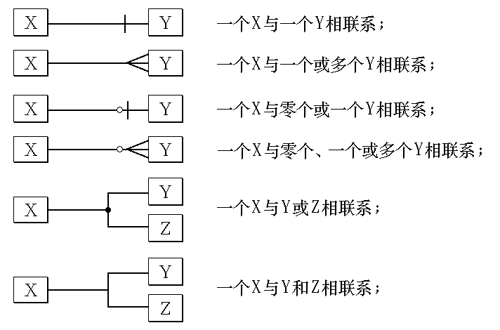

<!-- slide: 42 -->

## E-R方法

- 在E-R图中，每个方框表示实体型或属性，方框之间的连线表示实体之间，或实体与属性之间的联系。出现在连线上的短竖线可以看成是“1”，而圆圈隐含表示“0”。
- 例:  在教学管理中，一个教师可以教零门、一门或多门课程，每位学生也需要学习几门课程。因此，教学管理中涉及的对象(实体）有学生、教师和课程。

<!-- slide: 43 -->

## E-R方法

- 解答:用E-R图描述它们之间的联系，得下图。其中，学生与课程是多对多的联系，而教师与课程的联系是零、一对多。
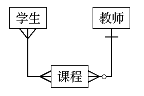

<!-- slide: 44 -->

## E-R方法

- 进一步，要确定属性。例如，
- 1.学生具有学号、姓名、性别、年龄、专业（其它略）等属性；
- 2.课程具有课程号、课程名、学分、学时数等属性；
- 3. 教师具有职工号、姓名、年龄、职称等属性;
- 此外，学生通过学号、分数与课程发生联系。如此可得教学实体模型。

<!-- slide: 45 -->

## 教学实体模型

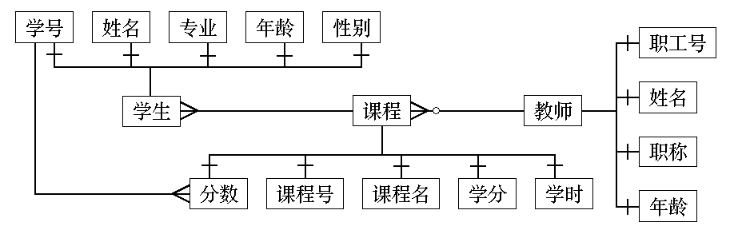

<!-- slide: 46 -->

## 数据流图

- 基于
- 计算机
- 的系统
- 输入信息
- 信息流模型
- 输出信息
- 外部实体
- 外部实体
- 外部实体
- 输入信息
- 外部实体
- 外部实体
- 输出信息
- 输出信息
- 目标系统被表示成如下图所示的数据变换流程图。
- 系统的功能体现在核心的数据变换中。

<!-- slide: 47 -->

## 一. 数据流图

- (DFD，Data Flow Diagram)
- 描述逻辑模型的图形工具， 表示数据在系统内的变化。

<!-- slide: 48 -->

## 描述银行取款过程的数据流图

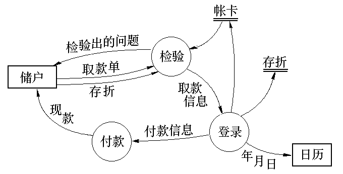

<!-- slide: 49 -->

## 数据流图

- 数据流图中的主要图形元素

<!-- slide: 50 -->

## 数据流与数据加工之间的关系

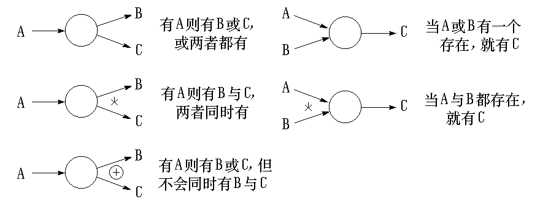

<!-- slide: 51 -->

## DFD可以用来表示一个系统或软件在任何层次上的抽象。 较大型软件系统DFD分成多层(子图、父图概念),可以表示数据流和功能的进一步的细节。

<!-- slide: 52 -->

## 分层的数据流图

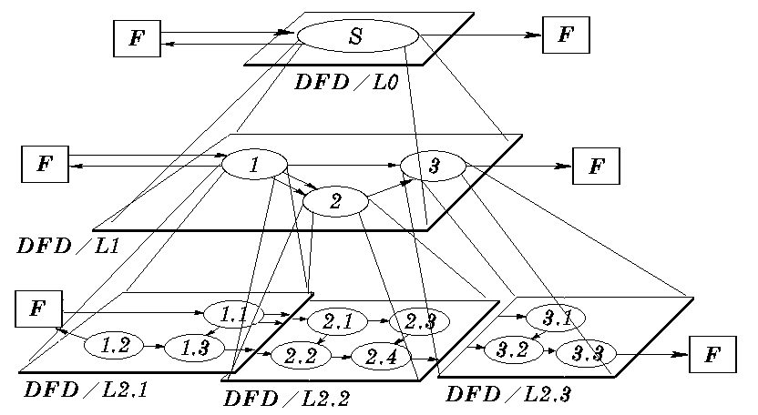

<!-- slide: 53 -->

- 在多层数据流图中，顶层流图仅包含一个加工，它代表被开发系统。它的输入流是该系统的输入数据，输出流是系统所输出数据
- 底层流图是指其加工不需再做分解的数据流图，它处在最底层
- 中间层流图则表示对其上层父图的细化。它的每一加工可能继续细化，形成子图。

<!-- slide: 54 -->

## 结构化分析方法步骤示例 商店业务处理系统

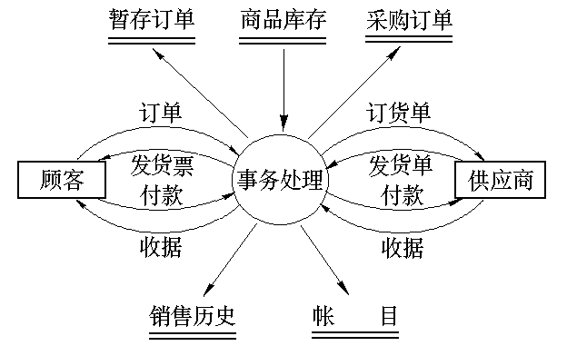

<!-- slide: 55 -->

- 这个数据流图只是一个高层的系统逻辑模型，它反映了目标系统要实现的功能
- 数据流图绘制步骤
  - 首先确定系统的输入和输出
  - 根据商店业务，画出顶层数据流图，以反映最主要业务处理流程

<!-- slide: 56 -->

## 数据流图绘制步骤

  - 经过分析，商店业务处理的主要功能应当有销售、采购、会计三大项。主要数据流输入的源点和输出终点是顾客和供应商。
  - 然后从输入端开始，根据商店业务工作流程，画出数据流流经的各加工框，逐步画到输出端，得到第一层数据流图

<!-- slide: 57 -->

## 第一层数据流图

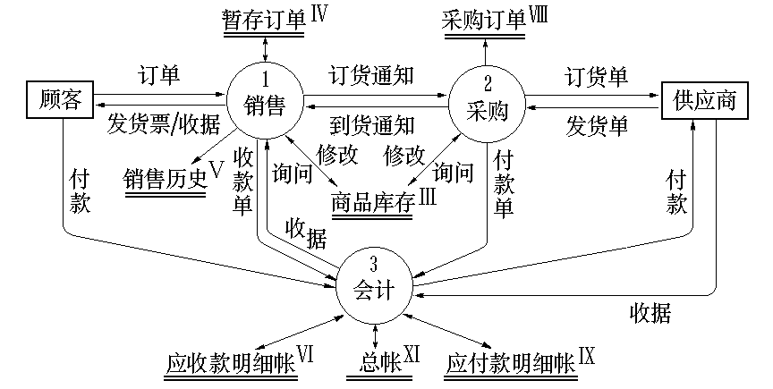

<!-- slide: 58 -->

## 加细每一个加工框	  销售细化

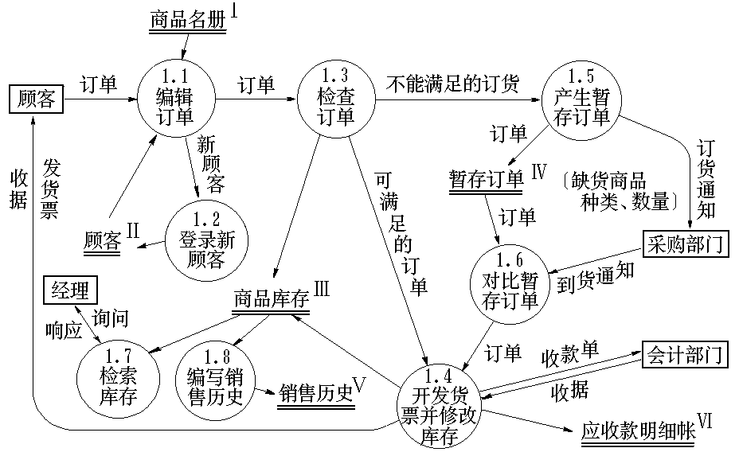

<!-- slide: 59 -->

## 采购细化

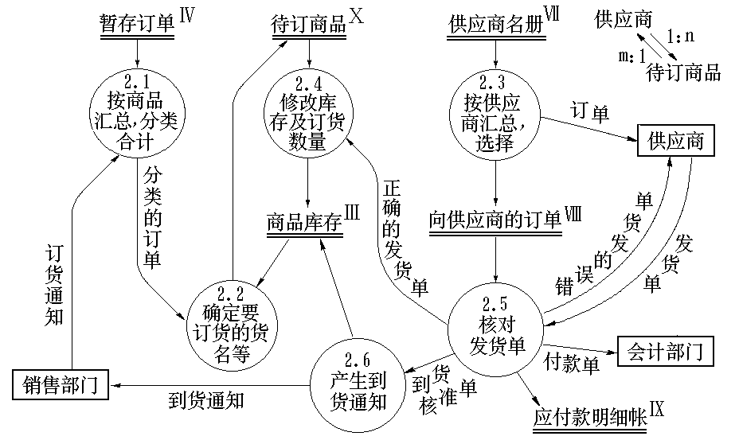

<!-- slide: 60 -->

## 检查和修改数据流图的原则

- 数据流图上所有图形符号只限于前述四种基本图形元素
- 数据流图的主图必须包括前述四种基本元素，缺一不可
- 数据流图的主图上的数据流必须封闭在外部实体之间??
- 每个加工至少有一个输入数据流和一个输出数据流

<!-- slide: 61 -->

- 在数据流图中，需按层给加工框编号。
- 规定任何一个数据流子图必须与它上一层的一个加工对应，两者的输入数据流和输出数据流必须一致。此即父图与子图的平衡
- 可以在数据流图中加入物质流，帮助用户理解数据流图
- 图上每个元素都必须有名字
- 数据流图中不可夹带控制流
- 初画时可以忽略琐碎的细节，以集中精力于主要数据流

<!-- slide: 62 -->

## 考务处理系统的分层DFD

<!-- slide: 63 -->

## 实例   考务处理系统功能

- (1)对考生送来的报名单进行检查;
- (2)对合格的报名单编好准考证号后将准考证送给考生，并将汇总后的考生名单送给阅卷站;
- (3)对阅卷站送来的成绩单进行检查，并根据考试中心制定的合格标准审定合格者;
- (4)制作考生通知单(含成绩及合格/不合格标志)送给考生;
- (5)按地区进行成绩分类统计和试题难度分析，产生统计分析表。

<!-- slide: 64 -->

## 顶层数据流图

- 考
- 生
- 考务
- 处理系统
- 考
- 试
- 中
- 心
- 阅卷站
- 不合格报名单
- 报名单
- 准考证
- 考生通知单
- 成
- 绩
- 清
- 单
- 合格标准
- 错误成绩
- 清单
- 考生名
- 单
- 统计分析表

<!-- slide: 65 -->

- 登记
- 报名单
- 报名单
- 准考证
- 1
- 统计成绩
- 2
- 不合格
- 报名单
- 考生通知单
- 成
- 统计分析表
- 0层数据流图
- 考生名册
- 绩
- 清
- 单
- 合
- 格
- 标
- 准
- 考生名
- 单
- 成
- 绩
- 清
- 单
- 错
- 误

<!-- slide: 66 -->

- 一层数据流图 (a)
- 检查
- 报名单
- 报名单
- 准考证
- 1.1
- 编准考证号
- 1.2
- 不合格
- 报名单
- 考生名册
- 考生名单
- 合格
- 报名单
- 登记
- 考生
- 1.3

<!-- slide: 67 -->

- 一层数据流图 (b)
- 检查
- 成绩清单
- 2.1
- 审定
- 合格者
- 2.2
- 考生名册
- 正确
- 成绩清单
- 制作
- 通知单
- 2.3
- 分析
- 统计成绩
- 2.4
- 分析
- 试题难度
- 2.5
- 试题得分清单
- 考生
- 通知单
- 难度
- 分析表
- 合格
- 标准
- 分类
- 统计表
- 成绩清单
- 错误
- 成绩清单
- 经审定的
- 成绩清单

<!-- slide: 68 -->

## 二.数据字典(DD）

- 数据词典与数据流图配合，能清楚地表达数据处理的要求
- 数据词典精确地、严格地定义了每一个与系统相关的数据元素，并以字典式顺序将它们组织起来，使得用户和分析员对所有的输入、输出、存储成分和中间计算有共同的理解。

<!-- slide: 69 -->

## 数据字典的作用

- 词条描述 —— 对于在数据流图中每一个被命名的图形元素，均加以定义，其内容有:  名字，别名或编号，分类，描述，定义，位置，其它等

| 名字:定货报表 别名:定货信息 描述:每天一次送给采购员的需要定货的零件表 定义:定货报表=零件编号+零件名称+定货数量+目前价格+主要供应者+次要供应者 位置:输出到打印机 |
|---|

<!-- slide: 70 -->

- 在数据词典的每一个词条中应包含以下信息：
- 名称：数据对象或控制项、数据存储或外部实体的名字
- 别名或编号
- 分类：数据对象？数据流？数据文件？外部实体？
- 描述：描述内容或数据结构等
- 何处使用：使用该词条（数据或控制项）的加工

<!-- slide: 71 -->

## 定义式中使用的符号

- 符 号	       含 义 	           举     例
- ＝                    被定义为
- ＋                          与        x = a＋b
- [...,...] 或 [...|...]      或         x = [a , b]，x = [a | b]
- { ... }或 m{...}n    重复       x = {a}，  x = 3{a}8
- (...)                       可选               x = (a)
- “...”              基本数据元素      x = “a”
- ..	                  连结符           x = 1..9

<!-- slide: 72 -->

## F1:航班信息文件＝{航空公司名称＋航班号
＋起点＋终点＋日期 ＋起飞时间＋降落时间}
航空公司名称＝2{字母}4
  航班号＝3{十进制数字}3
  字母＝“A”…“Z”
十进制数字＝“0”…“9”
起点＝终点＝1{汉字}10
  起飞时间＝降落时间＝时＋分
  时＝“00”…“23”　
  分＝“00”…“59”
  日期＝年＋月＋日
  年＝[2000｜2001｜2002｜2004]
  月＝“01”…“12”　
  日＝“01”…“31”

- DD中数据结构的描述方式

<!-- slide: 73 -->

## 重复项：起点＝终点＝1{汉字}10
      航空公司名称＝2{字母}4
         航班号＝3{十进制数字}3
  
组合项：日期＝年＋月＋日
           起飞时间＝降落时间＝时＋分
选择项：年＝[2000｜2001｜2002｜2004]
原数据项：字母＝“A”…“Z”
         十进制数字＝“0”…“9”
            时＝“00”…“23”　
            分＝“00”…“59”
           月＝“01”…“12”　
            日＝“01”…“31”

<!-- slide: 74 -->

## 限制重复次数举例:

- ｛
- 3
- 5 或
- 5
- 3
- ｛ ｝表示允许重复3-5次
- ｛ ｝
- 3
- 3 或
- 3
- 3
- ｛ ｝表示恰好重复 3 次
- ｛ ｝
- ｛ ｝
- ｛ ｝
- 1
- 表示至少出现 1 次
- 表示允许重复0至任意次

<!-- slide: 75 -->

## 例:存折格式的数据结构

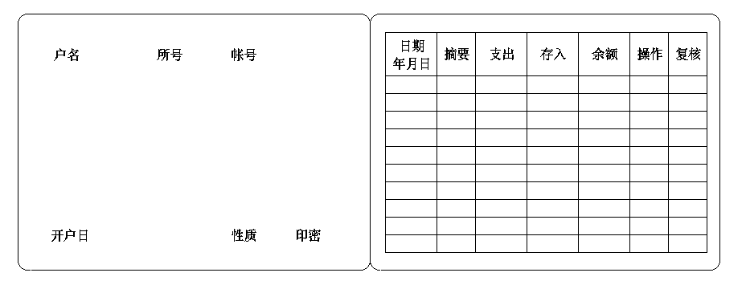

<!-- slide: 76 -->

- 存折＝户名＋所号＋帐号＋开户日＋性质＋(印密)＋1{存取行}50
- 户名＝2{字母}24
- 所号＝“001”..“999”
- 帐号＝“00000001”..“99999999”
- 开户日＝年＋月＋日
- 性质＝“1”..“6”   注：“1”表示普通户，“5”表示工资户等
- 印密＝“0”   注：印密在存折上不显示
- 存取行＝日期＋（摘要）＋支出＋存入＋余额＋操作＋复核

<!-- slide: 77 -->

## 数据流条目

- 给出DFD中某个数据流的定义，通常包括：
- 数据流标识
- 数据流来源
- 数据流去向
- 数据流的数据组成
- 流动属性描述：频率、数据量

<!-- slide: 78 -->

## 举例：

- 购
- 书
- 单
- 发票
- 领书单
- 审查并
- 开发票
- 开领
- 书单
- 无效书单
- 学生
- 1
- 2
- 各班学生
- 用 书 表
- 学生
- 教材存量表

<!-- slide: 79 -->

## 数据流条目说明举例

  - 数据流名:购书单
  - 别名: 无
  - 简述: 学生购书时填写的项目
  - 来源: 学生
  - 去向: 加工1“审查并开发票”
  - 组成: (学号)＋姓名＋｛书号＋数量｝
  - 数据流量:1000次/周
  - 高峰值：开学期间1000次/天

<!-- slide: 80 -->

## 数据存储条目(数据文件词条)

- 对某个文件的定义，包括：
- 文件名
- 描述
- 数据结构
- 数据存储方式
- 关键码
- 存取频率和数据量
- 安全性要求

<!-- slide: 81 -->

## 数据存储条目说明举例

  - 文件名:库存记录
  - 别名:  无
  - 简述:存放库存所有可供货物的信息
  - 组成：货物名称＋编号＋生产厂家
  - ＋单价＋库存量
  - 组织方式：索引文件，以货物编号为
  - 关键字
  - 查询要求:要求能够立即查询

<!-- slide: 82 -->

## 数据项条目(数据元素词条)

- 不可再分解的数据单位，包括：
- 名称
- 描述
- 数据类型
- 长度(精度)
- 取值范围及缺省值
- 计量单位
- 相关数据元素及数据结构

<!-- slide: 83 -->

## 数据项条目说明举例

  - 数据项名:货物编号
  - 别名:G-No,G-num
  - 简述:本公司的所有货物的编号
  - 类型:字符串
  - 长度：10
  - 取值范围及含义:
  - 第1位：[J｜G]      (进口/国产)
  - 第2∼4位：LB01.. LB29  (类别)
  - 第5∼7位：“A00”..“A99” (规格)
  - 第8∼10位：“001”..“999”(品名编号)

<!-- slide: 84 -->

## 存折＝户名＋所号＋帐号＋开户日期＋性质 
      ＋（印密）＋1{存取行}50
户名＝2{字母}24
所号＝“001”..“999”(注：储蓄所编码，
                           规定三位数字)
帐号＝“00000001”..“99999999”
      (注：帐号规定由八位数字组成)
开户日期＝年＋月＋日
性质＝“1”..“6”(注：“1”表示普通户，
                       “5”表示工资户等)
印密＝“0”(注：印密在存折上不显示)
存取行＝日期＋（摘要）＋指出＋存入＋余额 
        ＋操作＋复核

<!-- slide: 85 -->

## 年＝[2001｜2002｜2003｜2004]
月＝“01”..“12”　
日＝“01”..“31”
摘要＝1{字母}4(注：表明该存取是存？是取？   
                   还是换？)
支出＝金额(注:金额规定不超过9999999.99元)
存入＝金额
余额＝金额　
金额＝“0000000.01”..“9999999.99”
操作＝“00001”..“99999”
复核＝“00001”..“99999”
字母＝[“a”..“z”｜“A”..“Z”]

<!-- slide: 86 -->

## 加工条目(加工逻辑说明)

- 加工类条目即数据处理描述，也称为小说明。描述实现加工的策略而不是实现加工的细节。
- 小说明可认为是DD的组成部分。
- 也可在DD中定义只说明每个加工的组成(每个处理分解成多少小处理),而在小说明中详细描述它的处理逻辑.

<!-- slide: 87 -->

## 加工条目(加工逻辑说明)

- 加工逻辑名:登记报名单
- 编号：1.0
- 激活条件：收到报名单
- 加工逻辑：{1.1 检查报名单
- + 1.2 编准考证号
- + 1.3 登记考生}
- 执行频率：2000次/日

<!-- slide: 88 -->

## 3.小说明(加工逻辑说明的另一种形式)

- 描述的内容：
- (1) 处理逻辑
- 描述基本加工如何把输入数据流变化为输出数据流的加工原则，不涉及具体处理方法。
- (2) 执行条件
- (3) 输入
- (4) 输出
- (5) 优先级
- (6) 执行频率
- (7) 出错处理对策

<!-- slide: 89 -->

## 小说明举例

- 加工名:    分类采购(CG111MD)
- 编号:      1.1.1
- 加工激活条件:     采购操作命令
- 加工逻辑:  (1)  1.1.1.1 预定图书
- (2)  1.1.1.2 外采图书
- (3)  1.1.1.3 赠送图书
- 执行频率:  随时

<!-- slide: 90 -->

## 小说明举例

- 处理名:月票额统计(MHCW713MD)
- 编号:  7.1.3
- 激活条件:收到每日售票额信息，并到月底
- 处理逻辑:1 统计月保险金总合
- 月保险金信息=每日日保险
- 金信息之和
- 2 统计月合计
- 月合计信息=每日日合计信息之和
- 执行频率: 1次/月

<!-- slide: 91 -->

## 状态迁移图

- 行为建模给出需求分析方法的所有操作原则
- 状态—迁移图(STD)或状态—迁移表来描述系 统或对象的状态，以及导致系统或对象的状态改变的事件，从而描述系统的行为。

<!-- slide: 92 -->

## 状态迁移图

<!-- slide: 93 -->

- 状态迁移图的细化
- 状态迁移图变形，使用
- 加进判断框和处理框的记法。

<!-- slide: 94 -->

## 描述加工逻辑的工具对数据流图的每一个基本加工，必须有一个基本加工逻辑说明基本加工逻辑说明必须描述基本加工如何把输入数据流变换为输出数据流的加工规则加工逻辑说明必须描述实现加工的策略而不是实现加工的细节加工逻辑说明中包含的信息应是充足的，完备的，有用的，无冗余的

- 结构化语言
- 判定表
- 判定树

<!-- slide: 95 -->

## 结构化语言

- 介于自然语言和形式语言之间的语言，结构化语言的特点：
    - 无确定语法
    - 可分层、嵌套

<!-- slide: 96 -->

## 1. 结构化英语(PDL)

- 结构化英语的词汇表由
  - 英语命令动词
  - 数据词典中定义的名字
  - 有限的自定义词
  - 逻辑关系词 IF_THEN_ELSE、
  - CASE_OF 、 WHILE_DO、
  - REPEAT_UNTIL等组成。

<!-- slide: 97 -->

- 其基本控制结构有三种：
  - 简单陈述句结构：避免复合语句
  - 重复结构：while_do 或repeat_until 结构
  - 判定结构：if_then_else 或case_of 结构

<!-- slide: 98 -->

## 商店业务处理系统中“检查发货单”

- if 发货单金额超过$500 then
- if 欠款超过了60天 then
- 在偿还欠款前不予批准
- else （欠款未超期）
- 发批准书，发货单
- else （发货单金额未超过$500）
- if 欠款超过60天 then
- 发批准书，发货单及赊欠报告
- else （欠款未超期）
- 发批准书，发货单

<!-- slide: 99 -->

## 处理名:核实订票处理(MHGP3200MD)
编号:  3.2
激活条件:收到订票信息
处理逻辑:1读订票旅客信息文件
         2搜索此文件中是否有与输入信息
          中姓名及身份证号相符的项 
          IF 有
           THEN 判断余项是否与文件中信                     
                息相符
             IF 是 THEN 输出已订票信息
                   ELSE 输出未订票信息
           ELSE  输出未订票信息
执行频率: 实时

<!-- slide: 100 -->

## 判定表

- 如果数据流图的加工需要依赖于多个逻辑条件的取值，使用判定表来描述比较合适
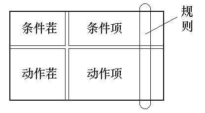

<!-- slide: 101 -->

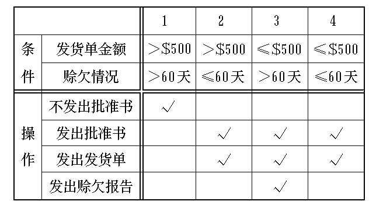
- 以“检查发货单”为例

<!-- slide: 102 -->

## 判定表(决策表)

- 判定表举例 (计算机票折扣率)
- 旅游时间
- 订 票 量
- 折 扣 量
- 7－9，12月
- ≤20
- ≤20
- > 20
- > 20
- 15%
- 5%
- 20%
- 30%
- 条件类别
- 四种条件组合
- 操作
- 条件组合下操作的执行
- 1－6,10,11月

<!-- slide: 103 -->

## 处理名:计算折扣率(MHGP534MD)
编号:  5.3.4
激活条件:收到预订票信息
处理逻辑:计算折扣率

- 旅游时间
- 订 票 量
- 折 扣 量
- 7－9，12月
- 1－6,10,11月
- ≤20
- ≤20
- > 20
- > 20
- 15%
- 5%
- 20%
- 30%
- 执行频率: 实时

<!-- slide: 104 -->

## 判定树(Decision 决策树)

- 条件1      条件2    结果
- 计  7－9,    订票量>20:  15%
- 算  12月     订票量≤20:  5%
- 折
- 扣  1－6,    订票量>20:  30%
- 量  10,11月  订票量≤20:  5%

<!-- slide: 105 -->

- 检
- 查
- 发
- 货
- 单
- 金额>$500
- 金额$500
- 欠款>60天
- 不发出批准书
- 欠款60天
- 发出批准书、
- 欠款>60天
- 发出批准书、
- 发货单及赊欠报告
- 欠款60天
- 发出批准书、
- 发货单

<!-- slide: 106 -->

## 二. 结构化分析实施步骤

- 1. 确定系统边界, 画出系统环境图
- 2. 自顶向下，画出各层数据流图
- 3. 定义数据字典
- 4. 定义小说明

<!-- slide: 107 -->

## 三. 需求规格说明书(SRS)

- (Software Requirement Specification)
- 需求分析阶段要完成的文档。
- SRS的作用：
  - 开发者与用户间事实上的技术合同书
  - 开发者下一步设计和编码的基础
  - 测试验收目标系统的依据

<!-- slide: 108 -->

## SRS大纲（模板）

- 引言
- 任务概述(项目概述)
- 数据描述(DFD、DD)
- 功能描述
- 接口
- 性能需求
- 属性
- 其它需求

<!-- slide: 109 -->

## 三. 需求验证

- (1) 正确性
- (2) 无二义性
- (3) 完整性
- (4) 可验证性
- (5) 一致性
- (6) 可理解性
- (7) 可修改性
- (8) 可被跟踪性
- (9) 可跟踪性
- (10)设计无关性
- (11)注释

<!-- slide: 110 -->

## 需求文档的陈述与改进举例（1）

- 产品必须在固定的时间间隔内提供状态消息，并且每次时间间隔不得小于60秒。
- 后台任务管理器(BTM)应该在用户界面的指定区域显示状态消息。
- a.   在后台任务进程启动之后，消息必须每隔60(10)秒更新一次，并且保持连续的可见性。
- b.  如果正在正常处理后台任务进程，那么后台任务管理器(BTM)必须显示后台任务进程已完成的百分比。
- c.   当完成后台任务时，后台任务管理器(BTM)必须显示一个“已完成”的消息。
- d.   如果后台任务中止执行，那么后台任务管理器(BTM)必须显示一个出错信息。
- 需求不完整，导
- 致需求不可验证
- 改
- 进

<!-- slide: 111 -->

## 需求文档的陈述与改进举例（2）

- 产品必须在显示和隐藏非打印字符之间进行瞬间切换。
- 用户在编辑文档时，通过激活特定的机制，可以在显示和隐藏所有HTML标记之间进行切换
- 需求不可行、不完整、
- 不确定性，导致需求
- 不可验证
- 改
- 进
