# 第五章 软件测试

<!-- slide: 1 -->

## 软件测试

<!-- slide: 2 -->

## 软件开发过程必须伴有质量保证活动。
软件测试是软件质量保证的关键元素，代表了规约、设计和编码的最终检查。

- 基本概念

<!-- slide: 3 -->

## 有关测试的思考题

- 软件测试是一门非常重要的学科，主要研究内容是什么？
- 软件测试需要什么样的专业基础
- 软件质量到底是什么？
- 测试的目标是什么？
- 开发一个测试系统之前你是否明白:
  - 可以测试什么？
  - 应该测试什么？
  - 最终能够测试什么？

<!-- slide: 4 -->

## 软件产品最大的成本是检测软件错误、修正软件错误的成本。

在整个软件开发中，测试工作量一般占30%～40%，甚至≥50%。在人命关天的软件(如飞机控制、核反应堆等）测试所花费的时间往往是其它软件工程活动时间之和的三到五倍。

<!-- slide: 5 -->

## 软件测试的认识的发展

- 软件测试是伴随着软件的产生而产生的。早期的软件开发过程中，测试的含义比较狭窄，将测试等同于“调试”，目的是纠正软件中已经知道的故障，常常由开发人员自己完成这部分的工作。对测试的投入极少，测试介入也晚，常常是等到形成代码，产品已经基本完成时才进行测试。
- 直到1957年，软件测试才开始与调试区别开来，作为一种发现软件缺陷的活动。由于一直存在着“为了让我们看到产品在工作，就得将测试工作往后推一点”的思想，测试仍然是后于开发的活动。潜意识里，我们的目的是使自己确信产品能工作。
- 到了20世纪70年代，尽管对“软件工程“的真正含义还缺乏共识，但这一词条已经频繁出现。1972年，在美国北卡罗来纳大学举行了首届软件测试正式会议。1979年，《软件测试艺术》中作出了当时最好的软件测试定义：“测试是为发现错误而执行的一个程序或者系统的过程。”

<!-- slide: 6 -->

## 软件测试的认识的发展

- 直到上世纪80年代早期，“质量”的号角才开始吹响。软件测试定义发生了改变，测试不单纯是一个发现错误的过程，而且包含软件质量评价的内容。软件开发人员和测试人员开始坐在一起探讨软件工程和测试问题。
- 《软件测试完全指南》一书中指出：“测试是以评价一个程序或者系统属性为目标的任何一种活动。测试是对软件质量的度量。”
- 上世纪90年代，测试工具终于盛行起来。人们普遍意识到，工具不仅仅是有用的，而且要对今天的软件系统进行充分的测试，工具是必不可少的。

<!-- slide: 7 -->

## 软件测试的现实和理想

- 软件测试绝对不是开发活动完成后的收尾工作，很多大型的开发项目，测试会占据项目周期一半以上的时间。
- 以IE4.0为例，代码开发时间为6个月，而稳定程序花去了8个月的时间。”前微软亚洲研究院博士、软件测试专家陈宏刚谈道。从投入的资金和人力物力来看，测试、使产品稳定和修改花去的时间可能占到80%。

<!-- slide: 8 -->

## 软件测试的现实和理想

- 还处在婴儿期
- 软件测试之所以发展相对缓慢，一个原因是做研究和做开发的人交流的机会相对少。只有做大型系统工程的人才会对测试提出较高的要求，重要性才能显现出来，而做研究和教学的人没有大型系统工程案例，所以造成了测试理论研究的发展缺乏充实的基础材料。真正做大型系统开发的工程师，又没有时间将第一手的测试经验变成系统的理论。
- “在美国，佛罗里达州和华盛顿州分别有一所大学开设软件测试课程，其他有正规课程的学校不是很多。软件测试正停留在没有学科系统、没有系统教育的阶段。虽然已经有学校开设了这门课程，但是使用的教学案例，多半是单机软件，还谈不上系统的理论。”陈宏刚博士介绍说。

<!-- slide: 9 -->

## 软件测试的现实和理想

- 高素质的“杂牌军”
- 由于企业对测试人才有着迫切的需要，因此，只好自己培养测试人才队伍。例如微软公司，对不同的产品制定测试规范，开设一些课程，通过讲座的形式对测试技术人员进行培训，但是也还未形成系统的理论。
- 即使在微软，测试队伍是典型的“杂牌军”，没有科班，没有统一的专业，更多的是具有丰富的经验和不同行业背景的员工，例如具有语言学、数学、物理学、计算机、工程、管理等学科等背景的员工。但是，这不是说随便什么人都可以做测试工作，陈宏刚工作过的那个试验室，20个人中有7个博士。可见，虽然测试不是一个专门的学科，但是，这个部门对于一个成熟的软件企业又是至关重要的部门。

<!-- slide: 10 -->

## 软件测试的现实和理想

- 认识需再提高
- IBM和微软公司属于领先的大公司，对测试的认识也经历了一个过程。开始的时候，也是开发人员兼职做测试，就像今天国内一些较小规模的软件企业。但是，后来的结果表明，花在软件修补上面的费用太高，以至于远远超出了所能够允许的范围。这个时候，增加测试队伍的规模，提高测试队伍的素质，提高测试队伍的待遇和受重视的程度是更加划算的。
- 还有一个问题是，很多工程师不愿意做测试，认为是一种打下手的工作，没有前途，这也是国内比较大软件企业面临的问题。所以，企业从上到下普遍自觉和不自觉地只重视技术，不重视质量，后果是产品在市场上竞争力不高，产品售后维护和服务费用偏高。

<!-- slide: 11 -->

## 软件测试面临的挑战

- 虽然软件测试技术的发展很快，但是其发展速度仍落后于软件开发技术的发展速度，使得软件测试在今天面临着很大的挑战，主要体现在以下几个方面：
- 1．软件在国防现代化、社会信息化和国民经济信息化的作用越来越重要，由此产生的测试任务越来越繁重。
- 2．软件规模越来越大，功能越来越复杂，如何进行充分而有效的测试成为难题。
- 3．面向对象的开发技术越来越普及，但是面向对象的测试技术却刚刚起步。
- 4．对于分布式系统整体性能还不能进行很好的测试。
- 5．对于实时系统来说，缺乏有效的测试手段。
- 6．随着安全问题的日益突出，信息系统的安全性如何进行有效的测试与评估，成为世界性的难题。

<!-- slide: 12 -->

## 高质量的软件

- 应该是相对的无产品缺陷(Bug Free)或只有极少量的缺陷, 它能够准时递交给用户并且所用的费用都是在预算内的并且满足客户需求，是可维护的。但是, 有关质量的好坏最终评价依赖于用户的反馈。
- “客户”广义定义 :
- 内在的定义 : 下一个环节/工序的接收者，更广的服务的对象，周围有任何联系或影响的团队、人。
- 软件的设计者，程序的检测者，项目管理者，品质管理人员 …
- - 广泛的定义 : 最终用户，客户管理，

<!-- slide: 13 -->

## 软件缺陷(Bug)是什么

- 任何程序、系统中的问题，和产品设计书的不一致性，不能满足用户的需求

<!-- slide: 14 -->

## 问题出在哪里？

- 项目没有被很好地理解；计划不周，最终导致进度拖延。
- 没有充分的文档资料。
- 人与人的交流比写程序困难得多。
- 软件可靠性缺少度量的标准，质量无法保证。
- 软件难以维护、不易升级。

<!-- slide: 15 -->

## 软件缺陷

- IEEE (1983) 729 软件缺陷一个标准的定义：
- 从产品内部看，软件缺陷是软件产品开发或维护过程中所存在的错误、毛病等各种问题；
- 从外部看，软件缺陷是系统所需要实现的某种功能的失效或违背。

<!-- slide: 16 -->

## 软件缺陷

- 软件缺陷的主要类型/现象：
- 功能、特性没有实现或部分实现
- 设计不合理，存在缺陷
- 实际结果和预期结果不一致
- 运行出错，包括运行中断、系统崩溃、界面混乱
- 数据结果不正确、精度不够
- 用户不能接受的其他问题，如存取时间过长、界面不美观

<!-- slide: 17 -->

## 软件缺陷的产生

- 技术问题
- 算法错误，语法错误，计算和精度问题，接口参数传递不匹配
- 团队工作
- 误解、沟通不充分
- 软件本身
- 文档错误、用户使用场合(user scenario)，
- 时间上不协调、或不一致性所带来的问题
- 系统的自我恢复或数据的异地备份、灾难性恢复等问题

<!-- slide: 18 -->

## 软件缺陷构成

<!-- slide: 19 -->

## 软件缺陷在不同阶段的分布

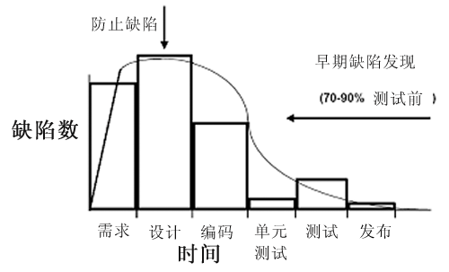
- 在真正的程序测试之前，通过审查、评审会可以发现更多的缺陷。
- 规格说明书的缺陷会在需求分析审查、设计、编码、测试等过程中会逐步发现，而不能在需求分析一个阶段发现

<!-- slide: 20 -->

## 缺陷成本

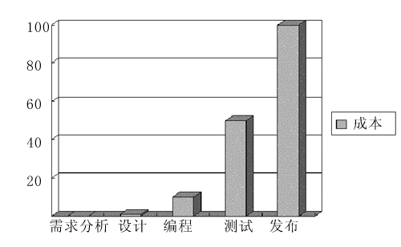

<!-- slide: 21 -->

## 软件测试

- 实践证明：对软件进行充分的测试
- 才能够有效的保证软件质量
- 对软件产品进行充分测试，找出其中的缺陷(Bug),并进行修复(Fix)。

<!-- slide: 22 -->

## G.J.Myers在<软件测试技巧>中认为:
1.测试是为了寻找错误而运行程序的过程。
2.一个好的测试用例是指很可能找到迄今为止尚未发现的错误的测试。
3.一个成功的测试是揭示了迄今为止尚未发现的错误的测试。
软件测试是质量控制的重要手段，保证客户拿到或用户使用高质量的软件产品

- 测试的目的与地位

<!-- slide: 23 -->

## E.W.Dijkstra 指出:
“程序测试能证明错误的存在,但不能证明错误不存在。”

测试的目的是发现程序中的错误,是为了证明程序有错, 而不是证明程序无错。

<!-- slide: 24 -->

- 把证明程序无错当作测试目的不仅是不正确的, 完全做不到的，而且对做好测试没有任何益处，甚至是十分有害的。
- 软件测试要设法使软件发生故障,暴露软件错误。
- 测试的“成功”与“失败”
- 能够发现错误的测试是成功的测试，否则是失败的测试。

<!-- slide: 25 -->

## 难以说清的软件缺陷

- 如果软件中的问题没有人发现，那么它算不算软件缺陷？”
- 古谚： “一片树叶飘落在森林中没有人听见，谁能说它发出了声音？”
- 由于不能报告没有看见的问题，因此，没有看见就不能说存在软件缺陷。
- 只有看到了，才能断言软件缺陷，尚未发现的软件缺陷只能说是未知软件缺陷。
- 眼
- 见
- 为
- 实

<!-- slide: 26 -->

## 软件测试误区

- 误区一：如果发布出去的软件有质量问题，都是软件测试人员的错
- 误区二：软件测试技术要求不高，至少比编程容易多了
- 误区三：有时间就多测试一些，来不及就少测试一些
- 误区四：软件测试是测试人员的事，与开发人员无关
- 误区五：根据软件开发瀑布模型，软件测试是开发后期的一个阶段

<!-- slide: 27 -->

## (1)所有的测试都应追溯到用户需求

     最严重的错误(从用户角度)是那些导致软件无法满足需求的错误。
     程序中的问题根源可能在开发前期的各阶段解决、纠正错误也必须追溯到前期工作。

- 测试原则

<!-- slide: 28 -->

## 测试与开发前期工作的关系

- 决定软件与系统的配合关系
- 需求分析
- 概要设计
- 详细设计
- 编  码
- 单元测试
- 集成测试
- 系统测试

<!-- slide: 29 -->

## 软件生存期各阶段间需保持的正确性

- 用户要求
- 用户:
- 我要什么?
- 运行结果
- 计算机:
- 程序运行得
- 到的结果
- 源程序
- 程序员:
- 我要让计算
- 机什么做?
- 设计说明书
- 设计员:
- 我要让软件
- 做什么?
- 需求说明书
- 分析员:
- 我可以提
- 供什么?
- 1
- 2
- 3
- 4
- 5
- 理解正确性
- 表达正确性
- 理解正确性
- 设计正确性
- 表达正确性
- 理解正确性
- 编码正确性
- 运行正确性
- 输入正确性
- 相符吗?

<!-- slide: 30 -->

## (2)分析和设计时应完成测试计划和测试用例，在真正的测试阶段可以补充和修改测试用例，所有测试可在任何代码被产生之前进行计划和设计。

- 测试原则

<!-- slide: 31 -->

## 软件测试应贯穿于软件定义与开发的整个期间；
 据美国一家公司统计，查出的软件错误中，属于需求分析和软件设计的错误约占 64%，属于程序编写的错误仅占 36%。程序编写的许多错误是“先天的”。

- 软件测试不等于程序测试

<!-- slide: 32 -->

## 单元测试: 检验每个模块能否单独工作。
集成测试:检验概要设计中模块接             口设计问题。
确认测试:以需求规格说明书为检             验尺度。
系统测试: 综合检验

测试可视为分析、设计、编码三个阶段的最终复审,以保证软件质量。

- 测试阶段工作步骤

<!-- slide: 33 -->

## (3)pareto原则：测试发现的错误中80%很可能起源于20%的模块中。应孤立这些疑点模块重点测试。
(4)穷举测试是不可能的。

- 测试原则

<!-- slide: 34 -->

## 测试原则

- 例:测试计算器程序
- 加法测试
- 1+0=
- 1+99999999999999999999999999999999=
- 2+0=
- ……
- 2+99999999999999999999999999999999=
- 99999999999999999999999999999999+99999999999999999999999999999999=
- 1.0+0.1=
- 1.0+0.2=
- ……
- 减法测试
- 乘法测试
- 除法测试
- 求平方根
- 百分数
- 倒数

<!-- slide: 35 -->

## (5)应由独立的第三方来构造测试。
 （开发和测试队伍分别建立）
(6)测试用例应由输入数据和预期的输
   出结果两部分组成。
(7)兼顾合理的输入和不合理的输入数据。
(8)程序修改后要回归测试。
(9)应长期保留测试用例，直至系统废弃。

- 测试原则

<!-- slide: 36 -->

- 数
- 量
- 遗漏软件
- 缺陷数目
- 测试费用
- 测试中
- 测试后
- 软件
- 测试工作量
- 每一个软件项目都有一个最优的测量量
- 最优测量量

<!-- slide: 37 -->

- 测试中用到的模型元素（UML类图）
- 测试组
- 测试用例
- 故  障
- 组 件
- 测试存根
- 测试驱动程序
- 误 差
- 错 误
- 改 正
- 由……修改
- 由……引起
- 由……引起
- 找出
- 使用
- 修改
- 1…n
- *
- *
- *
- *
- *
- *
- *
- *
- *
- *
- *

<!-- slide: 38 -->

- 组件是系统中可以孤立进行测试的部分，一个组件可以是对象，一组对象，一个或多个子系统。
- 错误，也称缺陷或不足，是可能引起组件不正常行为的设计或编码错误。
- 误差是系统执行过程中错误的表现。
- 故障是组件的规格说明与其行为之间的偏差，故障是由一个或多个误差引起的。
- 测试用例是一组输入和期待的结果，它根据引起故障和检查的目的来使用组件。
- 测试存根是被测试的组件所依赖的其它一些组件的实现部分。测试驱动程序是依赖被测试组件的那个组件的实现部分。
- 改正是对组件的变化。改正的目的在于修正错误。改正可能会产生新的错误。

<!-- slide: 39 -->

## 软件测试有关概念—术语和定义

- 验证和合法性检查
  - 验证是检查软件符合产品说明书的过程
  - 合法性检查是保证软件满足用户要求的过程

<!-- slide: 40 -->

## 测试 (test)       调试 (debug)

- 以已知条件开始,
- 使用预先定义的程序,
- 有预知的结果
- 以不可知内部条件开始,结果一般不可预见
- 有计划
- 被动的
- 由独立的测试组，在
- 不了解软件设计的条
- 件下完成
- 由程序作者进行
- 发现错误
- 找出错误位置，排除
- 测试与调试(排错)

<!-- slide: 41 -->

## 选择测试用例是软件测试员最重要的一项工作。
测试用例的属性:
属性               描述
name         测试用例的名称   
location     可执行的完全路径名     
input        输入数据或命令
oracle       与测试输入相比较的期待测试结果
log          测试生产的输出

- 测试用例设计

<!-- slide: 42 -->

## 例：程序 Triangle，输入三个整数，表示一个三角形的三个边长，该程序产生一个结果，指出该三角形是等边三角形、等腰三角形还是不等边三角形。

- 程序测试举例

<!-- slide: 43 -->

## 输入数据      预期结果
(1)  6;6;6         等边
(2)  8;8;4         等腰
(3)  4;5;6         一般        
还应输入非法数据：
         0; 7; 9
         -7;3; 5
         a; 2; 7 等

- 判断三角型的测试用例设计:

<!-- slide: 44 -->

- 软件测试信息流
- 软件
- 配置
- 测试
- 测试
- 配置
- 测试
- 工具
- 结果
- 分析
- 排错
- 可靠性
- 分析
- 测试
- 结果
- 错误
- 预期
- 结果
- 出错率
- 改正
- 的软件
- 预测
- 的可
- 靠性
- 需求规格说明书
- 软件设计说明书
- 被测源程序
- 测试计划
- 测试用例
- (测试数据)
- 测试驱动程序

<!-- slide: 45 -->

## 软件测试的分类和阶段

- 开发生命周期
- ...
- 维护
- 需求定义
- 应用定义
- 应用开发
- 修订
- 建立
- 建立
- 测试生命周期
- ...
- 执行.
- 执行
- 执行.
- 测试计划
- 缺陷跟踪
- 测试开发
- 测试设计
- 评估

<!-- slide: 46 -->

## 软件测试分类

- 方法
- 目标/特性
- 单元测试
- 系统测试
- 验收测试
- 性能测试
- 强壮性测试
- 功能测试
- 白盒测试
- 黑盒测试
- 测试阶段或层次
- 适用性测试
- 可靠性测试
- 集成测试
- 安全性测试

<!-- slide: 47 -->

## 软件测试阶段

| 阶 段 | 输  入 | 输  出 |
|---|---|---|
| 需求分析 | 需求定义, 市场分析文档, 相关技术文档 | 市场需求分析会议记要 , 功能设计,  技术设计 |
| 设计审查 | 市场需求文档,  技术设计文档 | 测试计划,  测试用例 |
| 功能验证   | 代码完成文件包,功能详细设计说明书 最终技术文档 | 完整测试用例,完备的测试计划, 缺陷报告, 功能验证测试报告 |
| 系统测试  | 代码修改后的文件包  完整测试用例,完备的测试计划 | 缺陷报告 缺陷状态报告 项目阶段报告 |
| 确认测试   | 代码冻结文件包 确认测试用例 | 缺陷状态报告 缺陷报告审查 版本审查 |
| 版本发布 | 代码发布文件包  测试计划检查清单 | 当前版本已知问题的清单 版本发布报告 |

<!-- slide: 48 -->

## 测试阶段（SDLC)

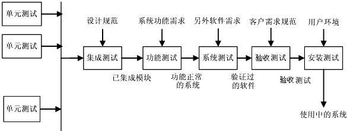

<!-- slide: 49 -->

- 测试的方法与技术
- 软件测试的
- 策略和方法
- 静态测
- 试方法
- 动态测
- 试方法
- 人工测试方法
- 计算机辅助静
- 态分析方法
- 白盒测试方法
- 黑盒测试方法

<!-- slide: 50 -->

- 动态黑盒测试 —闭着眼睛测试软件
- 软件
- 输入
- 不深入代码细节的测试方法称为动态黑盒测试。
- 软件测试员充当客户来使用它。
- 输出

<!-- slide: 51 -->

- 动态白盒测试 —带上X光眼镜测试软件
- ??????????????
- 3581322.293419985680302829734315

- 250*(1+0.015)*((1+0.015)^360-1)/0.015
- 250*(1+0.015)*((1+0.015)^360-1)/0.015
- 假如知道一个盒子包含一台计算机,而另一个
- 盒子是人用纸笔计算,就会选择不同的测试用例
- 了解软件的运作方式会影响测试手段

<!-- slide: 52 -->

## 6.2.1 黑盒测试 
  又称:功能测试
       数据驱动测试
       基于规格说明书的测试

- §6.2 两种类型的测试

<!-- slide: 53 -->

## 又称:开盒测试
     结构测试
     玻璃盒测试
     基于覆盖的测试.
  根据被测程序的逻辑结构设计测试用例;
  力求提高测试覆盖率;

- 6.2.2 白盒测试

<!-- slide: 54 -->

## 黑盒测试是从用户观点，按规格说明书要求的输入数据与输出数据的对应关系设计测试用例, 是根据程序外部特征进行测试。
 
白盒测试是根据程序内部逻辑结构进行测试。

- 黑盒测试与白盒测试比较

<!-- slide: 55 -->

- 黑盒测试          白盒测试
- 优
- 点
- 缺
- 点
- 性
- 质
- ①适用于各阶段测试
- ②从产品功能角度测试
- ③容易入手生成测试数
- 据
- ①可构成测试数据使特定程
- 序部分得到测试
- ②有一定的充分性度量手段
- ③可或较多工具支持
- ①某些代码得不到测试
- ②如果规格说明有误，
- 则无法发现
- ③不易进行充分性测试
- ①不易生成测试数据(通常)
- ②无法对未实现规格说明的
- 部分进行测试
- ③工作量大，通常只用于单
- 元测试，有应用局限
- 是一种确认技术，回答
- “我们在构造一个正确
- 的系统吗？”
- 是一种验证技术，回答
- “我们在正确 地构造一个系
- 统吗？”
- 黑盒测试与白盒测试优缺点比较

<!-- slide: 56 -->

## 例:输入   三条边长  黑盒测试
可采用的测试用例数

(设字长16位)
执行时间: 设测试一次需1ms
          共需一万年。

- =2 X2 X2 ≈3X10
- 16
- 16
- 16
- 14
- 6.2.3  穷举测试

<!-- slide: 57 -->

## 例:含4个分支,循环次数
≤20,从A到B的可能路径

执行时间: 设测试一次需2ms
          穷举测试需5亿年。

- =5+5 +..+5 +5
- ≈10
- 20
- 1
- 2
- 19
- 14
- A
- B
- 6.2.3 穷举测试      白盒测试

<!-- slide: 58 -->

## 不论黑盒还是白盒测试都不能进行穷尽测试, 所以软件测试不可能发现程序中存在的所有错误, 因此需精心设计测试方案, 力争尽可能少的次数,测出尽可能多的错误。

<!-- slide: 59 -->

## 黑盒测试与白盒测试能发现的错误

- C
- B
- A
- D
- -只能用黑盒测试发现的错误
- A
- -只能用白盒测试发现的错误
- -两种方法都能发现的错误
- -两种方法都不能发现的错误
- B
- C
- D

<!-- slide: 60 -->

## 逻辑覆盖法
(1)语句覆盖
(2)判定覆盖
(3)条件覆盖
(4)判定/条件覆盖
(5)条件组合覆盖
(6)路径覆盖
(7)点覆盖
(8)边覆盖

- 白盒测试的测试用例设计

<!-- slide: 61 -->

## 白盒测试用例的设计

- 逻辑覆盖是以程序内部的逻辑结构为基础的设计测试用例的技术，属白盒测试。这一方法要求测试人员对程序的逻辑结构有清楚的了解，甚至要能掌握源程序的所有细节。
- 白盒测试法设计测试用例，有下面常用技术：
  - 语句覆盖
  - 判定覆盖
  - 条件覆盖
  - 判定－条件覆盖
  - 条件组合覆盖
  - 路径覆盖

<!-- slide: 62 -->

## 例:PROCEDURE  SAMPAL   
      (A，B：REAL； VAR X：REAL);
      BEGIN
        IF (A>1) AND (B=0)
          THEN  X:=X/A
        IF (A=2) OR (X>1)
         THEN  X:=X+1
      END;

<!-- slide: 63 -->

- 开始
- (A>1) AND (B=0)
- (A=2) OR (X>1)
- 返回
- X=X/A
- X=X+1
- F
- F
- T
- T
- a
- b
- d
- c
- e

<!-- slide: 64 -->

## 使程序中每个语句至少执行一次

- (1)语句覆盖

<!-- slide: 65 -->

## 语句覆盖

- 开始
- (A>1) AND (B=0)
- (A=2) OR (X>1)
- 返回
- X=X/A
- X=X+1
- F
- F
- T
- T
- a
- b
- d
- c
- e

<!-- slide: 66 -->

## 只需设计一个测试用例:
输入数据：A=2，B=0，X=4
即达到了语句覆盖;

发现不了判断中逻辑运算中出现的错误

语句覆盖是最弱的逻辑覆盖

<!-- slide: 67 -->

## 使每个判定的真假分支都至少执行一次

- (2)判定覆盖(分支覆盖)

<!-- slide: 68 -->

## 判定覆盖

- 开始
- (A>1) AND (B=0)
- (A=2) OR (X>1)
- 返回
- X=X/A
- X=X+1
- F
- F
- T
- T
- a
- b
- d
- c
- e

<!-- slide: 69 -->

## 例:可设计两组测试用例:
A=3，B=0 ，X=3  可覆盖c、d分支  
A=2，B=1 ，X=1  可覆盖b、e分支 
两组测试用例可覆盖所有判定的真假
分支

不能保证一定能查出在判定的条件中出现的错误

判定覆盖仍是弱的逻辑覆盖

<!-- slide: 70 -->

## 使每个判定的每个条件的可能取值至少执行一次

- (3)条件覆盖

<!-- slide: 71 -->

## 设条件 A>1 取真 记为 T1 
             假      T1
  条件 B=1 取真 记为 T2 
             假      T2
第二判定表达式:
设条件 A=2 取真 记为 T3 
             假      T3
  条件 X>1 取真 记为 T4 
             假      T4

- 第一判定表达式:

<!-- slide: 72 -->

## 条件覆盖

- 开始
- (A>1) AND (B=0)
- (A=2) OR (X>1)
- 返回
- X=X/A
- X=X+1
- F
- F
- T
- T
- a
- b
- d
- c
- e
- 满足条件:     T1,T1,
- T2,T2
- T3,T3
- T4,T4

<!-- slide: 73 -->

## 测试用例  通过    满足的      覆盖
A B  X   路径     条件       分支
1 0 3   abe   T1,T2,T3,T4   b,e
2 1 1   abe   T1,T2,T3,T4   b,e

- 两个测试用例覆盖了四个条件八种可能
- 取值。
- 未覆盖c、d分支，不满足判定覆盖的要
- 求.
- 条件覆盖不一定包含判定覆盖
- 判定覆盖也不一定包含条件覆盖

<!-- slide: 74 -->

## 选取足够多的测试用例，使判断中的每个条件的所有可能取值至少执行一次，同时每个判断本身的所有可能判断结果至少执行一次。

- (4)判定-条件覆盖

<!-- slide: 75 -->

## 判定/条件覆盖

- 开始
- (A>1) AND (B=0)
- (A=2) OR (X>1)
- 返回
- X=X/A
- X=X+1
- F
- F
- T
- T
- a
- b
- d
- c
- e
- 满足条件:     T1,T1,
- T2,T2
- T3,T3
- T4,T4

<!-- slide: 76 -->

## 测试用例  通过    满足的     覆盖
A B  X   路径     条件      分支
2 0 4   ace  T1,T2,T3,T4  c,e
2 1 1   abd  T1,T2,T3,T4  b,d 
能同时满足判定、条件两种覆盖标准。
取值。

<!-- slide: 77 -->

## 测试用例  通过    满足的      覆盖
A B X      路径     条件       分支
2 0 3    ace  T1,T2,T3,T4  c,e
2 1 1   abe  T1,T2,T3,T4  b,e
1 0 3   abe  T1,T2,T3,T4  b,e
1 1 1   abd  T1,T2,T3,T4  b,d

<!-- slide: 78 -->

## 所有可能的条件取值组合至少执行一次
A>1,B=0    作T1,T2，属第一个判断的取真分支；
A>1,B≠0   作T1,T2，属第一个判断的取假分支；
A≯1,B=0   作T1,T2，属第一个判断的取假分支；
A≯1,B≠0  作T1,T2，属第一个判断的取假分支；
A=2,X>1    作T3,T4，属第一个判断的取真分支；
A=2,X≯1   作T3,T4，属第一个判断的取真分支；
A≠2,X>1   作T3,T4，属第一个判断的取真分支；
A≠2,X≯1  作T3,T4，属第一个判断的取假分支；

- (5)条件组合覆盖

<!-- slide: 79 -->

| 测试用例 A   B   X | 覆盖路径 | 覆盖条件 | 覆盖组合号 |
|---|---|---|---|
| 2    0    4 | ace | T1,T2,T3,T4 | ①, ⑤ |
| 2     1    1 | abe | T1,T2,T3,T4 | ②, ⑥ |
| 1     0    2 | abd | T1,T2,T3,T4 | ③, ⑦ |
| 1     1    1 | abd | T1,T2,T3,T4 | ④, ⑧ |

<!-- slide: 80 -->

- 遗漏了路径acd
- 结论：测试还不完全

<!-- slide: 81 -->

## (6)路径覆盖
  覆盖每一个可能的路径
测试用例  通过    满足的      覆盖
A B X     路径     条件       分支
1 1 1    abd  T1,T2,T3,T4   b,d
1 1 2   abe  T1,T2,T3,T4   b,e
3 0 1   acd  T1,T2,T3,T4   c,d
2 0 4   ace  T1,T2,T3,T4   c,e

<!-- slide: 82 -->

## 它是在程序控制流图的基础上，通过分析控制构造的环路复杂性，导出基本可执行路径集合，从而设计测试用例，保证在测试中程序中的每一个可执行语句至少执行一次。

- 基本路径测试法

<!-- slide: 83 -->

## 基本路径测试步骤

- ① 根据程序的逻辑结构画出程序框图
- ② 根据程序框图导出流图
- ③ 计算流图G的环路复杂度V(G)
- ④ 确定只包含独立路径的基本路径集
- ⑤ 设计测试用例

<!-- slide: 84 -->

## 程序的控制流图

- 控制流图是描述程序的控制流的一种图示方法，其中，基本的控制结构对应的图形符号是○。符号○成为控制流图的一个结点，表示一个或多个无分支的PDL语句或源程序语句。
- 如果判断内没有复合条件时，一组顺序处理框影射为一个单一的结点
- 如果判断是复合条件时，则需要改复合条件的判断为一系列只有单个条件的嵌套判断
- 选择或多分支结构中分支的汇聚处，即使没有执行语句也要有一个汇聚点
- 边和结点圈定的区域叫做区域，对区域计数时，图形外的区域也计为一个区域

<!-- slide: 85 -->

## 独立路径

- 定义
- 从入口到出口的路径，至少经历一个从未走过的边。这样形成的路径叫做独立路径。
- 优点
- 减少路径数量
- 包含所有的边和节点
- 缺点
- 简化循环结构

<!-- slide: 86 -->

## Step1根据程序逻辑结构画出程序框图

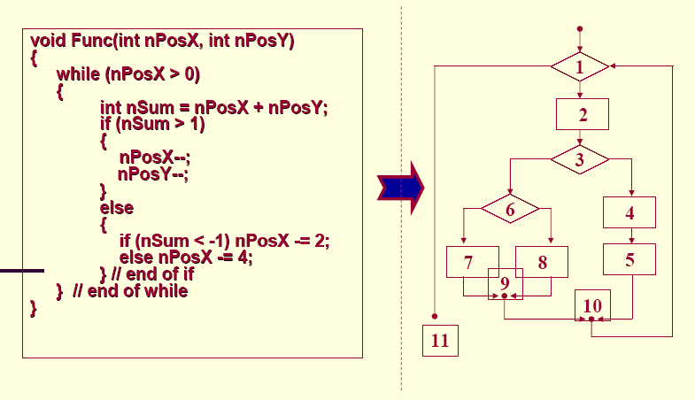

<!-- slide: 87 -->

## Step2 根据流程图画出流图

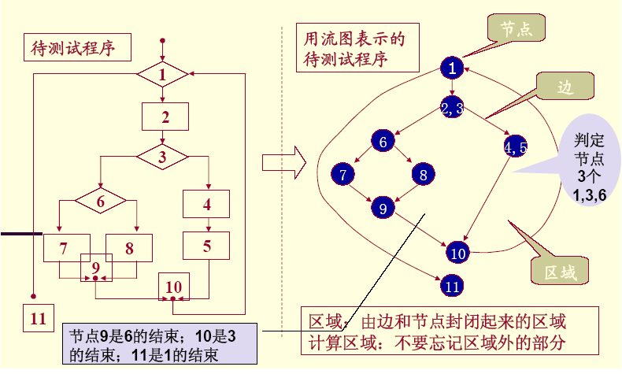

<!-- slide: 88 -->

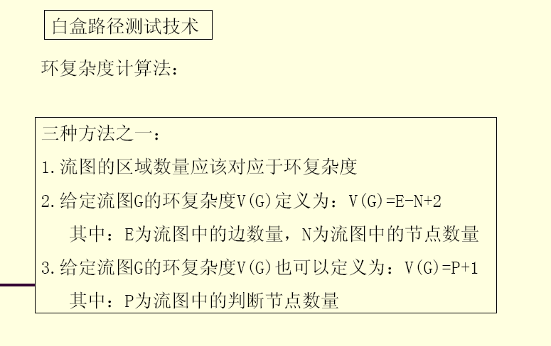

<!-- slide: 89 -->

## Step3 确定基本路径的集合

- 流图的环形复杂度正好＝基本路径的数目
- 计算V(G)的不同方法
- (1) V(G) =区域个数= 4
- (2) V(G) =边的条数-节点个数+2 = 11-9+2=4
- (3) V(G) =判定节点个数+1 = 3+1=4

<!-- slide: 90 -->

## Step3 确定基本路径的集合

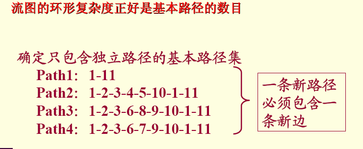

<!-- slide: 91 -->

## Step3 确定基本路径的集合

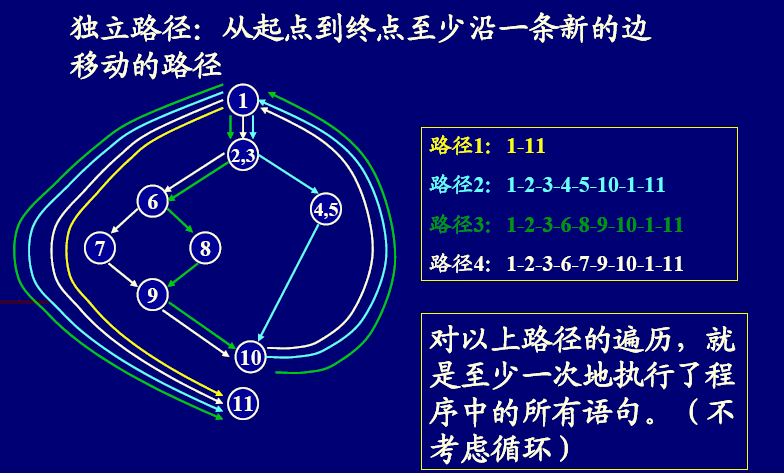

<!-- slide: 92 -->

## Step4 对每条基本路径设计测试

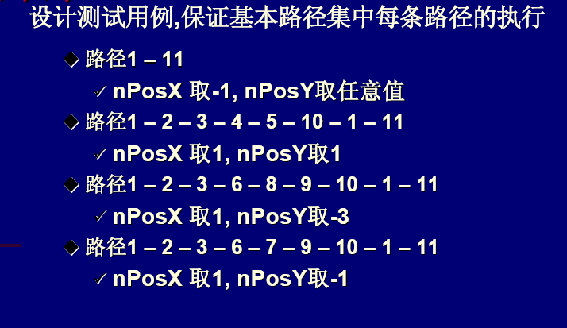

<!-- slide: 93 -->

## 黑盒测试的测试用例设计

- 黑盒测试法是根据被测程序功能来进行测试，所以通常
- 也称为功能测试。用黑盒测试法设计测试用例，有4 种常用
- 技术：
- 等价分类法
- 边界值分析
- 错误猜测法
- 因果图法

<!-- slide: 94 -->

## 黑盒测试用例的设计

- 所谓等价分类，就是把输入数据的可能值划分为
- 若干等价类(等价类是指某个输入域的子集合。 在该
- 集合中，各个输入数据对于揭露程序中的错误都是等
- 价的)。 因此，可以把全部输入数据合理地划分为若
- 干等价类，在每一个等价类中取一个数据作为测试的
- 输入条件，这样就可以少量的代表性测试数据，来取
- 得较好的测试结果。
- 等价分类法

<!-- slide: 95 -->

## 等价分类法

- 是指对于程序的规格说明来说，是合理的
- 有意义的输入数据构成的集合。利用它可以检
- 验程序是否实现预先规定的功能和性能。
- 有效等价类

<!-- slide: 96 -->

## 等价分类法

- 是指对于程序的规格说明来说，是不合理
- 的、无意义的输入数据构成的集合。程序员主
- 要利用这一类测试用例来检查程序中功能和性
- 能的实现是否不符合规格说明要求。
- 无效等价类

<!-- slide: 97 -->

## 等价分类法

- 划分等价类不仅要要考虑代表“有效”输入值
- 的有效等价类，还需考虑代表“无效”输入值的无
- 效等价类。
- 采用这一技术要注意以下两点:
- 每一无效等价类至少要用一个测试用例，不
- 然就可能漏掉某一类错误，但允许若干有效等价
- 类合用同一个测试用例，以便进一步减少测试的
- 次数。

<!-- slide: 98 -->

- 例:某报表处理系统要求用户输入处理报表的日期，日期限制在2001年1月至2005年12月，即系统只能对该段期间内的报表进行处理，如日期不在此范围内，则显示输入错误信息。系统日期规定由年、月的6位数字字符组成，前四位代表年，后两位代表月。如何用等价类划分法设计测试用例,来测试程序的日期检查功能？

<!-- slide: 99 -->

## 如何划分等价类？
有效等价类(合理等价类)
无效等价类(不合理等价类)

<!-- slide: 100 -->

- 划分等价类的规则
- (1)如果输入条件规定了取值范围，可定义一个有效等价类和两个无效等价类。
- 例 输入值是学生成绩，范围是0～100
- 0         100
- 有效
- 等价类
- 1≤成绩≤100
- 无效等价类
- 成绩>100
- 无效等价类
- 成绩<0
- ～

<!-- slide: 101 -->

- 划分等价类的规则
- (2)在输入条件规定了输入值的集合或者规定了“必须如何”的条件的情况下，可以确立一个有效等价类和一个无效等价类。
- 例：输入条件要求：x==5，
- 答案：
- 有效等价类：1个x==5
- 无效等价类：1个：x!=5

<!-- slide: 102 -->

## 划分等价类的规则

- （3）在输入条件是一个布尔量的情况下，可确定一个有效等价类和一个无效等价类。
- 例：输入条件要求：x==ture，
- 答案：
- 有效等价类：1个x==ture
- 无效等价类：1个：x==false

<!-- slide: 103 -->

- 划分等价类的规则
- (4)在规定了输入数据的一组值(假定n个，or关系) ，并且程序要对每一个输入值分别理的情况下，可确立n个有效等价类和一无效等价类（and关系）。
- 例：输入条件说明学历可为:专科、本科、硕士、博士四种之一，
- 答案：
- 有效等价类：4个：专科、or本科、or硕士、or博士
- 无效等价类：1个：!专科and！本科and！硕士and！博士

<!-- slide: 104 -->

- 划分等价类的规则：
- （5）.在规定了输入数据必须遵守的规则的情况下(and关系) ，可确立一个有效等价类(符合规则)和若干个无效等价类(从不同角度违反规则，or关系)。
-  如：要求输入必须满足年龄>18岁，性别＝男，地区＝广东的人。
- 答案:有效等价类：1个：年龄>18岁and性别＝男and地区＝广东
- 无效等价类：3个：年龄<=18岁，or 性别！＝男，or地区！＝广东

<!-- slide: 105 -->

## 划分等价类的规则

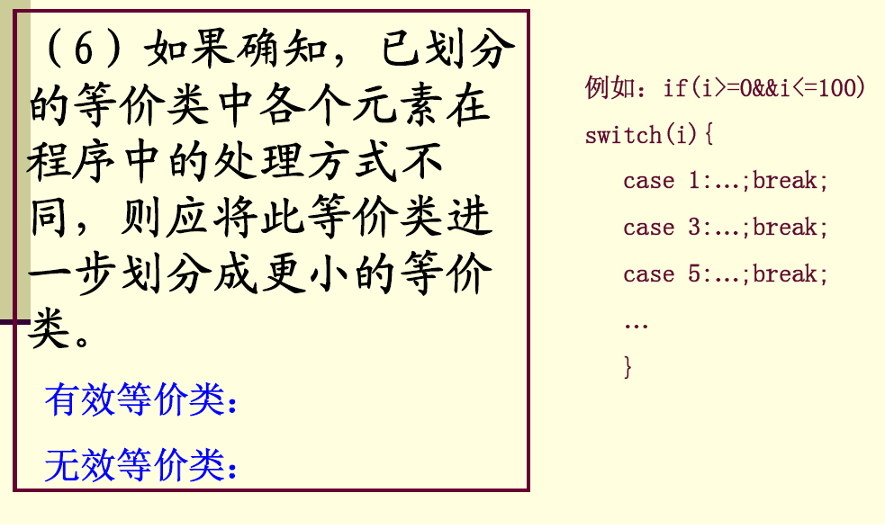

<!-- slide: 106 -->

## 根据等价类创建测试用例的步骤

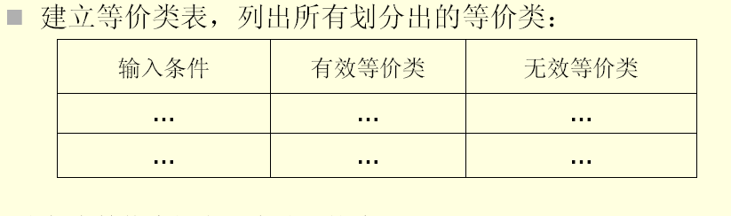

<!-- slide: 107 -->

## 根据等价类创建测试用例的步骤

- 确立测试
- 用例原则
- 为每一个等价类规定一个唯一的编号。
- 设计一个新的测试用例，使其尽可能
- 地覆盖尚未被覆盖的有效等价类，重
- 复这一步，直到所有的有效等价类都
- 被覆盖为止。
- 设计一个新的测试用例，使其仅覆盖
- 尚未被覆盖的无效等价类，重复这一
- 步，直到所有的无效等价类都被覆盖
- 为止。

<!-- slide: 108 -->

- 第一步：等价类划分
- 输入等价类  有效等价类       无效等价类
- 报表日期的
- 类型及长度
- 6位数字字符(1)
- 有非数字字符    (4)
- 少于6个数字字符 (5)
- 多于6个数字字符 (6)
- 年份范围
- 在2001～2005
- 之间 (2)
- 小于2001 (7)
- 大于2005 (8)
- 月份范围
- 在1～12之间(3)
- “报表日期”输入条件的等价类表
- 小于1 (9)
- 大于12 (10)

<!-- slide: 109 -->

- 第二步：为有效等价类设计测试用例
- 测试数据   期望结果     覆盖范围
- 200105
- 等价类(1)(2)(3)
- 输入有效
- 对表中编号为1,2,3的3个有效等价类，用一个测试用例覆盖：

<!-- slide: 110 -->

- 第三步：为每一个无效等价类设至少
- 计一个测试用例
- 测试数据    期望结果      覆盖范围
- 001MAY
- 等价类(4)
- 输入无效
- 20015
- 等价类(5)
- 输入无效
- 2001005
- 等价类(6)
- 输入无效
- 200005
- 等价类(7)
- 输入无效
- 200805
- 等价类(8)
- 输入无效
- 200100
- 等价类(9)
- 输入无效
- 200113
- 等价类(10)
- 输入无效
- 不能出现相同
- 的测试用例
- 本例的10个等价类至
- 少需要8个测试用例

<!-- slide: 111 -->

- 例:对招干考试系统“输入学生成绩”子模块设计测试用例。
- 招干考试分三个专业,准考证号第一位
- 为专业代号,如: 1-行政专业,
- 2-法律专业,
- 3-财经专业.
  - 行政专业准考证号码为:110001～111215
  - 法律专业准考证号码为:210001～212006
  - 财经专业准考证号码为:310001～314015

<!-- slide: 112 -->

- 例:准考证号码的等价类划分
- 有效等价类:
- (1) 110001 ～ 111215
- (2) 210001 ～ 212006
- (3) 310001 ～ 314015
- 无效等价类:
- (4)  -    ～ 110000
- (5) 111216 ～ 210000
- (6) 212007 ～ 31000
- (7) 314016 ～ + 

<!-- slide: 113 -->

- 在某一Pascal语言版本中规定“标识符是由字母开头，后跟字母或数字的任意组合构成。有效字符数为8个，最大字符数为80个”。并且规定：“标识符必须先说明，后使用”。“在同一说明语句中，标识符至少必须有一个”。
- 为用等价类划分的方法得到上述规格说明所规定的要求，本着前述的划分原则，建立输入等价类表。

<!-- slide: 114 -->

| 输入条件 | 有效等价类 | 无效等价类 |
|---|---|---|
| 标识符个数 | 1个（1），多个（2） | 0个（3） |
| 标识符字符数 | 1～8个（4） | 0个（5），>8个（6），>80个（7） |
| 标识符组成 | 字母（8），数字（9） | 非字母数字字符（10），保留字（11） |
| 第一个字符 | 字母（12）非字母字符（13） |  |
| 标识符使用 | 先说明后使用（14） | 未说明已使用（15） |

<!-- slide: 115 -->

- 下面选取了9个测试用例，它们覆盖了所有的等价类。
- ①VAR x,T1234567:REAL;                  }⑴，⑵，⑷，⑻，⑼，⑿，⒁
- BEGIN x:=3.1414; T1234567:=2.732;……
- ②VAR:REAL;                            }⑶
- ③VAR x,:REAL;                          }⑸
- ④VAR T1234567:REAL;                   }⑹
- ⑤VAR T12345……:REAL;                 }⑺ 多于80个字符
- ⑥VAR T$:CHAR;                         }⑽
- ⑦VAR GOTO:INTEGER;                   }⑾
- ⑧VAR 2T:REAL;                          }⒀
- ⑨VAR PAR:REAL;                        }⒂
- BEGIN ……
- PAP := SIN(3.14*0.8) /6;

<!-- slide: 116 -->

- 等价类划分即把输入空间分解成一系列子域，软件在一个子域内的行为应是等价的。
- 软件错误分为两类：计算错误
- 域错误
- 针对计算错误的测试方法
- 针对域错误的测试方法:测试域边界
- 划定的正确性

<!-- slide: 117 -->

## 边界值分析法与等价类划分法区别
(1)边界值分析不是从某等价类中
   随便挑一个作为代表，而是使
   这个等价类的每个边界都要作
   为测试条件。
(2)边界值分析不仅考虑输入条件，
   还要考虑输出空间产生的测试
   情况

- 被测试
- 子  域
- 测试内点
- 测试外点
- 软件边界与悬崖很类似
- 边界值分析法

<!-- slide: 118 -->

## 测试边界线
测试临近边界的合法数据,以及刚超过边界的非法数据。
越界测试通常简单地加1或很小的数(对于最大值)和减1或很小的数(对于最小值)。

<!-- slide: 119 -->

## 边界值设计原则

- 1.如果输入条件规定了值的范围，则应取刚达到这个范围的边界的值，以及刚刚超越这个范围边界的值作为测试输入数据。
- 例如，如果程序的规格说明中规定：“重量在10公斤至50公斤范围内的邮件，其邮费计算公式为… … ”。作为测试用例，我们应取10及50，还应取10.01,49.99,9.99及50.01等。

<!-- slide: 120 -->

## 边界值设计原则

- 2.如果输入条件规定了值的个数，则用最大个数、最小个数、比最小个数少一、比最大个数多一的数作为测试数据。
- 比如，一个输入文件应包括1~255个记录，则测试用例可取1和255，还应取0及256等。

<!-- slide: 121 -->

## 边界值设计原则

- 3.将规则1和2应用于输出条件，即设计测试用例使输出值达到边界值及其左右的值。
- 例如，某程序的规格说明要求计算出“每月保险金扣除额为0至1165.25元”，其测试用例可取0.00及1165.24、还可取一0.01及1165．26等。
- 再如一程序属于情报检索系统，要求每次”最少显示1条、最多显示4条情报摘要”，这时我们应考虑的测试用例包括1和4，还应包括0和5等。

<!-- slide: 122 -->

## 边界值设计原则

- 4.如果程序的规格说明给出的输入域或输出域是有序集合，则应选取集合的第一个元素和最后一个元素作为测试用例。
- 5.如果程序中使用了一个内部数据结构，则应当选择这个内部数据结构的边界上的值作为测试用例。
- 6.分析规格说明，找出其他可能的边界条件。

<!-- slide: 123 -->

- 输入
- 条件
- 报表日
- 期的类
- 型及长
- 度
- 1个数字字符
- 5个数字字符
- 7个数字字符
- 有1个非数字字符
- 全部是非数字字符
- 6个数字字符
- 显示出错
- 显示出错
- 显示出错
- 显示出错
- 显示出错
- 输入有效
- 日期
- 范围
- 月份
- 范围
- “报表日期”边界值分析法测试用例
- 测试用例说明
- 测试数据
- 期望结果
- 选取理由
- 5
- 20015
- 2001005
- 2001.5
- MAY---
- 200105
- 月份为1月
- 月份为12月
- 月份<1
- 月份>12
- 200101
- 200112
- 200100
- 200113
- 200101
- 200512
- 200100
- 200513
- 输入有效
- 输入有效
- 显示出错
- 显示出错
- 输入有效
- 输入有效
- 显示出错
- 显示出错
- 在有效范围
- 边界上选取
- 数据
- 仅有1个合法字符
- 比有效长度少1
- 比有效长度多1
- 只有1个非法字符
- 6个非法字符
- 类型及长度均有效
- 最小日期
- 最大日期
- 刚好小于最小日期
- 刚好大于最大日期
- 最小月份
- 最大月份
- 刚好小于最小月份
- 刚好大于最大月份

<!-- slide: 124 -->

## 等价分类法与边界值分析法的比较

- 1、等价分类法的测试数据是在各个等价类允许的值域内任意选取的，而边界值分析法的测试数据必须在边界值附近选取。
- 2、一般来说，用边界值分析法设计的测试用例要比等价分类法的代表性更广，发现错误的 能力也更强。
- 3、但是对边界的分析与确定比较复杂。

<!-- slide: 125 -->

## 错误推测法

- 所谓猜测，就是猜测被测程序在哪些地方容易
- 出错，然后针对可能的薄弱环节来设计测试用例。
- 显然它比前两种方法更多地依靠测试人员的直觉与
- 经验。所以一般都先用前两方法设计测试用例，然
- 后再用猜测法去补充一些例子作为辅助的手段。
- 错误猜测法

<!-- slide: 126 -->

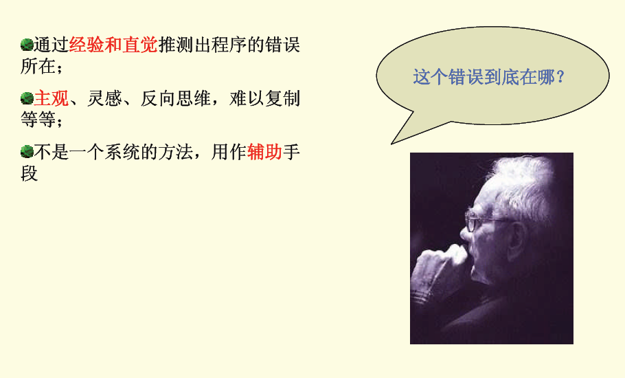

<!-- slide: 127 -->

## 错误推测法

- 错误推测法: 基于经验和直觉推测程序中所有可能存在的各种错误, 从而有针对性的设计测试用例的方法。
- 错误推测方法的基本思想: 列举出程序中所有可能有的错误和容易发生错误的特殊情况,根据他们选择测试用例。
- 例如, 输入数据和输出数据为0的情况；输入表
- 格为空格或输入表格只有一行. 这些都是容易发
- 生错误的情况。可选择这些情况下的例子作为
- 测试用例。

<!-- slide: 128 -->

## 软件必须测试程序的状态及其转换。
测试软件的逻辑流程
建立状态转换图
减少要测试的状态及转换的数量

- 空闲
- 等待用户
- 输入命令
- 按下Esc键
- 显示口令框
- 口令错误
- 消除
- 口令正确
- 初始状态消失
- 空闲
- 等待用户
- 输入命令
- 按下Esc键
- 口令正确
- 口令错误
- 不同形式的状态转换图
- 状态测试

<!-- slide: 129 -->

## 2Bwatch 设置时间功能的状态图和测试结果

- 按左按钮
- 按右按钮
- 按左按钮
- 按右按钮
- 4. 2分钟以后
- 测量时间
- 设置时间
- 电池没电
- 3.按下左右按钮
- 5.按下左右按钮/蜂鸣
- 8. 20年以后
- 7. 20年以后
- 6.
- 2.
- 1.
- 激励因素
- 空集合
- 测量时间
- 1.初始变迁
- 测试的变迁
- 预期结果状态
- 按下左边按钮
- 测量时间
- 2.
- 同时按下两个按钮
- 设置时间
- 3.
- 等2分钟
- 测量时间
- 4.超时
- ……
- ……
- ……

<!-- slide: 130 -->

## 因果图法

- 因果图是借助图形来设计测试用例的一种系
- 统方法。它适用于被测程序具有多种输入条件，
- 程序的输出又依赖于输入条件的各种组合的情况
- 因果图是一种简化了的逻辑图，它能直观地
- 表明程序输入条件（原因）和输出动作（结果）
- 之间的相互关系。
- 因果图法

<!-- slide: 131 -->

## 因果图法

- 着重分析输入条件的各种组合，每种组合就是一个“因”，它必然有一个输出的结果，这就是“果”；
- 与其他的方法相比，更侧重于输入条件的组合
- 作用：
- 能有效检测输入条件的各种组合可能引起的错误和结果；
- 借助图进行测试用例的设计

<!-- slide: 132 -->

## 利用因果图产生测试用例的基本步骤

- (1) 分析软件规格说明描述中，哪些是原因(即
- 输入条件或输入条件的等价类)，哪些是结
- 果(即输出条件)，并给每个原因和结果赋予
- 一个标识符。
- (2) 分析软件规格说明描述中的语义，找出原因
- 与结果之间，原因与原因之间对应的是什么
- 关系? 根据这些关系，画出因果图。

<!-- slide: 133 -->

## 利用因果图产生测试用例的基本步骤

- (3) 由于语法或环境限制，有些原因与原因之
- 间，原因与结果之间的组合情况不可能出
- 现。为表明这些特殊情况，在因果图上用
- 一些记号标明约束或限制条件。
- (4) 把因果图转换成判定表。
- (5) 把判定表的每一列拿出来作为依据，设计
- 测试用例。

<!-- slide: 134 -->

## 基本符号

- 在因果图中用Ci表示原因，用Ei表示结果
- 各结点表示状态，可取“0”或“1”。“0”表示状态不出现，“1”表示状态出现

<!-- slide: 135 -->

## 主要的原因和结果之间的关系

- 恒等
- 原因与结果之间的一对一的对应关系
- 非
- 原因与结果之间的一对一的否定关系
- 或（∨）
- 表示如果几个原因中有一个出现，则结果出现，几个原因均不出现，结果就不出现
- 与（∧）
- 表示几个原因都出现，则结果出现，若几个原因中一个不出现，结果就不出现
- Ci
- Ei
- Ci
- Ei
- Ci
- Ei
- CJ
- ∨
- Ci
- Ei
- CJ
- ∧

<!-- slide: 136 -->

- 某电力公司有A、B、C、D四类收费标准,
- 并规定：
- 居民用电 <100度/月 按A类收费
- ≥100度/月按B类收费
- 动力用电 <10000度/月,非高峰,B类收费
- ≥10000度/月,非高峰,C类收费
- <10000度/月,  高峰,C类收费
- ≥10000度/月,  高峰,D类收费
- 因果图方法实例

<!-- slide: 137 -->

- 用因果图表明输入和输出间的逻辑关系
- 1
- I1
- 2
- B
- ∨
- ∧
- 4
- A
- C
- 3
- 5
- ∧
- D
- I4
- I3
- I2
- ∨
- ∧
- ∧
- ∧
- ∧
- 居民用电
- 动力用电
- <100度/月
- <10000度/月
- 非高峰

<!-- slide: 138 -->

- 把因果图转换为判定表
- 组合条件
- 条件
- (原因)
- 动作
- (结果)
- A
- B
- C
- 1
- 2
- 3
- 1
- 2
- 3
- 4
- 5
- 6
- 1
- 0
- 1
- 1
- 0
- 0
- 0
- 1
- 1
- 0
- 0
- 0
- 1
- 1
- 0
- 0
- 0
- 0
- 1
- 0
- 0
- 0
- 0
- 1
- 1
- 0
- 4
- 1
- 0
- 1
- 0
- 5
- 0
- 0
- 1
- 1
- D
- 0
- 0
- 0
- 1
- 1
- 0
- 0
- 1
- 0
- 0
- 0
- 0
- 测试用例

<!-- slide: 139 -->

- 为判定表每一列设计一个测试用例:
- 1列     居民电,90度/月          A
- 2列     居民电,110度/月         B
- 3列  动力电,非高峰,8000度/月    B
- 4列  动力电,非高峰,1.2万度/月   C
- 5列  动力电,  高峰,0.9万度/月   C
- 6列  动力电,  高峰,1.1万度/月   D
- 条件       测试用例          预期结果
- 组合      (输入数据)        (输出动作)

<!-- slide: 140 -->

## 测试方法的选用

- 测试策略
- 1、在任何情况下都应该使用边界值
- 分析的方法。
- 2、必要时用等价类划分法补充测试
- 方案。
- 3、必要时再用错误猜测法补充测试
- 方案。
- 4、对照程序逻辑，检查已经设计出
- 出的测试方案。可以根据对程序
- 可靠性的要求采用不同的逻辑覆
- 盖标准，如果现有测试方案的逻
- 辑程度没有达到要求的覆盖标准
- 则应再补充一些测试方案。
