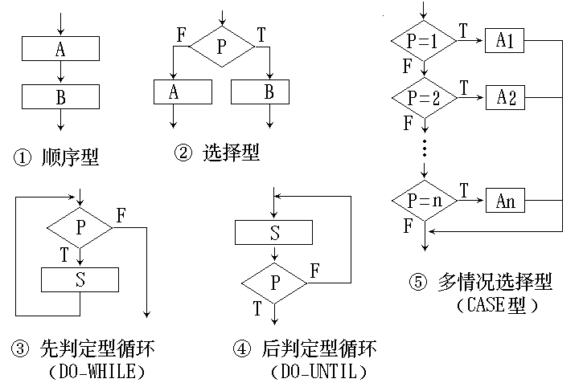
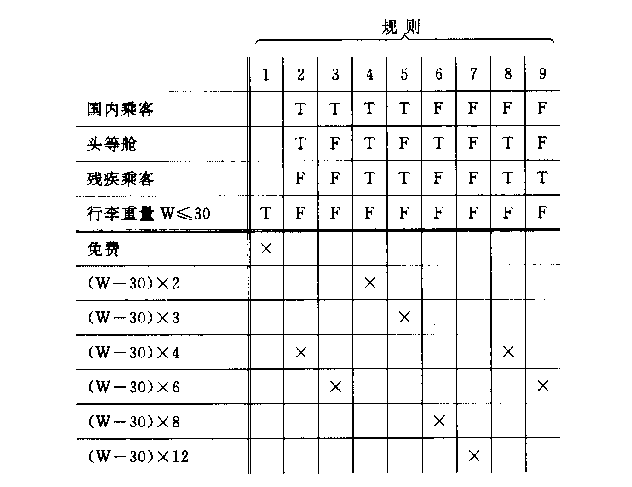
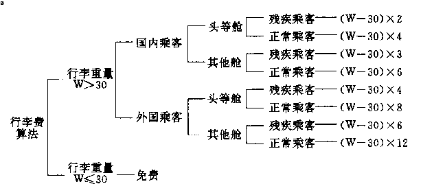

# 第四章 软件设计（二）

<!-- slide: 1 -->

## §4.4概要设计(总体设计)

- 概要设计确定：
- 软件系统的结构
- 各模块功能及模块间联系(接口)
- 表示软件结构的图形工具
  - 结构图

<!-- slide: 2 -->

## 概要设计的任务与步骤

- 概要设计的过程 :
- (1)设想可能的方案
- (2)选取合理的方案
- (3)推荐最佳方案
- (4)功能分解
- (5)设计软件结构
- (6)数据库设计
- (7)制定测试计划
- (8)编写文档
- (9)审查与复审

<!-- slide: 3 -->

## 4.4.1结构图(SC   Structure Chart)

- SD方法在概要设计中的主要表达工具
- 约定：
- 编辑学生记录
- 读学生纪录
- 学生数据
- 无此学生
- 学生
- 不加区分的数据
- 数据信息
- 控制信息

<!-- slide: 4 -->

## SC中的四种模块

- 传入模块
- (a)
- (b)
- A
- A
- 传出模块
- B
- B
- 变换模块
- (c)
- C
- D
- 协调模块
- E
- (d)
- E
- F
- F

<!-- slide: 5 -->

## SC中的选择调用

- A
- C
- B
- D
- A根据内
- 部判断决定是否调用B
- A按另一判
- 定结果选择调用C或D

<!-- slide: 6 -->

## SC中的循环调用

- A
- B
- C
- A根据内在的循环重复调用B、C等模块

<!-- slide: 7 -->

## 结构图(SC)举例

- 医院管理系统
- 门诊
- 管理
- 药房
- 管理
- 药库
- 管理
- 病房
- 管理
- 财务
- 管理
- 处
- 方
- 挂号
- 处理
- 挂
- 号
- 费
- 总
- 计
- 挂
- 号
- 单
- 挂
- 号
- 费
- 总
- 计
- 出库
- 处理
- 进药
- 管理
- 病历
- 管理
- 处方
- 管理
- 常规
- 处理

<!-- slide: 8 -->

## 酒店管理信息系统功能结构图

- H M I S
- 收银管理子系统
- 客房管理子系统
- 餐饮管理子系统
- 客人登记
- 预定登记
- 客房处理
- 历史记录
- 客房查询
- 预定查询
- 餐桌安排
- 菜单作业
- 营业结帐
- 汇总打印
- 各类查询
- 初始设置
- 客帐处理
- 退房处理
- 夜审处理
- 客帐查询
- 报表打印

<!-- slide: 9 -->

## 大型零售商场管理信息系统功能结构图

- TM M I S
- 系统维护
- POS系统
- 零售实时系统
- 商品进货管理
- 商品批发管理
- 商品库存管理
- 商品及商品帐管理
- 顾客管理
- 连锁店管理
- 财务管理
- 人事工资管理
- 计划统计管理
- 经理查询

<!-- slide: 10 -->

## 4.4.2 面向数据流的设计方法     (结构化设计方法SD)

- 1. 面向数据流设计方法的基本概念
- SD以数据流图为基础，它定义了把DFD变换成软件结构的不同映射方法
- 映射
- DFD
- (问题结构)
- 软件系统的结构
- (程序结构)

<!-- slide: 11 -->

## 系统结构特征可归纳为两种典型形式：

- 变换型结构
- 事务型结构
- 数据流图可分为两种类型：
- 变换型数据流
- 事务型数据流

<!-- slide: 12 -->

## 基本模型          特征

- 变换
- 中心
- 输入
- 输出
- 变换型结构
- 事务
- 中心
- 接受
- 路径
- 动
- 作
- 路
- 径
- 事务型
- 结构
- 由输入、变换中心和输出三部分组成
- 具有在多种事务中选择执行某类事物的能力

<!-- slide: 13 -->

- 变换型
- 数据流
- 结构
- 事务型
- 数据流
- 结构
- 传入
- 变换
- 传出
- 变换
- 中心
- 传入
- 部分
- 传出
- 部分
- 事务
- 分析
- 事务
- 中心
- 动作
- 1
- 动作
- 2
- 动作
- 3
- 接受
- 接受
- 部分

<!-- slide: 14 -->

## 变换型数据流举例

- 输入
- 信息
- 物理
- 输入
- 格式
- 检查
- 处理
- 显示
- 正确
- 信息
- 结果
- 物理
- 输出
- 数据
- 变换中心
- 逻辑
- 输入
- 逻辑
- 输出
- 传入部分
- 传出部分
- 特点：具有明确的传入、变换(或称主加
- 工) 和传出界面的DFD

<!-- slide: 15 -->

## 事务型数据流图举例

- I
- M
- L
- N
- O
- A
- B
- C
- D
- F
- E
- G
- H

<!-- slide: 16 -->

## 大型系统DFD中,变换型和事务型
结构往往共存:

- T
- 事务中心
- 传入
- 变换
- 传出

<!-- slide: 17 -->

## 2.  面向数据流设计方法的设计步骤

- (1)精化DFD
- (2)确定DFD类型
- (3)把DFD映射到系统模块结构设计出模块结构的上层
- (4)基于DFD逐步分解高层模块设计出下层模块
- (5)根据模块独立性原理，精化模块结构
- (6)模块接口描述

<!-- slide: 18 -->

## 面向数据流方法的设计过程

- 精化数据流图
- 区分事务中心
- 和数据接收路径
- 映射成变换结构
- 流类型
- 区分输入和
- 输出分支
- 映射成事务结构
- 设计规则精化软件结构
- 导出接口描述和全程数据结构
- 复查
- 详细设计
- “事务”
- “变换”
- 事务分析
- 变换分析

<!-- slide: 19 -->

## SD方法的两种映射过渡方法

- 变换型DFD
- 事务型DFD
- 初始SC
- 初始SC
- 变换分析
- 事务分析

<!-- slide: 20 -->

## 初始的SC

- 主模块
- 输入模块
- 主加工模块
- 输出模块
- 事务控制模块
- 接受模块
- 动作发送模块
- 动作1模块
- 动作2模块
- 动作3模块
- 由变换分析产生
- 由事务分析产生

<!-- slide: 21 -->

## (1) 变换分析设计方法

- 步骤：
- (1)区分传入、变换中心、
- 传出部分，在 DFD 上
- 标明分界线

<!-- slide: 22 -->

- B
- C
- A
- D
- E
- Q
- P
- R
- W
- U
- V
- a
- b
- c
- e
- d
- r
- p
- u
- w
- v
- 变换中心
- 传入部分
- 传出部分

<!-- slide: 23 -->

## 变换分析设计方法步骤

- (2)第一级分解(建立初始SC框架)
- 设计顶层和第一层模块

<!-- slide: 24 -->

- 第一级分解的方法
- MC
- MT
- MA
- ME

<!-- slide: 25 -->

## 第一级分解后的SC

- MC
- MT
- MA
- ME
- 第一层
- 顶层
- c,e
- c,e
- u,w
- u,w
- 传入模块
- 传出模块
- 中心变
- 换模块

<!-- slide: 26 -->

## 第一级分解后的SC(另一种画法)

- MC
- MA1
- c
- e
- u,w
- c,p
- Q
- P
- R
- e
- p
- r
- r
- w,u
- w
- 传入分
- 支模块
- 中心加工分支模块
- 传出分
- 支模块
- MA2
- ME1
- ME2

<!-- slide: 27 -->

## 变换分析设计方法步骤

- (3)第二级分解(分解SC各分支)
- 自顶向下分解，设计出每个分支的中、下层模块

<!-- slide: 28 -->

## 传入分支的分解(1)

- MA
- C
- B
- A
- b
- a
- c
- E
- D
- d
- e
- c,e

<!-- slide: 29 -->

## 传入分支的分解(2)

- c,e
- MA
- Get C
- b
- a
- c
- Read D
- d
- e
- B to C
- b
- c
- d
- e
- a
- b
- Get E
- Get B
- D to E
- AtoB
- Read A

<!-- slide: 30 -->

## 传出分支的分解

- ME
- W
- Write V
- u
- u
- w,u
- v
- v
- v
- Put U
- U to V
- ME
- U
- Write W
- w
- w
- u
- w,u
- V
- (1)
- (2)

<!-- slide: 31 -->

## 中心加工分支的分解

- MT
- P
- Q
- R
- e
- c,p
- r
- u,w
- p
- r

<!-- slide: 32 -->

## 任何情况下都可使用变换分析方法设计软件结构，但如数据流具有明显的事务特点时 (有一个明显的事务中心),以采用事务分析方法为宜。

- (2) 事务分析设计方法

<!-- slide: 33 -->

## 事务分析设计方法步骤：

- (1)在DFD上确定事务中心、接收部分和发送部分。
- (2)画出SC框架，把DFD上的三部分分别映射为事务控制模块、接收模块和动作发送模块。
- (3)分解细化接收分支和发送分支, 完成初始SC。

<!-- slide: 34 -->

## 用户命令交互子系统ＤＦＤ

- 读用户
- 命令
- 密码命令
- 密码
- 显示信息
- 系统参数数据
- 用户
- 命令
- 读系统
- 数据
- 配置信息
- 显示信息
- 和状态
- 命令
- 分析处理
- 读
- 密码
- 命令类型
- 开/关
- 命令
- 建立配
- 置文件
- 原配置
- 数据
- 激活/非激活系统
- 与文件中
- 密码比较
- 格式化
- 配置数据
- 检验信
- 息过程
- 重试信息
- 四位数字
- 检验信息
- 检验信息
- A/D信息
- 格式化配置
- 数据
- 格式化
- 配置数据
- 配置命令

<!-- slide: 35 -->

## 初始的SC

- 主模块
- 输入模块
- 主加工模块
- 输入模块
- 事务控制模块
- 接受模块
- 动作发送模块
- 动作1模块
- 动作2模块
- 动作3模块
- 由变换分析产生
- 由事务分析产生

<!-- slide: 36 -->

## 事务分析的映射方法

- 总控
- 调度
- C路径
- B路径
- A路径
- A路径
- B路径
- C路径
- 接收
- 路径

<!-- slide: 37 -->

## 用户命令交互子系统初始的SC

- 用户执行模块
- 读用户命令
- 命令处理
- 密码处理
- 控制器
- 激活/非激活
- 系统
- 系统设置
- 控制器

<!-- slide: 38 -->

## 用户命令交互子系统ＤＦＤ

- 读用户
- 命令
- 密码
- 显示信息
- 系统参数数据
- 用户
- 命令
- 读系统
- 数据
- 配置信息
- 显示信息
- 和状态
- 命令
- 分析处理
- 读
- 密码
- 命令类型
- 建立配
- 置文件
- 原配置
- 数据
- 激活/非激活系统
- 与文件中
- 密码比较
- 格式化
- 配置数据
- 检验信
- 息过程
- 重试信息
- 四位数字
- 检验信息
- 检验信息
- A/D信息
- 格式化配置
- 数据
- 格式化
- 配置数据
- 密码命令
- 开/关
- 命令
- 配置命令

<!-- slide: 39 -->

## 用户命令交互子系统的SC

- 用户执行模块
- 读用户命令
- 命令处理
- 密码处理
- 控制器
- 激活/非激活
- 系统
- 系统设置
- 控制器
- 读系统
- 数据
- 建立配
- 置文件
- 显示信息
- 与状态

<!-- slide: 40 -->

## 用户命令交互子系统ＤＦＤ

- 读用户
- 命令
- 密码
- 显示信息
- 系统参数数据
- 用户
- 命令
- 读系统
- 数据
- 配置信息
- 显示信息
- 和状态
- 命令
- 分析处理
- 读
- 密码
- 命令类型
- 建立配
- 置文件
- 原配置
- 数据
- 激活/非活动系统
- 与文件中
- 密码比较
- 格式化
- 配置数据
- 检验信
- 息过程
- 重试信息
- 四位数字
- 检验信息
- 检验信息
- A/D信息
- 配置
- 数据
- 格式化配置
- 数据
- 密码命令
- 开/关
- 命令
- 配置命令

<!-- slide: 41 -->

## 用户命令交互子系统的SC

- 用户执行模块
- 读用户命令
- 命令处理
- 密码处理
- 控制器
- 现用/非现用
- 系统
- 系统设置
- 控制器
- 读系统
- 数据
- 建立配
- 置文件
- 显示信息
- 与状态
- 读
- 密码
- 用文件
- 比较密码
- 密码输出
- 控制器
- 产生
- 无效信息

<!-- slide: 42 -->

## 事务流设计举例

- I
- M
- L
- N
- A
- B
- C
- D
- F
- E
- G
- 事务中心

<!-- slide: 43 -->

## 事务流设计举例

- 取  A
- 总控
- A
- L
- M
- N
- G
- D
- B
- C
- F
- E
- （主模块）
- 事务加工模块

<!-- slide: 44 -->

## 动作分支的典型结构

- P
- T 2
- T 1
- T i
- A 2
- D 2
- A 1
- D 1
- A 3
- A j
- D k
- 事务层
- 操作层
- 细节层
- 处理层
- 主模块
- 事务加
- 工模块
- 操作
- 模块
- 细节
- 模块

<!-- slide: 45 -->

## 事务流设计举例

- 取  A
- 总控
- A
- L
- M
- N
- G
- D
- B
- C
- F
- E
- 动作1
- 动作n
- ….
- 细节模块1
- 细节模块2
- ….
- （操作模块）
- （细节模块）

<!-- slide: 46 -->

## 事务型数据流图举例

- I
- M
- L
- N
- O
- A
- B
- C
- D
- F
- E
- G
- H

<!-- slide: 47 -->

## 事务流设计举例 (另一种画法)

- 输入  A
- XX系统
- 变换控制
- A
- L
- M
- A
- G
- D
- B
- C
- F
- E
- 输出 E、F、G
- E、F、G
- E、F、G
- 输出H
- O
- E、F、G
- H
- H
- N

<!-- slide: 48 -->

- 要求类
- 型处理
- 有效图书管理要求
- 当前日期
- 2.1
- 新书入库
- 2.2
- 借
- 入库单
- 罚款单
- 一层数据流图 (a)
- 借书
- 2.3
- 注销图书
- 2.5
- 借书
- 2.4
- 目录文件
- 借书单
- 书
- 单
- 注销单

<!-- slide: 49 -->

- 3
- 4
- 1
- 2
- 6
- 7
- 5
- 8
- 10
- 9
- 11
- 变换中心
- 传入
- 传出
- 事务型
- (3) 混合流设计举例

<!-- slide: 50 -->

## 混合流设计举例

- T
- 事务
- 中心
- 传入
- 变换
- 传出
- 接收部分
- 发送
- 部
- 分

<!-- slide: 51 -->

## 混合流设计举例

- AB
- T1
- 变换中心
- 传入
- 传出
- T2
- T3
- a
- b
- b1
- b2
- b3
- c1
- c2
- c3
- d
- e
- g
- f
- j
- Ｌ
- m
- 事务流子系统
- BC
- CD
- DE
- EH
- HK
- FJ
- KL
- LM
- h
- k

<!-- slide: 52 -->

## 混合流设计举例

- 输入D
- XX系统
- 变换控制
- 输出K
- 输入C
- d
- c
- 输出L
- CD
- DE
- FJ
- EH
- HK
- KL
- c
- d
- d
- k
- k
- k
- L
- L
- 输出M
- LM
- m
- m
- L
- 事务子系统

<!-- slide: 53 -->

## 4.4.3 体系结构设计优化

- 将初始SC根据模块独立性原则进行精化,对模块进行合并、分解修改、调整，得到高内聚、低耦合模块，得到易于实现、易于测试和易于维护的软件结构，产生设计文档的最终SC。

<!-- slide: 54 -->

## 改进软件结构设计的指导原则 (软件结构设计的启发式规则)

- (1)模块功能的完善化
- (2)消除重复功能
- (3)将模块的影响限制在模块的控制范围内
- (4)深度、宽度、扇出和扇入适中
- (5)模块大小适中
- (6)降低模块接口的复杂性
- (7)模块功能可预测

<!-- slide: 55 -->

## (1) 模块功能的完善化

- 完整的模块应包括三部分：
- (1)执行规定功能部分
- (2)出错处理部分
- (3)需返回给调用者数据时，返回是否正确结束标志。

<!-- slide: 56 -->

## (2)消除重复功能

- Q1
- C
- Q2
- C
- Q1
- Q2
- C
- 改进前
- Q1、Q2功能相似
- X
- Y
- Q’
- X
- Y
- X
- Y
- 重复部分
- 改进方法1：
- 将Q1、Q2
- 合并为Q’
- 不可取
- 改进方法2：
- 将Q1、Q2的公共
- 部分分离出来

<!-- slide: 57 -->

- C
- H
- D
- E
- G
- X
- F
- (3)将模块的影响限制在模块的控制范围内
- A
- I
- L
- J
- K
- B
- 模块C的控制范围: C、D、E、F、G、H
- 如果模块C 作出的决策影响了模块L，L超出了C 的控制范围

<!-- slide: 58 -->

## (4) 减少高扇出争取高扇入

- 高扇出的模块结构举例：
- 编外
- 人员
- 工资
- 取得
- 工资
- 数据
- 计时
- 制工
- 资额
- 薪金
- 制工
- 资额
- 编外
- 人员
- 税款
- 编外
- 人员
- 扣款
- 常规
- 扣款
- 税收
- 扣款
- 计算实发工资
- 避免平铺结构

<!-- slide: 59 -->

## 增加中间层降低扇出

- 编外
- 人员
- 工资
- 取得工资数据
- 计时
- 制工
- 资额
- 薪金
- 制工
- 资额
- 编外
- 人员
- 税款
- 编外
- 人员
- 扣款
- 常规
- 扣款
- 税收
- 扣款
- 计算实发工资
- 计时工人实发工资
- 计薪工人实发工资
- 编外人员实发工资

<!-- slide: 60 -->

## (5) 模块大小适中

- 模块过大：可理解程度下降
- 模块过小：开销大于有效操作,系统接口复杂
- (6)降低模块接口的复杂性
- 接口传递信息应简单且和模块功能一致。

<!-- slide: 61 -->

## (7) 模块功能可预测

- 模块看成黑盒子，相同输入产生相同输出，其功能为可预测的。
- 模块带有内部状态其功能可能是不可预测的。难理解、难测试、难维护。

<!-- slide: 62 -->

## 防止模块功能过分局限

- 功能单一的模块具有高内聚。
- 但如任意限制局部数据结构的大小，过分限制控制流中可做的选择或外部接口的模式，模块功能就过分局限，使用范围过分狭窄，缺乏灵活性和可扩充性。

<!-- slide: 63 -->

## §4.5详细设计(过程设计、模块设计)

- 主要任务：编写详细设计说明书为此，设计人员应：
- (1)确定每个模块的算法，用工具表达算法的过程，写出模块的详细过程性描述。
- (2)确定每一模块的数据结构。
- (3)确定模块接口细节。
- 详细设计是编码的先导。

<!-- slide: 64 -->

## 4.5.1  结构化程序设计(SP)方法

- 传统的设计技术和旧观念:
- 强调设计的随意性,具有浓厚的个人色彩.
- 追求程序效率和个人设计技巧
- 新的设计思想和风格:
- 清晰第一
- 使用标准的、规范的控制结构
- 逐步细化

<!-- slide: 65 -->

## 4.5.2 详细设计的描述方法

- 详细设计工具：
- (1) 图形工具
- (2) 表格工具
- (3) 语言工具

<!-- slide: 66 -->

- 1. 程序流程图
- 2. 盒图(N-S图)
- 3. 问题分析图(PAD)
- 4. 过程设计语言(PDL)(伪码)
- 5. 判定表

<!-- slide: 67 -->

## 程序流程图

- 又称为程序框图，是历史最悠久使用最广泛的描述软件设计的方法。
- 优点：对控制流程的描绘很直观，便于初学者掌握。
- 缺点：不是逐步求精的好工具；程序员可随意转移控制；不易表示数据结构。

<!-- slide: 68 -->

## 程序流程图的控制结构

<!-- slide: 69 -->

## 2. 盒图(N-S图)

- 用方框图代替传统的流程图,描述五种基本控制结构的图形构件
- (1) 顺序型
- A
- B
- C

<!-- slide: 70 -->

## (2) 选择型（If – then – else）
If – then – else            If – then

- A
- B
- F
- 条件
- T
- A
- F
- T
- 条件
- then –部分
- then –部分
- else–部分

<!-- slide: 71 -->

## (3)多分支选择型(CASE型)

- A1
- 值1
- A2
- An
- ....
- ....
- 条件
- 值2
- 值n

<!-- slide: 72 -->

## (4) WHILE重复型 (5) UNTIL重复型

- S
- （循环体）
- DO-WHILE  P
- S
- （循环体）
- REPEAT UNTIL P
- (先测试循环)
- (后测试循环)
- 循环条件

<!-- slide: 73 -->

## (6) 移出标记

- A
- C
- B
- F
- X6
- T
- A:
- D
- (调用结构)

<!-- slide: 74 -->

## 3. 问题分析图(PAD)

- (Problem Analysis Diagram)
- 基本控制结构:(1)顺序结构   (2)选择结构
- A
- B
- C
- A
- B
- T
- F
- 条件

<!-- slide: 75 -->

## (3)重复结构

- WHILE C
- S
- UNTIL C
- S
- (先测试循环)
- (后测试循环)
- 等价的PASCAL语言：
- REPEAT S UNTIL C
- 等价的PASCAL语言：
- WHILE  C  DO  S

<!-- slide: 76 -->

## (4) 多分支选择型(CASE型)

- A1
- 值1
- 值2
- 值n
- A2
- An
- .
- .
- .
- .
- .
- .
- 条件

<!-- slide: 77 -->

## 判定表

- 当算法中包含多重嵌套的条件选择时，用判定表可以清晰地表示复杂的条件组合与应做的动作之间的对应关系。

<!-- slide: 78 -->

- 假设某航空公司规定，乘客可以免费托运重量不超过30公斤的行李。当行李重量超过30公斤时，对头等舱的国内乘客超重部分每公斤收费4元，对其他舱的国内乘客超重部分每公斤收费6元，对外国乘客超重部分每公斤收费比国内乘客多一倍，对残疾乘客超重部分每公斤收费比近常乘客少一半。

<!-- slide: 79 -->

## 用判定表表示计算行李费的算法

<!-- slide: 80 -->

## 判定树

- 是判定表的变种，也能清晰地表示复杂的条件组合与应做的动作之间的对应关系。
- 形式简单，易于掌握和使用。
- 分支的次序可能对最终的判定树的简洁程度有较大的影响。

<!-- slide: 81 -->

## 用判定树计算行李费的算法

<!-- slide: 82 -->

## 过程设计语言（PDL）

- PDL是一种用于描述功能模块的算法设计和加工细节的语言，它是一种伪码。
- 伪码的语法规则分为“外语法”和“内语法”。
- PDL具有严格的关键字外语法，用于定义控制结构和数据结构，同时它的表示实际操作和条件的内语法可使用自然语言的词汇。

<!-- slide: 83 -->

- 示例: 拼词检查程序
- PROCEDURE  spellcheck  IS    BEGIN    split document into single  words    look up words in dictionary    display words which are not in dictionary    create a new dictionary END spellcheck
- 特点：
- 关键字的固定语法，提供了结构化控制结构、数据说明和模块
- 化的特点。自然语言的自由语法。数据说明的手段。模块定义和调
- 用的技术。
