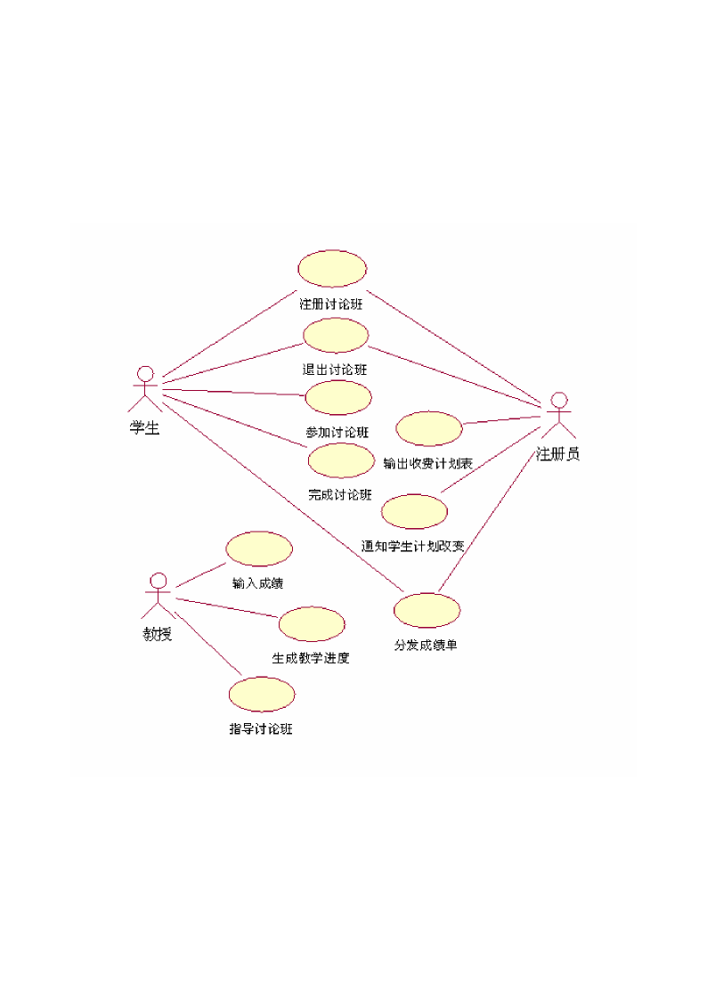
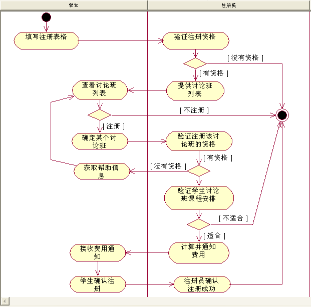
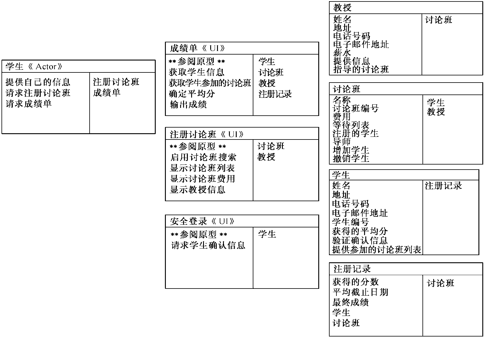
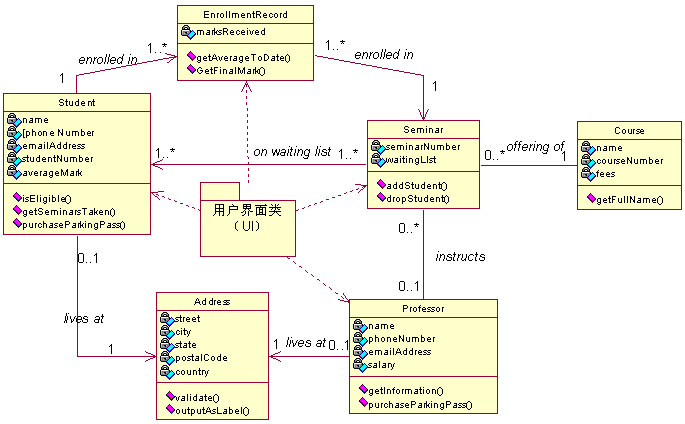
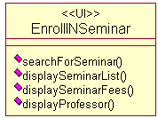
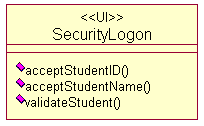
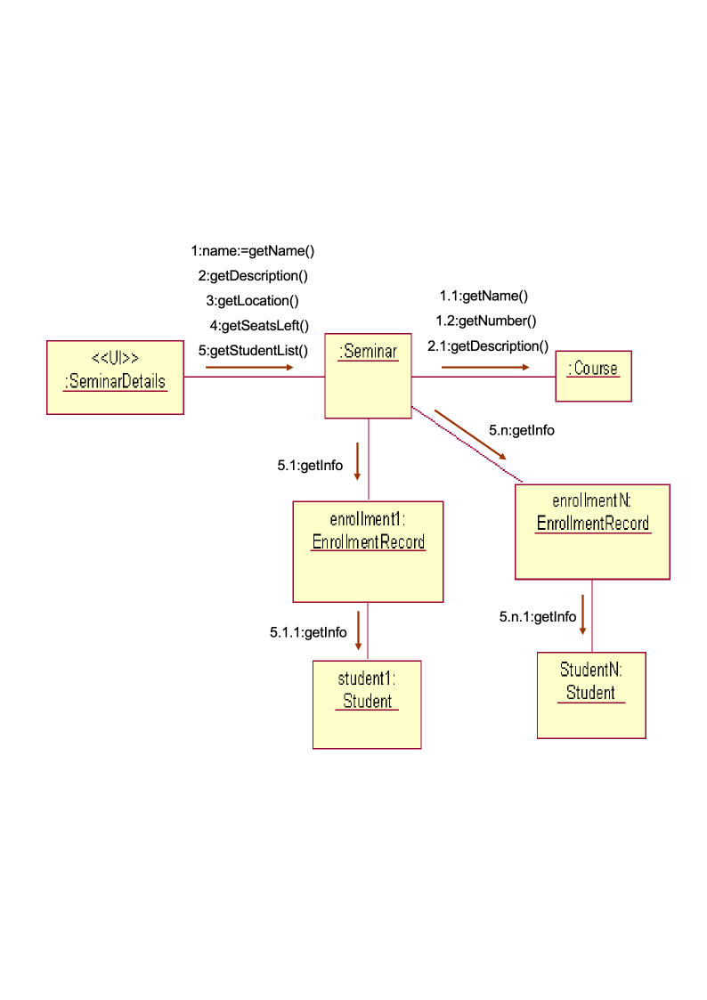
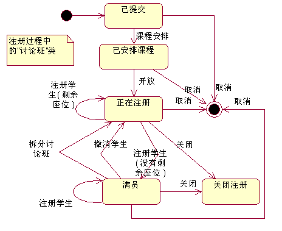
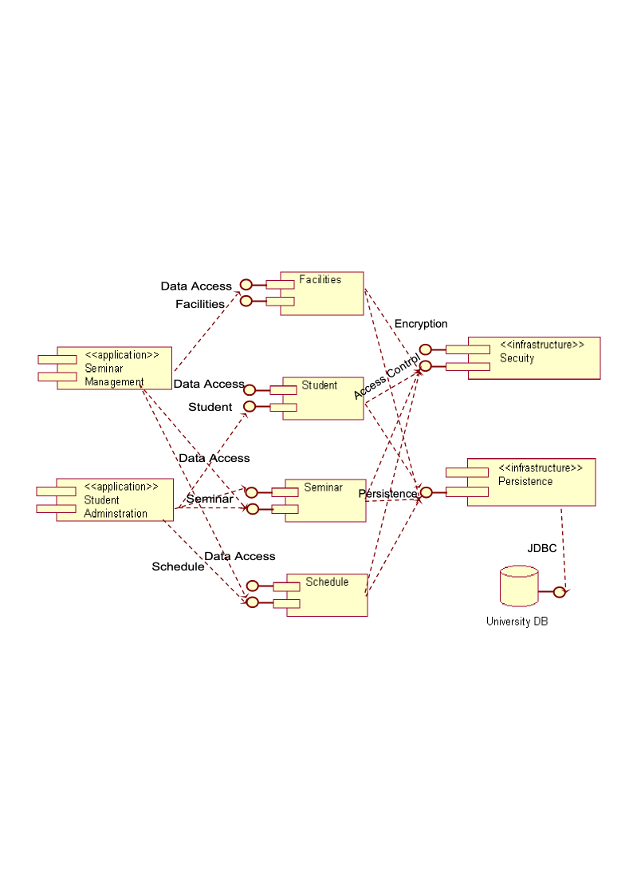
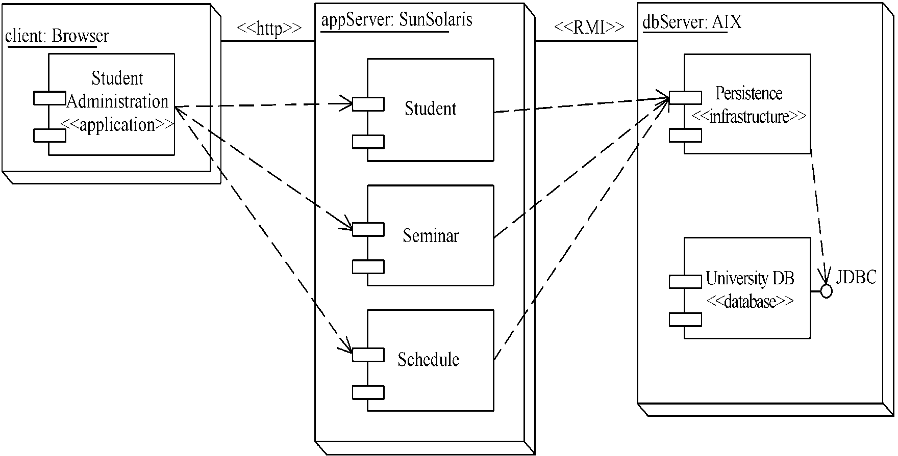

# 选课系统案例

<!-- slide: 1 -->

## 面向对象系统分析与设计-大学选课系统案例

- <number>

<!-- slide: 2 -->

- 华 南 理 工 大 学
- 软 件 需 求 分 析 与 建 模
- <number>
- 本文主要以“学生注册讨论班”为例，运用UML建模语言对大学的选课系统进行了分析。从问题分析到最后的系统设计，主要从以下几个方面进行了陈述：
- 问题描述
- 需求分析
- 静态建模
- 动态建模
- 组件建模
- 部署建模

<!-- slide: 3 -->

## 一、问题描述

- 华 南 理 工 大 学
- 软 件 需 求 分 析 与 建 模
- <number>
- 大学选课系统是与学生有着紧密的联系，具有注册、交费、选课、成绩查询等功能
- 为了简化本次系统分析只考虑学生注册讨论班的功能，该问题描述如下：
- 学生想要注册某门讨论班，于是向注册员提交其姓名和学生编号；
- 注册员验证该学生是否有资格注册这门讨论班；
- 注册员验证后，提供讨论班列表，并验证是否适合学生的课程安排；
- 注册员统计费用并通知学生；
- 在学生确认后，注册员将该学生注册到讨论班，并将费用加入学生帐单；
- 注册员向学生提供注册成功的确认信息。

<!-- slide: 4 -->

## 根据以上问题描述，该简化系统应具有如下功能：

- 华 南 理 工 大 学
- 软 件 需 求 分 析 与 建 模
- <number>
- 学生搜索、注册讨论班
- 验证注册资格
- 显示讨论班及相关信息
- 提供成绩单
- 结算并显示帐单
- 注册成功
- 关闭注册
- 返回

<!-- slide: 5 -->

## 采用用例驱动的方法分析需求的主要任务是识别参与者和用例，并建立用例模型，主要分为以下三个部分。

- 华 南 理 工 大 学
- 软 件 需 求 分 析 与 建 模
- <number>
- 识别参与者
- 识别用例
- 确定事件流
- 返回
- 一、需求分析

<!-- slide: 6 -->

- 华 南 理 工 大 学
- 软 件 需 求 分 析 与 建 模
- <number>
- （一）识别参与者（角色）
- 参与者表示与系统进行交互的任何人或物。可以包括人（不只是最终用户）、外部系统和其它机构。
- 通过分析选课系统的功能需求，确定有以下三个参与者：
- （1）学生：在系统中申请注册讨论班的人
- （2）注册员：完成验证注册信息的人或外部系统
- （3）教授：指导或协助讨论班和管理学生成绩
- 返回

<!-- slide: 7 -->

## （二）识别用例
          用例是一系列活动，描述真实世界中参与者与系统相互交互的方式。
         通过分析选课系统的功能需求，确定有如下用例：
  （1）注册讨论班
  （2）退出讨论班
  （3）参加讨论班
  （4）完成讨论班
  （5）通知学生计划改变
  （6）分发成绩单
  （7）输出收费计划表
  （8）输入成绩
  （9）指导讨论班
  （10）生成教学进度

- 华 南 理 工 大 学
- 软 件 需 求 分 析 与 建 模
- <number>

<!-- slide: 8 -->

## 系统的用例图如下所示：

- 华 南 理 工 大 学
- 软 件 需 求 分 析 与 建 模
- <number>

- 返回

<!-- slide: 9 -->

## （三）用例的事件流描述

- 华 南 理 工 大 学
- 软 件 需 求 分 析 与 建 模
- <number>
- 用例还可以事件流来描述，用例的事件流是对完成用例行为所需的事件的描述。事件流描述了系统应该作什么，而不是描述系统应该怎样做。
- 名称：注册讨论班
- 描述：把现有的有资格的某一学生注册到某个讨论班。
- 前提条件：学生已在大学注册。
- 后置条件：如果学生具有注册资格，并且该讨论班仍有空位，则学生注册到该讨论班。

<!-- slide: 10 -->

- 华 南 理 工 大 学
- 软 件 需 求 分 析 与 建 模
- <number>

| 学    生 | 注册员 |
|---|---|
| 1．学生想去注册讨论班。 | 3．注册员确定该学生是否有资格在这所学校注册讨论班。 |
| 2．学生向注册员提交其姓名和编号 | 4．学生从可供选择的讨论班列表中，选出他希望注册的讨论班。 |
| 4．学生从可供选择的讨论班列表中，选出他希望注册的讨论班。  | 5. 注册员验证学生是否有资格注册这门课。 6. 注册员检验讨论班是否适合学生已有的课程安排 7. 注册员根据讨论班目录中公布的费用、适用的学生费用和适用的税，计算出这门课的收费。   8. 注册员通知学生相关费用。  9. 注册员确认学生表示愿意注册该讨论班。 |
|  10. 学生表示愿意注册该讨论班。 14. 当学生得到确认信息时用况结束  | 11. 注册员把学生注册到该讨论班。 12. 注册员把相应的费用加到学生账单中。 13. 注册员向学生提供已经注册成功的确认。 |

<!-- slide: 11 -->

- 华 南 理 工 大 学
- 软 件 需 求 分 析 与 建 模
- <number>
- 事件流续表：
- 候选过程A：学生没有资格注册讨论班。
- A3. 注册员确定学生没有资格注册讨论班。
- A4. 注册员通知学生，她没有资格注册。
- A5. 用况结束。
- 候选过程B：学生不具备注册这一讨论班所需要的必备条件。
- B5. 注册员确定学生没有资格注册该讨论班。
- B6. 注册员通知学生，她不具备注册这一讨论班所需要的必备条件
- B7.注册员通知学生，她需要具备的条件。
- B8. 用况从活动基本过程中的步骤4继续执行。
- 候选过程C：学生决定不注册讨论班，虽然有讨论班可供其选择。
- C4.学生查看讨论班列表，但没有找到他想要注册的项。
- C5. 用况结束。

<!-- slide: 12 -->

## 根据事件流描述，活动图如下所示：

- 华 南 理 工 大 学
- 软 件 需 求 分 析 与 建 模
- <number>

- 返回

<!-- slide: 13 -->

## 包括：（1）进一步分析系统需求，发现类以及类之间的关系（2）确定它们的静态结构和动态行为。系统的静态结构模型主要用类图和对象图描述。 静态结构建模主要分为两步：        1）定义类        2）确定类的名字、属性和操作，建立类图。

- 华 南 理 工 大 学
- 软 件 需 求 分 析 与 建 模
- <number>
- 返回
- 二、静态结构建模

<!-- slide: 14 -->

- 华 南 理 工 大 学
- 软 件 需 求 分 析 与 建 模
- <number>
- （一）定义类
- 该系统主要有三种类型的类：
- 参与者类（actor class)：代表出现在用况中的参与者
- 用户界面类(user interface class)：组成系统用户界面的屏幕显示、菜单和报表，即UI元素
- 业务类 (business class)：描述业务的地点、物品、概念和事件

<!-- slide: 15 -->

- 华 南 理 工 大 学
- 软 件 需 求 分 析 与 建 模
- <number>

- 该列为参与者类
- 该列为业务类
- 该列为用户界面类
- 返回

<!-- slide: 16 -->

## （二）类图

- 华 南 理 工 大 学
- 软 件 需 求 分 析 与 建 模
- <number>
- 识别出系统中的类后，还要识别出类间的关系（关联、聚合、组合、类属、依赖、实现关系，前面已讲过），然后就可以建立类图了。
- 在处理复杂问题时，通常使用分类的方法来有效地降低问题的复杂性。在面向对象建模技术中，也可以采用同样的方法将客观世界的实体映射为对象，并归纳成类。类、对象及它们之间的关系是面向对象技术中最基本的元素。类图是面向对象系统最常用的图，类图描述了类集、接口集、协作及它们之间的关系。
- 类间的关系如下图所示：

<!-- slide: 17 -->

- 华 南 理 工 大 学
- 软 件 需 求 分 析 与 建 模
- <number>

<!-- slide: 18 -->

- 华 南 理 工 大 学
- 软 件 需 求 分 析 与 建 模
- <number>
- 用户界面包中有如下三个类：
- 1.成绩单<<UI>>
- 2.注册讨论班<<UI>>
- 3.安全登录<<UI>>

- 返回

<!-- slide: 19 -->

## 动态行为模型描绘了参与每个用例的对象之间的交互。开发动态模型的起点是用例以及在对象构建期间决定的对象。这里以协作图和状态图为例进行说明。协作图描绘满足用例需要的对象间消息通信，针对单个类实例的行为，用状态图描绘该类状态的改变。

- 华 南 理 工 大 学
- 软 件 需 求 分 析 与 建 模
- <number>
- 状态图：为依赖状态展示不同行为的类开发状态图
- 协作图：描绘对象间交互的鸟瞰视图
- 返回
- 三、动态行为建模

<!-- slide: 20 -->

- 华 南 理 工 大 学
- 软 件 需 求 分 析 与 建 模
- <number>

- 协 作 图
- 返回

<!-- slide: 21 -->

- 华 南 理 工 大 学
- 软 件 需 求 分 析 与 建 模
- <number>

- 状 态 图
- 返回

<!-- slide: 22 -->

## 三、组件图

- 华 南 理 工 大 学
- 软 件 需 求 分 析 与 建 模
- <number>

<!-- slide: 23 -->

## 三、部署图

- 华 南 理 工 大 学
- 软 件 需 求 分 析 与 建 模
- <number>
- 下图给出了学生选课系统的UML部署图。

<!-- slide: 24 -->

## Click to edit company slogan .

- <number>
- www.themegallery.com

