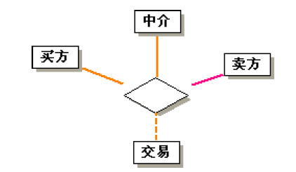
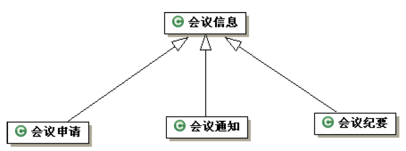
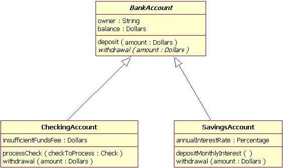
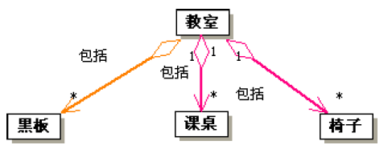
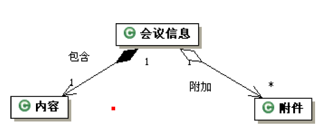
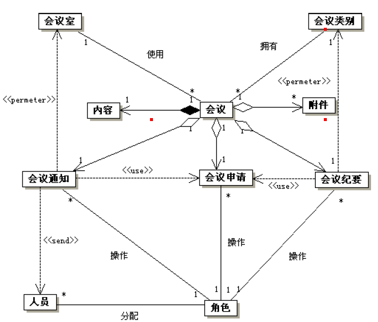

# 阅-5.类图和对象图

<!-- slide: 1 -->

## 软件需求分析与建模- 静态图：类图、对象图

- <number>

<!-- slide: 2 -->

## 本章需要掌握的知识点

- 华 南 理 工 大 学
- 软 件 需 求 分 析 与 建 模
- <number>
- （1）类图的作用。
- （2）泛化（或继承）关系的作用及其应用。
- （3）三个层次的思想及在类图设计中的应用。
- （4）类的组成元素及类之间的各种关系。
- （5）掌握构造类图的一般步骤。

<!-- slide: 3 -->

## 静态图：类图、对象图

- 华 南 理 工 大 学
- 软 件 需 求 分 析 与 建 模
- <number>
- 类和对象的基本概念；
- 三个层次的观点；
- 类图和对象图的基本要素；
- 小  结。

<!-- slide: 4 -->

## I   类和对象的基本概念

- 华 南 理 工 大 学
- 软 件 需 求 分 析 与 建 模
- <number>
- 引  言；
- 对象和类；
- 类和对象的实例；
- 类和对象的表示；
- 三个层次的观点。

<!-- slide: 5 -->

## 引  言

- 华 南 理 工 大 学
- 软 件 需 求 分 析 与 建 模
- <number>
- 类图技术是OO方法的核心技术，应用非常广泛，其中类、对象以及它们之间的关系是最基本的建模元素。类模型和对象模型揭示了系统的结构。
- 分类可以有效地使复杂问题简化。建立类模型的过程，是把现实世界中与问题有关的各种对象及其相互关系进行抽象和分类的过程。

<!-- slide: 6 -->

## 对象和类

- 华 南 理 工 大 学
- 软 件 需 求 分 析 与 建 模
- <number>
- 对象是指某个事物，大多对应于真实世界中的某个客观实体；但有些对象在真实世界中没有直接的对应物，是人们对某个事物的一种抽象描述。
- 所有的对象都是有唯一标识的独立实体。对象之间的区别是由它们固有的存在性所决定的，而与它们的特征是否相同无关。对象的基本特征可以归纳为对象的属性和行为两类。

<!-- slide: 7 -->

- 华 南 理 工 大 学
- 软 件 需 求 分 析 与 建 模
- <number>
- 类是指对一组具有相同特征的对象的抽象描述；任何对象都是某个类的实例。
- 我们采用类的概念来研究系统的构成，划分问题域中涉及到的各种对象。类之间的继承关系是OO方法中的一个重要概念。

<!-- slide: 8 -->

## 类和对象的实例

- 华 南 理 工 大 学
- 软 件 需 求 分 析 与 建 模
- <number>
- 在一个信息系统中：客户(Customer)、合同(Agreement)、发票(Invoice)、债务(Debt)、资产(Asset)、报价单(Quotation)
- 在一个技术系统中：感应器(Sensor)、显示器(Display)、输入输出卡(I/O Card)、按键(Button)
- 在软件系统中：文件(File)、 执行程序(Executable program)、 设备(Device)、 图标(Icon) 、窗口(Window)、 滚动条(Scrollbar) ...
- 在人类社会中：社团、俱乐部、大学、公司、商店、企业...

<!-- slide: 9 -->

- 华 南 理 工 大 学
- 软 件 需 求 分 析 与 建 模
- <number>
- 例:客户类的表示

<!-- slide: 10 -->

## 类和对象的表示 ：类图和对象图

- 华 南 理 工 大 学
- 软 件 需 求 分 析 与 建 模
- <number>
- 类图描述系统中的类及其相互之间的各种关系，反映了系统中包含的各种对象的类型以及对象间的各种静态关系，主要是：关联和子类型。类图也可描述类的属性和行为以及对模型中各种成分的约束。
- 对象图是类图的实例，描述系统中各种对象(类的实例)以及对象之间的各种静态关系。

<!-- slide: 11 -->

- 华 南 理 工 大 学
- 软 件 需 求 分 析 与 建 模
- <number>
- 类图(和对象图)中各个区间的文法：独立于实现时所使用的程序设计语言，也可以选用某种语言的文法规则，如C++，Java，…。
- 类中的一个操作可以有多种不同的实现，每一个实现称作一个方法。

<!-- slide: 12 -->

## 类和对象的表示(续) ：类图和对象图

- 华 南 理 工 大 学
- 软 件 需 求 分 析 与 建 模
- <number>
- 类  名
- (Class Name)
- 类  名
- 属  性
- （Attributes）
- 类  名
- 属  性
- （Attributes）
- 操作
- (Operations)
- 类的表示
- 对象名
- (Object Name)
- 对象名
- 属性值
- （AValues）
- 对象名
- 属性值           （AValues）
- 方法
- (Methods)
- 对象的表示

<!-- slide: 13 -->

## 三个层次的观点

- 华 南 理 工 大 学
- 软 件 需 求 分 析 与 建 模
- <number>
- 画类图和理解类图时都应采用三个层次的观点。这些观点也适用于其它模型。
- 三个层次的观点不是UML的组成部分，但对建造模型或评价模型都非常有用，且都可应用于UML。
- 三个层次：
  - 概念层
  - 说明层
  - 实现层

<!-- slide: 14 -->

- 华 南 理 工 大 学
- 软 件 需 求 分 析 与 建 模
- <number>
- 概念层描述应用域中的概念，是对现实世界的直接描述，与实现它们的类有关，但与实现方案和实现语言无关。
- 说明层描述软件的接口，而不是软件的实现。一个类型描述一个接口，但可能有多种实现。
- 实现层从实现的角度定义类及其实现，揭示了软件实现体的构成情况。

<!-- slide: 15 -->

## II  类图和对象图的基本要素

- 华 南 理 工 大 学
- 软 件 需 求 分 析 与 建 模
- <number>
- 关  联；
- 属  性；
- 操  作；
- 泛  化；
- 授  权；
- 约束规则。

<!-- slide: 16 -->

## II.1  关  联

- 华 南 理 工 大 学
- 软 件 需 求 分 析 与 建 模
- <number>
- 一个典型的类图；
- 基本概念；
- 角色及其命名；
- 角色的多元性；
- 三个层次中的关联；
- 导航特性。

<!-- slide: 17 -->

## 一个典型的类图

- 华 南 理 工 大 学
- 软 件 需 求 分 析 与 建 模
- <number>
- 多重性：限制性的
- 1
- *
- 0..1
- 雇员
- 销售代表
- 多重性：选择
- 关联
- 订单
- 客户
- name
- address
- 泛化
- 类
- 团体客户
- 个人客户
- 多重性：多值
- 产品
- 1
- 项
- *
- 角色名称
- 1
- 订单项
- 关联
- *
- *

<!-- slide: 18 -->

- 华 南 理 工 大 学
- 软 件 需 求 分 析 与 建 模
- <number>
- 个人客户
- 信用卡号
- 数量:Integer
- 价格:Money
- 确认:Boolean
- 定货单
- 收到日期
- 预付款
- 数量
- 价格
- 发货()
- 结束()
- 客户
- 姓名
- 地址
- 信用等级():String
- 集团客户
- 联系人姓名
- 信用等级
- 信用限额
- 余额()
- 月帐单(Integer)
- {信用等级()=="低"}
- 定单栏目
- 雇员
- 产品
- *
- 1
- *
- *
- *
- 1
- 1
- 0..1
- 采购员
- {if
- 定货单.客户.信用等级=="低"
- then
- 定货单.预付款 必须是 "真" }
- 栏目

<!-- slide: 19 -->

## 关联的表示

- 华 南 理 工 大 学
- 软 件 需 求 分 析 与 建 模
- <number>
- 关联的表示：
  - 用一条无向线段表示，是一种双向关系。例如客户和订单的关联：从客户看，订单是他提交的；从订单看，它有一个客户。
  - 用一条有向线段表示，是一种单向关系
- 关联的命名：可以用动词词组或名词命名。但只要这个关联的含义明确，则可省略这个名字。

<!-- slide: 20 -->

## 角色及其命名

- 华 南 理 工 大 学
- 软 件 需 求 分 析 与 建 模
- <number>
- 关联的两端与类之间(或与类的实例之间)的接口表示该类(或该类的实体)在这个关联中的行为，称之为角色。
- 每个关联有两个角色。例如，对于客户和订单之间的关联是：客户和订单。

<!-- slide: 21 -->

- 华 南 理 工 大 学
- 软 件 需 求 分 析 与 建 模
- <number>
- 可将引出角色的类称作源，将引入角色的类称作目标。例如，从订单到客户的角色的源是订单，目标是客户。
  - 为了明确对象在关联中的角色，可以为角色命名。例如从订单到订单项方向上的角色可以命名为项。
  - 如果在关联上没有标出角色名，则隐含地用该角色的目标类的名称作为它的名称。例如，从订单到客户的角色应叫做客户。

<!-- slide: 22 -->

## 角色的多元性

- 华 南 理 工 大 学
- 软 件 需 求 分 析 与 建 模
- <number>
- 角色可具有多元性(一个角色可以有多个对象来扮演)。例如，每个客户对象可以有零或多个订单对象。
- 多元性的表示。1 表示 1..1 ；*代表零到无穷；0..1是选择符，表示没有或仅有1个；一个数；一个范围；数字和范围不连续的组合。
- *
- B
- A
- 表示 A 和零个、一个或多个 B 关联。
- 0..1
- B
- A
- 表示 A 和零个或一个 B 关联
- 1..*
- B
- A
- 表示 A 和一个或多个 B 关联
- 1
- B
- A
- 表示 A 和一个 B 关联

<!-- slide: 23 -->

- 华 南 理 工 大 学
- 软 件 需 求 分 析 与 建 模
- <number>
- （1）关联的名称
- （2）端点
- （3）多重性
- （4）有序
- （5）多元关联

<!-- slide: 24 -->

## 三个层面中，关联性意味着什么？

- 华 南 理 工 大 学
- 软 件 需 求 分 析 与 建 模
- <number>
- 概念层：在应用域中两类对象之间存在的某种关系
- 说明层：表示一种职责(Responsibility),一方向另一方请求或发送某种消息或服务, 但并不涉及实现这种服务的具体方法(methods)
  - 例, 定单的一个职责是记住和报告它的所有者是谁
- 实现层：意味着(用指针来)建立某种关联性。

<!-- slide: 25 -->

## 实现层中的关联（续）

- 华 南 理 工 大 学
- 软 件 需 求 分 析 与 建 模
- <number>
- 对双向关联：相关联的两个类中都有指向对方的指针。
  - 例如，订单有一个指针集指向订单项，有一个指针指向客户。
      - Class Order {
      - private Customer _customer;
      - private Vector _orderLines;
      - ...}
      - Class Customer {
      - private Vector _orders;
      - ...}

<!-- slide: 26 -->

## 导航特性

- 华 南 理 工 大 学
- 软 件 需 求 分 析 与 建 模
- <number>
- 1
- 导航
- 订  单
- *
- 收到日期
- 预付款
- 数量
- 价格
- 发货（）
- 结束（）
- 客  户
- 姓名
- 地址
- 信用等级（）: String
- 产  品
- 1
- *
- 1
- 项
- *
- 订单项
- 数量：Integer
- 价格：Money
- 确认：Boolean

<!-- slide: 27 -->

## 导航特性(续)

- 华 南 理 工 大 学
- 软 件 需 求 分 析 与 建 模
- <number>
- 箭头表示导航特性。如果只在一个方向上有导航表示，称作单向关联。如果在两个方向上都有导航表示，称作双向关联。如果不带箭头，表示未知或尚未确定。
- 单向关联时，说明模型中的订单指出它是由哪个客户发出的；实现模型中的订单包含一个指向客户的指针。
- 对双向关联的限制是两个角色必须互逆。

<!-- slide: 28 -->

## II.2   属  性

- 华 南 理 工 大 学
- 软 件 需 求 分 析 与 建 模
- <number>
- 在三个层面中的属性；
- 属性的语法；
- 补充说明。

<!-- slide: 29 -->

## 在三个层面中的属性

- 华 南 理 工 大 学
- 软 件 需 求 分 析 与 建 模
- <number>
- 在概念层，描述类具有的一些属性(客户对象的名字属性表示客户有名字)。
- 在说明层，规定类对象属性的值并给出设定这些值的方法(表示客户对象的名字并有一些设置名字的方法)。
- 在实现层，设置一个物理存储区来保存属性的值(也可称做一个实例变量或一个数据成员)。

<!-- slide: 30 -->

## 属性的语法

- 华 南 理 工 大 学
- 软 件 需 求 分 析 与 建 模
- <number>
- UML规定其语法为：
- 可见性 名称[多重性]:类型 = 缺省值 {约束特性}
    - 可见性：表示该属性对类外的元素是否可见。
    - 常用的有公有、受保护和私有三种。
    - 名称：属性的名称， 是一个字符串。
    - 多重性：任选项，用多值表达式表示，表达格式为“低值..高值。（低值、高值、0. . *、1..1）
    - 类型：定义属性的种类(基本数据类型或用户自定义的类型)。
    - 缺省值：属性的初始值。
    - 约束特性：描述对属性的约束。

<!-- slide: 31 -->

## 补充说明

- 华 南 理 工 大 学
- 软 件 需 求 分 析 与 建 模
- <number>
- 客户属性的名称可以定义为一个单独的类：定义名字的属性及其相关的操作；然后在客户类和该属性名称类之间建立关联。
- 对于任何一个对象，其每个属性都具有一个确定的值。而且，一般来讲，属性总是单值的。
- 目前只须将属性看成是一个小而简单的类，诸如字符串、日期、资金对象以及非对象的值(例如整型和实型)。

<!-- slide: 32 -->

## 类的派生属性

- 华 南 理 工 大 学
- 软 件 需 求 分 析 与 建 模
- <number>
- 人
- 姓名
- 年龄
- 人
- 姓名
- 生日
- /年龄
- {年龄=今天-生日}
- person
- Name: Char *
- BirthDay:Date
- -age:Integer
- Age():Integer

<!-- slide: 33 -->

## II.3   操  作

- 华 南 理 工 大 学
- 软 件 需 求 分 析 与 建 模
- <number>
- 在三个层面中的 操作；
- 操作 的语法；
- 补充说明。

<!-- slide: 34 -->

## 在三个层面中的操作

- 华 南 理 工 大 学
- 软 件 需 求 分 析 与 建 模
- <number>
- 在概念层，操作不是定义类的接口，而是指出类的主要职责，描述类的动态行为。
- 在说明层，主要给出重要的公有操作；然而有可能需要指明哪些属性是只读的或是不可修改的。
- 在实现层，给出操作的不同实现方法，有可能会显示一些私有的和受保护的操作。操作是施于对象的过程调用，而方法是过程体，是操作的一个具体实现 。

<!-- slide: 35 -->

## 操作的语法

- 华 南 理 工 大 学
- 软 件 需 求 分 析 与 建 模
- <number>
- 可见性 名称(参数表):返回类型表达式{约束特性}
- 可见性：“+”表示公有操作，“#”表示受保护的操作，“-”表示私有操作。
- 名称：操作的名称，是一个字符串。
- 参数表：其语法与属性的参数相同，参数个数是任意的。
- 返回类型表达式(可选项)：依赖于语言的描述。
- 约束特性：用以描述对此操作的约束。

<!-- slide: 36 -->

## 补充说明

- 华 南 理 工 大 学
- 软 件 需 求 分 析 与 建 模
- <number>
- 两类操作：不改变类(对象)的可见状态的查询操作；例如，查询操作仅从类中取值，但不改变其可见状态。改变类(对象)的可见状态的操作称为修改操作。
- 查询操作可以按任意的顺序执行，但修改操作的顺序是重要的，如果不按照预定的顺序执行修改操作，有可能得到不同的结果。为了保证这两类操作相互独立，应避免从修改操作中返回值。

<!-- slide: 37 -->

## XIV   可见性

- 华 南 理 工 大 学
- 软 件 需 求 分 析 与 建 模
- <number>
- +(Public)：公有成员在程序的任何位置都是可见的，系统中的任何对象都可以使用它。
- -(Private)：私有成员仅可以由定义它的类使用。
- #(Protected)：受保护的成员仅可以由定义它的类和该类的子类中的对象使用。
- 对“Public”、“Private”和“Protected”等三个可见性标识符的含义，各种语言都有它自己的规定。UML的定义是：

<!-- slide: 38 -->

## 操作(Operations)与方法(methods)

- 华 南 理 工 大 学
- 软 件 需 求 分 析 与 建 模
- <number>
- 操作(Operations)：界面
  - 可见性 名称（参数表）：返回类型表达式{约束特性}
  - 例：
    - + Age（Date Today）：Integer
- 方法(methods)：操作的一个具体的实现
  - class Person {
  - String Name;
  - Date Birthday;
  - public Integer Age(Date Today) { return(Year(Today) - Year(this.Birthday)); }
  - }

<!-- slide: 39 -->

## II.4   泛  化

- 华 南 理 工 大 学
- 软 件 需 求 分 析 与 建 模
- <number>
- 泛化的定义；
- 在三个层面中的泛化；
- 继承与泛化。

<!-- slide: 40 -->

## 泛化的定义

- 华 南 理 工 大 学
- 软 件 需 求 分 析 与 建 模
- <number>
- 泛化关系(继承关系)定义类和包之间的一般元素和特殊元素之间的分类关系。
- 例如，个人客户和团体客户都是客户，可以把他们的相似之处放到客户类(超类型)中，用个人客户和团体客户作为它的子类型。
- 客  户
- name
- address
- 泛化
- 超类型
- 团体客户
- 个人客户
- 超类型

<!-- slide: 41 -->

- 华 南 理 工 大 学
- 软 件 需 求 分 析 与 建 模
- <number>
- 例如，前面会议管理系统中存在以下的泛化关系。

<!-- slide: 42 -->

## 在三个层面中的泛化

- 华 南 理 工 大 学
- 软 件 需 求 分 析 与 建 模
- <number>
- 在概念层，如果团体客户的所有实例都是客户的实例，那么团体客户类型是客户类型的一个子类型。
- 在说明层，泛化意味着子类型的接口必须包括超类型的接口中的每个元素，即两者必须保持一致。
- 在实现层，子类继承超类的所有属性和方法，并可覆盖继承来的方法。例如，凡适用于客户的代码，只要将将客户替换成团体客户，都适用于团体客户。

<!-- slide: 43 -->

## 泛化（Generalization)

- 华 南 理 工 大 学
- 软 件 需 求 分 析 与 建 模
- <number>
- 泛化(Generalization): 抽象化
- 特化(Specialization):  实例化
- 继承(Inheritance):
  - 泛化关系的一种实现机制
  - 并非所有的泛化关系都适合用继承关系实现

<!-- slide: 44 -->

## 继承与泛化

- 华 南 理 工 大 学
- 软 件 需 求 分 析 与 建 模
- <number>
- 继承是实现泛化的一种机制。在这种机制中，超类的任何一个子类都须具有其超类的所有行为：不仅要求其操作界面在文法上一致，而且要求其行为在语义上一致。
- 当子类中的一个操作重载其超类中相应的操作时，必须确保它提供与超类中的操作相同的服务(内容可以更多或更具体)。
- 如没有证明子类的行为是否与父类相同，就试图用继承来实现新类中的行为，当两者不一致时，会导致难以预测的错误。

<!-- slide: 45 -->

- 华 南 理 工 大 学
- 软 件 需 求 分 析 与 建 模
- <number>

<!-- slide: 46 -->

## 静态方法和数据

- 华 南 理 工 大 学
- 软 件 需 求 分 析 与 建 模
- <number>
- 类的静态方法不仅可以用于整个类的本身，而且还可用于该类的对象中，而类静态数据只能在多个对象之间实现共享，不能被复制。
- C++中类静态方法和数据是依靠关键字static来说明的，类的静态数据还必须在声明进行初始化，否则就会出错。
- Java使用与C++相同的关键字static来定义静态方法和数据的。由于全局函数的存在，使得静态方法变得非常常用。静态数据能直接在类的声明中直接初始化。

<!-- slide: 47 -->

## 聚合和组合

- 华 南 理 工 大 学
- 软 件 需 求 分 析 与 建 模
- <number>
- （1）聚合
- 聚合也是表示类和类之间的“整体－部分”关系，用空心菱形表示。
- （2）组合
- 组合是聚合的一种特殊情形，用实心菱形表示。

<!-- slide: 48 -->

## II.5   授  权

- 华 南 理 工 大 学
- 软 件 需 求 分 析 与 建 模
- <number>
- 利用继承实现栈；
- 授权的定义；
- 利用队列实现栈。

<!-- slide: 49 -->

## 利用继承实现栈

- 华 南 理 工 大 学
- 软 件 需 求 分 析 与 建 模
- <number>
- 栈是队列的特例，其元素的加入和删除只能在栈顶进行。栈和队列之间存在泛化关系。
- 但若采用继承机制来实现这种泛化关系，则存在两个问题：
  - 如重载队列类中的插入和删除操作，则名称与习惯用法不一致；如增加 push 和 pop 操作，则子类 Stack 继承了超类 List 中的操作 add 和 remove，这可能破坏栈的结构。
  - 如子类 Stack 继承超类 List 中的 first 和 last操作，同样可能破坏栈的结构。

<!-- slide: 50 -->

## 授权的定义

- 华 南 理 工 大 学
- 软 件 需 求 分 析 与 建 模
- <number>
- 授权：把原来属于类A的部分责任或任务转交给(授权)类B来完成。这时，类B应看作是类A的不可分割的一个组成部分。
- 目前常用的 OOPL(如C++或Java)所提供的继承机制，难以直接实现多元继承和动态继承等泛化关系，而授权技术是一种非常有效的实现技术。

<!-- slide: 51 -->

## 利用队列实现栈

- 华 南 理 工 大 学
- 软 件 需 求 分 析 与 建 模
- <number>
- 不推荐
- add
- remove
- first
- last
- List
- Stack
- push
- pop
- 推  荐
- -Body: List
- Stack
- Pus h
- pop
- add
- remove
- first
- last
- List

<!-- slide: 52 -->

## II.6   约束规则

- 华 南 理 工 大 学
- 软 件 需 求 分 析 与 建 模
- <number>
- 约束规则的语法；
- 约束规则实例。

<!-- slide: 53 -->

## 约束规则的语法

- 华 南 理 工 大 学
- 软 件 需 求 分 析 与 建 模
- <number>
- 在画类图的过程中，关联、属性和操作等基本要素都要为模型加注约束条件。
- 约束规则的语法：将约束条件放在括号{ }中，用自然语言或其他常见的设计语言来描述，其描述要简洁准确。
- 在理想的情况下，在所使用的程序设计语言      中，规则应该作为断言来实现，并在调试代码时调用它。

<!-- slide: 54 -->

## 约束规则实例

- 华 南 理 工 大 学
- 软 件 需 求 分 析 与 建 模
- <number>
- { if
- 定货单、客户、信用等级==“低”
- then
- 定货单、预付款 必须是“真”
- }
- 1
- *
- 项
- 订单项
- 数量：Integer
- 价格：Money
- 确认：Boolean
- 订单
- 收到日期
- 预付款
- 数量
- 价格
- 发货（）
- 结束（）

<!-- slide: 55 -->

## 使用类图的几点建议

- 华 南 理 工 大 学
- 软 件 需 求 分 析 与 建 模
- <number>
- 1. 在项目初始阶段，不要使用所有的符号，应从简单的概念开始。
- 2. 不同的开发阶段应用不同的观点画类图：分析阶段用概念层类图；设计阶段用说明层类图；实现阶段用实现层类图。
- 3. 不要为每个事物都画一个模型，应把精力放在关键的领域，画几张较为关键的图，经常使用，不断更新。
- 4. 使用类图的最大危险是过早地陷入实现的细节，应将重点放在概念层和说明层。

<!-- slide: 56 -->

## 类图和对象图小结

- 华 南 理 工 大 学
- 软 件 需 求 分 析 与 建 模
- <number>
- 1.类和对象的表示法
  - （1）名称；（2）属性；（3）行为；
- 2.类之间的各种关系
  - （1）继承：子类继承了超类的所有属性和行为；
  - （2）关联：两个不同类之间关联，可以单向或双向；
  - （3）聚合：强关联关系，整体与部分的生命周期分开；（4）组合：强聚合，整体与部分的生命周期相同；
- 3.三个概念层次
  - （1）概念层；（2）说明层；（3）实现层

<!-- slide: 57 -->

## 类图的建模分析步骤

- 华 南 理 工 大 学
- 软 件 需 求 分 析 与 建 模
- <number>
- （1）寻找出需求中的名词(候选对象)。
- （2）合并含义相同的名词，排除范围以外的名词，并寻找隐含的名词。
- （3）去掉只能作为类属性的名词。
- （4）剩下的名词就是要找的分析类（候选类)。
- （5）根据常识、问题域、系统责任确定该类有那些属性。
- （6）补充该类动态属性，如状态、对象间联系（如聚合、关联）等属性。
- （7）从需求中的动词、功能或系统责任中寻找类的操作（候选操作）。

<!-- slide: 58 -->

- 华 南 理 工 大 学
- 软 件 需 求 分 析 与 建 模
- <number>
- （8）从状态转换，流程跟踪、系统管理等方面补充类的操作。
- （9）对所寻找的操作进行合并、筛选。
- （10）对所寻找的操作在类间进行合理分配（职责分配），形成每个类候选操作。
- （11）补充每个类的的分析文档，为类的进一步设计打下基础。

<!-- slide: 59 -->

## 会议管理系统类图中的分析过程－（1）主要分析类

- 华 南 理 工 大 学
- 软 件 需 求 分 析 与 建 模
- <number>
- （1）主要分析类
- 每一系统都有一个或几个主要分析类，并且有一些其他类围绕在这个类的周围，辅助主要分析类完成它的生命周期。
- 例如，对于会议管理子系统来讲，显然会议是主要的分析类，主要分析类是在需求采集阶段就要确定的类，在画类图时只画主要分析类呢？
- 当然不是，一个孤零零的类什么作用都没有，只有类和类之间发生关系才能形成业务，所以第一步是要找到其他的支持类，从哪儿找呢？回答原始需求文档。

<!-- slide: 60 -->

## （2）辅助类

- 华 南 理 工 大 学
- 软 件 需 求 分 析 与 建 模
- <number>
- 首先我们从原始需求文档中找到名词和隐含的名词，在软件开发以后，这些名词可以演化为类或类的属性，对于会议管理系统来讲，前半部分文档所包含的名词有：会议、行政管理、手段、会议类别、会议室、会议申请、会议通知、会议纪要、基础、信息、会议性质名称、备注、会议室名称、容纳人数、会议室资源、说明、使用情况、会议申请人、会议安排、会议性质、会议议题、预算、会议附件、主持人、记录人员、参加人员、会议地点、会议室、会议开始时间、会议结束时间、会议内容、审批人。

<!-- slide: 61 -->

- 华 南 理 工 大 学
- 软 件 需 求 分 析 与 建 模
- <number>
- 其次要合并含义相同的名词，如把备注和说明合并为说明、把会议性质和会议性质名称合并为会议性质。还要排除范围以外的名词，行政管理、手段、基础、信息都是一些概括性的名词，只能作为抽象类或子系统、系统名称，可以暂时不考虑，最后还需要找到一些隐含的名词，由于在会议管理中，作某些事情（如提交会议申请）的人，往往不是一个特定的员工，而是有一群这样的人，而且这群人中的具体员工在随时发生变化，在这里事实上隐含了一个岗位或职责的概念，我们用角色来代替。员工这个隐含的名词也必须出现在系统，才能使整个系统具有完整性。

<!-- slide: 62 -->

## （3）确定为属性或类

- 华 南 理 工 大 学
- 软 件 需 求 分 析 与 建 模
- <number>
- 去掉只能作为类属性的名词。一个名词是作为类还是作为类的属性，关键是看在需求中有没有动词作用在该名词上，对会议管理子系统来讲，会议性质名称、备注、会议室名称、容纳人数、会议室资源、说明、使用情况、会议申请人、会议安排、会议性质、会议议题、预算、会议附件、主持人、记录人员、参加人员、会议地点、会议室、会议开始时间、会议结束时间、会议内容、审批人，都没有动词作用于该名词只能作为属性使用，具体是那个类的属性，我们在后面分析。

<!-- slide: 63 -->

- 华 南 理 工 大 学
- 软 件 需 求 分 析 与 建 模
- <number>
- 剩下的名词有：会议、会议类别、会议室、会议申请、会议通知、会议纪要、会议附件。再加上隐含的名词：角色、员工，它们构成了类图的候选类。

<!-- slide: 64 -->

## （4）定义属性

- 华 南 理 工 大 学
- 软 件 需 求 分 析 与 建 模
- <number>
- 寻找属性时，一般要从类的实例-对象来着手，并从以下几个方面进行考虑：
- 1、按一般常识这个对象有那些属性。
- 2、在当前问题域该对象有那些属性。
- 3、根据系统责任，这个对象应该有那些属性。
- 4、为了实现某些功能，对象需要增加那些属性。
- 5、对象有那些区别的状态。
- 6、对象整体和部分属性设。

<!-- slide: 65 -->

## （5）定义操作

- 华 南 理 工 大 学
- 软 件 需 求 分 析 与 建 模
- <number>
- 找操作要从类的实例-对象来着手，并从以下几个方面进行考虑：
- 1、从需求中的功能，寻找对象的操作。
- 2、系统行为推迟到设计阶段。
- 3、暂不考虑对象中读、写属性这样的操作。
- 4、根据系统责任，这个对象应该有那些操作。
- 5、分析对象的状态转换，寻找操作。
- 6、追踪流程，寻找操作。
- 7、类本身要使用那些操作来维护信息更新以及信息的一致性和完整性。

<!-- slide: 66 -->

## （6）画出类图

- 华 南 理 工 大 学
- 软 件 需 求 分 析 与 建 模
- <number>

<!-- slide: 67 -->

## （7）画出类之间的关系

- 华 南 理 工 大 学
- 软 件 需 求 分 析 与 建 模
- <number>

<!-- slide: 68 -->

## Click to edit company slogan .

- <number>
- www.themegallery.com

