# 阅-8.交互图

<!-- slide: 1 -->

## 软件需求分析与建模- 交互图

- <number>

<!-- slide: 2 -->

## 本章需要掌握的知识点

- 华 南 理 工 大 学
- 软 件 需 求 分 析 与 建 模
- <number>
- （1）掌握交互图的作用，特别是顺序图和协作图各自的作用和区别。
- （2）顺序图的构成及其特点，掌握顺序图的画法和步骤。
- （3）协作图的构成及其特点，掌握顺序图的画法和步骤。
- （4）UML中的通信图。

<!-- slide: 3 -->

## I  引  言

- 华 南 理 工 大 学
- 软 件 需 求 分 析 与 建 模
- <number>
- 动态模型用来描述系统的动态行为，分为状态模型和交互模型。
- 在UML中，用序列图和协作图为交互模型建模，用状态图和活动图为状态模型建模。

<!-- slide: 4 -->

## I  引  言

- 华 南 理 工 大 学
- 软 件 需 求 分 析 与 建 模
- <number>
- 交互图描述对象之间的动态合作关系以及合作过程中的行为次序。
- 交互图常常用来描述一个用例的行为，显示该用例中所涉及的对象以及这些对象之间的消息传递情况。
- 交互图有序列图和协作图两种形式。
  - 序列图主要用来描述对象之间信息交换时的时间顺序.
  - 而协作图则用来描述系统对象之间如何协作共同完成系统功能的要求。

<!-- slide: 5 -->

## 1. 用交互描述软件的动态行为

- 华 南 理 工 大 学
- 软 件 需 求 分 析 与 建 模
- <number>
- 图1. “浏览位图”的用例图

<!-- slide: 6 -->

## 描述系统的边界:首先得出用例图

- 华 南 理 工 大 学
- 软 件 需 求 分 析 与 建 模
- <number>
- 每一个用例都对应系统的一个动作序列
- 序列最初用文本(形式的或非形式的)的方式描述
  - 例如上图.但这样的描述
    - 精确性较差
    - 不标准

<!-- slide: 7 -->

## 描述系统的边界:首先得出用例图

- 华 南 理 工 大 学
- 软 件 需 求 分 析 与 建 模
- <number>
- 交互图分为两种:
  - 序列图
  - 协作图
- 序列图
  - 强调的是为实现此行为系统在时序方面的特性
- 协作图
  - 强调系统在结构方面的特性

<!-- slide: 8 -->

- 华 南 理 工 大 学
- 软 件 需 求 分 析 与 建 模
- <number>
  - UML里,直观的,标准的和面向对象的方式是:
    - 交互和交互图
    - 活动图(Activity diagram)
    - 状态机图(State machine diagram)
      - 描述软件系统的动态行为

<!-- slide: 9 -->

## 交互图

- 华 南 理 工 大 学
- 软 件 需 求 分 析 与 建 模
- <number>
- 软件系统中的任务是通过对象间的合作来完成的
- 对象之间的合作是通过对象间消息的传递实现的
- 对象之间的合作在UML里面被称为交互。
- 交互是可对软件系统为实现某一任务而必须实施的动态行为进行建模
  - 交互的所包含的UML建模元素包括：对象或角色（role）、消息
  - 它们必须通过某种载体表现出来：在UML中，此载体就是交互图。

<!-- slide: 10 -->

## 交互图

- 华 南 理 工 大 学
- 软 件 需 求 分 析 与 建 模
- <number>
- 交互图的定义
  - 交互图描述一个交互，其中包括了一系列的对象及其关系以及通过这些关系在对象之间传送的消息。
- 交互图可分为两类：序列图、协同图
  - 它们在语义上是等价的
    - 这意味着序列图和协同图内部包含的信息是相同的
    - 因此两图可以互相推导，可通过工具互相自动转换
- 交互图可以为软件系统的下列构成的对象的动态行为进行建模：
  - 类、接口、部件、节点

<!-- slide: 11 -->

## 1.序列图

- 华 南 理 工 大 学
- 软 件 需 求 分 析 与 建 模
- <number>
- 序列图的定义
  - 序列图是交互图的一种，它强调的是消息发送的时间的先后顺序
- 在考察一个系统的对象的交互时
  - 通过从序列图开始
  - 然后将序列图转换为协同图
    - 以分析系统在结构方面应该具备的特点

<!-- slide: 12 -->

## 序列图组成部分

- 华 南 理 工 大 学
- 软 件 需 求 分 析 与 建 模
- <number>
- （1）对象：序列图中所包含的每个对象用一个对象框（短式）表示，对象名需带下划线。
- （2）生存线：对象框下画的一条垂直虚线，称为该对象的生存线，表示对象的生存时间。
- （3）激活期：对象生存线上的一个细长方形框，
- 表示该对象的激活时间段，即活动期间。
- （4）消息：对象之间消息的发送和接收用两个	对象生存线（激活期）之间的消息箭头线。

<!-- slide: 13 -->

- 华 南 理 工 大 学
- 软 件 需 求 分 析 与 建 模
- <number>
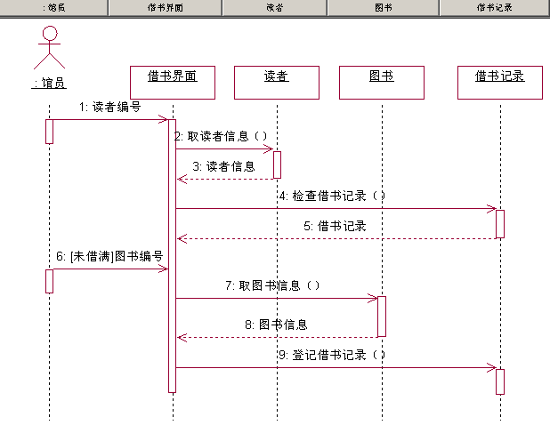

<!-- slide: 14 -->

## 1.序列图

- 华 南 理 工 大 学
- 软 件 需 求 分 析 与 建 模
- <number>
- 序列图的构成
  - 参加交互的各对象在序列图的顶端沿水平方向排列
  - 对象之间传送的消息
    - 用箭头表示，水平放置，沿垂直方向排列
    - 用垂直方向上越靠近序列图顶端的消息越先发送
      - 从而给出了消息被执行的先后顺序的明确而直观的表示

<!-- slide: 15 -->

- 华 南 理 工 大 学
- 软 件 需 求 分 析 与 建 模
- <number>
- 每个对象的底部中心都绘有一个垂直虚线
  - 当一个对象向另一个对象发送消息时
    - 消息始于发送对象底部的虚线
    - 终止于接受对象底部的虚线
  - 这条虚线被称为对象的生命线（Object lifeline）

<!-- slide: 16 -->

- 华 南 理 工 大 学
- 软 件 需 求 分 析 与 建 模
- <number>
- 对象生命线代表一个对象在一个时间段内的存在
- 如果在序列图上某一对象收到了创建消息或销毁消息，则此对象的生存其始于它收到 创建消息的时刻，终止于收到销毁消息的时刻。

<!-- slide: 17 -->

- 华 南 理 工 大 学
- 软 件 需 求 分 析 与 建 模
- <number>
- 序列图
- 图7. 序列图、对象生存线、控制焦点
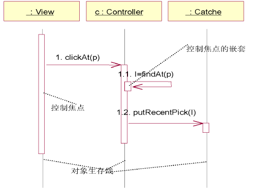

<!-- slide: 18 -->

- 华 南 理 工 大 学
- 软 件 需 求 分 析 与 建 模
- <number>
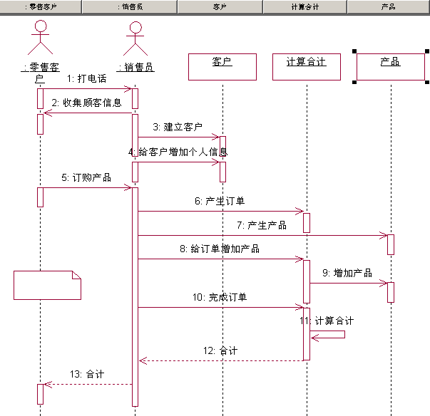

<!-- slide: 19 -->

## 1、消息

- 华 南 理 工 大 学
- 软 件 需 求 分 析 与 建 模
- <number>
- 在前面的用例中，用户和系统的交互，可以分为三个连续执行的动作
  - 1、用户在位图区域内按下鼠标左键；
  - 2、保持左键按下拖动鼠标；
  - 3、释放鼠标左键；
- 这三个动作构成了系统作用者和系统的联系
  - 每一动作都相当于向系统发出了一个命令
  - 系统必须在内部执行相应的操作以正确响应这命令
    - 这在UML里被称为消息（Message)

<!-- slide: 20 -->

## 2、对象

- 华 南 理 工 大 学
- 软 件 需 求 分 析 与 建 模
- <number>
- 在UML里，对象使用与其对应的类一样的图符
  - 为了使对象的图符和类的图符相区别
    - 图符中对象的名字下面加有下划线
- 对象的名字后面标上此对象的实现类的名字
  - 对象名和类名之间用冒号分开。
  - 对象名可以缺失，只标记类而不标记对象名的对象称为匿名对象
  - 标记名字的对象称为记名对象（named object)

<!-- slide: 21 -->

- 华 南 理 工 大 学
- 软 件 需 求 分 析 与 建 模
- <number>
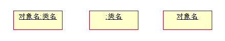
- 对象名：类名
- ：类名
- ：对象名

<!-- slide: 22 -->

## 3、消息

- 华 南 理 工 大 学
- 软 件 需 求 分 析 与 建 模
- <number>
- 对象间的互相合作与交流表现为一个对象以某种方式启动另一一个对象的活动。
- 这种交流在UML中被定义为消息
  - 消息是对对象间的一种信息的通讯的描述，此信息期望在通讯完成之后，某一活动随之发生。
- 消息相当于向目标对象发送了一条命令，此命令启动了目标对象的一个动作。
  - 动作一般通过函数调用（Call）启动
  - 但也可以通过其他方式

<!-- slide: 23 -->

## 3、消息

- 华 南 理 工 大 学
- 软 件 需 求 分 析 与 建 模
- <number>
- 消息所能采取的方式
  - 调用（Call）：启动一个对象里的操作
  - 操作是对象的类所能提供的服务的实现。
- 调用消息一般是顺序执行的。
  - 返回（return）：操作向调用者返回一个值。
  - 发送（send）：向一个对象发送一个信号。

<!-- slide: 24 -->

- 华 南 理 工 大 学
- 软 件 需 求 分 析 与 建 模
- <number>
- 发送消息是异步消息
  - 意味着发送消息的对象在发送了消息给目标对象后，不论目标对象是否接受此消息，它都能继续进行下一消息的发送。
  - 创建：此消息的发送导致目标对象被创建。
  - 销毁(destroy)：此消息的发送导致目标对象被销毁。
- 在UML里，消息用箭头表示
  - 此箭头从发送消息的对象指向接收消息的对象

<!-- slide: 25 -->

## 3、消息

- 华 南 理 工 大 学
- 软 件 需 求 分 析 与 建 模
- <number>
- 在UML中，消息的分类可以从两个角度区分：
  - 一是从消息触发的动作来区分
  - 二是从消息的过程控制流进行区分。
- 通过发送消息可以触发的动作有：
  - 创建一个对象或释放对象
  - 调用另一个对象的操作
  - 调用本对象的操作
  - 发送信息给另一个对象
  - 返回值给调用者

<!-- slide: 26 -->

- 华 南 理 工 大 学
- 软 件 需 求 分 析 与 建 模
- <number>
- 消息可以分为四种控制流，分别是简单消息、异步消息、同步消息和返回消息。
- 1）简单消息
  - 展示了控制如何从一个对象传递到另一个对象，但不描述任何通信的细节。
- 2）同步消息
  - 是一种嵌套的控制流，通常用操作调用来实现。
- 3）异步消息
  - 异步控制流，没有明显的返回信息回送给调用者。
- 4）返回消息
  - 表示控制流从过程调用的返回。

<!-- slide: 27 -->

## 消息的发送形式

- 华 南 理 工 大 学
- 软 件 需 求 分 析 与 建 模
- <number>
- 图 3.消息的发送形式
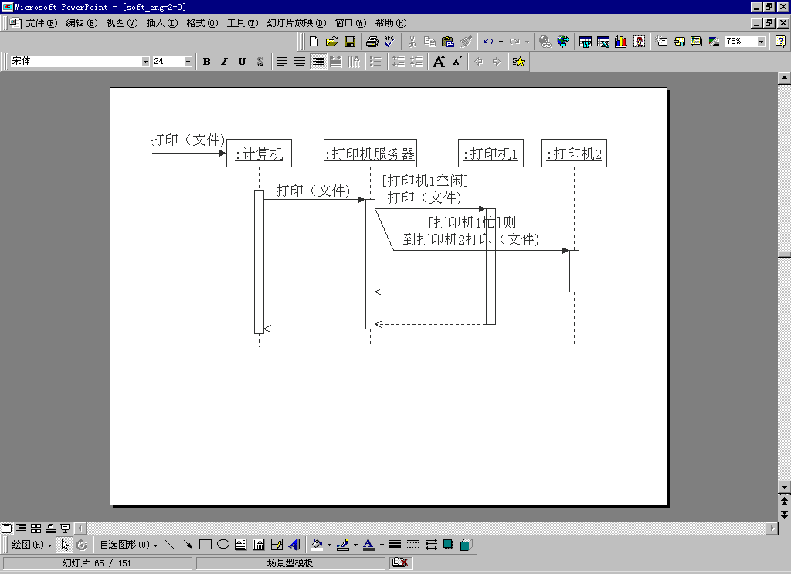

<!-- slide: 28 -->

## 3、消息

- 华 南 理 工 大 学
- 软 件 需 求 分 析 与 建 模
- <number>
- 消息的表示
  - 消息可以有名字
    - 它列在消息的箭头的直线上
- 类的某一操作的定义
  - 例如，C/C++语言里的函数定义等。
  - 消息的发送是有顺序的
    - 此顺序由它的序列图垂直方向上的位置决定
    - 垂直方向靠近序列图的顶端的消息先报告
    - 靠近序列图底部的消息后执行
  - 因此，每一消息都有一个顺序号
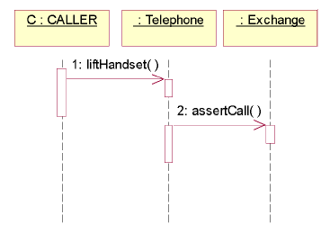
- 图 4. 消息、消息名
- 和调用顺序号

<!-- slide: 29 -->

## 3、消息

- 华 南 理 工 大 学
- 软 件 需 求 分 析 与 建 模
- <number>
- 消息的顺序号
  - 此顺序号可前缀于消息的名字前面
    - 它们之间用冒号分隔（图5）
  - 顺序号分为两种
    - 单调顺序号（Flag sequence）
    - 单调顺序号严格按照消息的发送顺序排列
      - 如:1，2，3，…，等等（如图5）

- 图 5. 消息、消息名
- 和调用顺序号

<!-- slide: 30 -->

## 3、消息

- 华 南 理 工 大 学
- 软 件 需 求 分 析 与 建 模
- <number>
- 过程顺序号（Procedual sequence)
  - 过程顺序号是嵌入式的
    - 当一个消息启动了另一个消息序列的时，此消息序列内的各消息可以重新开始编号
    - 如：消息2发送后，启动了其后的一系列消息，则这些消息可以编号为2.1，2.2，2.3，。。。，等等。（图6）
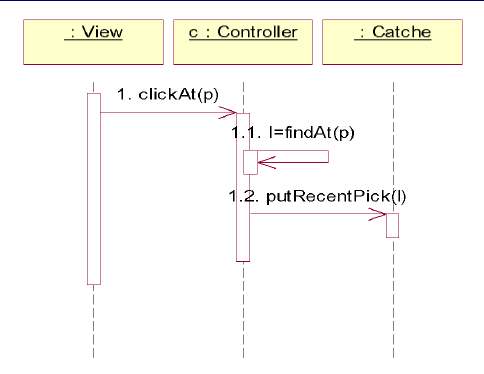
- 图 6. 过程顺序号

<!-- slide: 31 -->

## 控制焦点
在UML里，由消息引发的动作的执行过程被描述为控制焦点或激活期
定义：
控制焦点代表一个对象直接地或通过 个子过程间接的执行一个动作的那段时间。
绘制：
它由位于对象生存线上的一个窄长方形代表
控制焦点长方形的顶端代表动作的开始时刻
底端代表动作的结束时刻
控制焦点可以理解是C语言中一对花括弧“｛｝”内的内容。

- 华 南 理 工 大 学
- 软 件 需 求 分 析 与 建 模
- <number>
- 6、序列图

<!-- slide: 32 -->

## 控制焦点的嵌套
动作执行过程可以引起其他消息的，从而对应子动作的执行，就产生了控制焦点的嵌套
控制焦点的嵌套的表示
另一个控制焦点向右叠放在父控制焦点上
子控制焦点中消息发送的顺序号可以用过程顺序号表示
对象生存线和控制焦点
是序列图所特有的。
它不在协同图里出现。

- 华 南 理 工 大 学
- 软 件 需 求 分 析 与 建 模
- <number>
- 序列图

<!-- slide: 33 -->

## 序列图

- 华 南 理 工 大 学
- 软 件 需 求 分 析 与 建 模
- <number>
- 对象的创建和消亡
- 在序列图中，一个对象可以通过一条消息创建另一个对象，当对象消亡时，在图中该对象图符位置上用一个×号表示。

<!-- slide: 34 -->

## 序列图中的分支控制

- 华 南 理 工 大 学
- 软 件 需 求 分 析 与 建 模
- <number>
- 图.带条件和分支并发执行的序列图

<!-- slide: 35 -->

## 序列图中的约束标记

- 华 南 理 工 大 学
- 软 件 需 求 分 析 与 建 模
- <number>
- 图. 带有时间延迟标记的序列图
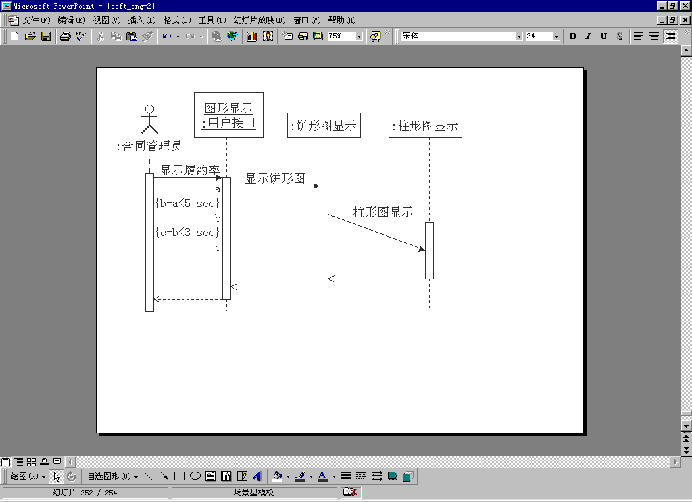

<!-- slide: 36 -->

## 序列图中的循环处理操作

- 华 南 理 工 大 学
- 软 件 需 求 分 析 与 建 模
- <number>
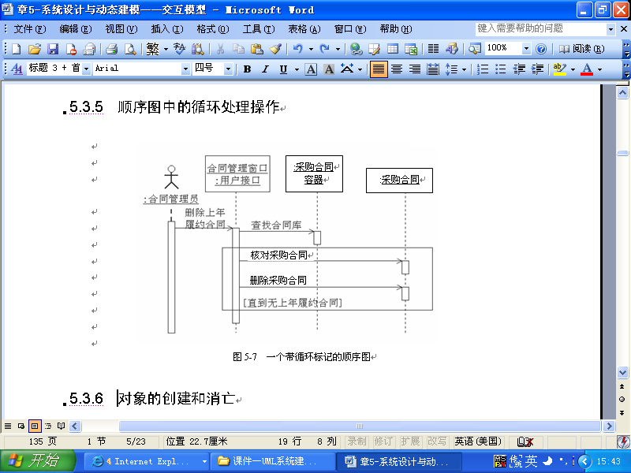

<!-- slide: 37 -->

- 华 南 理 工 大 学
- 软 件 需 求 分 析 与 建 模
- <number>
- 零售业务序列图

<!-- slide: 38 -->

## 建立序列图     
① 从用例中识别交互过程;
② 识别参与交互过程的对象;
③ 为每一个对象设置生命线,并确定对象的存在期限;
④ 从引发交互的初始消息开始,在对象生命线上依次画出交互的消息;
⑤如果需要,可以给消息增加时间约束,以及前置条件和后置条件。

- 华 南 理 工 大 学
- 软 件 需 求 分 析 与 建 模
- <number>

<!-- slide: 39 -->

## 实例：图书馆借书处理的序列图

- 华 南 理 工 大 学
- 软 件 需 求 分 析 与 建 模
- <number>

- ① 识别交互过程。
- 读者在借书时，先由馆员把读者编号输入给系统，系统返回读者的身份信息，以及读者的借阅信息。
- 如果读者借书数量没有超过借书的上限，则把要借书的图书编号输入系统，系统登记借书信息，并返回借书成功信息，借书过程完成。

<!-- slide: 40 -->

- 华 南 理 工 大 学
- 软 件 需 求 分 析 与 建 模
- <number>

- ② 识别参与交互过程的对象；
- ③ 为每一个对象设置生命线,并确定对象的存在期限；
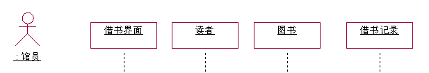
- 实例：图书馆借书处理的序列图

<!-- slide: 41 -->

- 华 南 理 工 大 学
- 软 件 需 求 分 析 与 建 模
- <number>

- 从引发交互的初始消息开始,在对象生命线上依次画出交互的消息

<!-- slide: 42 -->

## 协作图是交互图的另一种表现形式
它在语义上和交互图是等价的（如图8）

- 华 南 理 工 大 学
- 软 件 需 求 分 析 与 建 模
- <number>
- 7、协作图
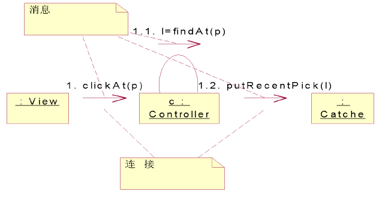
- 图 8. 协同图、消息、连接

<!-- slide: 43 -->

## 协作图描述对象之间消息的连接关系，侧重说明哪些对象之间有消息传递。
协作图中对象用对象图符表示，箭头表示消息发送的方向，编号标明消息的执行顺序。
与序列图相比，通过编号来看消息的执行顺序比较困难，但协作图中对象间灵活的空间布局可以更方便地展示动态连接关系等有用信息。

- 华 南 理 工 大 学
- 软 件 需 求 分 析 与 建 模
- <number>

<!-- slide: 44 -->

## 消息执行顺序的编号方案

- 华 南 理 工 大 学
- 软 件 需 求 分 析 与 建 模
- <number>
- 协作图中最常用的消息执行顺序的编号方案有两种：
- 顺序法：用简单编号方案，从1开始，由小到大，顺序排列。
- 层次法：用小数点制编号方案，此时常常要求表示系统号、子系统号和模块号。UML使用了小数点方案。

<!-- slide: 45 -->

## 协作图强调的是参加一个交互的各对象的组织。
协作图的构成：
对象
连接
在此连接上传递的消息

- 华 南 理 工 大 学
- 软 件 需 求 分 析 与 建 模
- <number>
- 7、协作图

- 图 8. 协同图、消息、连接

<!-- slide: 46 -->

## 连接（Link)的定义
在UML中，连接（Link)被定义为对象之间的语义联系
连接是类之间的关联关系实例
在序列图中，两个对象之间有消息，意味着它们之间在语义上存在着联系，所以它们的对象之间存在着连接关系
反之，只要对象间存在连接关系，就可以在它们之间发送消息

- 华 南 理 工 大 学
- 软 件 需 求 分 析 与 建 模
- <number>
- 7、协作图

<!-- slide: 47 -->

- 华 南 理 工 大 学
- 软 件 需 求 分 析 与 建 模
- <number>
- 连接的表示
  - 在协作图上，连接用对象之间相连的直线来表示
  - 连接可以有名字，它标在表示连接的直线上
  - 如果有消息借助此连接关系传递，则把消息的图符沿直线方向绘制，消息的箭头指向接受消息的对象
  - 由于仅从图符的绘制上无法在协同图上读出消息发送的顺序，所以通常在消息上保留对应的序列图的消息顺序号。

<!-- slide: 48 -->

## 连接的通路（path)
连接表明两个对象之间有语义连接
也意味着两对象之间是可以互相访问的
但具体是通过什么方式使两个对象成为互相可见？
两对象之间的连接可以有多种形式，例如：
通过类的成员变量使对象可见
使两对象位于程序的全局使它们互相可见。
UML为连接关系指定了四种特定的变体
来描述对象连接的方式
这四种变体统一称为通路（path)
通路用于分别位于连接两端的对象的可见方式

- 华 南 理 工 大 学
- 软 件 需 求 分 析 与 建 模
- <number>
- 7、协作图

<!-- slide: 49 -->

## 通路的四种形式：
1、Field：对象能被另一个对象看见，是由于此对象是另一个对象的一部分。例如，如果一个对象是另一个对象的成员变量，那么另一个对象肯定可以访问此对象
2、Parameter（参数）：对象能被另一个对象看见，是因为此对象是另一对象的某一操作的参数。

- 华 南 理 工 大 学
- 软 件 需 求 分 析 与 建 模
- <number>
- 7、协同图

<!-- slide: 50 -->

- 华 南 理 工 大 学
- 软 件 需 求 分 析 与 建 模
- <number>
- 3、Local（局部）：此对象能被另一个对象看见，是因为此对象存在于另一对象的局部作用域中。例如：某一对象是另一对象的某个函数的局部变量，就可以用此路径描述。
- 4、Global（全局）：此对象能被另一个对象看见，是因为此对象存在于全局作用域中。
- 与消息顺序号不同，通路和连接只有在协作图里描绘。
- UML 2.0称为communication diagram.

<!-- slide: 51 -->

- 华 南 理 工 大 学
- 软 件 需 求 分 析 与 建 模
- <number>
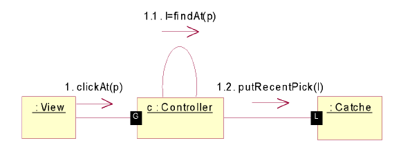
- 图 9. 连接的通路

<!-- slide: 52 -->

- 华 南 理 工 大 学
- 软 件 需 求 分 析 与 建 模
- <number>
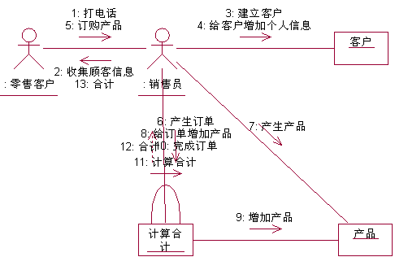

<!-- slide: 53 -->

- 华 南 理 工 大 学
- 软 件 需 求 分 析 与 建 模
- <number>
- 建立协作图
- ① 从用例中识别交互过程;
- ② 识别参与交互过程的对象;
- ③ 确定对象之间的链，以及链上的消息;
- ④ 从引发交互的初始消息开始,将随后每个消息附在相应的链上;
- ⑤ 如果需要,可以给消息增加时间约束,以及前置条件和后置条件。

<!-- slide: 54 -->

## 序列图和协作图的异同

- 华 南 理 工 大 学
- 软 件 需 求 分 析 与 建 模
- <number>
- 1  序列图和协作图都属于交互图,用来描述对象之间的动态关系。
- 2  序列图强调消息的时间顺序，协作图强调参与交互的对象的组织关系。
- 3  序列图和协作图在语义上是等价的，两者可以相互转换。

<!-- slide: 55 -->

## UML 2.0中的顺序图

- 华 南 理 工 大 学
- 软 件 需 求 分 析 与 建 模
- <number>
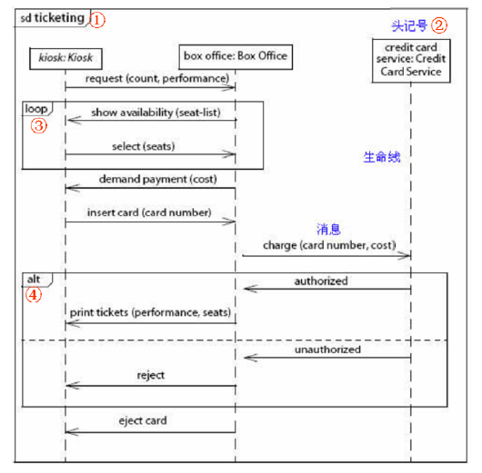

<!-- slide: 56 -->

- 华 南 理 工 大 学
- 软 件 需 求 分 析 与 建 模
- <number>
- ①左上角的小五边形标签“sd ticketing”用来标识这张图，sd表明这是一张序列图（sequence diagram），class表明是类图，comm表明是通信图……。
- 这样就相当于给这张图加了一个“框”（frame），以便整个嵌到更大“框”里，实现交互的复用。
- 用一个框把它框起来，在别的地方就可以通过ref关键字速复用，如：ref Login。

<!-- slide: 57 -->

- 华 南 理 工 大 学
- 软 件 需 求 分 析 与 建 模
- <number>
- ②“主动对象”（active object）变成了“头记号”（head symbol）。序列图中的对象已经改成不是主动象，还用了“对象名：类名”的完整方式来表达。此处应是一个更正，与UML2新特性无关。

<!-- slide: 58 -->

- 华 南 理 工 大 学
- 软 件 需 求 分 析 与 建 模
- <number>
- ③loop。UML2中序列图的表示法很大程度上基于ITU制定的消息序列图（Message Sequence Charts，MSC）标。
- UML1中的交互不适合用来构建更复杂的元素，比如条件、循环和并发线程。这点为许多人所诟病。
- UML2作了很大的改进。UML2交互中的复合片断元素能够以简洁而有效的方式处理结构化元素。一个复合片断包含一个说明它是哪一种构造的关键字，例如：loop构造表示循环。
- 在UML1中表示循环，做法是在图上消息旁加上一个“*”，例如：*[for each seat]。

<!-- slide: 59 -->

- 华 南 理 工 大 学
- 软 件 需 求 分 析 与 建 模
- <number>
- ④alt。同上，alt也是一个构造关键字，表示分支。用水平虚线隔开不同条件下的消息组，根据监护条件决定走哪个分区。
- 如果用UML1来表示分支，可以在图上用中括号把条件放在消息旁边，如果工具允许，可以把条件和消息绑在一起。

<!-- slide: 60 -->

- 华 南 理 工 大 学
- 软 件 需 求 分 析 与 建 模
- <number>
- 组合区和操作符：为了增强重用，顺序图被划分为区域，该区域被称为组合区或组合片段，组合区有若干运算单元(称为操作数)，监护条件（表示某运算单元是否被执行），并有一个操作符，确定运算单元如何被执行，操作符放在组合区左上角。
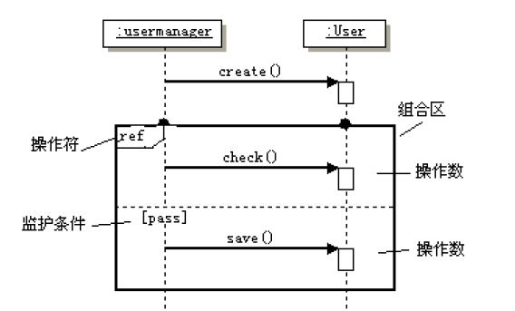

<!-- slide: 61 -->

- 华 南 理 工 大 学
- 软 件 需 求 分 析 与 建 模
- <number>
- 常用的操作符有:
- （1）opt：可选操作符，监护条件为真执行操作符的主体，监护条件是用方括号括起来的布尔表达式，象语言中if语句一样。
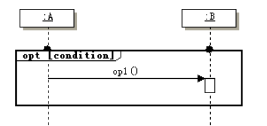

<!-- slide: 62 -->

- 华 南 理 工 大 学
- 软 件 需 求 分 析 与 建 模
- <number>
- （2）alt：操作符的主体被分割为几个分区，每一个分区有一个监护条件，如果监护条件为真，就执行这个分区，但只能执行一个分区，所有的条件都为假时，行一个特殊的分区，就象语言中的select…case语句一样。
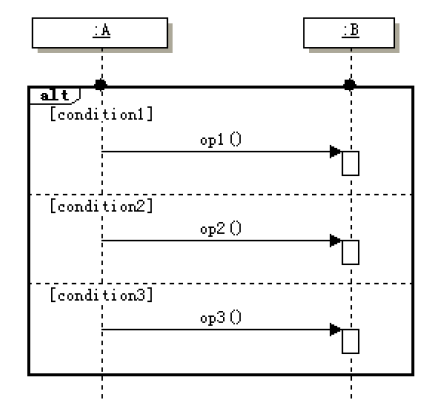

<!-- slide: 63 -->

- 华 南 理 工 大 学
- 软 件 需 求 分 析 与 建 模
- <number>
- （3）loop：循环执行，控制符主体内有一个监护条件，只要在每次循环前监护条件成立，循环主体就被重复执行，就象语言中的循环语句一样。
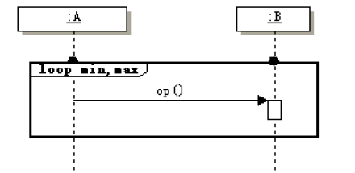

<!-- slide: 64 -->

- 华 南 理 工 大 学
- 软 件 需 求 分 析 与 建 模
- <number>
- （4）ref：引用，引用其他交互，如子活动或子行为。
- （5）break：监护为真执行主体，而不是循环的其他部分，而是循环中断以后要执行的内容。
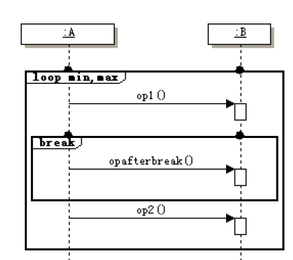

<!-- slide: 65 -->

- 华 南 理 工 大 学
- 软 件 需 求 分 析 与 建 模
- <number>
- （6）par：并行执行，操作符的主体被分割为几个分区，每一个分区表示一个并行计算，不同的分区有不同的生命线，进入操作控制符时并发的执行所有分区，各分区内部是顺序执行的。
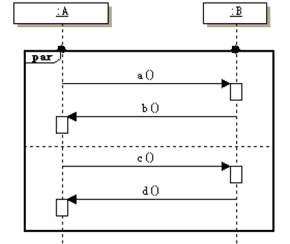

<!-- slide: 66 -->

## 顺序图的建模分析步骤

- 华 南 理 工 大 学
- 软 件 需 求 分 析 与 建 模
- <number>
- (1)完成用例图的分析；
- (2)对每个用例，识别出参与基本事件流的对象(包括接口、子系统、角色等)。
- (3)识别出这些对象是主动对象还是被动对象。
- (4)识别出这些对象发出的消息是同步消息还是异步消息。
- (5)从主动对象开始向接收对象发消息。
- (6)接收对象再调用自己的服务为主动对象返回结果。
- (7)如果接收对象需要再调用其他对象的服务，需要向其他对象再发消息。
- (8)如此反复，最后返回给主动对象有意义的结果。
- (9)用UML建模工具绘出顺序图。
- (10)给顺序图补充必要的说明文档。

<!-- slide: 67 -->

## 会议管理中会议申请顺序图

- 华 南 理 工 大 学
- 软 件 需 求 分 析 与 建 模
- <number>

<!-- slide: 68 -->

## UML 2.0中的通信图

- 华 南 理 工 大 学
- 软 件 需 求 分 析 与 建 模
- <number>
- 在UML2.0中，通信图实际上是以前版本的协作图，使用通信图重点是把消息和对象之间的链直观的布局展示出来，它从空间角度反映对象之间的组织关系。通信图侧重对象之间的交互、对象的结构，有助于验证类间的关联。它同样可以表示消息的类型，如同步消息、异步消息、返回消息、丢失消息、发现消息以及对象的创建消息，但其表示方法和顺序图截然不同。
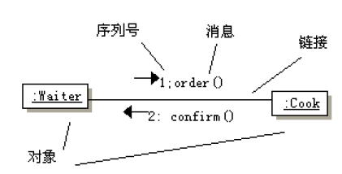

<!-- slide: 69 -->

## UML 2.0中的通信图

- 华 南 理 工 大 学
- 软 件 需 求 分 析 与 建 模
- <number>
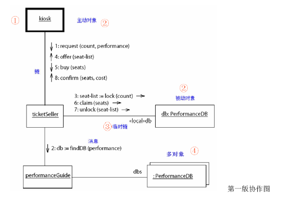

<!-- slide: 70 -->

- 华 南 理 工 大 学
- 软 件 需 求 分 析 与 建 模
- <number>
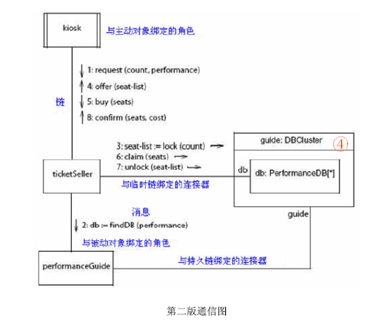

<!-- slide: 71 -->

- 华 南 理 工 大 学
- 软 件 需 求 分 析 与 建 模
- <number>
- UML1中的协作图在UML2有了新的名字：通信图。
- ①主动对象从大黑框变成了双重边。UML1用粗边线的矩形表示主动对象，UML2改进了主动对象的表示法，用左右边为双线的矩形表示。比起区分粗和细来，区分单和双容易多了。
- ②“主动对象”变成了“与主动对象绑定的角色”，“被动对象”变成了“与被动对象绑定的角色”。通信图更着重描述对象在交互中承担的角色，一个对象能够扮演（绑定）多个角色。名称下面也没有下划线了。

<!-- slide: 72 -->

- 华 南 理 工 大 学
- 软 件 需 求 分 析 与 建 模
- <number>
- ③“临时链”变成了“与临时链绑定的连接器”。就像对象和角色绑定一样，链（link）也和连接器绑定。
- 连接器（connector）是结构化类元中的或者协作中的两个结构化部件（structured part）之间的连接。
- 它描述的是只在特定上下文中适用的上下文关联，比如类元中的对象或者参与协作的对象。

<!-- slide: 73 -->

- 华 南 理 工 大 学
- 软 件 需 求 分 析 与 建 模
- <number>
- ④多对象（multiobject）是UML1中的概念，在UML2中已删除。
- 多对象是为了让建模者以两种互补的方式对一个集合建模：
  - 一种方式是作为单个对象，具有对整个集合的操作
  - 另一种方式是作为多个对象的集合，每个对象有自己的操作。
- 这一概念在UML2中可以通过使用结构化类来建模，而不必使用多对象。结构化类包含一组对象。其它类既可以与该结构化类关联，也可与其部件关联。

<!-- slide: 74 -->

- 华 南 理 工 大 学
- 软 件 需 求 分 析 与 建 模
- <number>
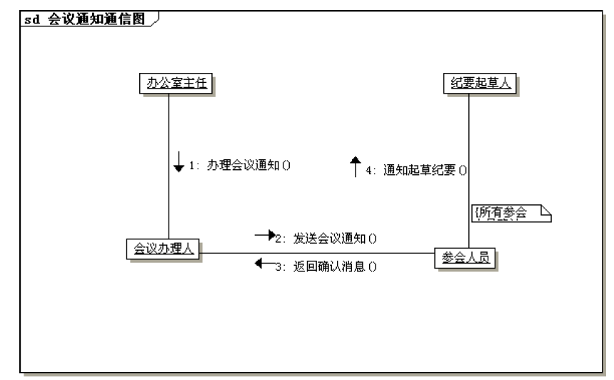

<!-- slide: 75 -->

## 顺序图和通信图的区别

- 华 南 理 工 大 学
- 软 件 需 求 分 析 与 建 模
- <number>
- 顺序图和通信图是由于描述对象交互的关注点不同而引起的，如果关心对象间的关系（上下文关系），就用通信图，如果关心对象之间的顺序、时间选项，就用顺序图。它们之间既有联系，又有区别。
- 相同点：
- 1.它们都表现出了对象之间的交互信息。
- 2.两个图对象的绘制方式相同

<!-- slide: 76 -->

## 顺序图和通信图的区别

- 华 南 理 工 大 学
- 软 件 需 求 分 析 与 建 模
- <number>
- 不同点：
- 1.顺序图反映了对象之间交互的时间关系，而通信图反映了对象之间交互的空间关系。
- 2.顺序图用于展示特定的业务场景，而通信图用来展示详细的业务过程。
- 3.顺序图的对象在图形的顶部一字排开，而通信图对象的摆放位置在二维空间只要选择合适的位置即可。
- 4.通信图不能表现组合片段。

<!-- slide: 77 -->

## 在设置对象时
在软件结构的合理性、软件部件的可重用性、可维护性、可移植性。
然后，在序列图上，用对象之间的消息，
定义各对象之间为实现系统的功能而进行的交互。
在描述消息序列时
使用控制焦点来突出特定的动作所需的消息子序列
动作的嵌套通过控制焦点的嵌套来描述
嵌套的消息序列的顺序
使用过程顺序号来标识

- 华 南 理 工 大 学
- 软 件 需 求 分 析 与 建 模
- <number>
- 8 、建模指南

<!-- slide: 78 -->

## 序列图完成后
把它转成协作图
以进一步考察软件的组织结构
为下一步设计类图作好准备
绘制交互图时
应注意图的组织
依照分治的原则：用多张交互图分别描述
例如：
一个用例的多个场景分别表示的多个事件流程
可以用不同的交互图描述

- 华 南 理 工 大 学
- 软 件 需 求 分 析 与 建 模
- <number>
- 8、建模指南

<!-- slide: 79 -->

## 要充分利用UML的
模型包的机制
标注的机制
使问题的描述有合理明晰的结构
绘制序列图时
要突出问题的重点
省略对描述问题无关紧要的细节问题
应有节制地序列图上描述复杂的分支循环结构
无关紧要的分支循环可留到程序设计时解决
重要而复杂的分支循环，可用活动来描述。

- 华 南 理 工 大 学
- 软 件 需 求 分 析 与 建 模
- <number>
- 8、建模指南

<!-- slide: 80 -->

## 小结：序列图的基本要素

- 华 南 理 工 大 学
- 软 件 需 求 分 析 与 建 模
- <number>
- 序列图描述对象之间的动态交互关系，着重体现对象间消息传递的时间顺序。
- 序列图的基本要素：
  - 对象：对象、对象的生命线、激活的对象和对象的删除。
  - 消息：简单消息、同步消息、异步消息、返回消息。
  - 条件、注释体和注释连接

<!-- slide: 81 -->

## 小  结

- 华 南 理 工 大 学
- 软 件 需 求 分 析 与 建 模
- <number>
- 序列图突出对象的执行时序，协作图能更清楚地表示对象之间的静态连接关系。
- 交互图擅长显示对象之间的合作关系，尽管它并不对这些对象的行为进行精确定义。如要描述一个用例中几个对象协同工作的行为时，交互图是一种有力的工具。
- 虽然交互图能清楚地显示消息机制，但当消息中有太多的条件或循环时，交互图就失去其简明性。交互图仅适用于条件判断和循环不太多的时序过程。

<!-- slide: 82 -->

- 华 南 理 工 大 学
- 软 件 需 求 分 析 与 建 模
- <number>
- 当行为比较简单时，交互图比较好；当行为比较复杂时，则应使用活动图。
- 如果想描述跨越多个用例的单个对象的行为，应当使用状态图。如果想描述跨越多个用例或多个线程的复杂行为，则应使用活动图。
- 最基本的选择原则是用哪种图更简明清楚则选用哪种图。“越简明，价值越大”。

<!-- slide: 83 -->

## 一些问题:

- 华 南 理 工 大 学
- 软 件 需 求 分 析 与 建 模
- <number>
- (1) 交互图分为哪两种类型？
- (2)  序列图和协作图的相同和不同点在什么地方？
- (3)  序列图的基本要素都有那些？
- (4)  消息有那几种类型?
- (5)  生命线是什么？用什么来表示？
- (6)  交互图在软件建模中有什么作用?

<!-- slide: 84 -->

## 本章需要掌握的知识点

- 华 南 理 工 大 学
- 软 件 需 求 分 析 与 建 模
- <number>
- （1）掌握交互图的作用，特别是顺序图和协作图各自的作用和区别。
- （2）顺序图的构成及其特点，掌握顺序图的画法和步骤。
- （3）协作图的构成及其特点，掌握顺序图的画法和步骤。
- （4）UML中的通信图。

<!-- slide: 85 -->

## Click to edit company slogan .

- <number>
- www.themegallery.com

