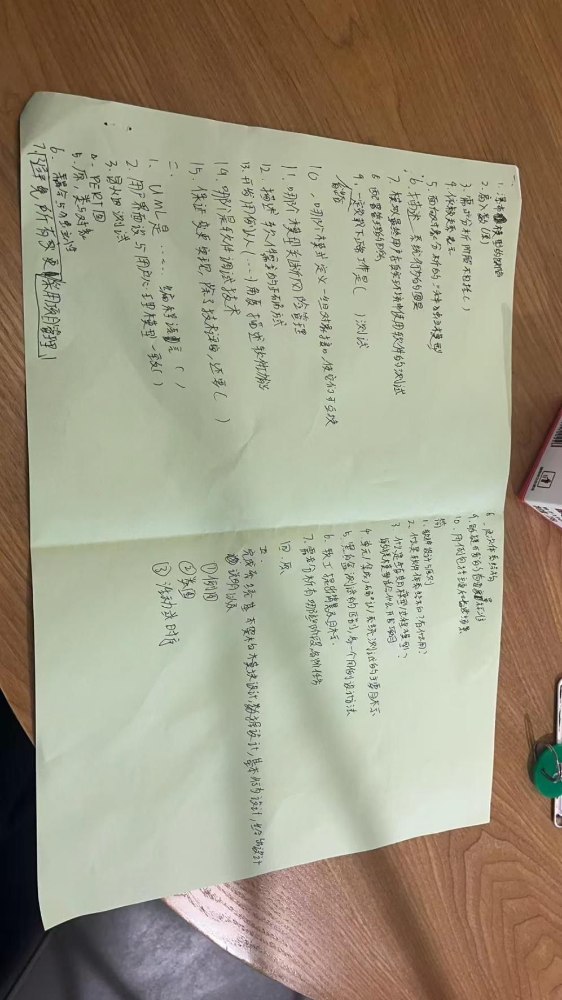

# 软件工程2023-2024

2023-2024第一学期计院软件工程试卷记忆版

一、选择

15个

二、判断

10个

三、简答

1.软件设计的5个原则

2.软件体系结构是什么，有什么作用

3.软件生存期模型/软件过程模型是什么，敏捷模型相比传统模型在具有什么特征的软件开发过程中具有优势

4.单元测试、集成测试、确认测试、系统测试各自的主要目标是什么

5.白盒测试和黑盒测试的区别是什么，给这两种测试分别介绍一种设计测试用例的方法

6.软件工程概念提出的背景和目标分别是什么

7.软件需求分析有什么阶段，每个阶段的任务是什么

四、同2021-2022卷的综合题2

项目名称、项目简介、可行性分析、需求分析、软件过程模型、相关人员、概要设计、软件质量保障的措施和方法

五、给了个项目需求

完成系统基本架构模块设计，数据设计，基本行为设计，给出设计说明及

第一小问：用例图，第二小问：类和类图，第三小问：活动图或顺序图

