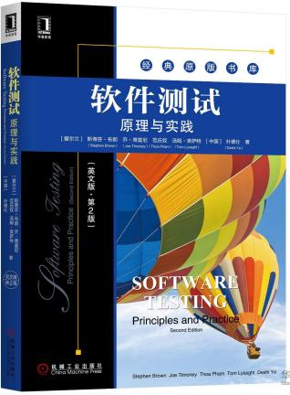
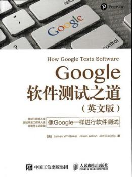
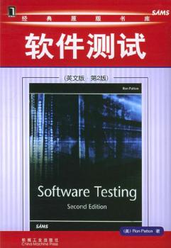
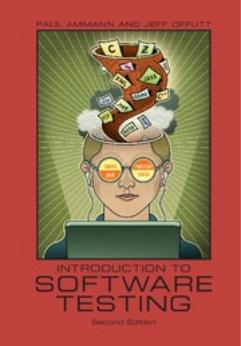

# Ch0 Course_Overview

<!-- page: 1 -->

Software Testing and Maintenance

Spring, 2026

<!-- page: 2 -->

INTRODUCTION

   Software Testing is a critical element of developing
quality software systems

  It is a systematic approach to judge quality and discover
bugs

  This course presents the theory and practice of software

testing and  Maintenance

<!-- page: 3 -->

INTRODUCTION

  Topics covered include:

     Black-box and white-box testing, and related test
case generation

     Testing team and testing documentation
     Tools for software testing
     Performance testing basics
     Testing in the Software Process

<!-- page: 4 -->

COURSE OBJECTIVES

  Understand the concepts and theory related to software testing and quality

assurance

  Understand the relationship between black-box and white-box testing, and

know how to apply as appropriate

  Understand different testing techniques and process used for developing test

cases and evaluating test adequacy

  Learn to use automated testing tools efficiently and effectively

  Understand current state of software testing and maintenance

<!-- page: 5 -->

GRADING

  Daily performance (40%)

  Final Exam (60%)

Penalties for Cheating

If you cheat in this class, you will fail the class.

<!-- page: 6 -->

TEXTBOOK

   Software  Testing Principles and Practice

Second Edition, English language
S. Brown, J. Timoney, T. Lysaght andD. Ye

China Machine Press, 2019

     The book is developed over ten years and reflects the
experience in industry and lecturing from authors;

     The book is the results of extracting and interpreting
test techniques from a wide classic books and standards.

     By providing extensive worked examples, the book
aims to provide a solid basis for both understanding and
applying various test techniques

<!-- page: 7 -->

CONTENTS

   Software  Testing Principles and Practice

1.    Introduction to Software Testing (Chapter 1)
2.    Testing in the software Process   (Chapter 9)
3.    Black-Box Testing                       (Chapter 2&3)
4.    White-Box Testing                       (Chapter 2&3)
5.    Test Team & Test Documentation

6.    Unit Testing                                  (Chapter 3,4&5)
7.    Integration Testing                        (Chapter 6)
8.    System Testing                             (Chapter 7)
9.    Software Test Automation           (Chapter 8)
10.  Software Maintenance

<!-- page: 8 -->

REFERENCES

Introduction to Software Testing
Second Edition,  Paul Ammann&Jeff Offutt

Software Testing
Second Edition,  Ron Patton

How Google Test Software

James,Whittaker Jason,Arbon Jeff,Carollo
Posts and Telecommunications Press, 2016

Cambridge University Press, 2018

China Machine Press, 2006

http://www.cs.gmu.edu/~offutt/softwaretest/

<!-- page: 9 -->

References  Book

软件测试方法和技术
（第4版）
作者:朱少民
出版社:清华大学出版社
出版时间:2022年11月

9

