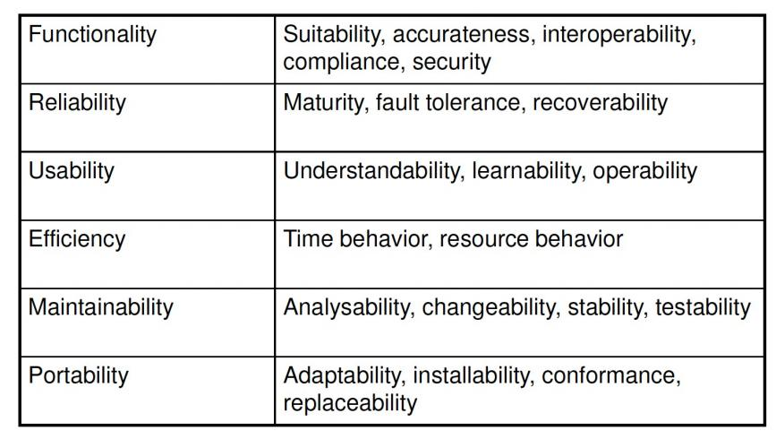
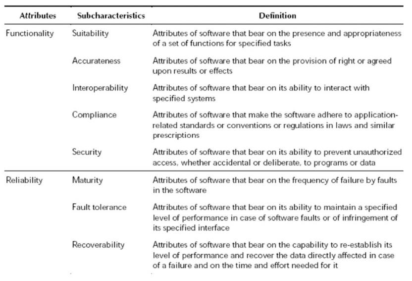
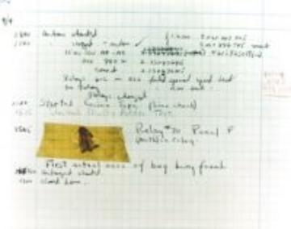
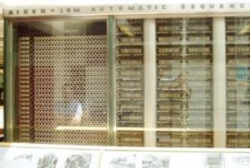
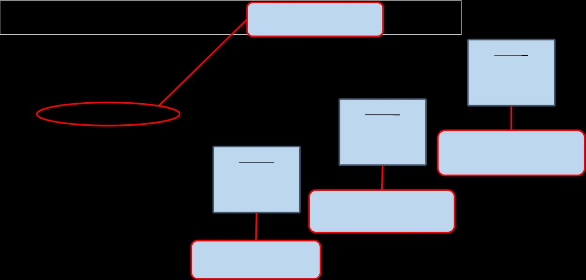
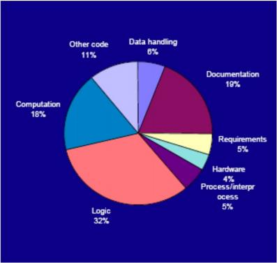

# Ch1-1 Introduction

<!-- page: 1 -->

Introduction to Software Testing

Spring, 2026

1

<!-- page: 2 -->

Contents

  Why do we test software?

    1.1 What is software?
    1.2 What is bug?
    1.3 Fault, Error and Failure
    1.4 Adverse Effects of Faulty Software

  The theory of Testing

  2.1 Verification and Validation
  2.2 Goals of Testing Software

2

<!-- page: 3 -->

Contents

  Why do we test software?

    1.1 What is software?
    1.2 What is bug?
    1.3 Fault, Error and Failure
    1.4 Adverse Effects of Faulty Software

3

<!-- page: 4 -->

1.1 What is Software ?

 A software system usually consists of a number of :

  Instructions within separate programs that when executed give some

desired function
  Data structures that enable the programs to adequately manipulate

information
  Configuration files which are used to set up these programs
  System documentation which describes the structure of the system
  User documentation which explains how to use the system and web sites

for users to download recent product information

4

<!-- page: 5 -->

Early Days of Software

 Computer-based systems were developed using hardware-oriented

management

  Project managers focused on hardware
  Project managers applied the controls, methods, and tools that we

recognize as hardware engineering

 Programming was viewed as an art form

  The programmer often learned his craft by trial and error
  The software world was undisciplined

5

<!-- page: 6 -->

The Crisis in Software Engineering

 In the 1970’s there were a number of problems with software:

  Projects were running over-budget
  Projects were running over-time
  The Software products were of low quality
  The Software products often did not meet their requirements
  Projects were chaotic
  Software maintenance was very difficult

6

<!-- page: 7 -->

Software Engineering

 The actual term Software Engineering was first proposed as far back as 1968

at a conference held to discuss “software crisis”

   Individual approaches to program development did not scale up to large and complex

software systems.

   These were unreliable, cost more than expected, and were delivered late.

 A  variety   of  new   software   engineering   techniques  and  methods  were

developed

   Structured programming, Information Hiding , Object-Oriented Development
   Software Modeling, Software Development Process , Project Management
   Tools and standard notations that were developed at that time are now extensively used

7

<!-- page: 8 -->

Software in the 21st Century

 Software defines behavior

   Servers, Storage, Network routers, Switching networks, other Infrastructure
 Today’s software market :

   much bigger
   more competitive
   more users
 Embedded Control Applications

   Airplanes, air traffic control
   Spaceships
   Watches
   Ovens
   Remote Controllers
 Agile processes put increased pressure on testers to assure the software quality

8

<!-- page: 9 -->

Software is a Skin that Surrounds Our Civilization

G
,' .

Quote due to Dr. Mark Harman

9

<!-- page: 10 -->

Software in the 21st Century

 More safety critical, real-time software

    Embedded software is ubiquitous … check your pockets
    Enterprise applications means bigger programs, more users
    Paradoxically, free software increases our expectations

 The web offers a new deployment platform

Industry desperately needs our

inventions !

   Very competitive and very available to more users
   Web apps are distributed
   Web apps must be highly reliable

Industry is going through a
revolution in what testing means to

  Security is now all about software faults

the success of software products

  Secure software is reliable software

10

<!-- page: 11 -->

Quality and Software

 There are risks associated with Software Development

   Modern programs are complex and have ten thousands of lines of code
   The customer’s requirements can be vague, lacking in exactness
   Deadlines and budgets put pressure on the development team

 The combination of these factors can lead to a lack emphasis being placed on

the final quality of the software product

   Poor quality can result in software failure resulting in high maintenance costs and long

delays before the final deployment

   The impact on the business can be loss of reputation, legal claims, decrease in market

share

11

<!-- page: 12 -->

ISO 9126-1 Software Engineering – Product Quality

 The quality model was structured around six main attributes and its

subcharacteristics

 Quality can be measured using a mix of objective and subjective metrics

   provide consistent terminology for software product quality

   provide a framework for specifying quality requirements for software and making trade-offs

between software product capabilities

 Be applicable to every kind of software

   including computer programs and data contained in firmware

12

<!-- page: 13 -->

ISO 9126-1 Product Quality – Six Attributes

13

<!-- page: 14 -->

ISO 9126-1 Product Quality – Detailed description

14

<!-- page: 15 -->

Contents

  Why do we test software?

    1.1 What is software?
    1.2 What is bug?
    1.3 Fault, Error and Failure
    1.4 Adverse Effects of Faulty Software

15

<!-- page: 16 -->

1.2 What is Bug ?

  What is your understanding for Bug?

 Defect
 Fault
 Problem
 Error
 Incident

 Failure

 Inconsistency
 Product

Anomaly
 Product

Incidence

 Anomaly
 Variance

 Feature :-)

The term Bug is used informally

16

<!-- page: 17 -->

Where is Bug from ?

 In 1947 Grace Hopper was operating a room-sized computer

called the Mark II in Harvard University .

   mechanical relays
   glowing vacuum tubes
   technicians program the computer by reconfiguring it
   Technicians had to change the occasional vacuum tube.
 A moth flew into the computer and was zapped by the high

voltage  when it landed on a relay.

Hence, the first computer bug!

17

<!-- page: 18 -->

Where is Bug from ?

   Grace Hopper

   Distinguished Mathematician and computer scientist
   Rear Admiral in the U.S. Navy
    ” The first Lady of Software  ”

 Programing Accomplishments

    Discovered the first Bug

    Created the biggest Bug - Y2K

    Created the first Compiler A-0 for computer languages

    Developed  the first commercial programming language

Dec.9,1906 ~ Jan.1,1992

COBOL(Common Business-Oriented Language)

Grace Hopper and the Invention

of the Information Age

    Defined the model for high-level programming languages

18

<!-- page: 19 -->

Where is Bug from ?

 Grace Hopper

   Encouraging young people to learn how to program
  The Grace Hopper Celebration (GHC )

   The world’s largest conference of women in technology

 Quotes

“People have an enormous tendency to resist change. They love to say,
'We've always done it this way.' I try to fight that.”        —Grace Hopper

“Compiling in '51, nobody believed that. I had a running compiler and
nobody would touch it, because, they carefully told me, computers
could only do arithmetic, they could not write programs. It was a
selling job to get people to try it.”                               —Grace Hopper

“I tell everybody, 'Go ahead and do it. You can always apologize later.’”          —Grace Hopper

19

<!-- page: 20 -->

Contents

  Why do we test software?

    1.1 What is software?
    1.2 What is bug?
    1.3 Fault, Error and Failure
    1.4 Adverse Effects of Faulty Software

20

<!-- page: 21 -->

1.3 Fault, Error and Failure

  Use Terms that have precise, defined, and unambiguous meanings

Software Fault : A static defect in the software

Software Failure : External, incorrect behavior with respect to the requirements
or other description of the expected behavior

Software Error : An incorrect internal state that is the manifestation of some fault

Sometimes bug mean fault, sometimes error, sometimes failure

… often the speaker doesn’t know what it means !

21

<!-- page: 22 -->

Faults, Errors and Failures Example

Failure

A patient gives a doctor a list of symptom

Fault

The doctor tries to diagnose the root cause, the ailment

The doctor may look for anomalous internal conditions

Errors

(high blood pressure, irregular heartbeat, bacteria in the blood stream)

Difference :
Most medical problems result from external attacks (bacteria, viruses) or physical degradation as we age.
Software faults were there at the beginning and do not “appear” when a part wears out.

Faults in software are equivalent to design mistakes in hardware.

22

<!-- page: 23 -->

A Concrete Example
Fault: Should start
searching at 0, not 1

public static int numZero (int [ ] arr)

Test 1
[ 2, 7, 0 ]
Expected: 1
Actual: 1

{  // Effects: If arr is null throw NullPointerException

// else return the number of occurrences of 0 in arr

int count = 0;
for (int i = 1; i < arr.length; i++)

Error: i is 1, not 0, on
the first iteration

{

if (arr [ i ] == 0)

Failure: none

Test 2
[ 0, 2, 7 ]
Expected: 1
Actual: 0

{

count++;
}

}
return count;
}

Error: i is 1, not 0
Error propagates to the variable count
Failure: count is 0 at the return statement

23

<!-- page: 24 -->

PIE Model

A test may not execute the location of the fault !
Execution/Reachability:

The location or locations in the program that contain the faults must be reached

Infection:                                A test executing the fault may not produce an error!
The state of the program must be incorrect

Propagation :                          An error  may not be propagate to the output !
The infected state must propagate to cause some output of the program to be
incorrect .

24

<!-- page: 25 -->

PIE Model

  Execution
  Infection
  Propagation

  Fault
  Error
  Failure

Discussion:

Could you construct a simple program P (with a fault) and 3 tests , s.t.

1) T1 executes the fault , but no error;
2) T2 executes the fault and produces an error,  but no failure;
3) T3 produces a failure.

25

<!-- page: 26 -->

Fault: Should be set

Another Concrete Example

“arr.length”

Test

3

public static double computeMean (int [ ] arr)

[ 3, 4, 5 ]
Expected:
Actual: 3.5

{  // Effects: If arr is null throw NullPointerException

4

// else return the mean of arr

Test 2

int length = arr. length -1 ;
double mean,sum;

[ 3, 5, 4 ]

Expected: 4
Actual: 4
Test 1

7, not 12
to mean
mean 3.5

Error: sum is

sum = 0.0;
for (int i = 0; i    length; i++)

Error propagates
Failure: wrong

[ 3, -3, 0 ]

Expected: 0
Actual: 0

{

Error: sum is 8. not 12
NO Failure

sum += numbers [i]
}

mean = sum/(double)length
return mean;

NO Error: sum is 0
NO Failure

}

<!-- page: 27 -->

Contents

  Why do we test software?

    1.1 What is software?
    1.2 What is bug?
    1.3 Fault, Error and Failure
    1.4 Adverse Effects of  Faulty Software

27

<!-- page: 28 -->

1.4 Software Faults -Categories

Algorithmic faults

Algorithmic faults are the ones that occurs when a unit of the software does
not produce  a  correct  output  corresponding  to  the  given  input under  the
designated algorithm

Syntax Faults

These occur when code is not in conformance to the programming language
specification,  (i.e.  source  code  compiled  a  few  years  back  with  older
versions of compilers may have  syntax that does not conform to present
syntax checking by compilers (because of standards conformity).

28

<!-- page: 29 -->

Software Faults -Categories

Documentation faults

Incomplete or incorrect documentation will lead to Documentation faults

Stress or overload faults

Stress or Overload faults happens when data structures are filled past their
specific capacity where as the system characteristics are designed to handle no
more than a maximum load planned under the requirements

Capacity and boundary faults

Capacity or Boundary faults occur when the system produces an unacceptable
performance because the system activity may reach its specified limit due to
overload

Computation and precision faults

Computation and Precision faults occur when the calculated result using the
chosen formula does not confirm to the expected accuracy or precision

29

<!-- page: 30 -->

Software Faults -Categories

Throughput or performance faults

This is when the developed system does not perform at the speed specified
under the stipulated requirements

Recovery faults

This happens when the system does not recover to the expected performance
even after a fault is detected and corrected

Timing or coordination faults

These are typical of real time systems when the programming and coding are
not commensurate to meet the co-ordination of several concurrent processes
or when the processes have to be executed in a carefully defined sequence

30

<!-- page: 31 -->

Software Faults -Categories

Standards and Procedure Faults

Standards and Procedure faults occur when a team member does not follow
the standards deployed by the organization which will lead to the problem of

other members having to understand the logic employed or to find the data
description needed for solving a problem.

31

<!-- page: 32 -->

Software Faults

 A study by Hewlett Packard on the frequency of occurrence of various

fault  types,  found  that  50%  of  the  faults  were  either  Algorithmic  or
Computation and Precision

32

<!-- page: 33 -->

Software Failures

 Failures can be classified by their severity

Level 1. Failure causes a system crash and the recovery time is extensive; or

failure causes a loss of function and data and there is no workaround

Level 2. Failure causes a loss of function or data but there is manual workaround

to temporarily accomplish the tasks

Level 3. Failure causes a partial loss of function or data where user can

accomplish most of the tasks with a small amount of workaround

Level 4. Failure causes cosmetic and minor inconveniences where all the user

tasks can still be accomplished

33

<!-- page: 34 -->

Adverse Effects of  Faulty Software

 Communications: Loss or corruption of communication media, non delivery of data.

 Space Applications: Lost lives, launch delays.

 Defense and Warfare: Misidentification of friend or foe.

 Transportation:  Deaths, delays, sudden acceleration, inability to brake.

 Safety-critical Applications: Death, injuries.

 Electric Power:  Death, injuries, power outages, long-term health hazards (radiation).

 Money Management:  Fraud, violation of privacy, shutdown of stock exchanges and banks,

negative interest rates.

 Control of Jails:  Technology-aided escape attempts and successes, accidental release of

inmates, failures in software controlled locks.

  … … .                                                                                                                                                               34

<!-- page: 35 -->

Spectacular Software Failures

■  NASA’s Mars lander: September  1999, crashed

THERAC-25 design

due to a units integration fault       Mars Polar

Lander crash
site?

■ THERAC-25 radiation machine : Poor testing of

safety-critical software can cost lives : 3 patients
were killed

Ariane 5:

exception-handling
bug :  forced self
destruct on maiden
flight (64-bit to 16-bit
conversion:  about
370 million $ lost)

■ Ariane 5 explosion : Millions of $$

■  Intel’s Pentium FDIV fault : Public relations

nightmare

We need our software to be dependable

Testing is one way to assess dependability

<!-- page: 36 -->

Spectacular software Failures

 Boeing A220 :  Engines failed after software

update allowed excessive vibrations

 Boeing 737 Max : Crashed due to overly

aggressive software flight overrides (MCAS)

 Toyota brakes :  Dozens dead, thousands of crashes

 Healthcare website :  Crashed repeatedly

on launch—never load tested

 Northeast blackout : 50 million people, $6

billion USD lost … alarm system failed

Software testers try to find faults before the faults find users

36

<!-- page: 37 -->

Northeast Blackout of 2003

508 generating
units and 256
power plants shut

down

Affected 10 million

people in Ontario,

Canada

Affected 40 million

people in 8 US

states

Financial losses of

$6 Billion USD

The alarm system in the energy management system failed due to a software error

and operators were not informed of the power overload in the system

37

<!-- page: 38 -->

Costly Software Failures

■  NIST report, “The Economic Impacts of Inadequate Infrastructure

for Software Testing” (2002)

– Inadequate software testing costs the US alone between $22 and $59 billion

annually
– Better approaches could cut this amount in half

■  Huge losses due to web application failures

– Financial services : $6.5 million per hour (just in USA!)
– Credit card sales applications : $2.4 million per hour (in USA)

■  In Dec 2006, amazon.com’s BOGO offer turned into a double

discount

■  2007 : Symantec says that most security vulnerabilities are due to

faulty software

World-wide monetary loss due to  poor software is staggering

38

<!-- page: 39 -->

What Does This Mean?

Software testing is getting more important

What are we trying to do when we test ?

What are our goals ?

39

<!-- page: 40 -->

Discussion

  Have you heard of other faulty software ?

   In the media?
   From personal experience?

  Does this embarrass you as a future software engineer?

40
