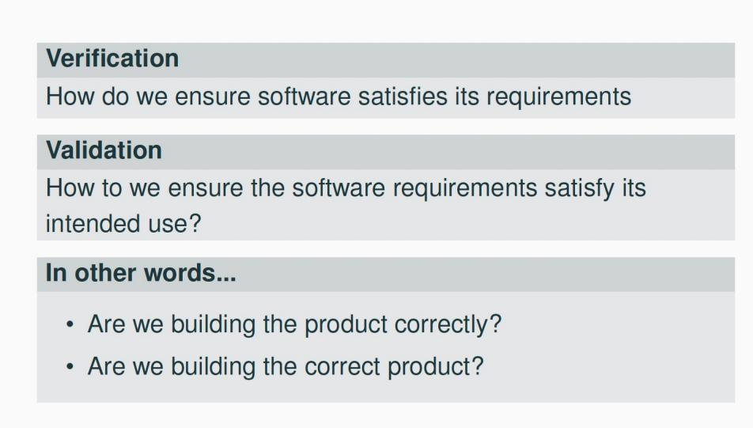
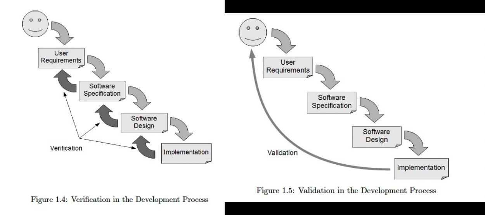
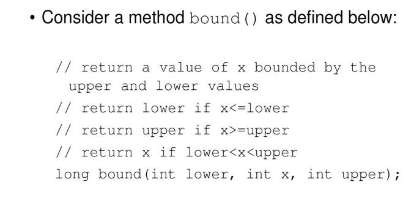
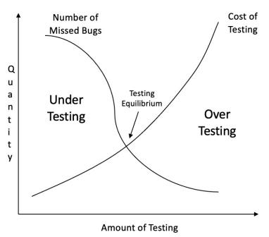
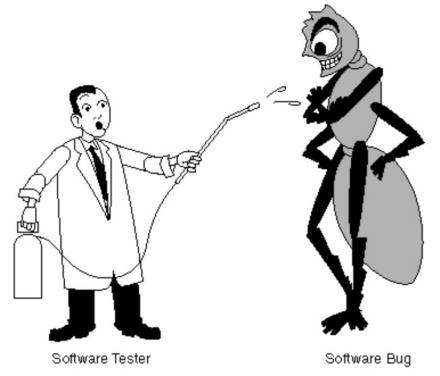
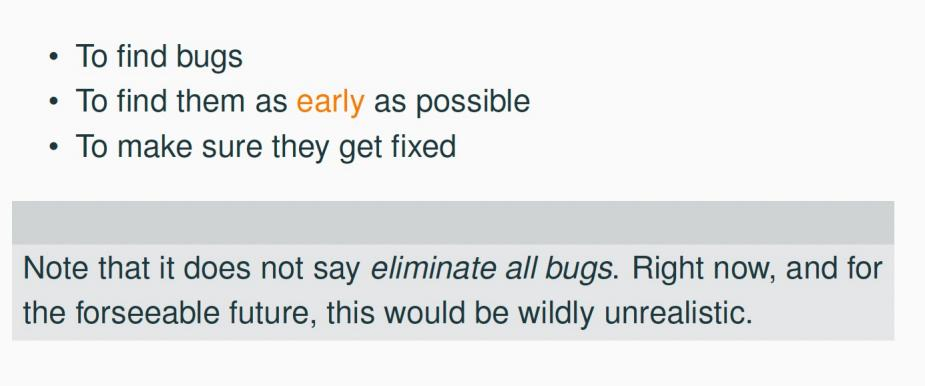

# Ch1-2 Introduction

<!-- page: 1 -->

Introduction to Software Testing

Spring, 2026

1

<!-- page: 2 -->

Contents

  Why do we test software?

    1.1 What is software?
    1.2 What is bug?
    1.3 Fault, Error and Failure
    1.4 Adverse Effects of Faulty Software

  The theory of Testing

  2.1 Verification and Validation
  2.2 Software Testing Axioms
  2.3 Goals of a Software Tester

2

<!-- page: 3 -->

Contents

  The theory of Testing

  2.1 Verification and Validation
  2.2 Software Testing Axioms
  2.3 Goals of a Software Tester

3

<!-- page: 4 -->

2.1 Validation & Verification (IEEE)

  Verification : The process of determining whether the products of a given

phase of the software development process fulfill the requirements

established during the previous phase

  Validation : The process of evaluating software at the end of software

development  to ensure compliance with intended usage

• IV&V stands for “independent verification and validation”

<!-- page: 5 -->

Validation & Verification (IEEE)

5

<!-- page: 6 -->

Specifications

 Specifications play a key role.

 Detailed specifications provide the correct behavior of the software.

 They must describe normal and error behavior.

6

<!-- page: 7 -->

Validation & Verification (IEEE)

7

<!-- page: 8 -->

Contents

  The theory of Testing

  2.1 Verification and Validation
  2.2 Software Testing Axioms
  2.3 Goals of a Software Tester

8

<!-- page: 9 -->

2.2 Software Testing Axioms

1.    It is impossible to test a program completely.

2.    Software testing is a risk-based exercise.

3.    Testing cannot show the absence of bugs.

4.    The more bugs you find, the more bugs there are.

5.    Not all bugs found will be fixed.

6.    It is difficult to say when a bug is indeed a bug.

7.    Specifications are never final.

8.    Software testers are not the most popular members of a project.

9.    Software testing is a disciplined and technical profession.

9

<!-- page: 10 -->

Axiom 1        It is impossible to test a program completely

 How many test cases do you need to exhaustively test:

 Powerpoint
 A calculator
 MS Word
 Any interesting software!

 The only way to be absolutely sure software works is to run it against all possible
inputs and observe all of its outputs …

 Oh, and the specification must be correct and complete

10

<!-- page: 11 -->

Axiom 1        It is impossible to test a program completely

 The number of possible inputs is very large.
 The number of possible outputs is very large.
 The number of paths through the software is very large.
 The software specification open to interpretation.

11

<!-- page: 12 -->

Axiom 2   Software testing is a risk-based exercise

If you do not test the software for all inputs (a wise choice)
you take a risk. Hopefully you will skip a lot of inputs that
work correctly.

What if you skip inputs that cause a fault?

  Risk: financial loss, security, loss of money, loss of life!
  That is a lot of pressure for a tester!

This course is all about techniques and practices to help
reduce the risk without breaking the bank.

12

<!-- page: 13 -->

Axiom 3   Testing cannot show the absence of bugs

“ Program testing can be used to show the presence of
bugs, but never to show their absence! ”

--------Edsger Wybe Dijkstra

Dijkstra received the 1972 ACM Turing Award for
fundamental contributions in the area of programming
languages

13

<!-- page: 14 -->

Axiom 4   The more bugs you find, the more bugs there are

 Bugs appear in groups, where you see one you will likely
find more … Why?

•  Programmers can have bad days
•  Programmers tend to make the same mistakes
•  Some bugs are just the tip of the iceberg.

• Boris Beizer coined the term pesticide paradox to describe
the phenomenon that the more you test software the more
immune it becomes to your test cases.

•  Remedy: continually write new and different tests to exercise
different parts of the software.

14

<!-- page: 15 -->

Axiom 5    Not all bugs found will be fixed

Why wouldn’t you fix a bug you knew about?

   There’s not enough time

o  Some deadlines cannot be extended (e.g., Y2K)

     It’s not really a bug

o  Specifications can be wrong
     It’s too risky to fix

o “I’m not touching Murphy’s code!”
    It’s just not worth it

o Bugs in fringe features may have to wait

o Why not charge the customer for bug fixes in the next release (sound familiar?) :-)

15

<!-- page: 16 -->

Axiom 6  It is difficult to say when a bug is indeed a bug

 If there is a problem in the software but no one ever discovers it … is it a bug?

 not programmers, not testers, and not even a single customer

 What is your opinion?

Does a bug have to be observable in order for it to me a bug?

 Bugs that are undiscovered are called latent bugs.

16

<!-- page: 17 -->

Axiom 7  Specifications are never final

  Building a product based on a “moving target” specification is fairly unique
to software development.

 Competition is fierce
 Very rapid release cycles
  Software is “easy” to change

 Not true in other engineering domains

 E.g., the Brooklyn Bridge could not be adjusted to allow train traffic to cross it once its

construction started.

17

<!-- page: 18 -->

Axiom 8  Software testers are not the most popular members of a project

 Goal of a software tester

 Find bugs
 Find bugs early
 Make sure bugs get fixed

 Tips to avoid becoming unpopular

 Find bugs early
 Temper your enthusiasm … act in a professional manner
 Don’t report just the bad news

18

<!-- page: 19 -->

Axiom 9 Software testing is a disciplined and technical profession

 When software was simpler and more manageable software testers
were often untrained and testing was not done methodically.

 It is now too costly to build buggy software. As a result testing has
matured as a discipline.

  Sophisticated techniques
 Tool support
 Rewarding careers

19

<!-- page: 20 -->

Contents

  The theory of Testing

  2.1 Verification and Validation
  2.2 Software Testing Axioms
  2.3 Goals of a Software Tester

20

<!-- page: 21 -->

2.3 Goals of  a Software Tester

To identify the ideal test 一 that is, the minimum test data required to

ensure that the software works for all inputs.

21

