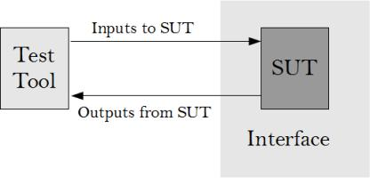
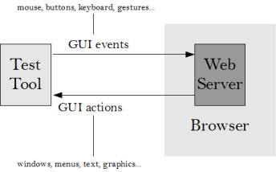
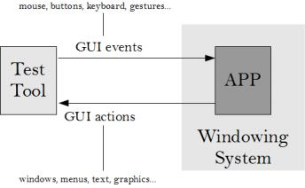
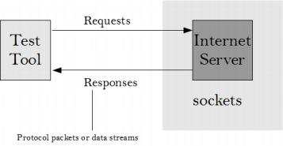
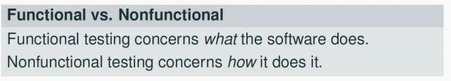
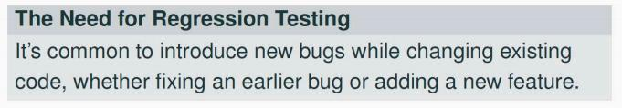
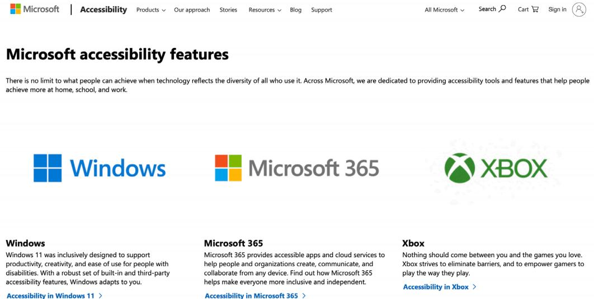

# Ch10-1 SystemTesting

<!-- page: 1 -->

System  Testing

Spring, 2026

1

<!-- page: 2 -->

Contents

 What is System Testing

  System Test Types

  Functional Testing

  Non-Functional Testing

  Regression Testing

2

<!-- page: 3 -->

1. What is System Testing

  Tests the behavior of a system as a whole, with respect to scenarios and

requirements.

      Assumes all components already work well
      Integration testing  finish( checking software quality by testing two or more dependent software

modules as a group or a (sub)system.)

  Black-box testing techniques are used.

      Reconciles software against top-level requirements
      Tests system from concrete use cases in the requirements
  Verifies that the new SW system integrates with the existing environment.

This may include other systems, hardware, people and databases.

3

<!-- page: 4 -->

2. System Testing Types

 Test “types” classify the purpose of the test, rather than its scope or

mechanism.

  Functional testing

   Ensure compliance with functional requirements

  Non-functional testing

    Ensure compliance with non-functional requirements

  Regression testing

4

<!-- page: 5 -->

2.1  System Testing ( Functional)

The default assumption in testing

 Functional testing verifies the software’s behavior matches expectations.

 Also includes testing bad inputs, to check implicit assumptions

   i.e., given nonsense input, the program should do “something reasonable”

  The interface used for testing is the System Interface : the user interface, the network

interface, dedicated hardware interfaces, etc.

5

<!-- page: 6 -->

System Testing – Test Environment

A generic test environment model for System Testing is shown in the Figure.

  The Test Tool provides input  to the SUT, and receives output   from the SUT, over the system interface
.

        In some cases the interface will be synchronous, where every input generates an output.

   In other cases the interface will be asynchronous, where an input may create a sequence of outputs

over time, or the software may spontaneously generate outputs based on timers or other internal
events

6

<!-- page: 7 -->

System Testing – Test Environment

Network Test Model
GUI Test Model

Browser Web Test Model
Direct Web Test Model

7

<!-- page: 8 -->

Functional Testing Strategy

 The selection of Test Cases is based on Black-Box Testing.

 Application of Scenario Testing, Equivalence Partitions, Boundary Value

Analysis, Error Guessing, Decision-Table Testing, Random Testing etc.  is
relatively straightforward.

   Like Unit Testing, test cases and test data are selected using the technique being used.

   The only difference is that instead of calling a method with the specified parameters, the

data must be entered into the interface as appropriate, and then the results collected from
the interface.

8

<!-- page: 9 -->

2.2  System Testing ( Non - Functional)

 Roughly, testing things that are not “functionality”
 Generally, tests quality of the software, also called the “-ilities”

   Usability
   Reliability
   Maintainability
   Security
   Performance

 Nonfunctional testing is an umbrella term for many test types.

   Note these aren’t all mutually exclusive!
   Not all of these may be carried out on the product or be applicable to it.

9

<!-- page: 10 -->

System Testing ( Non - Functional)

Conformance Testing

   Used to verify that the system conforms to a set of published standards. Many

standards will have a published suite of conformance tests or have a selected authority
to run these tests.
   This is particularly important for communications software, as software system must

correctly interoperate with other implementations.

Documentation Testing

   Used to verify that the documentation (in printed form, online, help, or prompts) is

sufficient for the software to be installed and operated efficiently.
   Typically, a full installation is performed, and then the different system functions are

executed, exactly as documented. Responses are checked against the documented
responses.

10

<!-- page: 11 -->

System Testing ( Non - Functional)

Usability Testing

    Used to verify the ease-of-use of the system.
   This can be either automated (verifying font sizes, information placement on the

screen, use of colors, or the speed of progress by users of different experience
levels), or manual (based on feedback forms completed by users).

Interoperability Testing

     Used to verify that the software can exchange and share information with other

required software products.
   Typically, tests are run on all pairs of products to see that all the information that

needs to be shared is transferred correctly. This is particularly important for

communications software.

11

<!-- page: 12 -->

System Testing ( Non - Functional)

Performance Testing

   Used to verify that the performance targets for the software have been met.
   These tests verify that metrics such as the configuration limits (static), response latency

or maximum number of simultaneous users (dynamic) are measured and compared to
the specified requirements.

Portability Testing

   Used to verify that the software is portable to another operating environment.
   A selection of tests from the original platform are run in each new environment.
   The new platforms may be software platforms (such as 32-bit and 64-bit versions of

the same operating system, or implementations by different vendors), or hardware
platforms (such as mobile phones, tablets, laptops, workstations, and servers), or

different environments (databases, networks, etc.).

12

<!-- page: 13 -->

System Testing ( Non - Functional)

Software reliability

   Used to verify the probability of failure-free operation of an application in a specified

operating environment and time period.
   Failure Intensity: The number of failures occurring in a given time period.
   MTTF: The average value of the next failure interval

Security Testing

   Used to verify that the system security features are not vulnerable to attack.
    The tests will deliberately attempt to break security measures.
   Examples would include impersonating another user, accessing protected files,

accessing network ports, breaking encrypted storage or communications, or inserting
unauthorized software.

13

<!-- page: 14 -->

2.3 Regression Testing

 Making sure that code changes haven’t broken existing functionality,

performance, security, etc.

 In practice, this means re-running tests after a code change
 With good test automation and good unit/integration/system/etc. tests,

this is literally running tests again after a change.

14

<!-- page: 15 -->

Contents

 Non-Functional Testing

  Usability Testing

  Performance Testing

  Security Testing

2

<!-- page: 16 -->

Usability Overview

In mature engineering fields, customers choose

products they can use without help

  Can I drive the car without extra training?

  Can I use this web application without being taught?

  Can I adjust my privacy settings?

  Can I use my stopwatch without help?

15

<!-- page: 17 -->

Software Usability Design

How to break down the essential characteristics of usable software
from an analytical viewpoint

 Engineering principles for designing and building software

interfaces that are

   Fast to learn
   Speedy to use
   Avoid user errors

 How to recognize and articulate the difference between “this program

sucks” and “I can improve this program by changing X,Y, and Z”

 Life-long habits for engineering usable products

   UI Guidelines

16

<!-- page: 18 -->

Shneiderman’s measurable criteria

1)  Time to learn
2)  Speed of UI use
3)  Rate of user errors
4)  Retention of skills
5)  Subjective satisfaction

17

<!-- page: 19 -->

(1). Time to learn

The time it takes to learn some basic level of skills

With complicated UIs, the users must “plateau”

Plateau 3

additional
commands

More tasks,
more choices,
or more speed

Plateau 2

additional
commands

More tasks,
more choices,
or more speed

Plateau  1

Ability to
complete at least

initial
set of
commands

one simple task

  Well designed interfaces make

  the first plateau easy to get to
  subsequent plateaus clearly available

18

<!-- page: 20 -->

(2). Speed of UI use

Number of UI “interactions” it takes to accomplish tasks
 This is about navigating through the interface, not how fast the software or
network runs

 Interaction points are places where the users interact with the software:

 Buttons
 Text boxes
 Commands
 Speed of UI performance is roughly the number of interactions needed to
accomplish a task

19

<!-- page: 21 -->

(3). Rate of user errors

 How often users make mistakes
 Users will always make mistakes
 UIs can encourage or discourage mistakes

 Consistency, instructions, navigation, …

Consider :

  C/C++ : The lack of typing, particularly on pointers, and the complexity of the syntax

actively encourages programmers to make mistakes .

Thus we become debuggers, not programmers
  Unix : The large, complicated command language encourages many mistakes as a result of

simple typos and confusion
  Entering grades in a dropdown instead of radio buttons

20

<!-- page: 22 -->

(4). Retention of skills

 How well users remember how to use the UI
 Some interfaces are easy to remember, some are hard

 If they flow logically (that is, match the user’s mental model or
expectations), they are very easy to remember

 If an interface is very easy to learn, then the retention is not important –
users can just learn again

 Retention is typically more important with UIs that are hard to learn

21

<!-- page: 23 -->

(5). Subjective satisfaction

 The lack of annoying features

 Subjective satisfaction is defined to be how much the users “like” the UI

 This depends on the user (thus the word “subjective”)

 Think ofit in reverse: Users are unhappy when there is something
annoying in the interface

 Blinking
  Ugly colors
  Spelling errors in massages

Most important in competitive software systems

Like … everything on the Web !

22

<!-- page: 24 -->

Accessibility Testing (testing for the disabled)

The following impairments make using computers especially difficult:

 Visual

  E.g., color blindness, tunnel vision, cataracts.
 Hearing

  E.g., partial or complete deafness.
 Motion

  E.g., injury can make using a keyboard or mouse difficult or impossible.
 Cognitive and language

  E.g., dyslexia or memory problems and using complex UIs

Legal requirement

laws applied to developing software with a UI that can be used by the disabled

23

<!-- page: 25 -->

Microsoft Windows accessibility features

Sticky-keys:   Allow Shift, Ctrl, Alt keys to stay in effect until the next key is pressed.

 Filter-keys:     Prevents brief repeated keystrokes from being recognized.
Toggle-keys:  Plays tomes when Caps Lock, Scroll Lock, or Num Lock keyboard modes

are enabled.

 Sound-sentry: Creates a visual warning whenever the system generates a sound.

 Show-sounds:  Instructs program to display captions for any sounds or speech they make.

High contrast: Sets up the screen with colors and fonts designed to be read by the

visually impaired.

 Mouse-keys:   Allows the use of keyboard keys instead of he mouse to navigate.

 Serial-keys:     Sets up a communication port to read in key strokes from an external

(non-keyboard) device.

24

<!-- page: 26 -->

Microsoft’s  accessibility  website

25

<!-- page: 27 -->

Usability Testing

 There are many tests out there and this will  introduce you to
several popular ones in a Nutshell!

1)  Questionnaires
2)  Interviews
3)  Observation
4)  Thinking aloud
5)  Heuristic Evaluation

 One or more may be chosen for your particular application

26

<!-- page: 28 -->

Questionnaires

 These Contain various questions that you come up with in regards to
your interface

  They are easy to repeat and can find user preferences
  However, pilot work may be needed to prevent misunderstandings
and it may be hard to receive all of the questionnaires back.

  Suggested number for significant results: at least 30

27

<!-- page: 29 -->

Interviews

 These are flexible and can be more or less in-depth depending on
the person.

 However, they are time-consuming and can be hard to compare
from interview-to-interview.

 Suggested number for significant results: 5

28

<!-- page: 30 -->

Observation

 Observation is very good in revealing how the user actually goes
about performing tasks including what functions and features that
they use.

 However, appointments may be hard to set up and the experimenter
does not have much control as they are silently observing the user.

 Suggested number for significant results: 3 or more

29

<!-- page: 31 -->

Thinking Aloud

 The thinking aloud method involves observing users and asking
them to ‘think aloud,

 This test is good at pinpointing user misconceptions and is a cheap
test.

 However, it may feel unnatural to the users that are using the
product to speak out loud at the same time!

 Suggested number for significant results: 3-5

30

<!-- page: 32 -->

Heuristic Evaluation

 This is a collection of usability guidelines to help a user to evaluate
Usability!

A Heuristic Evaluation tries to come up with an opinion as to what the
good and bad things in an interface are.

 Checklist for 5 criteria
 Or 10 categories in the Heuristic Evaluation

31

<!-- page: 33 -->

Heuristic Evaluation categories

(1)  Simple and Natural Dialogue

Does the interface have a Simple and Natural Dialogue?

  Are features easy to understand?
  Are features easy to find?
  Could the amount of navigation in the interface be minimized?
  Are graphics intuitive?
  Is the use of color appropriate?

(2) Speak the User’s language

Are terms understandable to the user?

  Does the user know that the trash can is used to delete items?
  Are units in the users native language?

32

<!-- page: 34 -->

Heuristic Evaluation categories

(3) Minimize the User’s Memory Load

Does the user have to remember too much?

  For instance: instead of:

•  Enter Date:        Use         Enter Date (MM-DD-YYYY):

(4) Consistency

Do commands and actions always have the same meaning?

(5) Feedback

Do users receive feedback when they do something in a reasonable
time response?

  Status bars indicating that a program is installing
  Feedback that a command has been executed
  Notice that your email has been sent

33

<!-- page: 35 -->

Heuristic Evaluation categories

(6) Clearly Marked Exits

Do users feel safe exiting a program without fear of losing work?

(7) Short-cuts

Are short-cuts available for frequently performed operations?

(8) Good Error Messages

 Errors should be easy to understand and should help the user.

34

<!-- page: 36 -->

Heuristic Evaluation categories

(9) Prevent Errors

Are there problems that could have been prevented?
Appropriate to have special modes?
Could something be designed to be more intuitive?

(10) Help and Documentation

Most users do not read manuals

  Do they need to read one or is the interface intuitive enough?
  Does the documentation allow users to quickly find what they were

searching for?

35
