# Ch10-2 SystemTesting

<!-- page: 1 -->

System Testing

Spring, 2026

1

<!-- page: 2 -->

Contents

 Non-Functional Testing

  Usability Testing

  Performance Testing

  Security Testing

2

<!-- page: 3 -->

1. Performance Testing

 knows as ‘Perf Testing’, is a type of testing performed to check how

application or software performs under workload in terms of responsiveness
and stability.

 The Performance Test goal is to identify and remove performance bottlenecks

from an application. It is a subset of performance engineering.

  This test is mainly performed to check whether the software meets the

expected requirements for application speed, scalability, and stability.

Speed – Determines whether the application responds quickly
Scalability – Determines maximum user load the software application can handle.
Stability – Determines if the application is stable under varying loads

3

<!-- page: 4 -->

Why do Performance Testing?

 Features and Functionality supported by a software system is not the only concern.

 Performance testing specifies what needs to be improved before the software is

released to the client.

 Applications sent to market with poor performance metrics due to nonexistent or

poor performance testing are likely to gain a bad reputation and fail to meet

expected sales goals.

   Only a 5-minute downtime of Google.com (19-Aug-13) is estimated to cost the search

giant as much as $545,000.

 Mission-critical applications like space launch programs or life-saving medical

equipment should be performance tested to ensure that they run for a long period
without deviations.

4

<!-- page: 5 -->

Common Performance Problems

  Long Load time – Load time is normally the initial time it takes an application to start. This

should generally be kept to a minimum.

  Poor response time – Response time is the time it takes from when a user inputs data into

the application until the application outputs a response to that input.

  Poor scalability – A software product suffers from poor scalability when it cannot handle

the expected number of users or when it does not accommodate a wide enough range of
users.

  Bottlenecking – Bottlenecks are obstructions in a system which degrade overall system

performance. Bottlenecking is when either coding errors or hardware issues cause a decrease

of throughput under certain loads. Bottlenecking is generally fixed by either fixing poor
running processes or adding additional Hardware.
  Some common performance bottlenecks are

   CPU utilization

   Memory utilization

   Network utilization

   Disk usage

5

<!-- page: 6 -->

Performance Testing Metrics: Parameters Monitored

Client-side Metrics

6

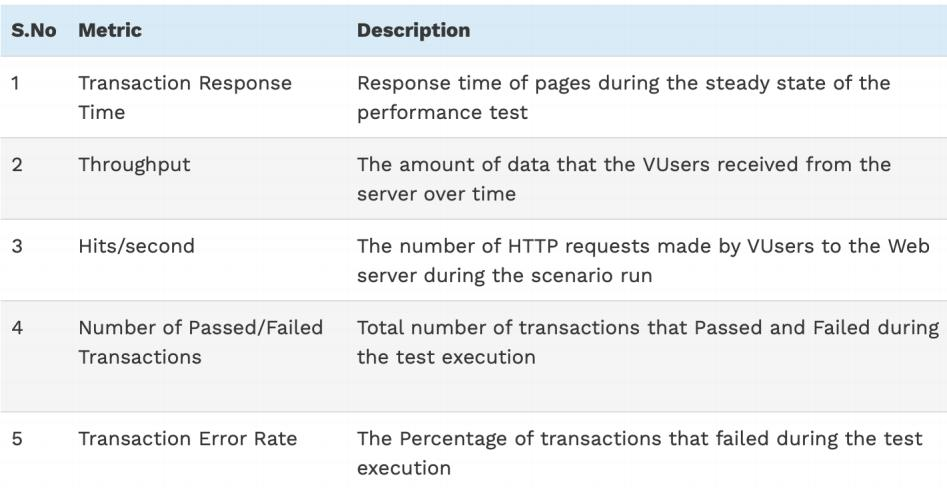

<!-- page: 7 -->

Performance Testing Metrics: Parameters Monitored

System & Network
Performance Metrics

7

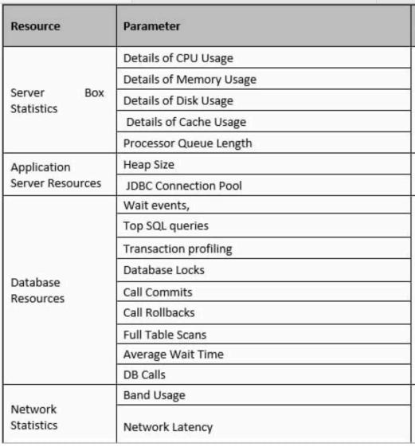

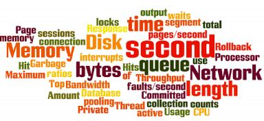

<!-- page: 8 -->

Example Performance Test Cases

  Baseline Test: To run each scenario with 1 Vuser and multiple iterations in order to identify

whether the application performance meets the business Service Level Agreement or not.

  Verify response time is not more than 4 secs when 1000 users access the website simultaneously.

  Verify response time of the Application Under Load is within an acceptable range when the

network connectivity is slow

  Verify response time of the application under low, normal, moderate and heavy load conditions.

  Check the maximum number of users that the application can handle before it crashes.

  Check database execution time when 500 records are read/written simultaneously.

  Check CPU and memory usage of the application and the database server under peak load

conditions

9

<!-- page: 9 -->

Types of Performance Testing

 Load testing – checks the application’s ability to perform under anticipated user loads.

The objective is to identify performance bottlenecks before the software application
goes live.
  Stress testing – involves testing an application under extreme workloads to see how it

handles high traffic or data processing. The objective is to identify the breaking point of

an application.
 Endurance testing – is done to make sure the software can handle the expected load over

a long period of time.
  Spike testing – tests the software’s reaction to sudden large spikes in the load generated

by users.
 Volume testing – Under Volume Testing large no. of. Data is populated in a database and

the overall software system’s behavior is monitored. The objective is to check software
application’s performance under varying database volumes.

10

<!-- page: 10 -->

Performance Testing Vs Load Testing Vs Stress Testing

Performance Testing is the superset for both load & stress testing.

 The primary goal of performance testing includes establishing the

benchmark behavior of the system.

 The benchmark and standard of the application should be set in terms

of attributes like speed, response time, throughput, resource usage,
and stability. All these attributes are tested in a performance test.

 Exposing defects in an application related to buffer overflow, memory

leaks and mismanagement of memory etc.

11

<!-- page: 11 -->

12

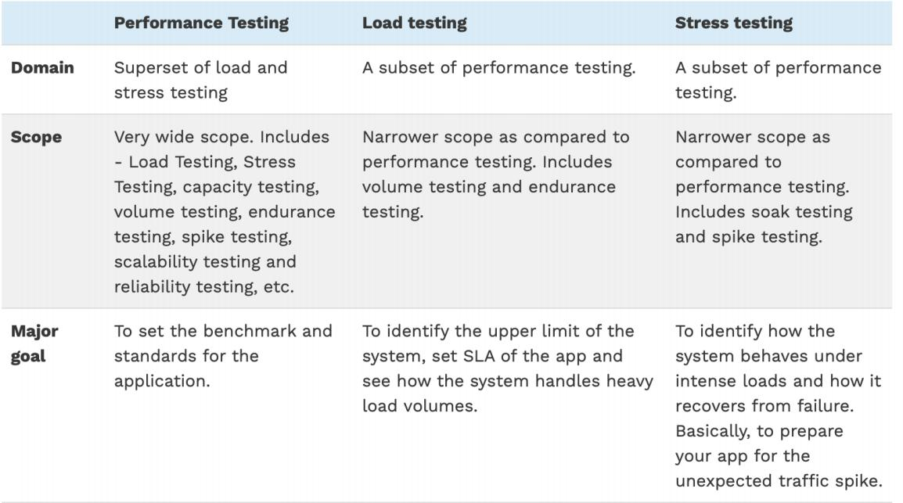

<!-- page: 12 -->

13

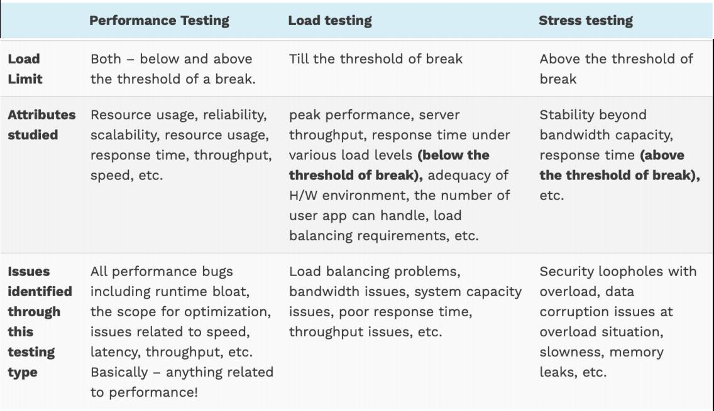

<!-- page: 13 -->

Load Vs Stress Vs Volume Testing

In volume testing, it is checked as for how the system behaves against a
certain volume of data.

Thus, the databases are stuffed with their maximum capacity and their
performance levels like response time and server throughput are monitored.

14

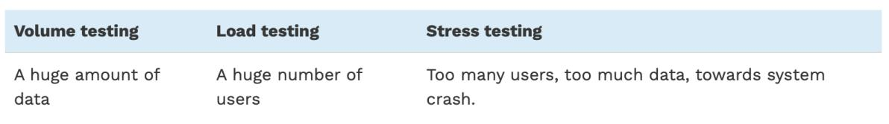

<!-- page: 14 -->

Performance Testing Process

1.   Identify your testing environment – Know your physical test environment, production
environment and what testing tools are available. Understand details of the hardware,
software and network configurations

2.   Identify the performance acceptance criteria – This includes goals and constraints for
throughput, response times and resource allocation.  It is also necessary to identify project
success criteria outside of these goals and constraints.

Testers should be empowered to set performance criteria and goals because often the

project specifications will not include a wide enough variety of performance benchmarks.

15

<!-- page: 15 -->

Performance Testing Process

3.   Plan & design performance tests – Determine how usage is likely to vary amongst end users
and identify key scenarios to test for all possible use cases. It is necessary to simulate a variety
of end users, plan performance test data and outline what metrics will be gathered.

4.   Configuring the test environment – Prepare the testing environment before execution. Also,
arrange tools and other resources.

5.   Implement test design – Create the performance tests according to your test design.

6.   Run the tests – Execute and monitor the tests.

7.   Analyze, tune and retest – Consolidate, analyze and share test results. Then fine tune and test
again to see if there is an improvement or decrease in performance. Since improvements
generally grow smaller with each retest, stop when bottlenecking is caused by the CPU. Then
you may have the consider option of increasing CPU power.

16

<!-- page: 16 -->

Performance Tuning

17

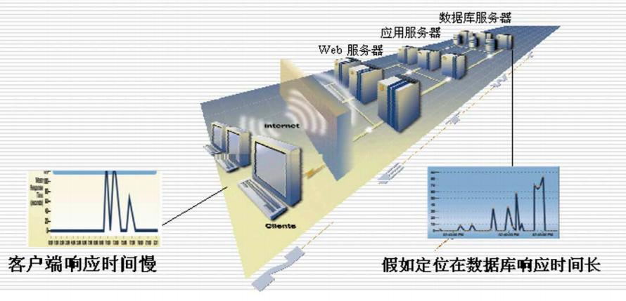

<!-- page: 17 -->

Performance Testing Automation

advantages of Automation Testing:

   The same test script can be used for every execution by just

making changes in test data (wherever required)
   Execution time is much less compared to manual execution
   Consistent results

18

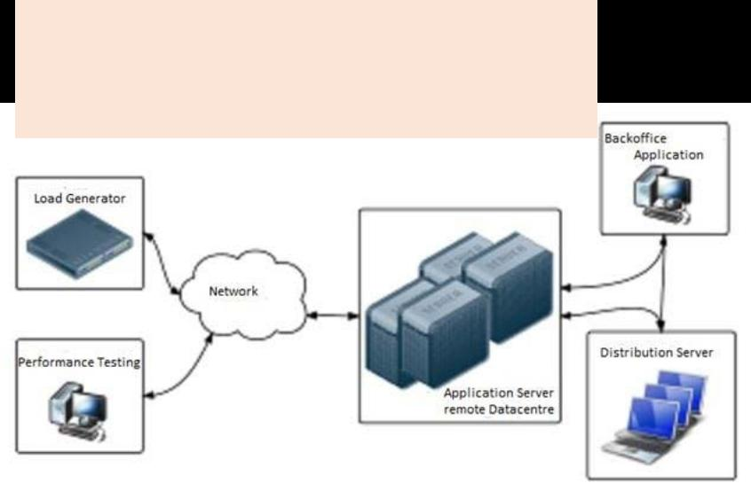

<!-- page: 18 -->

Performance Test Tools

1.   HP LoadRunner – is the most popular performance testing tools on the market today. This tool is
capable of simulating hundreds of thousands of users, putting applications under real-life loads to
determine their behavior under expected loads. Loadrunner features a virtual user generator which
simulates the actions of live human users.

LoadRunner Architecture Diagram

2.  Apache Jmeter – one of the leading tools used for load testing of web and application servers

19

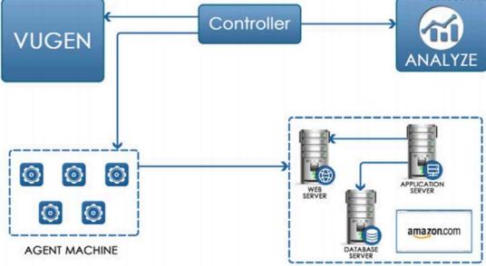

<!-- page: 19 -->

Suppose you are assigned to check the performance of Amazon.com for 5000 users

1. Virtual User Generator (VUGen)    -------  Create VUGen Scripts

 A rich coding editor and used to replicate System Under Load (SUL) behavior.
 Provides a “recording” feature which records communication to and from client

and Server in form of a coded script – also called VUser script.

VUGen can record to simulate following business processes:

1. Surfing the Products Page of Amazon.com
2. Checkout
3. Payment Processing
Checking MyAccount Page

4.

20

<!-- page: 20 -->

Suppose you are assigned to check the performance of Amazon.com for 5000 users

2.   Controller--------   Scenario Creation  /Scenario Execution

Controls the Load simulation by managing, for example:

   How many VUsers to simulate against each business process or VUser Group
   Behavior of VUsers (ramp up, ramp down, simultaneous or concurrent nature etc.)
   Nature of Load scenario e.g. Real Life or Goal Oriented or verifying SLA
   Which injectors to use, how many VUsers against each injector

21

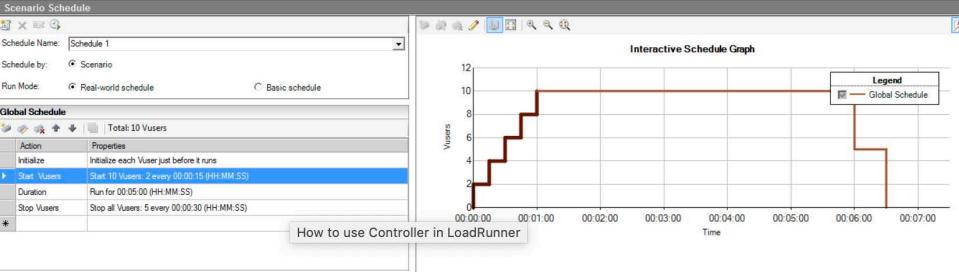

<!-- page: 21 -->

Suppose you are assigned to check the performance of Amazon.com for 5000 users

Controller will add the following parameter to the VUGen Script

1) 3500 Users are Surfing the Products Page of Amazon.com
2) 750 Users are in Checkout
3) 500 Users are performing Payment Processing
4) 250 Users are Checking MyAccount Page ONLY after 500
users have done Payment Processing

more complex

1)  Initiate 5 VUsers every 2 seconds till a load of 3500
VUsers (surfing Amazon product page) is achieved.
2)  Iterate for 30 minutes
3)  Suspend iteration for 25 VUsers
4)  Re-start 20 VUSers
5)  Initiate 2 users (in Checkout, Payment Processing,
MyAccounts Page) every second.
6)  2500 VUsers will be generated at Machine A
7)  2500 VUsers will be generated at Machine B

scenarios are possible

22

<!-- page: 22 -->

Suppose you are assigned to check the performance of Amazon.com for 5000 users

3.   Analysis   -------      (Results Analysis )

    During the execution, Controller creates a dump of results in raw form
•  The “Analysis” component reads this file to perform various types of analysis
and generates graphs

•   These graphs show various trends to understand the reasoning behind errors and failure
under load; thus help to figure whether optimization is required in Server or infrastructure.

Bandwidth could be
creating a bottleneck

23

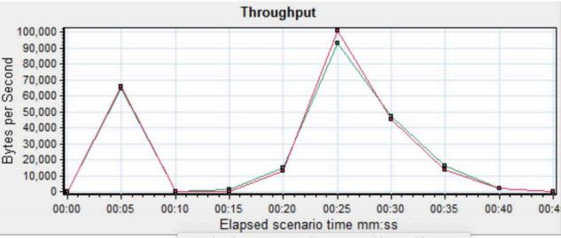
