# Ch10-3 SystemTesting

<!-- page: 1 -->

System Testing

Spring, 2026

1

<!-- page: 2 -->

Contents

 Non-Functional Testing

  Usability Testing

  Performance Testing

  Security Testing

2

<!-- page: 3 -->

System Security

The goal of computer security is to protect computer assets (e.g.,
servers, applications, web pages, data) from:

 corruption
 unauthorized access
 denial of authorized access
 malicious software
Security is strengthened by:

 physically limiting the access of  computers to trusted users
 hardware mechanisms (e.g., biometrics)
 operating system mechanisms that impose rules on untrusted programs

(e.g., role-based access control)
 anti-virus software to detect malware
 secure coding techniques (e.g., array bounds checking) to make code less

vulnerable to security attacks.

3

<!-- page: 4 -->

Security Testing

 Security Testing is a type of Software Testing that uncovers vulnerabilities

of the system and determines that the data and resources of the system are
protected from possible intruders.

 Security testing of any system focuses on finding all possible loopholes and

weaknesses of the system which might result into the loss of information or
repute of the organization.

 The goal of security testing is to:

1.   To identify the threats in the system.
2.   To measure the potential vulnerabilities of the system.
3.   To help in detecting every possible security risks in the system.
4.   To help developers in fixing the security problems through coding

4

<!-- page: 5 -->

Security Testing - Terms

 Security Testing is a type of Software Testing that uncovers vulnerabilities

of the system and determines that the data and resources of the system are
protected from possible intruders.

   Corrupted (loss of integrity)
   Leaky(loss of confidentiality)
   Unavailable or very slow (loss of availability)

5

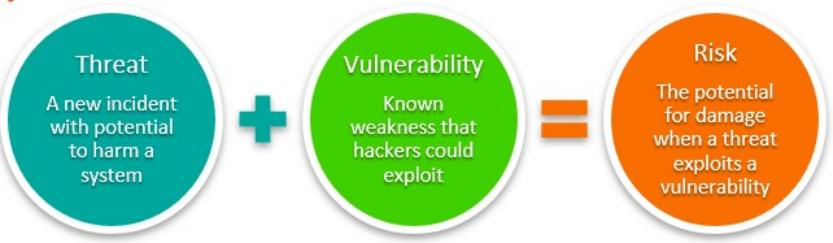

<!-- page: 6 -->

Approaches to  Security Testing

1.  Threat Modeling

2.  Vulnerability Scanning

3.  Penetration testing

6

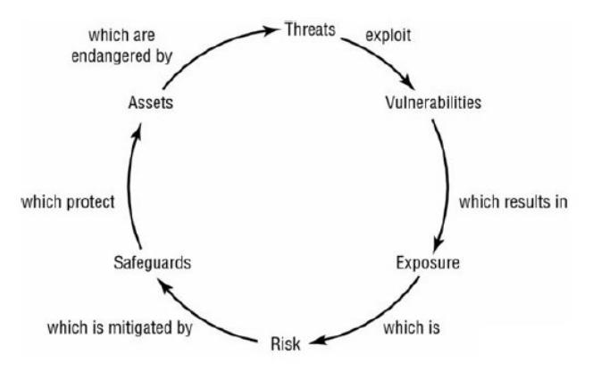

<!-- page: 7 -->

1. Threat Modeling

 Threat modeling is a process that helps the architecture team:

  Accurately determine the attack surface for the application
  Assign risk to the various threats
  Drive the vulnerability mitigation process

  The purpose of threat modeling

   Provide defenders with a systematic analysis  what controls or defenses need to be

included ,  given the nature of the system , the probable attacker’s profile

,  the most likely attack vectors ,  and the assets most desired by an attacker.

 Threat modeling answers questions like:

“Where am I most vulnerable to attack?”
“What are the most relevant threats?”

“What do I need to do to safeguard against these threats?”

7

<!-- page: 8 -->

Threat Modeling process

1) Understand the security requirements
   Use Scenarios –what are the boundaries of the security problem
   Identify external dependencies –OS, web server, network, …
   Define security assumptions –what can you expect with regard to security; will the DB encrypt

columns? Is there a key manager? What are the limitations you are working with.
2) Create an activity matrix (actor-asset-action matrix)
   Identify assets
   Identify roles
   Their interaction
3) Create Trust Boundaries
   Identify threats that put assets at risk
   Identify attacks that can be used to realize each threat

•Threat Trees
•Abuse Cases
   Determine the risk for each attack and prioritize (if needed)
   Define the conditions required for each attack to be successful
4) Plan and implement your mitigations
8

<!-- page: 9 -->

Threat Modeling Example  -  Online Library System Threat Model

1)  Use Scenarios

  Students can search the database(s)
  Students can put holds on some items for checkout
  Staff can search the database(s)
  Staff can place some items on reserve for up to 15 weeks
 Librarians can do anything students or staff can do
 Librarians can place items on an invisible list
 Librarians can access limited account information

9

<!-- page: 10 -->

Threat Modeling Example  -  Online Library System Threat Model

2)  External Dependencies

  Server type will be Linux
  System will have to be off-campus accessible
 MySQL database
 Database server will be the existing library server
 Private network between web server and dbserver
 Both servers must be behind the campus firewall
 All communications over TLS

10

<!-- page: 11 -->

Threat Modeling Example  -  Online Library System Threat Model

3)  Roles
  Anonymous user –connected, but not yet authenticated
  Invalid user –attempted to authenticate and failed
  Student –authenticated student
  Staff –authenticated staff
  Librarian –authenticated librarian
  System admin –authenticated site administrator with configuration privileges
  DB admin –authenticated database administrator with full db privileges
   Web server user –user/process id of web server
  Database read user –dbuser for accessing the database with read-only access
  Database write user –dbuser for accessing the database with read-write access

11

<!-- page: 12 -->

Threat Modeling Example  -  Online Library System Threat Model

4)  Assets
  Library users and librarian
  User credentials
  Librarian credentials
  User personal information
  Web site system
  DB system
  Availability of the web server
  Availability of the DB server
  User code execution on web site
  User DB read access
  Librarian/Admin code execution on the web site
  Librarian/Admin DB read/write access
  Ability to create users
  Ability to audit system events

12

<!-- page: 13 -->

Threat Modeling Example  -  Online Library System Threat Model

5)  Activity Matrix

13

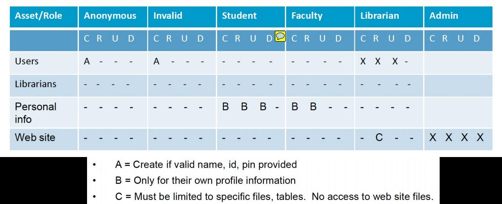

<!-- page: 14 -->

Threat Modeling Example  -  Online Library System Threat Model

6)  Trust Boundaries

14

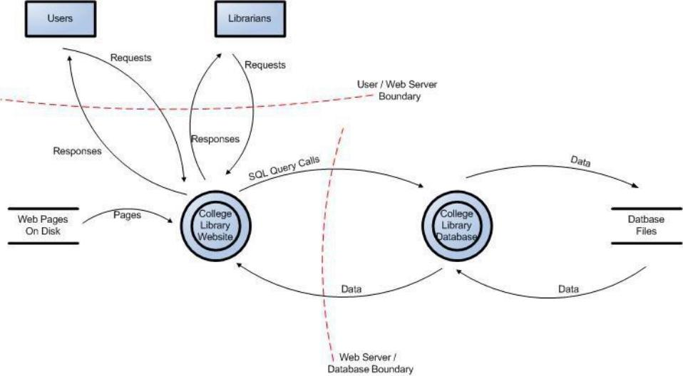

<!-- page: 15 -->

Threat Modeling Example  -  Online Library System Threat Model

7)  Login
DFD

15

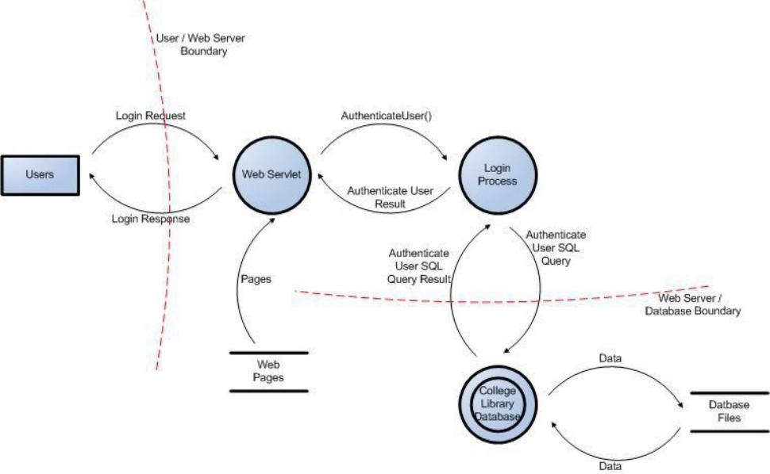

<!-- page: 16 -->

Threat Modeling Example  -  Online Library System Threat Model

8)  Threats
  Anonymous user evades the authentication system
  Anonymous user gathers information from the authentication system
  Anonymous user can forcefully browse to pages
  Librarian has access to web site pages on the server
  Student or Staff can modify privilege level
  Student or Staff can forcefully browse to restricted pages
  Any user can tamper with critical data on the client
  Student/Staff/Anonymous can inject SQL into the database
  Student/Staff/Anonymous can inject JavaScript into an HTML page
  SSL version is vulnerable or allows vulnerable algorithms
   … ..

It is fine to use STRIDE and think about every place
where Spoofing, Tampering, … . can be used

16

<!-- page: 17 -->

Microsoft STRIDE Threat Model

电子欺骗
破坏
否认
信息泄露
拒绝服务
权限提升

17

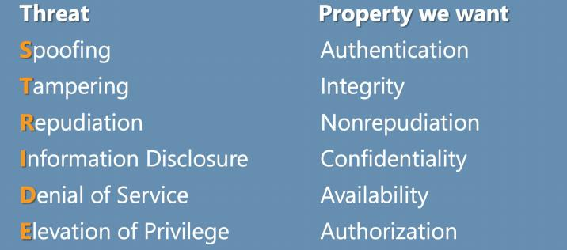

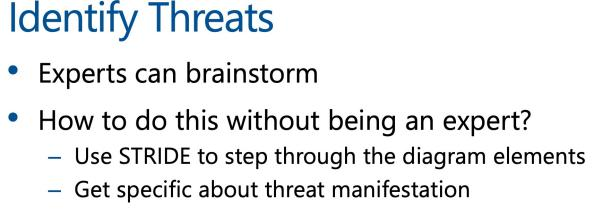

<!-- page: 18 -->

18

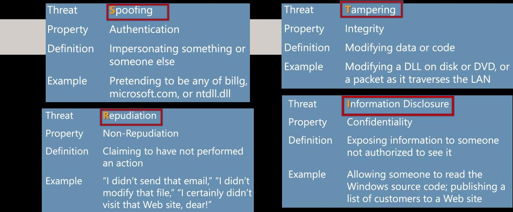

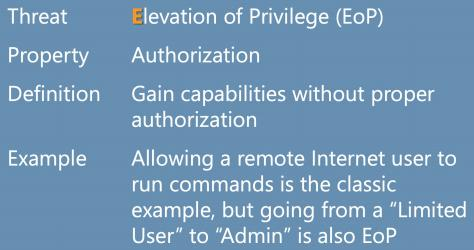

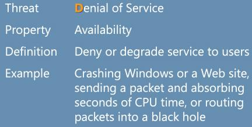

<!-- page: 19 -->

Threat Modeling Example  -  Online Library System Threat Model

9 ) Understand the threats : Threat Tree

20

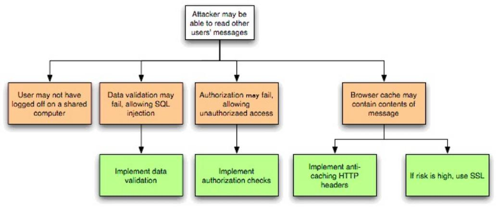

<!-- page: 20 -->

Threat Modeling Example  -  Online Library System Threat Model

Abuse Case

21

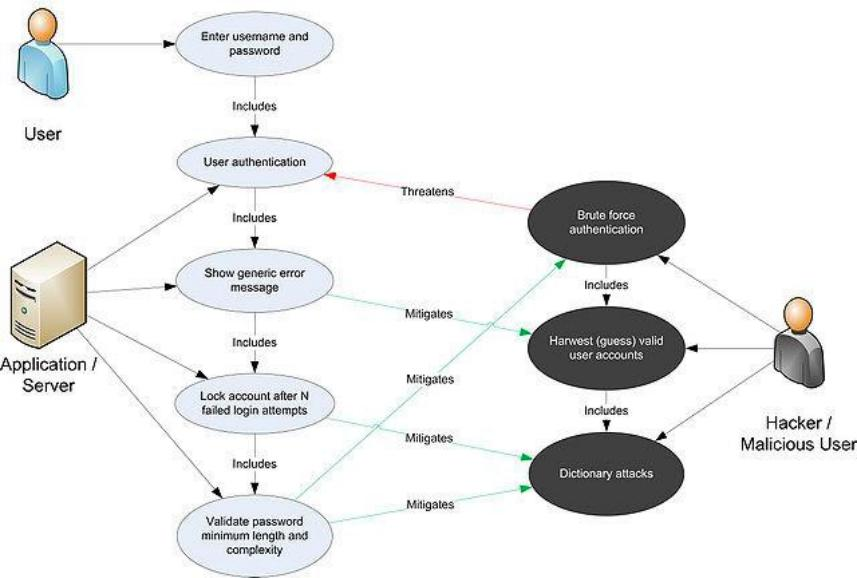

<!-- page: 21 -->

Threat Modeling Example  -  Online Library System Threat Model

10) Plan your mitigations

   Authentication

  All credentialed users require user name and password required for authentication
  All pages check authentication
  All credentials communicated only with secure channel
  No backdoor accounts or default accounts can be left available
   Authorization

  Use role-based authentication with unlimited levels, but including anonymous, user, staff,

librarian, admin
  All accesses will use least privilege and fail securely
   Cookie Management
   Data/Input Validation
   Error Handling
   Logging/Auditing
   Cryptography
   Secure Code Environment
   Session Management

22

<!-- page: 22 -->

2.  Vulnerability Scanning

 Vulnerability scanning is the process of discovering, analyzing, and

reporting on security flaws and vulnerabilities.

 Vulnerability scans are conducted via automated vulnerability scanning

tools to identify potential risk exposures and attack vectors across an

organization’s networks, hardware, software, and systems.

 The types of vulnerability scanners are:

   Port Scanner
   Web Application Vulnerability Scanner
   Network Vulnerability Scanner
   Host-based Vulnerability Scanner
   Database Scanners
   Source Code Vulnerability Scanner
   Cloud Vulnerability Scanner

23

<!-- page: 23 -->

Vulnerability Scanner

 A tool that tell which host is vulnerable to what

given a set of vulnerabilities (plugins)

 Original vulnerability scanner

   It was called SATAN (Security Admin Tool for Analyzing Networks)
   Written by Dan Farmer in 1995 employed by SGI at the time
   Very controversial when released
   It eventually resulted in SGI firing Dan Farmer

o Tenable Nessus
o Qualys Vulnerability Management
o Netsparker
o Amazon Inspector
o Acunetix Vulnerability Scanner
o SAINT Security Suit
o Metasploit
o Nmap
o … … .

24

<!-- page: 24 -->

Vulnerability Scanner ------ Nessus

 Nessus project started by Renaud Deraison in 1998

 Very popular vulnerability scanner

 Oct 2005 founded Tenable security and changed to “closed source”

 Still free but with limited signature set

 OPEN-VAS is a fork of the original Nessus code

   and is still open source at http://www.openvas.org

25

<!-- page: 25 -->

Software Vulnerability

A software vulnerability is an instance of a fault in the specification,
development, or configuration of software such that its execution can violate
the (implicit or explicit) security policy.

Types of vulnerabilities

The most common form of security
vulnerability in the last 10 years

 E.g., Buffer Overflows
  SQL Injection
 Weak password
 HTTP Trace

28

<!-- page: 26 -->

Buffer Overflow vulnerability, Exploits & Attacks

 A buffer overflow, or buffer overrun, is a common software coding mistake

that an attacker could exploit to gain access to your system.

 Reading or writing past the end of the buffer      overflow
 As a result, any data that is allocated near the buffer can be read and

potentially modified (overwritten)

  A password flag can be modified to log in as someone else.
  A return address can be overwritten so that it jumps to arbitrary code that the

attacker injected (smash the stack)      attacker can control the host.

    This vulnerability can cause a system crash or, worse, create an entry

point for a cyberattack.

 C and C++ are more susceptible to buffer overflow.

29

<!-- page: 27 -->

3. Penetration testing

   Penetration testing, or pen testing, is a threat assessment strategy that

involves simulating real attacks to evaluate the risks associated with
potential security breaches.

    It is a simulated cyberattack against your computer system to uncover

potential vulnerabilities that could hamper the security of your system.

   Sometimes called ethical hacking, pen testing is intended to seek out

exploitable vulnerabilities against an organization’s security infrastructure.

53

<!-- page: 28 -->

Penetration testing

  External vs. Internal

  Penetration Testing can be performed from the viewpoint of

an    external attacker or a malicious employee.

  Overt vs. Covert

  Penetration Testing can be performed with or without the

knowledge of the IT department of the company being tested.

54

<!-- page: 29 -->

Difference between Penetration Test and Vulnerability Scan

     Strategy
      Vulnerability assessment checks for known weaknesses in a system and generates a

report on risk exposure
      Pen testing is meant to exploit weaknesses on a system or an entire IT infrastructure to

uncover any threats to the system.

     Scope
      Pen testing not only involves discovering vulnerabilities that could be used by attackers

but also exploiting those vulnerabilities to assess what attackers can exploit after a breach.

So, vulnerability assessment is one of the essential prerequisites for doing a pen test.

    Approach
      A vulnerability assessment is an automated process performed with the help of automated

tools to scan for new and existing threats that can harm your system.
      Pen testing requires a well-planned, methodological approach and is performed by

experienced individuals who understand all the facets of security posture.

55

<!-- page: 30 -->

Phases of Penetration Testing

  - Reconnaissance and Information Gathering

  - Network Enumeration and Scanning

  - Vulnerability Testing and Exploitation

  - Reporting

56
