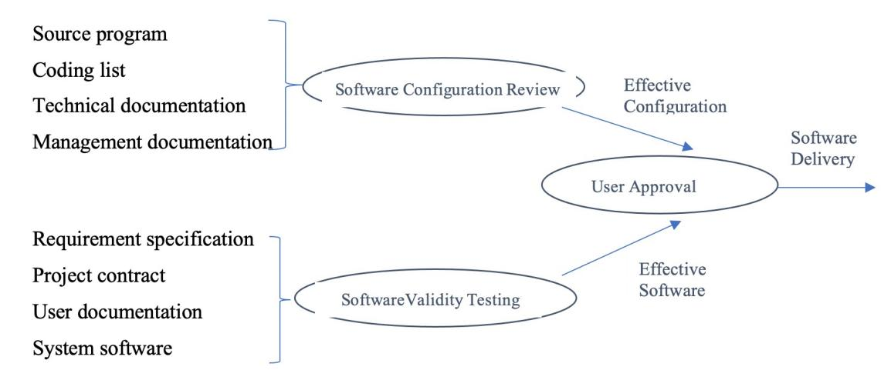
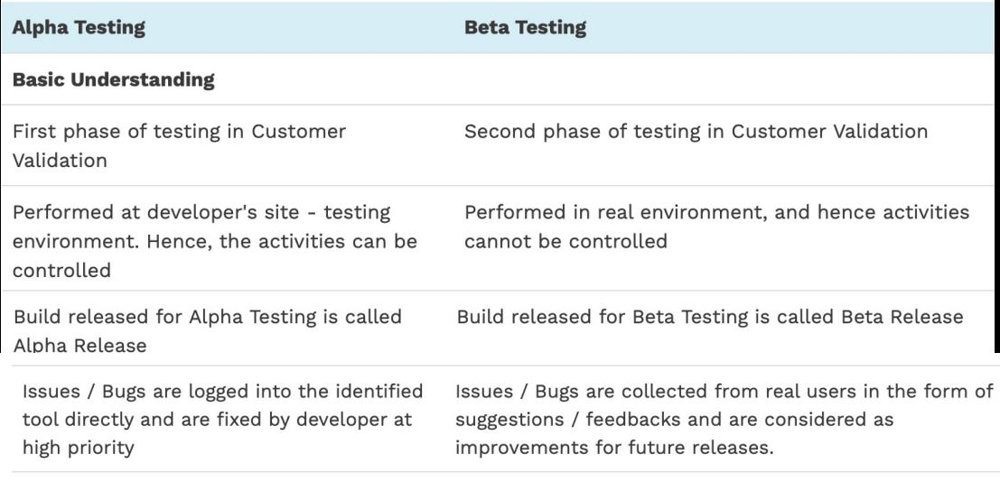
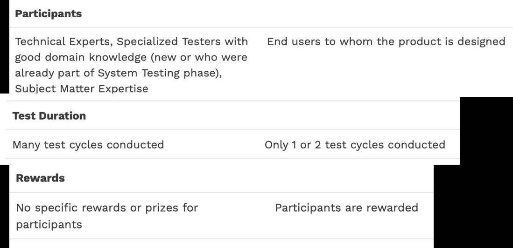

# Ch11 AcceptanceTesting

<!-- page: 1 -->

Acceptance Testing

Spring, 2026

1

<!-- page: 2 -->

Contents

 What is Acceptance Testing

 Contents of Acceptance Testing

 Alpha Testing & Beta Testing

 Brief comparison of four phases of software testing

2

<!-- page: 3 -->

1. What is Acceptance Testing

Acceptance testing is the final level of software testing where the system is
tested for compliance to its business requirements.

It is performed by the client or the end users with the intent to see if the product
is fit for delivery.

It is carried out after system testing and before the final delivery to the client.

It works under the Black Box Testing Method.

3

<!-- page: 4 -->

2. Contents of Acceptance Testing

Two parts: Software Configuration Review and Software Validity Testing.

1.   Software configuration review

Common software configuration items include  ：

(1) Main software program configuration, generally including source

program, executable program, software installation and configuration

script, key test script or test program

(2) Main technical documents

(3) Main development management documents

4

<!-- page: 5 -->

Contents of Acceptance Testing

 Complete the following checks for the software configuration :

(1) Source code check

   Normative check
   Data type check
   Check external interfaces
(2) Software consistency check

   Compile check
   Install and uninstall tests
   Run the module consistency check

 Check the following items for documents :

   Completeness
   Normative
   Targeted
   Complete independence
   Flexibility
   Traceability

5

<!-- page: 6 -->

Contents of Acceptance Testing

2. Software validity test
  Software interface testing
  Usability testing
  Functional testing（including normal business process testing and error

handling capability testing）
  Performance test（including load, volume and stress testing）
  Software executing environment and system platform configuration testing
  Robustness testing( including recovery tests under various hardware and

software failures)
  Reliability testing
  Compatibility testing
  Data backup testing
  Security testing

6

<!-- page: 7 -->

Contents of Acceptance Testing

7

<!-- page: 8 -->

Acceptance Testing Consideration

(1)  Before the acceptance test, a formal acceptance test plan shall be prepared to clarify the criteria

for passing the acceptance test, which shall be confirmed by users.

(2)  The acceptance test must be carried out in the actual use environment of end users, or simulate

the actual operation environment of users, so as to avoid some potential problems of software
that cannot be found due to environmental differences.

(3)  Acceptance tests should cover coarse-grained, business-level functions of the software. There

is traceability between acceptance test cases and software project contracts and software
requirements specifications.

It is not possible or necessary for acceptance test cases to re-run all test cases conducted during the
development phase.

8

<!-- page: 9 -->

Acceptance Testing Consideration

(4) The acceptance test must be user-oriented and conducted in a way that users
can intuitively perceive from the perspective of the actual business scenarios used
by end users.

(5) The design of acceptance test cases must fully consider the user‘s way of
thinking, usage habits, business language, etc., and organize test cases and test
procedures according to the main business scenarios. It focuses on the function
points and performance points that customers care most about.

9

<!-- page: 10 -->

3. Alpha Testing & Beta Testing

 Alpha and Beta testing are Acceptance Testing types(Customer

Validation methodologies ) that help in building confidence to launch the
product, and thereby result in the success of the product in the market.

 Alpha and Beta Testing phases mainly focus on discovering the bugs

from an already tested product and they give a clear picture of how the
product is used by the real-time users.

10

<!-- page: 11 -->

Alpha Testing

 Alpha testing is the form of acceptance testing that takes place at

the developer’s site.

 It can be carried out by both in-house developers and QAs as well

as potential end-users as well.

 Alpha testing is not open to the world.

11

<!-- page: 12 -->

Beta Testing

 Beta Testing (Field Testing) is the form of acceptance testing that takes place

at the customer’s or the end user’s site.

 It is performed after alpha testing and in the real-world environment without

the presence or control of developers.

 Beta tests or the beta version of the application are normally open to the

whole world (or client).

For example, recently Microsoft corporation released Windows 10 beta and based
on the feedback from thousands of users they managed to release a stable OS
version. In the past, Apple also released OS X beta in public and fixed many minor

issues and improved the OS based on user feedback.

12

<!-- page: 13 -->

Alpha Testing & Beta Testing

13

<!-- page: 14 -->

Alpha Testing & Beta Testing

14

<!-- page: 15 -->

4. Brief  comparison of software testing phases

Items
Unit Testing
Integration Testing
System Testing
Acceptance Testing

Interfaces between
modules, such as parameter

Software units, such
as functions, classes,
components, modules

The entire system,
including hardware

The entire system,
including hardware and

Test
object

and software

software

passing

Software
requirements

Requirements
specification, contract,

Test basis
Detailed software

Software architecture

design

design

specification

acceptance criteria

User-dominant,
developer and tester

primarily the
responsibility of
professional testers

Tester
Developer or white

Developers and testers

box test engineer

work together

work together

Black box testing is
mainly used while white
box testing is the secondary

White box test is

Test
methods

Fully black-box

testing
Fully black-box testing

mainly used

Use or simulate real

Use or simulate real
business data whenever

Test data
Real data is generally

Real data is generally not

business data
whenever possible

not used

used

possible

15
