# Ch12 BugReport_Test Report

<!-- page: 1 -->

Bug Report  &  Test Summary Report

Spring, 2026

1

<!-- page: 2 -->

Contents

 Tips for Software Testing Documentation

 Bug Report

 Test Summary Report

2

<!-- page: 3 -->

1. Tips for Software Testing Documentation

Projects that have documents have a high level of maturity.

Lack of documentation is becoming a problem for acceptance.

1) QA should involve in the very first phase of the project so that QA and Documentation work hand in
hand.

2) The process defined by QA should be followed by technical people, this helps to remove most of the
defects at a very initial stage.

3) Just creating and maintaining Software Testing Templates is not enough, force people to use them.

4) Don’t just create and leave the document, Update as and when required.

5) Change requirement is an important phase of the project, don’t forget to add them to the list.

6) Use version control for everything. This will help you to manage and track your documents easily.

7) Make defect remediation process easier by documenting all defects. Make sure to include a clear
description of the defect, reproduce steps, affected area and details about the author while documenting
any defect.

3

<!-- page: 4 -->

Software Testing Documents

List some software testing documents that we need to use/maintain
regularly:

1)  Test Plan
2)  Test Design and Test Case Specification
3)  Test Strategy
4)  Weekly Status Report
5)  User Acceptance Report
6)  Risk Assessment
7)  Test Log
8)  Bug Reports
9)  Test Summary Reports
…….

4

<!-- page: 5 -->

2. Bug Report

 Abug report is a document that outlines information about what,s

wrong with the software.
 It lists the reasons or seen errors to point out what exactly is viewed as

wrong, and also includes a request and/or details for how to address it.

 A bug report needs to be clear, actionable and simple to complete.

“This is what we have, this is what
we should have instead, so fix it.”

 The point of writing a defect report (bug report) is to get bugs fixed.

5

<!-- page: 6 -->

Bug Report

A good bug report:

   Contains the information needed to reproduce and fix problems
   Is an efficient form of communication for both bug reporter and

bug receiver
   Can be and is resolved as fast as possible
   Is sent to the person in charge
   Is filed in a defined way
   Establishes a common ground for collaboration

6

<!-- page: 7 -->

Important Features in  Bug Report

1) Bug Number/id
A Bug number or an identification number The developer can easily check if a particular bug has been

fixed or not. It makes the whole testing and retesting process smoother and easier.

2) Bug Title
The Bug title should be suggestive enough that the reader can understand it. A clear bug title makes it
easy to understand and the reader can know if the bug has been reported earlier or has been fixed.

3) Report Type
One or more field which will describe the bug type, including:

   Coding error
   Design error
   New Suggestion
   Documentation issue
   Hardware problem

7

<!-- page: 8 -->

Important Features in  Bug Report

4)   Severity: This describes the impact of the bug.
Types of Severity:

   Blocker: No further testing work can be done.
   Critical: Application crash, Loss of data.
   Major: Major loss of function.
   Minor: Minor loss of function.
   Trivial: Some UI enhancements.
   Enhancement: Request for a new feature or some enhancement in the existing one.

5) Priority: When should a bug be fixed? Priority is generally set from P1 to P5. P1 as
“fix the bug with the highest priority” and P5 as ” Fix when time permits” .

8

<!-- page: 9 -->

Important Features in  Bug Report

6) Status: By default the bug status will be ‘New’. Later on, the bug goes through
various stages like Fixed, Verified, Reopen, Won’t Fix, etc.

7) Assign To: If you know which developer is responsible for that particular module
in which the bug occurred, then you can specify the email address of that developer. Else
keep it blank as this will assign the bug to the module owner, if not the Manager will

assign the bug to the developer.

9

<!-- page: 10 -->

Important Features in  Bug Report

8) Platform/Environment

   OS and browser configuration is necessary for a clear bug report. It is the best way to

communicate how the bug can be reproduced.
   Without the exact platform or environment, the application may behave differently and the

bug at the tester’s end may not replicate on the developer’s end.

9) Description
   Bug description helps the developer to understand the bug. It describes the problem

encountered.
   It is a good practice to describe each problem separately instead of crumbling them

altogether. Don’t use terms like “I think” or “I believe”.

10

<!-- page: 11 -->

Important Features in  Bug Report

 Steps to Reproduce

A good Bug report should clearly mention the steps to reproduce. These steps should
include actions that may cause the bug. Don’t make generic statements. Be specific on
the steps to follow.

A good example of a well-written procedure is given below Steps:

   Select product Abc01.
   Click on Add to cart.
   Click Remove to remove the product from the cart.

11

<!-- page: 12 -->

Important Features in  Bug Report

 Expected and Actual Result

   A Bug description is incomplete without the Expected and Actual results.
    It is necessary to outline what the outcome of the test is and what the user should

expect.

 Screenshot

   A picture is worth a thousand words. Take a Screenshot of the instance of failure with

proper captioning to highlight the defect.
   Highlight unexpected error messages with light red color. This draws attention to the

required area.

12

<!-- page: 13 -->

Bug life cycle covers all possible status

13

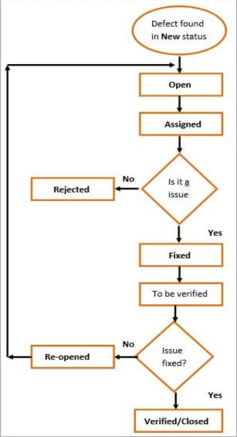

<!-- page: 14 -->

What is a bug reporting system?

 Bug Reporting System
 Bug Tracking Software
 Issue Tracking Software
 Issue Management Software
 Defect Tracking System

A bug reporting system is an application “that keeps track of reported software bugs” .
Therefore, a bug reporting software allows you to report, document, store, manage, assign,
close & archive the reports.

14

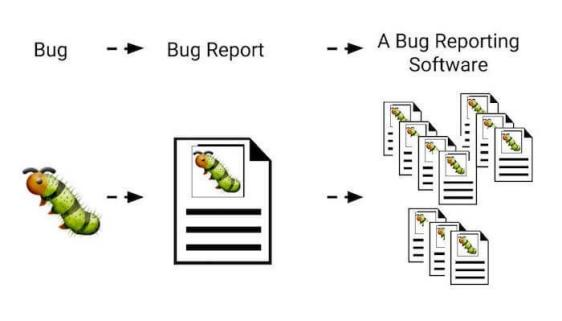

<!-- page: 15 -->

Bug reporting system

Such as:  QC(Quality center)、禅道、Mantis 、JIRA 、TestLink 、Bugzilla

15

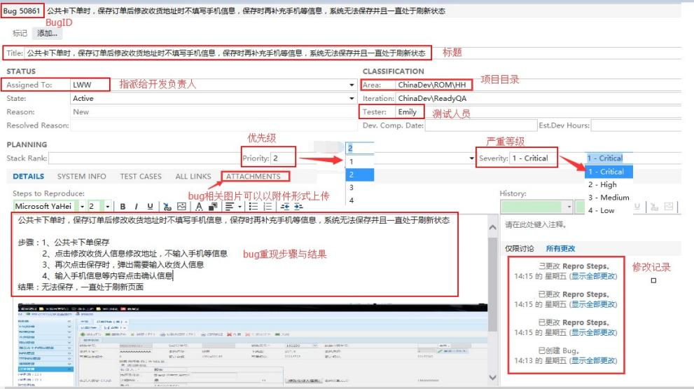

<!-- page: 16 -->

Bug reporting system

16

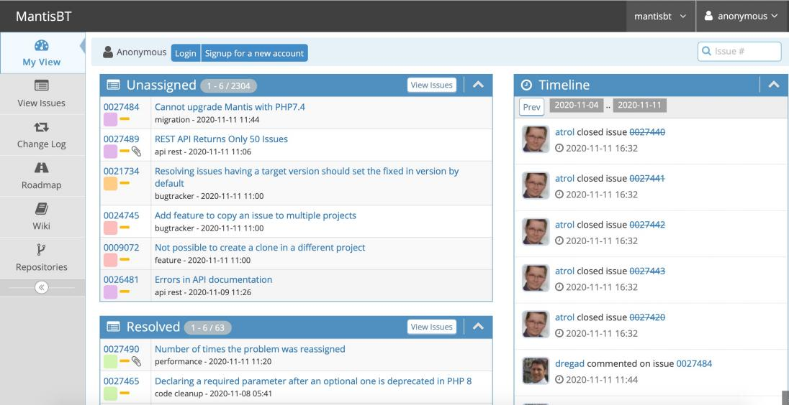

<!-- page: 17 -->

Bug reporting system

17

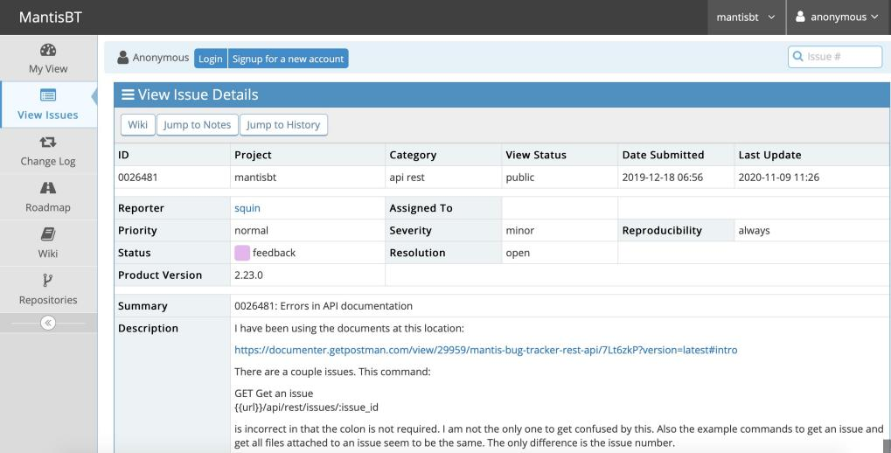

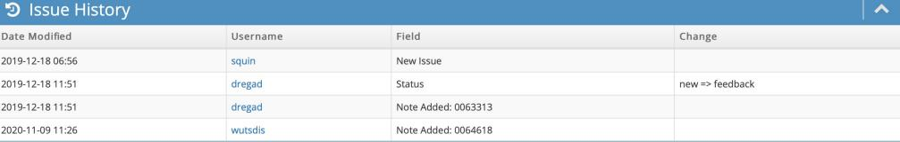

<!-- page: 18 -->

3. Test Summary Report

 Test Summary Report is an important deliverable which is prepared at the

end of a Testing project, or rather after Testing is completed.

 The prime objective of this document is to explain various details and

activities about the Testing performed for the Project, to the respective
stakeholders like Senior Management, Client, etc.

 After performing exhaustive testing, publishing the test results, metrics, best

practices, lessons learned, conclusions on ‘Go Live’ etc. are extremely

important to produce that as evidence for the Testing performed and the
Testing conclusion.

18

<!-- page: 19 -->

What Test Summary Report Contains?

 Application Overview

< Brief description of the application tested>

 Types of testing performed

<Describe the various types of Testing performed for the Project. This will make sure the
application is being tested properly through testing types agreed as per Test Strategy.>

 Test Environment & Tools

<Provide details on Test Environment in which the Testing is carried out. Server, Database, Application URL, etc>

19

<!-- page: 20 -->

What Test Summary Report Contains?

 Testing Scope
1.In Scope
2.Out of Scope
3.Items not tested

<This section explains the functions/modules in scope & out of scope for
testing; Any items which are not tested due to any
constraints/dependencies/restrictions>

•In-Scope: Functional Testing for the following modules are in Scope of Testing
•  Registration
•  Booking
•  Payment

•Out of Scope: Performance Testing was not done for this application.

•Items not tested: Verification of connectivity with the third party system ‘Central repository system’
was not tested, as the connectivity could not be established due to some technical limitations.

20

<!-- page: 21 -->

What Test Summary Report Contains?

 Metrics

<Metrics will help to understand the test execution results, the status of test cases &
defects, etc. Required Metrics can be added as necessary.

Example: Defect Summary-Severity wise; Defect Distribution-Function/Module wise;
Defect Ageing etc.. Charts/Graphs can be attached for better visual representation>

21

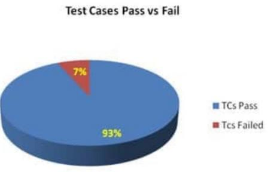

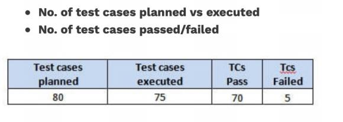

<!-- page: 22 -->

What Test Summary Report Contains?

22

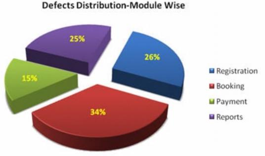

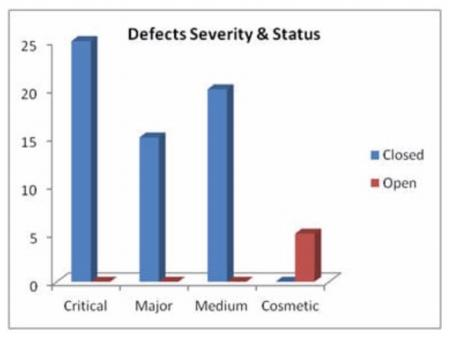

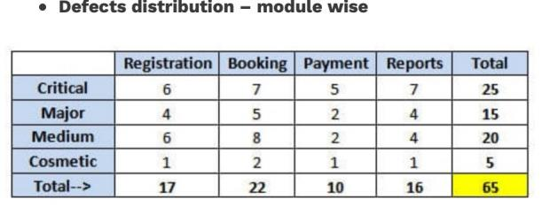

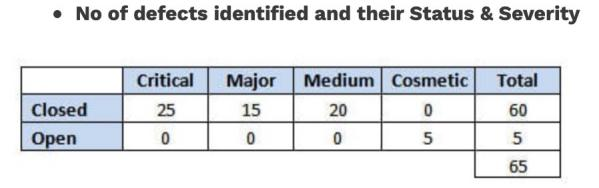
