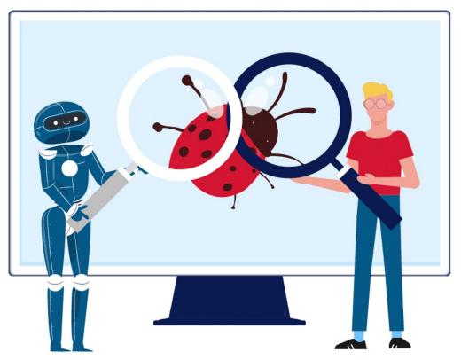
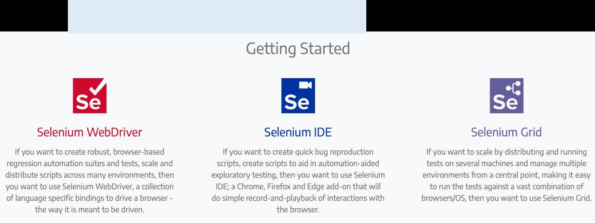
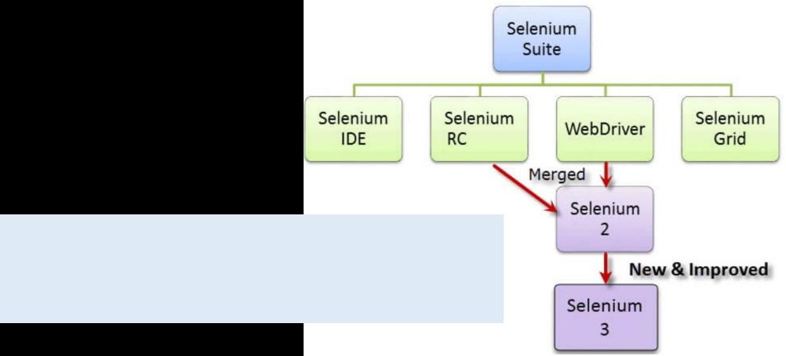
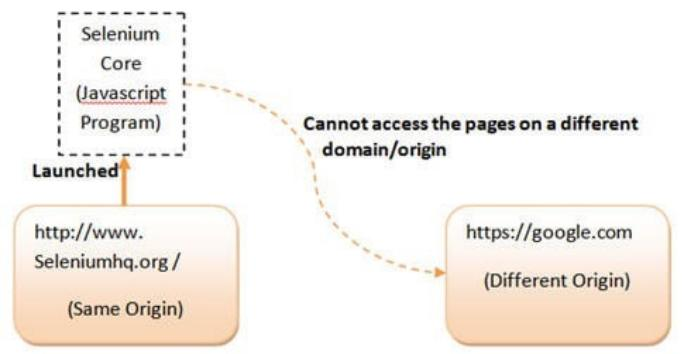
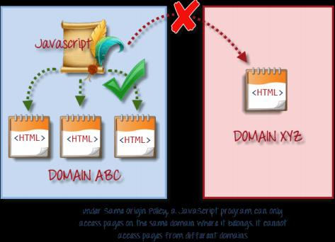
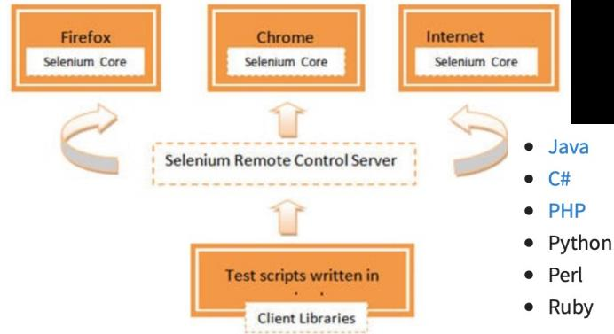
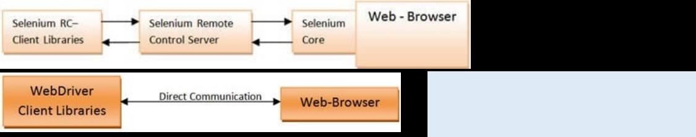
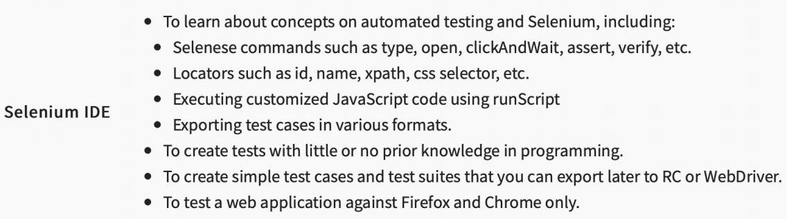
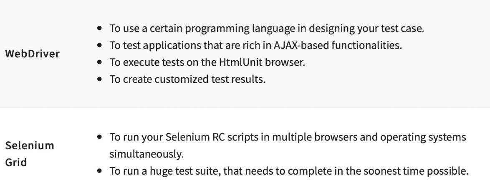
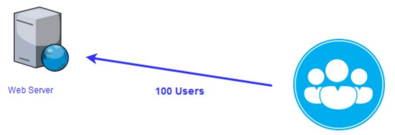

# Ch13 AutomatedTesting

<!-- page: 1 -->

Automated  Software  Testing

Spring, 2026

1

<!-- page: 2 -->

Contents

 Why we need Automated Testing

 What is Automated Testing

 Automation Tools

 Selenium

 Jmeter

2

<!-- page: 3 -->

1. Why we need Automated Testing

1) Manual software testing is slow, error-prone, and hard to repeat
accurately:

 Testing All workflows/all fields/all negative scenarios is time consuming
 Become boring and hence error prone as human testers lose concentration.
 The testing finishes for the day when the testers go home

2)   Yet software testing needs to be fast, accurate, and repeatable:

 Performed frequently without a time penalty.
 Test results can be relied on as a quality indicator.
 Be repeatable to allow for regression testing.

3

<!-- page: 4 -->

2. What is Automated Testing?

It’s a software testing method that compares expected and actual
results of test cases with the help of special automation testing tools

 Automated execution of tests, or collections of tests
 Automated collection of results
 Automated evaluation of results
 Automated reports
 Automated measurement of test coverage

4

<!-- page: 5 -->

The Key Stages of Automated Testing

Consider the following steps:

1.    Define your goals and create your strategy in automation testing;
2.    Chooseautomation testing tools to execute a test task like  Selenium, Egg
Plant, etc.;
3.     Set up test environment;
4.    Develop test scripts on the basis of testing requirements;
5.    Test execution and result analysis.

5

<!-- page: 6 -->

The Key Differences Between Manual and Automated Testing

Benefits and drawbacks automated testing has ：

Pros: （High ROI  & Faster GoTo market）

  Supports execution of repeated Test Cases
  Aids in testing a large Test Matrix
  Enables parallel execution
  Encourages unattended execution
  Improves accuracy thereby reducing human-generated errors
  Saves time and money

Cons:

  Automation instruments are usually expensive;
  It is ineffective in testing user experience in applications;
  Coding knowledge and experience are a must.

6

<!-- page: 7 -->

The Key Differences Between Manual and Automated Testing

Manual testing is commonly used when:

  You have a short-term project with a low budget;
  You need to complete exploratory testing;
  You are going to run ad-hoc testing, which is usually unplanned, and

gathering testing insights are important in this process;
  You should test app usability and measure how valuable the user

experience is for your end users.

7

<!-- page: 8 -->

The Key Differences Between Manual and Automated Testing

Automation testing is suitable when:

  You know a specific number of regression tests for your project;
  You should test server models and web servers in load and stress testing;
  You have a big project where it’s essential to test several software

functionalities;
  You run performance testing to check software quality attributes like

scalability, reliability, speed, etc.

8

<!-- page: 9 -->

3.  Selenium

 Selenium is one of the most popular Automated Testing suites.
 Selenium is designed to support and encourage Automation Testing of functional

aspects of web-based applications and a wide range of browsers and platforms.

  It’s an open-source
  It has a large user base and helping communities
  It has multi-browser and platform compatibility
  It has active repository developments
  It supports multiple language implementations

9

<!-- page: 10 -->

Selenium

Selenium automates browsers.         https://www.selenium.dev

Primarily it is for automating web applications for testing
purposes, but is certainly not limited to just that.

10

<!-- page: 11 -->

Selenium Components

 Selenium is a package of several testing tools, hence it is referred to as a Suite.
 Each of these tools is designed to cater to different testing and test environment

requirements.

  Selenium Integrated Development Environment (IDE)
  Selenium Remote Control (RC)
  WebDriver
  Selenium Grid

11

<!-- page: 12 -->

Selenium Components  --- Selenium Core

 Selenium was created by Jason Huggins in 2004 at ThoughtWorks.

 As repetitious Manual Testing of their application was becoming more

and more inefficient, a JavaScriptprogram that would automatically
control the browser’s actions was created.

 First named as the “JavaScriptTestRunner.”

 Open-source  and later re-named as Selenium Core.

12

<!-- page: 13 -->

Selenium IDE (Selenium Integrated Development Environment)

 Shinya Kasatani of Japan created Selenium IDE, a Firefox extension that can

automate the browser through a record-and-playback feature.

 Further increase the speed in creating test cases.

   The Simplest framework in the Selenium suite and the easiest one to learn.

 Doesn’t support iterations and conditional statements
 Doesn’t support loops
 Doesn’t support error handling
 Doesn’t support test script dependency

13

<!-- page: 14 -->

Selenium Remote Control (Selenium RC)

 Testers using Selenium Core had to install the whole application under test and

the web server on their own local computers because of the restrictions imposed
by the same origin policy.

14

<!-- page: 15 -->

Selenium Remote Control (Selenium RC)

 ThoughtWork’s engineer, Paul Hammant, created a tool written in Java to allow a

user to construct test scripts for a web-based application in any programming

language he/she chooses.
 Selenium RC came as a result to overcome the various disadvantages incurred

by Selenium IDE or Core.

This system became known as

the Selenium Remote

Control or Selenium 1.

15

<!-- page: 16 -->

Selenium WebDriver

 WebDriver allows a user to perform web-based automation testing. WebDriver is a

different tool altogether that has various advantages over Selenium RC.

  Directly communicates with the web browser from the OS level and uses its native compatibility to

automate, which is faster than other tools of Selenium

  Supports a wide range of web browsers, programming languages and test environments.

  Supports efficient handling mechanisms for complex user actions like dealing with dropdowns,

Ajax calls, switching between windows, navigation, handling alerts etc.

Compatibility analysis
between Selenium RC and WebDriver,

a more powerful Selenium 2

16

<!-- page: 17 -->

Selenium Grid

 Selenium Grid is a tool to run parallel tests across different machines and

different browsers all at the same time. Parallel execution means running
multiple tests at once.

 Features:

  Enables simultaneous running of tests in multiple browsers and

environments.

  Saves time enormously.
 Utilizes the hub-and-nodes concept. The hub acts as a central source of

Selenium commands to each node connected to it.

17

<!-- page: 18 -->

How to Choose the Right Selenium Tool

18

<!-- page: 19 -->

How to Choose the Right Selenium Tool

19

<!-- page: 20 -->

4. Jmeter

   ‘Apache JMeter ’ is an open source, 100% java-based application with a graphical

interface, which can analyze and measure the performance of web application or a
variety of services.

https://jmeter.apache.org

  Developed by Stefano Mazzocchi of the Apache Software Foundation.

    Primarily written to test the performance of Apache JServ(currently known as Apache Tomcat project).

33

<!-- page: 21 -->

JMeter Features

 Open source application

 User-friendly GUI ：    simple and interactive GUI.

 Support various testing approach:  like Load Testing, Distributed Testing, and Functional Testing, etc.

 Platform independent: run on any environment /workstation that accepts a Java virtual machine

 Support various server types: highly extensible for different server : Web, Database, Mail...

 Support multi-protocol: protocols such as HTTP, JDBC, LDAP, SOAP, JMS, and FTP…

 Simulation: using virtual users to generate heavy load against web application under test.

 Framework:    multi-threading  framework  which  allows  concurrent  and  simultaneous  sampling  of

different functions by many or separate thread groups.

 Remote distributed testing: Master-Slave concept for distributed testing where master will distribute

tests among all slaves and slaves will execute scripts against your server.

 Test result visualization: viewed in different formats like graph, table, tree, and report etc.

34
