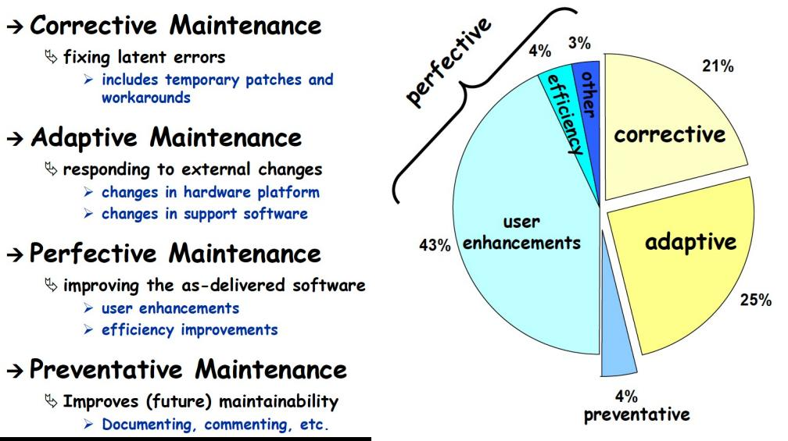
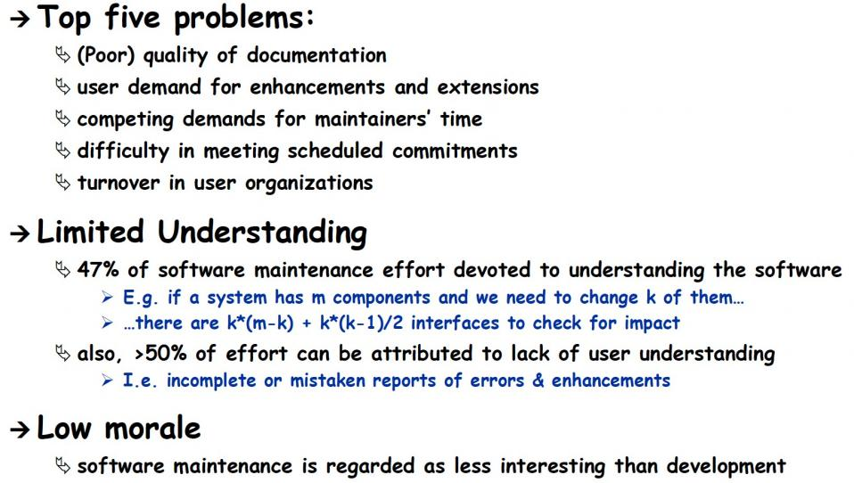
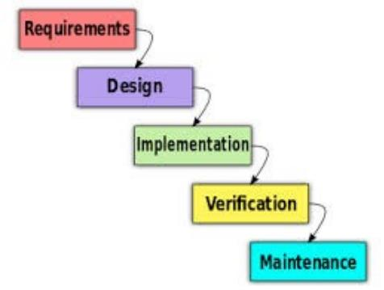
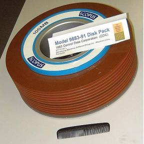

# Ch14 SoftwareMaintenance

<!-- page: 1 -->

Software  Maintenance

Spring, 2026

1

<!-- page: 2 -->

Contents

 What is Software Maintenance

 Types of Maintenance

 Evolutionary Design

 Modifying Code

2

<!-- page: 3 -->

1.   What is Software maintenance

“When the transition from development to evolution is
not seamless, the process of changing the software
after delivery is often called software maintenance”

 Modifying a program after it has been put into use
 Maintenance does not normally involve major changes to the system’s

architecture

 Changes are implemented by modifying existing components and

adding new components to the system
 Maintenance requires program understanding

3

<!-- page: 4 -->

Importance of maintenance

 Organizations have huge investments in their software systems -

they are critical business assets

 To maintain the value of these assets to the business, they must be

changed and updated

 Much of the software budget in large companies is for modifying

existing software

4

<!-- page: 5 -->

Software changes are inevitable

 We cannot avoid changing software

 New requirements emerge when the software is used
 The business environment changes
 Faults must be repaired
 New computers and equipment is added to the system
 The performance or reliability of the system may have to be improved

 Software is tightly coupled with the environment
 A key problem for organizations is implementing and managing

change to their existing software systems

5

<!-- page: 6 -->

Maintenance costs

 Usually higher than development costs (2 – 100 times depending on

the application)

 Affected by both technical and non-technical factors

 Increases as software evolves

 Maintenance corrupts the software structure, making further maintenance

more difficult

 Aging software can have high support costs (old languages,

compilers etc.)

6

<!-- page: 7 -->

Maintenance cost（workload） factors

 Team stability

 Maintenance costs are lower if the same staff stay involved
Contractual responsibility

 If the developers of a system are not responsible for maintenance, there is

no incentive to design for future change
Staff skills

 Maintenance staff are often inexperienced and don’t have much domain

knowledge
Program age and structure

 As programs age, changes degrade the code, design, and structure and

they become harder to understand and change

7

<!-- page: 8 -->

Additional maintenance terms

 Maintainability : The ease with which software can be modified
 Ripple effect : Changes in one software location can impact other

components
 Impact analysis : Process of identifying how a change in terms of

how a change will effect the rest ofthe system
 Traceability : The degree to which a relationship can be established

between two or more software artifacts

 Legacy systems : A software system that is still in use but the

development team is no longer active

8

<!-- page: 9 -->

Maintenance vs. Evolution

Software Maintenance

 Activities required to keep a software system operational after it

is deployed

Software Evolution

  Continuous changes from a lesser, simpler, or worse system to a

higher or better system

9

<!-- page: 10 -->

Software Evolution

“Software development does not stop when a
system is delivered but continues throughout the
lifetime of the system”

The system changes relate to changing needs—business and user
The system evolves continuously throughout its lifetime
Modern agile processes emphasize getting a few functionalities
running, then adding new behaviors over time

10

<!-- page: 11 -->

The pace of change is increasing

Hardware advances lead to
new, bigger software

applications

The rate of change (that is,
new features) is increasing

How can we deal with the spiraling need to
handle change ?

11

<!-- page: 12 -->

2. Types of Maintenance

12

<!-- page: 13 -->

Problems facing maintainers

13

<!-- page: 14 -->

3. Traditional software development

Production cost for software is very low
Distribution cost is substantial

 Includes marketing, sales, shipping
Support costs escalated
Software splits design into design and
implementation

 Both very expensive !

14

SWE 437

<!-- page: 15 -->

1900s software costs

Millions of customers skewed costs to the back end

 High support costs
 High distribution costs
New versions shipped every 4 to 6 years

 MS Office, CAD, compilers, operating systems
Software needed to be “perfect out of the box”

 Very expensive design
 Very expensive implementation—including testing more than 50% of the cost

Software evolution was very slow!

15

<!-- page: 16 -->

Research agenda

The need to be “perfect out of the box” heavily influenced decades
of SE research

 Formal methods
 Modeling the entire system at once
 Process
 Testing finished products
 Maintenance in terms of years
Much of our research focus and results assume :

 High design costs
 High implementation costs
 High distribution costs
 High support costs

16

SWE 437

<!-- page: 17 -->

Distribution costs

In the 1980s, technology started driving down distribution costs
for software …

17

SWE 437

<!-- page: 18 -->

2000s : The Web

Traditional software deployment methods

1.   Bundle
2.   Shrink-wrap
3.   Embed
4.  Contract

   The web

created a new
way to deploy
and distribute
software

A new software deployment method

5. Web Deployment

18

<!-- page: 19 -->

Distributing web software

Desktop software can be distributed across the web

 Zero-cost distribution
 Instantaneous distribution
 This allows more frequent updates
Web applications are not distributed at all in any meaningful sense

 Software resides on the servers
 Updates can be made weekly … daily … hourly … continuously!
Mobile applications allow the artisan to come into your “home” to
improve that rocking chair

19

SWE 437

<!-- page: 20 -->

Evolutionary software design

Pre-Web software design & production

 Strived for a perfect design, expensive development
 Deployed a new version ever 4 to 6 years
 Evolution was very slow

Post-Web software production

 Initial “pretty good” design and development
 Slowly make it bigger and better
 Faster evolution
 Immediate changes to web applications

•  Automatic updates of desktop applications
•  Software upgrades pushed out to mobile devices hourly

This changes all of software engineering !!

20

SWE 437

<!-- page: 21 -->

Software process

We have already seen process changes that are a direct result of
web deployment & distribution

Agile processes goals :

 Have a working, preliminary, version as fast as possible
 Continue growing the software to have more functionality and better

behavior
 Easy and fast to modify
 Adapt to sudden and frequent changes in planned behavior
Agile processes are widely used
Results are mixed, but use is growing quickly

How much do you know about agile processes ?

23

SWE 437

<!-- page: 22 -->

Architecture

Software architects often assume their high level design will not
change throughout development

 And the lifetime of the system
It is not clear how this supports software growth, rapid
deployment, and instantaneous distribution

Is this attitude compatible with agile processes ?
How does architecture design interact with refactoring ?

Your generation needs to deal with this

24

SWE 437

<!-- page: 23 -->

Software self-responsibility

Evolutionary design means we cannot know everything software will
ever do

Self-management means the software adapts behavior to runtime
changes—crucial for evolutionary design

Fault localization tries debug automatically, which can dramatically
cut the human effort required to fix software after testing

Automated defect repair goes one step further, and attempts to
automatically fix faults

Are you ready for the adaptive software revolution ?

25

SWE 437

<!-- page: 24 -->

Software Testing

 Test-driven design uses tests to drive requirements

 Every step is evolutionary
We must stop thinking of regression testing as something special done
“late in the process”

 Virtually all testing is now regression testing
Model-based testing allows test design to quickly and easily adapt to
changes

 Test automation is the key to running tests as quickly as software is
now changed

 Model to implementation ?
 Test oracle strategy ?

TDD is an important part of this class

26

SWE 437

<!-- page: 25 -->

Long term impact of evolutionary design

The end-result of large scale manufacturing was a heavy emphasis
on quantity over quality

The web enables evolutionary design, which can allow us to focus
on quality over quantity

27

SWE 437

<!-- page: 26 -->

4. Programming for maintainability

1.  Understanding the Program
2.  Programming for Change
3.  Coding Style

28

<!-- page: 27 -->

Major maintenance activities

We must understand an existing system before changing it

     How to make the change ?
    What are the potential ripple effects ?
     What skills and knowledge are required ?

Identify the change

 What to change, why to change it there
Manage the process … what resources are needed?
Understand the program

 How to make the change, determining the ripple effect
Make the change
 Test the change
Document and record the change

29

<!-- page: 28 -->

Comprehension process

Read
documentation

Dynamic analysis

Run the program

Read the
source code

Static analysis

30

<!-- page: 29 -->

What influences understanding?

Expertise : Domain knowledge, programming skills
Program structure : Modularity, level of nesting
Documentation : Readability, accuracy, up-to-date
Coding conventions : Naming style, small design patterns
 Comments : Accuracy, clarity, and usefulness
Program presentation : Good use of indentation and spacing

Sloppy programming creates

maintenance debt

31

<!-- page: 30 -->

Programming for maintainability

1.  Understanding the Program
2.  Programming for Change
3.  Coding Style

32

<!-- page: 31 -->

Avoid unnecessary fancy tricks

Write for humans, not compilers

 Fully parenthesize expressions
 Pointer arithmetic is anti-engineering
 Clever programming techniques are for kids, not engineers
In 1980, computers were slow and memory expensive

 Control flow dominated the running time
 Hence the undergraduate CS emphasis on analysis of algorithms
Today: Make it easier to change the program

 Readable code is easier to debug, more reliable, and more secure
 Optimizing compilers are far better than humans
 Overall architecture usually dominates running time

33

<!-- page: 32 -->

Document clearly

Include header blocks for each method (author & version)
Add a comment every time you stop to think

 Why a method does something is more important than what
 What is more important than how
Document :

 Assumptions
 Variables that can be overridden by child methods
 Reliance on default and superclass constructors
Write pseudocode as comments, then write the method

 Faster and more reliable
Use a version control system with an edit history

 Explain why each change was made clearly

34

<!-- page: 33 -->

Use white space effectively

A 1960s study asked “how far should we indent”

 2 — 4 characters is ideal
 Fewer is hard to see
 More makes programs too wide
Don’t use tabs — they look different in every editor and
printer

 Mixing tabs and spaces is even worse
Use plenty of spaces

 newList(x+y)=fName+space+lName+space+title;
 newList (x+y) = fName + space + lName + space + title;
Don’t put more than one statement per line

35

<!-- page: 34 -->

Write maintainable code

Be tidy

 Sloppy style looks like sloppy thinking
 Sloppy style creates maintenance debt
Use clear names

 Long names are simpler than short names
 Don’t make the so long they’re hard to read
Don’t test for error conditions you can’t handle

 Let them propagate to someone who does

If you can’t develop these habits, find a non-developer job

36

<!-- page: 35 -->

Java-specific tips

Implement both or neither equals() and hashCode()

 Implementing just one can cause some very subtle faults
Always override toString() to produce a human-readable description
of the object

If your class is cloneable, use super.clone(), not new()

 new() will break if another programmer inherits from your class
Threads are hard to get right and harder to modify
Don’t add error checking the VM already does

 Array bounds, null pointers, etc

37

<!-- page: 36 -->

Keep it simple

Long methods are not simple

 Good programmers write less code, not more
Bad designs lead to more and longer methods
Don’t generalize unless it’s necessary
 Ten programmers …

 deliver twice as much code
 four times as many faults, and
 half the functionality as
   … five programmers

38

<!-- page: 37 -->

Classes and objects

The point of OO design is to look at nouns (data) first,

then verbs (algorithms and methods)

Think about what it is, not what it does

 Class names should not be verbs
Objects are defined by state–the class defines behavior
Lots of switch statements may mean the class is trying to do too many
things

 Use inheritance or type parameterization
Make methods that don’t use class instance variables static
Don’t confuse inheritance with aggregation

 Inheritance implements “is-a”
 Aggregation implements “has-a”

39

<!-- page: 38 -->

Programming for change summary

The cost of writing a program is a small fraction of the cost of

fixing and maintaining it

…
Be an engineer !

Remember that

complexity
is the number one enemy of

maintainability

40

<!-- page: 39 -->

Programming for maintainability

1.  Understanding the Program
2.  Programming for Change
3.  Coding Style

41

<!-- page: 40 -->

Using style conventions

Select a set of style conventions

 Follow them strictly !
Follow the existing style when making changes

 Even if you do not like it
Lots of style conventions are available

 It is more important to be consistent than to have perfect style
Programmers need to be told to follow the team’s style

42

<!-- page: 41 -->

What style guides tell us

 Case for names

 Variables, methods, classes, …
Guidelines for choosing names
Width, special characters, and splitting lines
Location of statements
Organization of methods and use of types
Use of variables
Control structures
Proper spacing and white space
 Comments

43

<!-- page: 42 -->

Summary

Programming habits have a major impact on readability
Readability has a major impact on maintainability
Maintainability determines long-term costs

The minor decisions that engineers make determine how

much money the company makes

That is what engineering means !

44
