# Ch2 TestProcess

<!-- page: 1 -->

Testing in the Software Process

Spring, 2026

1

<!-- page: 2 -->

Contents

  Waterfall Model

   Spiral Model

  V Model

  W Model

  Agile Model - XP

2

<!-- page: 3 -->

1.   Waterfall Model

  All the planning is done at the beginning,

and once created it is not to be changed.

  There is no overlap between any of the

subsequent phases.

  Often anyone’s first chance to “see” the

program is at the very end once the
testing is complete.

3

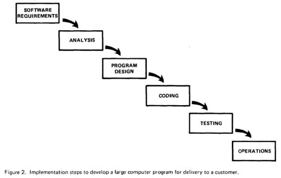

<!-- page: 4 -->

Waterfall Model – Strength& Weakness

The caption immediately below that figure, in the original paper,  is:

4

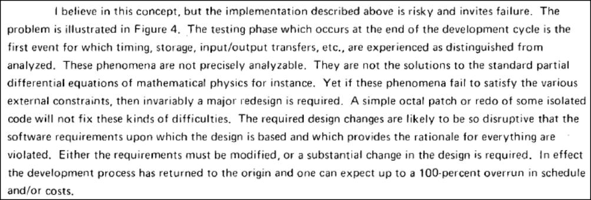

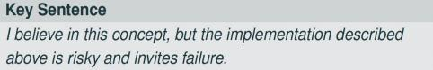

<!-- page: 5 -->

Waterfall Model – Strength& Weakness

 Strength:

1)  If time is spent early on making sure that the requirements and design
are absolutely correct, then this will save much time and effort later.

2)  There is an emphasis on documentation which keeps all knowledge in a
central repository and can be referenced easily by new members joining
the team.

5

<!-- page: 6 -->

Waterfall Model – Strength& Weakness

 Weakness:

1)  Few visible signs of progress until the end of the project

2)  It is not flexible to changes

3)  Time-consuming to produce all the documentation

4)  Tests are only carried out at the end – this could mean a compromise if
time or budgetary constraints exist

5)  Having to test the program as a whole could result in incomplete testing

6)  If testing does identify a fault that suggests a redesign it may be ignored
because of the trouble involved

7)  If the customer is unhappy it may incur a long maintenance phase
resolving their issues

6

<!-- page: 7 -->

2. Spiral Model

  Risk-driven development

process

  Combination of waterfall

model and Rapid Prototype
Iteration model

  Begins with a design goal

and ends with the client
reviewing the progress.

7

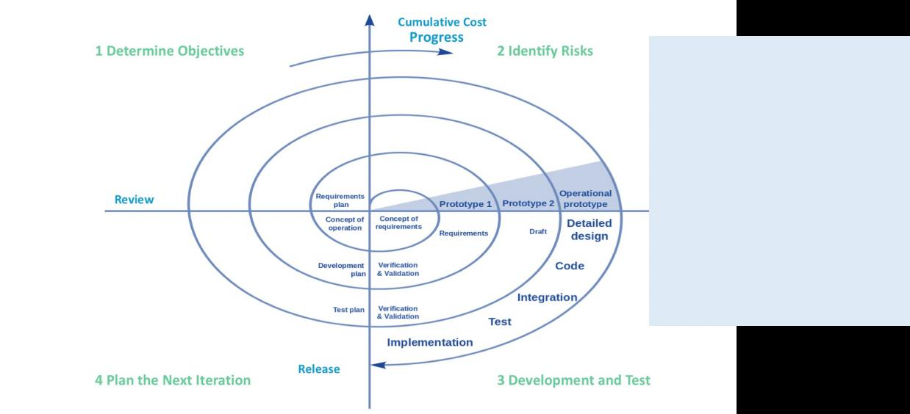

<!-- page: 8 -->

Sprial Model – Strength& Weakness

Strength
Weakness

Risk of not meeting the schedule or budget

Additional functionality or changes can be done
at a later stage

Spiral development works best for large projects only
also demands risk assessment expertise

Cost estimation becomes easy as the prototype
building is done in small fragments

Continuous or repeated development helps in risk
management

For its smooth operation spiral model protocol needs to
be followed strictly

Documentation is more as it has intermediate phases

Development is fast and features are added in a

systematic way in Spiral development

There is always a space for customer feedback
Spiral software development is not advisable for smaller
project, it might cost them a lot

8

<!-- page: 9 -->

3. V Model

  Extension of the Waterfall model

    emphasizes Verification & Validation by marking the relationships between each phase of the

life cycle and testing activities

  Once the code implementation is finished the testing begins.

  Starts with unit testing, and moves up one test level at a time until the acceptance testing

phase is completed

9

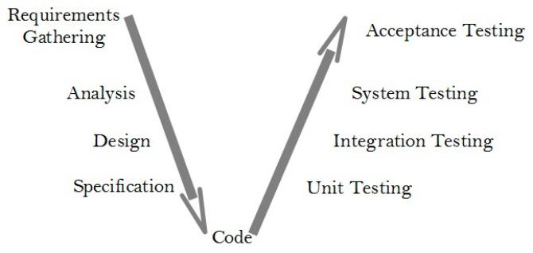

<!-- page: 10 -->

V Model

  Each document produced is associated with pairs of phases in the model.

– (a) the User Requirements Specification.    URS

– (b) the System Requirements Specification, SRS

– (c) the System Design Specifications,          SDS

– (d) Detailed Design Specifications,              DDS

10

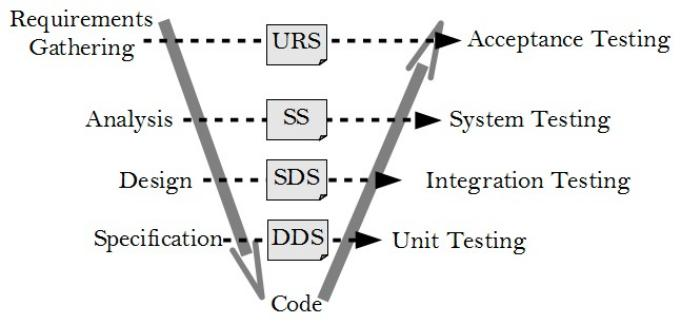

<!-- page: 11 -->

V Model – Strength& Weakness

Strength
Weakness

Like the Waterfall model , there is no working

It is simple and easy to manage due to the
rigidity of the model

software produced until late during the life cycle

It encourages Verification and Validation at all
phases

It is unsuitable where the requirements are at a
moderate to high risk of changing.

Each phase has specific deliverables and a
review process.

It has been suggested too that it is a poor model
for long, complex and object-oriented projects

It gives equal weight to testing alongside
development rather than treating it as an
afterthought at the end.

11

<!-- page: 12 -->

4. W Model

  Extension of V Model/Both V

  Testing is not after the code

implementation .

  Parallel to the development

process, the test process  is
carried  out.

  Co-operation between

development and testing

  Testing is more than just

construction, execution and
evaluation of test cases.

12

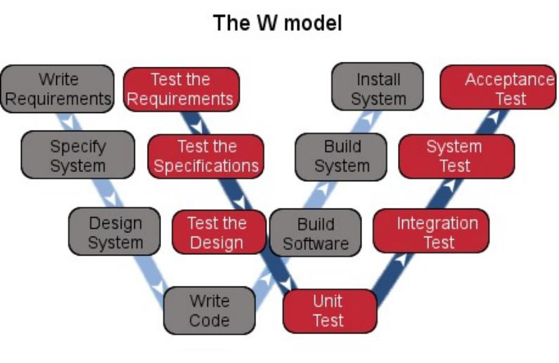

<!-- page: 13 -->

5. Agile Model

 Agile methods share with other incremental development methods an emphasis

on building releasable software in short time periods.

 However, Agile development differs from the other development models in that

its time periods are measured in weeks rather than months and work is performed
in a highly collaborative manner

13

<!-- page: 14 -->

Agile Model

For effective testing:

  – When the developers “negotiate” the requirements for the upcoming iteration

with the customers, the testers must be full participants in those conversations.

  – The testers immediately translate the requirements that are agreed upon in

those conversations into test cases.

  – When requirements change, testers are immediately involved because

everyone knows that the test cases must be changed accordingly.

14

<!-- page: 15 -->

Agile Model

For effective testing:

  – When the developers “negotiate” the requirements for the upcoming iteration

with the customers, the testers must be full participants in those conversations.

  – The testers immediately translate the requirements that are agreed upon in

those conversations into test cases.

  – When requirements change, testers are immediately involved because

everyone knows that the test cases must be changed accordingly.

15

<!-- page: 16 -->

Incremental Development

 The incremental model begins with a simple implementation of a part of the

software system. With each increment the product evolves with enhancements being
added every time until the final version is reached.

 Testing is an important part of the incremental model and is carried out at the end of

each iteration. This means that testing begins earlier in the development process and
that there is more of it overall.

 Much of the testing is of the form of regression testing, and much re-use can be

made of test cases and test data from earlier increments.

16

<!-- page: 17 -->

Incremental Development – Strength and Weakness

Strength
Weakness

The product is written and tested in smaller
pieces, reducing risk and allowing for change to be

It can be difficult to manage because of the lack of
documentation in comparison to other models

included easily

The customer or users is/are involved from the
beginning which means the system is more likely to
meet their requirements and they themselves are
more committed to the system

The continual change to the software can make it
difficult to maintain as it grows in size.

17

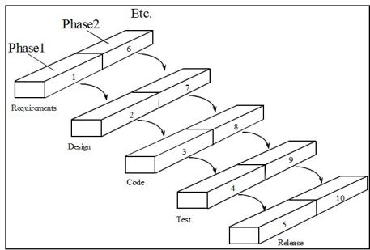

<!-- page: 18 -->

Extreme Programming

 Extreme Programming (XP) is a subset of the philosophy of Agile software development.

 It emphasizes code reviews, continuous integration and automated testing, and very short

iterations.

 It favours ongoing design refinement (or refactoring ), in place of a large initial design

phase, keeping the current implementation as simple as possible.

 It favours real-time communication, preferably face-to-face, over writing documents, and

working software is seen as the primary measure of progress.

 The methodology also emphasizes team work. Managers, customers, and developers are all

part of a team dedicated to delivering quality software.

 Programmers are responsible for testing their own work; testers are focused on helping the

customer select and write functional tests, and on running these tests regularly.

18

<!-- page: 19 -->

Extreme Programming -Value

Communication:

   XP programmers communicate with

their customers and fellow

programmers
Simplicity

   they keep their design simple and

clean
Feedback:

   Get feedback by software testing from

the start
Courage:

   Deliver the system to customers as

early as possible
   Implement changes as suggested,

responding with courage to changing
requirements

19

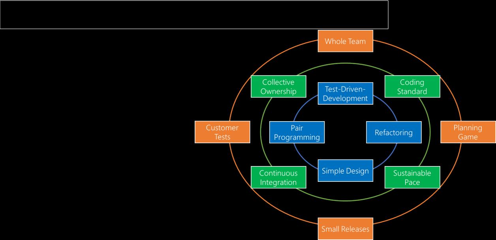

<!-- page: 20 -->

Extreme Programming - Process

20

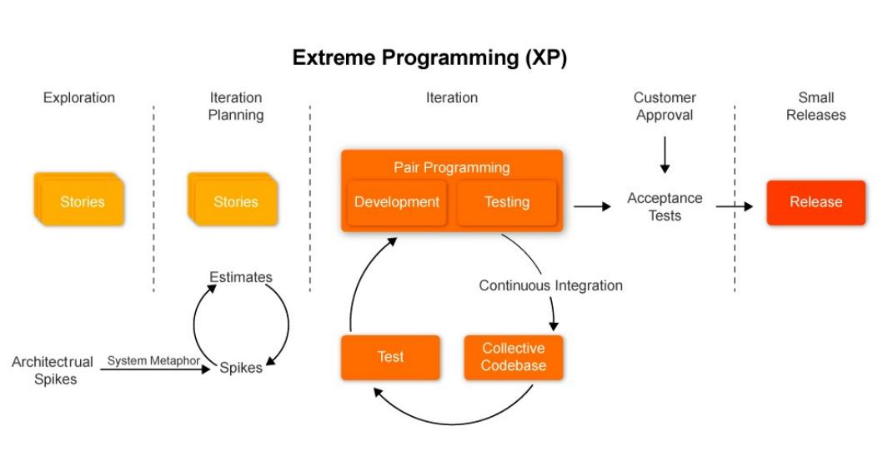

<!-- page: 21 -->

Extreme Programming - Process

21

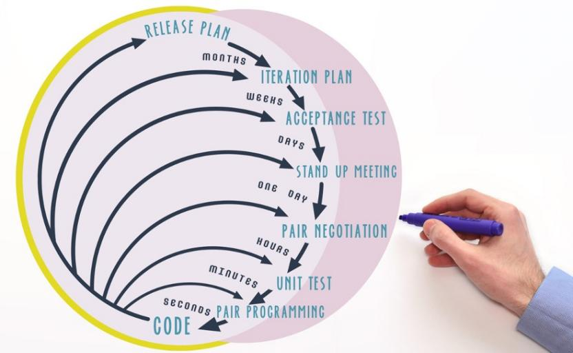

<!-- page: 22 -->

User Stories and Story Card

  A User Story is one or more sentences in

everyday language that captures one
aspect of what the software system will
need to do.

  These are usually written down on paper

cards termed as Story cards

  The Story Cards are ordered to reflect the

development of the system

  How should this be done? Prioritize the

most difficult or components first? Or in
the sequence of user actions?

22

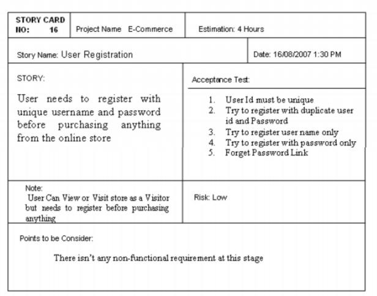

<!-- page: 23 -->

TDD - Test-Driven Development

Start                Write a test for

new capabiIity

Refactor as needed                             CompiIe

Fix compiIe

Run the test
And see it pass

errors

Write the code

Run the test
And see it faiI

23

<!-- page: 24 -->

测试驱动开发（TDD）示例

以银行账户类为例

讲解TDD开发流程

<!-- page: 25 -->

TDD 开发流程

•  1. 编写失败的测试
•  2. 实现最小代码使测试通过
•  3. 重构代码，优化实现
• 4. 保持所有测试通过

<!-- page: 26 -->

TDD 示例：测试代码

•      import unittest
•      from bank_account import BankAccount

•      class TestBankAccount(unittest.TestCase):
•         def setUp(self):
•             self.account = BankAccount(100)

•         def test_deposit(self):
•             self.account.deposit(50)
•             self.assertEqual(self.account.get_balance(), 150)

•         def test_withdraw(self):
•             self.account.withdraw(30)
•             self.assertEqual(self.account.get_balance(), 70)

•         def test_overdraft(self):
•             with self.assertRaises(ValueError):
•                self.account.withdraw(200)

•      if __name__ == "__main__":
•          unittest.main()

<!-- page: 27 -->

TDD 示例：BankAccount 类实现

•      class BankAccount:
•         def __init__(self, initial_balance=0):
•             if initial_balance < 0:
•                raise ValueError("初始余额不能为负")
•             self.balance = initial_balance

•         def deposit(self, amount):
•             if amount < 0:
•                raise ValueError("存款金额不能为负")
•             self.balance += amount

•         def withdraw(self, amount):
•             if amount > self.balance:
•                raise ValueError("余额不足")
•             if amount < 0:
•                raise ValueError("取款金额不能为负")
•             self.balance -= amount

•         def get_balance(self):
•             return self.balance

<!-- page: 28 -->

运行测试

•  执行以下命令运行测试：

•  $ python test_bank_account.py

•  如果所有测试都通过，说明代码实现正确
✅

<!-- page: 29 -->

代码优化（重构）

•   优化 withdraw 方法，提高可读性：

•   def withdraw(self, amount):

•       if amount < 0:

•          raise ValueError("取款金额不能为负")

•       if amount > self.balance:
•          raise ValueError("余额不足")

•       self.balance -= amount

•   这样优化后代码更清晰，符合 TDD 思路。

<!-- page: 30 -->

总结

•  - 先写测试（确保需求清晰）
• - 让测试通过（实现最小代码）
•  - 进行重构（优化代码结构）
• - 运行测试，确保代码无误

• TDD 可提升代码质量，降低 bug 率！

<!-- page: 31 -->

Two styles of testing

24

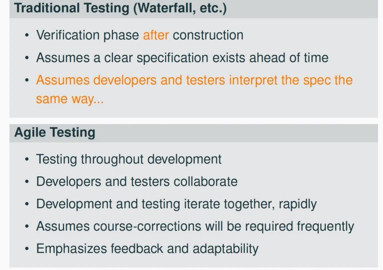
